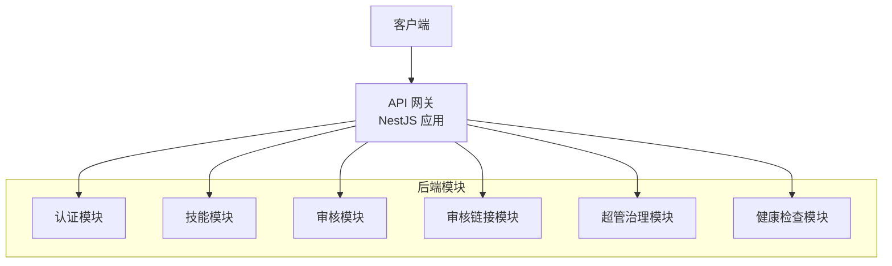
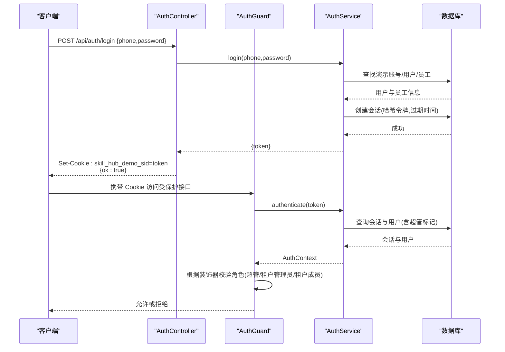
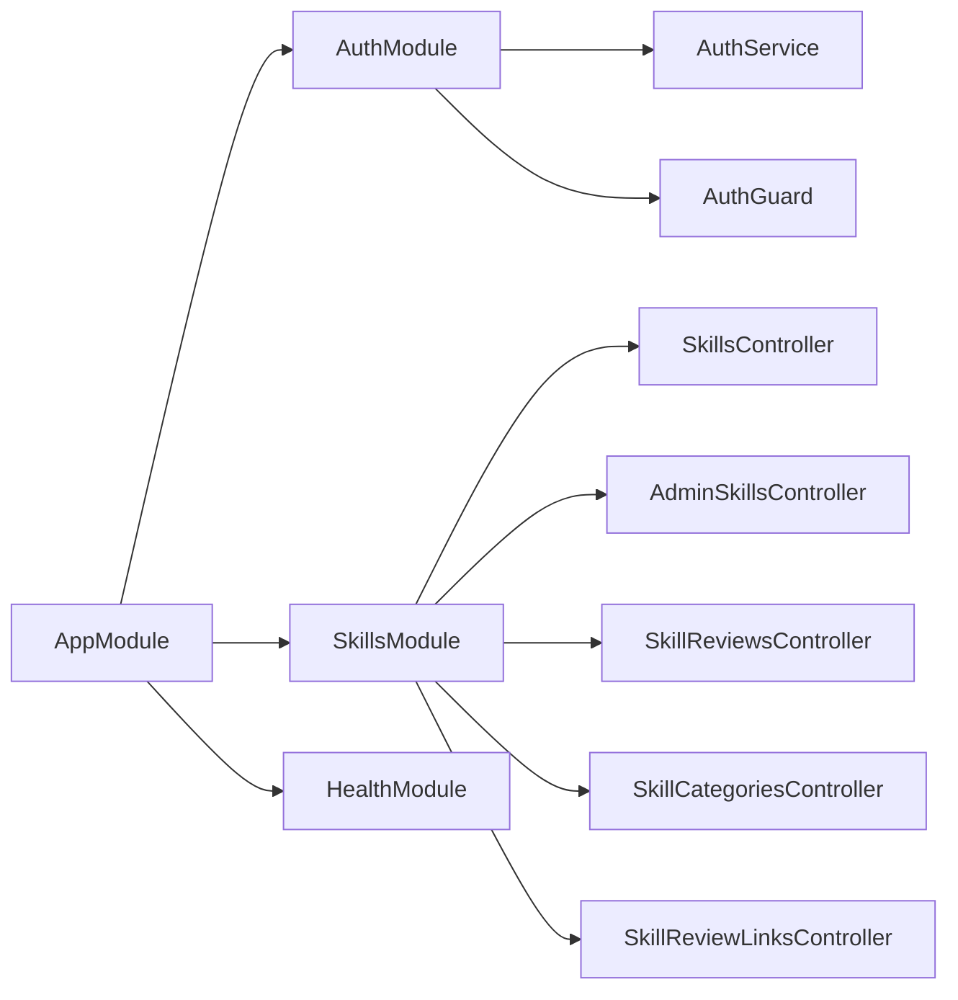
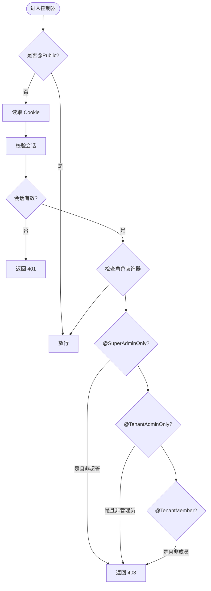

# API 接口文档

<cite>
**本文引用的文件**   
- [main.ts](file://apps/server/src/main.ts)
- [app.module.ts](file://apps/server/src/app.module.ts)
- [health.controller.ts](file://apps/server/src/health/health.controller.ts)
- [auth.controller.ts](file://apps/server/src/auth/auth.controller.ts)
- [auth.service.ts](file://apps/server/src/auth/auth.service.ts)
- [auth.guard.ts](file://apps/server/src/auth/auth.guard.ts)
- [decorators.ts](file://apps/server/src/auth/decorators.ts)
- [session.ts](file://apps/server/src/auth/session.ts)
- [skills.controller.ts](file://apps/server/src/skills/skills.controller.ts)
- [admin-skills.controller.ts](file://apps/server/src/skills/admin-skills.controller.ts)
- [skill-reviews.controller.ts](file://apps/server/src/skills/skill-reviews.controller.ts)
- [skill-review-links.controller.ts](file://apps/server/src/skills/skill-review-links.controller.ts)
- [skill-categories.controller.ts](file://apps/server/src/skills/skill-categories.controller.ts)
- [index.ts](file://packages/shared/src/index.ts)
- [auth.ts](file://packages/shared/src/auth.ts)
- [skill.ts](file://packages/shared/src/skill.ts)
</cite>

## 目录
1. [简介](#简介)
2. [项目结构](#项目结构)
3. [核心组件](#核心组件)
4. [架构总览](#架构总览)
5. [详细接口说明](#详细接口说明)
6. [依赖分析](#依赖分析)
7. [性能与限制](#性能与限制)
8. [故障排查](#故障排查)
9. [结论](#结论)
10. [附录](#附录)

## 简介
本文件为 Skill Hub Teaching 后端 RESTful API 的完整参考文档。内容覆盖认证、技能管理、审核流程、分类管理与健康检查等模块，包含每个接口的 HTTP 方法、路径、请求参数、响应结构与错误码说明；同时提供 Cookie 会话认证机制、权限校验流程、版本策略与兼容性说明，以及速率限制与安全最佳实践建议，帮助前端开发者与第三方集成人员准确调用各接口。

## 项目结构
后端基于 NestJS 模块化架构，入口启动应用并加载全局配置；共享类型定义位于 packages/shared，供前后端共用。主要模块包括：
- 认证模块：登录、登出、当前用户信息、Cookie 会话与权限守卫
- 技能模块：技能目录、详情、上传、版本管理、可见性与分类
- 审核模块：提交、撤回、通过、驳回、直接发布与审核记录
- 审核链接模块：仅凭登录态访问的只读审阅页面数据与文件预览
- 超管治理模块：跨租户查看、下载、下架/上架、删除
- 健康检查模块：服务与数据库连通性探测

图表来源
- [main.ts:8-11](file://apps/server/src/main.ts#L8-L11)
- [app.module.ts:7-9](file://apps/server/src/app.module.ts#L7-L9)

章节来源
- [main.ts:1-14](file://apps/server/src/main.ts#L1-L14)
- [app.module.ts:1-10](file://apps/server/src/app.module.ts#L1-L10)

## 核心组件
- 认证与会话
  - 使用 Cookie 存储会话令牌，服务端校验后在请求对象上挂载认证上下文（用户、是否超管、当前租户、管理员/员工身份）。
  - 默认所有接口需登录；可通过装饰器控制公开接口、超管专用、租户管理员专用、租户成员专用。
- 技能与版本
  - 支持新建、上传新版本、替换草稿包、删除版本/技能、修改可见性与分类、列出目录与管理视图、下载包。
  - 版本号遵循语义化版本，服务端进行格式与大小比较校验。
- 审核流程
  - 支持提交、撤回、通过、驳回、直接发布；维护审核记录与待审核列表；提供按页查询审核记录。
- 审核链接
  - 提供仅凭登录态访问的审阅页面数据与文件预览，不依赖会话当前租户。
- 分类管理
  - 租户内分类增删改查，支持一键添加常用分类。
- 超管治理
  - 跨租户查看、下载任意版本、下架/上架、删除技能。
- 健康检查
  - 返回服务状态与数据库连通性。

章节来源
- [auth.controller.ts:9-25](file://apps/server/src/auth/auth.controller.ts#L9-L25)
- [auth.guard.ts:13-48](file://apps/server/src/auth/auth.guard.ts#L13-L48)
- [skills.controller.ts:11-144](file://apps/server/src/skills/skills.controller.ts#L11-L144)
- [skill-reviews.controller.ts:8-75](file://apps/server/src/skills/skill-reviews.controller.ts#L8-L75)
- [skill-review-links.controller.ts:7-32](file://apps/server/src/skills/skill-review-links.controller.ts#L7-L32)
- [skill-categories.controller.ts:8-46](file://apps/server/src/skills/skill-categories.controller.ts#L8-L46)
- [admin-skills.controller.ts:8-53](file://apps/server/src/skills/admin-skills.controller.ts#L8-L53)
- [health.controller.ts:6-20](file://apps/server/src/health/health.controller.ts#L6-L20)

## 架构总览
下图展示认证守卫如何解析 Cookie、校验会话、注入角色权限，并将认证上下文挂到请求对象上，供控制器使用。

图表来源
- [auth.controller.ts:12-24](file://apps/server/src/auth/auth.controller.ts#L12-L24)
- [auth.service.ts:15-35](file://apps/server/src/auth/auth.service.ts#L15-L35)
- [auth.guard.ts:20-46](file://apps/server/src/auth/auth.guard.ts#L20-L46)

## 详细接口说明

### 通用约定
- 基础路径
  - 所有接口以 `/api` 为前缀。
- 认证方式
  - 使用 Cookie `skill_hub_demo_sid` 传递会话令牌。
  - 登录后服务端设置 Cookie；登出时清除 Cookie。
- 权限模型
  - 默认需要登录；可使用以下装饰器控制访问：
    - 公开接口：无需登录
    - 超管专用：仅系统超管
    - 租户管理员专用：当前租户的管理员
    - 租户成员专用：当前租户的启用中员工
- 统一响应体
  - 成功：通常为业务对象或空响应（部分接口返回 204 No Content）
  - 失败：标准错误体包含 statusCode、message、可选 code
- 分页
  - 采用 page/pageSize 参数，返回 items 与 total
- 文件上传
  - multipart/form-data，字段 file 为 zip；其他表单字段随 Body 解析
- 错误码
  - 401 未授权：未登录或会话无效
  - 403 禁止访问：权限不足
  - 404 资源不存在
  - 409 冲突：如名称已存在
  - 413/415/422 上传相关：大小/格式/校验失败
  - 500 服务器内部错误

章节来源
- [index.ts:1-8](file://packages/shared/src/index.ts#L1-L8)
- [auth.ts:1-39](file://packages/shared/src/auth.ts#L1-L39)
- [skill.ts:1-401](file://packages/shared/src/skill.ts#L1-L401)

### 认证接口
- 登录
  - 方法：POST
  - 路径：/api/auth/login
  - 请求体：{ phone, password }
  - 响应：{ ok: true }
  - 行为：验证演示账号与用户档案，创建会话，设置 Cookie
  - 错误：401 账号或密码错误；401 演示账号尚未初始化
- 登出
  - 方法：POST
  - 路径：/api/auth/logout
  - 响应：204 No Content
  - 行为：销毁会话，清除 Cookie
- 获取当前用户
  - 方法：GET
  - 路径：/api/auth/me
  - 响应：{ user, employees, currentTenantId }
  - 行为：返回用户信息与所属租户档案列表及当前租户 ID

示例
- 登录请求
  - 请求体：{ "phone": "13800000000", "password": "demo123" }
  - 响应：{ "ok": true }
  - 响应头：Set-Cookie: skill_hub_demo_sid=<token>; HttpOnly; SameSite=Lax; Path=/
- 获取当前用户响应
  - {
      "user": { "id":"u1","phone":"138...","name":"张三","nickname":"zhangsan","email":"zhang@example.com","isSuperAdmin":false },
      "employees": [ { "id":"e1","tenant":{"id":"t1","name":"公司A","avatarUrl":null,"status":"active"},"status":"active","isTenantAdmin":true } ],
      "currentTenantId":"t1"
    }

章节来源
- [auth.controller.ts:9-25](file://apps/server/src/auth/auth.controller.ts#L9-L25)
- [auth.service.ts:15-74](file://apps/server/src/auth/auth.service.ts#L15-L74)
- [auth.ts:1-32](file://packages/shared/src/auth.ts#L1-L32)

### 技能管理接口
- 列出技能目录
  - 方法：GET
  - 路径：/api/skills
  - 查询参数：keyword, uploaderId, categoryId
  - 响应：SkillSummary[]
  - 权限：租户成员
- 管理视图（租户管理员）
  - 方法：GET
  - 路径：/api/skills/manage
  - 查询参数：keyword, uploaderId, categoryId, status, visibility, unlisted
  - 响应：SkillManageRow[]
  - 权限：租户管理员
- 可见性选项（部门树与在职员工）
  - 方法：GET
  - 路径：/api/skills/visibility-options
  - 响应：SkillVisibilityOptions
  - 权限：租户成员
- 我的技能
  - 方法：GET
  - 路径：/api/skills/mine
  - 响应：MySkill[]
  - 权限：租户成员
- 获取技能详情
  - 方法：GET
  - 路径：/api/skills/:id
  - 响应：SkillDetail
  - 权限：租户成员
- 新建技能（上传 zip）
  - 方法：POST
  - 路径：/api/skills
  - 请求体：multipart/form-data
    - file: zip
    - version: x.y.z
    - mode: publish|draft|submit
    - visibility.visibility: tenant|departments|employees|private
    - visibility.departmentIds?: string[]
    - visibility.employeeIds?: string[]
    - categoryId?: string
  - 响应：SkillDetail
  - 权限：租户成员
- 修改可见性
  - 方法：PATCH
  - 路径：/api/skills/:id/visibility
  - 请求体：{ visibility, departmentIds?, employeeIds? }
  - 响应：SkillDetail
  - 权限：所有者或租户管理员
- 修改分类
  - 方法：PATCH
  - 路径：/api/skills/:id/category
  - 请求体：{ categoryId: string|null }
  - 响应：SkillDetail
  - 权限：所有者或租户管理员
- 上传新版本
  - 方法：POST
  - 路径：/api/skills/:id/versions
  - 请求体：multipart/form-data
    - file: zip
    - version: x.y.z
    - mode: draft|submit
  - 响应：SkillDetail
  - 权限：所有者或租户管理员
- 替换草稿包（被驳回后重新上传，版本号不变）
  - 方法：PUT
  - 路径：/api/skills/:id/versions/:versionId/package
  - 请求体：multipart/form-data
    - file: zip
  - 响应：SkillDetail
  - 权限：所有者或租户管理员
- 删除单个版本
  - 方法：DELETE
  - 路径：/api/skills/:id/versions/:versionId
  - 响应：204 No Content
  - 权限：租户管理员可删任意版本；其他人只能删自己的草稿
- 删除整个技能
  - 方法：DELETE
  - 路径：/api/skills/:id
  - 响应：204 No Content
  - 权限：所有者或租户管理员
- 下架/上架（租户管理员）
  - 方法：POST
  - 路径：/api/skills/:id/unlist | /api/skills/:id/relist
  - 响应：204 No Content
  - 权限：租户管理员
- 下载技能包
  - 方法：GET
  - 路径：/api/skills/:id/versions/:versionId/download
  - 响应：application/zip 流式文件
  - 权限：租户成员（受可见性控制）

示例
- 新建技能请求
  - 表单字段：file(zip), version="1.0.0", mode="draft", categoryId="c1"
  - 响应：SkillDetail（包含 workingVersion.status="draft"）
- 下载响应
  - 响应头：Content-Type: application/zip; Content-Disposition: attachment; filename="example.zip"

章节来源
- [skills.controller.ts:11-144](file://apps/server/src/skills/skills.controller.ts#L11-L144)
- [skill.ts:158-401](file://packages/shared/src/skill.ts#L158-L401)

### 审核接口
- 待审核列表（租户管理员）
  - 方法：GET
  - 路径：/api/skills/reviews
  - 响应：PendingSkillReview[]
  - 权限：租户管理员
- 全租户审核记录（分页）
  - 方法：GET
  - 路径：/api/skills/reviews/records
  - 查询参数：page, pageSize
  - 响应：{ items, total, page, pageSize }
  - 权限：租户管理员
- 菜单红点（待审核数与被驳回草稿数）
  - 方法：GET
  - 路径：/api/skills/badges
  - 响应：SkillBadges
  - 权限：租户成员
- 提交审核
  - 方法：POST
  - 路径：/api/skills/:id/versions/:versionId/submit
  - 响应：204 No Content
  - 权限：所有者
- 撤回审核
  - 方法：POST
  - 路径：/api/skills/:id/versions/:versionId/withdraw
  - 响应：204 No Content
  - 权限：所有者
- 通过审核（租户管理员）
  - 方法：POST
  - 路径：/api/skills/:id/versions/:versionId/approve
  - 响应：204 No Content
  - 权限：租户管理员
- 驳回审核（租户管理员）
  - 方法：POST
  - 路径：/api/skills/:id/versions/:versionId/reject
  - 请求体：{ comment }
  - 响应：204 No Content
  - 权限：租户管理员
- 直接发布（租户管理员）
  - 方法：POST
  - 路径：/api/skills/:id/versions/:versionId/publish
  - 响应：204 No Content
  - 权限：租户管理员

示例
- 驳回请求
  - 请求体：{ "comment": "描述不完整，请补充" }
  - 响应：204 No Content

章节来源
- [skill-reviews.controller.ts:8-75](file://apps/server/src/skills/skill-reviews.controller.ts#L8-L75)
- [skill.ts:147-376](file://packages/shared/src/skill.ts#L147-L376)

### 审核链接接口
- 打开审阅页面数据
  - 方法：GET
  - 路径：/api/skills/review-links/:versionId
  - 响应：SkillReviewView
  - 权限：仅需登录；按身份授权（租户管理员、所有者、超管）
- 下载审阅包（不计入下载次数）
  - 方法：GET
  - 路径：/api/skills/review-links/:versionId/download
  - 响应：application/zip 流式文件
  - 权限：仅需登录
- 预览包内文件
  - 方法：GET
  - 路径：/api/skills/review-links/:versionId/file
  - 查询参数：path（相对 Skill 根目录的路径）
  - 响应：SkillFilePreview
  - 权限：仅需登录

示例
- 预览文本文件
  - 请求：GET /api/skills/review-links/v1/file?path=README.md
  - 响应：{ path:"README.md", size:1024, binary:false, content:"...", truncated:false }

章节来源
- [skill-review-links.controller.ts:7-32](file://apps/server/src/skills/skill-review-links.controller.ts#L7-L32)
- [skill.ts:295-315](file://packages/shared/src/skill.ts#L295-L315)

### 分类管理接口
- 列出分类（租户管理员额外返回 skillCount）
  - 方法：GET
  - 路径：/api/skills/categories
  - 响应：SkillCategoryItem[]
  - 权限：租户成员
- 新增分类（租户管理员）
  - 方法：POST
  - 路径：/api/skills/categories
  - 请求体：{ name }
  - 响应：SkillCategoryItem[]
  - 权限：租户管理员
- 一键添加常用分类（租户管理员）
  - 方法：POST
  - 路径：/api/skills/categories/presets
  - 响应：SkillCategoryItem[]
  - 权限：租户管理员
- 重命名分类（租户管理员）
  - 方法：PATCH
  - 路径：/api/skills/categories/:id
  - 请求体：{ name }
  - 响应：SkillCategoryItem[]
  - 权限：租户管理员
- 删除分类（租户管理员）
  - 方法：DELETE
  - 路径：/api/skills/categories/:id
  - 响应：204 No Content
  - 权限：租户管理员

章节来源
- [skill-categories.controller.ts:8-46](file://apps/server/src/skills/skill-categories.controller.ts#L8-L46)
- [skill.ts:171-196](file://packages/shared/src/skill.ts#L171-L196)

### 超管治理接口
- 列出租户
  - 方法：GET
  - 路径：/api/admin/tenants
  - 响应：租户列表
  - 权限：超管
- 按租户列出技能（管理视图）
  - 方法：GET
  - 路径：/api/admin/tenants/:tenantId/skills
  - 查询参数：同管理视图筛选
  - 响应：SkillManageRow[]
  - 权限：超管
- 获取技能详情（超管）
  - 方法：GET
  - 路径：/api/admin/skills/:id
  - 响应：SkillDetail
  - 权限：超管
- 下载任意版本（不计入下载次数）
  - 方法：GET
  - 路径：/api/admin/skills/:id/versions/:versionId/download
  - 响应：application/zip 流式文件
  - 权限：超管
- 下架/上架（超管）
  - 方法：POST
  - 路径：/api/admin/skills/:id/unlist | /api/admin/skills/:id/relist
  - 响应：204 No Content
  - 权限：超管
- 删除技能（超管）
  - 方法：DELETE
  - 路径：/api/admin/skills/:id
  - 响应：204 No Content
  - 权限：超管

章节来源
- [admin-skills.controller.ts:8-53](file://apps/server/src/skills/admin-skills.controller.ts#L8-L53)

### 健康检查接口
- 健康检查
  - 方法：GET
  - 路径：/api/health
  - 响应：{ status:"ok"|"error", db:"up"|"down" }
  - 权限：公开

示例
- 正常：{ "status":"ok","db":"up" }
- 异常：{ "status":"error","db":"down" }

章节来源
- [health.controller.ts:6-20](file://apps/server/src/health/health.controller.ts#L6-L20)
- [index.ts:3-8](file://packages/shared/src/index.ts#L3-L8)

## 依赖分析
- 模块装配
  - 应用模块导入 PrismaModule、AuthModule、HealthModule、SkillsModule
- 控制器与守卫
  - 认证守卫负责解析 Cookie、校验会话、注入角色权限
  - 控制器通过装饰器声明权限级别
- 共享类型
  - 接口请求/响应类型集中在 packages/shared，保证前后端一致

图表来源
- [app.module.ts:7-9](file://apps/server/src/app.module.ts#L7-L9)
- [auth.guard.ts:13-48](file://apps/server/src/auth/auth.guard.ts#L13-L48)
- [skills.controller.ts:11-144](file://apps/server/src/skills/skills.controller.ts#L11-L144)
- [admin-skills.controller.ts:12-53](file://apps/server/src/skills/admin-skills.controller.ts#L12-L53)
- [skill-reviews.controller.ts:12-75](file://apps/server/src/skills/skill-reviews.controller.ts#L12-L75)
- [skill-categories.controller.ts:9-46](file://apps/server/src/skills/skill-categories.controller.ts#L9-L46)
- [skill-review-links.controller.ts:11-32](file://apps/server/src/skills/skill-review-links.controller.ts#L11-L32)

章节来源
- [app.module.ts:1-10](file://apps/server/src/app.module.ts#L1-L10)

## 性能与限制
- 速率限制
  - 代码库未实现显式速率限制；建议在反向代理层（如 Nginx/网关）配置限流策略，对登录、上传等敏感接口加强防护。
- 文件大小与数量
  - Skill 包解压后最大 20MB，最多 500 个文件；超出将返回中文提示。
- 文件名与路径安全
  - 忽略 .DS_Store/.git/node_modules/__pycache 等目录；非法路径（绝对路径或包含 ..）将被拒绝。
- 预览上限
  - 文本预览最多返回 512KB 字符，超出将截断。
- 并发与下载
  - 下载接口返回流式文件；审核链接与超管下载的下载计数不计入常规统计。

章节来源
- [skill.ts:3-21](file://packages/shared/src/skill.ts#L3-L21)
- [skill.ts:34-48](file://packages/shared/src/skill.ts#L34-L48)
- [skill.ts:292-293](file://packages/shared/src/skill.ts#L292-L293)

## 故障排查
- 401 未授权
  - 可能原因：未登录、Cookie 缺失、会话过期
  - 处理：重新登录，确保 Cookie 正确发送
- 403 禁止访问
  - 可能原因：非超管访问超管接口；非租户管理员访问租户管理员接口；非租户成员访问租户接口
  - 处理：切换至正确的租户或使用具备相应角色的账号
- 409 名称冲突
  - 可能原因：新建 Skill 时名称已存在
  - 处理：使用已有 Skill 的 ID 引导用户上传新版本
- 413/415/422 上传错误
  - 可能原因：压缩包过大、文件数超限、SKILL.md frontmatter 格式不正确、版本号格式错误
  - 处理：调整包大小与文件数，修正 SKILL.md 与版本号格式
- 500 服务器错误
  - 可能原因：数据库不可用或内部异常
  - 处理：检查数据库连接与服务日志

章节来源
- [auth.guard.ts:20-46](file://apps/server/src/auth/auth.guard.ts#L20-L46)
- [skill.ts:52-71](file://packages/shared/src/skill.ts#L52-L71)
- [skill.ts:73-87](file://packages/shared/src/skill.ts#L73-L87)

## 结论
本 API 文档覆盖了认证、技能管理、审核、分类与超管治理等核心能力，明确了权限模型、Cookie 会话机制与错误处理策略。建议在生产环境结合网关层实施速率限制与审计，严格校验上传内容与路径，确保数据安全与系统稳定。

## 附录

### 认证机制与权限流程
- Cookie 会话
  - 登录成功后设置 Cookie：skill_hub_demo_sid
  - 会话有效期：30 天
  - 登出时清除 Cookie
- 权限装饰器
  - @Public：公开接口
  - @SuperAdminOnly：仅超管
  - @TenantAdminOnly：仅租户管理员
  - @TenantMember：仅租户成员
- 请求上下文
  - req.auth：认证上下文（用户、是否超管、当前租户、管理员/员工身份）

图表来源
- [auth.guard.ts:20-46](file://apps/server/src/auth/auth.guard.ts#L20-L46)
- [decorators.ts:4-17](file://apps/server/src/auth/decorators.ts#L4-L17)
- [session.ts:3-23](file://apps/server/src/auth/session.ts#L3-L23)

章节来源
- [auth.controller.ts:8-24](file://apps/server/src/auth/auth.controller.ts#L8-L24)
- [auth.service.ts:15-35](file://apps/server/src/auth/auth.service.ts#L15-L35)
- [auth.guard.ts:13-48](file://apps/server/src/auth/auth.guard.ts#L13-L48)
- [decorators.ts:4-17](file://apps/server/src/auth/decorators.ts#L4-L17)
- [session.ts:3-23](file://apps/server/src/auth/session.ts#L3-L23)

### 接口版本策略与向后兼容
- 版本策略
  - 当前未引入 URL 版本前缀（如 /v1），通过共享类型与契约保持稳定
- 向后兼容
  - 新增字段采用可选字段；删除字段需废弃周期与迁移计划
  - 变更枚举值需保持旧值兼容或提供映射
- 建议
  - 未来如需重大变更，可在 API 前增加版本段（如 /api/v1），并通过网关路由兼容旧版本

[本节为概念性说明，不直接分析具体文件]

### 安全考虑与最佳实践
- 传输安全
  - 生产环境启用 SESSION_COOKIE_SECURE=true，强制 HTTPS
- Cookie 安全
  - HttpOnly、SameSite=Lax，防止 XSS/CSRF 风险
- 输入校验
  - 严格校验版本号、SKILL.md frontmatter、路径合法性
- 访问控制
  - 最小权限原则：仅授予必要角色
- 审计与监控
  - 记录关键操作（提交、通过、驳回、下架/上架、删除）
  - 监控异常登录与频繁失败

章节来源
- [auth.controller.ts:8-8](file://apps/server/src/auth/auth.controller.ts#L8-L8)
- [skill.ts:34-48](file://packages/shared/src/skill.ts#L34-L48)
- [skill.ts:52-71](file://packages/shared/src/skill.ts#L52-L71)