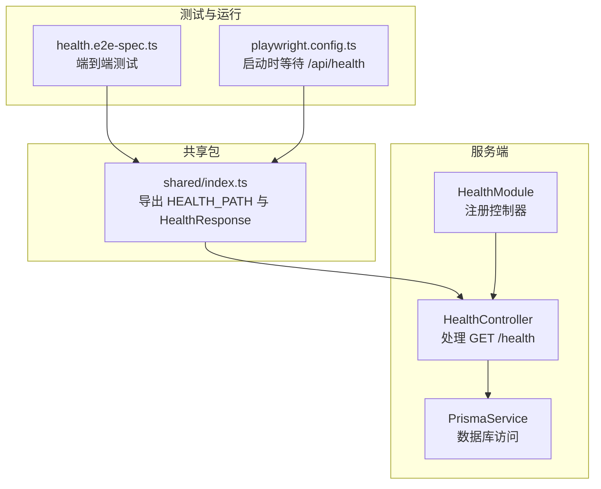
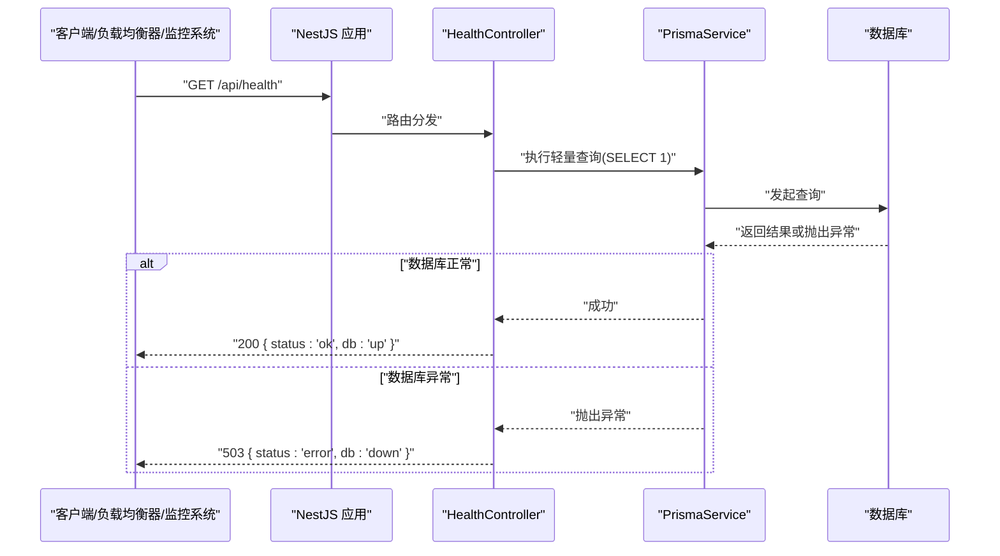
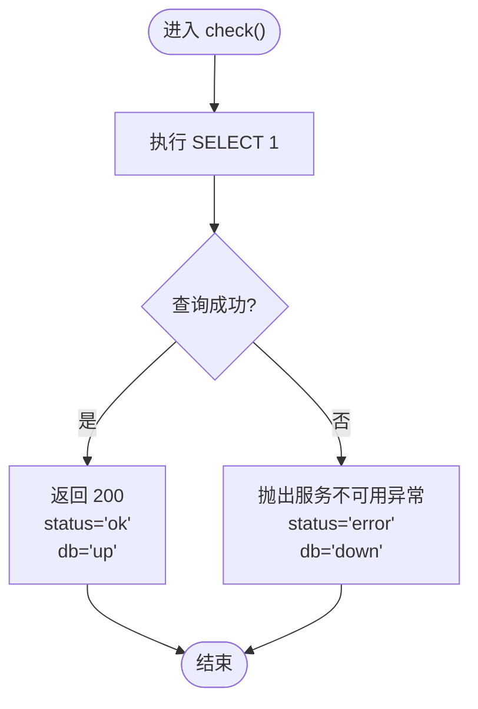
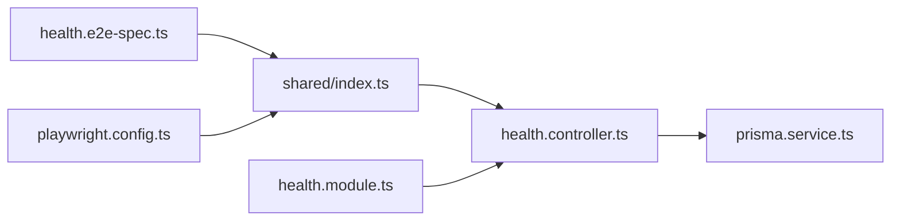

# 健康检查接口

<cite>
**本文引用的文件**   
- [apps/server/src/health/health.controller.ts](file://apps/server/src/health/health.controller.ts)
- [apps/server/src/health/health.module.ts](file://apps/server/src/health/health.module.ts)
- [packages/shared/src/index.ts](file://packages/shared/src/index.ts)
- [apps/server/test/health.e2e-spec.ts](file://apps/server/test/health.e2e-spec.ts)
- [apps/web/playwright.config.ts](file://apps/web/playwright.config.ts)
</cite>

## 目录
1. [简介](#简介)
2. [项目结构](#项目结构)
3. [核心组件](#核心组件)
4. [架构总览](#架构总览)
5. [详细组件分析](#详细组件分析)
6. [依赖关系分析](#依赖关系分析)
7. [性能与可用性考虑](#性能与可用性考虑)
8. [故障排查指南](#故障排查指南)
9. [结论](#结论)
10. [附录：调用示例与监控集成](#附录调用示例与监控集成)

## 简介
本文件说明后端提供的健康检查接口 GET /api/health，用于系统监控与服务状态检测。该接口会检查应用自身是否可用，并探测数据库连接是否正常，返回统一的健康状态信息。它适用于负载均衡器、容器编排平台、运维监控系统等场景，帮助快速发现服务不可用或依赖异常。

## 项目结构
健康检查功能位于服务端模块中，采用 NestJS 的控制器与模块组织方式；响应类型定义在共享包中，便于前后端保持一致。

图表来源
- [apps/server/src/health/health.controller.ts:1-20](file://apps/server/src/health/health.controller.ts#L1-L20)
- [apps/server/src/health/health.module.ts:1-7](file://apps/server/src/health/health.module.ts#L1-L7)
- [packages/shared/src/index.ts:1-12](file://packages/shared/src/index.ts#L1-L12)
- [apps/server/test/health.e2e-spec.ts:1-22](file://apps/server/test/health.e2e-spec.ts#L1-L22)
- [apps/web/playwright.config.ts:12-19](file://apps/web/playwright.config.ts#L12-L19)

章节来源
- [apps/server/src/health/health.controller.ts:1-20](file://apps/server/src/health/health.controller.ts#L1-L20)
- [apps/server/src/health/health.module.ts:1-7](file://apps/server/src/health/health.module.ts#L1-L7)
- [packages/shared/src/index.ts:1-12](file://packages/shared/src/index.ts#L1-L12)
- [apps/server/test/health.e2e-spec.ts:1-22](file://apps/server/test/health.e2e-spec.ts#L1-L22)
- [apps/web/playwright.config.ts:12-19](file://apps/web/playwright.config.ts#L12-L19)

## 核心组件
- 健康控制器：暴露 GET /health 路由，对外提供健康检查能力，并对数据库进行轻量探测。
- 健康模块：将健康控制器注册到 NestJS 应用中。
- 共享类型：定义健康响应体结构与路径常量，确保客户端与服务器一致。
- 端到端测试：验证接口路径与响应格式是否符合预期。
- Playwright 配置：在启动 Web 测试前通过 /api/health 判断后端就绪。

章节来源
- [apps/server/src/health/health.controller.ts:1-20](file://apps/server/src/health/health.controller.ts#L1-L20)
- [apps/server/src/health/health.module.ts:1-7](file://apps/server/src/health/health.module.ts#L1-L7)
- [packages/shared/src/index.ts:1-12](file://packages/shared/src/index.ts#L1-L12)
- [apps/server/test/health.e2e-spec.ts:1-22](file://apps/server/test/health.e2e-spec.ts#L1-L22)
- [apps/web/playwright.config.ts:12-19](file://apps/web/playwright.config.ts#L12-L19)

## 架构总览
GET /api/health 的请求流程如下：

图表来源
- [apps/server/src/health/health.controller.ts:11-19](file://apps/server/src/health/health.controller.ts#L11-L19)
- [apps/server/test/health.e2e-spec.ts:17-20](file://apps/server/test/health.e2e-spec.ts#L17-L20)

## 详细组件分析

### 健康控制器 HealthController
职责
- 暴露 GET /health 接口。
- 对数据库进行最小化连通性检查。
- 根据检查结果返回不同状态码与响应体。

关键行为
- 使用 PrismaService 执行 SELECT 1 以探测数据库连通性。
- 若数据库不可用，抛出服务不可用异常，返回 503 与错误健康体。
- 若数据库正常，返回 200 与健康健康体。

图表来源
- [apps/server/src/health/health.controller.ts:11-19](file://apps/server/src/health/health.controller.ts#L11-L19)

章节来源
- [apps/server/src/health/health.controller.ts:1-20](file://apps/server/src/health/health.controller.ts#L1-L20)

### 健康模块 HealthModule
职责
- 将 HealthController 注册为控制器，使其可被 NestJS 路由系统发现。

章节来源
- [apps/server/src/health/health.module.ts:1-7](file://apps/server/src/health/health.module.ts#L1-L7)

### 共享类型与路径
- 路径常量：HEALTH_PATH 基于 API_PREFIX 生成，值为 /api/health。
- 响应类型：HealthResponse 包含 status 与 db 两个字段，均为枚举值。

章节来源
- [packages/shared/src/index.ts:1-12](file://packages/shared/src/index.ts#L1-L12)

### 端到端测试 health.e2e-spec.ts
- 验证 GET /api/health 返回 200 且响应体为 { status: 'ok', db: 'up' }。
- 使用共享包中的 HEALTH_PATH 常量构造请求路径，保证一致性。

章节来源
- [apps/server/test/health.e2e-spec.ts:1-22](file://apps/server/test/health.e2e-spec.ts#L1-L22)

### Playwright 启动等待
- 在启动 Web 测试之前，Playwright 会先启动后端服务，并通过访问 /api/health 判断后端已就绪，再启动前端。

章节来源
- [apps/web/playwright.config.ts:12-19](file://apps/web/playwright.config.ts#L12-L19)

## 依赖关系分析
- HealthController 依赖 PrismaService 进行数据库探测。
- HealthModule 仅负责声明控制器，无额外依赖。
- 共享包提供路径常量与响应类型，避免硬编码字符串。
- 测试与运行脚本依赖共享包的路径常量，确保与实现一致。

图表来源
- [packages/shared/src/index.ts:1-12](file://packages/shared/src/index.ts#L1-L12)
- [apps/server/src/health/health.controller.ts:1-20](file://apps/server/src/health/health.controller.ts#L1-L20)
- [apps/server/src/health/health.module.ts:1-7](file://apps/server/src/health/health.module.ts#L1-L7)
- [apps/server/test/health.e2e-spec.ts:1-22](file://apps/server/test/health.e2e-spec.ts#L1-L22)
- [apps/web/playwright.config.ts:12-19](file://apps/web/playwright.config.ts#L12-L19)

章节来源
- [packages/shared/src/index.ts:1-12](file://packages/shared/src/index.ts#L1-L12)
- [apps/server/src/health/health.controller.ts:1-20](file://apps/server/src/health/health.controller.ts#L1-L20)
- [apps/server/src/health/health.module.ts:1-7](file://apps/server/src/health/health.module.ts#L1-L7)
- [apps/server/test/health.e2e-spec.ts:1-22](file://apps/server/test/health.e2e-spec.ts#L1-L22)
- [apps/web/playwright.config.ts:12-19](file://apps/web/playwright.config.ts#L12-L19)

## 性能与可用性考虑
- 轻量探测：仅执行 SELECT 1，开销极低，适合高频轮询。
- 快速失败：数据库异常时立即返回 503，避免阻塞上游健康检查。
- 建议轮询间隔：生产环境建议 5~15 秒一次，避免给数据库带来额外压力。
- 超时设置：健康检查应设置较短超时（如 1~2 秒），以便快速判定不可用。
- 扩展点：如需增加其他依赖检查（缓存、消息队列等），可在控制器内并行探测后汇总状态。

[本节为通用指导，不直接分析具体文件]

## 故障排查指南
常见问题与定位思路
- 返回 503 且 db=down：数据库连接失败或不可达。检查数据库地址、端口、认证信息与网络策略。
- 返回 200 但业务异常：健康检查仅验证数据库连通性，不代表所有业务逻辑正常。需结合业务指标与日志进一步排查。
- 频繁抖动：可能是数据库负载过高或网络不稳定。建议调整轮询间隔与超时，并关注数据库资源使用率。
- 负载均衡未摘除节点：确认负载均衡器的健康检查路径与超时参数与接口行为匹配。

章节来源
- [apps/server/src/health/health.controller.ts:11-19](file://apps/server/src/health/health.controller.ts#L11-L19)

## 结论
GET /api/health 是一个简单而有效的健康检查入口，能够快速反映应用与数据库的连通性。其响应结构清晰、状态码语义明确，适合用于负载均衡、容器编排与运维监控。在生产环境中，建议配合合理的轮询间隔、超时与告警策略，并结合更全面的依赖检查与指标采集，构建稳健的服务可观测体系。

[本节为总结性内容，不直接分析具体文件]

## 附录：调用示例与监控集成

### 接口定义
- 方法：GET
- 路径：/api/health
- 鉴权：无需登录（公共接口）
- 成功响应：200
  - 响应体字段：
    - status：'ok' | 'error'
    - db：'up' | 'down'
- 失败响应：503
  - 响应体字段：
    - status：'error'
    - db：'down'

章节来源
- [packages/shared/src/index.ts:1-12](file://packages/shared/src/index.ts#L1-L12)
- [apps/server/src/health/health.controller.ts:11-19](file://apps/server/src/health/health.controller.ts#L11-L19)

### 简单调用示例
- curl
  - curl -sS http://localhost:3101/api/health
- Node.js
  - fetch('http://localhost:3101/api/health').then(r => r.json())
- Python
  - requests.get('http://localhost:3101/api/health').json()

[本节为通用示例，不直接分析具体文件]

### 负载均衡与健康检查配置要点
- 健康检查路径：/api/health
- 期望状态码：200 视为健康，非 200（例如 503）视为不健康
- 建议参数：
  - 初始延迟：3~5 秒（等待服务启动）
  - 检查间隔：5~15 秒
  - 超时时间：1~2 秒
  - 失败阈值：连续 2~3 次失败后摘除节点
- 注意：健康检查不应携带业务敏感头或 Cookie，保持无状态与最小开销

[本节为通用指导，不直接分析具体文件]

### 监控与告警集成方案
- 指标采集
  - 记录健康检查的成功率与平均耗时
  - 当出现 503 时触发告警，附带 db 状态与错误上下文
- 可视化
  - 在仪表盘展示服务健康趋势与依赖状态
- 自动化
  - 结合 CI/CD 与部署流水线，在滚动更新前校验 /api/health
  - 在蓝绿/灰度发布中，依据健康状态自动切换流量

[本节为通用指导，不直接分析具体文件]