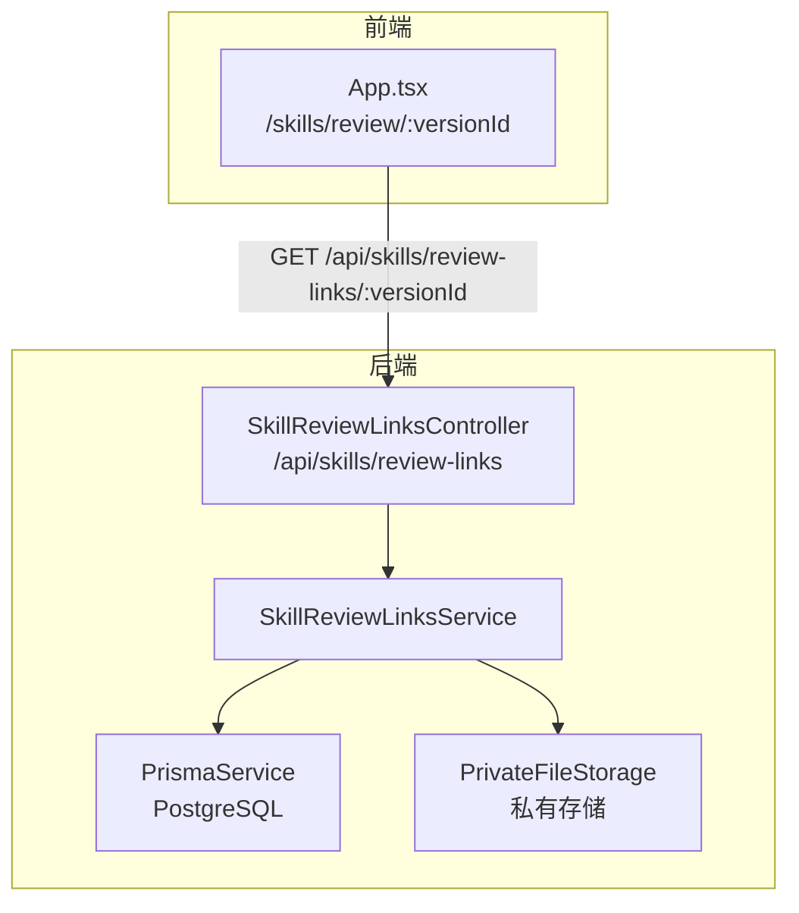
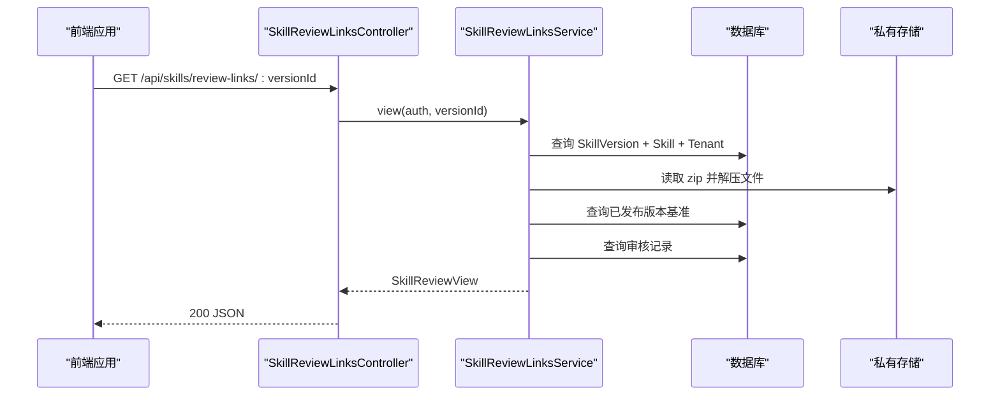
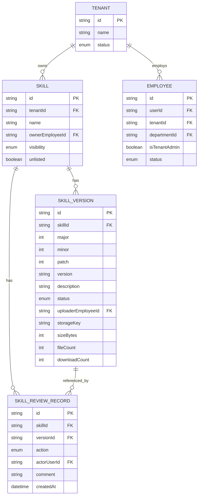
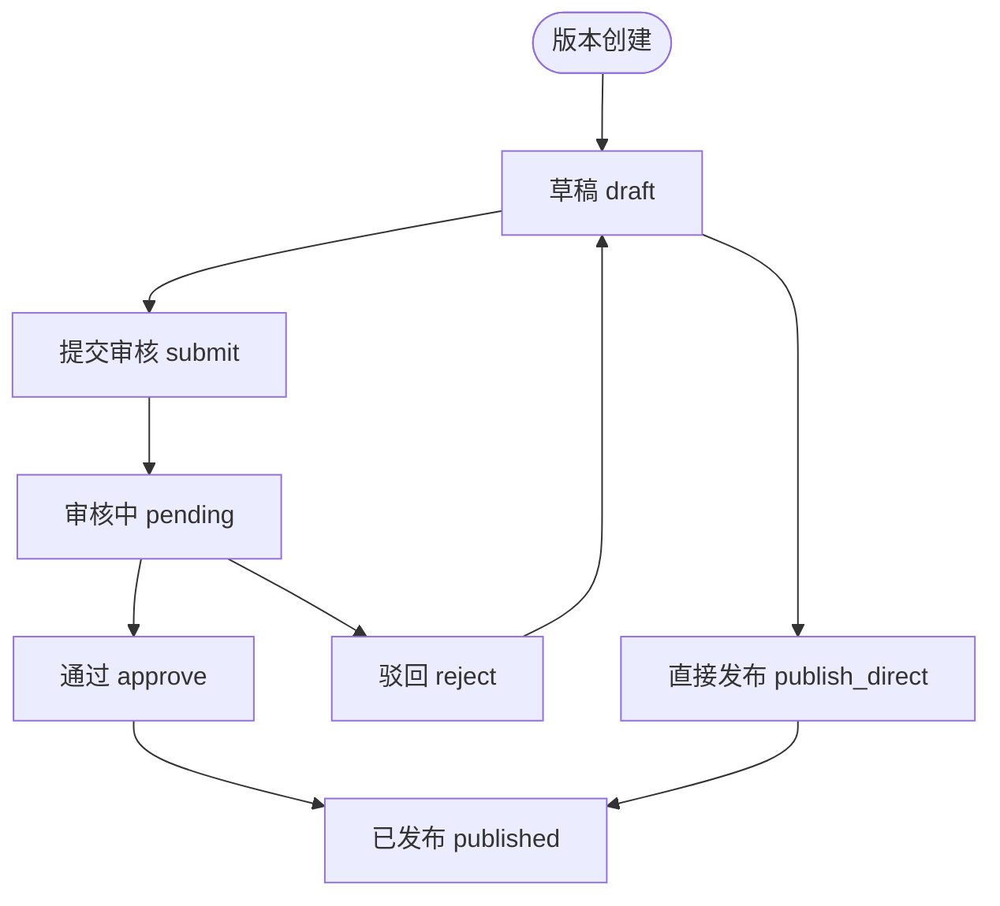
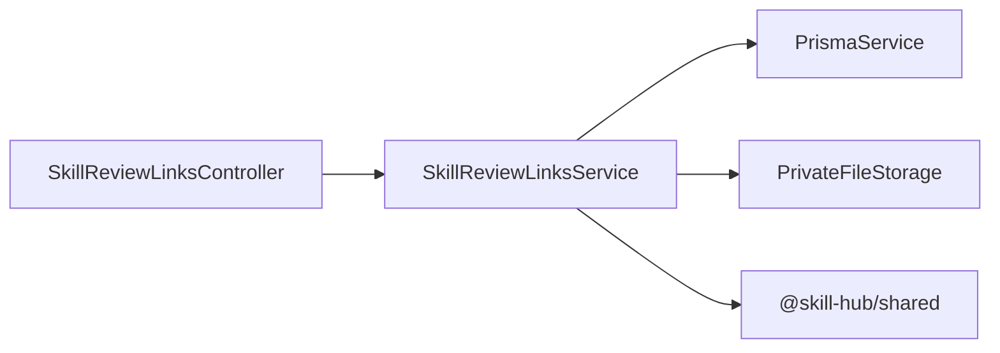
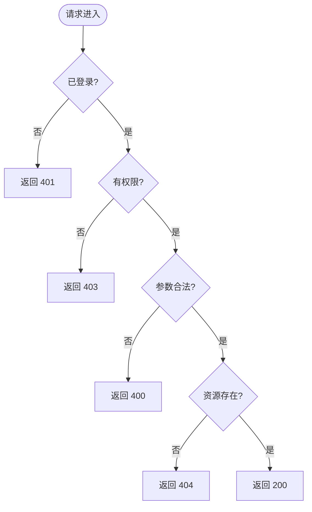

# 审核链接接口

<cite>
**本文引用的文件**   
- [skill-review-links.controller.ts](file://apps/server/src/skills/skill-review-links.controller.ts)
- [skill-review-links.service.ts](file://apps/server/src/skills/skill-review-links.service.ts)
- [schema.prisma](file://apps/server/prisma/schema.prisma)
- [skill.ts](file://packages/shared/src/skill.ts)
- [skill-reviews.service.ts](file://apps/server/src/skills/skill-reviews.service.ts)
- [skills.service.ts](file://apps/server/src/skills/skills.service.ts)
- [skill-review-links.e2e-spec.ts](file://apps/server/test/skill-review-links.e2e-spec.ts)
- [App.tsx](file://apps/web/src/App.tsx)
</cite>

## 目录
1. [引言](#引言)
2. [项目结构](#项目结构)
3. [核心组件](#核心组件)
4. [架构总览](#架构总览)
5. [详细组件分析](#详细组件分析)
6. [依赖关系分析](#依赖关系分析)
7. [性能与扩展性](#性能与扩展性)
8. [安全与合规](#安全与合规)
9. [统计与监控](#统计与监控)
10. [错误处理与异常](#错误处理与异常)
11. [故障排查指南](#故障排查指南)
12. [结论](#结论)

## 引言
本文件面向“技能审核链接”相关接口的完整文档，覆盖以下目标：
- 审核邀请链接的生成、管理与使用流程
- 链接的安全机制：唯一性、时效性与访问权限控制
- 生命周期管理：创建、激活、过期与删除
- 与技能审核流程的集成：自动触发审核与状态同步
- API 端点规范：链接生成、验证与使用的具体实现
- 安全考虑：防止链接泄露与滥用
- 统计与监控：使用情况与审核进度跟踪
- 错误处理与异常情况的安全处理方案

需要特别说明的是：当前仓库中并未实现独立的“临时邀请链接表”，而是以“版本 ID”作为审核入口标识。因此，“审核链接”在语义上等价于“指向某个 Skill 版本的受控访问地址”。

## 项目结构
与审核链接相关的后端代码集中在 skills 模块下，包含控制器、服务、数据模型与端到端测试；前端路由将 /skills/review/:versionId 映射到审核页面。



图表来源
- [skill-review-links.controller.ts:11-31](file://apps/server/src/skills/skill-review-links.controller.ts#L11-L31)
- [skill-review-links.service.ts:68-146](file://apps/server/src/skills/skill-review-links.service.ts#L68-L146)
- [App.tsx:55-56](file://apps/web/src/App.tsx#L55-L56)

章节来源
- [skill-review-links.controller.ts:1-33](file://apps/server/src/skills/skill-review-links.controller.ts#L1-L33)
- [skill-review-links.service.ts:1-147](file://apps/server/src/skills/skill-review-links.service.ts#L1-L147)
- [App.tsx:55-56](file://apps/web/src/App.tsx#L55-L56)

## 核心组件
- SkillReviewLinksController：暴露审核链接相关 HTTP 端点，统一要求登录并按身份授权。
- SkillReviewLinksService：实现访问鉴权、版本信息聚合、文件树与差异计算、预览与下载逻辑。
- Prisma 数据模型：SkillVersion、SkillReviewRecord、Skill、Tenant、Employee 等实体支撑审核上下文。
- Shared 类型定义：SkillReviewView、SkillReviewViewerRole 等用于前后端契约。

章节来源
- [skill-review-links.controller.ts:1-33](file://apps/server/src/skills/skill-review-links.controller.ts#L1-L33)
- [skill-review-links.service.ts:1-147](file://apps/server/src/skills/skill-review-links.service.ts#L1-L147)
- [schema.prisma:104-218](file://apps/server/prisma/schema.prisma#L104-L218)
- [skill.ts:298-315](file://packages/shared/src/skill.ts#L298-L315)

## 架构总览
审核链接访问的核心路径如下：
- 前端通过 /skills/review/:versionId 打开审核页
- 前端调用 GET /api/skills/review-links/:versionId 获取审核视图
- 服务端校验登录与角色权限，读取版本、租户、可见性、文件包与审核记录
- 返回包含文件树、差异、是否可审核、是否需要切换租户等信息



图表来源
- [skill-review-links.controller.ts:15-18](file://apps/server/src/skills/skill-review-links.controller.ts#L15-L18)
- [skill-review-links.service.ts:75-103](file://apps/server/src/skills/skill-review-links.service.ts#L75-L103)

## 详细组件分析

### 控制器：SkillReviewLinksController
职责
- 暴露三个端点：查看审核视图、下载审阅包、预览包内文件
- 统一使用 @Auth() 注入认证上下文，不强制租户成员守卫，允许跨租户管理员访问

端点
- GET /api/skills/review-links/:versionId
  - 作用：返回 SkillReviewView，包含版本信息、文件树、差异、审核记录、可见性、是否可审核、是否需要切换租户
  - 鉴权：必须登录；按版本所属租户的身份判断
- GET /api/skills/review-links/:versionId/download
  - 作用：下载该版本的 zip 审阅包，不计入下载次数
  - 响应：application/zip，带 Content-Disposition
- GET /api/skills/review-links/:versionId/file?path=...
  - 作用：预览包内文本或二进制文件
  - 参数：path 为相对 Skill 根目录的路径，需规范化，拒绝穿越路径

章节来源
- [skill-review-links.controller.ts:1-33](file://apps/server/src/skills/skill-review-links.controller.ts#L1-L33)

### 服务：SkillReviewLinksService
职责
- 访问鉴权：super_admin、tenant_admin、owner 三种角色；其他情况一律 403
- 审核视图构建：聚合版本、租户、可见性、SKILL.md、文件树、差异、审核记录
- 文件预览：仅从包内读取，拒绝非法路径；文本超过阈值截断
- 审阅下载：复用鉴权逻辑，直接读取存储中的 zip

关键方法
- view(auth, versionId)
  - 鉴权 access()
  - 读取当前版本文件
  - 查找基准版本（版本号小于本版本的最高正式版本）
  - 比较文件差异（新增、修改、删除）
  - 查询审核记录与驳回意见
  - 返回 SkillReviewView
- previewFile(auth, versionId, path)
  - 校验 path 合法性
  - 鉴权后从包内读取文件
  - 文本检测与截断
- download(auth, versionId)
  - 鉴权后读取 zip 并返回文件名与内容

```mermaid
classDiagram
class SkillReviewLinksService {
+view(auth, versionId) SkillReviewView
+previewFile(auth, versionId, path) SkillFilePreview
+download(auth, versionId) {fileName, data}
-access(auth, versionId) VersionWithTenant
-readFiles(version, skillName) Record~string, Uint8Array~
}
class SkillReviewLinksController {
+view(auth, versionId) SkillReviewView
+download(auth, versionId) StreamableFile
+previewFile(auth, versionId, path) SkillFilePreview
}
SkillReviewLinksController --> SkillReviewLinksService : "调用"
```

图表来源
- [skill-review-links.service.ts:68-146](file://apps/server/src/skills/skill-review-links.service.ts#L68-L146)
- [skill-review-links.controller.ts:11-31](file://apps/server/src/skills/skill-review-links.controller.ts#L11-L31)

章节来源
- [skill-review-links.service.ts:1-147](file://apps/server/src/skills/skill-review-links.service.ts#L1-L147)

### 数据模型与领域概念
- SkillVersion：版本主键 id 即审核链接标识；status 支持 draft/pending/published；storageKey 指向 zip 包
- SkillReviewRecord：记录每次审核动作（提交、撤回、通过、驳回、直接发布等），关联 actor 与评论
- Skill/Tenant/Employee：决定租户、所有者与管理员权限
- SkillVisibility：控制 Skill 可见范围（租户、部门、员工、私有）



图表来源
- [schema.prisma:104-218](file://apps/server/prisma/schema.prisma#L104-L218)

章节来源
- [schema.prisma:104-218](file://apps/server/prisma/schema.prisma#L104-L218)

### 审核流程集成与状态同步
- 版本状态机：draft → pending → published；reject 将 pending 退回 draft
- 自动触发：当版本进入 pending 时，可通过审核链接进行审阅；canReview 仅在 tenant_admin 且 status=pending 时为 true
- 状态同步：审核动作（submit、withdraw、approve、reject、publish_direct 等）会写入 SkillReviewRecord，并在审核视图中展示



图表来源
- [skill-reviews.service.ts:32-44](file://apps/server/src/skills/skill-reviews.service.ts#L32-L44)
- [schema.prisma:164-218](file://apps/server/prisma/schema.prisma#L164-L218)

章节来源
- [skill-reviews.service.ts:32-49](file://apps/server/src/skills/skill-reviews.service.ts#L32-L49)
- [schema.prisma:164-218](file://apps/server/prisma/schema.prisma#L164-L218)

### 审核链接的生命周期
- 创建：上传 Skill 并提交审核时，系统创建 SkillVersion，其 id 即为审核链接标识
- 激活：版本状态变为 pending 时，租户管理员可通过链接打开审核页并执行审核
- 过期：当前未实现基于时间的链接失效；若需引入时效性，可在 Service 层增加时间校验逻辑
- 删除：当前未提供删除链接能力；如需删除，应结合业务策略（如软删除、撤销权限、归档 zip 等）

章节来源
- [skill-review-links.service.ts:75-103](file://apps/server/src/skills/skill-review-links.service.ts#L75-L103)
- [skill-review-links.e2e-spec.ts:124-129](file://apps/server/test/skill-review-links.e2e-spec.ts#L124-L129)

### 前端路由与使用
- 前端路由 /skills/review/:versionId 对应审核页面
- 用户登录后访问该路由，前端调用后端审核链接接口获取视图并渲染

章节来源
- [App.tsx:55-56](file://apps/web/src/App.tsx#L55-L56)

## 依赖关系分析
- 控制器依赖服务：SkillReviewLinksController 仅做请求解析与响应封装
- 服务依赖基础设施：PrismaService 访问数据库，PrivateFileStorage 访问 zip 包
- 共享类型：SkillReviewView、SkillReviewViewerRole 等由 shared 包定义，保证前后端一致



图表来源
- [skill-review-links.controller.ts:1-6](file://apps/server/src/skills/skill-review-links.controller.ts#L1-L6)
- [skill-review-links.service.ts:1-22](file://apps/server/src/skills/skill-review-links.service.ts#L1-L22)

章节来源
- [skill-review-links.controller.ts:1-33](file://apps/server/src/skills/skill-review-links.controller.ts#L1-L33)
- [skill-review-links.service.ts:1-22](file://apps/server/src/skills/skill-review-links.service.ts#L1-L22)

## 性能与扩展性
- 文件差异计算：对每个文件计算 sha256 并与基准版本对比，复杂度与文件数量线性相关
- 基准版本选择：查询所有 published 版本并按版本号降序，找到第一个小于当前版本的版本
- 大文件预览：文本超过阈值时截断，避免传输过大内容
- 可扩展点：
  - 增加缓存：对频繁访问的版本元数据与文件树进行缓存
  - 异步任务：对大型 zip 包的解压与差异计算可异步化
  - 分页审核记录：当审核记录较多时，支持分页加载

[本节为通用指导，不直接分析具体文件]

## 安全与合规
- 身份与权限
  - 必须登录；未登录返回 401
  - super_admin：只读
  - tenant_admin：对所属租户的 pending 版本可审核；对其他租户无权限
  - owner：只读
  - 其他人员（含其他租户管理员）：403
- 链接唯一性与安全性
  - 链接标识为版本 id，唯一且稳定；撤回再提交仍为同一链接
  - 链接本身不包含权限令牌，仍需登录与会话校验
- 路径安全
  - 文件预览路径经 normalizeSkillPath 规范化，拒绝 .. 与绝对路径
  - 非法路径返回 400 或 404，不暴露内部文件系统
- 防泄露与防滥用
  - 建议在生产环境启用 HTTPS、访问日志与审计
  - 可对高频访问进行速率限制
  - 如需时效性，可在 Service 层增加时间窗口校验

章节来源
- [skill-review-links.service.ts:135-145](file://apps/server/src/skills/skill-review-links.service.ts#L135-L145)
- [skill-review-links.service.ts:105-123](file://apps/server/src/skills/skill-review-links.service.ts#L105-L123)
- [skill-review-links.e2e-spec.ts:110-122](file://apps/server/test/skill-review-links.e2e-spec.ts#L110-L122)

## 统计与监控
- 下载次数：SkillVersion.downloadCount 字段存在，但审阅下载不计入该计数
- 审核记录：SkillReviewRecord 记录每次审核动作与评论，可用于审计与统计
- 监控建议：
  - 统计各版本审核次数、通过率、平均审核时长
  - 监控异常访问（大量 403/401）
  - 追踪大文件预览与下载的性能指标

章节来源
- [schema.prisma:170-190](file://apps/server/prisma/schema.prisma#L170-L190)
- [schema.prisma:205-218](file://apps/server/prisma/schema.prisma#L205-L218)
- [skill-review-links.e2e-spec.ts:167-177](file://apps/server/test/skill-review-links.e2e-spec.ts#L167-L177)

## 错误处理与异常
- 未登录：401
- 无权限：403（包括版本不存在、非所属租户管理员、被停用管理员等）
- 参数错误：400（例如预览未传 path、路径非法）
- 资源不存在：404（预览文件不在包内）
- 并发冲突：当版本处于 pending 时再次提交可能触发冲突（见 SkillsService 中的 pendingMessage）



图表来源
- [skill-review-links.service.ts:135-145](file://apps/server/src/skills/skill-review-links.service.ts#L135-L145)
- [skill-review-links.service.ts:105-123](file://apps/server/src/skills/skill-review-links.service.ts#L105-L123)
- [skills.service.ts:445-445](file://apps/server/src/skills/skills.service.ts#L445-L445)

章节来源
- [skill-review-links.e2e-spec.ts:110-122](file://apps/server/test/skill-review-links.e2e-spec.ts#L110-L122)
- [skill-review-links.e2e-spec.ts:180-212](file://apps/server/test/skill-review-links.e2e-spec.ts#L180-L212)
- [skills.service.ts:445-445](file://apps/server/src/skills/skills.service.ts#L445-L445)

## 故障排查指南
常见问题与定位步骤
- 无法打开审核链接
  - 检查是否已登录
  - 确认是否为所属租户管理员或超管
  - 确认版本状态是否为 pending（只有 pending 才可审核）
- 预览文件失败
  - 检查 path 是否合法（不含 .. 或绝对路径）
  - 确认文件是否存在于 zip 包内
- 审阅下载失败
  - 检查是否有权限访问该版本
  - 确认存储中 zip 包是否存在
- 审核状态不同步
  - 检查 SkillReviewRecord 是否记录了相应动作
  - 确认版本状态迁移是否符合规则（draft→pending→published）

章节来源
- [skill-review-links.e2e-spec.ts:56-129](file://apps/server/test/skill-review-links.e2e-spec.ts#L56-L129)
- [skill-review-links.e2e-spec.ts:180-212](file://apps/server/test/skill-review-links.e2e-spec.ts#L180-L212)

## 结论
当前系统的“审核链接”以版本 id 为核心标识，通过统一的控制器与服务实现访问鉴权、文件预览与审阅下载。审核流程与版本状态机紧密耦合，确保只有具备权限的管理员才能在 pending 状态下进行审核。虽然尚未实现独立的临时邀请链接与时效控制，但现有设计具备良好的扩展性，可在 Service 层增加时间窗口、速率限制与审计统计等功能以满足更严格的安全与合规需求。