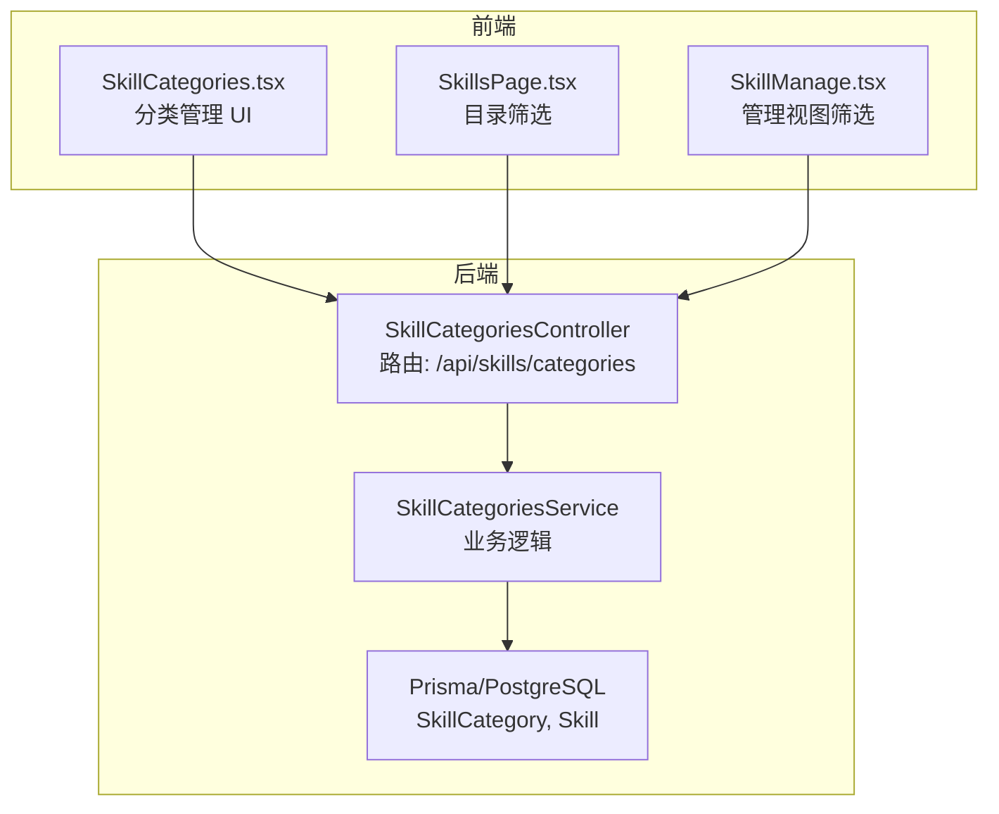
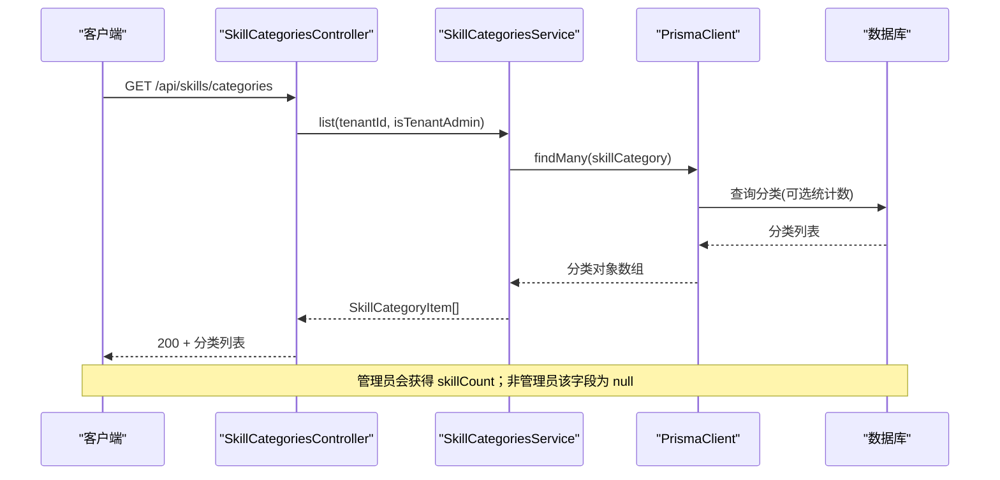
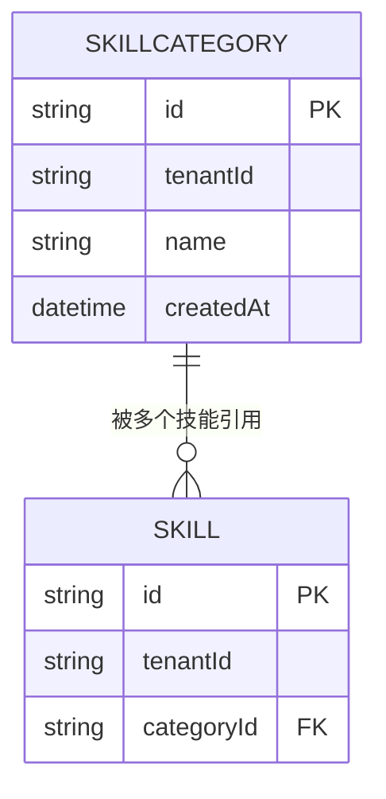
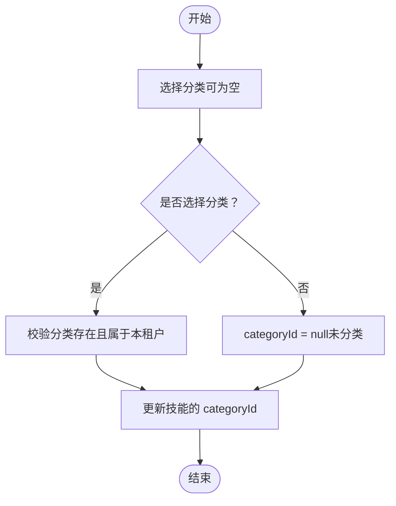
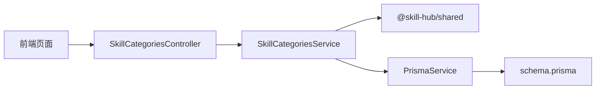

# 技能分类接口

<cite>
**本文引用的文件**   
- [skill-categories.controller.ts](file://apps/server/src/skills/skill-categories.controller.ts)
- [skill-categories.service.ts](file://apps/server/src/skills/skill-categories.service.ts)
- [skills.dto.ts](file://apps/server/src/skills/skills.dto.ts)
- [schema.prisma](file://apps/server/prisma/schema.prisma)
- [skill.ts](file://packages/shared/src/skill.ts)
- [index.ts](file://packages/shared/src/index.ts)
- [SkillCategories.tsx](file://apps/web/src/pages/SkillCategories.tsx)
- [SkillsPage.tsx](file://apps/web/src/pages/SkillsPage.tsx)
- [SkillManage.tsx](file://apps/web/src/pages/SkillManage.tsx)
- [skill-categories.e2e-spec.ts](file://apps/server/test/skill-categories.e2e-spec.ts)
</cite>

## 目录
1. [简介](#简介)
2. [项目结构](#项目结构)
3. [核心组件](#核心组件)
4. [架构总览](#架构总览)
5. [详细组件分析](#详细组件分析)
6. [依赖关系分析](#依赖关系分析)
7. [性能与扩展性](#性能与扩展性)
8. [故障排查指南](#故障排查指南)
9. [结论](#结论)

## 简介
本文件为“技能分类”管理接口的完整技术文档，覆盖以下目标：
- 技能分类的增删改查（创建、修改、删除、查询）
- 分类与技能包的关联关系（分配与变更）
- 权限控制机制（普通用户与管理员）
- API 端点规范（HTTP 方法、URL、请求参数、响应格式）
- 分类树形结构与层级支持现状说明
- 搜索与过滤能力（名称、描述等）
- 错误处理与异常场景

当前实现中，技能分类是扁平结构（无父子层级），按租户隔离；分类与技能包通过外键关联，删除分类时关联的技能自动变为“未分类”。

## 项目结构
与技能分类相关的后端代码位于 server 端的 skills 模块，前端在 web 端提供分类管理与筛选界面。

图表来源
- [skill-categories.controller.ts:10-46](file://apps/server/src/skills/skill-categories.controller.ts#L10-L46)
- [skill-categories.service.ts:20-72](file://apps/server/src/skills/skill-categories.service.ts#L20-L72)
- [schema.prisma:104-135](file://apps/server/prisma/schema.prisma#L104-L135)
- [SkillCategories.tsx:17-25](file://apps/web/src/pages/SkillCategories.tsx#L17-L25)
- [SkillsPage.tsx:81-101](file://apps/web/src/pages/SkillsPage.tsx#L81-L101)
- [SkillManage.tsx:114-147](file://apps/web/src/pages/SkillManage.tsx#L114-L147)

章节来源
- [skill-categories.controller.ts:1-46](file://apps/server/src/skills/skill-categories.controller.ts#L1-L46)
- [skill-categories.service.ts:1-83](file://apps/server/src/skills/skill-categories.service.ts#L1-L83)
- [schema.prisma:104-135](file://apps/server/prisma/schema.prisma#L104-L135)
- [SkillCategories.tsx:1-30](file://apps/web/src/pages/SkillCategories.tsx#L1-L30)
- [SkillsPage.tsx:81-101](file://apps/web/src/pages/SkillsPage.tsx#L81-L101)
- [SkillManage.tsx:114-147](file://apps/web/src/pages/SkillManage.tsx#L114-L147)

## 核心组件
- 控制器层：SkillCategoriesController
  - 暴露分类列表、创建、一键添加预设、重命名、删除等接口
  - 使用装饰器进行权限控制：所有成员可读，仅租户管理员可写
- 服务层：SkillCategoriesService
  - 封装分类的 CRUD 与事务校验（唯一性、上限、并发安全）
  - 返回分类列表，管理员额外返回每个分类下的技能数量
- 数据模型：SkillCategory、Skill
  - 分类与技能为 1:N 关系，删除分类时技能 categoryId 置空（SET NULL）
- 共享类型：SkillCategory、SkillCategoryItem、常量（最大数量、预设名、未分类标识）
- DTO 校验：SkillCategoryDto、UpdateSkillCategoryDto、SkillListQueryDto、SkillManageQueryDto

章节来源
- [skill-categories.controller.ts:1-46](file://apps/server/src/skills/skill-categories.controller.ts#L1-L46)
- [skill-categories.service.ts:1-83](file://apps/server/src/skills/skill-categories.service.ts#L1-L83)
- [schema.prisma:104-135](file://apps/server/prisma/schema.prisma#L104-L135)
- [skill.ts:171-196](file://packages/shared/src/skill.ts#L171-L196)
- [skills.dto.ts:68-145](file://apps/server/src/skills/skills.dto.ts#L68-L145)

## 架构总览
技能分类管理的调用链路如下：

图表来源
- [skill-categories.controller.ts:15-18](file://apps/server/src/skills/skill-categories.controller.ts#L15-L18)
- [skill-categories.service.ts:24-32](file://apps/server/src/skills/skill-categories.service.ts#L24-L32)
- [schema.prisma:126-135](file://apps/server/prisma/schema.prisma#L126-L135)

## 详细组件分析

### 权限控制
- 读取权限：租户内所有成员均可读取分类列表（用于选择、筛选）
- 写入权限：仅租户管理员可创建、重命名、删除分类以及添加预设
- 实现方式：控制器上使用 TenantMember（读）和 TenantAdminOnly（写）装饰器

章节来源
- [skill-categories.controller.ts:8-11](file://apps/server/src/skills/skill-categories.controller.ts#L8-L11)
- [skill-categories.controller.ts:20-45](file://apps/server/src/skills/skill-categories.controller.ts#L20-L45)

### 分类数据结构与约束
- 分类字段：id、name、tenantId、createdAt
- 唯一性：同一租户内 name 唯一
- 上限：每租户最多 SKILL_CATEGORIES_MAX 个分类
- 排序：按创建时间升序，其次按名称升序
- 与技能的关系：Skill.categoryId 指向 SkillCategory.id，删除分类时 SET NULL

图表来源
- [schema.prisma:104-135](file://apps/server/prisma/schema.prisma#L104-L135)

章节来源
- [schema.prisma:104-135](file://apps/server/prisma/schema.prisma#L104-L135)
- [skill.ts:171-187](file://packages/shared/src/skill.ts#L171-L187)

### 分类与技能包的关联与变更
- 分配：上传或更新技能时可设置 categoryId（可为空表示“未分类”）
- 变更：重命名分类后，已关联技能的分类名称同步更新
- 删除：删除分类后，使用该分类的技能 categoryId 置空（未分类），技能本身不受影响

章节来源
- [skill-categories.service.ts:60-72](file://apps/server/src/skills/skill-categories.service.ts#L60-L72)
- [schema.prisma:113-114](file://apps/server/prisma/schema.prisma#L113-L114)
- [skill-categories.e2e-spec.ts:89-105](file://apps/server/test/skill-categories.e2e-spec.ts#L89-L105)

### 分类层级与树形结构
- 当前实现：分类为扁平结构，无 parentId 字段，不支持父子层级
- 如需树形展示：可在现有扁平列表基础上由前端或后端组装（当前未提供层级接口）
- 对比部门模型：Department 支持 parentId 形成树形，但 SkillCategory 未采用相同设计

章节来源
- [schema.prisma:62-77](file://apps/server/prisma/schema.prisma#L62-L77)
- [schema.prisma:126-135](file://apps/server/prisma/schema.prisma#L126-L135)

### 搜索与过滤
- 分类列表接口：返回本租户的分类，管理员附带 skillCount
- 技能列表/管理视图：支持按 categoryId 筛选（包含“未分类”的特殊值）
- 关键词搜索：技能列表支持 keyword（名称/描述），与分类筛选组合使用

章节来源
- [skill-categories.controller.ts:15-18](file://apps/server/src/skills/skill-categories.controller.ts#L15-L18)
- [skills.dto.ts:115-145](file://apps/server/src/skills/skills.dto.ts#L115-L145)
- [SkillsPage.tsx:81-101](file://apps/web/src/pages/SkillsPage.tsx#L81-L101)
- [SkillManage.tsx:114-147](file://apps/web/src/pages/SkillManage.tsx#L114-L147)

### API 端点规范

#### 获取分类列表
- 方法：GET
- URL：/api/skills/categories
- 认证：需要登录（租户成员）
- 响应体：SkillCategoryItem[]
  - id: string
  - name: string
  - skillCount: number | null（仅管理员有值）
- 行为：按创建时间、名称排序；管理员返回每个分类的技能计数

章节来源
- [skill-categories.controller.ts:15-18](file://apps/server/src/skills/skill-categories.controller.ts#L15-L18)
- [skill.ts:177-180](file://packages/shared/src/skill.ts#L177-L180)

#### 创建分类
- 方法：POST
- URL：/api/skills/categories
- 认证：租户管理员
- 请求体：SkillCategoryRequest
  - name: string（必填，长度限制见常量）
- 响应体：SkillCategoryItem[]（创建后的最新列表）
- 约束：
  - 同一租户内 name 唯一
  - 不超过每租户最大分类数
  - 并发新增串行化并加锁保证上限

章节来源
- [skill-categories.controller.ts:20-24](file://apps/server/src/skills/skill-categories.controller.ts#L20-L24)
- [skills.dto.ts:68-74](file://apps/server/src/skills/skills.dto.ts#L68-L74)
- [skill-categories.service.ts:34-44](file://apps/server/src/skills/skill-categories.service.ts#L34-L44)
- [skill.ts:182-185](file://packages/shared/src/skill.ts#L182-L185)

#### 一键添加常用分类
- 方法：POST
- URL：/api/skills/categories/presets
- 认证：租户管理员
- 请求体：无
- 响应体：SkillCategoryItem[]（补全缺失的预设分类后的列表）
- 行为：只添加尚未存在的预设分类；重复调用幂等

章节来源
- [skill-categories.controller.ts:26-31](file://apps/server/src/skills/skill-categories.controller.ts#L26-L31)
- [skill-categories.service.ts:46-58](file://apps/server/src/skills/skill-categories.service.ts#L46-L58)
- [skill.ts:184-185](file://packages/shared/src/skill.ts#L184-L185)

#### 重命名分类
- 方法：PATCH
- URL：/api/skills/categories/:id
- 认证：租户管理员
- 路径参数：id（分类 ID）
- 请求体：SkillCategoryRequest
  - name: string（必填，长度限制）
- 响应体：SkillCategoryItem[]（改名后的最新列表）
- 约束：同一租户内 name 唯一

章节来源
- [skill-categories.controller.ts:33-37](file://apps/server/src/skills/skill-categories.controller.ts#L33-L37)
- [skills.dto.ts:68-74](file://apps/server/src/skills/skills.dto.ts#L68-L74)
- [skill-categories.service.ts:60-66](file://apps/server/src/skills/skill-categories.service.ts#L60-L66)

#### 删除分类
- 方法：DELETE
- URL：/api/skills/categories/:id
- 认证：租户管理员
- 路径参数：id（分类 ID）
- 响应码：204（无内容）
- 行为：使用该分类的技能 categoryId 置空（未分类），技能本身保留

章节来源
- [skill-categories.controller.ts:39-45](file://apps/server/src/skills/skill-categories.controller.ts#L39-L45)
- [skill-categories.service.ts:68-72](file://apps/server/src/skills/skill-categories.service.ts#L68-L72)
- [schema.prisma:113-114](file://apps/server/prisma/schema.prisma#L113-L114)

### 分类树形结构的获取接口
- 当前未提供专门的树形接口；分类为扁平结构
- 若需树形展示，建议在后端增加 parentId 字段并在 Service 中递归组装，或在客户端对扁平列表进行分组渲染

[本节为概念性说明，不直接分析具体文件]

### 分类与技能分配的交互流程

图表来源
- [skills.dto.ts:61-66](file://apps/server/src/skills/skills.dto.ts#L61-L66)
- [skill-categories.service.ts:9-14](file://apps/server/src/skills/skill-categories.service.ts#L9-L14)

## 依赖关系分析
- 控制器依赖服务：SkillCategoriesController → SkillCategoriesService
- 服务依赖 Prisma 与共享常量：SkillCategoriesService → PrismaService、@skill-hub/shared
- 数据模型依赖：SkillCategory 与 Skill 通过外键关联
- 前端依赖：Web 页面通过 REST 调用分类接口，并在列表/管理视图中按 categoryId 筛选

图表来源
- [skill-categories.controller.ts:1-46](file://apps/server/src/skills/skill-categories.controller.ts#L1-L46)
- [skill-categories.service.ts:1-83](file://apps/server/src/skills/skill-categories.service.ts#L1-L83)
- [schema.prisma:104-135](file://apps/server/prisma/schema.prisma#L104-L135)
- [SkillCategories.tsx:17-25](file://apps/web/src/pages/SkillCategories.tsx#L17-L25)

章节来源
- [skill-categories.controller.ts:1-46](file://apps/server/src/skills/skill-categories.controller.ts#L1-L46)
- [skill-categories.service.ts:1-83](file://apps/server/src/skills/skill-categories.service.ts#L1-L83)
- [schema.prisma:104-135](file://apps/server/prisma/schema.prisma#L104-L135)
- [SkillCategories.tsx:17-25](file://apps/web/src/pages/SkillCategories.tsx#L17-L25)

## 性能与扩展性
- 列表查询：默认按 createdAt 与 name 排序；管理员模式包含 _count 统计，可能带来额外开销
- 并发控制：创建与批量添加预设时使用行级锁（FOR UPDATE）与事务，避免超上限与重复
- 可扩展方向：
  - 增加分页与过滤（如按名称模糊匹配）
  - 引入 parentId 支持层级分类
  - 缓存热点分类列表（如 Redis）

[本节为通用指导，不直接分析具体文件]

## 故障排查指南
常见错误与处理：
- 分类不存在
  - 触发场景：重命名或删除不存在的分类
  - 响应：404 Not Found
  - 参考：service 中的 categoryNotFound 抛出 NotFoundException
- 分类名称冲突
  - 触发场景：创建或重命名为已有名称
  - 响应：409 Conflict
  - 参考：unique 包装捕获 P2002 并抛出 ConflictException
- 超过分类上限
  - 触发场景：创建或批量添加预设导致超过 SKILL_CATEGORIES_MAX
  - 响应：400 Bad Request
  - 参考：tooMany 抛出 BadRequestException
- 所选分类无效
  - 触发场景：上传或更新技能时传入不属于本租户的分类
  - 响应：400 Bad Request
  - 参考：findTenantCategory 校验失败抛出 BadRequestException

章节来源
- [skill-categories.service.ts:6-14](file://apps/server/src/skills/skill-categories.service.ts#L6-L14)
- [skill-categories.service.ts:34-44](file://apps/server/src/skills/skill-categories.service.ts#L34-L44)
- [skill-categories.service.ts:60-72](file://apps/server/src/skills/skill-categories.service.ts#L60-L72)
- [skill-categories.e2e-spec.ts:89-105](file://apps/server/test/skill-categories.e2e-spec.ts#L89-L105)

## 结论
- 技能分类目前为扁平结构，按租户隔离，管理员维护，普通成员可读
- 分类与技能通过外键关联，删除分类时技能自动变为“未分类”
- 提供完整的分类 CRUD 与预设填充接口，具备并发与唯一性保护
- 如需树形分类与更丰富的搜索过滤，可在现有基础上扩展 schema 与 Service 逻辑

[本节为总结性内容，不直接分析具体文件]