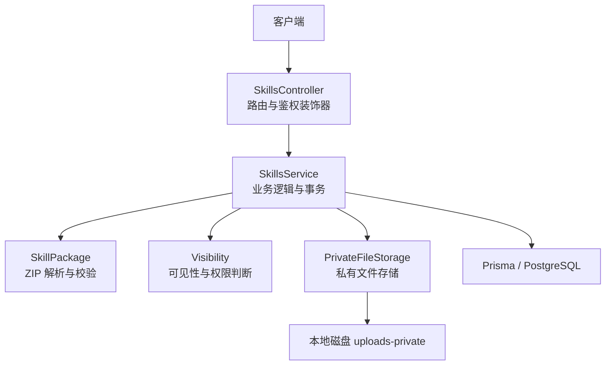
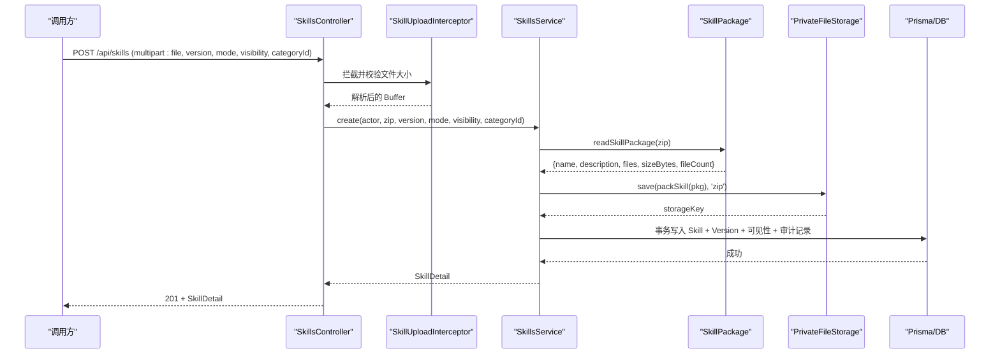
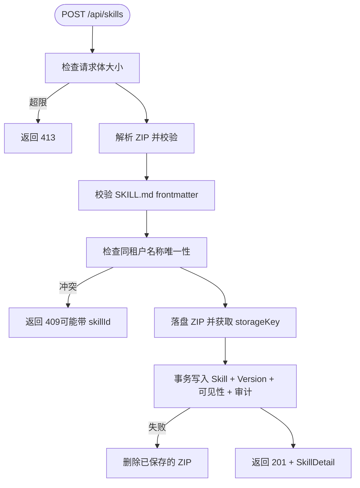
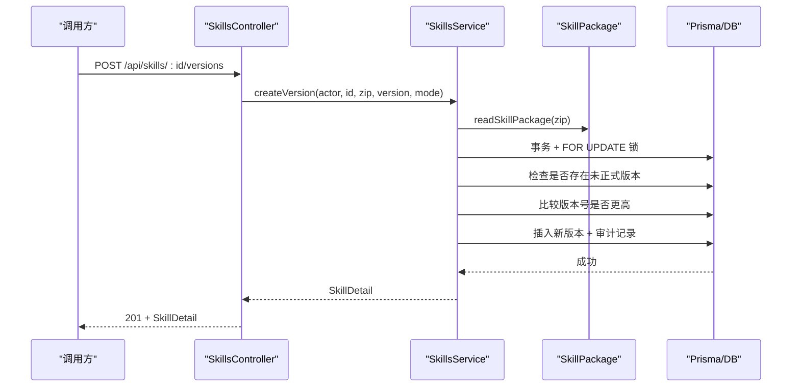
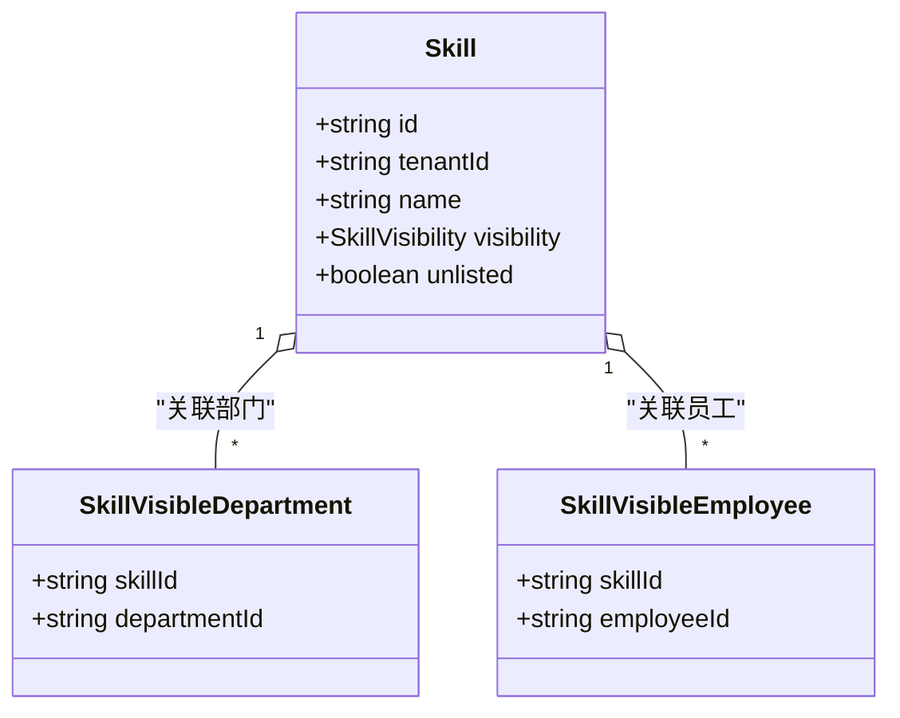
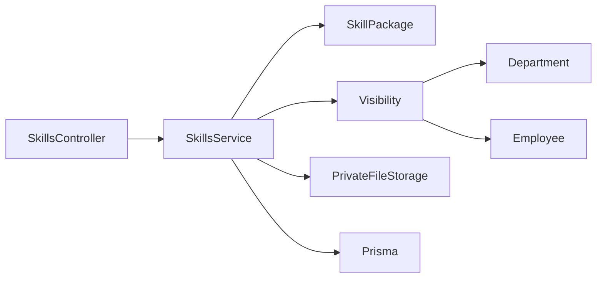

# 技能包管理接口

<cite>
**本文引用的文件**   
- [skills.controller.ts](file://apps/server/src/skills/skills.controller.ts)
- [skills.service.ts](file://apps/server/src/skills/skills.service.ts)
- [skill-upload.ts](file://apps/server/src/skills/skill-upload.ts)
- [skill-package.ts](file://apps/server/src/skills/skill-package.ts)
- [skill-visibility.ts](file://apps/server/src/skills/skill-visibility.ts)
- [file-upload.interceptor.ts](file://apps/server/src/storage/file-upload.interceptor.ts)
- [private-file-storage.ts](file://apps/server/src/storage/private-file-storage.ts)
- [schema.prisma](file://apps/server/prisma/schema.prisma)
- [skill.ts](file://packages/shared/src/skill.ts)
- [skills.dto.ts](file://apps/server/src/skills/skills.dto.ts)
- [skills.e2e-spec.ts](file://apps/server/test/skills.e2e-spec.ts)
- [skill-visibility.e2e-spec.ts](file://apps/server/test/skill-visibility.e2e-spec.ts)
</cite>

## 目录
1. [引言](#引言)
2. [项目结构](#项目结构)
3. [核心组件](#核心组件)
4. [架构总览](#架构总览)
5. [详细组件分析](#详细组件分析)
6. [依赖关系分析](#依赖关系分析)
7. [性能与容量限制](#性能与容量限制)
8. [故障排查指南](#故障排查指南)
9. [结论](#结论)

## 引言
本文面向“技能包管理”接口的使用者与维护者，系统性说明技能包的完整生命周期：创建、上传、更新、删除、可见性控制、版本管理与多租户数据隔离。重点覆盖 ZIP 包校验规则（SKILL.md 验证、路径安全、大小与文件数限制）、版本控制逻辑（版本号比较、草稿/审核中/正式状态流转）、权限策略（所有者、租户管理员、普通员工）以及请求响应示例与错误处理场景。文末给出性能优化建议与最佳实践。

## 项目结构
后端采用 NestJS 分层架构：控制器负责路由与参数绑定，服务层实现业务逻辑与事务，存储抽象封装私有文件读写，共享类型定义在 packages/shared 中，数据库模型由 Prisma 管理。

图表来源
- [skills.controller.ts:11-144](file://apps/server/src/skills/skills.controller.ts#L11-L144)
- [skills.service.ts:114-469](file://apps/server/src/skills/skills.service.ts#L114-L469)
- [skill-package.ts:19-63](file://apps/server/src/skills/skill-package.ts#L19-L63)
- [skill-visibility.ts:38-106](file://apps/server/src/skills/skill-visibility.ts#L38-L106)
- [private-file-storage.ts:23-40](file://apps/server/src/storage/private-file-storage.ts#L23-L40)

章节来源
- [skills.controller.ts:11-144](file://apps/server/src/skills/skills.controller.ts#L11-L144)
- [skills.service.ts:114-469](file://apps/server/src/skills/skills.service.ts#L114-L469)
- [schema.prisma:104-218](file://apps/server/prisma/schema.prisma#L104-L218)

## 核心组件
- SkillsController：暴露技能包相关 REST 接口，包含列表、详情、创建、新版本、替换草稿、删除版本/技能、下架/上架、下载等。
- SkillsService：实现技能包全生命周期逻辑，包括 SKILL.md 解析、版本比较、可见性计算、事务写入、审计记录、文件落盘与清理。
- SkillPackage：ZIP 解压、路径规范化、垃圾文件忽略、SKILL.md frontmatter 校验、打包回写。
- Visibility：可见性模式（租户/部门/员工/仅自己）、部门树祖先链、可见性校验与持久化。
- FileUploadInterceptor：统一 multipart 单文件拦截，超限返回 413。
- PrivateFileStorage：私有文件存储抽象与本地实现，文件名随机化、路径穿越防护。
- Shared Types：版本号格式、上限常量、可见性枚举、审核动作、数据结构定义。

章节来源
- [skills.controller.ts:11-144](file://apps/server/src/skills/skills.controller.ts#L11-L144)
- [skills.service.ts:114-469](file://apps/server/src/skills/skills.service.ts#L114-L469)
- [skill-package.ts:1-74](file://apps/server/src/skills/skill-package.ts#L1-L74)
- [skill-visibility.ts:1-107](file://apps/server/src/skills/skill-visibility.ts#L1-L107)
- [file-upload.interceptor.ts:1-28](file://apps/server/src/storage/file-upload.interceptor.ts#L1-L28)
- [private-file-storage.ts:1-41](file://apps/server/src/storage/private-file-storage.ts#L1-L41)
- [skill.ts:1-401](file://packages/shared/src/skill.ts#L1-L401)

## 架构总览
技能包从上传到可下载的端到端流程如下：

图表来源
- [skills.controller.ts:47-57](file://apps/server/src/skills/skills.controller.ts#L47-L57)
- [skill-upload.ts:5-12](file://apps/server/src/skills/skill-upload.ts#L5-L12)
- [skills.service.ts:224-253](file://apps/server/src/skills/skills.service.ts#L224-L253)
- [skill-package.ts:19-63](file://apps/server/src/skills/skill-package.ts#L19-L63)
- [private-file-storage.ts:23-30](file://apps/server/src/storage/private-file-storage.ts#L23-L30)

## 详细组件分析

### 技能包上传与创建
- 接口
  - POST /api/skills
  - 表单字段：file（zip）、version（x.y.z）、mode（publish/draft/submit，可选）、visibility（可选，新建时生效）、categoryId（可选）。
- 行为要点
  - 使用 SkillUploadInterceptor 限制请求体大小，超限返回 413。
  - requireFile 校验必须提供 file。
  - 解析 ZIP：忽略垃圾文件，校验路径合法性，定位 SKILL.md，解析 frontmatter，校验 name/description 长度与格式。
  - 名称唯一性：同租户内不可重复；若存在且可见则返回 409 并附带已有 skillId 引导去详情页上传新版本。
  - 初始状态：租户管理员默认 publish（直接发布），普通员工默认 submit（提交审核）；mode=draft 始终为草稿。
  - 文件先落盘再写库，失败时自动清理已保存的临时文件。
  - 成功后返回 SkillDetail，含当前版本、最高版本、可见性等。

图表来源
- [skill-upload.ts:5-12](file://apps/server/src/skills/skill-upload.ts#L5-L12)
- [skill-package.ts:19-57](file://apps/server/src/skills/skill-package.ts#L19-L57)
- [skills.service.ts:224-253](file://apps/server/src/skills/skills.service.ts#L224-L253)

章节来源
- [skills.controller.ts:47-57](file://apps/server/src/skills/skills.controller.ts#L47-L57)
- [skill-upload.ts:5-12](file://apps/server/src/skills/skill-upload.ts#L5-L12)
- [skill-package.ts:19-63](file://apps/server/src/skills/skill-package.ts#L19-L63)
- [skills.service.ts:224-253](file://apps/server/src/skills/skills.service.ts#L224-L253)
- [skills.e2e-spec.ts:61-205](file://apps/server/test/skills.e2e-spec.ts#L61-L205)

### 版本管理接口
- 接口
  - POST /api/skills/:id/versions：上传新版本。
  - PUT /api/skills/:id/versions/:versionId/package：替换草稿包（被驳回后修改）。
  - DELETE /api/skills/:id/versions/:versionId：删除单个版本。
  - GET /api/skills/:id/versions/:versionId/download：下载指定版本 ZIP。
- 行为要点
  - 只有所有者或租户管理员可上传新版本；同一 Skill 同时最多一个非正式版本（草稿/审核中）。
  - 新版本 SKILL.md 的 name 必须与 Skill 名称一致。
  - 版本号必须严格大于已有最高版本（数值比较）。
  - 并发保护：对 Skill 行加锁后再检查与写入，避免竞态。
  - 替换草稿：仅允许草稿状态，版本号不变；旧包文件随后删除；记录“重新上传”。
  - 删除版本：租户管理员可删任意版本；其他人只能删自己的草稿；若该版本是 Skill 唯一版本，Skill 一并删除。
  - 下载：仅正式版本成功读取后下载次数 +1；非正式版本不计数。

图表来源
- [skills.controller.ts:81-92](file://apps/server/src/skills/skills.controller.ts#L81-L92)
- [skills.service.ts:259-282](file://apps/server/src/skills/skills.service.ts#L259-L282)
- [skill-package.ts:19-57](file://apps/server/src/skills/skill-package.ts#L19-L57)

章节来源
- [skills.controller.ts:81-112](file://apps/server/src/skills/skills.controller.ts#L81-L112)
- [skills.service.ts:259-372](file://apps/server/src/skills/skills.service.ts#L259-L372)
- [skills.e2e-spec.ts:294-413](file://apps/server/test/skills.e2e-spec.ts#L294-L413)

### 可见性控制接口
- 接口
  - PATCH /api/skills/:id/visibility：修改可见性（所有者或租户管理员），立即生效，无需审核。
  - GET /api/skills/visibility-options：获取本租户部门树与在职员工，用于设置可见范围。
- 行为要点
  - 可见性模式：tenant（租户可见）、departments（特定部门及下级部门）、employees（特定员工，所有者自动加入名单）、private（仅自己可见）。
  - 校验：所选部门/员工必须属于当前租户；特定部门可见至少选一个部门；特定员工可见时所有者始终在名单中。
  - 审计：每次修改可见性会记录一条“修改可见性”的审计记录，描述前后变化。
  - 查询过滤：目录与详情均按可见性过滤；未下架才可见；换部门实时生效。

图表来源
- [schema.prisma:104-162](file://apps/server/prisma/schema.prisma#L104-L162)
- [skill-visibility.ts:21-27](file://apps/server/src/skills/skill-visibility.ts#L21-L27)

章节来源
- [skills.controller.ts:59-79](file://apps/server/src/skills/skills.controller.ts#L59-L79)
- [skills.service.ts:284-328](file://apps/server/src/skills/skills.service.ts#L284-L328)
- [skill-visibility.ts:38-106](file://apps/server/src/skills/skill-visibility.ts#L38-L106)
- [skill-visibility.e2e-spec.ts:79-204](file://apps/server/test/skill-visibility.e2e-spec.ts#L79-L204)

### 删除与下架/上架
- 接口
  - DELETE /api/skills/:id：删除整个 Skill（所有者或租户管理员）。
  - DELETE /api/skills/:id/versions/:versionId：删除单个版本（见上节）。
  - POST /api/skills/:id/unlist：下架（租户管理员）。
  - POST /api/skills/:id/relist：上架（租户管理员）。
- 行为要点
  - 删除 Skill：级联删除版本、审核记录、可见性名单，并清理所有私有包文件。
  - 下架/上架：条件更新防止重复操作；记录审计；已下架 Skill 除所有者与管理员外不可见。

章节来源
- [skills.controller.ts:107-133](file://apps/server/src/skills/skills.controller.ts#L107-L133)
- [skills.service.ts:356-428](file://apps/server/src/skills/skills.service.ts#L356-L428)

### 下载接口
- 接口
  - GET /api/skills/:id/versions/:versionId/download
- 行为要点
  - 返回 application/zip，Content-Disposition 为 attachment; filename="<name>-<version>.zip"。
  - 仅正式版本成功读取后 downloadCount +1；非正式版本不计数。
  - 私有文件通过业务接口流出，不经静态路由公开。

章节来源
- [skills.controller.ts:135-143](file://apps/server/src/skills/skills.controller.ts#L135-L143)
- [skills.service.ts:430-438](file://apps/server/src/skills/skills.service.ts#L430-L438)
- [private-file-storage.ts:23-40](file://apps/server/src/storage/private-file-storage.ts#L23-L40)
- [skills.e2e-spec.ts:226-246](file://apps/server/test/skills.e2e-spec.ts#L226-L246)

## 依赖关系分析
- 控制器依赖服务与 DTO 校验；服务依赖 Prisma、存储服务、共享类型与可见性工具。
- 可见性模块依赖部门与员工表，按当前组织结构实时计算。
- 存储模块独立于业务，便于替换为对象存储。

图表来源
- [skills.controller.ts:11-144](file://apps/server/src/skills/skills.controller.ts#L11-L144)
- [skills.service.ts:114-469](file://apps/server/src/skills/skills.service.ts#L114-L469)
- [skill-visibility.ts:38-106](file://apps/server/src/skills/skill-visibility.ts#L38-L106)

章节来源
- [skills.controller.ts:11-144](file://apps/server/src/skills/skills.controller.ts#L11-L144)
- [skills.service.ts:114-469](file://apps/server/src/skills/skills.service.ts#L114-L469)
- [skill-visibility.ts:38-106](file://apps/server/src/skills/skill-visibility.ts#L38-L106)

## 性能与容量限制
- 请求体大小：上传拦截器限制最大请求体，超过返回 413。
- ZIP 包限制：忽略垃圾文件后，文件数不超过 500，解压后总大小不超过 20MB。
- 路径安全：非法路径（绝对路径、..）直接拒绝；解压使用 fflate 按声明大小截断输出，防 zip 炸弹。
- 并发控制：上传新版本时对 Skill 行加锁，串行化处理，避免重复版本与竞态。
- 文件落盘顺序：先保存 ZIP 再写库，失败时回滚删除已保存文件，避免脏数据。
- 下载计数：仅正式版本成功读取后增加下载计数，减少无效计数开销。

章节来源
- [skill-upload.ts:5-6](file://apps/server/src/skills/skill-upload.ts#L5-L6)
- [skill-package.ts:19-57](file://apps/server/src/skills/skill-package.ts#L19-L57)
- [skill.ts:3-21](file://packages/shared/src/skill.ts#L3-L21)
- [skills.service.ts:259-282](file://apps/server/src/skills/skills.service.ts#L259-L282)
- [skills.service.ts:459-468](file://apps/server/src/skills/skills.service.ts#L459-L468)

## 故障排查指南
- 400 错误常见原因
  - 缺少文件或 ZIP 格式不正确。
  - SKILL.md 缺失 frontmatter、name/description 不符合规范或超长。
  - 版本号格式错误或缺失。
  - 新版本的 name 与 Skill 名称不一致。
  - 压缩包包含非法路径。
- 401/403 错误
  - 未登录访问受保护接口。
  - 非所有者或非租户管理员尝试上传新版本、修改可见性或分类。
  - 超管不能访问租户内 Skill 接口。
- 404 错误
  - Skill 或版本不存在。
  - 其他租户的数据不可见。
  - 看不到 Skill 的人尝试修改可见性（不暴露存在）。
- 409 错误
  - 同租户内名称冲突。
  - 已有未成为正式的版本，无法再次上传新版本。
  - 重复下架/上架操作。
- 413 错误
  - 上传的请求体超过限制。

章节来源
- [skills.e2e-spec.ts:109-205](file://apps/server/test/skills.e2e-spec.ts#L109-L205)
- [skills.e2e-spec.ts:333-413](file://apps/server/test/skills.e2e-spec.ts#L333-L413)
- [skill-visibility.e2e-spec.ts:184-217](file://apps/server/test/skill-visibility.e2e-spec.ts#L184-L217)

## 结论
技能包管理接口围绕“安全、可控、可追溯”的目标设计：通过严格的 ZIP 与 SKILL.md 校验、版本号数值比较与并发锁、私有文件存储与审计记录，确保数据完整性与安全性；通过可见性模式与部门/员工维度控制，满足组织内细粒度权限需求；通过多租户隔离与统一的错误语义，提升系统稳定性与可维护性。建议在集成时遵循本文的约束与最佳实践，以获得稳定可靠的体验。