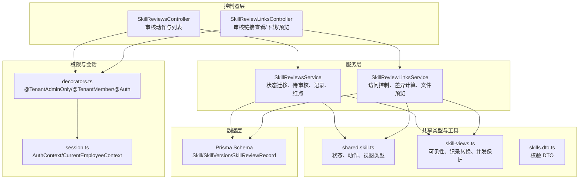
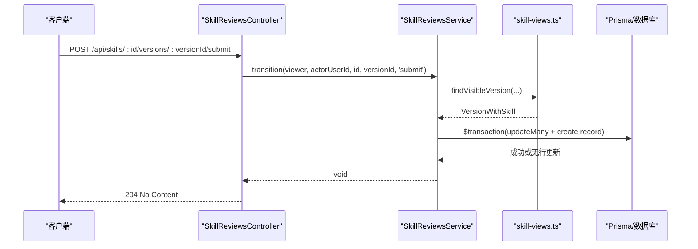
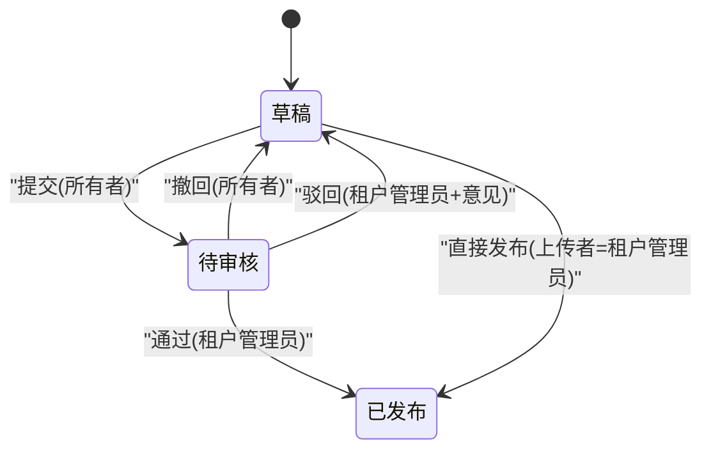
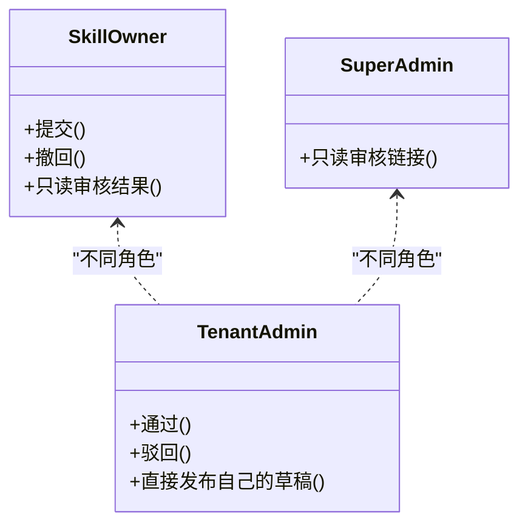
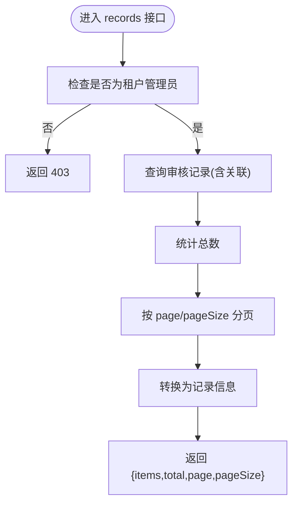
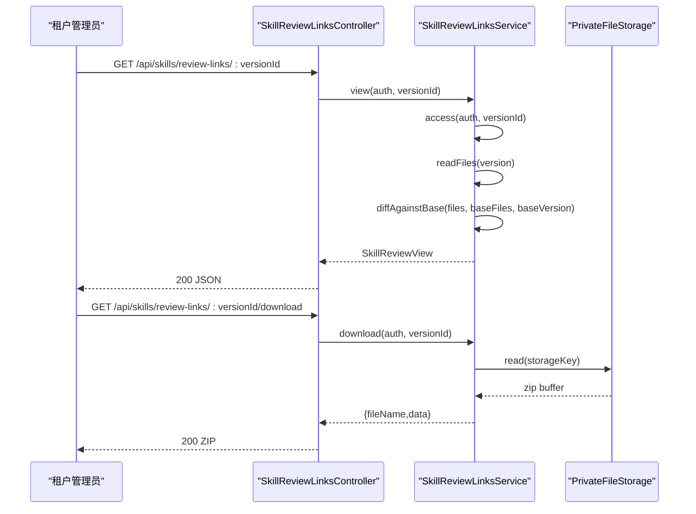
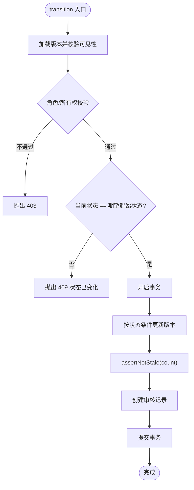
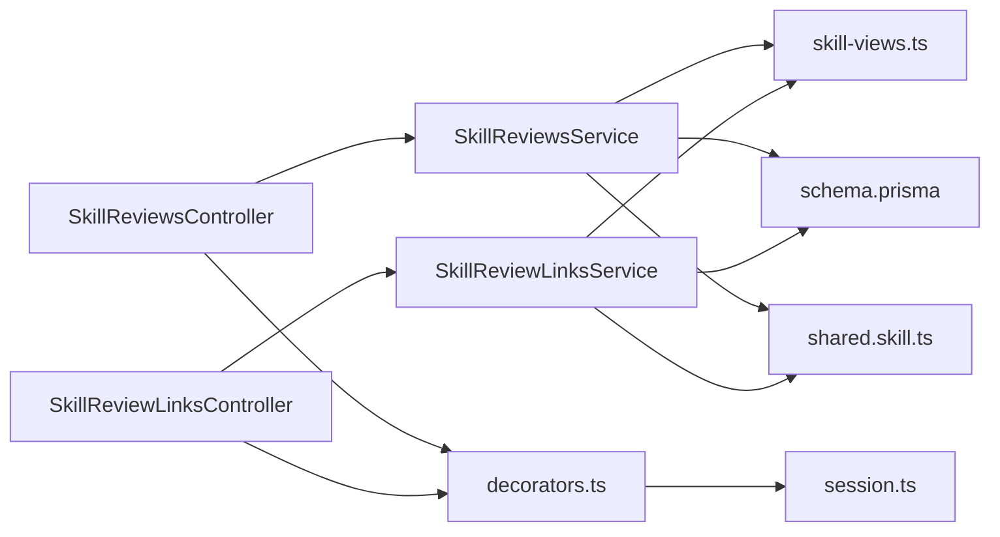

# 技能审核接口

<cite>
**本文引用的文件**   
- [skill-reviews.controller.ts](file://apps/server/src/skills/skill-reviews.controller.ts)
- [skill-reviews.service.ts](file://apps/server/src/skills/skill-reviews.service.ts)
- [skill-review-links.controller.ts](file://apps/server/src/skills/skill-review-links.controller.ts)
- [skill-review-links.service.ts](file://apps/server/src/skills/skill-review-links.service.ts)
- [skills.dto.ts](file://apps/server/src/skills/skills.dto.ts)
- [skill-views.ts](file://apps/server/src/skills/skill-views.ts)
- [decorators.ts](file://apps/server/src/auth/decorators.ts)
- [session.ts](file://apps/server/src/auth/session.ts)
- [schema.prisma](file://apps/server/prisma/schema.prisma)
- [skill.ts](file://packages/shared/src/skill.ts)
- [skill-reviews.e2e-spec.ts](file://apps/server/test/skill-reviews.e2e-spec.ts)
- [skill-review-links.e2e-spec.ts](file://apps/server/test/skill-review-links.e2e-spec.ts)
</cite>

## 目录
1. [引言](#引言)
2. [项目结构与职责划分](#项目结构与职责划分)
3. [核心组件](#核心组件)
4. [架构总览](#架构总览)
5. [详细组件分析](#详细组件分析)
6. [依赖关系分析](#依赖关系分析)
7. [性能与一致性](#性能与一致性)
8. [故障排查指南](#故障排查指南)
9. [结论](#结论)
10. [附录：接口清单与示例](#附录接口清单与示例)

## 引言
本文件面向“技能审核”相关接口的后端实现，覆盖以下目标：
- 完整描述技能审核工作流：提交审核、撤回、审批通过、驳回、租户管理员直接发布。
- 明确审核状态机：草稿、待审核、已发布之间的转换规则。
- 说明权限模型：技能所有者、租户管理员、超级管理员在审核链路中的能力边界。
- 提供审核记录查询接口说明：历史、意见、时间、分页。
- 解释审核链接机制：按版本生成可分享的审核入口，支持查看、下载审阅包、预览包内文件。
- 给出状态转换图和数据流程图。
- 提供端到端请求响应示例（以测试用例为事实依据）。
- 说明数据一致性与事务处理机制。

## 项目结构与职责划分
技能审核功能主要分布在 `apps/server/src/skills` 下，分为控制器、服务、视图工具、DTO、权限装饰器与会话上下文，以及数据库模型定义。

**图表来源**
- [skill-reviews.controller.ts:8-75](file://apps/server/src/skills/skill-reviews.controller.ts#L8-L75)
- [skill-review-links.controller.ts:7-32](file://apps/server/src/skills/skill-review-links.controller.ts#L7-L32)
- [skill-reviews.service.ts:20-112](file://apps/server/src/skills/skill-reviews.service.ts#L20-L112)
- [skill-review-links.service.ts:63-146](file://apps/server/src/skills/skill-review-links.service.ts#L63-L146)
- [skill-views.ts:13-110](file://apps/server/src/skills/skill-views.ts#L13-L110)
- [skills.dto.ts:90-113](file://apps/server/src/skills/skills.dto.ts#L90-L113)
- [decorators.ts:1-18](file://apps/server/src/auth/decorators.ts#L1-L18)
- [session.ts:5-23](file://apps/server/src/auth/session.ts#L5-L23)
- [schema.prisma:164-218](file://apps/server/prisma/schema.prisma#L164-L218)
- [skill.ts:92-154](file://packages/shared/src/skill.ts#L92-L154)

**章节来源**
- [skill-reviews.controller.ts:8-75](file://apps/server/src/skills/skill-reviews.controller.ts#L8-L75)
- [skill-review-links.controller.ts:7-32](file://apps/server/src/skills/skill-review-links.controller.ts#L7-L32)
- [skill-reviews.service.ts:20-112](file://apps/server/src/skills/skill-reviews.service.ts#L20-L112)
- [skill-review-links.service.ts:63-146](file://apps/server/src/skills/skill-review-links.service.ts#L63-L146)
- [skill-views.ts:13-110](file://apps/server/src/skills/skill-views.ts#L13-L110)
- [skills.dto.ts:90-113](file://apps/server/src/skills/skills.dto.ts#L90-L113)
- [decorators.ts:1-18](file://apps/server/src/auth/decorators.ts#L1-L18)
- [session.ts:5-23](file://apps/server/src/auth/session.ts#L5-L23)
- [schema.prisma:164-218](file://apps/server/prisma/schema.prisma#L164-L218)
- [skill.ts:92-154](file://packages/shared/src/skill.ts#L92-L154)

## 核心组件
- SkillReviewsController：暴露审核动作（提交、撤回、通过、驳回、直接发布）、待审核列表、全租户审核记录、菜单红点。
- SkillReviewsService：封装审核状态迁移、并发安全、待审核聚合、审核记录分页、红点计数。
- SkillReviewLinksController：暴露审核链接查看、下载审阅包、预览包内文件。
- SkillReviewLinksService：基于登录身份进行访问控制（超管、租户管理员、所有者），计算文件差异，返回审核详情。
- skill-views.ts：通用视图转换、可见性判断、审核记录排序与最新记录提取、并发冲突提示。
- skills.dto.ts：审核相关 DTO（驳回意见、审核记录分页参数）。
- decorators.ts / session.ts：认证与授权装饰器、会话上下文。
- schema.prisma：Skill、SkillVersion、SkillReviewRecord 等核心表结构。
- shared.skill.ts：审核状态、动作、视图类型与常量。

**章节来源**
- [skill-reviews.controller.ts:8-75](file://apps/server/src/skills/skill-reviews.controller.ts#L8-L75)
- [skill-reviews.service.ts:20-112](file://apps/server/src/skills/skill-reviews.service.ts#L20-L112)
- [skill-review-links.controller.ts:7-32](file://apps/server/src/skills/skill-review-links.controller.ts#L7-L32)
- [skill-review-links.service.ts:63-146](file://apps/server/src/skills/skill-review-links.service.ts#L63-L146)
- [skill-views.ts:13-110](file://apps/server/src/skills/skill-views.ts#L13-L110)
- [skills.dto.ts:90-113](file://apps/server/src/skills/skills.dto.ts#L90-L113)
- [decorators.ts:1-18](file://apps/server/src/auth/decorators.ts#L1-L18)
- [session.ts:5-23](file://apps/server/src/auth/session.ts#L5-L23)
- [schema.prisma:164-218](file://apps/server/prisma/schema.prisma#L164-L218)
- [skill.ts:92-154](file://packages/shared/src/skill.ts#L92-L154)

## 架构总览
审核流程围绕“版本状态”展开，控制器负责路由与鉴权，服务负责业务规则与数据持久化，视图工具负责数据转换与可见性判断，共享类型统一前后端契约。

**图表来源**
- [skill-reviews.controller.ts:36-40](file://apps/server/src/skills/skill-reviews.controller.ts#L36-L40)
- [skill-reviews.service.ts:55-67](file://apps/server/src/skills/skill-reviews.service.ts#L55-L67)
- [skill-views.ts:96-110](file://apps/server/src/skills/skill-views.ts#L96-L110)

## 详细组件分析

### 审核状态机与转换规则
- 状态集合：草稿、待审核、已发布。
- 动作集合：提交、撤回、通过、驳回、直接发布。
- 转换规则：
  - 草稿 → 待审核：提交（仅技能所有者）。
  - 待审核 → 草稿：撤回（仅技能所有者）；驳回（租户管理员，需填写意见）。
  - 待审核 → 已发布：通过（租户管理员）。
  - 草稿 → 已发布：直接发布（仅上传该草稿的租户管理员）。

**图表来源**
- [skill-reviews.service.ts:32-44](file://apps/server/src/skills/skill-reviews.service.ts#L32-L44)
- [skill.ts:92-109](file://packages/shared/src/skill.ts#L92-L109)

**章节来源**
- [skill-reviews.service.ts:20-44](file://apps/server/src/skills/skill-reviews.service.ts#L20-L44)
- [skill.ts:92-109](file://packages/shared/src/skill.ts#L92-L109)

### 权限控制模型
- 技能所有者：可提交和撤回自己技能的版本；对审核结果只读。
- 租户管理员：可对“待审核”版本执行通过或驳回；可直接发布自己上传的草稿；不可直接发布员工草稿。
- 超级管理员：可打开审核链接只读，但不具备常规审核操作权限（审核接口受 @TenantAdminOnly 限制）。

**图表来源**
- [skill-reviews.controller.ts:48-74](file://apps/server/src/skills/skill-reviews.controller.ts#L48-L74)
- [skill-review-links.service.ts:135-145](file://apps/server/src/skills/skill-review-links.service.ts#L135-L145)
- [skill-reviews.e2e-spec.ts:373-377](file://apps/server/test/skill-reviews.e2e-spec.ts#L373-L377)

**章节来源**
- [skill-reviews.controller.ts:12-74](file://apps/server/src/skills/skill-reviews.controller.ts#L12-L74)
- [skill-review-links.service.ts:135-145](file://apps/server/src/skills/skill-review-links.service.ts#L135-L145)
- [skill-reviews.e2e-spec.ts:373-377](file://apps/server/test/skill-reviews.e2e-spec.ts#L373-L377)

### 审核记录查询接口
- 待审核列表：GET /api/skills/reviews，仅租户管理员可访问，返回按提交时间从早到晚的待审核项，包含是否首次提交、版本信息与提交时间。
- 全租户审核记录：GET /api/skills/reviews/records?page=&pageSize=，仅租户管理员可访问，返回从新到旧的分页记录，包含操作人姓名、动作、意见、时间。
- 菜单红点：GET /api/skills/badges，返回租户管理员的待审核数与员工被驳回且仍为草稿的版本数。

**图表来源**
- [skill-reviews.controller.ts:24-29](file://apps/server/src/skills/skill-reviews.controller.ts#L24-L29)
- [skill-reviews.service.ts:92-100](file://apps/server/src/skills/skill-reviews.service.ts#L92-L100)
- [skill-views.ts:43-59](file://apps/server/src/skills/skill-views.ts#L43-L59)

**章节来源**
- [skill-reviews.controller.ts:17-34](file://apps/server/src/skills/skill-reviews.controller.ts#L17-L34)
- [skill-reviews.service.ts:69-111](file://apps/server/src/skills/skill-reviews.service.ts#L69-L111)
- [skills.dto.ts:98-113](file://apps/server/src/skills/skills.dto.ts#L98-L113)
- [skill-views.ts:43-59](file://apps/server/src/skills/skill-views.ts#L43-L59)

### 审核链接管理机制
- 审核链接路径：/skills/review/:versionId，由前端根据版本 ID 生成。
- 访问控制：
  - 必须登录。
  - 允许角色：当前租户的租户管理员、技能所有者、超级管理员。
  - 其他人员（含其他租户管理员）一律 403。
- 能力：
  - 租户管理员且版本处于“待审核”时可审核（canReview=true）。
  - 若管理员当前不在对应租户，返回 needsTenantSwitch=true，提示先切换租户。
  - 所有者与超管只读。
- 附加能力：
  - 下载审阅包：GET /api/skills/review-links/:versionId/download，不计入下载次数。
  - 预览包内文件：GET /api/skills/review-links/:versionId/file?path=...，文本内容超过上限会截断，二进制只返回大小。

**图表来源**
- [skill-review-links.controller.ts:15-31](file://apps/server/src/skills/skill-review-links.controller.ts#L15-L31)
- [skill-review-links.service.ts:75-133](file://apps/server/src/skills/skill-review-links.service.ts#L75-L133)

**章节来源**
- [skill-review-links.controller.ts:7-32](file://apps/server/src/skills/skill-review-links.controller.ts#L7-L32)
- [skill-review-links.service.ts:63-146](file://apps/server/src/skills/skill-review-links.service.ts#L63-L146)
- [skill.ts:295-315](file://packages/shared/src/skill.ts#L295-L315)
- [skill-review-links.e2e-spec.ts:56-129](file://apps/server/test/skill-review-links.e2e-spec.ts#L56-L129)

### 数据一致性保证与事务处理
- 并发安全：
  - 使用 Prisma 事务包裹“按当前状态条件更新版本 + 写入审核记录”。
  - 通过“期望起始状态 = 当前状态”的条件更新，确保同一版本同时被多个管理员处理时只有一个成功。
  - 未命中更新行时抛出“状态已变化”错误，避免脏写。
- 幂等性：
  - 重复提交或重复审批会返回冲突错误，提示刷新后查看。
- 审计追踪：
  - 每次状态变更都会写入 SkillReviewRecord，保留操作人、动作、意见与时间。

**图表来源**
- [skill-reviews.service.ts:55-67](file://apps/server/src/skills/skill-reviews.service.ts#L55-L67)
- [skill-views.ts:103-110](file://apps/server/src/skills/skill-views.ts#L103-L110)

**章节来源**
- [skill-reviews.service.ts:55-67](file://apps/server/src/skills/skill-reviews.service.ts#L55-L67)
- [skill-views.ts:103-110](file://apps/server/src/skills/skill-views.ts#L103-L110)

## 依赖关系分析
- 控制器依赖服务：SkillReviewsController → SkillReviewsService；SkillReviewLinksController → SkillReviewLinksService。
- 服务依赖视图工具：SkillReviewsService 与 SkillReviewLinksService 均复用 skill-views.ts 的可见性、记录转换、排序与并发保护逻辑。
- 权限装饰器与会话：控制器通过 @TenantAdminOnly、@TenantMember、@Auth 注入 AuthContext 与 CurrentEmployeeContext。
- 数据模型：Prisma Schema 定义 Skill、SkillVersion、SkillReviewRecord 等实体及枚举。
- 共享类型：shared.skill.ts 定义审核状态、动作、视图类型与常量，供前后端共用。

**图表来源**
- [skill-reviews.controller.ts:8-75](file://apps/server/src/skills/skill-reviews.controller.ts#L8-L75)
- [skill-review-links.controller.ts:7-32](file://apps/server/src/skills/skill-review-links.controller.ts#L7-L32)
- [skill-reviews.service.ts:20-112](file://apps/server/src/skills/skill-reviews.service.ts#L20-L112)
- [skill-review-links.service.ts:63-146](file://apps/server/src/skills/skill-review-links.service.ts#L63-L146)
- [skill-views.ts:13-110](file://apps/server/src/skills/skill-views.ts#L13-L110)
- [decorators.ts:1-18](file://apps/server/src/auth/decorators.ts#L1-L18)
- [session.ts:5-23](file://apps/server/src/auth/session.ts#L5-L23)
- [schema.prisma:164-218](file://apps/server/prisma/schema.prisma#L164-L218)
- [skill.ts:92-154](file://packages/shared/src/skill.ts#L92-L154)

**章节来源**
- [skill-reviews.controller.ts:8-75](file://apps/server/src/skills/skill-reviews.controller.ts#L8-L75)
- [skill-review-links.controller.ts:7-32](file://apps/server/src/skills/skill-review-links.controller.ts#L7-L32)
- [skill-reviews.service.ts:20-112](file://apps/server/src/skills/skill-reviews.service.ts#L20-L112)
- [skill-review-links.service.ts:63-146](file://apps/server/src/skills/skill-review-links.service.ts#L63-L146)
- [skill-views.ts:13-110](file://apps/server/src/skills/skill-views.ts#L13-L110)
- [decorators.ts:1-18](file://apps/server/src/auth/decorators.ts#L1-L18)
- [session.ts:5-23](file://apps/server/src/auth/session.ts#L5-L23)
- [schema.prisma:164-218](file://apps/server/prisma/schema.prisma#L164-L218)
- [skill.ts:92-154](file://packages/shared/src/skill.ts#L92-L154)

## 性能与一致性
- 待审核列表：先查所有“待审核”版本，再批量拉取提交记录并按版本去重取最新一条，最后按提交时间排序。
- 审核记录分页：使用事务并行执行“查询记录 + 统计总数”，减少往返次数。
- 审核链接差异计算：基于 sha256 比较基准版本与本版本的文件哈希，得到新增、修改、删除列表，避免大体积 diff 文本传输。
- 并发安全：通过“期望状态条件更新 + assertNotStale”保证最终一致性，避免重复审批导致的状态错乱。

[本节为通用性能讨论，不直接分析具体代码文件]

## 故障排查指南
- 403 无权限：
  - 普通员工尝试通过或驳回：仅租户管理员可访问。
  - 非所有者尝试撤回：只有技能所有者可以撤回。
  - 非上传者租户管理员尝试直接发布：只有上传该草稿的租户管理员可以直接发布。
  - 审核链接被非允许角色访问：仅租户管理员、所有者、超管可查看。
- 409 状态已变化：
  - 重复提交或重复审批：版本状态已被他人处理，请刷新后查看。
- 400 参数错误：
  - 驳回意见为空或超长：请填写驳回意见且不超过最大长度。
  - 审核链接预览文件未传 path：请指定要预览的文件。
  - 非法路径穿越：压缩包中包含非法路径或路径越界。
- 404 资源不存在：
  - Skill 不存在或非正式版本不可见（非所有者/管理员且非正式版本）。
  - 审核链接预览文件不存在。

**章节来源**
- [skill-reviews.e2e-spec.ts:145-230](file://apps/server/test/skill-reviews.e2e-spec.ts#L145-L230)
- [skill-review-links.e2e-spec.ts:110-122](file://apps/server/test/skill-review-links.e2e-spec.ts#L110-L122)
- [skill-review-links.e2e-spec.ts:180-212](file://apps/server/test/skill-review-links.e2e-spec.ts#L180-L212)
- [skill-views.ts:15-25](file://apps/server/src/skills/skill-views.ts#L15-L25)
- [skill-views.ts:96-110](file://apps/server/src/skills/skill-views.ts#L96-L110)

## 结论
技能审核系统以“版本状态”为核心，通过控制器与服务分层实现清晰的职责划分；权限模型严格区分所有者、租户管理员与超管；审核链接机制在不暴露版本存在性的前提下提供安全的审阅入口；并发安全通过事务与条件更新保障数据一致性；审核记录与红点机制为管理侧提供了完整的可观测性。整体设计兼顾安全性、可维护性与用户体验。

[本节为总结性内容，不直接分析具体代码文件]

## 附录：接口清单与示例

### 审核动作接口
- POST /api/skills/:id/versions/:versionId/submit
  - 作用：提交审核（草稿 → 待审核）
  - 权限：技能所有者
  - 响应：204 No Content
- POST /api/skills/:id/versions/:versionId/withdraw
  - 作用：撤回审核（待审核 → 草稿）
  - 权限：技能所有者
  - 响应：204 No Content
- POST /api/skills/:id/versions/:versionId/approve
  - 作用：通过（待审核 → 已发布）
  - 权限：租户管理员
  - 响应：204 No Content
- POST /api/skills/:id/versions/:versionId/reject
  - 作用：驳回（待审核 → 草稿）
  - 权限：租户管理员
  - 请求体：comment（必填，最大长度见 DTO）
  - 响应：204 No Content
- POST /api/skills/:id/versions/:versionId/publish
  - 作用：直接发布（草稿 → 已发布）
  - 权限：上传该草稿的租户管理员
  - 响应：204 No Content

**章节来源**
- [skill-reviews.controller.ts:36-74](file://apps/server/src/skills/skill-reviews.controller.ts#L36-L74)
- [skills.dto.ts:90-96](file://apps/server/src/skills/skills.dto.ts#L90-L96)

### 审核列表与记录接口
- GET /api/skills/reviews
  - 作用：待审核列表（按提交时间从早到晚）
  - 权限：租户管理员
  - 响应：PendingSkillReview[]
- GET /api/skills/reviews/records?page=&pageSize=
  - 作用：全租户审核记录（从新到旧分页）
  - 权限：租户管理员
  - 响应：{ items: SkillReviewRecordInfo[], total, page, pageSize }
- GET /api/skills/badges
  - 作用：菜单红点（待审核数、被驳回草稿数）
  - 权限：租户管理员
  - 响应：{ pendingReviews, rejectedDrafts }

**章节来源**
- [skill-reviews.controller.ts:17-34](file://apps/server/src/skills/skill-reviews.controller.ts#L17-L34)
- [skill-reviews.service.ts:69-111](file://apps/server/src/skills/skill-reviews.service.ts#L69-L111)
- [skills.dto.ts:98-113](file://apps/server/src/skills/skills.dto.ts#L98-L113)

### 审核链接接口
- GET /api/skills/review-links/:versionId
  - 作用：查看审核详情（版本信息、SKILL.md、文件树、差异、审核记录、可见性）
  - 权限：登录用户且为租户管理员/所有者/超管
  - 响应：SkillReviewView
- GET /api/skills/review-links/:versionId/download
  - 作用：下载审阅包（不计入下载次数）
  - 权限：同查看权限
  - 响应：ZIP 文件流
- GET /api/skills/review-links/:versionId/file?path=...
  - 作用：预览包内文件（文本截断、二进制只返回大小）
  - 权限：同查看权限
  - 响应：SkillFilePreview

**章节来源**
- [skill-review-links.controller.ts:15-31](file://apps/server/src/skills/skill-review-links.controller.ts#L15-L31)
- [skill-review-links.service.ts:75-133](file://apps/server/src/skills/skill-review-links.service.ts#L75-L133)
- [skill.ts:295-315](file://packages/shared/src/skill.ts#L295-L315)

### 端到端示例（基于测试用例）
- 员工新建 Skill 并提交审核：
  - 创建 Skill（默认提交审核）→ 返回 workingVersion.status=pending，reviewRecords 包含 submit。
  - 其他员工无法看到该 Skill 与版本；管理员可查看详情与下载审阅。
- 管理员通过：
  - 调用 approve → 204；其他员工随即可见 currentVersion。
- 管理员驳回：
  - 调用 reject(comment) → 204；workingVersion.status=draft，rejectComment 显示给所有者。
- 两名管理员并发处理同一版本：
  - 只有一个成功，其余返回 409 状态已变化。
- 管理员直接发布自己的草稿：
  - 调用 publish → 204；reviewRecords 包含 publish_direct。
- 审核链接查看：
  - 租户管理员可审核（canReview=true）；所有者与超管只读；其他租户管理员或普通员工 403。
- 审核链接下载与预览：
  - 下载 ZIP 不计入下载次数；预览文本超过上限截断，二进制只返回大小；非法路径拒绝。

**章节来源**
- [skill-reviews.e2e-spec.ts:63-230](file://apps/server/test/skill-reviews.e2e-spec.ts#L63-L230)
- [skill-review-links.e2e-spec.ts:56-178](file://apps/server/test/skill-review-links.e2e-spec.ts#L56-L178)