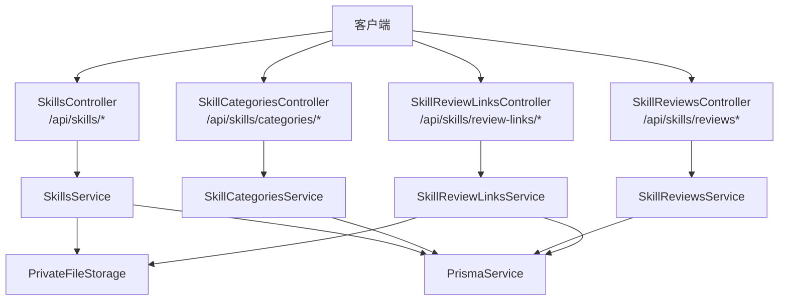
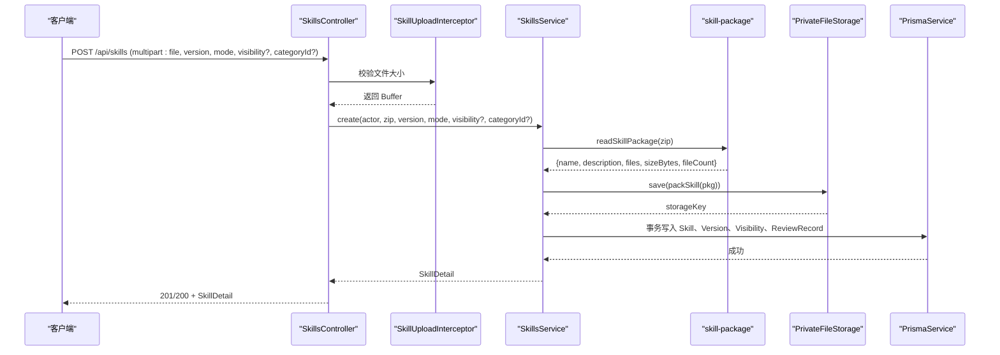
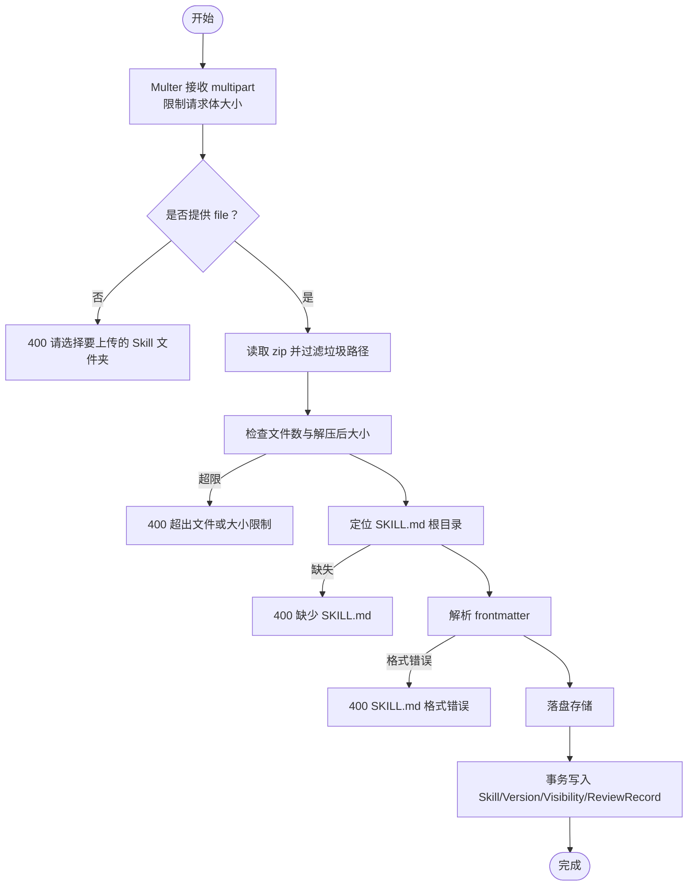
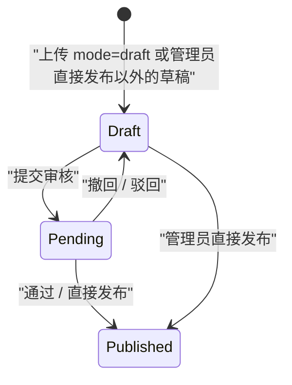

# 技能管理接口

<cite>
**本文引用的文件**   
- [skills.controller.ts](file://apps/server/src/skills/skills.controller.ts)
- [skills.service.ts](file://apps/server/src/skills/skills.service.ts)
- [skill-upload.ts](file://apps/server/src/skills/skill-upload.ts)
- [skill-package.ts](file://apps/server/src/skills/skill-package.ts)
- [skill-categories.controller.ts](file://apps/server/src/skills/skill-categories.controller.ts)
- [skill-categories.service.ts](file://apps/server/src/skills/skill-categories.service.ts)
- [skill-reviews.controller.ts](file://apps/server/src/skills/skill-reviews.controller.ts)
- [skill-reviews.service.ts](file://apps/server/src/skills/skill-reviews.service.ts)
- [skill-review-links.controller.ts](file://apps/server/src/skills/skill-review-links.controller.ts)
- [skill-review-links.service.ts](file://apps/server/src/skills/skill-review-links.service.ts)
- [skills.dto.ts](file://apps/server/src/skills/skills.dto.ts)
- [skill.ts](file://packages/shared/src/skill.ts)
- [file-upload.interceptor.ts](file://apps/server/src/storage/file-upload.interceptor.ts)
- [decorators.ts](file://apps/server/src/auth/decorators.ts)
</cite>

## 目录
1. [简介](#简介)
2. [项目结构与入口](#项目结构与入口)
3. [核心组件总览](#核心组件总览)
4. [架构与数据流](#架构与数据流)
5. [技能包 CRUD 接口](#技能包-crud-接口)
6. [技能分类管理接口](#技能分类管理接口)
7. [技能审核相关接口](#技能审核相关接口)
8. [ZIP 上传与 SKILL.md 校验规则](#zip-上传与-skillmd-校验规则)
9. [版本控制机制](#版本控制机制)
10. [多租户数据隔离](#多租户数据隔离)
11. [请求与响应示例](#请求与响应示例)
12. [错误处理与状态码](#错误处理与状态码)
13. [速率限制与安全最佳实践](#速率限制与安全最佳实践)
14. [故障排查指南](#故障排查指南)
15. [结论](#结论)

## 简介
本文件面向使用“技能管理”后端接口的开发者，完整说明技能包的上传、下载、更新、删除，技能分类的增删改查，以及技能审核流程中的提交、撤回、通过、驳回、直接发布、审核链接查看与预览等能力。文档同时覆盖权限模型、多租户隔离、SemVer 语义化版本、ZIP 包校验、错误响应和部署安全建议。

## 项目结构与入口
技能管理相关代码集中在 `apps/server/src/skills` 下，按职责拆分为控制器、服务、DTO、上传与包解析、分类、审核、审核链接等模块；共享类型与常量位于 `packages/shared/src/skill.ts`。

**图表来源**
- [skills.controller.ts:12-144](file://apps/server/src/skills/skills.controller.ts#L12-L144)
- [skill-categories.controller.ts:9-46](file://apps/server/src/skills/skill-categories.controller.ts#L9-L46)
- [skill-reviews.controller.ts:12-75](file://apps/server/src/skills/skill-reviews.controller.ts#L12-L75)
- [skill-review-links.controller.ts:11-32](file://apps/server/src/skills/skill-review-links.controller.ts#L11-L32)

**章节来源**
- [skills.controller.ts:12-144](file://apps/server/src/skills/skills.controller.ts#L12-L144)
- [skill-categories.controller.ts:9-46](file://apps/server/src/skills/skill-categories.controller.ts#L9-L46)
- [skill-reviews.controller.ts:12-75](file://apps/server/src/skills/skill-reviews.controller.ts#L12-L75)
- [skill-review-links.controller.ts:11-32](file://apps/server/src/skills/skill-review-links.controller.ts#L11-L32)

## 核心组件总览
- SkillsController：技能包目录、详情、创建、版本管理、可见性、分类、下架/上架、下载。
- SkillCategoriesController：分类列表、新增、批量预设、重命名、删除。
- SkillReviewsController：待审核列表、审核记录分页、徽章、提交/撤回/通过/驳回/直接发布。
- SkillReviewLinksController：审核链接查看、审阅下载、包内文件预览。
- SkillsService：技能生命周期、版本比较、可见性与分类变更审计、存储落盘与清理。
- SkillCategoriesService：分类 CRUD、上限与唯一性、预设填充。
- SkillReviewsService：状态迁移、审核记录、待审队列、红点统计。
- SkillReviewLinksService：基于登录身份与租户管理员/所有者/超管角色的访问控制、差异计算、文件预览。
- skill-upload / file-upload.interceptor：multipart 单文件上传拦截、大小限制、中文提示。
- skill-package：ZIP 解包、SKILL.md 解析、路径规范化、容量限制、打包与解压。
- skills.dto：请求参数校验（版本号、模式、可见性、分类、分页等）。
- decorators：认证与角色装饰器（当前员工、租户成员、租户管理员、超级管理员）。

**章节来源**
- [skills.controller.ts:12-144](file://apps/server/src/skills/skills.controller.ts#L12-L144)
- [skills.service.ts:114-468](file://apps/server/src/skills/skills.service.ts#L114-L468)
- [skill-categories.controller.ts:9-46](file://apps/server/src/skills/skill-categories.controller.ts#L9-L46)
- [skill-categories.service.ts:20-82](file://apps/server/src/skills/skill-categories.service.ts#L20-L82)
- [skill-reviews.controller.ts:12-75](file://apps/server/src/skills/skill-reviews.controller.ts#L12-L75)
- [skill-reviews.service.ts:47-112](file://apps/server/src/skills/skill-reviews.service.ts#L47-L112)
- [skill-review-links.controller.ts:11-32](file://apps/server/src/skills/skill-review-links.controller.ts#L11-L32)
- [skill-review-links.service.ts:68-146](file://apps/server/src/skills/skill-review-links.service.ts#L68-L146)
- [skill-upload.ts:5-12](file://apps/server/src/skills/skill-upload.ts#L5-L12)
- [file-upload.interceptor.ts:5-27](file://apps/server/src/storage/file-upload.interceptor.ts#L5-L27)
- [skill-package.ts:19-73](file://apps/server/src/skills/skill-package.ts#L19-L73)
- [skills.dto.ts:45-145](file://apps/server/src/skills/skills.dto.ts#L45-L145)
- [decorators.ts:4-17](file://apps/server/src/auth/decorators.ts#L4-L17)

## 架构与数据流
技能管理采用 NestJS 控制器 → 服务 → Prisma 数据库 + PrivateFileStorage 的三层结构。上传链路中，ZIP 先经 multer 限流，再在内存中解包并校验 SKILL.md，成功后落盘到对象存储，最后写入版本与审核记录。

**图表来源**
- [skills.controller.ts:47-57](file://apps/server/src/skills/skills.controller.ts#L47-L57)
- [skill-upload.ts:5-12](file://apps/server/src/skills/skill-upload.ts#L5-L12)
- [skill-package.ts:19-57](file://apps/server/src/skills/skill-package.ts#L19-L57)
- [skills.service.ts:224-253](file://apps/server/src/skills/skills.service.ts#L224-L253)

## 技能包 CRUD 接口

### 列出目录
- 方法：GET
- 路径：`/api/skills`
- 权限：租户成员
- 查询参数：
  - `keyword`：名称或描述关键词（不区分大小写）
  - `uploaderId`：按上传过该 Skill 任一版本的员工筛选
  - `categoryId`：按分类筛选；传 `none` 表示未分类
- 响应：`SkillSummary[]`
- 行为：仅返回有正式版本且当前用户可见的 Skill，按名称排序。

**章节来源**
- [skills.controller.ts:17-21](file://apps/server/src/skills/skills.controller.ts#L17-L21)
- [skills.service.ts:122-136](file://apps/server/src/skills/skills.service.ts#L122-L136)
- [skills.dto.ts:115-129](file://apps/server/src/skills/skills.dto.ts#L115-L129)
- [skill.ts:198-204](file://packages/shared/src/skill.ts#L198-L204)

### 管理视图（租户管理员）
- 方法：GET
- 路径：`/api/skills/manage`
- 权限：租户管理员
- 查询参数：继承目录搜索参数，另加：
  - `status`：`draft` | `pending` | `published`
  - `visibility`：`tenant` | `departments` | `employees` | `private`
  - `unlisted`：`true` | `false`
- 响应：`SkillManageRow[]`

**章节来源**
- [skills.controller.ts:23-28](file://apps/server/src/skills/skills.controller.ts#L23-L28)
- [skills.service.ts:146-168](file://apps/server/src/skills/skills.service.ts#L146-L168)
- [skills.dto.ts:133-145](file://apps/server/src/skills/skills.dto.ts#L133-L145)
- [skill.ts:332-345](file://packages/shared/src/skill.ts#L332-L345)

### 选择可见范围选项
- 方法：GET
- 路径：`/api/skills/visibility-options`
- 权限：租户成员
- 响应：`SkillVisibilityOptions`（部门树与在职员工）

**章节来源**
- [skills.controller.ts:30-34](file://apps/server/src/skills/skills.controller.ts#L30-L34)
- [skills.service.ts:321-328](file://apps/server/src/skills/skills.service.ts#L321-L328)
- [skill.ts:141-145](file://packages/shared/src/skill.ts#L141-L145)

### 我的 Skill
- 方法：GET
- 路径：`/api/skills/mine`
- 权限：租户成员
- 响应：`MySkill[]`

**章节来源**
- [skills.controller.ts:36-40](file://apps/server/src/skills/skills.controller.ts#L36-L40)
- [skills.service.ts:208-222](file://apps/server/src/skills/skills.service.ts#L208-L222)
- [skill.ts:347-353](file://packages/shared/src/skill.ts#L347-L353)

### 获取详情
- 方法：GET
- 路径：`/api/skills/:id`
- 权限：租户成员（需满足可见性）
- 响应：`SkillDetail`

**章节来源**
- [skills.controller.ts:42-45](file://apps/server/src/skills/skills.controller.ts#L42-L45)
- [skills.service.ts:138-144](file://apps/server/src/skills/skills.service.ts#L138-L144)
- [skill.ts:229-251](file://packages/shared/src/skill.ts#L229-L251)

### 新建技能包
- 方法：POST
- 路径：`/api/skills`
- 权限：租户成员
- 请求体：multipart/form-data
  - `file`：zip 压缩包
  - `version`：x.y.z 语义化版本
  - `mode`：可选，`publish` | `draft` | `submit`
  - `visibility`：可选，`tenant` | `departments` | `employees` | `private`
  - `departmentIds`：可选，部门 ID 数组
  - `employeeIds`：可选，员工 ID 数组
  - `categoryId`：可选，分类 ID（空字符串视为不选）
- 响应：`SkillDetail`
- 行为：
  - 非管理员默认提交审核，管理员默认直接发布；`draft` 一律存草稿。
  - 名称冲突时返回 409，若可看到已有 Skill，则附带其 id 引导上传新版本。

**章节来源**
- [skills.controller.ts:47-57](file://apps/server/src/skills/skills.controller.ts#L47-L57)
- [skills.service.ts:224-253](file://apps/server/src/skills/skills.service.ts#L224-L253)
- [skills.dto.ts:45-66](file://apps/server/src/skills/skills.dto.ts#L45-L66)
- [skill.ts:394-400](file://packages/shared/src/skill.ts#L394-L400)

### 修改可见性
- 方法：PATCH
- 路径：`/api/skills/:id/visibility`
- 权限：所有者或租户管理员
- 请求体：`UpdateSkillVisibilityDto`
- 响应：`SkillDetail`
- 行为：立即生效，记录一条「修改可见性」审计。

**章节来源**
- [skills.controller.ts:59-68](file://apps/server/src/skills/skills.controller.ts#L59-L68)
- [skills.service.ts:284-299](file://apps/server/src/skills/skills.service.ts#L284-L299)
- [skills.dto.ts:84-88](file://apps/server/src/skills/skills.dto.ts#L84-L88)

### 修改分类
- 方法：PATCH
- 路径：`/api/skills/:id/category`
- 权限：所有者或租户管理员
- 请求体：`UpdateSkillCategoryDto`（`null` 表示清空）
- 响应：`SkillDetail`
- 行为：立即生效，记录一条「修改分类」审计。

**章节来源**
- [skills.controller.ts:70-79](file://apps/server/src/skills/skills.controller.ts#L70-L79)
- [skills.service.ts:301-319](file://apps/server/src/skills/skills.service.ts#L301-L319)
- [skills.dto.ts:76-82](file://apps/server/src/skills/skills.dto.ts#L76-L82)

### 上传新版本
- 方法：POST
- 路径：`/api/skills/:id/versions`
- 权限：所有者或租户管理员
- 请求体：multipart/form-data（同新建）
- 响应：`SkillDetail`
- 行为：
  - 同一 Skill 同时最多一个非正式版本。
  - 新版本号必须严格大于已有最高版本。
  - SKILL.md 的 name 必须与 Skill 名称一致。

**章节来源**
- [skills.controller.ts:81-92](file://apps/server/src/skills/skills.controller.ts#L81-L92)
- [skills.service.ts:255-282](file://apps/server/src/skills/skills.service.ts#L255-L282)

### 替换草稿包
- 方法：PUT
- 路径：`/api/skills/:id/versions/:versionId/package`
- 权限：所有者或该草稿上传者
- 请求体：multipart/form-data（仅 `file`）
- 响应：`SkillDetail`
- 行为：版本号不变，用于被驳回后重新上传；旧包文件随后删除。

**章节来源**
- [skills.controller.ts:94-105](file://apps/server/src/skills/skills.controller.ts#L94-L105)
- [skills.service.ts:330-354](file://apps/server/src/skills/skills.service.ts#L330-L354)

### 删除单个版本
- 方法：DELETE
- 路径：`/api/skills/:id/versions/:versionId`
- 权限：租户管理员可删任意版本；其他人只能删自己的草稿
- 响应：204 No Content
- 行为：版本关联的审核记录保留（versionId 置空）；若该版本是最后一个版本，Skill 一并删除。

**章节来源**
- [skills.controller.ts:107-112](file://apps/server/src/skills/skills.controller.ts#L107-L112)
- [skills.service.ts:356-372](file://apps/server/src/skills/skills.service.ts#L356-L372)

### 删除整个 Skill
- 方法：DELETE
- 路径：`/api/skills/:id`
- 权限：所有者或租户管理员
- 响应：204 No Content
- 行为：删除所有版本、审核记录、可见性名单，并清理存储文件。

**章节来源**
- [skills.controller.ts:114-119](file://apps/server/src/skills/skills.controller.ts#L114-L119)
- [skills.service.ts:374-386](file://apps/server/src/skills/skills.service.ts#L374-L386)

### 下架 / 上架
- 方法：POST
- 路径：`/api/skills/:id/unlist`、`/api/skills/:id/relist`
- 权限：租户管理员
- 响应：204 No Content
- 行为：记录 unlist/relist 审计；重复操作返回 409。

**章节来源**
- [skills.controller.ts:121-133](file://apps/server/src/skills/skills.controller.ts#L121-L133)
- [skills.service.ts:388-409](file://apps/server/src/skills/skills.service.ts#L388-L409)

### 下载技能包
- 方法：GET
- 路径：`/api/skills/:id/versions/:versionId/download`
- 权限：具备该版本查看权限的用户
- 响应：`application/zip` 二进制流，文件名 `<name>-<version>.zip`
- 行为：正式版本下载次数 +1；非正式版本不计数。

**章节来源**
- [skills.controller.ts:135-143](file://apps/server/src/skills/skills.controller.ts#L135-L143)
- [skills.service.ts:430-438](file://apps/server/src/skills/skills.service.ts#L430-L438)

## 技能分类管理接口

### 列出分类
- 方法：GET
- 路径：`/api/skills/categories`
- 权限：租户成员可读；租户管理员额外返回每个分类的 Skill 数

**章节来源**
- [skill-categories.controller.ts:14-18](file://apps/server/src/skills/skill-categories.controller.ts#L14-L18)
- [skill-categories.service.ts:24-32](file://apps/server/src/skills/skill-categories.service.ts#L24-L32)
- [skill.ts:171-180](file://packages/shared/src/skill.ts#L171-L180)

### 新增分类
- 方法：POST
- 路径：`/api/skills/categories`
- 权限：租户管理员
- 请求体：`{ name }`
- 响应：分类列表（含计数）

**章节来源**
- [skill-categories.controller.ts:20-24](file://apps/server/src/skills/skill-categories.controller.ts#L20-L24)
- [skill-categories.service.ts:34-44](file://apps/server/src/skills/skill-categories.service.ts#L34-L44)
- [skills.dto.ts:68-74](file://apps/server/src/skills/skills.dto.ts#L68-L74)

### 一键添加常用分类
- 方法：POST
- 路径：`/api/skills/categories/presets`
- 权限：租户管理员
- 行为：只补上本租户还没有的分类；受上限约束。

**章节来源**
- [skill-categories.controller.ts:26-31](file://apps/server/src/skills/skill-categories.controller.ts#L26-L31)
- [skill-categories.service.ts:46-58](file://apps/server/src/skills/skill-categories.service.ts#L46-L58)
- [skill.ts:182-187](file://packages/shared/src/skill.ts#L182-L187)

### 重命名分类
- 方法：PATCH
- 路径：`/api/skills/categories/:id`
- 权限：租户管理员
- 请求体：`{ name }`
- 响应：分类列表（含计数）

**章节来源**
- [skill-categories.controller.ts:33-37](file://apps/server/src/skills/skill-categories.controller.ts#L33-L37)
- [skill-categories.service.ts:60-66](file://apps/server/src/skills/skill-categories.service.ts#L60-L66)

### 删除分类
- 方法：DELETE
- 路径：`/api/skills/categories/:id`
- 权限：租户管理员
- 响应：204 No Content
- 行为：使用该分类的 Skill 变为未分类。

**章节来源**
- [skill-categories.controller.ts:39-45](file://apps/server/src/skills/skill-categories.controller.ts#L39-L45)
- [skill-categories.service.ts:68-72](file://apps/server/src/skills/skill-categories.service.ts#L68-L72)

## 技能审核相关接口

### 待审核列表
- 方法：GET
- 路径：`/api/skills/reviews`
- 权限：租户管理员
- 响应：`PendingSkillReview[]`（按最近提交时间从早到晚）

**章节来源**
- [skill-reviews.controller.ts:17-22](file://apps/server/src/skills/skill-reviews.controller.ts#L17-L22)
- [skill-reviews.service.ts:69-90](file://apps/server/src/skills/skill-reviews.service.ts#L69-L90)
- [skill.ts:355-363](file://packages/shared/src/skill.ts#L355-L363)

### 全租户审核记录分页
- 方法：GET
- 路径：`/api/skills/reviews/records`
- 权限：租户管理员
- 查询参数：
  - `page`：页码，正整数
  - `pageSize`：每页条数，正整数，最大 100
- 响应：`SkillReviewRecordPage`

**章节来源**
- [skill-reviews.controller.ts:24-29](file://apps/server/src/skills/skill-reviews.controller.ts#L24-L29)
- [skill-reviews.service.ts:92-100](file://apps/server/src/skills/skill-reviews.service.ts#L92-L100)
- [skills.dto.ts:98-113](file://apps/server/src/skills/skills.dto.ts#L98-L113)
- [skill.ts:365-370](file://packages/shared/src/skill.ts#L365-L370)

### 菜单红点
- 方法：GET
- 路径：`/api/skills/badges`
- 权限：租户成员
- 响应：`SkillBadges`（待审核数、被驳回且仍是草稿的版本数）

**章节来源**
- [skill-reviews.controller.ts:31-34](file://apps/server/src/skills/skill-reviews.controller.ts#L31-L34)
- [skill-reviews.service.ts:102-111](file://apps/server/src/skills/skill-reviews.service.ts#L102-L111)
- [skill.ts:372-376](file://packages/shared/src/skill.ts#L372-L376)

### 提交审核
- 方法：POST
- 路径：`/api/skills/:id/versions/:versionId/submit`
- 权限：所有者
- 响应：204 No Content
- 行为：草稿 → 审核中，记录 submit。

**章节来源**
- [skill-reviews.controller.ts:36-40](file://apps/server/src/skills/skill-reviews.controller.ts#L36-L40)
- [skill-reviews.service.ts:32-44](file://apps/server/src/skills/skill-reviews.service.ts#L32-L44)
- [skill-reviews.service.ts:51-67](file://apps/server/src/skills/skill-reviews.service.ts#L51-L67)

### 撤回审核
- 方法：POST
- 路径：`/api/skills/:id/versions/:versionId/withdraw`
- 权限：所有者
- 响应：204 No Content
- 行为：审核中 → 草稿，记录 withdraw。

**章节来源**
- [skill-reviews.controller.ts:42-46](file://apps/server/src/skills/skill-reviews.controller.ts#L42-L46)
- [skill-reviews.service.ts:32-44](file://apps/server/src/skills/skill-reviews.service.ts#L32-L44)
- [skill-reviews.service.ts:51-67](file://apps/server/src/skills/skill-reviews.service.ts#L51-L67)

### 通过审核
- 方法：POST
- 路径：`/api/skills/:id/versions/:versionId/approve`
- 权限：租户管理员
- 响应：204 No Content
- 行为：审核中 → 正式，记录 approve。

**章节来源**
- [skill-reviews.controller.ts:48-53](file://apps/server/src/skills/skill-reviews.controller.ts#L48-L53)
- [skill-reviews.service.ts:32-44](file://apps/server/src/skills/skill-reviews.service.ts#L32-L44)
- [skill-reviews.service.ts:51-67](file://apps/server/src/skills/skill-reviews.service.ts#L51-L67)

### 驳回审核
- 方法：POST
- 路径：`/api/skills/:id/versions/:versionId/reject`
- 权限：租户管理员
- 请求体：`{ comment }`
- 响应：204 No Content
- 行为：审核中 → 草稿，记录 reject。

**章节来源**
- [skill-reviews.controller.ts:55-66](file://apps/server/src/skills/skill-reviews.controller.ts#L55-L66)
- [skill-reviews.service.ts:32-44](file://apps/server/src/skills/skill-reviews.service.ts#L32-L44)
- [skill-reviews.service.ts:51-67](file://apps/server/src/skills/skill-reviews.service.ts#L51-L67)
- [skills.dto.ts:90-96](file://apps/server/src/skills/skills.dto.ts#L90-L96)

### 直接发布（租户管理员的草稿）
- 方法：POST
- 路径：`/api/skills/:id/versions/:versionId/publish`
- 权限：租户管理员（且为上传该草稿的管理员）
- 响应：204 No Content
- 行为：草稿 → 正式，记录 publish_direct。

**章节来源**
- [skill-reviews.controller.ts:68-74](file://apps/server/src/skills/skill-reviews.controller.ts#L68-L74)
- [skill-reviews.service.ts:32-44](file://apps/server/src/skills/skill-reviews.service.ts#L32-L44)
- [skill-reviews.service.ts:51-67](file://apps/server/src/skills/skill-reviews.service.ts#L51-L67)

## ZIP 上传与 SKILL.md 校验规则

### 上传限制
- 请求体大小：由 `fileUploadInterceptor` 限制，超过返回 413。
- 包内容限制：忽略垃圾文件后，文件数不超过 500，解压后总大小不超过 20MB。
- 非法路径：绝对路径、包含 `..` 的路径会被拒绝。
- 根目录要求：`SKILL.md` 必须在根目录或唯一的顶层文件夹中。

**章节来源**
- [file-upload.interceptor.ts:5-27](file://apps/server/src/storage/file-upload.interceptor.ts#L5-L27)
- [skill-package.ts:19-57](file://apps/server/src/skills/skill-package.ts#L19-L57)
- [skill.ts:3-21](file://packages/shared/src/skill.ts#L3-L21)
- [skill.ts:23-48](file://packages/shared/src/skill.ts#L23-L48)

### SKILL.md 解析规则
- 必须存在 frontmatter（用 `---` 包裹），包含 `name` 与 `description`。
- `name`：小写字母、数字、连字符，长度不超过 64。
- `description`：非空，长度不超过 1024。
- 上传新版本时，`SKILL.md` 的 `name` 必须与 Skill 名称一致。

**章节来源**
- [skill-package.ts:53-56](file://apps/server/src/skills/skill-package.ts#L53-L56)
- [skill.ts:50-71](file://packages/shared/src/skill.ts#L50-L71)
- [skills.service.ts:471-473](file://apps/server/src/skills/skills.service.ts#L471-L473)

### 上传流程图

**图表来源**
- [skill-upload.ts:5-12](file://apps/server/src/skills/skill-upload.ts#L5-L12)
- [skill-package.ts:19-57](file://apps/server/src/skills/skill-package.ts#L19-L57)
- [skills.service.ts:224-253](file://apps/server/src/skills/skills.service.ts#L224-L253)

## 版本控制机制
- 版本号格式：SemVer 风格的 `x.y.z`，其中 x、y、z 为非负整数段，每段最多 9 位。
- 比较规则：按 major、minor、patch 数值比较。
- 新建版本：必须严格大于已有最高版本；否则返回 400。
- 并发保护：上传新版本时对 Skill 行加锁，确保同一 Skill 同时只有一个非正式版本。
- 版本状态：`draft`（草稿）、`pending`（审核中）、`published`（正式）。

**图表来源**
- [skill-reviews.service.ts:32-44](file://apps/server/src/skills/skill-reviews.service.ts#L32-L44)
- [skills.service.ts:255-282](file://apps/server/src/skills/skills.service.ts#L255-L282)
- [skill.ts:73-94](file://packages/shared/src/skill.ts#L73-L94)

**章节来源**
- [skill.ts:73-94](file://packages/shared/src/skill.ts#L73-L94)
- [skills.service.ts:255-282](file://apps/server/src/skills/skills.service.ts#L255-L282)
- [skill-reviews.service.ts:32-44](file://apps/server/src/skills/skill-reviews.service.ts#L32-L44)

## 多租户数据隔离
- 会话携带 `tenantId`，所有技能查询均带 `tenantId` 条件。
- 其他租户的技能对当前租户视为不存在（404）。
- 分类、部门、员工等维度也按租户隔离。
- 审核链接接口不依赖会话的当前租户，而是根据登录身份与版本所属租户进行授权判断。

**章节来源**
- [skills.service.ts:110-113](file://apps/server/src/skills/skills.service.ts#L110-L113)
- [skill-categories.service.ts:9-14](file://apps/server/src/skills/skill-categories.service.ts#L9-L14)
- [skill-review-links.service.ts:63-67](file://apps/server/src/skills/skill-review-links.service.ts#L63-L67)
- [skill-review-links.service.ts:135-145](file://apps/server/src/skills/skill-review-links.service.ts#L135-L145)

## 请求与响应示例

### 新建技能包（正常流程）
- 请求
  - 方法：POST
  - 路径：`/api/skills`
  - 头：`Content-Type: multipart/form-data`
  - 表单字段：
    - `file`：zip 二进制
    - `version`：`1.0.0`
    - `mode`：`submit`（可选）
    - `visibility`：`tenant`（可选）
    - `categoryId`：`c1`（可选）
- 响应
  - 状态码：201 或 200
  - 主体：`SkillDetail`

**章节来源**
- [skills.controller.ts:47-57](file://apps/server/src/skills/skills.controller.ts#L47-L57)
- [skills.service.ts:224-253](file://apps/server/src/skills/skills.service.ts#L224-L253)
- [skill.ts:229-251](file://packages/shared/src/skill.ts#L229-L251)

### 上传新版本（版本号不合法）
- 请求
  - 方法：POST
  - 路径：`/api/skills/:id/versions`
  - 表单字段：`version=abc`
- 响应
  - 状态码：400
  - 主体：包含版本号格式错误消息

**章节来源**
- [skills.dto.ts:45-50](file://apps/server/src/skills/skills.dto.ts#L45-L50)
- [skills.service.ts:255-282](file://apps/server/src/skills/skills.service.ts#L255-L282)

### 替换草稿包（已被驳回）
- 请求
  - 方法：PUT
  - 路径：`/api/skills/:id/versions/:versionId/package`
  - 表单字段：`file`
- 响应
  - 状态码：200
  - 主体：`SkillDetail`

**章节来源**
- [skills.controller.ts:94-105](file://apps/server/src/skills/skills.controller.ts#L94-L105)
- [skills.service.ts:330-354](file://apps/server/src/skills/skills.service.ts#L330-L354)

### 审核通过
- 请求
  - 方法：POST
  - 路径：`/api/skills/:id/versions/:versionId/approve`
- 响应
  - 状态码：204

**章节来源**
- [skill-reviews.controller.ts:48-53](file://apps/server/src/skills/skill-reviews.controller.ts#L48-L53)
- [skill-reviews.service.ts:51-67](file://apps/server/src/skills/skill-reviews.service.ts#L51-L67)

### 审核链接查看
- 请求
  - 方法：GET
  - 路径：`/api/skills/review-links/:versionId`
- 响应
  - 主体：`SkillReviewView`（含 SKILL.md、差异、可见性、审核记录等）

**章节来源**
- [skill-review-links.controller.ts:15-18](file://apps/server/src/skills/skill-review-links.controller.ts#L15-L18)
- [skill-review-links.service.ts:75-103](file://apps/server/src/skills/skill-review-links.service.ts#L75-L103)
- [skill.ts:298-312](file://packages/shared/src/skill.ts#L298-L312)

### 下载技能包
- 请求
  - 方法：GET
  - 路径：`/api/skills/:id/versions/:versionId/download`
- 响应
  - 类型：`application/zip`
  - 文件名：`<name>-<version>.zip`

**章节来源**
- [skills.controller.ts:135-143](file://apps/server/src/skills/skills.controller.ts#L135-L143)
- [skills.service.ts:430-438](file://apps/server/src/skills/skills.service.ts#L430-L438)

## 错误处理与状态码
- 400：参数校验失败（版本号、模式、可见性、分类、SKILL.md 格式、路径非法、包超限等）。
- 401/403：未登录或无权限（非租户成员、非所有者、非管理员、版本不存在但返回 403 以避免泄露存在性）。
- 404：资源不存在（Skill、版本、分类等）。
- 409：业务冲突（名称冲突、重复下架/上架、已有未成为正式的版本、状态已变化）。
- 413：请求体过大（ZIP 超过限制）。
- 204：删除或状态变更成功（无响应体）。

常见错误场景与对应位置：
- 未提供 file：400。
- ZIP 无法解析：400。
- SKILL.md 缺失或格式错误：400。
- 名称冲突：409，可能附带已有 Skill id。
- 版本号不大于最高版本：400。
- 同一 Skill 已有非正式版本：409。
- 重复操作（如重复下架）：409。
- 状态已变化（并发审核）：409。

**章节来源**
- [skill-upload.ts:8-12](file://apps/server/src/skills/skill-upload.ts#L8-L12)
- [skill-package.ts:19-57](file://apps/server/src/skills/skill-package.ts#L19-L57)
- [skills.service.ts:44-46](file://apps/server/src/skills/skills.service.ts#L44-L46)
- [skills.service.ts:237-253](file://apps/server/src/skills/skills.service.ts#L237-L253)
- [skills.service.ts:269-282](file://apps/server/src/skills/skills.service.ts#L269-L282)
- [skills.service.ts:398-409](file://apps/server/src/skills/skills.service.ts#L398-L409)
- [skill-reviews.service.ts:51-67](file://apps/server/src/skills/skill-reviews.service.ts#L51-L67)
- [file-upload.interceptor.ts:13-23](file://apps/server/src/storage/file-upload.interceptor.ts#L13-L23)

## 速率限制与安全最佳实践
- 上传限制
  - 使用 `fileUploadInterceptor` 限制请求体大小，避免大请求阻塞连接。
  - ZIP 包解压后限制文件数与大小，防止 zip bomb。
  - 路径规范化与忽略垃圾目录，防止路径穿越。
- 权限与鉴权
  - 使用 `@TenantMember()`、`@TenantAdminOnly()`、`@Auth()`、`@CurrentEmployee()` 等装饰器统一鉴权。
  - 审核链接接口不依赖会话租户，按登录身份与版本所属租户判定权限。
- 并发与一致性
  - 关键写操作使用数据库事务与 `FOR UPDATE` 行锁，保证并发安全。
  - 状态迁移以“当前状态 = 期望起始状态”的条件更新，避免竞态。
- 审计与可观测性
  - 可见性、分类、下架/上架、审核动作均记录审核记录，便于追踪。
- 部署建议
  - 在反向代理层设置合理的请求体大小与超时。
  - 对敏感接口启用 IP 白名单或二次认证（如需要）。
  - 对象存储开启最小权限策略与访问日志。

**章节来源**
- [file-upload.interceptor.ts:5-27](file://apps/server/src/storage/file-upload.interceptor.ts#L5-L27)
- [skill-package.ts:19-57](file://apps/server/src/skills/skill-package.ts#L19-L57)
- [decorators.ts:4-17](file://apps/server/src/auth/decorators.ts#L4-L17)
- [skill-review-links.service.ts:63-67](file://apps/server/src/skills/skill-review-links.service.ts#L63-L67)
- [skills.service.ts:269-282](file://apps/server/src/skills/skills.service.ts#L269-L282)
- [skill-reviews.service.ts:51-67](file://apps/server/src/skills/skill-reviews.service.ts#L51-L67)

## 故障排查指南
- 上传失败（400）
  - 检查是否提供了 zip 文件。
  - 检查 SKILL.md 是否存在于根目录或唯一顶层文件夹。
  - 检查 frontmatter 是否包含合法的 `name` 与 `description`。
  - 检查包解压后是否超过 20MB 或文件数超过 500。
- 名称冲突（409）
  - 若能看到已有 Skill，请前往详情页上传新版本。
  - 若看不到已有 Skill，请更换名称。
- 版本上传失败（400/409）
  - 确认版本号符合 SemVer 且严格大于最高版本。
  - 确认没有未成为正式的版本在进行中。
- 审核失败（409）
  - 检查版本当前状态是否符合预期。
  - 检查操作人是否为所有者或租户管理员。
- 下载失败（404/403）
  - 确认具有该版本查看权限。
  - 确认版本未被删除。

**章节来源**
- [skill-package.ts:19-57](file://apps/server/src/skills/skill-package.ts#L19-L57)
- [skills.service.ts:237-253](file://apps/server/src/skills/skills.service.ts#L237-L253)
- [skills.service.ts:255-282](file://apps/server/src/skills/skills.service.ts#L255-L282)
- [skill-reviews.service.ts:51-67](file://apps/server/src/skills/skill-reviews.service.ts#L51-L67)

## 结论
本接口体系围绕“技能包”的生命周期展开，涵盖上传、版本管理、可见性与分类、审核流程与审计、以及审核链接的跨租户审阅能力。通过严格的 ZIP 与 SKILL.md 校验、SemVer 版本控制、事务与行锁并发保护、以及完善的权限与审计机制，系统在保证安全与一致性的同时，提供了清晰的 API 契约与良好的扩展性。建议在集成时遵循本文档的参数与错误约定，并在部署侧配合反向代理与对象存储的安全策略，以获得稳定可靠的体验。