# 管理员接口

<cite>
**本文引用的文件**   
- [auth.controller.ts](file://apps/server/src/auth/auth.controller.ts)
- [auth.guard.ts](file://apps/server/src/auth/auth.guard.ts)
- [decorators.ts](file://apps/server/src/auth/decorators.ts)
- [session.ts](file://apps/server/src/auth/session.ts)
- [auth.service.ts](file://apps/server/src/auth/auth.service.ts)
- [admin-skills.controller.ts](file://apps/server/src/skills/admin-skills.controller.ts)
- [skills.controller.ts](file://apps/server/src/skills/skills.controller.ts)
- [skills.service.ts](file://apps/server/src/skills/skills.service.ts)
- [skill-visibility.ts](file://apps/server/src/skills/skill-visibility.ts)
- [skill-views.ts](file://apps/server/src/skills/skill-views.ts)
- [skill-governance.e2e-spec.ts](file://apps/server/test/skill-governance.e2e-spec.ts)
</cite>

## 目录
1. [引言](#引言)
2. [项目结构与管理入口](#项目结构与管理入口)
3. [核心权限模型](#核心权限模型)
4. [架构总览](#架构总览)
5. [管理员技能治理接口详解](#管理员技能治理接口详解)
6. [详细组件分析](#详细组件分析)
7. [依赖关系与数据流](#依赖关系与数据流)
8. [性能与并发特性](#性能与并发特性)
9. [故障排查与错误处理](#故障排查与错误处理)
10. [结论](#结论)

## 引言
本文面向系统管理员，说明超级管理员与租户管理员在技能治理中的权限边界、认证流程、数据访问过滤逻辑，以及跨租户管理、批量操作能力与系统级配置行为。文档同时对比管理员接口与普通用户接口的差异，并给出典型调用示例和失败场景的处理方式。

## 项目结构与管理入口
本项目的后端采用 NestJS 分层结构：
- 认证层负责登录、会话校验、角色守卫与上下文注入。
- 技能模块提供普通用户接口、租户管理员接口与超级管理员接口。
- 服务层封装业务规则、可见性判断、版本状态机、存储与审计记录写入。
- 测试用例覆盖下架、上架、删除、超管视图、搜索筛选等关键路径。

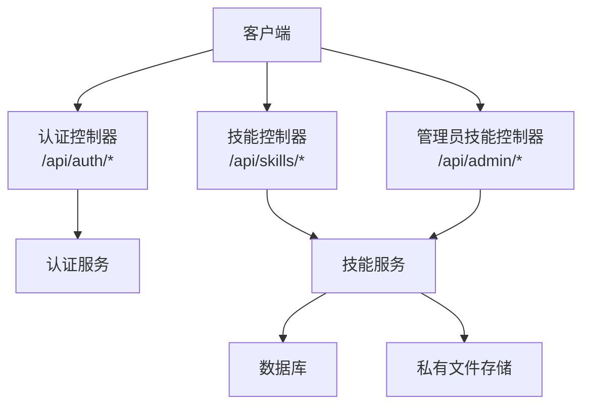

**图表来源**
- [auth.controller.ts:9-25](file://apps/server/src/auth/auth.controller.ts#L9-L25)
- [skills.controller.ts:11-144](file://apps/server/src/skills/skills.controller.ts#L11-L144)
- [admin-skills.controller.ts:12-53](file://apps/server/src/skills/admin-skills.controller.ts#L12-L53)
- [skills.service.ts:114-468](file://apps/server/src/skills/skills.service.ts#L114-L468)

**章节来源**
- [auth.controller.ts:9-25](file://apps/server/src/auth/auth.controller.ts#L9-L25)
- [skills.controller.ts:11-144](file://apps/server/src/skills/skills.controller.ts#L11-L144)
- [admin-skills.controller.ts:12-53](file://apps/server/src/skills/admin-skills.controller.ts#L12-L53)

## 核心权限模型
权限控制由全局守卫与装饰器共同实现：
- 默认所有接口需要登录。
- `@SuperAdminOnly` 仅允许超级管理员访问。
- `@TenantAdminOnly` 要求当前会话已选择租户，且当前用户在租户中为启用中的管理员。
- `@TenantMember` 要求当前会话已选择租户，且当前用户在租户中为启用中的员工。

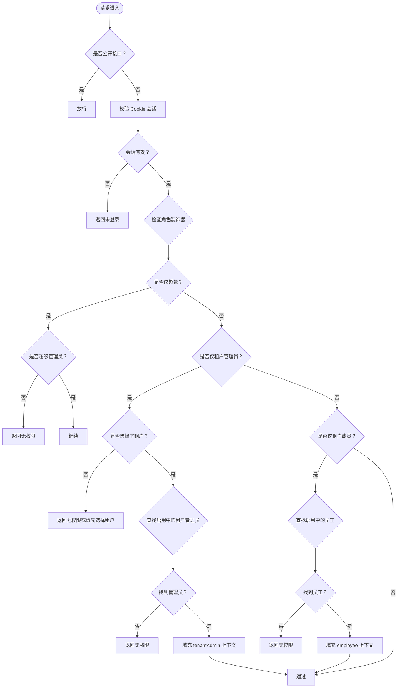

**图表来源**
- [auth.guard.ts:8-47](file://apps/server/src/auth/auth.guard.ts#L8-L47)
- [decorators.ts:4-17](file://apps/server/src/auth/decorators.ts#L4-L17)
- [session.ts:5-23](file://apps/server/src/auth/session.ts#L5-L23)

**章节来源**
- [auth.guard.ts:8-47](file://apps/server/src/auth/auth.guard.ts#L8-L47)
- [decorators.ts:4-17](file://apps/server/src/auth/decorators.ts#L4-L17)
- [session.ts:5-23](file://apps/server/src/auth/session.ts#L5-L23)

## 架构总览
管理员接口分为两类：
- 租户管理员接口：位于 `/api/skills`，受 `@TenantMember` 保护；其中管理视图与下架/上架等操作额外使用 `@TenantAdminOnly`。
- 超级管理员接口：位于 `/api/admin`，受 `@SuperAdminOnly` 保护，支持跨租户查看、下载任意版本、下架/上架、删除。

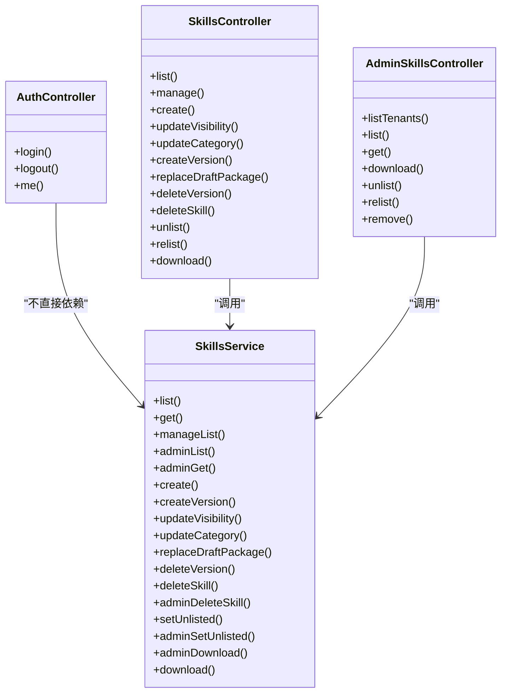

**图表来源**
- [auth.controller.ts:9-25](file://apps/server/src/auth/auth.controller.ts#L9-L25)
- [skills.controller.ts:11-144](file://apps/server/src/skills/skills.controller.ts#L11-L144)
- [admin-skills.controller.ts:12-53](file://apps/server/src/skills/admin-skills.controller.ts#L12-L53)
- [skills.service.ts:114-468](file://apps/server/src/skills/skills.service.ts#L114-L468)

**章节来源**
- [skills.controller.ts:11-144](file://apps/server/src/skills/skills.controller.ts#L11-L144)
- [admin-skills.controller.ts:12-53](file://apps/server/src/skills/admin-skills.controller.ts#L12-L53)
- [skills.service.ts:114-468](file://apps/server/src/skills/skills.service.ts#L114-L468)

## 管理员技能治理接口详解

### 超级管理员接口
- 列表租户下的技能：按租户维度查看所有技能，包括尚未正式发布、已下架的技能。
- 获取任意技能详情：只读，包含非正式版本与审核记录。
- 下载任意版本：用于治理，不计入下载次数。
- 下架/上架任意技能：跨租户治理能力。
- 删除任意技能：清理版本、审核记录与存储文件。

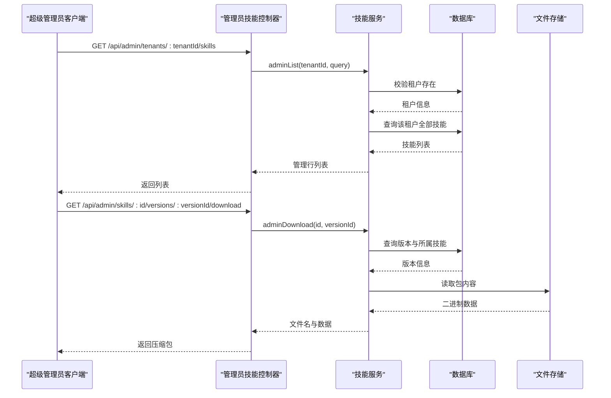

**图表来源**
- [admin-skills.controller.ts:15-34](file://apps/server/src/skills/admin-skills.controller.ts#L15-L34)
- [skills.service.ts:170-181](file://apps/server/src/skills/skills.service.ts#L170-L181)
- [skills.service.ts:411-416](file://apps/server/src/skills/skills.service.ts#L411-L416)

**章节来源**
- [admin-skills.controller.ts:12-53](file://apps/server/src/skills/admin-skills.controller.ts#L12-L53)
- [skills.service.ts:170-181](file://apps/server/src/skills/skills.service.ts#L170-L181)
- [skills.service.ts:411-416](file://apps/server/src/skills/skills.service.ts#L411-L416)

### 租户管理员接口
- 管理视图：查看本租户全部技能，支持按审核状态、可见性、是否下架筛选。
- 修改可见性与分类：立即生效，无需审核，但会记录审计日志。
- 下架/上架：限制在本租户内，重复操作返回冲突。
- 删除技能或版本：可删除任意版本；删除最后一个版本时技能一并删除。

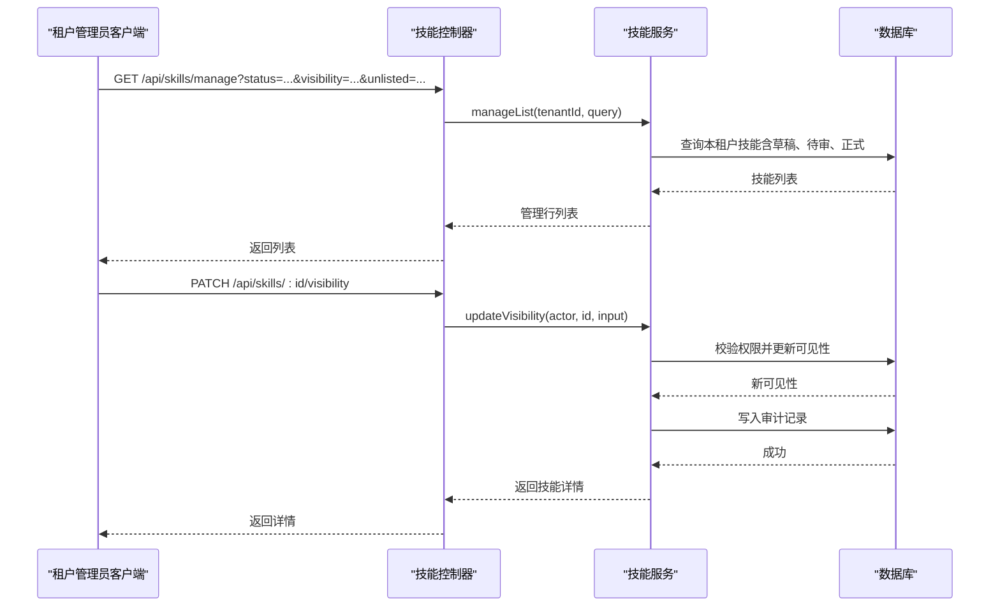

**图表来源**
- [skills.controller.ts:23-28](file://apps/server/src/skills/skills.controller.ts#L23-L28)
- [skills.controller.ts:59-68](file://apps/server/src/skills/skills.controller.ts#L59-L68)
- [skills.service.ts:284-299](file://apps/server/src/skills/skills.service.ts#L284-L299)

**章节来源**
- [skills.controller.ts:23-28](file://apps/server/src/skills/skills.controller.ts#L23-L28)
- [skills.controller.ts:59-68](file://apps/server/src/skills/skills.controller.ts#L59-L68)
- [skills.service.ts:284-299](file://apps/server/src/skills/skills.service.ts#L284-L299)

### 跨租户技能管理与批量操作
- 跨租户查看：超级管理员可按租户列出技能，复用管理视图的筛选条件。
- 跨租户下载：超级管理员可下载任意版本，且不增加下载次数。
- 跨租户下架/上架：超级管理员可对任意租户的技能执行下架/上架，并在审计记录中标记操作人。
- 批量操作：目前以单资源操作为主；可通过循环调用管理接口实现批量下架/上架或删除。

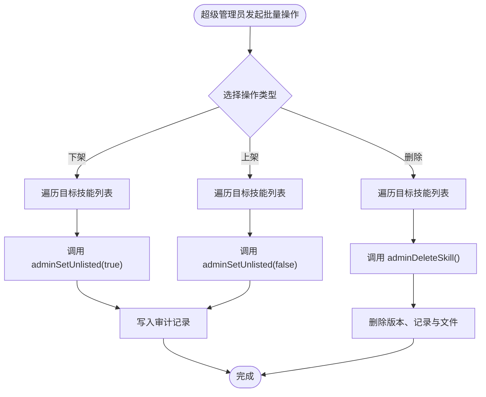

**图表来源**
- [admin-skills.controller.ts:36-52](file://apps/server/src/skills/admin-skills.controller.ts#L36-L52)
- [skills.service.ts:393-428](file://apps/server/src/skills/skills.service.ts#L393-L428)

**章节来源**
- [admin-skills.controller.ts:36-52](file://apps/server/src/skills/admin-skills.controller.ts#L36-L52)
- [skills.service.ts:393-428](file://apps/server/src/skills/skills.service.ts#L393-L428)

### 管理员特有的数据访问权限与过滤逻辑
- 超级管理员：跳过租户隔离，直接按 ID 查询技能与版本；详情只读，包含非正式版本与审核记录。
- 租户管理员：只能访问当前租户的数据；管理视图包含草稿、待审、正式版本，并可按状态、可见性、下架状态筛选。
- 普通员工：只能看到有正式版本且满足可见性规则的技能；非正式版本仅所有者与租户管理员可见。

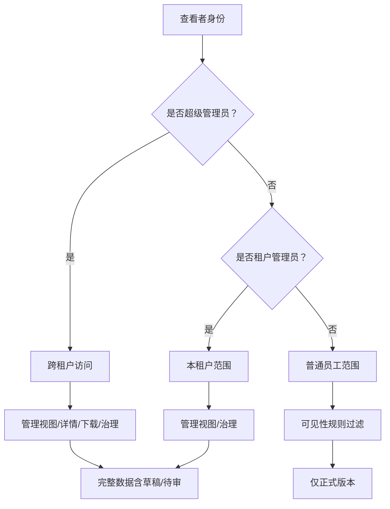

**图表来源**
- [skills.service.ts:146-181](file://apps/server/src/skills/skills.service.ts#L146-L181)
- [skill-visibility.ts:38-67](file://apps/server/src/skills/skill-visibility.ts#L38-L67)
- [skill-views.ts:93-101](file://apps/server/src/skills/skill-views.ts#L93-L101)

**章节来源**
- [skills.service.ts:146-181](file://apps/server/src/skills/skills.service.ts#L146-L181)
- [skill-visibility.ts:38-67](file://apps/server/src/skills/skill-visibility.ts#L38-L67)
- [skill-views.ts:93-101](file://apps/server/src/skills/skill-views.ts#L93-L101)

### 管理员接口的认证要求与权限验证流程
- 登录：通过手机号与密码创建会话，设置 Cookie。
- 鉴权：全局守卫从 Cookie 解析会话，校验有效期，加载用户与超管标记，并根据装饰器进行角色校验。
- 上下文：校验通过后，将 `AuthContext` 注入到请求对象，供控制器与服务使用。

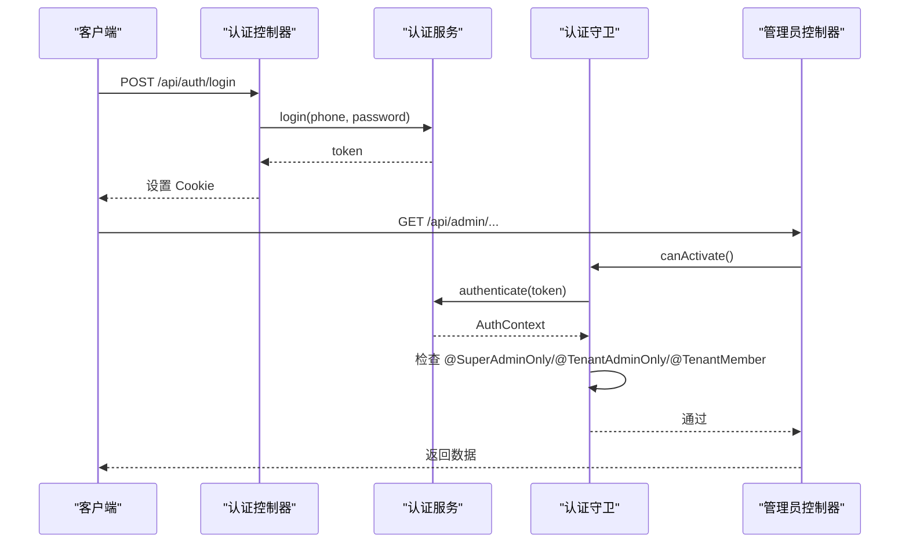

**图表来源**
- [auth.controller.ts:12-24](file://apps/server/src/auth/auth.controller.ts#L12-L24)
- [auth.service.ts:15-35](file://apps/server/src/auth/auth.service.ts#L15-L35)
- [auth.guard.ts:20-47](file://apps/server/src/auth/auth.guard.ts#L20-L47)

**章节来源**
- [auth.controller.ts:12-24](file://apps/server/src/auth/auth.controller.ts#L12-L24)
- [auth.service.ts:15-35](file://apps/server/src/auth/auth.service.ts#L15-L35)
- [auth.guard.ts:20-47](file://apps/server/src/auth/auth.guard.ts#L20-L47)

### 管理员操作的完整示例与权限检查失败处理
以下示例基于端到端测试覆盖的行为，展示典型调用与失败响应：

- 租户管理员下架技能：其他员工无法看到与下载，所有者与管理员不受影响；上架后恢复；审计记录包含操作人与动作。
- 重复下架/上架：返回冲突错误，提示“已经下架”或“没有下架”。
- 普通员工尝试下架：返回无权限。
- 超级管理员下载任意版本：返回压缩包，且不增加下载次数。
- 超级管理员下架/上架/删除：审计记录的操作人为超级管理员；删除后技能、版本、审核记录与文件均被清理。
- 租户管理员不能访问超管接口：返回无权限。
- 不存在资源：返回 404。

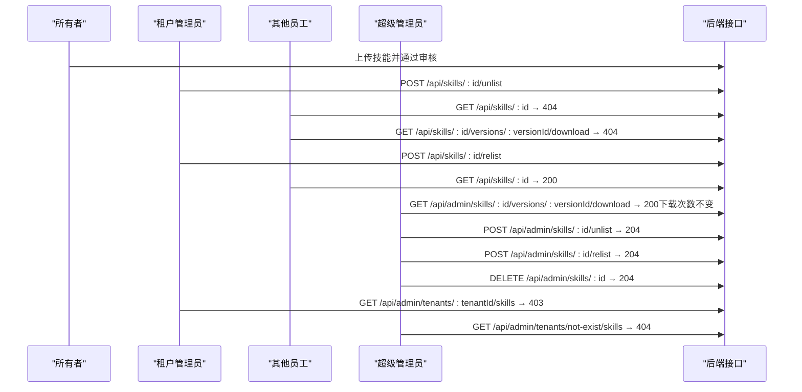

**图表来源**
- [skill-governance.e2e-spec.ts:60-191](file://apps/server/test/skill-governance.e2e-spec.ts#L60-L191)

**章节来源**
- [skill-governance.e2e-spec.ts:60-191](file://apps/server/test/skill-governance.e2e-spec.ts#L60-L191)

### 与常规用户接口的区别与权限边界
- 常规用户接口 `/api/skills`：
  - 列表：仅显示有正式版本且满足可见性的技能。
  - 详情：仅当有正式版本且可见性命中时返回。
  - 上传/版本：只有所有者或租户管理员可上传新版本；普通员工上传默认提交审核。
  - 可见性与分类：所有者或租户管理员可修改，立即生效并记录审计。
  - 下载：仅对正式版本计数下载次数。
- 管理员接口 `/api/admin`：
  - 跨租户：超级管理员可绕过租户隔离。
  - 治理：下架/上架/删除任意技能；下载任意版本不计次数。
  - 只读详情：包含非正式版本与审核记录。

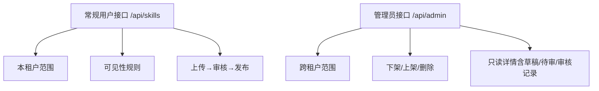

**图表来源**
- [skills.controller.ts:11-144](file://apps/server/src/skills/skills.controller.ts#L11-L144)
- [admin-skills.controller.ts:12-53](file://apps/server/src/skills/admin-skills.controller.ts#L12-L53)
- [skills.service.ts:224-282](file://apps/server/src/skills/skills.service.ts#L224-L282)

**章节来源**
- [skills.controller.ts:11-144](file://apps/server/src/skills/skills.controller.ts#L11-L144)
- [admin-skills.controller.ts:12-53](file://apps/server/src/skills/admin-skills.controller.ts#L12-L53)
- [skills.service.ts:224-282](file://apps/server/src/skills/skills.service.ts#L224-L282)

## 详细组件分析

### 认证与会话
- 登录：验证演示账号，创建会话并设置 Cookie。
- 登出：删除会话并清除 Cookie。
- 当前用户：返回用户信息与关联租户档案，包含是否为超管与当前租户。

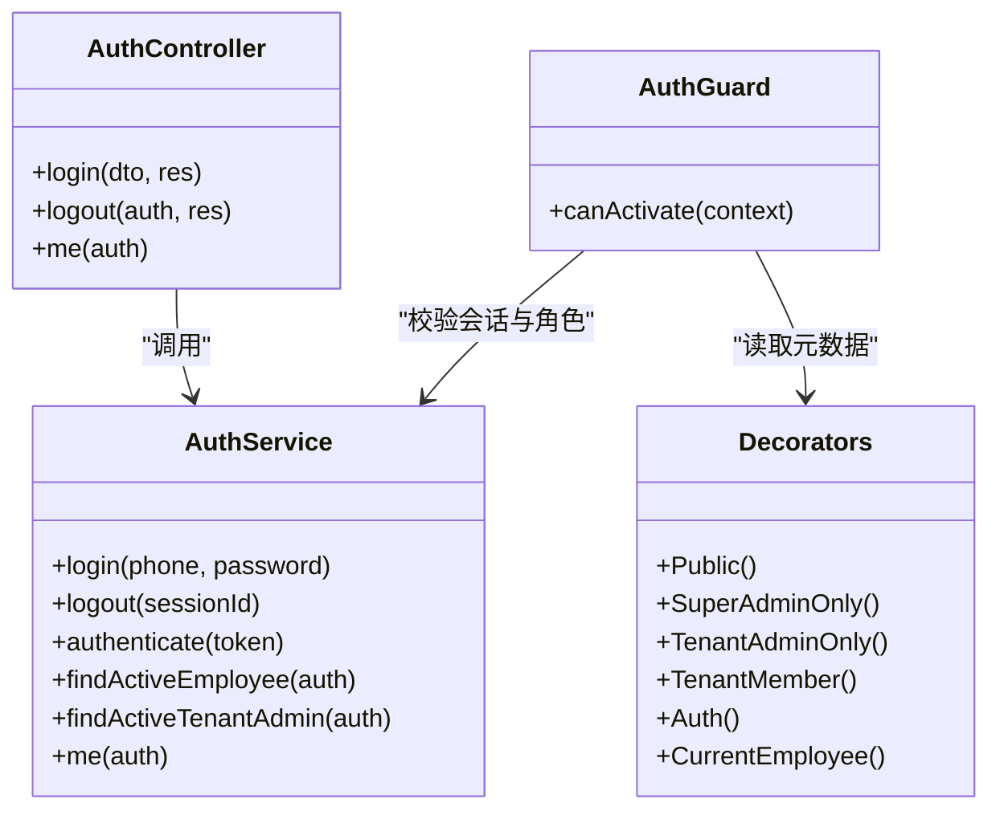

**图表来源**
- [auth.service.ts:11-76](file://apps/server/src/auth/auth.service.ts#L11-L76)
- [auth.controller.ts:9-25](file://apps/server/src/auth/auth.controller.ts#L9-L25)
- [auth.guard.ts:14-47](file://apps/server/src/auth/auth.guard.ts#L14-L47)
- [decorators.ts:4-17](file://apps/server/src/auth/decorators.ts#L4-L17)

**章节来源**
- [auth.service.ts:11-76](file://apps/server/src/auth/auth.service.ts#L11-L76)
- [auth.controller.ts:9-25](file://apps/server/src/auth/auth.controller.ts#L9-L25)
- [auth.guard.ts:14-47](file://apps/server/src/auth/auth.guard.ts#L14-L47)
- [decorators.ts:4-17](file://apps/server/src/auth/decorators.ts#L4-L17)

### 技能服务与治理逻辑
- 名称冲突：同一租户内同名技能返回冲突，若调用方可见则附带已有技能 ID。
- 版本状态机：根据上传模式与角色决定初始状态（草稿、待审、直接发布）。
- 可见性：部门树与员工名单校验，写入时清空旧名单再批量插入。
- 审计记录：修改可见性、分类、下架/上架、重新上传等均记录审计。

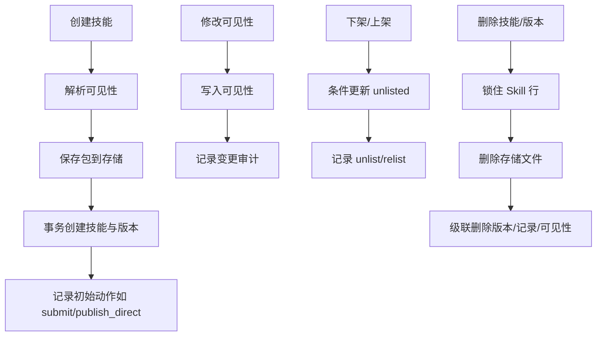

**图表来源**
- [skills.service.ts:224-253](file://apps/server/src/skills/skills.service.ts#L224-L253)
- [skills.service.ts:284-319](file://apps/server/src/skills/skills.service.ts#L284-L319)
- [skills.service.ts:398-428](file://apps/server/src/skills/skills.service.ts#L398-L428)
- [skill-visibility.ts:82-106](file://apps/server/src/skills/skill-visibility.ts#L82-L106)

**章节来源**
- [skills.service.ts:224-253](file://apps/server/src/skills/skills.service.ts#L224-L253)
- [skills.service.ts:284-319](file://apps/server/src/skills/skills.service.ts#L284-L319)
- [skills.service.ts:398-428](file://apps/server/src/skills/skills.service.ts#L398-L428)
- [skill-visibility.ts:82-106](file://apps/server/src/skills/skill-visibility.ts#L82-L106)

## 依赖关系与数据流
- 控制器依赖服务：控制器只做参数绑定与权限装饰，业务逻辑集中在服务层。
- 服务依赖数据库与存储：Prisma 用于数据持久化，私有存储用于技能包文件。
- 可见性与视图工具：可见性规则与视图转换独立成模块，便于复用。

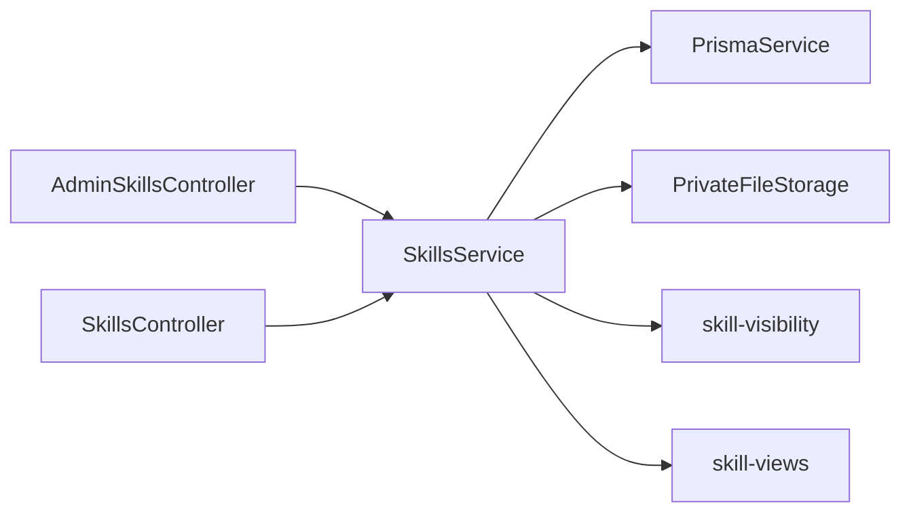

**图表来源**
- [admin-skills.controller.ts:12-53](file://apps/server/src/skills/admin-skills.controller.ts#L12-L53)
- [skills.controller.ts:11-144](file://apps/server/src/skills/skills.controller.ts#L11-L144)
- [skills.service.ts:114-468](file://apps/server/src/skills/skills.service.ts#L114-L468)
- [skill-visibility.ts:1-107](file://apps/server/src/skills/skill-visibility.ts#L1-L107)
- [skill-views.ts:1-111](file://apps/server/src/skills/skill-views.ts#L1-L111)

**章节来源**
- [admin-skills.controller.ts:12-53](file://apps/server/src/skills/admin-skills.controller.ts#L12-L53)
- [skills.controller.ts:11-144](file://apps/server/src/skills/skills.controller.ts#L11-L144)
- [skills.service.ts:114-468](file://apps/server/src/skills/skills.service.ts#L114-L468)

## 性能与并发特性
- 并发安全：
  - 上传新版本与删除版本时使用行级锁（FOR UPDATE），保证串行化。
  - 状态变更使用条件更新与 stale 检测，避免竞态导致的状态不一致。
- 查询优化：
  - 目录与版本历史按版本号降序排序，首个即为当前版本。
  - 管理视图一次性包含上传者与可见性关系，减少 N+1 查询。
- 存储优化：
  - 先落盘再写库，写库失败回滚时删除临时文件。
  - 删除技能时批量收集 storageKey 后统一清理。

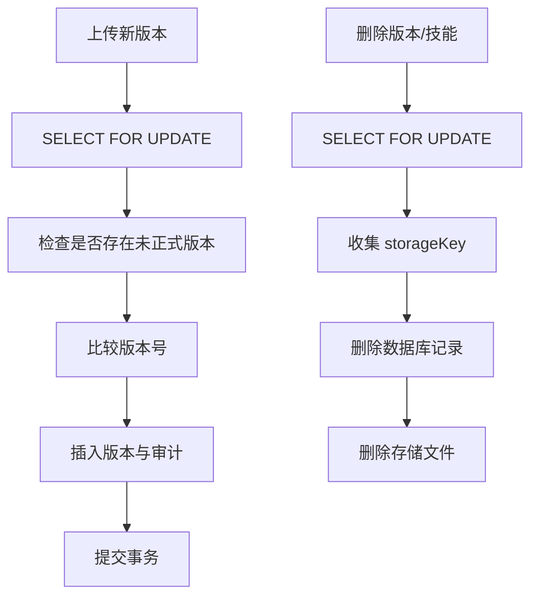

**图表来源**
- [skills.service.ts:259-282](file://apps/server/src/skills/skills.service.ts#L259-L282)
- [skills.service.ts:356-386](file://apps/server/src/skills/skills.service.ts#L356-L386)
- [skills.service.ts:418-428](file://apps/server/src/skills/skills.service.ts#L418-L428)

**章节来源**
- [skills.service.ts:259-282](file://apps/server/src/skills/skills.service.ts#L259-L282)
- [skills.service.ts:356-386](file://apps/server/src/skills/skills.service.ts#L356-L386)
- [skills.service.ts:418-428](file://apps/server/src/skills/skills.service.ts#L418-L428)

## 故障排查与错误处理
常见错误与处理建议：
- 未登录：检查 Cookie 是否携带会话令牌，确认登录接口返回并设置 Cookie。
- 无权限：
  - 仅超管接口被非超管访问：确认用户具有超管标记。
  - 仅租户管理员接口未选择租户：确认会话中包含 currentTenantId。
  - 普通员工访问管理视图：确认角色为租户管理员。
- 资源不存在：
  - 超管按租户或技能 ID 查询不存在：返回 404。
  - 普通员工访问不可见技能：返回 404（不暴露存在）。
- 冲突操作：
  - 重复下架/上架：返回 409，提示当前状态。
  - 并发状态变化：返回 409，提示刷新后重试。
- 名称冲突：
  - 同租户同名技能：返回 409，若调用方可见则附带已有技能 ID。

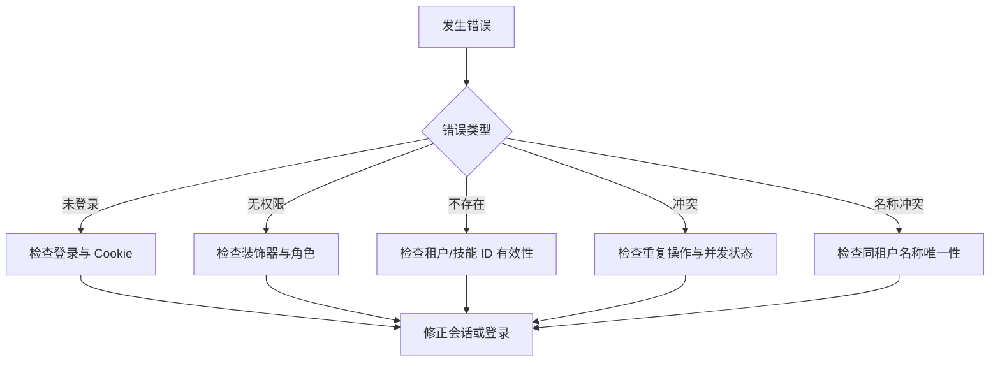

**图表来源**
- [auth.guard.ts:20-47](file://apps/server/src/auth/auth.guard.ts#L20-L47)
- [skills.service.ts:44-46](file://apps/server/src/skills/skills.service.ts#L44-L46)
- [skills.service.ts:449-457](file://apps/server/src/skills/skills.service.ts#L449-L457)
- [skill-views.ts:103-110](file://apps/server/src/skills/skill-views.ts#L103-L110)

**章节来源**
- [auth.guard.ts:20-47](file://apps/server/src/auth/auth.guard.ts#L20-L47)
- [skills.service.ts:44-46](file://apps/server/src/skills/skills.service.ts#L44-L46)
- [skills.service.ts:449-457](file://apps/server/src/skills/skills.service.ts#L449-L457)
- [skill-views.ts:103-110](file://apps/server/src/skills/skill-views.ts#L103-L110)

## 结论
管理员接口通过严格的认证与角色守卫，实现了超级管理员与租户管理员的清晰权限边界。超级管理员具备跨租户治理与只读详情能力，租户管理员聚焦本租户的管理与治理。技能治理围绕版本状态机、可见性规则与审计记录展开，确保数据安全与可追溯。建议在批量操作中结合分页与重试机制，并在前端对权限失败进行友好提示。