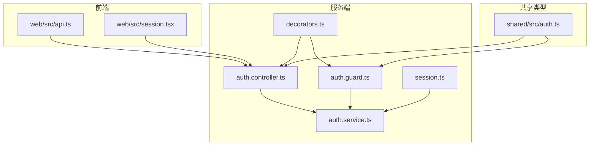
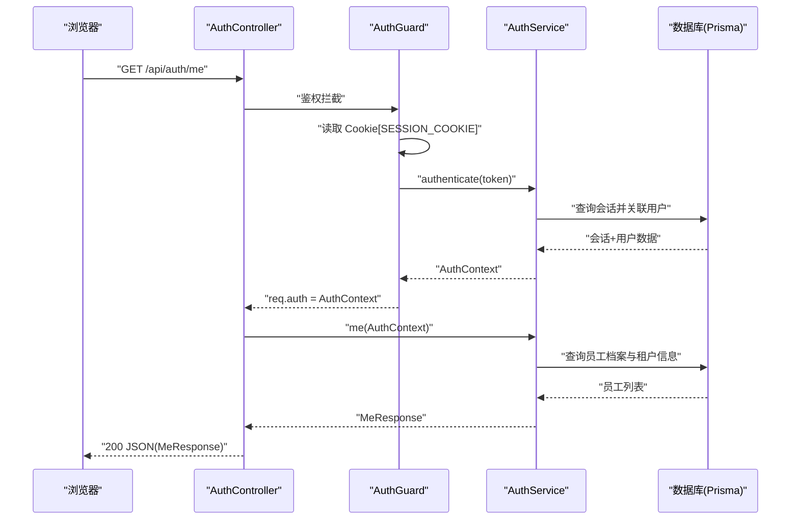
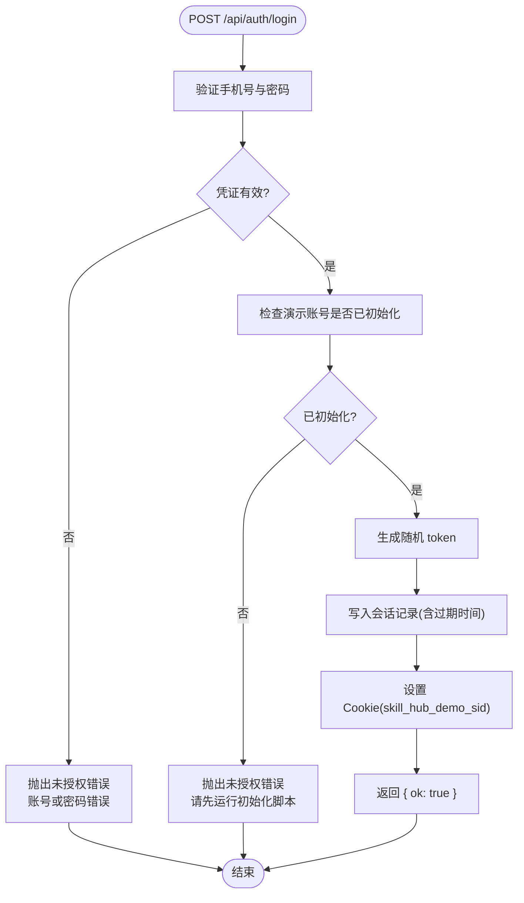
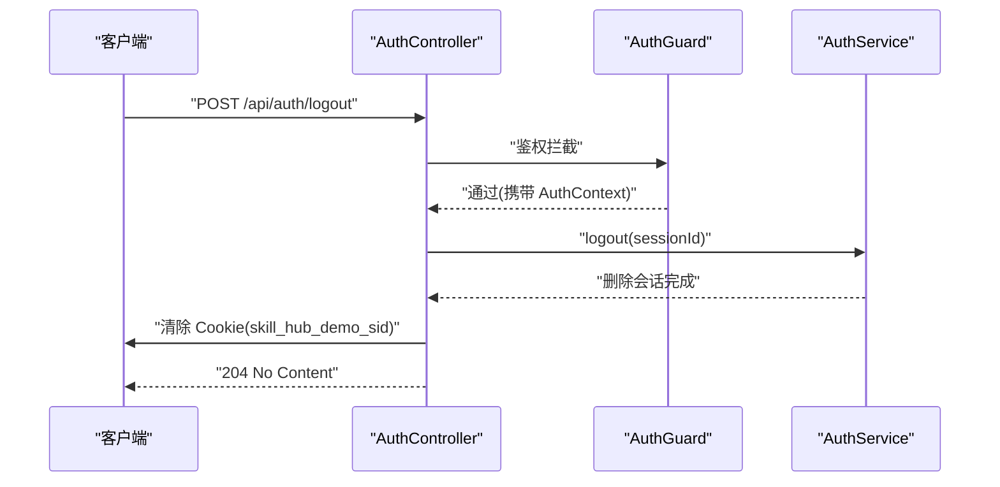
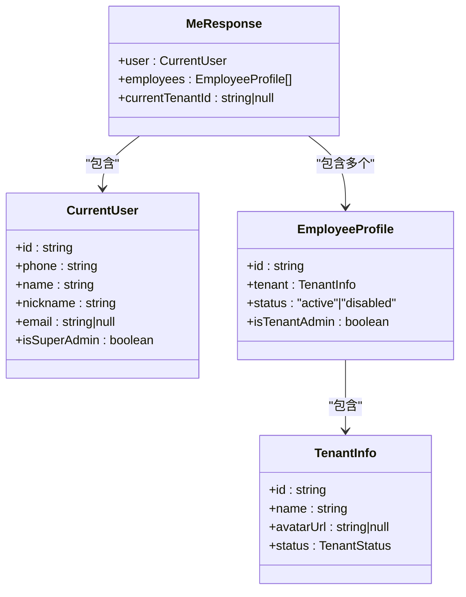
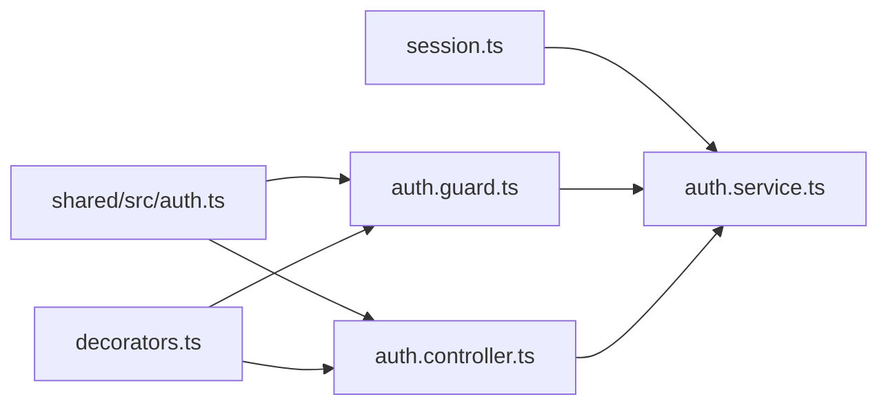
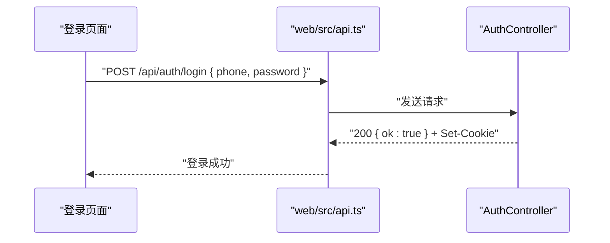
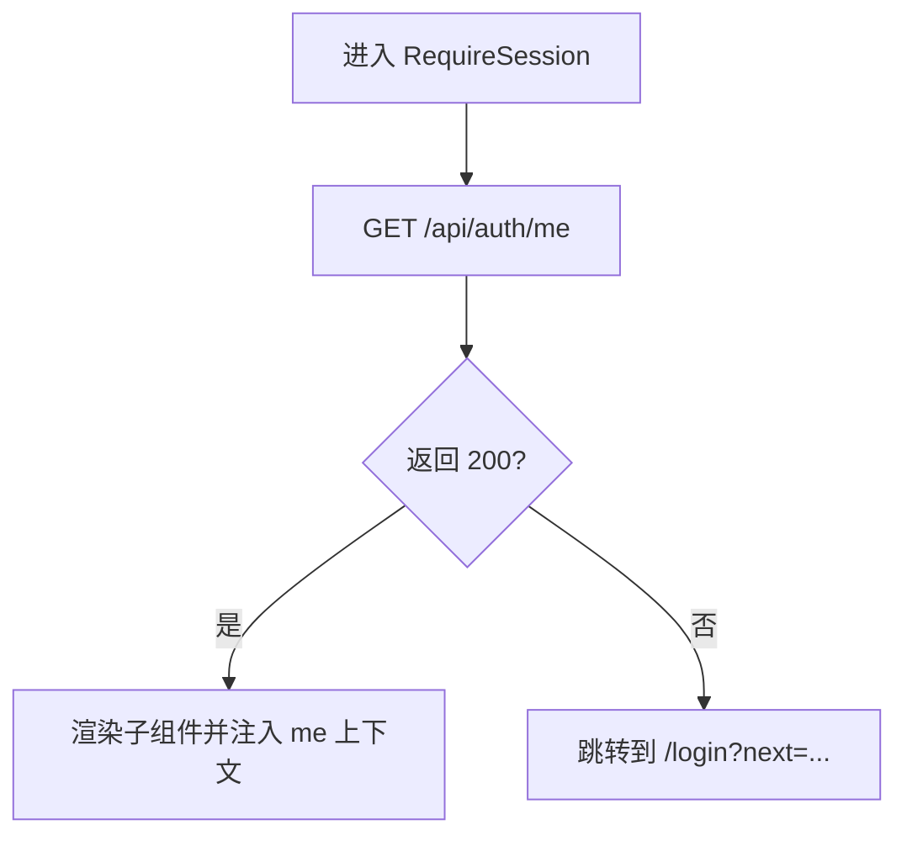

# 认证接口

<cite>
**本文引用的文件**   
- [apps/server/src/auth/auth.controller.ts](file://apps/server/src/auth/auth.controller.ts)
- [apps/server/src/auth/auth.service.ts](file://apps/server/src/auth/auth.service.ts)
- [apps/server/src/auth/auth.guard.ts](file://apps/server/src/auth/auth.guard.ts)
- [apps/server/src/auth/decorators.ts](file://apps/server/src/auth/decorators.ts)
- [apps/server/src/auth/session.ts](file://apps/server/src/auth/session.ts)
- [packages/shared/src/auth.ts](file://packages/shared/src/auth.ts)
- [apps/web/src/api.ts](file://apps/web/src/api.ts)
- [apps/web/src/session.tsx](file://apps/web/src/session.tsx)
</cite>

## 目录
1. [简介](#简介)
2. [项目结构](#项目结构)
3. [核心组件](#核心组件)
4. [架构总览](#架构总览)
5. [详细接口说明](#详细接口说明)
6. [依赖关系分析](#依赖关系分析)
7. [性能与安全性考虑](#性能与安全性考虑)
8. [故障排查指南](#故障排查指南)
9. [结论](#结论)
10. [附录：前端集成示例](#附录前端集成示例)

## 简介
本文档面向后端与前端开发者，系统化说明基于 Cookie 的会话认证机制以及以下 RESTful 接口的行为、数据模型与安全策略：
- POST /api/auth/login：手机号 + 密码登录，设置会话 Cookie
- POST /api/auth/logout：登出并清除会话 Cookie
- GET /api/auth/me：获取当前用户信息与会话上下文

同时说明权限装饰器 @Auth() 的使用方式、AuthContext 对象结构、Cookie 安全属性（HttpOnly、SameSite、Secure）及 SESSION_COOKIE 名称，并提供前后端集成建议与常见错误处理方案。

## 项目结构
认证相关代码主要分布在服务端 NestJS 模块与共享类型包中，前端通过统一的 API 封装调用接口并维护会话状态。



**图表来源**
- [apps/server/src/auth/auth.controller.ts:1-26](file://apps/server/src/auth/auth.controller.ts#L1-L26)
- [apps/server/src/auth/auth.service.ts:1-77](file://apps/server/src/auth/auth.service.ts#L1-L77)
- [apps/server/src/auth/auth.guard.ts:1-49](file://apps/server/src/auth/auth.guard.ts#L1-L49)
- [apps/server/src/auth/decorators.ts:1-18](file://apps/server/src/auth/decorators.ts#L1-L18)
- [apps/server/src/auth/session.ts:1-30](file://apps/server/src/auth/session.ts#L1-L30)
- [packages/shared/src/auth.ts:1-39](file://packages/shared/src/auth.ts#L1-L39)
- [apps/web/src/api.ts:1-42](file://apps/web/src/api.ts#L1-L42)
- [apps/web/src/session.tsx:1-68](file://apps/web/src/session.tsx#L1-L68)

**章节来源**
- [apps/server/src/auth/auth.controller.ts:1-26](file://apps/server/src/auth/auth.controller.ts#L1-L26)
- [apps/server/src/auth/auth.service.ts:1-77](file://apps/server/src/auth/auth.service.ts#L1-L77)
- [apps/server/src/auth/auth.guard.ts:1-49](file://apps/server/src/auth/auth.guard.ts#L1-L49)
- [apps/server/src/auth/decorators.ts:1-18](file://apps/server/src/auth/decorators.ts#L1-L18)
- [apps/server/src/auth/session.ts:1-30](file://apps/server/src/auth/session.ts#L1-L30)
- [packages/shared/src/auth.ts:1-39](file://packages/shared/src/auth.ts#L1-L39)
- [apps/web/src/api.ts:1-42](file://apps/web/src/api.ts#L1-L42)
- [apps/web/src/session.tsx:1-68](file://apps/web/src/session.tsx#L1-L68)

## 核心组件
- 控制器层：定义认证相关路由，负责接收请求、设置/清除 Cookie、返回响应。
- 服务层：实现登录、登出、鉴权、用户信息查询等核心业务逻辑。
- 守卫层：全局鉴权守卫，从 Cookie 读取会话令牌，校验有效性并填充请求上下文。
- 装饰器层：提供 @Public、@SuperAdminOnly、@TenantAdminOnly、@TenantMember、@Auth、@CurrentEmployee 等元数据与参数注入。
- 会话上下文：定义 AuthContext 与 CurrentEmployeeContext 的结构，扩展 Express Request 类型。
- 共享类型：定义 SESSION_COOKIE 名称、登录请求/响应、MeResponse、ApiErrorBody 等跨端共享类型。
- 前端封装：统一 fetch 封装、错误抛出、登出流程、会话加载与路由守卫。

**章节来源**
- [apps/server/src/auth/auth.controller.ts:1-26](file://apps/server/src/auth/auth.controller.ts#L1-L26)
- [apps/server/src/auth/auth.service.ts:1-77](file://apps/server/src/auth/auth.service.ts#L1-L77)
- [apps/server/src/auth/auth.guard.ts:1-49](file://apps/server/src/auth/auth.guard.ts#L1-L49)
- [apps/server/src/auth/decorators.ts:1-18](file://apps/server/src/auth/decorators.ts#L1-L18)
- [apps/server/src/auth/session.ts:1-30](file://apps/server/src/auth/session.ts#L1-L30)
- [packages/shared/src/auth.ts:1-39](file://packages/shared/src/auth.ts#L1-L39)
- [apps/web/src/api.ts:1-42](file://apps/web/src/api.ts#L1-L42)
- [apps/web/src/session.tsx:1-68](file://apps/web/src/session.tsx#L1-L68)

## 架构总览
下图展示一次受保护接口的完整调用链路：浏览器携带 Cookie 发起请求，NestJS 全局守卫解析 Cookie、校验会话、填充 AuthContext，再进入控制器与服务层。



**图表来源**
- [apps/server/src/auth/auth.controller.ts:23-24](file://apps/server/src/auth/auth.controller.ts#L23-L24)
- [apps/server/src/auth/auth.guard.ts:20-46](file://apps/server/src/auth/auth.guard.ts#L20-L46)
- [apps/server/src/auth/auth.service.ts:30-35](file://apps/server/src/auth/auth.service.ts#L30-L35)
- [apps/server/src/auth/auth.service.ts:51-74](file://apps/server/src/auth/auth.service.ts#L51-L74)

## 详细接口说明

### 通用约定
- 基础路径：/api
- 会话 Cookie 名称：skill_hub_demo_sid（由共享常量 SESSION_COOKIE 定义）
- 默认所有接口需登录；仅标记为 Public 的路由可匿名访问
- 错误响应体遵循 ApiErrorBody 结构（包含 statusCode、message、可选 code）

**章节来源**
- [packages/shared/src/auth.ts:1-39](file://packages/shared/src/auth.ts#L1-L39)
- [apps/server/src/auth/auth.guard.ts:8-12](file://apps/server/src/auth/auth.guard.ts#L8-L12)

---

### POST /api/auth/login
- 功能：使用手机号和密码登录，成功后在响应头中设置会话 Cookie。
- 请求体：LoginRequest
  - phone：字符串，必填
  - password：字符串，必填
- 成功响应：LoginResponse
  - ok：true
- 失败场景：
  - 账号或密码错误：返回未授权错误
  - 演示账号尚未初始化：返回未授权错误，提示先执行初始化脚本
- Cookie 设置：
  - 名称：SESSION_COOKIE（skill_hub_demo_sid）
  - 值：随机生成的 token（base64url）
  - 安全属性：
    - httpOnly：true（禁止前端 JS 直接读取）
    - sameSite：lax（限制跨站携带）
    - secure：当环境变量 SESSION_COOKIE_SECURE 为 'true' 时启用（HTTPS 下强制）
    - path：'/'
  - 过期时间：SESSION_TTL_MS（30 天）



**图表来源**
- [apps/server/src/auth/auth.controller.ts:12-17](file://apps/server/src/auth/auth.controller.ts#L12-L17)
- [apps/server/src/auth/auth.service.ts:15-24](file://apps/server/src/auth/auth.service.ts#L15-L24)
- [apps/server/src/auth/session.ts:3](file://apps/server/src/auth/session.ts#L3)
- [packages/shared/src/auth.ts:2-4](file://packages/shared/src/auth.ts#L2-L4)

**章节来源**
- [apps/server/src/auth/auth.controller.ts:1-17](file://apps/server/src/auth/auth.controller.ts#L1-L17)
- [apps/server/src/auth/auth.service.ts:15-24](file://apps/server/src/auth/auth.service.ts#L15-L24)
- [apps/server/src/auth/session.ts:3](file://apps/server/src/auth/session.ts#L3)
- [packages/shared/src/auth.ts:2-4](file://packages/shared/src/auth.ts#L2-L4)

---

### POST /api/auth/logout
- 功能：登出，服务端删除对应会话，客户端清除 Cookie。
- 前置条件：需要已登录（由全局守卫校验）。
- 成功响应：HTTP 204（无内容）
- 失败场景：
  - 未登录或会话无效：返回未授权错误
- 会话清除流程：
  - 从请求上下文获取 sessionId
  - 服务端删除该 sessionId 对应的会话记录
  - 清除 Cookie（同名、同路径、同安全属性）



**图表来源**
- [apps/server/src/auth/auth.controller.ts:18-22](file://apps/server/src/auth/auth.controller.ts#L18-L22)
- [apps/server/src/auth/auth.service.ts:26-28](file://apps/server/src/auth/auth.service.ts#L26-L28)
- [apps/server/src/auth/auth.guard.ts:20-46](file://apps/server/src/auth/auth.guard.ts#L20-L46)

**章节来源**
- [apps/server/src/auth/auth.controller.ts:18-22](file://apps/server/src/auth/auth.controller.ts#L18-L22)
- [apps/server/src/auth/auth.service.ts:26-28](file://apps/server/src/auth/auth.service.ts#L26-L28)

---

### GET /api/auth/me
- 功能：获取当前用户信息与当前会话上下文。
- 前置条件：需要已登录（由全局守卫校验）。
- 成功响应：MeResponse
  - user：CurrentUser
    - id：字符串
    - phone：字符串
    - name：字符串
    - nickname：字符串
    - email：字符串或 null
    - isSuperAdmin：布尔值
  - employees：EmployeeProfile[]
    - id：字符串
    - tenant：{ id, name, avatarUrl, status }
    - status：'active' | 'disabled'
    - isTenantAdmin：布尔值
  - currentTenantId：字符串或 null（会话当前租户 ID）
- 失败场景：
  - 未登录或会话无效：返回未授权错误



**图表来源**
- [packages/shared/src/auth.ts:5-32](file://packages/shared/src/auth.ts#L5-L32)
- [apps/server/src/auth/auth.service.ts:51-74](file://apps/server/src/auth/auth.service.ts#L51-L74)

**章节来源**
- [apps/server/src/auth/auth.controller.ts:23-24](file://apps/server/src/auth/auth.controller.ts#L23-L24)
- [apps/server/src/auth/auth.service.ts:51-74](file://apps/server/src/auth/auth.service.ts#L51-L74)
- [packages/shared/src/auth.ts:5-32](file://packages/shared/src/auth.ts#L5-L32)

## 依赖关系分析
- 控制器依赖服务层进行业务处理，并通过装饰器注入 AuthContext。
- 守卫层依赖服务层的 authenticate 方法，从 Cookie 中读取 token 并校验会话。
- 装饰器层提供权限控制元数据与参数注入。
- 会话上下文定义了请求级认证信息的结构，并扩展了 Express Request 类型。
- 共享类型包被服务端与前端共同引用，保证契约一致性。



**图表来源**
- [packages/shared/src/auth.ts:1-39](file://packages/shared/src/auth.ts#L1-L39)
- [apps/server/src/auth/auth.controller.ts:1-26](file://apps/server/src/auth/auth.controller.ts#L1-L26)
- [apps/server/src/auth/auth.guard.ts:1-49](file://apps/server/src/auth/auth.guard.ts#L1-L49)
- [apps/server/src/auth/decorators.ts:1-18](file://apps/server/src/auth/decorators.ts#L1-L18)
- [apps/server/src/auth/session.ts:1-30](file://apps/server/src/auth/session.ts#L1-L30)
- [apps/server/src/auth/auth.service.ts:1-77](file://apps/server/src/auth/auth.service.ts#L1-L77)

**章节来源**
- [apps/server/src/auth/auth.controller.ts:1-26](file://apps/server/src/auth/auth.controller.ts#L1-L26)
- [apps/server/src/auth/auth.service.ts:1-77](file://apps/server/src/auth/auth.service.ts#L1-L77)
- [apps/server/src/auth/auth.guard.ts:1-49](file://apps/server/src/auth/auth.guard.ts#L1-L49)
- [apps/server/src/auth/decorators.ts:1-18](file://apps/server/src/auth/decorators.ts#L1-L18)
- [apps/server/src/auth/session.ts:1-30](file://apps/server/src/auth/session.ts#L1-L30)
- [packages/shared/src/auth.ts:1-39](file://packages/shared/src/auth.ts#L1-L39)

## 性能与安全性考虑
- 会话有效期：SESSION_TTL_MS 为 30 天，避免频繁重新登录，但需注意长期会话的安全风险。
- Token 存储：token 以哈希形式存入数据库，降低泄露风险。
- Cookie 安全：
  - httpOnly：防止 XSS 窃取会话
  - sameSite：lax 缓解 CSRF 风险
  - secure：在 HTTPS 环境下强制传输加密
- 鉴权开销：每次请求均需查询数据库校验会话，建议在网关或反向代理层做缓存或限流优化。

**章节来源**
- [apps/server/src/auth/session.ts:3](file://apps/server/src/auth/session.ts#L3)
- [apps/server/src/auth/auth.service.ts:9-35](file://apps/server/src/auth/auth.service.ts#L9-L35)
- [apps/server/src/auth/auth.controller.ts:8-16](file://apps/server/src/auth/auth.controller.ts#L8-L16)

## 故障排查指南
- 登录失败（账号或密码错误）：
  - 现象：返回未授权错误
  - 排查：确认输入是否正确，必要时检查演示账号是否已初始化
- 演示账号未初始化：
  - 现象：返回未授权错误，提示先运行初始化脚本
  - 解决：执行初始化脚本后再试
- 未登录访问受保护接口：
  - 现象：返回未授权错误“请先登录”
  - 排查：确认 Cookie 是否存在且有效，检查 SESSION_COOKIE_SECURE 配置
- 登出后仍保持登录态：
  - 现象：登出后仍可访问受保护接口
  - 排查：确认客户端是否正确清除 Cookie，服务端是否正确删除会话

**章节来源**
- [apps/server/src/auth/auth.service.ts:15-24](file://apps/server/src/auth/auth.service.ts#L15-L24)
- [apps/server/src/auth/auth.guard.ts:20-27](file://apps/server/src/auth/auth.guard.ts#L20-L27)
- [apps/server/src/auth/auth.controller.ts:18-22](file://apps/server/src/auth/auth.controller.ts#L18-L22)

## 结论
本项目采用基于 Cookie 的会话认证机制，通过全局守卫统一鉴权，结合装饰器实现细粒度权限控制。登录接口设置 HttpOnly、SameSite、Secure 的 Cookie，保障会话安全；登出接口清理服务端会话与客户端 Cookie；获取当前用户接口返回完整的用户与租户上下文。前后端通过共享类型保持一致的数据契约，便于集成与维护。

## 附录：前端集成示例

### 登录流程
- 调用 POST /api/auth/login，提交 phone 与 password
- 成功后浏览器自动携带 skill_hub_demo_sid Cookie
- 后续请求无需手动携带 token



**图表来源**
- [apps/web/src/api.ts:16-31](file://apps/web/src/api.ts#L16-L31)
- [apps/server/src/auth/auth.controller.ts:12-17](file://apps/server/src/auth/auth.controller.ts#L12-L17)

**章节来源**
- [apps/web/src/api.ts:16-31](file://apps/web/src/api.ts#L16-L31)
- [apps/server/src/auth/auth.controller.ts:12-17](file://apps/server/src/auth/auth.controller.ts#L12-L17)

### 会话守卫与路由跳转
- RequireSession 组件在挂载时调用 GET /api/auth/me
- 若返回 401，则跳转到 /login 并附带 next 参数
- 成功则渲染子组件并提供 MeResponse 上下文



**图表来源**
- [apps/web/src/session.tsx:41-67](file://apps/web/src/session.tsx#L41-L67)

**章节来源**
- [apps/web/src/session.tsx:41-67](file://apps/web/src/session.tsx#L41-L67)

### 权限装饰器 @Auth() 与 AuthContext
- @Auth() 用于从请求上下文中注入 AuthContext
- AuthContext 包含用户信息、是否超管、会话 ID、当前租户 ID、租户管理员与员工上下文（按需填充）

```mermaid
classDiagram
class AuthContext {
+user : User
+isSuperAdmin : boolean
+sessionId : string
+currentTenantId : string|null
+tenantAdmin? : { tenantId, employeeId }
+employee? : CurrentEmployeeContext
}
class CurrentEmployeeContext {
+tenantId : string
+employeeId : string
+isTenantAdmin : boolean
}
AuthContext --> CurrentEmployeeContext : "可选"
```

**图表来源**
- [apps/server/src/auth/session.ts:5-23](file://apps/server/src/auth/session.ts#L5-L23)
- [apps/server/src/auth/decorators.ts:15-17](file://apps/server/src/auth/decorators.ts#L15-L17)

**章节来源**
- [apps/server/src/auth/session.ts:5-23](file://apps/server/src/auth/session.ts#L5-L23)
- [apps/server/src/auth/decorators.ts:15-17](file://apps/server/src/auth/decorators.ts#L15-L17)