# 共享库

<cite>
**本文引用的文件**   
- [packages/shared/src/index.ts](file://packages/shared/src/index.ts)
- [packages/shared/src/auth.ts](file://packages/shared/src/auth.ts)
- [packages/shared/src/skill.ts](file://packages/shared/src/skill.ts)
- [packages/shared/src/tenant.ts](file://packages/shared/src/tenant.ts)
- [packages/shared/package.json](file://packages/shared/package.json)
- [apps/server/src/app.setup.ts](file://apps/server/src/app.setup.ts)
- [apps/server/src/auth/auth.controller.ts](file://apps/server/src/auth/auth.controller.ts)
- [apps/server/src/auth/auth.guard.ts](file://apps/server/src/auth/auth.guard.ts)
- [apps/server/src/auth/auth.service.ts](file://apps/server/src/auth/auth.service.ts)
- [apps/server/src/health/health.controller.ts](file://apps/server/src/health/health.controller.ts)
- [apps/server/src/skills/admin-skills.controller.ts](file://apps/server/src/skills/admin-skills.controller.ts)
- [apps/server/src/skills/skill-categories.controller.ts](file://apps/server/src/skills/skill-categories.controller.ts)
- [apps/server/src/skills/skill-categories.service.ts](file://apps/server/src/skills/skill-categories.service.ts)
- [apps/server/src/skills/skill-package.ts](file://apps/server/src/skills/skill-package.ts)
- [apps/server/src/skills/skill-review-links.controller.ts](file://apps/server/src/skills/skill-review-links.controller.ts)
- [apps/server/src/skills/skill-review-links.service.ts](file://apps/server/src/skills/skill-review-links.service.ts)
- [apps/server/src/skills/skill-reviews.controller.ts](file://apps/server/src/skills/skill-reviews.controller.ts)
- [apps/server/src/skills/skill-reviews.service.ts](file://apps/server/src/skills/skill-reviews.service.ts)
- [apps/server/src/skills/skill-upload.ts](file://apps/server/src/skills/skill-upload.ts)
- [apps/server/src/skills/skill-views.ts](file://apps/server/src/skills/skill-views.ts)
- [apps/server/src/skills/skill-visibility.ts](file://apps/server/src/skills/skill-visibility.ts)
- [apps/server/src/skills/skills.controller.ts](file://apps/server/src/skills/skills.controller.ts)
- [apps/server/src/skills/skills.dto.ts](file://apps/server/src/skills/skills.dto.ts)
- [apps/server/src/skills/skills.service.ts](file://apps/server/src/skills/skills.service.ts)
- [apps/web/src/api.ts](file://apps/web/src/api.ts)
- [apps/web/src/pages/SkillsPage.tsx](file://apps/web/src/pages/SkillsPage.tsx)
</cite>

## 目录
1. [简介](#简介)
2. [项目结构](#项目结构)
3. [核心组件](#核心组件)
4. [架构总览](#架构总览)
5. [详细组件分析](#详细组件分析)
6. [依赖关系分析](#依赖关系分析)
7. [性能与体积考量](#性能与体积考量)
8. [使用示例与最佳实践](#使用示例与最佳实践)
9. [故障排查](#故障排查)
10. [结论](#结论)

## 简介
本共享库位于 `packages/shared`，是前后端共用的类型契约、常量与工具函数集合。它统一了用户与会话、技能包结构与校验、审核流程、可见性与分类、多租户等关键领域模型，确保服务端与前端在接口、状态和规则上保持一致，降低重复实现和歧义风险。

该库通过 npm 包名 `@skill-hub/shared` 被服务端与前端消费，导出 API 前缀、健康检查响应、认证相关类型、技能包解析与版本管理逻辑、多租户类型等。

## 项目结构
共享库采用“按领域拆分、统一入口导出”的结构：
- `index.ts`：统一导出公共常量、健康检查类型，并转发其他模块的导出。
- `auth.ts`：认证与会话、当前用户、员工档案、租户进入权限判断、通用错误体。
- `skill.ts`：技能包上传限制、路径规范化、SKILL.md frontmatter 解析、版本号与比较、审核动作与状态、可见性模型与描述、分类、详情与列表、审核视图与差异、预览、查询参数、发布策略等。
- `tenant.ts`：租户状态与租户实体。

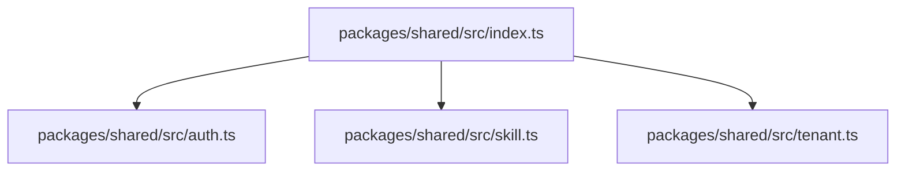

**图表来源**
- [packages/shared/src/index.ts:1-13](file://packages/shared/src/index.ts#L1-L13)

**章节来源**
- [packages/shared/src/index.ts:1-13](file://packages/shared/src/index.ts#L1-L13)
- [packages/shared/package.json:1-35](file://packages/shared/package.json#L1-L35)

## 核心组件
本节从类型设计、业务规则和工具函数三个维度，梳理共享库的核心能力。

### 认证与会话
- 会话 Cookie 名称、登录请求/响应、当前用户信息、员工档案、租户进入权限判断、当前会话上下文、API 错误体。
- 关键类型包括：`LoginRequest`、`LoginResponse`、`CurrentUser`、`EmployeeProfile`、`MeResponse`、`ApiErrorBody`。
- 业务规则：只有当员工档案启用且租户启用时，才允许进入该租户；`canEnterTenant` 提供统一判断。

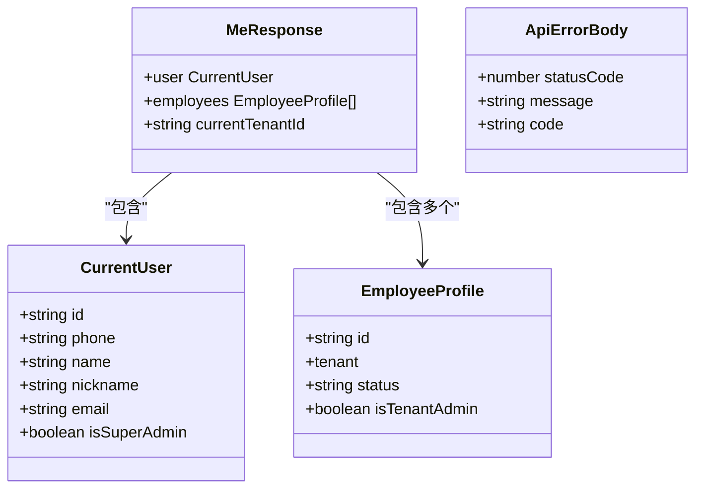

**图表来源**
- [packages/shared/src/auth.ts:1-39](file://packages/shared/src/auth.ts#L1-L39)

**章节来源**
- [packages/shared/src/auth.ts:1-39](file://packages/shared/src/auth.ts#L1-L39)

### 技能包与版本管理
- 包大小与文件数上限、忽略的文件名、根目录识别、路径规范化与安全校验。
- SKILL.md frontmatter 解析（name/description），名称与描述长度、命名规范校验。
- 语义化版本号解析、比较、默认下一补丁号生成。
- 版本状态（草稿/审核中/正式）、审核动作、可见性模型与文字描述、分类与预设、详情与列表、审核记录、差异与预览、查询参数、上传模式等。

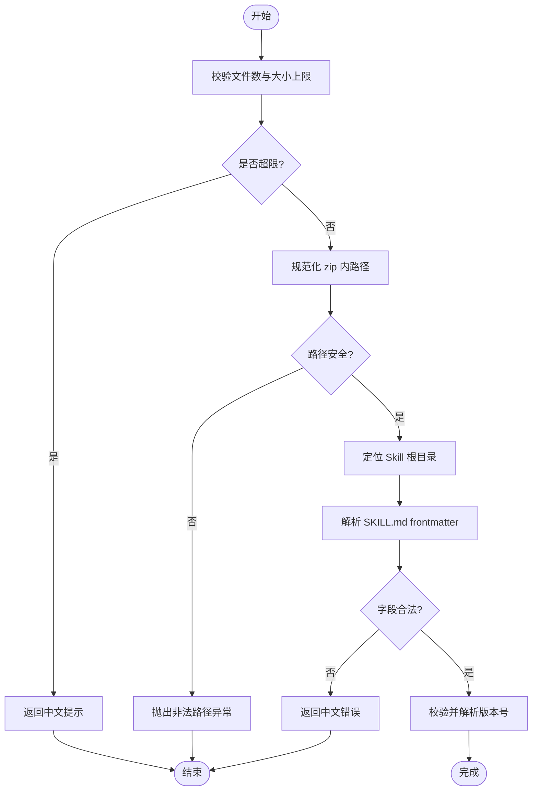

**图表来源**
- [packages/shared/src/skill.ts:1-120](file://packages/shared/src/skill.ts#L1-L120)

**章节来源**
- [packages/shared/src/skill.ts:1-120](file://packages/shared/src/skill.ts#L1-L120)

### 多租户与权限
- 租户状态与租户实体定义。
- 员工档案中的租户信息与状态，结合 `canEnterTenant` 控制访问。
- 技能可见性支持租户级、部门级、员工级与私有，配合部门树与在职员工列表进行筛选。

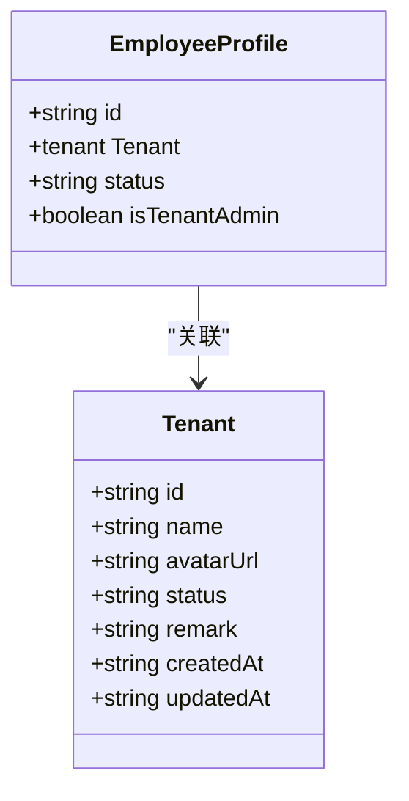

**图表来源**
- [packages/shared/src/tenant.ts:1-3](file://packages/shared/src/tenant.ts#L1-L3)
- [packages/shared/src/auth.ts:14-25](file://packages/shared/src/auth.ts#L14-L25)

**章节来源**
- [packages/shared/src/tenant.ts:1-3](file://packages/shared/src/tenant.ts#L1-L3)
- [packages/shared/src/auth.ts:14-25](file://packages/shared/src/auth.ts#L14-L25)

## 架构总览
共享库作为“契约层”，被服务端控制器、服务、DTO 以及前端 API 客户端共同引用，形成稳定的前后端协作边界。

```mermaid
graph TB
subgraph "前端 Web"
web_api["apps/web/src/api.ts"]
web_skills_page["apps/web/src/pages/SkillsPage.tsx"]
end
subgraph "后端 Server"
server_app_setup["apps/server/src/app.setup.ts"]
server_health["apps/server/src/health/health.controller.ts"]
server_auth_ctrl["apps/server/src/auth/auth.controller.ts"]
server_auth_guard["apps/server/src/auth/auth.guard.ts"]
server_skills_ctrl["apps/server/src/skills/skills.controller.ts"]
server_skills_dto["apps/server/src/skills/skills.dto.ts"]
server_skills_pkg["apps/server/src/skills/skill-package.ts"]
end
shared["packages/shared/*"]
web_api --> shared
web_skills_page --> shared
server_app_setup --> shared
server_health --> shared
server_auth_ctrl --> shared
server_auth_guard --> shared
server_skills_ctrl --> shared
server_skills_dto --> shared
server_skills_pkg --> shared
```

**图表来源**
- [apps/web/src/api.ts:1-31](file://apps/web/src/api.ts#L1-L31)
- [apps/web/src/pages/SkillsPage.tsx:16-38](file://apps/web/src/pages/SkillsPage.tsx#L16-L38)
- [apps/server/src/app.setup.ts:1-10](file://apps/server/src/app.setup.ts#L1-L10)
- [apps/server/src/health/health.controller.ts:1-20](file://apps/server/src/health/health.controller.ts#L1-L20)
- [apps/server/src/auth/auth.controller.ts:1-20](file://apps/server/src/auth/auth.controller.ts#L1-L20)
- [apps/server/src/auth/auth.guard.ts:1-20](file://apps/server/src/auth/auth.guard.ts#L1-L20)
- [apps/server/src/skills/skills.controller.ts:1-20](file://apps/server/src/skills/skills.controller.ts#L1-L20)
- [apps/server/src/skills/skills.dto.ts:1-28](file://apps/server/src/skills/skills.dto.ts#L1-L28)
- [apps/server/src/skills/skill-package.ts:1-20](file://apps/server/src/skills/skill-package.ts#L1-L20)
- [packages/shared/src/index.ts:1-13](file://packages/shared/src/index.ts#L1-L13)

## 详细组件分析

### 认证与会话流程
- 前端通过统一的 `api` 方法调用 `/api` 下的接口，非 2xx 响应会基于 `ApiErrorBody` 构造 `ApiError`，便于 UI 展示与服务端错误码透传。
- 服务端使用 `SESSION_COOKIE` 维护会话，控制器与守卫从共享库导入会话标识，保证两端一致。
- `MeResponse` 同时返回当前用户、员工档案列表与当前租户上下文，用于前端切换租户与权限判断。

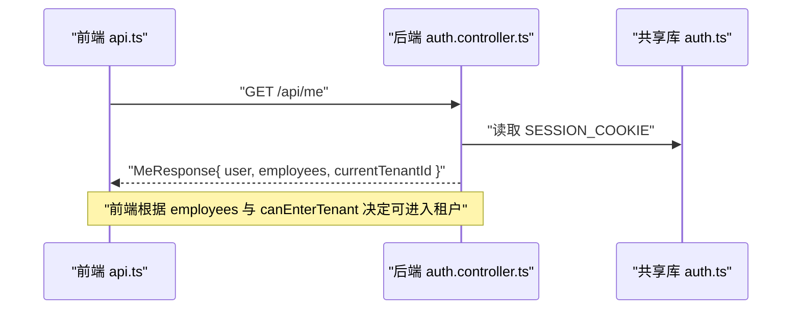

**图表来源**
- [apps/web/src/api.ts:1-31](file://apps/web/src/api.ts#L1-L31)
- [apps/server/src/auth/auth.controller.ts:1-20](file://apps/server/src/auth/auth.controller.ts#L1-L20)
- [apps/server/src/auth/auth.guard.ts:1-20](file://apps/server/src/auth/auth.guard.ts#L1-L20)
- [packages/shared/src/auth.ts:1-39](file://packages/shared/src/auth.ts#L1-L39)

**章节来源**
- [apps/web/src/api.ts:1-31](file://apps/web/src/api.ts#L1-L31)
- [apps/server/src/auth/auth.controller.ts:1-20](file://apps/server/src/auth/auth.controller.ts#L1-L20)
- [apps/server/src/auth/auth.guard.ts:1-20](file://apps/server/src/auth/auth.guard.ts#L1-L20)
- [packages/shared/src/auth.ts:1-39](file://packages/shared/src/auth.ts#L1-L39)

### 技能包上传与校验流程
- 前端或上传入口将 zip 与元数据提交到服务端。
- 服务端使用共享库的 `checkSkillLimits`、`normalizeSkillPath`、`findSkillRoot`、`parseSkillMd` 等进行严格校验。
- 若路径不安全或 frontmatter 不合法，直接返回中文错误提示，避免脏数据入库。

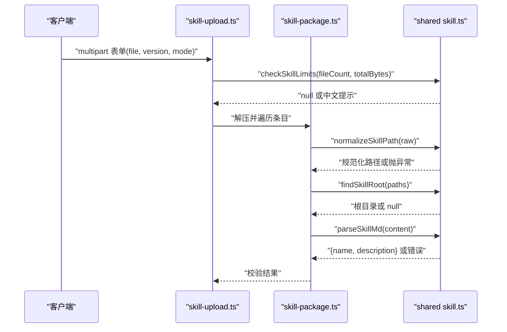

**图表来源**
- [apps/server/src/skills/skill-upload.ts:1-20](file://apps/server/src/skills/skill-upload.ts#L1-L20)
- [apps/server/src/skills/skill-package.ts:1-20](file://apps/server/src/skills/skill-package.ts#L1-L20)
- [packages/shared/src/skill.ts:1-120](file://packages/shared/src/skill.ts#L1-L120)

**章节来源**
- [apps/server/src/skills/skill-upload.ts:1-20](file://apps/server/src/skills/skill-upload.ts#L1-L20)
- [apps/server/src/skills/skill-package.ts:1-20](file://apps/server/src/skills/skill-package.ts#L1-L20)
- [packages/shared/src/skill.ts:1-120](file://packages/shared/src/skill.ts#L1-L120)

### 审核与版本管理
- 版本状态：草稿、审核中、正式。
- 审核动作：直接发布、提交审核、撤回、通过、驳回、重新上传、修改可见性、修改分类、下架、上架。
- 审核视图：按身份授权，租户管理员可对“审核中”的版本执行审核操作，其他人只读。
- 版本差异：基于 sha256 对比上一个正式版本的增删改文件，辅助审核决策。

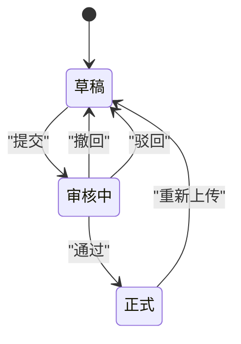

**图表来源**
- [packages/shared/src/skill.ts:92-109](file://packages/shared/src/skill.ts#L92-L109)
- [packages/shared/src/skill.ts:147-154](file://packages/shared/src/skill.ts#L147-L154)
- [packages/shared/src/skill.ts:253-312](file://packages/shared/src/skill.ts#L253-L312)

**章节来源**
- [packages/shared/src/skill.ts:92-109](file://packages/shared/src/skill.ts#L92-L109)
- [packages/shared/src/skill.ts:147-154](file://packages/shared/src/skill.ts#L147-L154)
- [packages/shared/src/skill.ts:253-312](file://packages/shared/src/skill.ts#L253-L312)

### 可见性与分类
- 可见性：租户可见、特定部门可见、特定员工可见、仅自己可见。
- 部门与员工选项：用于前端下拉选择与校验。
- 分类：租户管理员维护，支持常用预设与未分类标记。

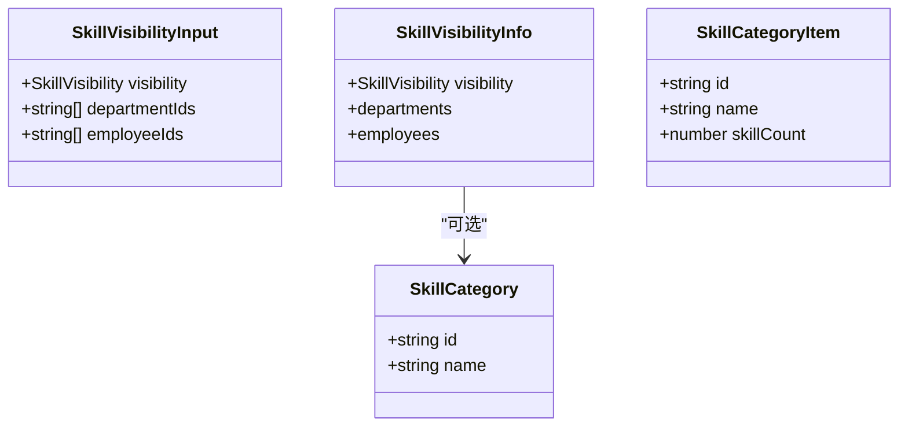

**图表来源**
- [packages/shared/src/skill.ts:111-145](file://packages/shared/src/skill.ts#L111-L145)
- [packages/shared/src/skill.ts:171-196](file://packages/shared/src/skill.ts#L171-L196)

**章节来源**
- [packages/shared/src/skill.ts:111-145](file://packages/shared/src/skill.ts#L111-L145)
- [packages/shared/src/skill.ts:171-196](file://packages/shared/src/skill.ts#L171-L196)

### 健康检查与 API 前缀
- 统一 API 前缀与健康检查路径，避免硬编码。
- 健康检查响应体包含状态与数据库连接状态。

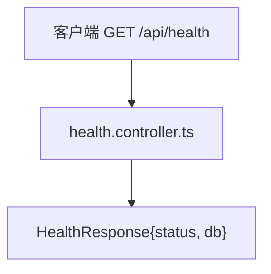

**图表来源**
- [packages/shared/src/index.ts:1-8](file://packages/shared/src/index.ts#L1-L8)
- [apps/server/src/health/health.controller.ts:1-20](file://apps/server/src/health/health.controller.ts#L1-L20)
- [apps/server/src/app.setup.ts:1-10](file://apps/server/src/app.setup.ts#L1-L10)

**章节来源**
- [packages/shared/src/index.ts:1-8](file://packages/shared/src/index.ts#L1-L8)
- [apps/server/src/health/health.controller.ts:1-20](file://apps/server/src/health/health.controller.ts#L1-L20)
- [apps/server/src/app.setup.ts:1-10](file://apps/server/src/app.setup.ts#L1-L10)

## 依赖关系分析
共享库对外暴露的类型与工具被多处消费，形成稳定依赖面：
- 前端：`api.ts` 使用 `ApiErrorBody`；`SkillsPage.tsx` 使用 `SkillVisibilityOptions`。
- 服务端：控制器、服务、DTO 广泛使用共享类型，如 `SkillDetail`、`SkillManageRow`、`SkillVersionStatus`、`SkillVisibility`、`UploadSkillRequest` 等。
- 测试：e2e 用例也依赖共享常量与类型，保证端到端一致性。

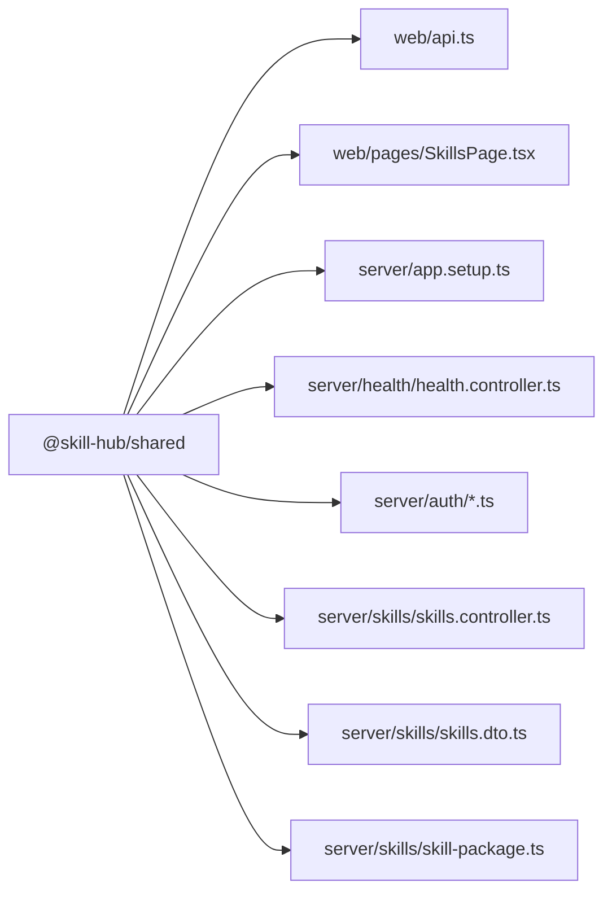

**图表来源**
- [apps/web/src/api.ts:1-31](file://apps/web/src/api.ts#L1-L31)
- [apps/web/src/pages/SkillsPage.tsx:16-38](file://apps/web/src/pages/SkillsPage.tsx#L16-L38)
- [apps/server/src/app.setup.ts:1-10](file://apps/server/src/app.setup.ts#L1-L10)
- [apps/server/src/health/health.controller.ts:1-20](file://apps/server/src/health/health.controller.ts#L1-L20)
- [apps/server/src/auth/auth.controller.ts:1-20](file://apps/server/src/auth/auth.controller.ts#L1-L20)
- [apps/server/src/auth/auth.guard.ts:1-20](file://apps/server/src/auth/auth.guard.ts#L1-L20)
- [apps/server/src/skills/skills.controller.ts:1-20](file://apps/server/src/skills/skills.controller.ts#L1-L20)
- [apps/server/src/skills/skills.dto.ts:1-28](file://apps/server/src/skills/skills.dto.ts#L1-L28)
- [apps/server/src/skills/skill-package.ts:1-20](file://apps/server/src/skills/skill-package.ts#L1-L20)

**章节来源**
- [apps/web/src/api.ts:1-31](file://apps/web/src/api.ts#L1-L31)
- [apps/web/src/pages/SkillsPage.tsx:16-38](file://apps/web/src/pages/SkillsPage.tsx#L16-L38)
- [apps/server/src/skills/skills.dto.ts:1-28](file://apps/server/src/skills/skills.dto.ts#L1-L28)
- [apps/server/src/skills/skill-package.ts:1-20](file://apps/server/src/skills/skill-package.ts#L1-L20)

## 性能与体积考量
- 共享库依赖 `yaml` 用于解析 SKILL.md frontmatter，属于轻量依赖，对构建体积影响有限。
- 工具函数多为纯函数，无副作用，适合在前端与服务端复用，减少重复计算。
- 建议仅在必要时引入共享库，避免不必要的打包体积增长。

[本节为通用指导，不涉及具体文件分析]

## 使用示例与最佳实践

### 前端使用示例
- 调用 API 时，使用共享库导出的 `ApiErrorBody` 类型来约束错误体，提升错误处理的一致性。
- 在页面中使用 `SkillVisibilityOptions` 获取部门与员工列表，用于筛选与可见性设置。

参考路径：
- [apps/web/src/api.ts:1-31](file://apps/web/src/api.ts#L1-L31)
- [apps/web/src/pages/SkillsPage.tsx:16-38](file://apps/web/src/pages/SkillsPage.tsx#L16-L38)

**章节来源**
- [apps/web/src/api.ts:1-31](file://apps/web/src/api.ts#L1-L31)
- [apps/web/src/pages/SkillsPage.tsx:16-38](file://apps/web/src/pages/SkillsPage.tsx#L16-L38)

### 服务端使用示例
- 控制器与服务使用共享类型定义请求与响应，例如 `SkillDetail`、`SkillManageRow`、`PendingSkillReview`、`SkillBadges` 等。
- DTO 层使用共享常量与类型进行校验，如 `SkillUploadMode`、`SkillVisibility`、`SKILL_VERSION_PATTERN`、`SKILL_REJECT_COMMENT_MAX_LENGTH` 等。
- 技能包处理使用共享工具函数进行路径与内容校验，确保数据安全与格式正确。

参考路径：
- [apps/server/src/skills/skills.controller.ts:1-20](file://apps/server/src/skills/skills.controller.ts#L1-L20)
- [apps/server/src/skills/skills.dto.ts:1-28](file://apps/server/src/skills/skills.dto.ts#L1-L28)
- [apps/server/src/skills/skill-package.ts:1-20](file://apps/server/src/skills/skill-package.ts#L1-L20)

**章节来源**
- [apps/server/src/skills/skills.controller.ts:1-20](file://apps/server/src/skills/skills.controller.ts#L1-L20)
- [apps/server/src/skills/skills.dto.ts:1-28](file://apps/server/src/skills/skills.dto.ts#L1-L28)
- [apps/server/src/skills/skill-package.ts:1-20](file://apps/server/src/skills/skill-package.ts#L1-L20)

### 最佳实践
- 所有跨端契约优先放在共享库，避免在服务端与前端分别维护相同类型。
- 使用共享库提供的工具函数进行输入校验，保持错误消息一致且可本地化。
- 对敏感字段（如密码）不要放入共享类型；仅暴露必要字段。
- 对枚举值（如状态、动作、可见性）使用共享类型，并在 UI 侧使用对应的标签映射。
- 版本号与比较逻辑统一由共享库提供，避免各端自行实现导致不一致。

[本节为通用指导，不涉及具体文件分析]

## 故障排查
- 如果前端报错显示“请求失败（HTTP x）”，检查服务端是否正确返回 `ApiErrorBody`，并确保 `message` 字段存在。
- 如果上传失败，查看共享库返回的中文错误提示，常见原因包括：文件数超限、包大小超限、非法路径、frontmatter 缺失或格式不正确。
- 如果无法进入某个租户，检查员工档案状态与租户状态是否均为启用。

参考路径：
- [apps/web/src/api.ts:15-31](file://apps/web/src/api.ts#L15-L31)
- [packages/shared/src/skill.ts:16-21](file://packages/shared/src/skill.ts#L16-L21)
- [packages/shared/src/skill.ts:34-48](file://packages/shared/src/skill.ts#L34-L48)
- [packages/shared/src/skill.ts:52-71](file://packages/shared/src/skill.ts#L52-L71)
- [packages/shared/src/auth.ts:24-25](file://packages/shared/src/auth.ts#L24-L25)

**章节来源**
- [apps/web/src/api.ts:15-31](file://apps/web/src/api.ts#L15-L31)
- [packages/shared/src/skill.ts:16-21](file://packages/shared/src/skill.ts#L16-L21)
- [packages/shared/src/skill.ts:34-48](file://packages/shared/src/skill.ts#L34-L48)
- [packages/shared/src/skill.ts:52-71](file://packages/shared/src/skill.ts#L52-L71)
- [packages/shared/src/auth.ts:24-25](file://packages/shared/src/auth.ts#L24-L25)

## 结论
共享库通过统一的类型定义与工具函数，将认证、技能包、审核、可见性、分类与多租户等核心领域模型沉淀为前后端共同遵守的契约。这显著降低了重复实现与歧义风险，提升了代码一致性与可维护性。建议在后续开发中持续扩展共享库，将所有跨端契约与通用逻辑集中管理，并保持严格的类型与校验规则。

[本节为总结性内容，不涉及具体文件分析]