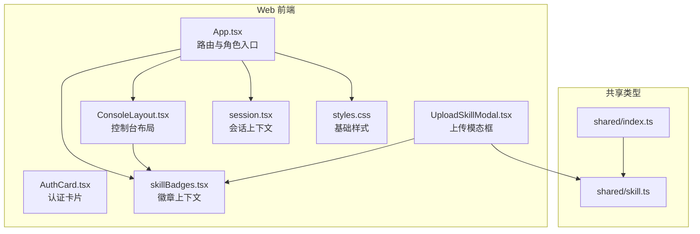
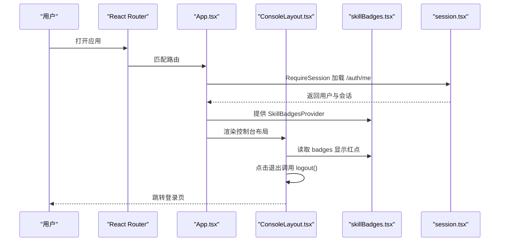
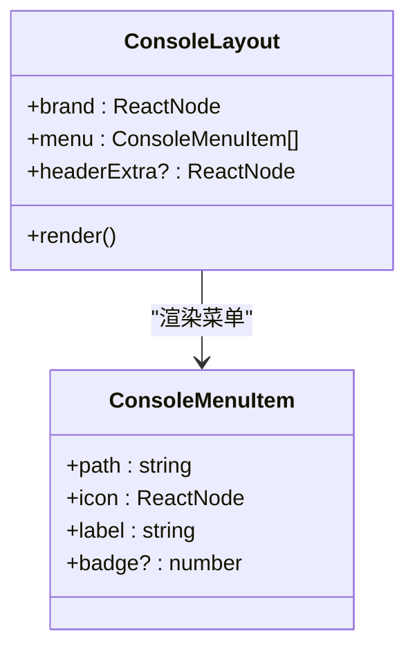
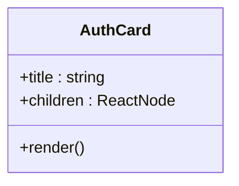
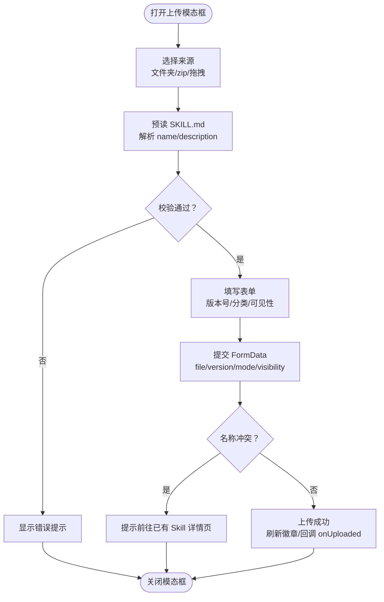
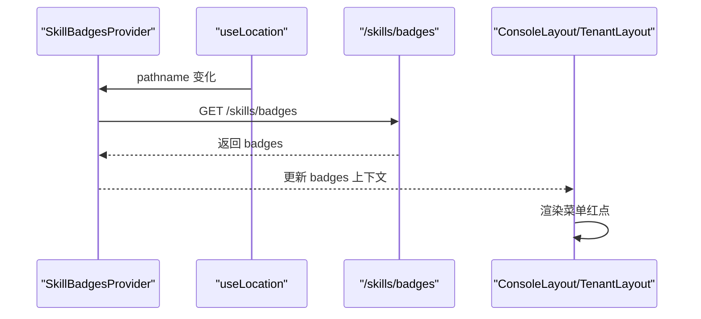
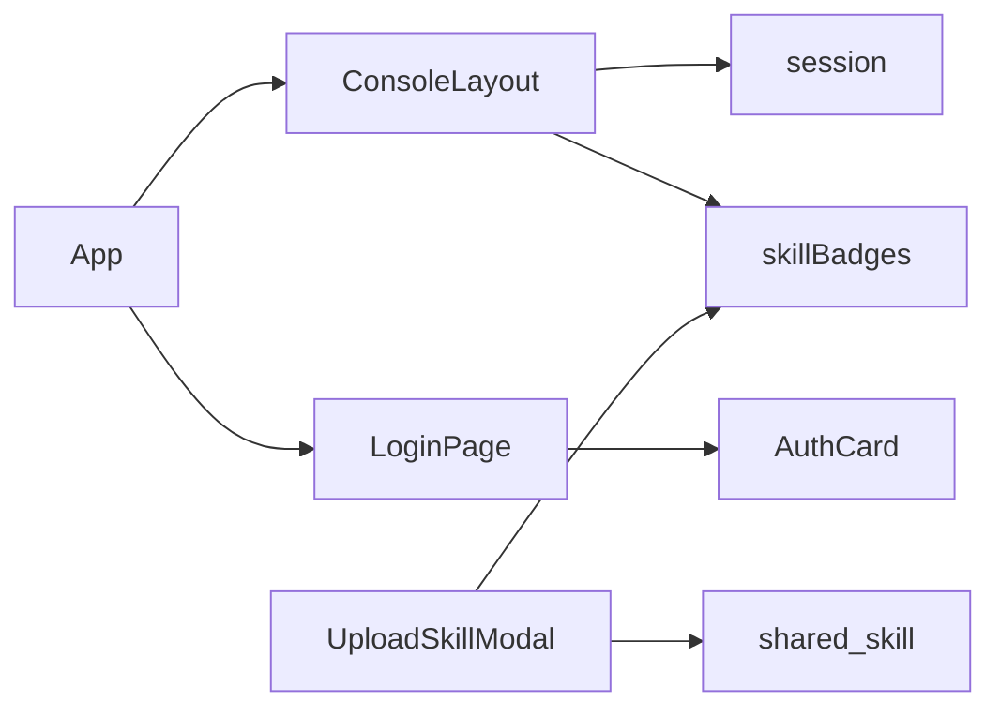

# UI 组件

<cite>
**本文引用的文件**   
- [ConsoleLayout.tsx](file://apps/web/src/pages/ConsoleLayout.tsx)
- [AuthCard.tsx](file://apps/web/src/pages/AuthCard.tsx)
- [UploadSkillModal.tsx](file://apps/web/src/pages/UploadSkillModal.tsx)
- [skillBadges.tsx](file://apps/web/src/skillBadges.tsx)
- [App.tsx](file://apps/web/src/App.tsx)
- [LoginPage.tsx](file://apps/web/src/pages/LoginPage.tsx)
- [session.tsx](file://apps/web/src/session.tsx)
- [styles.css](file://apps/web/src/styles.css)
- [index.ts](file://packages/shared/src/index.ts)
- [skill.ts](file://packages/shared/src/skill.ts)
</cite>

## 目录
1. [引言](#引言)
2. [项目结构](#项目结构)
3. [核心组件](#核心组件)
4. [架构总览](#架构总览)
5. [详细组件分析](#详细组件分析)
6. [依赖关系分析](#依赖关系分析)
7. [性能与可访问性](#性能与可访问性)
8. [故障排查](#故障排查)
9. [结论](#结论)
10. [附录：属性接口与使用示例](#附录属性接口与使用示例)

## 引言
本文面向前端开发者，系统化梳理本仓库中的通用 UI 组件设计模式与实现原理，重点覆盖以下四个关键部分：
- 控制台布局组件：侧栏导航、顶栏用户信息与退出流程。
- 认证卡片组件：登录页居中卡片容器。
- 上传模态框组件：Skill 包选择、校验、表单与提交流程。
- 技能徽章系统：待审核与被驳回草稿的菜单红点数据流。

文档将说明组件的属性接口、事件处理、样式定制选项、响应式适配、主题支持、可访问性实践，并给出组合模式、插槽（children）与动态渲染机制的使用指南，帮助开发者正确集成和扩展该 UI 组件库。

## 项目结构
UI 相关代码集中在 Web 应用的前端源码中，采用“页面级组件 + 共享类型”的组织方式：
- 页面级组件位于 `apps/web/src/pages`，包括控制台布局、认证卡片、上传模态框等。
- 全局状态与上下文在 `apps/web/src` 根目录下，如会话上下文与徽章上下文。
- 共享类型定义在 `packages/shared/src`，被前后端或不同模块复用。

**图表来源**
- [App.tsx:1-66](file://apps/web/src/App.tsx#L1-L66)
- [ConsoleLayout.tsx:1-66](file://apps/web/src/pages/ConsoleLayout.tsx#L1-L66)
- [AuthCard.tsx:1-17](file://apps/web/src/pages/AuthCard.tsx#L1-L17)
- [UploadSkillModal.tsx:1-269](file://apps/web/src/pages/UploadSkillModal.tsx#L1-L269)
- [skillBadges.tsx:1-26](file://apps/web/src/skillBadges.tsx#L1-L26)
- [session.tsx:1-68](file://apps/web/src/session.tsx#L1-L68)
- [styles.css:1-2](file://apps/web/src/styles.css#L1-L2)
- [index.ts:1-13](file://packages/shared/src/index.ts#L1-L13)
- [skill.ts:1-401](file://packages/shared/src/skill.ts#L1-L401)

**章节来源**
- [App.tsx:1-66](file://apps/web/src/App.tsx#L1-L66)
- [index.ts:1-13](file://packages/shared/src/index.ts#L1-L13)

## 核心组件
本节聚焦四个核心 UI 组件的职责与交互边界：
- 控制台布局组件：提供侧边栏菜单、当前用户展示、退出登录与错误提示；通过 Outlet 渲染子路由内容。
- 认证卡片组件：为登录页提供居中的卡片容器与标题区域，承载表单与快捷账号按钮。
- 上传模态框组件：封装 Skill 包的拖拽/文件夹/zip 选择、SKILL.md 预读、版本与可见性表单、多模式提交与冲突处理。
- 技能徽章系统：维护待审核与被驳回草稿数量，并在路由切换时刷新，供菜单红点消费。

**章节来源**
- [ConsoleLayout.tsx:1-66](file://apps/web/src/pages/ConsoleLayout.tsx#L1-L66)
- [AuthCard.tsx:1-17](file://apps/web/src/pages/AuthCard.tsx#L1-L17)
- [UploadSkillModal.tsx:1-269](file://apps/web/src/pages/UploadSkillModal.tsx#L1-L269)
- [skillBadges.tsx:1-26](file://apps/web/src/skillBadges.tsx#L1-L26)

## 架构总览
整体 UI 架构以 React Router 驱动页面路由，App 根据用户身份（超管、租户管理员、普通员工）决定控制台菜单与权限。控制台布局包裹业务页面，徽章上下文提供菜单红点数据，会话上下文负责鉴权与用户信息。

**图表来源**
- [App.tsx:1-66](file://apps/web/src/App.tsx#L1-L66)
- [ConsoleLayout.tsx:1-66](file://apps/web/src/pages/ConsoleLayout.tsx#L1-L66)
- [skillBadges.tsx:1-26](file://apps/web/src/skillBadges.tsx#L1-L26)
- [session.tsx:1-68](file://apps/web/src/session.tsx#L1-L68)

## 详细组件分析

### 控制台布局组件
控制台布局是后台管理界面的外壳，包含：
- 侧边栏：品牌标识、菜单项、红点徽章、折叠控制。
- 顶部栏：额外头部内容、当前用户昵称、退出登录按钮。
- 内容区：错误提示与子路由 Outlet。

**图表来源**
- [ConsoleLayout.tsx:8-14](file://apps/web/src/pages/ConsoleLayout.tsx#L8-L14)
- [ConsoleLayout.tsx:16-66](file://apps/web/src/pages/ConsoleLayout.tsx#L16-L66)

要点说明：
- 响应式布局：侧栏使用 Ant Design 的 Layout.Sider，支持 breakpoint 与 collapsed 状态，移动端自动折叠。
- 主题支持：侧栏 theme="light"，可通过 Ant Design 主题配置进行全局主题定制。
- 可访问性：菜单项使用 NavLink 与 Space 组合，Badge 提供可读计数；退出按钮带图标与文本，便于屏幕阅读器识别。
- 样式定制：可通过外层 Layout 的 style 与 Menu 的 items 自定义颜色、间距与尺寸。
- 事件处理：onCollapse 控制折叠；退出登录调用 logout 后跳转到登录页，失败时显示 Alert。

**章节来源**
- [ConsoleLayout.tsx:1-66](file://apps/web/src/pages/ConsoleLayout.tsx#L1-L66)

### 认证卡片组件
认证卡片用于登录页的居中布局与标题展示，承载表单与快捷账号按钮。

**图表来源**
- [AuthCard.tsx:4-16](file://apps/web/src/pages/AuthCard.tsx#L4-L16)

要点说明：
- 插槽使用：通过 children 注入登录表单与快捷账号按钮，保持容器职责单一。
- 响应式布局：外层 Layout 设置 minHeight 与居中，Card 限制最大宽度，适配不同屏幕。
- 样式定制：可通过 Card 的 style 调整宽度、圆角与阴影；Typography.Title 支持 level 与 textAlign。
- 可访问性：标题使用语义化 Typography，表单控件具备 label 与 placeholder，提升可访问性。

**章节来源**
- [AuthCard.tsx:1-17](file://apps/web/src/pages/AuthCard.tsx#L1-L17)
- [LoginPage.tsx:1-41](file://apps/web/src/pages/LoginPage.tsx#L1-L41)

### 上传模态框组件
上传模态框是 Skill 上传的核心交互组件，支持三种来源（文件夹、zip、拖拽）、两种目标（新建、新版本、替换草稿），以及多种上传模式（存草稿、直接发布、提交审核）。

**图表来源**
- [UploadSkillModal.tsx:26-30](file://apps/web/src/pages/UploadSkillModal.tsx#L26-L30)
- [UploadSkillModal.tsx:69-130](file://apps/web/src/pages/UploadSkillModal.tsx#L69-L130)
- [UploadSkillModal.tsx:140-269](file://apps/web/src/pages/UploadSkillModal.tsx#L140-L269)
- [skill.ts:1-401](file://packages/shared/src/skill.ts#L1-L401)

要点说明：
- 数据来源与校验：
  - 文件夹与 zip 选择通过隐藏 input 触发，拖拽通过 dataTransfer 获取文件。
  - 预读 SKILL.md 使用 shared 工具函数解析 frontmatter，校验 name/description 格式与长度。
  - 文件数与大小上限由 shared 常量与工具函数统一约束。
- 表单字段：
  - 版本号必填且遵循 x.y.z 正则，默认值基于最高版本计算。
  - 分类仅在“新建”时出现，下拉选项来自分类服务。
  - 可见性字段仅在新建时出现，按所有者与租户管理员权限渲染。
- 提交逻辑：
  - 新建：POST /skills，携带 version、mode、categoryId、visibility。
  - 新版本：POST /skills/:id/versions，携带 file、version、mode。
  - 替换草稿：PUT /skills/:id/versions/:versionId/package，可选后续 submit/publish。
- 错误处理：
  - 名称冲突（409）时提示并引导到已有 Skill 详情页。
  - 其他错误显示 Alert，保留已选文件以便重试。
- 徽章联动：
  - 提交成功后调用 refreshBadges 刷新菜单红点。
  - 提交审核时弹出审核链接提示。

**章节来源**
- [UploadSkillModal.tsx:1-269](file://apps/web/src/pages/UploadSkillModal.tsx#L1-L269)
- [skill.ts:1-401](file://packages/shared/src/skill.ts#L1-L401)

### 技能徽章系统
技能徽章系统通过 Context 提供待审核与被驳回草稿的数量，并在路由切换时自动刷新，供控制台菜单红点消费。

**图表来源**
- [skillBadges.tsx:1-26](file://apps/web/src/skillBadges.tsx#L1-L26)
- [App.tsx:24-38](file://apps/web/src/App.tsx#L24-L38)
- [ConsoleLayout.tsx:30-44](file://apps/web/src/pages/ConsoleLayout.tsx#L30-L44)

要点说明：
- 数据源：GET /skills/badges 返回 pendingReviews 与 rejectedDrafts。
- 刷新策略：路由切换时自动刷新；用户操作后手动调用 refresh 立即更新。
- 容错处理：请求失败保持原值，避免影响用户体验。
- 消费方：TenantLayout 将 badges 映射到菜单项的 badge 属性，ConsoleLayout 渲染 Badge。

**章节来源**
- [skillBadges.tsx:1-26](file://apps/web/src/skillBadges.tsx#L1-L26)
- [App.tsx:24-38](file://apps/web/src/App.tsx#L24-L38)
- [ConsoleLayout.tsx:30-44](file://apps/web/src/pages/ConsoleLayout.tsx#L30-L44)

## 依赖关系分析
UI 组件之间的依赖关系如下：
- App 作为入口，根据用户身份渲染不同的控制台布局。
- ConsoleLayout 依赖 session 获取当前用户，依赖 skillBadges 获取菜单红点。
- UploadSkillModal 依赖 shared 类型与工具函数进行 Skill 包校验与版本处理。
- LoginPage 使用 AuthCard 作为容器，结合 session 完成登录流程。

**图表来源**
- [App.tsx:1-66](file://apps/web/src/App.tsx#L1-L66)
- [ConsoleLayout.tsx:1-66](file://apps/web/src/pages/ConsoleLayout.tsx#L1-L66)
- [UploadSkillModal.tsx:1-269](file://apps/web/src/pages/UploadSkillModal.tsx#L1-L269)
- [LoginPage.tsx:1-41](file://apps/web/src/pages/LoginPage.tsx#L1-L41)
- [skill.ts:1-401](file://packages/shared/src/skill.ts#L1-L401)

**章节来源**
- [App.tsx:1-66](file://apps/web/src/App.tsx#L1-L66)
- [ConsoleLayout.tsx:1-66](file://apps/web/src/pages/ConsoleLayout.tsx#L1-L66)
- [UploadSkillModal.tsx:1-269](file://apps/web/src/pages/UploadSkillModal.tsx#L1-L269)
- [LoginPage.tsx:1-41](file://apps/web/src/pages/LoginPage.tsx#L1-L41)
- [skill.ts:1-401](file://packages/shared/src/skill.ts#L1-L401)

## 性能与可访问性
- 性能优化：
  - 徽章数据按需刷新，避免频繁轮询；路由切换时刷新一次，减少不必要请求。
  - 上传模态框在预读 SKILL.md 时异步处理，避免阻塞主线程。
  - 侧栏折叠状态本地维护，减少重绘。
- 可访问性：
  - 所有交互元素具备语义化标签与文本描述（如 Button、NavLink、Badge）。
  - 表单控件使用 label 与 placeholder，配合 antd Form 的规则提示。
  - 错误提示使用 Alert，确保视觉与屏幕阅读器均可感知。
- 主题与样式：
  - 使用 Ant Design 组件，支持主题变量与 CSS-in-JS 定制。
  - 基础样式通过 styles.css 重置 body margin，保证布局一致性。

[本节为通用指导，不直接分析具体文件]

## 故障排查
常见问题与定位方法：
- 登录失败：检查 /auth/me 是否返回 401，确认 RequireSession 是否正确跳转登录页。
- 徽章不刷新：确认 SkillBadgesProvider 是否在 TenantConsole 内包裹，且路由切换时触发 refresh。
- 上传失败：检查 FormData 字段是否完整（file、version、mode、visibility），确认服务端返回的错误码与消息。
- 名称冲突：捕获 409 错误，判断是否包含 skillId，引导用户前往已有 Skill 详情页。

**章节来源**
- [session.tsx:40-68](file://apps/web/src/session.tsx#L40-L68)
- [skillBadges.tsx:14-23](file://apps/web/src/skillBadges.tsx#L14-L23)
- [UploadSkillModal.tsx:123-130](file://apps/web/src/pages/UploadSkillModal.tsx#L123-L130)

## 结论
本 UI 组件库围绕控制台布局、认证卡片、上传模态框与技能徽章四大核心展开，采用 React 组件化与上下文状态管理模式，结合 Ant Design 提供一致的交互体验。通过共享类型与工具函数，保证了前后端一致的数据契约与校验逻辑。开发者可基于现有组件快速搭建后台界面，并通过属性、插槽与样式定制满足多样化需求。

[本节为总结性内容，不直接分析具体文件]

## 附录：属性接口与使用示例

### 控制台布局组件属性
- brand：ReactNode，侧栏品牌标识。
- menu：ConsoleMenuItem[]，菜单项数组，包含 path、icon、label、badge。
- headerExtra：ReactNode，顶栏额外内容。

使用示例路径：
- [App.tsx:20-38](file://apps/web/src/App.tsx#L20-L38)

**章节来源**
- [ConsoleLayout.tsx:8-14](file://apps/web/src/pages/ConsoleLayout.tsx#L8-L14)
- [ConsoleLayout.tsx:16-66](file://apps/web/src/pages/ConsoleLayout.tsx#L16-L66)
- [App.tsx:20-38](file://apps/web/src/App.tsx#L20-L38)

### 认证卡片组件属性
- title：string，卡片标题。
- children：ReactNode，卡片内容（表单、按钮等）。

使用示例路径：
- [LoginPage.tsx:26-39](file://apps/web/src/pages/LoginPage.tsx#L26-L39)

**章节来源**
- [AuthCard.tsx:4-16](file://apps/web/src/pages/AuthCard.tsx#L4-L16)
- [LoginPage.tsx:26-39](file://apps/web/src/pages/LoginPage.tsx#L26-L39)

### 上传模态框组件属性
- target：UploadTarget，上传目标（new/version/replace）。
- onCancel：() => void，取消回调。
- onUploaded：(skill: SkillDetail) => void，上传成功回调。
- onOpenExisting：(skillId: string) => void，名称冲突时打开已有 Skill 详情页。

使用示例路径：
- [UploadSkillModal.tsx:42-53](file://apps/web/src/pages/UploadSkillModal.tsx#L42-L53)

**章节来源**
- [UploadSkillModal.tsx:26-30](file://apps/web/src/pages/UploadSkillModal.tsx#L26-L30)
- [UploadSkillModal.tsx:42-53](file://apps/web/src/pages/UploadSkillModal.tsx#L42-L53)

### 技能徽章上下文
- badges：SkillBadges，包含 pendingReviews 与 rejectedDrafts。
- refresh：() => void，手动刷新徽章数据。

使用示例路径：
- [skillBadges.tsx:14-25](file://apps/web/src/skillBadges.tsx#L14-L25)
- [App.tsx:24-38](file://apps/web/src/App.tsx#L24-L38)

**章节来源**
- [skillBadges.tsx:1-26](file://apps/web/src/skillBadges.tsx#L1-L26)
- [App.tsx:24-38](file://apps/web/src/App.tsx#L24-L38)