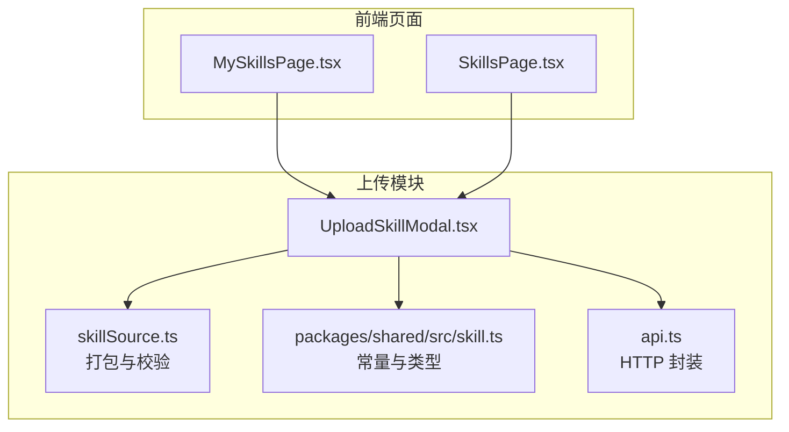
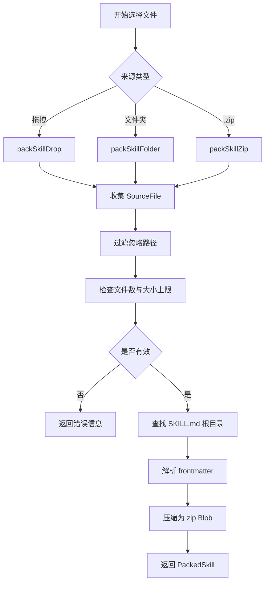
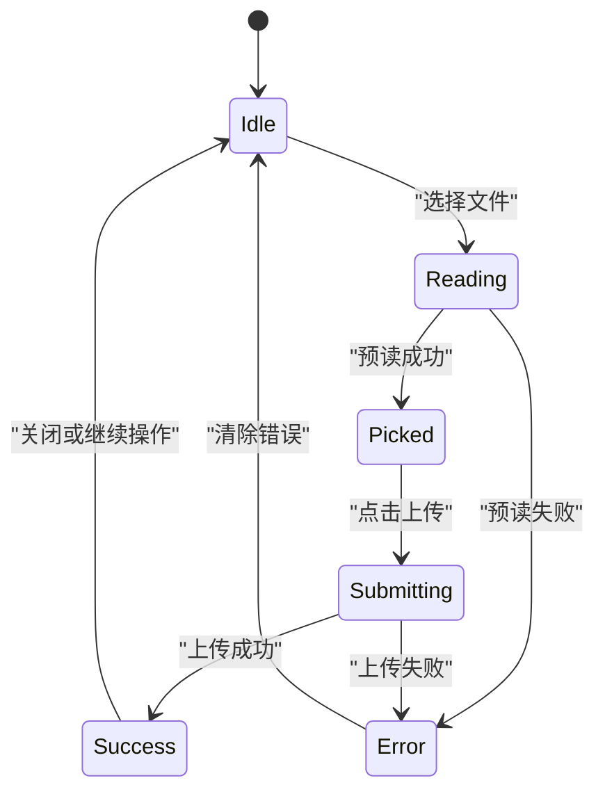
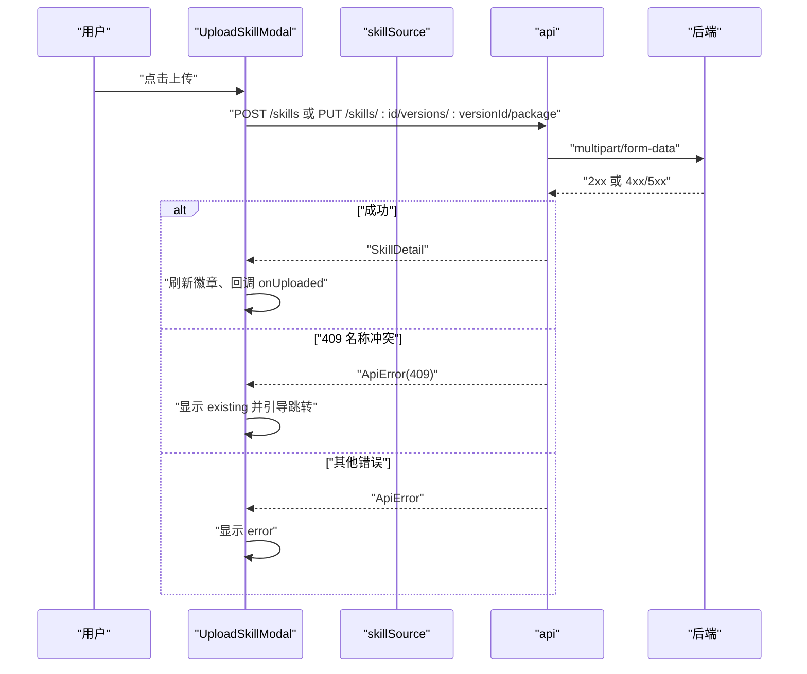
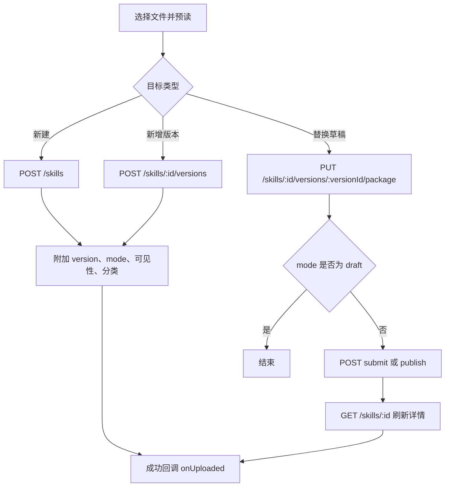
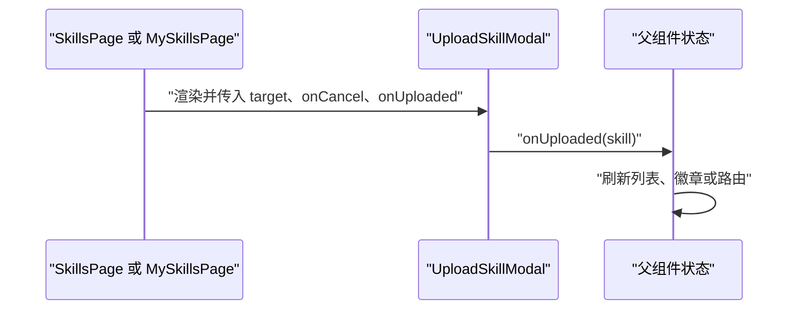
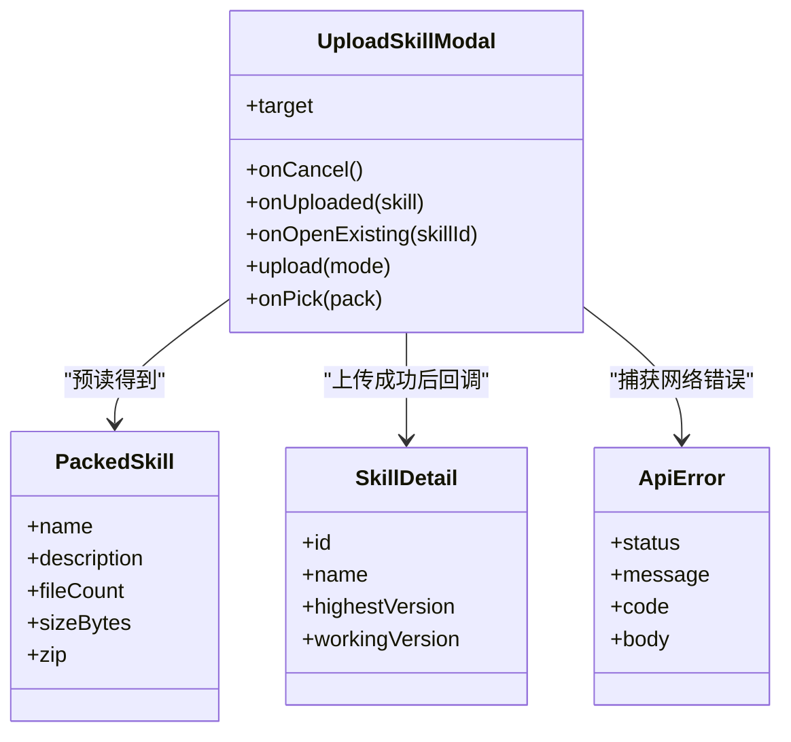

# 上传模态框组件

<cite>
**本文引用的文件**   
- [UploadSkillModal.tsx](file://apps/web/src/pages/UploadSkillModal.tsx)
- [skillSource.ts](file://apps/web/src/skillSource.ts)
- [skill.ts](file://packages/shared/src/skill.ts)
- [api.ts](file://apps/web/src/api.ts)
- [SkillsPage.tsx](file://apps/web/src/pages/SkillsPage.tsx)
- [MySkillsPage.tsx](file://apps/web/src/pages/MySkillsPage.tsx)
</cite>

## 目录
1. [简介](#简介)
2. [项目结构中的位置](#项目结构中的位置)
3. [核心能力总览](#核心能力总览)
4. [组件属性与配置](#组件属性与配置)
5. [文件选择机制](#文件选择机制)
6. [进度显示与状态反馈](#进度显示与状态反馈)
7. [错误处理机制](#错误处理机制)
8. [上传流程与后端接口](#上传流程与后端接口)
9. [拖拽、批量与断点续传说明](#拖拽批量与断点续传说明)
10. [使用示例与集成方式](#使用示例与集成方式)
11. [自定义上传逻辑与进度监控指南](#自定义上传逻辑与进度监控指南)
12. [依赖关系分析](#依赖关系分析)
13. [常见问题排查](#常见问题排查)
14. [结论](#结论)

## 简介
上传模态框组件 UploadSkillModal 是技能上传流程的前端入口，负责：
- 接收用户选择的 Skill 文件夹或 .zip 压缩包。
- 预读并校验 SKILL.md，生成可上传的 zip Blob。
- 根据当前用户身份提供“存草稿”“提交审核”“直接发布”等上传去向。
- 展示文件数量、大小、名称、描述等信息。
- 处理版本冲突、格式错误、网络异常等错误场景。
- 在上传成功后刷新页面徽章、回调父组件并打开审核链接（如适用）。

该组件不实现真正的分片、断点续传或实时进度条；它通过浏览器原生 FormData 上传整个 zip，并在按钮上显示“正在提交”的状态。

## 项目结构中的位置
UploadSkillModal 位于前端应用 `apps/web/src/pages` 下，被“我的技能”和“技能管理”页面引用，作为新建、新增版本、重新上传草稿的统一入口。

**图表来源**
- [UploadSkillModal.tsx:42-268](file://apps/web/src/pages/UploadSkillModal.tsx#L42-L268)
- [skillSource.ts:1-129](file://apps/web/src/skillSource.ts#L1-L129)
- [skill.ts:1-401](file://packages/shared/src/skill.ts#L1-L401)
- [api.ts:1-42](file://apps/web/src/api.ts#L1-L42)
- [MySkillsPage.tsx:9-98](file://apps/web/src/pages/MySkillsPage.tsx#L9-L98)
- [SkillsPage.tsx:14-64](file://apps/web/src/pages/SkillsPage.tsx#L14-L64)

**章节来源**
- [UploadSkillModal.tsx:42-268](file://apps/web/src/pages/UploadSkillModal.tsx#L42-L268)
- [MySkillsPage.tsx:9-98](file://apps/web/src/pages/MySkillsPage.tsx#L9-L98)
- [SkillsPage.tsx:14-64](file://apps/web/src/pages/SkillsPage.tsx#L14-L64)

## 核心能力总览
- **文件来源**
  - 拖拽：支持拖入一个文件夹或一个 .zip。
  - 选择文件夹：使用 `webkitdirectory` 多选文件夹。
  - 选择 .zip：限制 accept 为 `.zip,application/zip`。
- **预校验**
  - 忽略 `.DS_Store`、`.git`、`node_modules`、`__pycache__` 等路径段。
  - 检查文件数不超过上限、解压后总大小不超过上限。
  - 要求 SKILL.md 存在且 frontmatter 合法。
- **上传模式**
  - 租户管理员：可选“存草稿”“直接发布”。
  - 普通员工：可选“存草稿”“提交审核”。
- **表单字段**
  - 版本号：必填，遵循 x.y.z 格式；已有 Skill 时默认下一个补丁号。
  - 分类：仅新建时可选。
  - 可见性：仅新建时设置，包含租户、部门、员工、私有等策略。
- **结果反馈**
  - 成功：提示消息、刷新徽章、调用 `onUploaded`、必要时打开审核链接。
  - 失败：区分 409 名称冲突与其他错误，必要时引导前往已有 Skill 详情页。

**章节来源**
- [UploadSkillModal.tsx:26-139](file://apps/web/src/pages/UploadSkillModal.tsx#L26-L139)
- [skillSource.ts:14-78](file://apps/web/src/skillSource.ts#L14-L78)
- [skill.ts:3-21](file://packages/shared/src/skill.ts#L3-L21)
- [skill.ts:50-75](file://packages/shared/src/skill.ts#L50-L75)

## 组件属性与配置
| 属性 | 类型 | 是否必填 | 说明 |
|---|---|---:|---|
| `target` | `UploadTarget` | 是 | 定义上传用途：新建、为已有 Skill 上传新版本、替换草稿。 |
| `onCancel` | `() => void` | 是 | 关闭模态框。 |
| `onUploaded` | `(skill: SkillDetail) => void` | 是 | 上传成功后回调，父组件可用新 Skill 数据刷新列表。 |
| `onOpenExisting` | `(skillId: string) => void` | 否 | 新建时若名称冲突且服务端返回 skillId，用于跳转到已有 Skill 详情页。 |

`UploadTarget` 支持三种用途：
- `{ kind: 'new' }`：新建 Skill。
- `{ kind: 'version', skill: SkillDetail }`：为已有 Skill 上传新版本。
- `{ kind: 'replace', skill: SkillDetail, version: SkillWorkingVersion }`：重新上传草稿，版本号不变。

**章节来源**
- [UploadSkillModal.tsx:26-53](file://apps/web/src/pages/UploadSkillModal.tsx#L26-L53)

## 文件选择机制
### 拖拽上传
- 拖拽区域监听 `dragover`、`dragleave`、`drop`。
- 拖入时调用 `packSkillDrop`，只允许一个文件或一个目录。
- 如果是目录则递归读取；如果是 .zip 则按 zip 解析。

### 选择文件夹
- 使用隐藏 `<input type="file">`，并通过 `webkitdirectory` 启用文件夹选择。
- 将 `FileList` 转为数组后交给 `packSkillFolder`。

### 选择 .zip
- 使用隐藏 `<input type="file">`，限制 accept 为 `.zip,application/zip`。
- 取第一个文件交给 `packSkillZip`。

### 打包与校验
`packSkillDrop`、`packSkillFolder`、`packSkillZip` 最终都进入统一打包流程：
1. 收集文件并过滤忽略路径。
2. 计算文件数和总大小，调用 `checkSkillLimits` 判断是否超限。
3. 查找 SKILL.md 所在根目录。
4. 解析 frontmatter，提取 name 与 description。
5. 将所有文件内容压缩为 zip Blob。
6. 返回 `PackedSkill`，供模态框展示和上传。

**图表来源**
- [UploadSkillModal.tsx:157-213](file://apps/web/src/pages/UploadSkillModal.tsx#L157-L213)
- [skillSource.ts:31-78](file://apps/web/src/skillSource.ts#L31-L78)
- [skill.ts:11-21](file://packages/shared/src/skill.ts#L11-L21)

**章节来源**
- [UploadSkillModal.tsx:157-213](file://apps/web/src/pages/UploadSkillModal.tsx#L157-L213)
- [skillSource.ts:31-78](file://apps/web/src/skillSource.ts#L31-L78)

## 进度显示与状态反馈
组件没有独立的进度条，而是通过以下状态表达上传过程：
- `reading`：文件预读阶段，按钮显示 loading。
- `submitting`：已点击“存草稿”“提交审核”或“直接发布”，对应按钮 disabled 并显示 loading。
- `picked`：预读成功后显示名称、描述、文件数量和大小。
- `error`：预读或上传失败时显示错误提示。
- `existing`：名称冲突时显示警告并提供跳转按钮。

**图表来源**
- [UploadSkillModal.tsx:62-68](file://apps/web/src/pages/UploadSkillModal.tsx#L62-L68)
- [UploadSkillModal.tsx:69-130](file://apps/web/src/pages/UploadSkillModal.tsx#L69-L130)

**章节来源**
- [UploadSkillModal.tsx:62-68](file://apps/web/src/pages/UploadSkillModal.tsx#L62-L68)
- [UploadSkillModal.tsx:69-130](file://apps/web/src/pages/UploadSkillModal.tsx#L69-L130)

## 错误处理机制
### 预读错误
- 空文件夹、缺少 SKILL.md、frontmatter 格式错误、name/description 不符合规则、文件数或大小超限。
- 这些错误来自 `packSkillDrop`、`packSkillFolder`、`packSkillZip` 及共享校验函数。

### 名称冲突
- 当新建 Skill 时名称已存在，后端返回 409。
- 如果响应体包含 `skillId`，组件显示警告并允许跳转到已有 Skill 详情页。
- 如果没有 `skillId`，只显示通用错误提示。

### 网络与 API 错误
- `api` 函数对非 2xx 响应抛出 `ApiError`，携带 HTTP 状态码、message、code 和原始 body。
- 上传失败时，组件捕获错误并清空提交状态。

**图表来源**
- [UploadSkillModal.tsx:81-130](file://apps/web/src/pages/UploadSkillModal.tsx#L81-L130)
- [api.ts:15-31](file://apps/web/src/api.ts#L15-L31)

**章节来源**
- [UploadSkillModal.tsx:81-130](file://apps/web/src/pages/UploadSkillModal.tsx#L81-L130)
- [api.ts:1-42](file://apps/web/src/api.ts#L1-L42)

## 上传流程与后端接口
### 新建 Skill
- 请求路径：`POST /skills`
- 表单字段：
  - `file`：zip Blob。
  - `version`：版本号。
  - `mode`：`draft`、`publish`、`submit`。
  - `visibility`、`departmentIds`、`employeeIds`：新建时可选可见性。
  - `categoryId`：新建时可选分类。

### 为已有 Skill 上传新版本
- 请求路径：`POST /skills/{skillId}/versions`
- 表单字段与新建相同。

### 重新上传草稿
- 请求路径：`PUT /skills/{skillId}/versions/{versionId}/package`
- 表单字段：仅 `file`。
- 如果 mode 不是 `draft`，还会追加后续步骤：
  - `POST /skills/{skillId}/versions/{versionId}/submit` 或 `/publish`。
  - 再次查询 Skill 详情以获取最新状态。

**图表来源**
- [UploadSkillModal.tsx:81-130](file://apps/web/src/pages/UploadSkillModal.tsx#L81-L130)

**章节来源**
- [UploadSkillModal.tsx:81-130](file://apps/web/src/pages/UploadSkillModal.tsx#L81-L130)

## 拖拽、批量与断点续传说明
### 拖拽上传
- 支持拖入一个文件夹或一个 .zip。
- 不支持同时拖入多个文件或混合多个对象。

### 批量上传
- 组件一次只处理一个 Skill 包。
- “批量”体现在文件夹内可包含多个文件，但整体仍是一个 zip 上传。

### 断点续传
- 当前实现**不包含**断点续传。
- 上传使用浏览器原生 FormData，一次性发送整个 zip Blob。
- 如果需要断点续传，需要引入分片、哈希、重试、进度上报等机制，并对后端接口进行扩展。

**章节来源**
- [skillSource.ts:41-51](file://apps/web/src/skillSource.ts#L41-L51)
- [UploadSkillModal.tsx:81-130](file://apps/web/src/pages/UploadSkillModal.tsx#L81-L130)

## 使用示例与集成方式
### 在“我的技能”页面中使用
- 导入 `UploadSkillModal`。
- 传入 `target={kind: 'new'}`。
- 提供 `onCancel`、`onUploaded`。
- 上传成功后通常刷新技能列表或徽章。

### 在“技能管理”页面中使用
- 新建时传入 `target={kind: 'new'}`。
- 为已有 Skill 上传新版本时传入 `target={kind: 'version', skill}`。
- 重新上传草稿时传入 `target={kind: 'replace', skill, version}`。
- 可传入 `onOpenExisting` 处理名称冲突跳转。

**图表来源**
- [MySkillsPage.tsx:9-98](file://apps/web/src/pages/MySkillsPage.tsx#L9-L98)
- [SkillsPage.tsx:14-64](file://apps/web/src/pages/SkillsPage.tsx#L14-L64)

**章节来源**
- [MySkillsPage.tsx:9-98](file://apps/web/src/pages/MySkillsPage.tsx#L9-L98)
- [SkillsPage.tsx:14-64](file://apps/web/src/pages/SkillsPage.tsx#L14-L64)

## 自定义上传逻辑与进度监控指南
### 何时需要自定义
- 需要更细粒度的上传进度条。
- 需要分片上传、断点续传、并发控制。
- 需要自定义上传前处理（例如替换文件、加密、签名）。
- 需要对接不同的后端上传协议。

### 推荐方案
1. **保留文件预读与校验**
   - 继续使用 `packSkillDrop`、`packSkillFolder`、`packSkillZip` 生成 `PackedSkill`。
   - 复用 `checkSkillLimits`、`SKILL_MAX_MB`、`SKILL_MAX_FILES` 等常量。
2. **替换上传实现**
   - 不要直接使用组件内置的 `api` 调用。
   - 使用 `XMLHttpRequest` 或 `fetch` + `ReadableStream` 实现分片上传。
   - 在 `onprogress` 中更新本地进度状态。
3. **保持 UI 行为一致**
   - 上传开始时设置 `submitting`。
   - 成功时调用 `onUploaded`。
   - 失败时区分 409 和其他错误。
4. **进度监控数据结构**
   - 建议维护 `totalBytes`、`uploadedBytes`、`percent`、`speed`、`status`。
   - 将进度与 `PackedSkill.sizeBytes` 对齐。

### 不建议的做法
- 直接复制组件源码修改，容易导致与共享类型、常量、API 契约不一致。
- 忽略后端对 SKILL.md、文件名、路径、大小的二次校验。
- 在前端只做简单百分比，而不处理中断、重试、超时。

**章节来源**
- [skillSource.ts:1-129](file://apps/web/src/skillSource.ts#L1-L129)
- [skill.ts:3-21](file://packages/shared/src/skill.ts#L3-L21)
- [UploadSkillModal.tsx:81-130](file://apps/web/src/pages/UploadSkillModal.tsx#L81-L130)

## 依赖关系分析

**图表来源**
- [UploadSkillModal.tsx:42-130](file://apps/web/src/pages/UploadSkillModal.tsx#L42-L130)
- [skillSource.ts:4-10](file://apps/web/src/skillSource.ts#L4-L10)
- [skill.ts:229-251](file://packages/shared/src/skill.ts#L229-L251)
- [api.ts:3-13](file://apps/web/src/api.ts#L3-L13)

**章节来源**
- [UploadSkillModal.tsx:42-130](file://apps/web/src/pages/UploadSkillModal.tsx#L42-L130)
- [skillSource.ts:4-10](file://apps/web/src/skillSource.ts#L4-L10)
- [skill.ts:229-251](file://packages/shared/src/skill.ts#L229-L251)
- [api.ts:3-13](file://apps/web/src/api.ts#L3-L13)

## 常见问题排查
| 现象 | 可能原因 | 处理方式 |
|---|---|---|
| 提示所选文件夹为空 | 未选择文件或 webkitdirectory 不被支持 | 确认浏览器支持，并确保选择了文件夹。 |
| 提示缺少 SKILL.md | 根目录或唯一顶层文件夹中没有 SKILL.md | 将 SKILL.md 放在正确位置。 |
| 提示 frontmatter 格式不正确 | SKILL.md 的 name 或 description 缺失或格式错误 | 修正 frontmatter，确保 name 和 description 存在且合法。 |
| 提示文件过多或体积过大 | 超过 `SKILL_MAX_FILES` 或 `SKILL_MAX_MB` | 减少文件数量或拆分 Skill。 |
| 上传后提示名称冲突 | 新建 Skill 时名称已存在 | 使用 `onOpenExisting` 跳转到已有 Skill 详情页上传新版本。 |
| 上传按钮一直 loading | 网络错误或后端未返回成功 | 检查网络、后端日志，确认 API 返回状态。 |
| 想看到实时上传进度 | 当前实现没有进度上报 | 自行实现分片上传并接入进度回调。 |

**章节来源**
- [skillSource.ts:26-78](file://apps/web/src/skillSource.ts#L26-L78)
- [skill.ts:3-21](file://packages/shared/src/skill.ts#L3-L21)
- [UploadSkillModal.tsx:123-130](file://apps/web/src/pages/UploadSkillModal.tsx#L123-L130)

## 结论
UploadSkillModal 提供了完整的 Skill 上传入口，涵盖文件选择、预校验、版本管理、可见性与分类设置、错误处理和结果回调。它适合快速集成到现有技能上传流程中；如果业务需要分片、断点续传或精细进度监控，应在保留其预读与校验逻辑的基础上，替换上传实现并扩展后端接口。