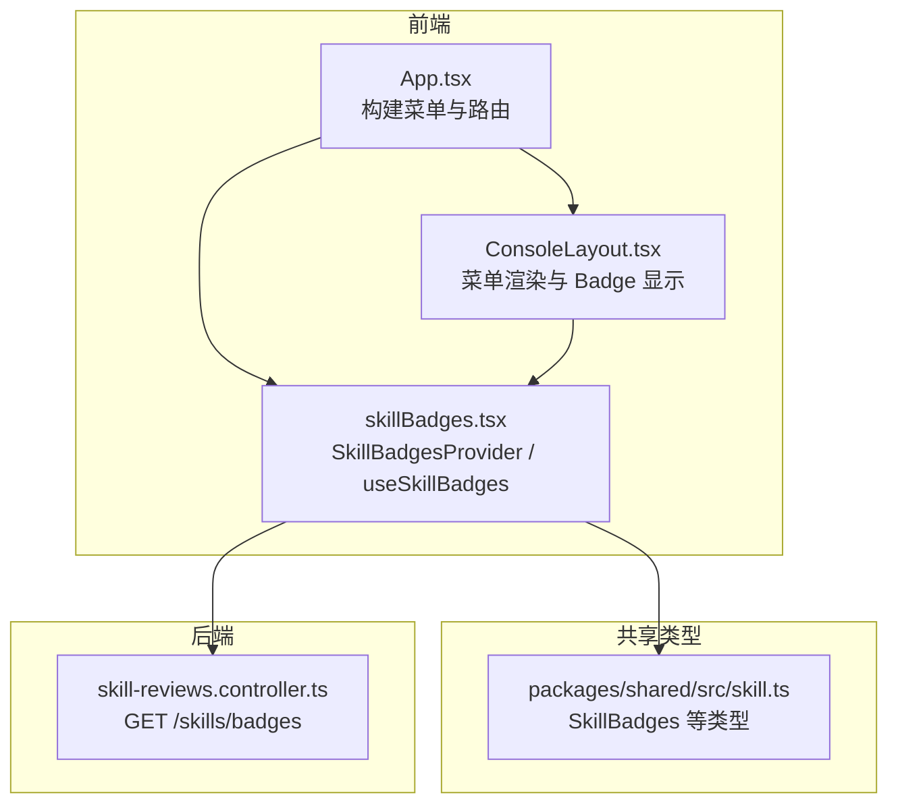
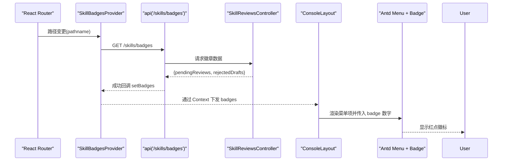
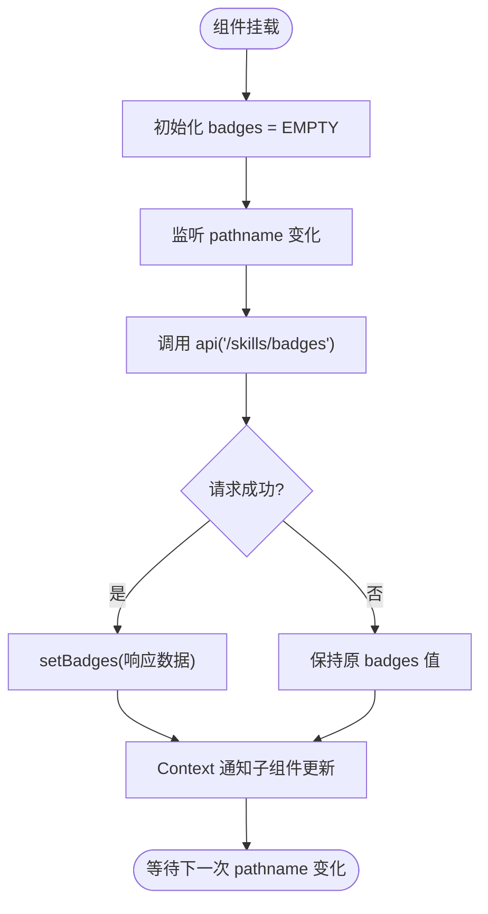
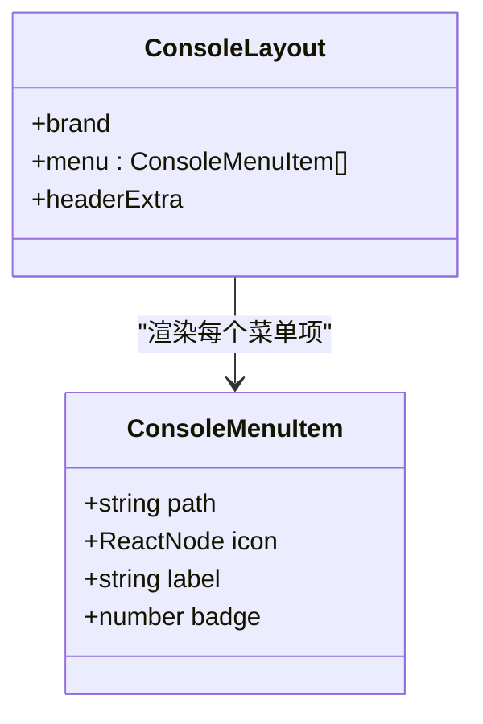
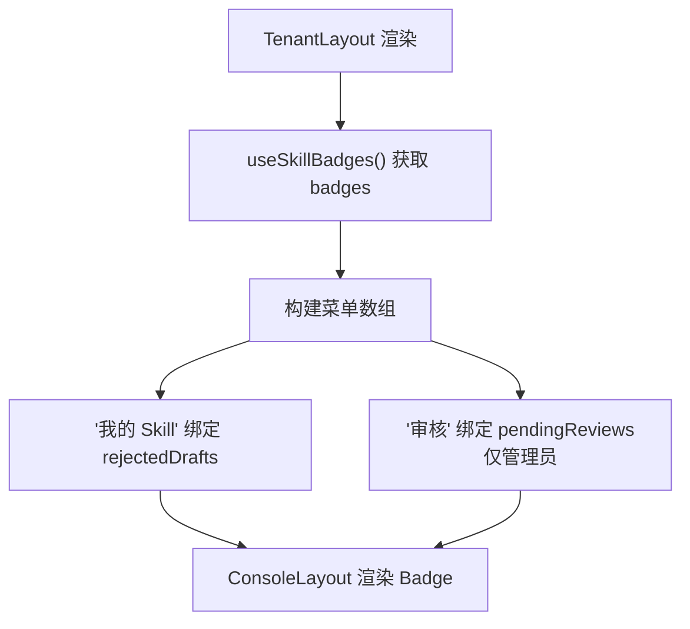
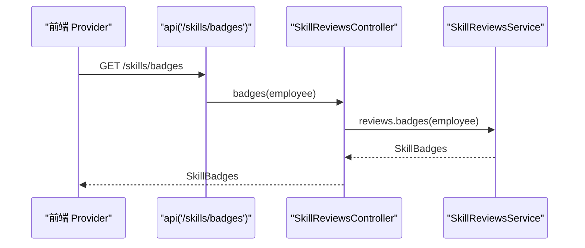
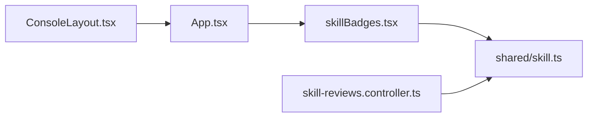

# 技能徽章系统

<cite>
**本文引用的文件**   
- [skillBadges.tsx](file://apps/web/src/skillBadges.tsx)
- [App.tsx](file://apps/web/src/App.tsx)
- [ConsoleLayout.tsx](file://apps/web/src/pages/ConsoleLayout.tsx)
- [skill.ts](file://packages/shared/src/skill.ts)
- [skill-reviews.controller.ts](file://apps/server/src/skills/skill-reviews.controller.ts)
</cite>

## 目录
1. [引言](#引言)
2. [项目结构](#项目结构)
3. [核心组件](#核心组件)
4. [架构总览](#架构总览)
5. [详细组件分析](#详细组件分析)
6. [依赖关系分析](#依赖关系分析)
7. [性能与可用性考虑](#性能与可用性考虑)
8. [故障排查指南](#故障排查指南)
9. [结论](#结论)
10. [附录：使用示例与扩展指南](#附录使用示例与扩展指南)

## 引言
本文件系统化说明“技能徽章系统”的设计与实现。该系统用于在控制台菜单中展示两类红点徽章：
- 管理员待审核数量
- 员工被驳回且尚未处理的草稿数量

徽章数据由前端通过统一上下文提供，并在页面切换或用户操作后自动刷新；后端暴露统一的徽章接口，返回当前租户视角下的计数。文档涵盖设计模式、渲染逻辑、状态管理、类型定义、动态生成机制、条件渲染、使用示例以及扩展方法。

## 项目结构
技能徽章系统横跨前端应用层、共享类型层与服务端控制器层：
- 前端上下文与 Hook：提供徽章数据的获取、缓存与刷新能力
- 控制台布局：将徽章数字渲染到菜单项上
- 路由入口：根据角色注入不同菜单项并绑定对应徽章
- 共享类型：定义徽章数据结构
- 服务端控制器：暴露徽章查询接口

**图表来源**
- [App.tsx:24-37](file://apps/web/src/App.tsx#L24-L37)
- [ConsoleLayout.tsx:8-44](file://apps/web/src/pages/ConsoleLayout.tsx#L8-L44)
- [skillBadges.tsx:1-25](file://apps/web/src/skillBadges.tsx#L1-L25)
- [skill.ts:372-376](file://packages/shared/src/skill.ts#L372-L376)
- [skill-reviews.controller.ts:31-34](file://apps/server/src/skills/skill-reviews.controller.ts#L31-L34)

**章节来源**
- [App.tsx:24-37](file://apps/web/src/App.tsx#L24-L37)
- [ConsoleLayout.tsx:8-44](file://apps/web/src/pages/ConsoleLayout.tsx#L8-L44)
- [skillBadges.tsx:1-25](file://apps/web/src/skillBadges.tsx#L1-L25)
- [skill.ts:372-376](file://packages/shared/src/skill.ts#L372-L376)
- [skill-reviews.controller.ts:31-34](file://apps/server/src/skills/skill-reviews.controller.ts#L31-L34)

## 核心组件
- SkillBadgesProvider：基于 React Context 提供徽章数据与刷新函数，监听路由变化自动拉取，失败时保持原值
- useSkillBadges：Hook，供任意子组件读取 badges 与 refresh
- ConsoleLayout：将 badge 数字渲染为 Ant Design 的 Badge 小圆点
- App：按角色注入菜单项，并将 pendingReviews 与 rejectedDrafts 分别绑定到“审核”和“我的 Skill”菜单
- SkillBadges（类型）：包含 pendingReviews 与 rejectedDrafts 两个字段
- SkillReviewsController：后端 GET /skills/badges 接口，返回当前员工的徽章计数

**章节来源**
- [skillBadges.tsx:1-25](file://apps/web/src/skillBadges.tsx#L1-L25)
- [ConsoleLayout.tsx:8-44](file://apps/web/src/pages/ConsoleLayout.tsx#L8-L44)
- [App.tsx:24-37](file://apps/web/src/App.tsx#L24-L37)
- [skill.ts:372-376](file://packages/shared/src/skill.ts#L372-L376)
- [skill-reviews.controller.ts:31-34](file://apps/server/src/skills/skill-reviews.controller.ts#L31-L34)

## 架构总览
徽章系统的端到端流程如下：
- 前端在应用根包裹 SkillBadgesProvider，初始化空徽章数据
- 路由变化时触发刷新，调用 GET /skills/badges
- 后端控制器返回当前租户下管理员待审核数与员工被驳回草稿数
- 前端更新 Context，ConsoleLayout 渲染菜单项上的 Badge 数字

**图表来源**
- [skillBadges.tsx:14-22](file://apps/web/src/skillBadges.tsx#L14-L22)
- [skill-reviews.controller.ts:31-34](file://apps/server/src/skills/skill-reviews.controller.ts#L31-L34)
- [ConsoleLayout.tsx:30-44](file://apps/web/src/pages/ConsoleLayout.tsx#L30-L44)

## 详细组件分析

### SkillBadgesProvider 与 useSkillBadges
- 职责
  - 维护 badges 状态，初始为空对象
  - 提供 refresh 函数，调用 /skills/badges 并设置状态
  - 监听 pathname 变化，自动刷新徽章
  - 失败时不覆盖已有数据，保证 UI 稳定
- 关键点
  - 使用 React Context 提供 badges 与 refresh
  - 使用 useCallback 稳定 refresh 引用
  - 使用 useEffect 在 pathname 变化时触发刷新

**图表来源**
- [skillBadges.tsx:6-22](file://apps/web/src/skillBadges.tsx#L6-L22)

**章节来源**
- [skillBadges.tsx:1-25](file://apps/web/src/skillBadges.tsx#L1-L25)

### ConsoleLayout 菜单徽章渲染
- 职责
  - 接收 menu 数组，每项可带 badge 数字
  - 使用 Ant Design 的 Badge 组件渲染小圆点
  - 当 badge 为 0 或缺省时不显示
- 关键点
  - ConsoleMenuItem 定义 path、icon、label、badge
  - 菜单项 label 内嵌 NavLink 与 Badge

**图表来源**
- [ConsoleLayout.tsx:8-44](file://apps/web/src/pages/ConsoleLayout.tsx#L8-L44)

**章节来源**
- [ConsoleLayout.tsx:8-44](file://apps/web/src/pages/ConsoleLayout.tsx#L8-L44)

### App 菜单与徽章绑定
- 职责
  - 根据是否为租户管理员，决定菜单项
  - 将 badges.rejectedDrafts 绑定到“我的 Skill”
  - 将 badges.pendingReviews 绑定到“审核”
- 关键点
  - TenantLayout 中使用 useSkillBadges 获取 badges
  - 菜单项通过 badge 属性传递给 ConsoleLayout

**图表来源**
- [App.tsx:24-37](file://apps/web/src/App.tsx#L24-L37)
- [ConsoleLayout.tsx:30-44](file://apps/web/src/pages/ConsoleLayout.tsx#L30-L44)

**章节来源**
- [App.tsx:24-37](file://apps/web/src/App.tsx#L24-L37)
- [ConsoleLayout.tsx:30-44](file://apps/web/src/pages/ConsoleLayout.tsx#L30-L44)

### 后端接口 SkillReviewsController
- 职责
  - 暴露 GET /skills/badges
  - 返回当前员工的徽章计数
- 关键点
  - 控制器注册在 /skills 下，需先于 SkillsController 注册以避免路径冲突
  - 使用 CurrentEmployee 装饰器获取当前员工上下文

**图表来源**
- [skill-reviews.controller.ts:31-34](file://apps/server/src/skills/skill-reviews.controller.ts#L31-L34)

**章节来源**
- [skill-reviews.controller.ts:1-34](file://apps/server/src/skills/skill-reviews.controller.ts#L1-L34)

## 依赖关系分析
- 前端
  - skillBadges.tsx 依赖 shared 类型 SkillBadges
  - App.tsx 依赖 skillBadges.tsx 提供的 Provider 与 Hook
  - ConsoleLayout.tsx 依赖 Ant Design 的 Badge 组件
- 后端
  - skill-reviews.controller.ts 依赖 shared 类型 SkillBadges 与 Service

**图表来源**
- [skillBadges.tsx:1-25](file://apps/web/src/skillBadges.tsx#L1-L25)
- [App.tsx:24-37](file://apps/web/src/App.tsx#L24-L37)
- [ConsoleLayout.tsx:8-44](file://apps/web/src/pages/ConsoleLayout.tsx#L8-L44)
- [skill.ts:372-376](file://packages/shared/src/skill.ts#L372-L376)
- [skill-reviews.controller.ts:31-34](file://apps/server/src/skills/skill-reviews.controller.ts#L31-L34)

**章节来源**
- [skillBadges.tsx:1-25](file://apps/web/src/skillBadges.tsx#L1-L25)
- [App.tsx:24-37](file://apps/web/src/App.tsx#L24-L37)
- [ConsoleLayout.tsx:8-44](file://apps/web/src/pages/ConsoleLayout.tsx#L8-L44)
- [skill.ts:372-376](file://packages/shared/src/skill.ts#L372-L376)
- [skill-reviews.controller.ts:31-34](file://apps/server/src/skills/skill-reviews.controller.ts#L31-L34)

## 性能与可用性考虑
- 网络容错
  - 徽章加载失败时保持原值，避免 UI 闪烁或误清空
- 刷新时机
  - 路由切换时自动刷新，确保他人提交与审核结果及时反映
  - 用户执行相关操作后可主动调用 refresh 立即更新
- 渲染开销
  - 仅在菜单项需要时渲染 Badge，数量为 0 或不传时不显示，减少不必要的 DOM 节点

[本节为通用指导，不涉及具体文件分析]

## 故障排查指南
- 菜单未显示红点
  - 检查是否已包裹 SkillBadgesProvider
  - 确认菜单项是否正确传入 badge 属性
  - 查看浏览器网络面板是否成功请求 /skills/badges
- 红点数值不更新
  - 检查是否在相关操作后调用了 refresh
  - 确认路由变化是否触发了 useEffect 刷新
- 后端返回异常
  - 检查控制器注册顺序，确保 /skills/badges 优先匹配
  - 校验当前员工上下文是否有效

**章节来源**
- [skillBadges.tsx:14-22](file://apps/web/src/skillBadges.tsx#L14-L22)
- [skill-reviews.controller.ts:8-14](file://apps/server/src/skills/skill-reviews.controller.ts#L8-L14)

## 结论
技能徽章系统通过前后端协作，以最小侵入的方式在控制台菜单中呈现关键业务提示。其设计采用 React Context 提供全局状态，结合路由监听与手动刷新，兼顾实时性与稳定性；后端提供简洁的计数接口，便于扩展更多徽章维度。整体方案清晰、易扩展，适合在企业级应用中复用。

[本节为总结性内容，不涉及具体文件分析]

## 附录：使用示例与扩展指南

### 在技能列表中展示不同类型的徽章
- 场景一：在“我的 Skill”菜单显示被驳回草稿数
  - 在 App.tsx 中将 badges.rejectedDrafts 作为“我的 Skill”菜单的 badge
  - ConsoleLayout 渲染该 badge 为小圆点
- 场景二：在“审核”菜单显示待审核数
  - 对租户管理员，将 badges.pendingReviews 作为“审核”菜单的 badge
  - 非管理员不显示该菜单项

参考路径：
- [App.tsx:24-37](file://apps/web/src/App.tsx#L24-L37)
- [ConsoleLayout.tsx:30-44](file://apps/web/src/pages/ConsoleLayout.tsx#L30-L44)

### 自定义徽章样式与主题适配
- 样式定制
  - 通过 ConsoleLayout 中的 Ant Design Badge 组件进行尺寸与显示控制
  - 当 badge 为 0 或缺省时不显示，避免多余视觉元素
- 主题适配
  - 使用 Ant Design 默认主题即可；如需深色模式，可在上层应用配置主题
- 扩展新徽章类型
  - 在 shared 类型中扩展 SkillBadges，新增字段
  - 在后端控制器中计算并返回新字段
  - 在前端 Provider 中透传新字段，并在菜单或页面中按需渲染

参考路径：
- [skill.ts:372-376](file://packages/shared/src/skill.ts#L372-L376)
- [skill-reviews.controller.ts:31-34](file://apps/server/src/skills/skill-reviews.controller.ts#L31-L34)
- [ConsoleLayout.tsx:30-44](file://apps/web/src/pages/ConsoleLayout.tsx#L30-L44)