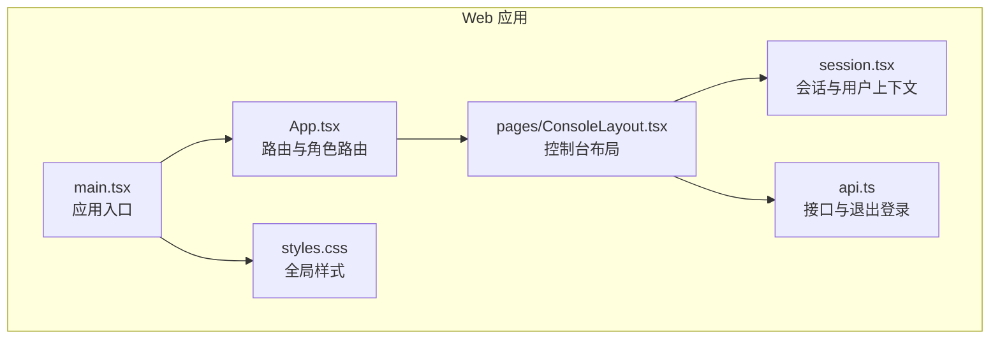
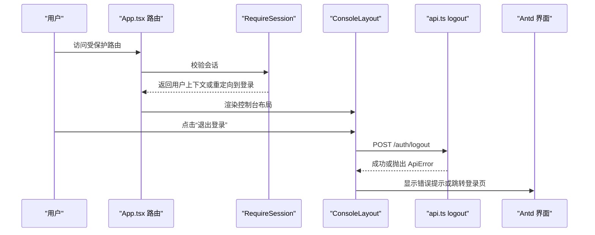
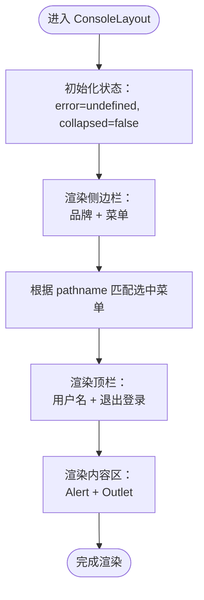
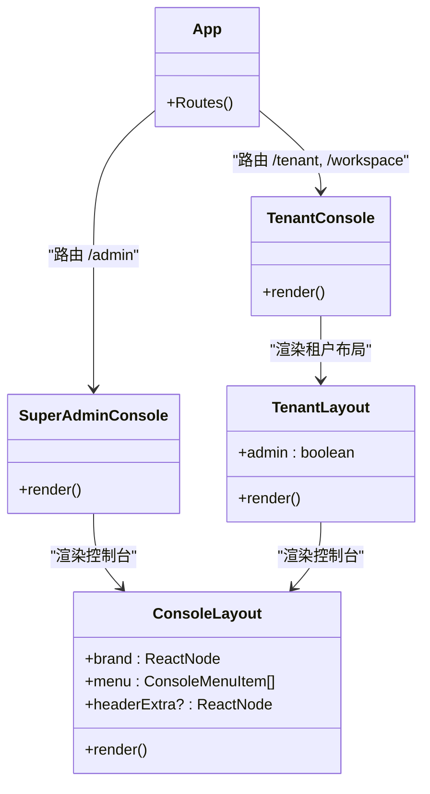
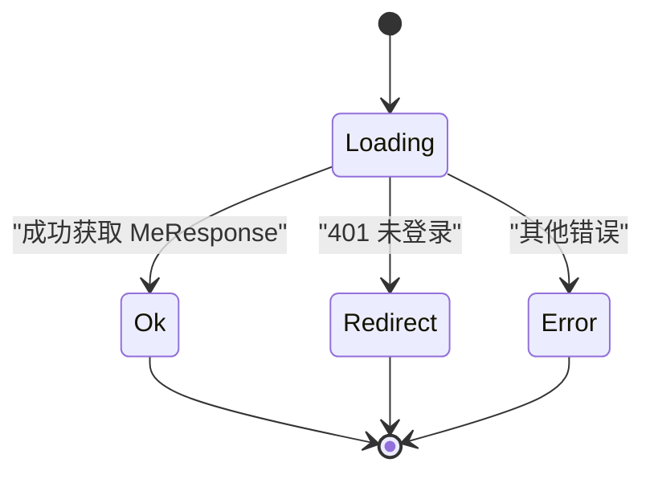
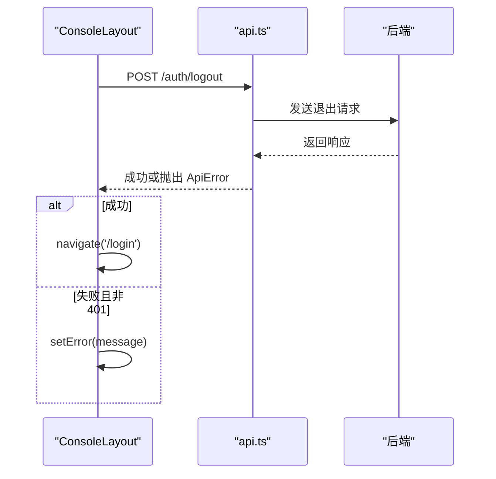
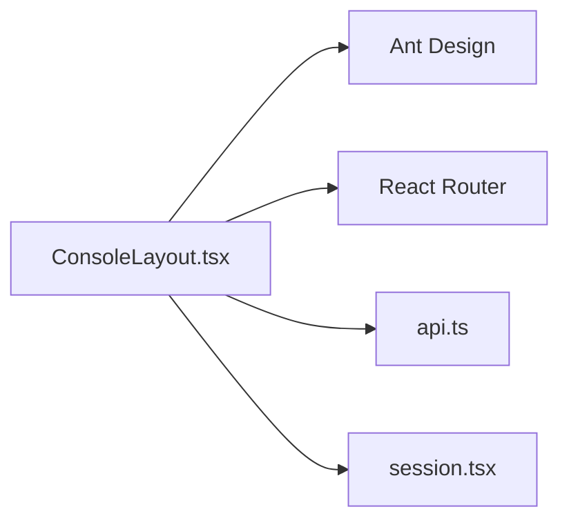
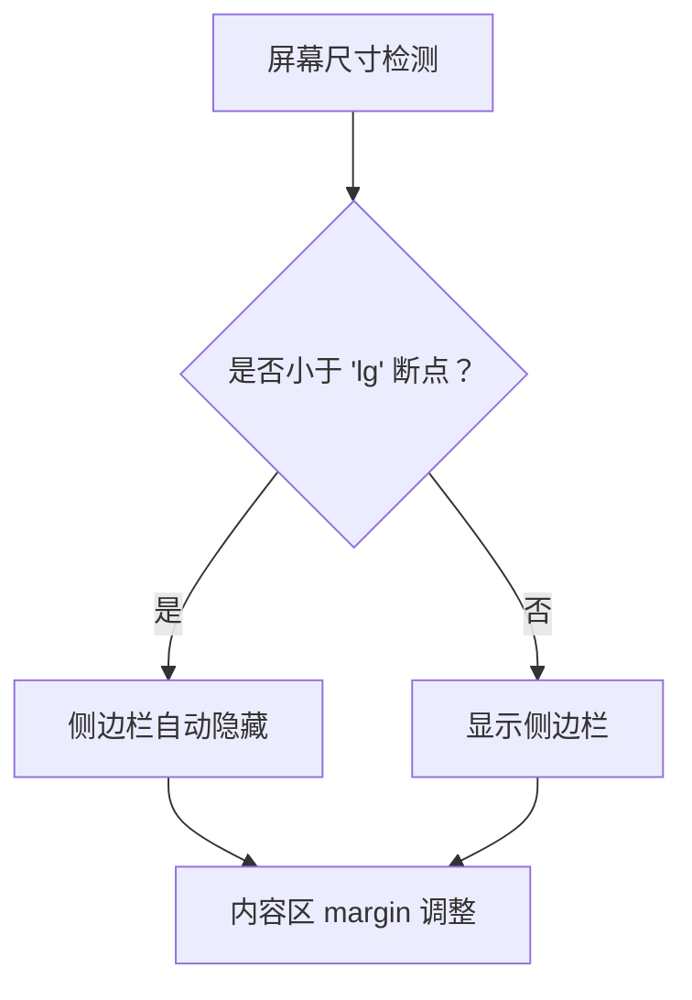

# 控制台布局组件

<cite>
**本文引用的文件**   
- [ConsoleLayout.tsx](file://apps/web/src/pages/ConsoleLayout.tsx)
- [App.tsx](file://apps/web/src/App.tsx)
- [main.tsx](file://apps/web/src/main.tsx)
- [session.tsx](file://apps/web/src/session.tsx)
- [api.ts](file://apps/web/src/api.ts)
- [styles.css](file://apps/web/src/styles.css)
</cite>

## 目录
1. [简介](#简介)
2. [项目结构](#项目结构)
3. [核心组件](#核心组件)
4. [架构总览](#架构总览)
5. [详细组件分析](#详细组件分析)
6. [依赖关系分析](#依赖关系分析)
7. [性能与可访问性](#性能与可访问性)
8. [响应式与移动端适配](#响应式与移动端适配)
9. [使用示例与集成指南](#使用示例与集成指南)
10. [样式定制与主题扩展](#样式定制与主题扩展)
11. [故障排查](#故障排查)
12. [结论](#结论)

## 简介
本文件面向 ConsoleLayout 控制台布局组件，系统性说明其布局结构、导航菜单实现、页面容器能力、属性配置项（侧边栏状态、路由集成、用户权限）、响应式适配机制，以及在不同业务页面中的集成方式。同时提供样式定制与主题扩展建议，帮助开发者快速构建一致的控制台体验。

## 项目结构
ConsoleLayout 位于前端应用 apps/web 中，作为控制台外壳，统一承载侧边栏导航、顶部操作区与页面内容区域。路由与权限在 App.tsx 中集中管理，会话与用户信息通过 session.tsx 暴露，API 调用封装在 api.ts 中。

**图表来源**
- [main.tsx:8-16](file://apps/web/src/main.tsx#L8-L16)
- [App.tsx:39-65](file://apps/web/src/App.tsx#L39-L65)
- [ConsoleLayout.tsx:17-65](file://apps/web/src/pages/ConsoleLayout.tsx#L17-L65)
- [session.tsx:40-67](file://apps/web/src/session.tsx#L40-L67)
- [api.ts:33-41](file://apps/web/src/api.ts#L33-L41)
- [styles.css:1-1](file://apps/web/src/styles.css#L1-L1)

**章节来源**
- [main.tsx:1-17](file://apps/web/src/main.tsx#L1-L17)
- [App.tsx:1-66](file://apps/web/src/App.tsx#L1-L66)
- [ConsoleLayout.tsx:1-66](file://apps/web/src/pages/ConsoleLayout.tsx#L1-L66)
- [session.tsx:1-68](file://apps/web/src/session.tsx#L1-L68)
- [api.ts:1-42](file://apps/web/src/api.ts#L1-L42)
- [styles.css:1-1](file://apps/web/src/styles.css#L1-L1)

## 核心组件
ConsoleLayout 是控制台外壳组件，负责：
- 渲染 Ant Design Layout 的 Sider（侧边栏）与 Header（顶栏）、Content（内容区）。
- 根据当前路由高亮对应菜单项，支持 Badge 红点提示。
- 展示当前用户昵称并提供“退出登录”按钮。
- 通过 Outlet 渲染子路由页面。
- 处理本地错误提示与侧边栏折叠状态。

关键类型与属性：
- ConsoleMenuItem：定义菜单项 path、icon、label、badge。
- ConsoleLayout 属性：brand（品牌标识）、menu（菜单数组）、headerExtra（顶栏额外内容）。

**章节来源**
- [ConsoleLayout.tsx:8-14](file://apps/web/src/pages/ConsoleLayout.tsx#L8-L14)
- [ConsoleLayout.tsx:17-65](file://apps/web/src/pages/ConsoleLayout.tsx#L17-L65)

## 架构总览
ConsoleLayout 与路由、会话、API 的关系如下：
- 路由层：App.tsx 定义 /admin、/tenant、/workspace 等路由，并在受保护路由中使用 RequireSession。
- 会话层：RequireSession 获取 MeResponse，暴露 useCurrentUser、useCurrentEmployee 等 Hook。
- API 层：logout 调用后端接口，成功后跳转到登录页；ConsoleLayout 捕获异常并显示 Alert。

**图表来源**
- [App.tsx:39-65](file://apps/web/src/App.tsx#L39-L65)
- [session.tsx:40-67](file://apps/web/src/session.tsx#L40-L67)
- [ConsoleLayout.tsx:53-55](file://apps/web/src/pages/ConsoleLayout.tsx#L53-L55)
- [api.ts:33-36](file://apps/web/src/api.ts#L33-L36)

## 详细组件分析

### ConsoleLayout 组件
职责与行为：
- 侧边栏：
  - 使用 Ant Design Layout.Sider，设置 breakpoint="lg"，collapsedWidth={0}，支持 onCollapse 控制 collapsed 状态。
  - 未折叠时渲染品牌名与 Menu 列表；选中项基于 pathname.startsWith(m.path) 匹配。
  - 每个菜单项使用 NavLink 进行路由跳转，支持 Badge 红点。
- 顶栏：
  - 右侧展示 headerExtra（可选）、当前用户昵称、退出登录按钮。
  - 退出登录调用 api.logout，成功后 navigate('/login', { replace: true })，失败则设置 error 并通过 Alert 展示。
- 内容区：
  - 根据 collapsed 调整 margin，确保内容自适应。
  - 使用 Outlet 渲染子路由页面。

数据结构与复杂度：
- menu 为数组，selectedKeys 计算为 O(n)，n 为菜单项数量。
- 状态包括 error、collapsed，均为轻量级字符串/布尔值。

错误处理：
- 本地错误通过 useState<string>() 管理，Alert 可关闭。
- 退出登录失败时捕获 ApiError 并展示消息。

**图表来源**
- [ConsoleLayout.tsx:25-63](file://apps/web/src/pages/ConsoleLayout.tsx#L25-L63)

**章节来源**
- [ConsoleLayout.tsx:17-65](file://apps/web/src/pages/ConsoleLayout.tsx#L17-L65)

### 路由与权限集成（App.tsx）
- 根路由包含 /login、/skills/review/:versionId、/admin、/tenant、/workspace 等。
- 所有受保护路由包裹 RequireSession，未登录自动重定向到登录页。
- SuperAdminConsole 仅对超管可见，TenantConsole 根据员工身份与租户状态决定展示。
- TenantLayout 根据 admin 标志动态生成菜单，并注入 SkillBadgesProvider 以提供徽章数据。

**图表来源**
- [App.tsx:13-38](file://apps/web/src/App.tsx#L13-L38)
- [App.tsx:39-65](file://apps/web/src/App.tsx#L39-L65)
- [ConsoleLayout.tsx:17-65](file://apps/web/src/pages/ConsoleLayout.tsx#L17-L65)

**章节来源**
- [App.tsx:1-66](file://apps/web/src/App.tsx#L1-L66)

### 会话与用户上下文（session.tsx）
- RequireSession 负责加载 /auth/me，处理 loading、redirect、error 三种状态。
- 暴露 useMe、useSetMe、useCurrentUser、useCurrentEmployee 等 Hook。
- 在 StrictMode 下避免重复请求导致的回跳问题，使用 cancelled 标记丢弃过期结果。

**图表来源**
- [session.tsx:40-67](file://apps/web/src/session.tsx#L40-L67)

**章节来源**
- [session.tsx:1-68](file://apps/web/src/session.tsx#L1-L68)

### API 与退出流程（api.ts）
- api 函数统一封装 fetch，非 2xx 抛 ApiError，携带 status、message、code、body。
- logout 调用 /auth/logout，忽略 401 错误（已失效会话），保证本地导航安全。
- safeNext 限制登录回跳路径，防止开放重定向。

**图表来源**
- [ConsoleLayout.tsx:53-55](file://apps/web/src/pages/ConsoleLayout.tsx#L53-L55)
- [api.ts:33-41](file://apps/web/src/api.ts#L33-L41)

**章节来源**
- [api.ts:1-42](file://apps/web/src/api.ts#L1-L42)

## 依赖关系分析
ConsoleLayout 依赖：
- Ant Design 组件：Layout、Menu、Badge、Button、Alert、Space。
- React Router：NavLink、Outlet、useLocation、useNavigate。
- 应用模块：../api（logout）、../session（useCurrentUser）。

**图表来源**
- [ConsoleLayout.tsx:1-6](file://apps/web/src/pages/ConsoleLayout.tsx#L1-L6)

**章节来源**
- [ConsoleLayout.tsx:1-6](file://apps/web/src/pages/ConsoleLayout.tsx#L1-L6)

## 性能与可访问性
- 菜单选中计算为 O(n)，n 通常较小，性能影响可忽略。
- 侧边栏折叠状态由 React state 管理，无额外副作用。
- 使用 data-testid 便于测试定位（如 current-user、menu-badge-*）。
- 建议为图标和按钮添加 aria-label 以提升可访问性（当前未显式设置）。

[本节为通用指导，不直接分析具体文件]

## 响应式与移动端适配
- 侧边栏使用 Ant Design Layout.Sider 的 breakpoint="lg"，在小于 lg 断点时自动隐藏。
- collapsedWidth={0} 确保折叠后宽度为零，避免占位。
- 内容区 margin 随 collapsed 变化，保持视觉平衡。
- 可通过 CSS 媒体查询进一步微调小屏下的间距与字号。

**图表来源**
- [ConsoleLayout.tsx:27-28](file://apps/web/src/pages/ConsoleLayout.tsx#L27-L28)
- [ConsoleLayout.tsx:58-61](file://apps/web/src/pages/ConsoleLayout.tsx#L58-L61)

**章节来源**
- [ConsoleLayout.tsx:25-63](file://apps/web/src/pages/ConsoleLayout.tsx#L25-L63)

## 使用示例与集成指南

### 在 App.tsx 中集成
- 定义路由并使用 RequireSession 保护。
- 根据用户角色渲染 SuperAdminConsole 或 TenantConsole。
- TenantLayout 动态构建 menu 数组，传入 ConsoleLayout。

参考路径：
- [App.tsx:13-38](file://apps/web/src/App.tsx#L13-L38)
- [App.tsx:39-65](file://apps/web/src/App.tsx#L39-L65)

### 在业务页面中使用
- 业务页面无需关心布局细节，只需作为子路由被 Outlet 渲染。
- 如需在顶栏增加额外操作，可通过 headerExtra 属性注入。

参考路径：
- [ConsoleLayout.tsx:49-56](file://apps/web/src/pages/ConsoleLayout.tsx#L49-L56)

### 菜单与徽章
- 通过 ConsoleMenuItem.badge 显示红点，例如待审核数量、被拒草稿数。
- 徽章数据可由 SkillBadgesProvider 提供，结合 useSkillBadges 获取。

参考路径：
- [App.tsx:30-37](file://apps/web/src/App.tsx#L30-L37)
- [ConsoleLayout.tsx:33-44](file://apps/web/src/pages/ConsoleLayout.tsx#L33-L44)

**章节来源**
- [App.tsx:13-38](file://apps/web/src/App.tsx#L13-L38)
- [ConsoleLayout.tsx:33-44](file://apps/web/src/pages/ConsoleLayout.tsx#L33-L44)

## 样式定制与主题扩展
- 全局样式：styles.css 仅重置 body margin，可在该文件中扩展基础样式。
- 主题配置：main.tsx 使用 ConfigProvider 设置 antd 语言为 zh_CN，可在此扩展主题 token、颜色、字体等。
- 组件内样式：ConsoleLayout 使用内联 style 控制布局与间距，建议抽取为 CSS 类以便复用与主题化。

建议：
- 将侧边栏与顶栏的内联样式迁移至 styles.css，便于维护。
- 使用 antd ConfigProvider 的 theme 属性覆盖默认色板，实现品牌主题。

参考路径：
- [styles.css:1-1](file://apps/web/src/styles.css#L1-L1)
- [main.tsx:1-16](file://apps/web/src/main.tsx#L1-L16)
- [ConsoleLayout.tsx:25-63](file://apps/web/src/pages/ConsoleLayout.tsx#L25-L63)

**章节来源**
- [styles.css:1-1](file://apps/web/src/styles.css#L1-L1)
- [main.tsx:1-16](file://apps/web/src/main.tsx#L1-L16)
- [ConsoleLayout.tsx:25-63](file://apps/web/src/pages/ConsoleLayout.tsx#L25-L63)

## 故障排查
常见问题与解决思路：
- 退出登录后仍停留在原页面：检查 api.logout 是否正确调用，确认 navigate('/login', { replace: true }) 执行。
- 菜单未高亮：确认 pathname.startsWith(m.path) 逻辑是否符合预期，必要时调整为精确匹配。
- 侧边栏在小屏未隐藏：检查 breakpoint 配置是否为 "lg"，并确保父容器宽度正确。
- 用户昵称未显示：确认 RequireSession 已成功加载 MeResponse，useCurrentUser 可用。

参考路径：
- [ConsoleLayout.tsx:53-55](file://apps/web/src/pages/ConsoleLayout.tsx#L53-L55)
- [ConsoleLayout.tsx:32-33](file://apps/web/src/pages/ConsoleLayout.tsx#L32-L33)
- [ConsoleLayout.tsx:27-28](file://apps/web/src/pages/ConsoleLayout.tsx#L27-L28)
- [session.tsx:24-32](file://apps/web/src/session.tsx#L24-L32)

**章节来源**
- [ConsoleLayout.tsx:27-63](file://apps/web/src/pages/ConsoleLayout.tsx#L27-L63)
- [session.tsx:24-32](file://apps/web/src/session.tsx#L24-L32)

## 结论
ConsoleLayout 提供了统一的控制台外壳，结合 App.tsx 的路由与权限控制、session.tsx 的会话管理、api.ts 的接口封装，形成完整的控制台体验。其响应式布局、菜单高亮、徽章提示与错误处理均具备良好可扩展性。通过样式与主题定制，可快速适配不同品牌与业务场景。