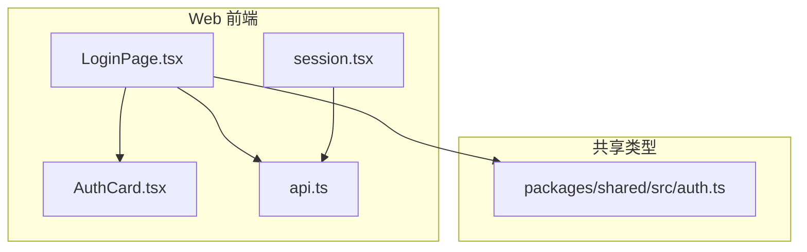
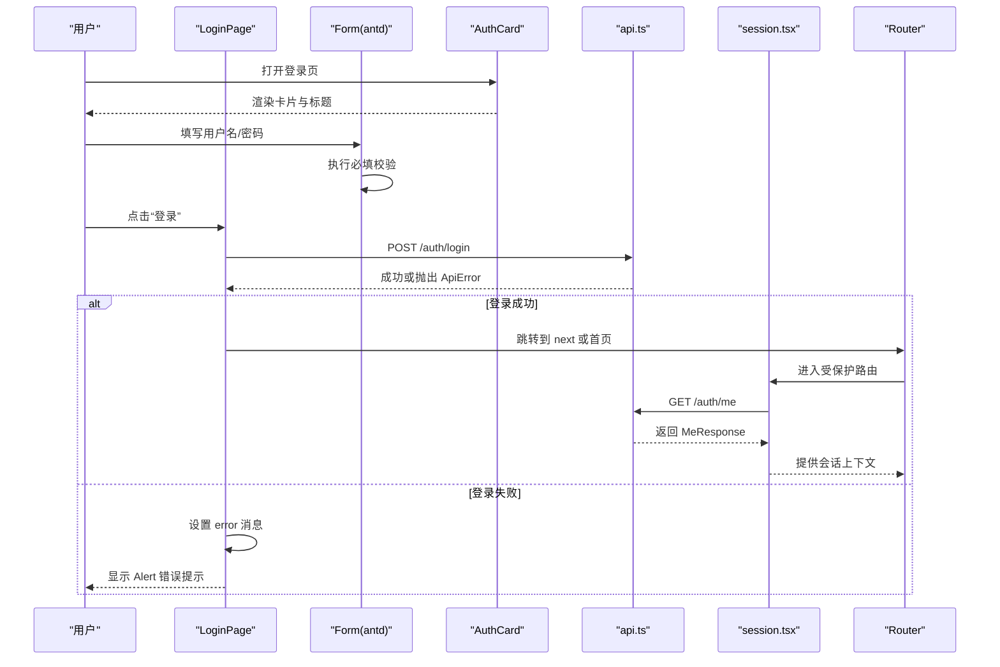
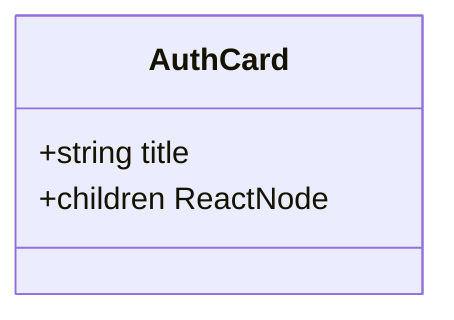
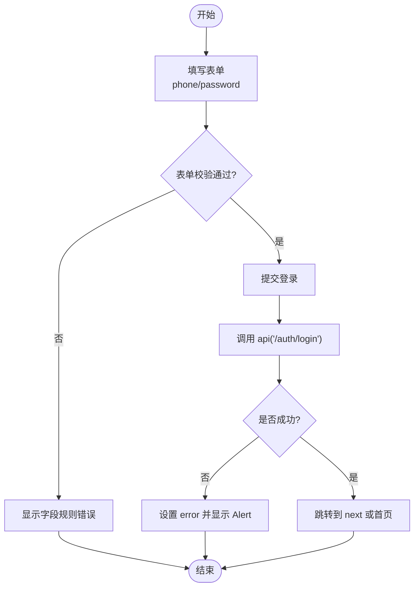
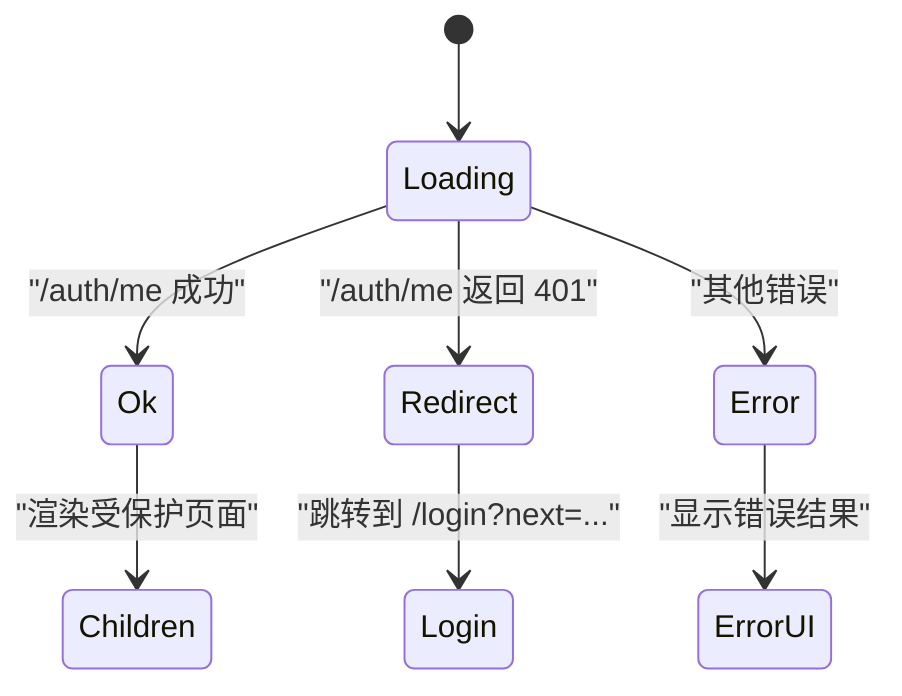
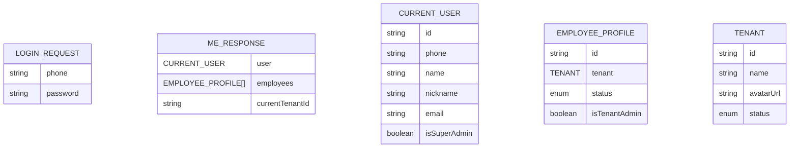
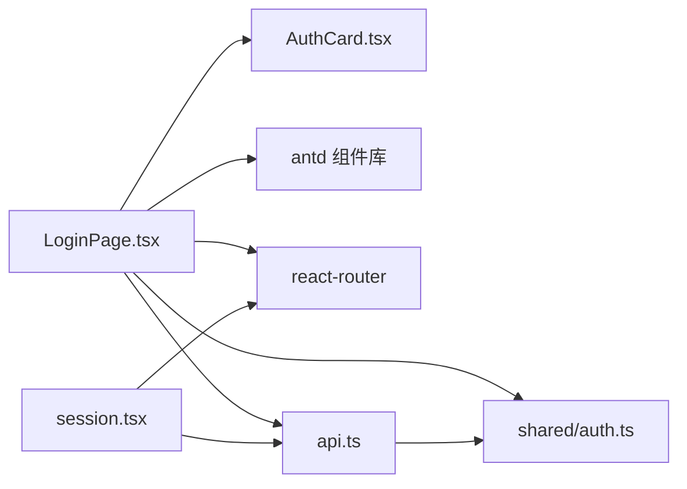

# 认证卡片组件

<cite>
**本文引用的文件**   
- [AuthCard.tsx](file://apps/web/src/pages/AuthCard.tsx)
- [LoginPage.tsx](file://apps/web/src/pages/LoginPage.tsx)
- [session.tsx](file://apps/web/src/session.tsx)
- [api.ts](file://apps/web/src/api.ts)
- [auth.ts](file://packages/shared/src/auth.ts)
</cite>

## 目录
1. [简介](#简介)
2. [项目结构](#项目结构)
3. [核心组件](#核心组件)
4. [架构总览](#架构总览)
5. [详细组件分析](#详细组件分析)
6. [依赖关系分析](#依赖关系分析)
7. [性能与可访问性](#性能与可访问性)
8. [故障排查指南](#故障排查指南)
9. [结论](#结论)
10. [附录：使用示例与扩展](#附录使用示例与扩展)

## 简介
本文件围绕认证卡片组件 AuthCard 及其在登录流程中的协作方式，提供一份面向前端开发与产品实现的技术文档。内容涵盖：
- AuthCard 的布局职责、属性接口与样式定制点
- 表单验证、用户输入处理与错误提示机制
- 会话状态管理与登录流程集成
- 如何自定义表单字段与接入不同认证方式
- 可访问性与样式扩展建议

## 项目结构
认证相关的前端代码主要位于 web 应用下：
- 页面层：AuthCard.tsx、LoginPage.tsx
- 会话与会话守卫：session.tsx
- API 封装与安全跳转：api.ts
- 共享类型定义：packages/shared/src/auth.ts

图表来源
- [LoginPage.tsx:1-41](file://apps/web/src/pages/LoginPage.tsx#L1-L41)
- [AuthCard.tsx:1-17](file://apps/web/src/pages/AuthCard.tsx#L1-L17)
- [session.tsx:1-68](file://apps/web/src/session.tsx#L1-L68)
- [api.ts:1-42](file://apps/web/src/api.ts#L1-L42)
- [auth.ts:1-39](file://packages/shared/src/auth.ts#L1-L39)

章节来源
- [LoginPage.tsx:1-41](file://apps/web/src/pages/LoginPage.tsx#L1-L41)
- [AuthCard.tsx:1-17](file://apps/web/src/pages/AuthCard.tsx#L1-L17)
- [session.tsx:1-68](file://apps/web/src/session.tsx#L1-L68)
- [api.ts:1-42](file://apps/web/src/api.ts#L1-L42)
- [auth.ts:1-39](file://packages/shared/src/auth.ts#L1-L39)

## 核心组件
- AuthCard：负责登录页居中卡片布局与标题展示，不关心业务逻辑。
- LoginPage：承载登录表单、演示账号快捷填充、表单校验、提交与错误提示，并调用后端登录接口。
- session.tsx：提供会话上下文、当前用户钩子与会话守卫 RequireSession，用于路由级鉴权。
- api.ts：统一 HTTP 请求封装、错误类 ApiError、安全 next 参数校验与登出流程。
- auth.ts：登录请求/响应、当前用户、员工档案与会话返回类型的共享定义。

章节来源
- [AuthCard.tsx:1-17](file://apps/web/src/pages/AuthCard.tsx#L1-L17)
- [LoginPage.tsx:1-41](file://apps/web/src/pages/LoginPage.tsx#L1-L41)
- [session.tsx:1-68](file://apps/web/src/session.tsx#L1-L68)
- [api.ts:1-42](file://apps/web/src/api.ts#L1-L42)
- [auth.ts:1-39](file://packages/shared/src/auth.ts#L1-L39)

## 架构总览
下图展示了从用户交互到会话建立的完整流程，以及各模块的职责边界。

图表来源
- [LoginPage.tsx:18-39](file://apps/web/src/pages/LoginPage.tsx#L18-L39)
- [api.ts:15-31](file://apps/web/src/api.ts#L15-L31)
- [session.tsx:40-67](file://apps/web/src/session.tsx#L40-L67)

## 详细组件分析

### AuthCard 组件
- 职责：提供居中的卡片容器与标题区域，将业务表单作为 children 注入。
- 属性接口：
  - title：字符串，卡片标题文本
  - children：ReactNode，承载具体表单内容
- 样式要点：
  - 外层 Layout 控制全屏居中与内边距
  - Card 宽度自适应且限制最大宽度
  - 标题使用 Typography.Title 居中显示
- 可访问性：
  - 标题层级合理，便于屏幕阅读器识别
  - 通过 children 透传表单控件，保持语义化结构

图表来源
- [AuthCard.tsx:5-16](file://apps/web/src/pages/AuthCard.tsx#L5-L16)

章节来源
- [AuthCard.tsx:1-17](file://apps/web/src/pages/AuthCard.tsx#L1-L17)

### LoginPage 登录表单与错误提示
- 表单字段：
  - phone：用户名（手机号），必填
  - password：密码，必填
- 表单校验：
  - 使用 antd Form 的 rules 进行必填校验
  - requiredMark=false，关闭默认必填标记
- 用户输入处理：
  - 演示账号按钮一键填充 phone/password，并清空错误
  - 提交时先清空错误，再发起登录请求
- 错误提示机制：
  - 捕获 ApiError.message 并在 Alert 中展示
  - 提交过程中 loading 状态控制按钮禁用
- 登录成功后：
  - 根据 safeNext 解析 next 参数，优先跳转到目标地址，否则返回首页

图表来源
- [LoginPage.tsx:12-39](file://apps/web/src/pages/LoginPage.tsx#L12-L39)
- [api.ts:15-31](file://apps/web/src/api.ts#L15-L31)

章节来源
- [LoginPage.tsx:1-41](file://apps/web/src/pages/LoginPage.tsx#L1-L41)
- [api.ts:15-31](file://apps/web/src/api.ts#L15-L31)

### 会话状态管理与登录流程集成
- 会话守卫 RequireSession：
  - 首次加载调用 /auth/me 获取 MeResponse
  - 未登录（401）自动重定向到 /login?next=...
  - 提供 useMe/useCurrentUser/useCurrentEmployee 等钩子
- 登录完成后：
  - 浏览器 Cookie 携带会话标识，后续请求由服务端校验
  - 进入受保护路由后，RequireSession 会刷新会话上下文

图表来源
- [session.tsx:40-67](file://apps/web/src/session.tsx#L40-L67)

章节来源
- [session.tsx:1-68](file://apps/web/src/session.tsx#L1-L68)

### 数据模型与类型契约
- LoginRequest：包含 phone 与 password
- LoginResponse：登录成功标志
- MeResponse：包含 user、employees、currentTenantId
- CurrentUser：当前用户基本信息与权限标记
- EmployeeProfile：租户下的员工档案与状态

图表来源
- [auth.ts:1-39](file://packages/shared/src/auth.ts#L1-L39)

章节来源
- [auth.ts:1-39](file://packages/shared/src/auth.ts#L1-L39)

## 依赖关系分析
- LoginPage 依赖：
  - AuthCard：布局容器
  - antd：Form/Input/Button/Alert 等 UI 组件
  - react-router：useNavigate、useSearchParams
  - api：发送登录请求与安全 next 校验
  - shared.auth：LoginRequest 类型
- session.tsx 依赖：
  - api：获取 /auth/me 与会话信息
  - react-router：Navigate 重定向
- api.ts 依赖：
  - shared.auth：ApiErrorBody 类型

图表来源
- [LoginPage.tsx:1-41](file://apps/web/src/pages/LoginPage.tsx#L1-L41)
- [AuthCard.tsx:1-17](file://apps/web/src/pages/AuthCard.tsx#L1-L17)
- [session.tsx:1-68](file://apps/web/src/session.tsx#L1-L68)
- [api.ts:1-42](file://apps/web/src/api.ts#L1-L42)
- [auth.ts:1-39](file://packages/shared/src/auth.ts#L1-L39)

章节来源
- [LoginPage.tsx:1-41](file://apps/web/src/pages/LoginPage.tsx#L1-L41)
- [AuthCard.tsx:1-17](file://apps/web/src/pages/AuthCard.tsx#L1-L17)
- [session.tsx:1-68](file://apps/web/src/session.tsx#L1-L68)
- [api.ts:1-42](file://apps/web/src/api.ts#L1-L42)
- [auth.ts:1-39](file://packages/shared/src/auth.ts#L1-L39)

## 性能与可访问性
- 性能
  - AuthCard 为纯展示组件，无额外计算开销
  - LoginPage 仅在提交时发起网络请求，避免频繁渲染
  - RequireSession 在挂载时仅一次请求 /auth/me，并通过取消标记避免竞态
- 可访问性
  - 表单字段具备 label 与 autoComplete 属性，提升辅助技术体验
  - 标题层级清晰，利于屏幕阅读器导航
  - 错误提示使用 Alert，具有明确的视觉与语义标识

[本节为通用指导，不涉及具体文件分析]

## 故障排查指南
- 登录失败
  - 检查 ApiError.message 是否正确回显
  - 确认后端 /auth/login 返回的 message/code 是否符合预期
- 登录后仍被重定向到登录页
  - 检查 /auth/me 是否返回 401
  - 确认 Cookie 是否携带会话标识
- 跳转异常
  - 检查 next 参数是否被 safeNext 过滤
  - 确保 next 以允许的域名前缀开头且不包含非法字符

章节来源
- [api.ts:15-41](file://apps/web/src/api.ts#L15-L41)
- [session.tsx:40-67](file://apps/web/src/session.tsx#L40-L67)

## 结论
AuthCard 作为登录页面的布局容器，职责清晰、结构简单；LoginPage 在其内部完成表单校验、用户输入处理与错误提示，并与 api.ts 和 session.tsx 协同完成登录与会话管理。整体设计解耦良好，易于扩展新的认证方式与表单字段。

[本节为总结性内容，不涉及具体文件分析]

## 附录：使用示例与扩展

### 自定义表单字段
- 在 LoginPage 的 Form 中添加新的 Form.Item，配置 name、label、rules
- 如需异步校验，可在 rules 中增加 validator 函数
- 提交时，onFinish 会将所有字段值一并发送至后端

章节来源
- [LoginPage.tsx:34-38](file://apps/web/src/pages/LoginPage.tsx#L34-L38)

### 集成不同的认证方式
- 若需支持邮箱登录，可在 LoginRequest 中新增 email 字段，并在 LoginPage 中增加对应输入项与校验规则
- 若需第三方登录，可在 LoginPage 中添加第三方登录入口，调用相应 OAuth 流程后再触发本地登录或直跳回调

章节来源
- [auth.ts:1-39](file://packages/shared/src/auth.ts#L1-L39)
- [LoginPage.tsx:12-39](file://apps/web/src/pages/LoginPage.tsx#L12-L39)

### 样式定制选项
- 调整 AuthCard 的 Card 宽度：修改 maxWidth 或 width
- 调整标题样式：修改 Typography.Title 的 level 或 style
- 全局主题：通过 antd ConfigProvider 覆盖主题变量

章节来源
- [AuthCard.tsx:7-13](file://apps/web/src/pages/AuthCard.tsx#L7-L13)

### 可访问性支持说明
- 为新增字段添加合适的 label 与 aria-* 属性
- 对动态错误提示使用 Alert 并保持语义正确
- 键盘操作：确保表单可通过 Tab 顺序导航，Enter 提交

章节来源
- [LoginPage.tsx:34-38](file://apps/web/src/pages/LoginPage.tsx#L34-L38)