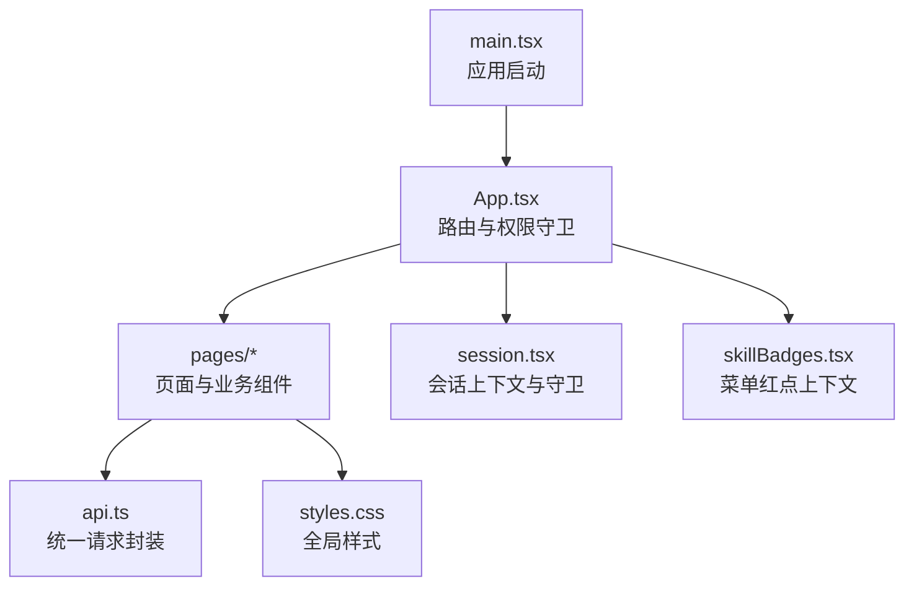
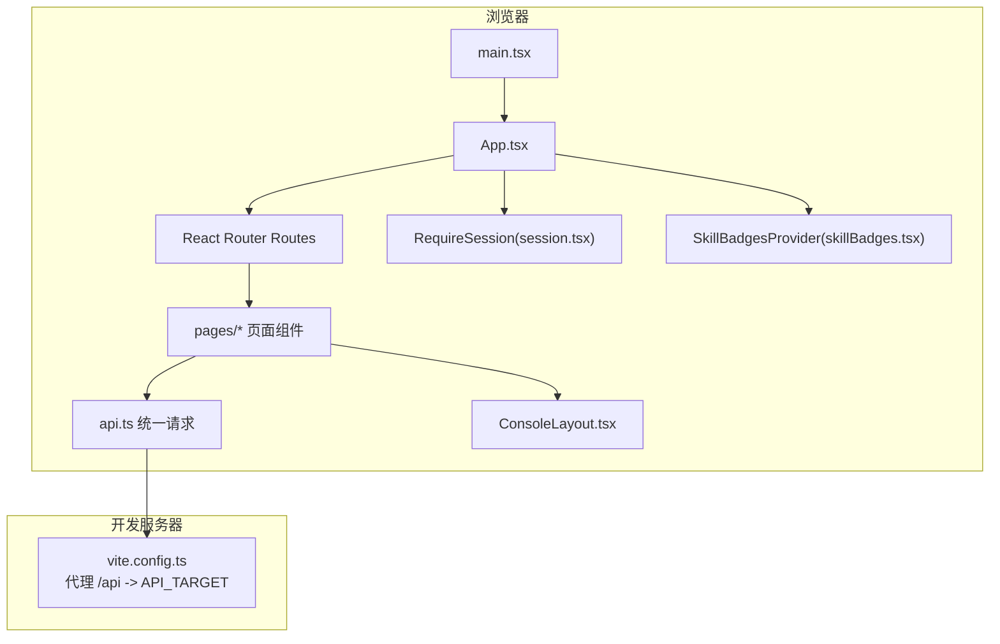
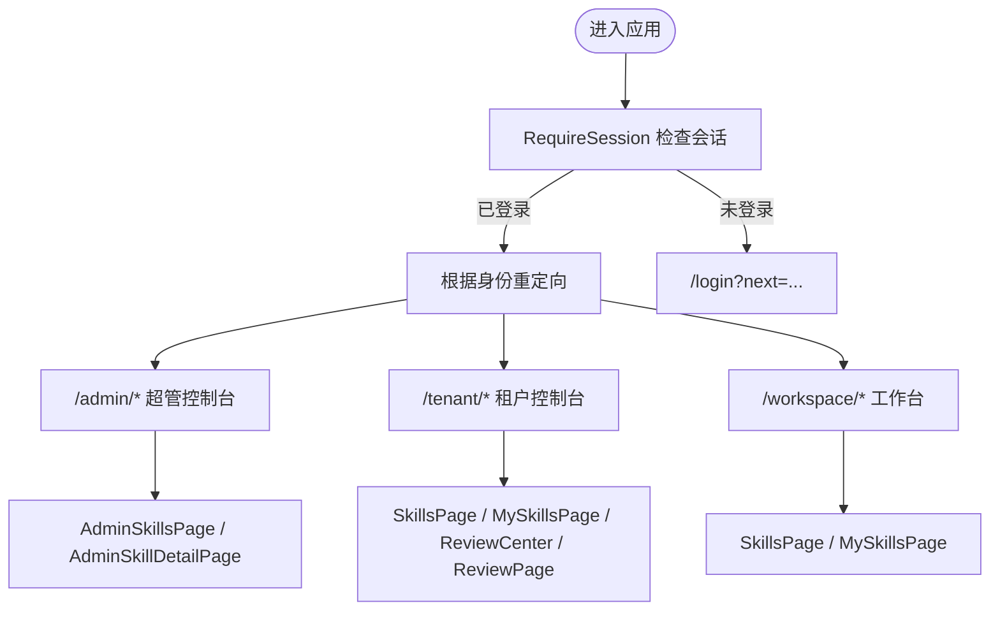
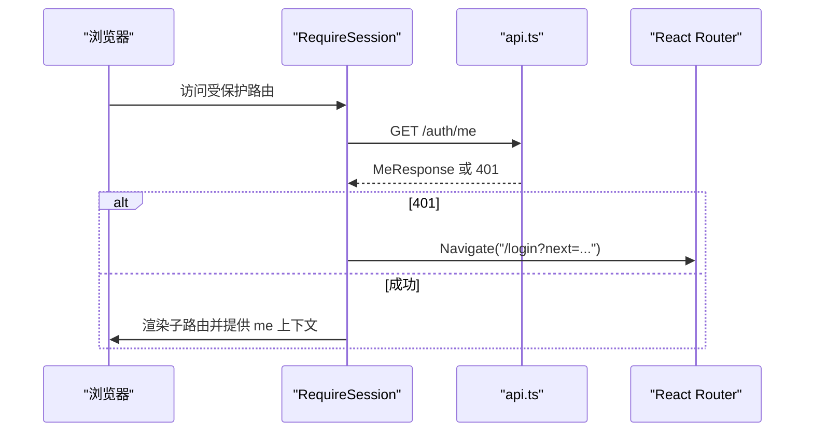
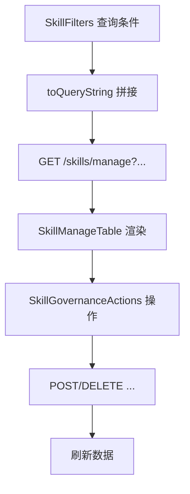
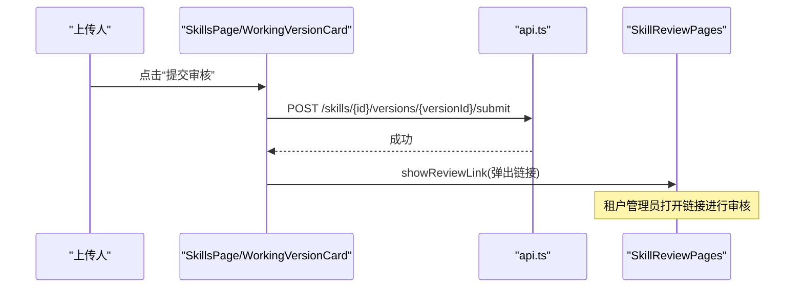
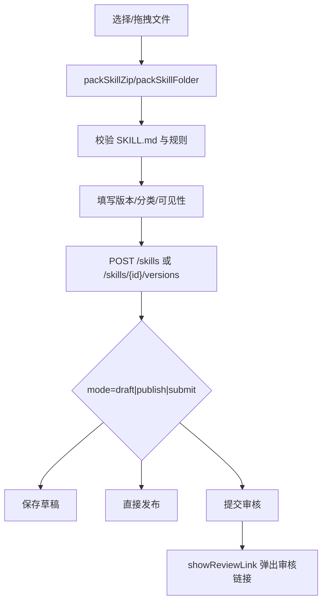
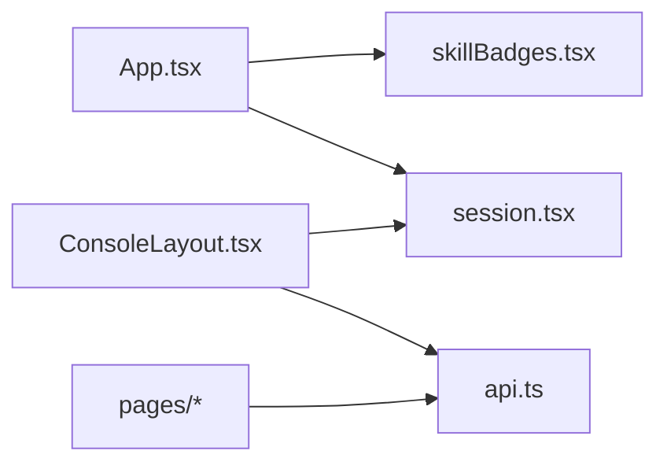

# 前端应用

<cite>
**本文引用的文件**   
- [main.tsx](file://apps/web/src/main.tsx)
- [App.tsx](file://apps/web/src/App.tsx)
- [vite.config.ts](file://apps/web/vite.config.ts)
- [package.json](file://apps/web/package.json)
- [api.ts](file://apps/web/src/api.ts)
- [session.tsx](file://apps/web/src/session.tsx)
- [ConsoleLayout.tsx](file://apps/web/src/pages/ConsoleLayout.tsx)
- [LoginPage.tsx](file://apps/web/src/pages/LoginPage.tsx)
- [SkillsPage.tsx](file://apps/web/src/pages/SkillsPage.tsx)
- [SkillManage.tsx](file://apps/web/src/pages/SkillManage.tsx)
- [SkillReviewPages.tsx](file://apps/web/src/pages/SkillReviewPages.tsx)
- [UploadSkillModal.tsx](file://apps/web/src/pages/UploadSkillModal.tsx)
- [SkillCategories.tsx](file://apps/web/src/pages/SkillCategories.tsx)
- [SkillParts.tsx](file://apps/web/src/pages/SkillParts.tsx)
- [SkillVisibility.tsx](file://apps/web/src/pages/SkillVisibility.tsx)
- [MySkillsPage.tsx](file://apps/web/src/pages/MySkillsPage.tsx)
- [SkillFileViews.tsx](file://apps/web/src/pages/SkillFileViews.tsx)
- [skillBadges.tsx](file://apps/web/src/skillBadges.tsx)
</cite>

## 目录
1. [简介](#简介)
2. [项目结构](#项目结构)
3. [核心组件](#核心组件)
4. [架构总览](#架构总览)
5. [详细组件分析](#详细组件分析)
6. [依赖关系分析](#依赖关系分析)
7. [性能与可访问性](#性能与可访问性)
8. [故障排查指南](#故障排查指南)
9. [结论](#结论)
10. [附录：开发工具与调试](#附录开发工具与调试)

## 简介
本仓库的前端应用是一个基于 React + Vite 的管理界面，面向“技能（Skill）”的上传、审核、分发与管理。应用采用 Ant Design 作为 UI 基础库，使用 react-router 进行路由管理，通过统一的 API 封装与后端交互，并内置会话校验、菜单红点、分类管理与可见性控制等能力。文档将帮助前端开发者理解应用的初始化流程、路由与页面结构、组件设计模式、状态管理策略、API 通信与会话管理，以及表单处理、文件上传、进度反馈、主题国际化与性能优化方法。

## 项目结构
前端位于 apps/web 下，主要入口为 main.tsx，应用根组件 App.tsx 负责路由与权限守卫；页面集中在 src/pages 下，按功能模块组织；全局样式在 styles.css；构建配置在 vite.config.ts；依赖与脚本在 package.json。

图表来源
- [main.tsx:1-17](file://apps/web/src/main.tsx#L1-L17)
- [App.tsx:1-66](file://apps/web/src/App.tsx#L1-L66)
- [session.tsx:1-68](file://apps/web/src/session.tsx#L1-L68)
- [skillBadges.tsx:1-26](file://apps/web/src/skillBadges.tsx#L1-L26)
- [api.ts:1-42](file://apps/web/src/api.ts#L1-L42)

章节来源
- [main.tsx:1-17](file://apps/web/src/main.tsx#L1-L17)
- [App.tsx:1-66](file://apps/web/src/App.tsx#L1-L66)
- [vite.config.ts:1-4](file://apps/web/vite.config.ts#L1-L4)
- [package.json:1-34](file://apps/web/package.json#L1-L34)

## 核心组件
- 应用启动与主题国际化：main.tsx 使用 antd ConfigProvider 注入中文语言包，包裹 AntdApp 与 App 根组件。
- 路由与权限：App.tsx 定义 BrowserRouter/Routes，提供登录页、超管控制台、租户控制台、工作台控制台及公共 Skill 详情页；RequireSession 作为路由守卫，未登录跳转登录页。
- 会话管理：session.tsx 提供 RequireSession、useMe、useCurrentUser、useCurrentEmployee，并在 StrictMode 下避免重复请求导致的回跳问题。
- 菜单红点：skillBadges.tsx 提供 SkillBadgesProvider 与 useSkillBadges，根据当前路径刷新待审核与被驳回草稿数。
- 控制台外壳：ConsoleLayout.tsx 提供侧栏导航、顶栏用户信息与退出操作。
- 登录页：LoginPage.tsx 支持演示账号快捷填充与表单提交，成功后跳转到 next 或首页。
- Skill 列表与详情：SkillsPage.tsx 提供目录视图、管理视图（租户管理员）、分类管理与上传弹窗集成。
- 治理与管理：SkillManage.tsx 提供筛选器、管理表格、下架/上架/删除等操作按钮，以及超管视角的租户选择与只读详情。
- 审核流程：SkillReviewPages.tsx 提供待审核列表、全量审核记录、审核中心与审核链接页，支持通过/驳回与差异查看。
- 上传与预览：UploadSkillModal.tsx 支持文件夹/zip 拖拽与选择，预读 SKILL.md，版本号校验，可见性与分类设置，以及与后端的 multipart 上传。
- 分类与可见性：SkillCategories.tsx 提供分类 CRUD、筛选与修改；SkillVisibility.tsx 提供可见性四种模式的表单与展示。
- 通用部件：SkillParts.tsx 提供时间格式化、下载链接、状态标签、Markdown 渲染、审核记录表与审核链接复制。
- 我的 Skill：MySkillsPage.tsx 展示本人拥有的 Skill 及其版本状态，支持快速跳转与复制链接。
- 文件视图：SkillFileViews.tsx 提供文件树、文本预览与文件级差异展示。

章节来源
- [main.tsx:1-17](file://apps/web/src/main.tsx#L1-L17)
- [App.tsx:1-66](file://apps/web/src/App.tsx#L1-L66)
- [session.tsx:1-68](file://apps/web/src/session.tsx#L1-L68)
- [skillBadges.tsx:1-26](file://apps/web/src/skillBadges.tsx#L1-L26)
- [ConsoleLayout.tsx:1-66](file://apps/web/src/pages/ConsoleLayout.tsx#L1-L66)
- [LoginPage.tsx:1-41](file://apps/web/src/pages/LoginPage.tsx#L1-L41)
- [SkillsPage.tsx:1-489](file://apps/web/src/pages/SkillsPage.tsx#L1-L489)
- [SkillManage.tsx:1-385](file://apps/web/src/pages/SkillManage.tsx#L1-L385)
- [SkillReviewPages.tsx:1-340](file://apps/web/src/pages/SkillReviewPages.tsx#L1-L340)
- [UploadSkillModal.tsx:1-269](file://apps/web/src/pages/UploadSkillModal.tsx#L1-L269)
- [SkillCategories.tsx:1-220](file://apps/web/src/pages/SkillCategories.tsx#L1-L220)
- [SkillVisibility.tsx:1-152](file://apps/web/src/pages/SkillVisibility.tsx#L1-L152)
- [MySkillsPage.tsx:1-114](file://apps/web/src/pages/MySkillsPage.tsx#L1-L114)
- [SkillFileViews.tsx:1-137](file://apps/web/src/pages/SkillFileViews.tsx#L1-L137)
- [SkillParts.tsx:1-128](file://apps/web/src/pages/SkillParts.tsx#L1-L128)

## 架构总览
应用以 React 为运行时，Vite 为构建工具，Ant Design 为 UI 框架，react-router 管理路由，antd ConfigProvider 提供国际化，RequireSession 保障受保护路由的会话有效性，所有数据请求通过 api.ts 统一封装。

图表来源
- [main.tsx:1-17](file://apps/web/src/main.tsx#L1-L17)
- [App.tsx:1-66](file://apps/web/src/App.tsx#L1-L66)
- [session.tsx:1-68](file://apps/web/src/session.tsx#L1-L68)
- [skillBadges.tsx:1-26](file://apps/web/src/skillBadges.tsx#L1-L26)
- [vite.config.ts:1-4](file://apps/web/vite.config.ts#L1-L4)

## 详细组件分析

### 应用初始化与国际化
- main.tsx 使用 createRoot 挂载 App，并通过 ConfigProvider 设置 antd 中文语言包，同时启用 StrictMode 与 AntdApp 全局能力。
- 该层不承载业务逻辑，仅完成环境初始化与主题/国际化注入。

章节来源
- [main.tsx:1-17](file://apps/web/src/main.tsx#L1-L17)

### 路由与页面结构
- App.tsx 定义以下路由：
  - /login：登录页
  - /：根据角色重定向到超管、租户或工作台
  - /admin/*：超管控制台（Skill 列表与详情）
  - /tenant/*：租户控制台（Skill 目录、管理、分类、审核）
  - /workspace/*：工作台（Skill 目录、我的 Skill）
  - /skills/review/:versionId：审核链接页
- RequireSession 包裹需要登录的路由，未登录时携带 next 参数跳转登录页，登录后返回原地址。

图表来源
- [App.tsx:1-66](file://apps/web/src/App.tsx#L1-L66)
- [session.tsx:1-68](file://apps/web/src/session.tsx#L1-L68)

章节来源
- [App.tsx:1-66](file://apps/web/src/App.tsx#L1-L66)
- [session.tsx:1-68](file://apps/web/src/session.tsx#L1-L68)

### 会话管理与鉴权
- session.tsx 提供：
  - RequireSession：发起 /auth/me 获取 MeResponse，401 时跳转 /login?next=...，StrictMode 下使用 cancelled 标志避免竞态。
  - useMe/useSetMe：读取与更新当前会话信息。
  - useCurrentUser/useCurrentEmployee：便捷获取当前用户与当前租户下的员工档案。
- 登录成功后，页面根据 isSuperAdmin、employee.tenant.status 等字段决定初始路由。

图表来源
- [session.tsx:1-68](file://apps/web/src/session.tsx#L1-L68)
- [api.ts:1-42](file://apps/web/src/api.ts#L1-L42)

章节来源
- [session.tsx:1-68](file://apps/web/src/session.tsx#L1-L68)

### API 通信与错误处理
- api.ts 提供：
  - api(path, init)：自动判断 JSON 或 FormData，非 2xx 抛出 ApiError（包含 status、message、code、body）。
  - logout()：调用 /auth/logout，忽略 401 以便本地清理。
  - safeNext(next)：仅允许内部安全路径作为登录返回地址。
- 页面中统一捕获 Error.message 显示给用户，并在失败时刷新数据或提示。

章节来源
- [api.ts:1-42](file://apps/web/src/api.ts#L1-L42)

### 控制台外壳与导航
- ConsoleLayout.tsx 提供：
  - 响应式侧边栏（breakpoint="lg"），可折叠。
  - 动态菜单项（含 Badge 红点）。
  - 顶栏显示当前用户昵称与退出按钮。
  - 错误消息局部展示。

章节来源
- [ConsoleLayout.tsx:1-66](file://apps/web/src/pages/ConsoleLayout.tsx#L1-L66)

### 登录流程
- LoginPage.tsx：
  - 支持演示账号一键填充。
  - 表单验证用户名/密码。
  - 调用 POST /auth/login，成功后跳转到 next 或首页。
  - 错误通过 Alert 展示。

章节来源
- [LoginPage.tsx:1-41](file://apps/web/src/pages/LoginPage.tsx#L1-L41)

### Skill 目录与管理
- SkillsPage.tsx：
  - 目录视图：搜索名称/描述、按上传人与分类筛选，展示当前版本、上传者、时间与下载。
  - 管理视图（租户管理员）：Tab 切换目录/管理/分类，管理视图支持审核状态、可见性、是否下架、分类筛选。
  - 上传入口：打开 UploadSkillModal，新建或为已有 Skill 上传新版本。
- SkillManage.tsx：
  - SkillFilters：组合查询条件，生成 URLSearchParams。
  - SkillManageTable：管理表格列包括名称、分类、当前版本、进行中、可见性、所有者、更新时间。
  - SkillGovernanceActions：下架/上架、删除 Skill。
  - AdminSkillsPage/AdminSkillDetailPage：超管视角的租户选择与只读详情。

图表来源
- [SkillsPage.tsx:1-489](file://apps/web/src/pages/SkillsPage.tsx#L1-L489)
- [SkillManage.tsx:1-385](file://apps/web/src/pages/SkillManage.tsx#L1-L385)

章节来源
- [SkillsPage.tsx:1-489](file://apps/web/src/pages/SkillsPage.tsx#L1-L489)
- [SkillManage.tsx:1-385](file://apps/web/src/pages/SkillManage.tsx#L1-L385)

### 审核流程与链接
- SkillReviewPages.tsx：
  - 待审核列表：GET /skills/reviews。
  - 全量审核记录：分页 GET /skills/reviews/records。
  - 审核中心：Tabs 切换待审核与记录。
  - 审核页（/tenant/reviews/:versionId）：通过/驳回，必要时切换到审核链接页。
  - 审核链接页（/skills/review/:versionId）：根据 viewerRole 决定跳转或只读展示。
- SkillParts.tsx：
  - ReviewRecordsTable：统一展示动作、操作人、意见。
  - showReviewLink：提交审核后弹出对话框展示审核链接。

图表来源
- [SkillsPage.tsx:321-430](file://apps/web/src/pages/SkillsPage.tsx#L321-L430)
- [SkillReviewPages.tsx:1-340](file://apps/web/src/pages/SkillReviewPages.tsx#L1-L340)
- [SkillParts.tsx:92-128](file://apps/web/src/pages/SkillParts.tsx#L92-L128)

章节来源
- [SkillReviewPages.tsx:1-340](file://apps/web/src/pages/SkillReviewPages.tsx#L1-L340)
- [SkillParts.tsx:1-128](file://apps/web/src/pages/SkillParts.tsx#L1-L128)

### 文件上传与预览
- UploadSkillModal.tsx：
  - 支持三种来源：选择文件夹、选择 .zip、拖拽。
  - 预读 SKILL.md，校验 name 一致性，计算文件数量与大小。
  - 表单字段：版本号（语义化版本校验）、分类、可见性（新建时）。
  - 上传逻辑：multipart/form-data 发送 zip 与元数据；根据 mode 执行 draft/publish/submit；409 冲突时引导前往已有 Skill 的新版本上传。
  - 成功后刷新红点并回调 onUploaded。
- SkillFileViews.tsx：
  - FilesPanel：文件树 + 文本预览（二进制仅显示大小）。
  - DiffPanel：文件级差异分组（新增/修改/删除）。

图表来源
- [UploadSkillModal.tsx:1-269](file://apps/web/src/pages/UploadSkillModal.tsx#L1-L269)
- [SkillFileViews.tsx:1-137](file://apps/web/src/pages/SkillFileViews.tsx#L1-L137)

章节来源
- [UploadSkillModal.tsx:1-269](file://apps/web/src/pages/UploadSkillModal.tsx#L1-L269)
- [SkillFileViews.tsx:1-137](file://apps/web/src/pages/SkillFileViews.tsx#L1-L137)

### 分类与可见性
- SkillCategories.tsx：
  - useSkillCategories：加载分类列表，支持增删改与一键添加常用分类。
  - CategoryFilterBar：目录顶部筛选。
  - SkillCategoryManager：分类管理表格与弹窗。
  - SkillCategoryModal：修改 Skill 的分类（立即生效）。
- SkillVisibility.tsx：
  - VisibilityText：描述可见性范围。
  - VisibilityFields：Radio 选择可见性模式，TreeSelect 选择部门，Select 多选员工。
  - VisibilityModal：修改可见性（立即生效，记录审核记录）。

章节来源
- [SkillCategories.tsx:1-220](file://apps/web/src/pages/SkillCategories.tsx#L1-L220)
- [SkillVisibility.tsx:1-152](file://apps/web/src/pages/SkillVisibility.tsx#L1-L152)

### 我的 Skill
- MySkillsPage.tsx：
  - 列出本人拥有的 Skill，展示当前正式版本、进行中版本、驳回意见与最近上传时间。
  - 支持跳转到详情页处理或复制链接。

章节来源
- [MySkillsPage.tsx:1-114](file://apps/web/src/pages/MySkillsPage.tsx#L1-L114)

## 依赖关系分析
- 组件耦合：
  - App.tsx 依赖 session.tsx 与 skillBadges.tsx 提供上下文。
  - 页面组件普遍依赖 api.ts 进行数据获取与变更。
  - ConsoleLayout.tsx 依赖 api.ts 的 logout 与 session.tsx 的用户信息。
- 外部依赖：
  - antd 提供 UI 组件与国际化。
  - react-router 提供路由与导航。
  - react-markdown 用于安全渲染 SKILL.md。
  - fflate 用于压缩/解压（在打包逻辑中使用）。

图表来源
- [App.tsx:1-66](file://apps/web/src/App.tsx#L1-L66)
- [session.tsx:1-68](file://apps/web/src/session.tsx#L1-L68)
- [skillBadges.tsx:1-26](file://apps/web/src/skillBadges.tsx#L1-L26)
- [ConsoleLayout.tsx:1-66](file://apps/web/src/pages/ConsoleLayout.tsx#L1-L66)
- [api.ts:1-42](file://apps/web/src/api.ts#L1-L42)

章节来源
- [App.tsx:1-66](file://apps/web/src/App.tsx#L1-L66)
- [session.tsx:1-68](file://apps/web/src/session.tsx#L1-L68)
- [skillBadges.tsx:1-26](file://apps/web/src/skillBadges.tsx#L1-L26)
- [ConsoleLayout.tsx:1-66](file://apps/web/src/pages/ConsoleLayout.tsx#L1-L66)
- [api.ts:1-42](file://apps/web/src/api.ts#L1-L42)

## 性能与可访问性
- 性能优化建议：
  - 列表与表格：保持分页或虚拟滚动（当前多为无分页小数据集，注意大数据集时的性能）。
  - 图片与文件预览：对大文件进行截断与懒加载（FilesPanel 已对大文件做 truncated 提示）。
  - 网络请求：合并请求与缓存（如分类、可见性选项可考虑短期缓存）。
  - 构建优化：按需引入 antd 组件与图标，减少 bundle 体积。
- 可访问性：
  - 使用 antd 原生组件，具备基本无障碍支持。
  - 表单元素提供 label 与 placeholder，错误提示清晰。
  - Markdown 渲染使用 react-markdown，避免危险 HTML。
- 主题与国际化：
  - 通过 ConfigProvider 设置 zh_CN 语言包。
  - 可通过 antd ConfigProvider 扩展主题变量（颜色、字号、圆角等）。

[本节为通用指导，不直接分析具体文件]

## 故障排查指南
- 登录失败或回环：
  - 检查 /auth/me 是否返回 401，确认 RequireSession 是否正确携带 next 参数。
  - 确认 safeNext 允许的返回路径是否符合正则限制。
- API 错误：
  - 捕获 ApiError 的 message 与 code，定位服务端错误原因。
  - 409 冲突时，根据 body.skillId 引导至已有 Skill 的新版本上传。
- 上传失败：
  - 校验 SKILL.md 是否存在于根目录，文件数量与大小是否符合限制。
  - 检查 FormData 字段（file、version、mode、visibility、departmentIds、employeeIds、categoryId）是否正确附加。
- 审核链接无效：
  - 确认链接格式与 versionId 正确，服务端权限校验通过后才能进入。
- 分类与可见性：
  - 分类被删除后，筛选条件应清空；可见性若所选部门全部删除，需提醒修改。

章节来源
- [api.ts:1-42](file://apps/web/src/api.ts#L1-L42)
- [session.tsx:1-68](file://apps/web/src/session.tsx#L1-L68)
- [UploadSkillModal.tsx:1-269](file://apps/web/src/pages/UploadSkillModal.tsx#L1-L269)
- [SkillCategories.tsx:1-220](file://apps/web/src/pages/SkillCategories.tsx#L1-L220)
- [SkillVisibility.tsx:1-152](file://apps/web/src/pages/SkillVisibility.tsx#L1-L152)

## 结论
该前端应用以清晰的职责分层与模块化组织，实现了从登录鉴权、路由导航、数据请求、表单与文件上传到审核流程与文件预览的完整闭环。通过统一的 API 封装与会话上下文，保证了前后端交互的一致性与安全性；借助 Ant Design 与 react-router，提供了良好的用户体验与可扩展性。开发者可在现有基础上继续扩展新的页面、表单与业务流程，同时遵循现有的错误处理与状态管理模式。

[本节为总结性内容，不直接分析具体文件]

## 附录：开发工具与调试
- 开发与构建：
  - dev：启动 Vite 开发服务器，端口默认 5175，严格端口模式。
  - build：类型检查与生产构建。
  - preview：预览构建产物。
  - typecheck：运行数据库表检查脚本与类型检查。
  - test:e2e：Playwright 端到端测试。
- 代理配置：
  - vite.config.ts 将 /api 代理到 API_TARGET（默认 http://localhost:3001）。
- 调试建议：
  - 使用浏览器 Network 面板观察 /api 请求与响应。
  - 使用 React DevTools 检查组件状态与上下文。
  - 使用 Playwright 录制与回放端到端用例，验证关键流程。

章节来源
- [package.json:1-34](file://apps/web/package.json#L1-L34)
- [vite.config.ts:1-4](file://apps/web/vite.config.ts#L1-L4)