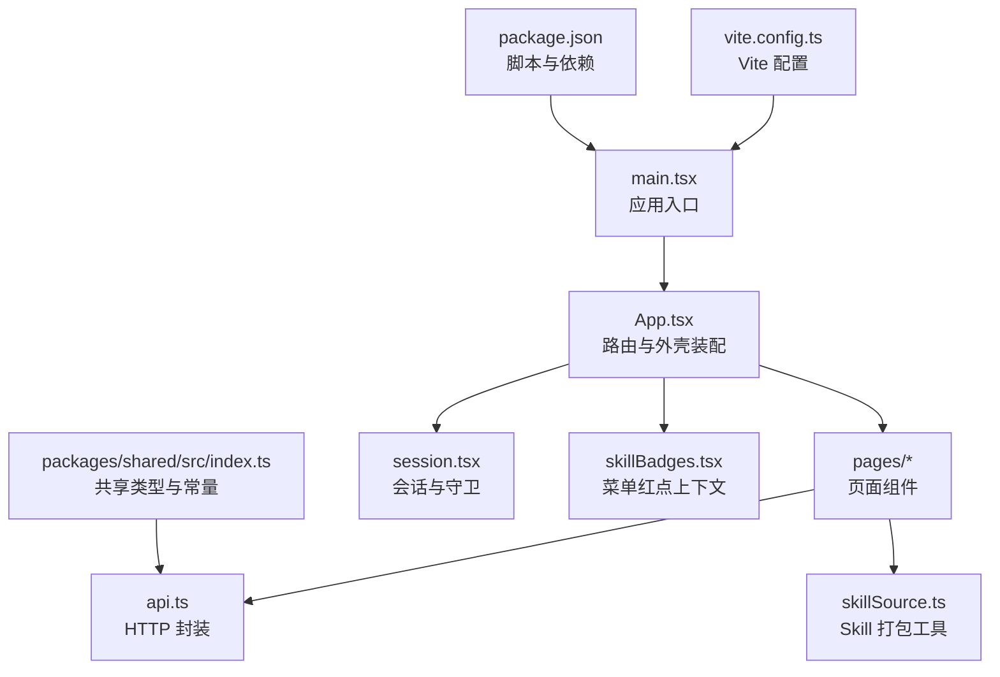
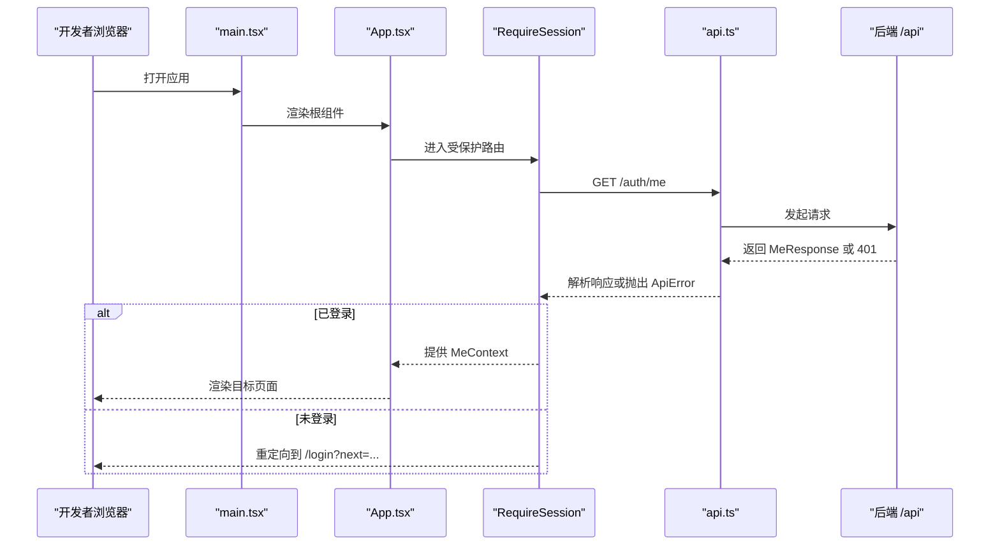
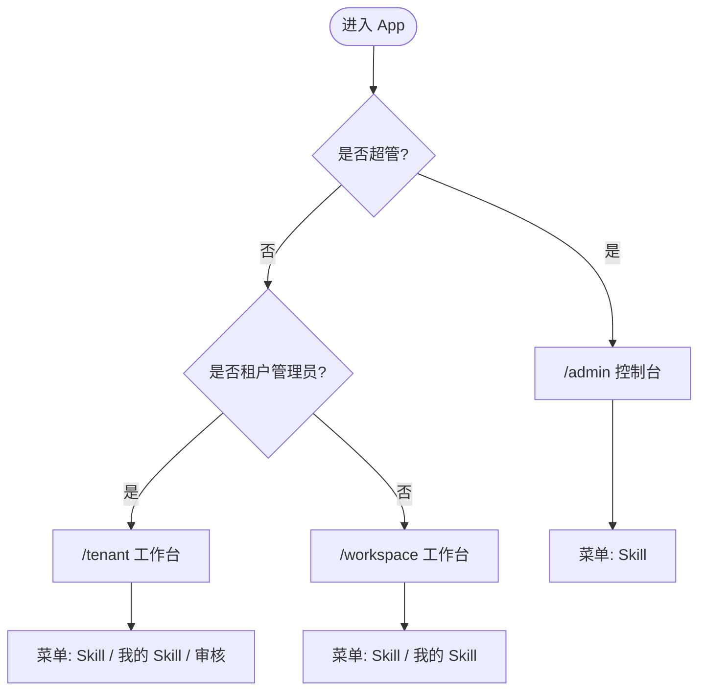
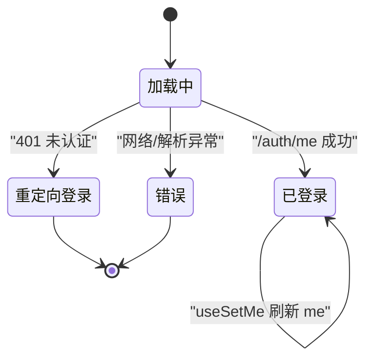
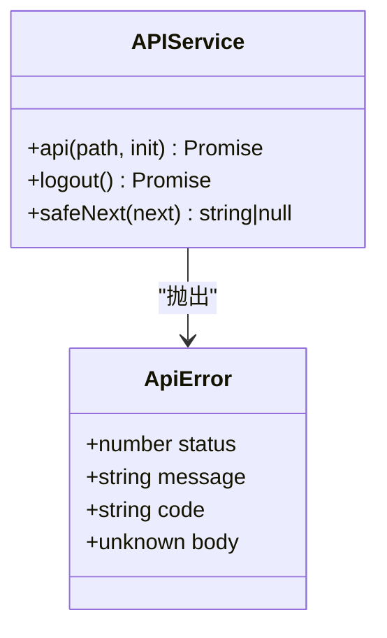
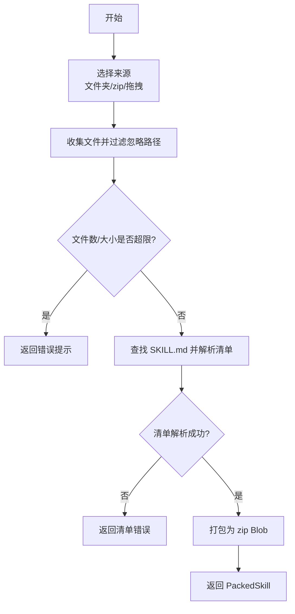
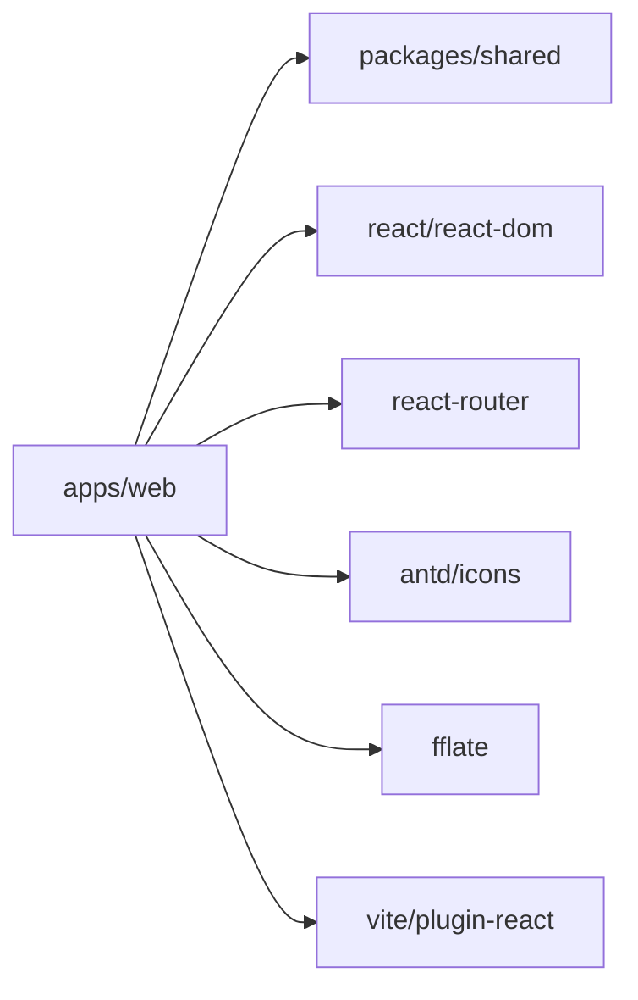

# 应用架构

<cite>
**本文引用的文件**   
- [apps/web/src/main.tsx](file://apps/web/src/main.tsx)
- [apps/web/src/App.tsx](file://apps/web/src/App.tsx)
- [apps/web/vite.config.ts](file://apps/web/vite.config.ts)
- [apps/web/package.json](file://apps/web/package.json)
- [apps/web/src/session.tsx](file://apps/web/src/session.tsx)
- [apps/web/src/api.ts](file://apps/web/src/api.ts)
- [apps/web/src/pages/ConsoleLayout.tsx](file://apps/web/src/pages/ConsoleLayout.tsx)
- [apps/web/src/pages/LoginPage.tsx](file://apps/web/src/pages/LoginPage.tsx)
- [apps/web/src/pages/SkillsPage.tsx](file://apps/web/src/pages/SkillsPage.tsx)
- [apps/web/src/skillBadges.tsx](file://apps/web/src/skillBadges.tsx)
- [apps/web/src/skillSource.ts](file://apps/web/src/skillSource.ts)
- [packages/shared/src/index.ts](file://packages/shared/src/index.ts)
</cite>

## 目录
1. [简介](#简介)
2. [项目结构](#项目结构)
3. [核心组件](#核心组件)
4. [架构总览](#架构总览)
5. [详细组件分析](#详细组件分析)
6. [依赖关系分析](#依赖关系分析)
7. [性能与构建优化](#性能与构建优化)
8. [故障排查指南](#故障排查指南)
9. [结论](#结论)
10. [附录：扩展点与自定义配置](#附录扩展点与自定义配置)

## 简介
本仓库采用前后端分离的 Monorepo 结构，前端位于 apps/web，基于 React + Vite 构建。本文聚焦前端应用的初始化流程、路由设计、模块加载机制、会话与权限管理、服务层抽象与错误处理策略，并给出可扩展的架构说明与最佳实践，帮助开发者快速理解整体设计并在现有基础上进行功能扩展。

## 项目结构
前端应用以 apps/web 为根目录，遵循“页面级组织 + 共享能力下沉”的原则：
- src/main.tsx：React 应用入口，挂载全局 UI 上下文（Ant Design）与国际化。
- src/App.tsx：路由定义与角色化控制台外壳装配。
- src/pages：按业务域划分的页面组件，如登录页、Skill 目录与管理、审核等。
- src/api.ts：统一的 HTTP 请求封装与错误模型。
- src/session.tsx：会话上下文、用户信息获取与路由守卫。
- src/skillBadges.tsx：菜单红点状态的全局上下文。
- src/skillSource.ts：Skill 包打包与校验的前端逻辑。
- packages/shared：前后端共享的类型与常量。

图表来源
- [apps/web/src/main.tsx:1-17](file://apps/web/src/main.tsx#L1-L17)
- [apps/web/src/App.tsx:1-66](file://apps/web/src/App.tsx#L1-L66)
- [apps/web/vite.config.ts:1-4](file://apps/web/vite.config.ts#L1-L4)
- [apps/web/package.json:1-34](file://apps/web/package.json#L1-L34)
- [apps/web/src/session.tsx:1-68](file://apps/web/src/session.tsx#L1-L68)
- [apps/web/src/api.ts:1-42](file://apps/web/src/api.ts#L1-L42)
- [apps/web/src/skillBadges.tsx:1-26](file://apps/web/src/skillBadges.tsx#L1-L26)
- [apps/web/src/skillSource.ts:1-129](file://apps/web/src/skillSource.ts#L1-L129)
- [packages/shared/src/index.ts:1-13](file://packages/shared/src/index.ts#L1-L13)

章节来源
- [apps/web/src/main.tsx:1-17](file://apps/web/src/main.tsx#L1-L17)
- [apps/web/src/App.tsx:1-66](file://apps/web/src/App.tsx#L1-L66)
- [apps/web/vite.config.ts:1-4](file://apps/web/vite.config.ts#L1-L4)
- [apps/web/package.json:1-34](file://apps/web/package.json#L1-L34)

## 核心组件
- 应用入口与全局上下文：在 main.tsx 中通过 React 18 createRoot 挂载应用，并包裹 Ant Design 的 ConfigProvider 与 App，同时设置中文语言包。
- 路由系统：App.tsx 使用 react-router 定义多角色路由（超管、租户管理员、普通员工），并通过 RequireSession 守卫统一鉴权。
- 会话与权限：session.tsx 提供 useCurrentUser、useCurrentEmployee 等 Hook，以及 RequireSession 路由守卫，负责从后端 /auth/me 拉取当前用户信息并维护 MeContext。
- API 层：api.ts 统一封装 fetch，自动处理 JSON/Formdata，非 2xx 抛出 ApiError，并提供 logout 与 safeNext 辅助函数。
- 控制台外壳：ConsoleLayout.tsx 提供侧边栏导航、顶栏用户信息与退出操作，配合 Outlet 渲染子路由内容。
- Skill 上传与校验：skillSource.ts 实现文件夹/拖拽/zip 三种来源的 Skill 打包、SKILL.md 解析与大小/数量限制检查。
- 菜单红点：skillBadges.tsx 提供待审核数与被驳回草稿数的全局上下文，随路由切换刷新。

章节来源
- [apps/web/src/main.tsx:1-17](file://apps/web/src/main.tsx#L1-L17)
- [apps/web/src/App.tsx:1-66](file://apps/web/src/App.tsx#L1-L66)
- [apps/web/src/session.tsx:1-68](file://apps/web/src/session.tsx#L1-L68)
- [apps/web/src/api.ts:1-42](file://apps/web/src/api.ts#L1-L42)
- [apps/web/src/pages/ConsoleLayout.tsx:1-66](file://apps/web/src/pages/ConsoleLayout.tsx#L1-L66)
- [apps/web/src/skillSource.ts:1-129](file://apps/web/src/skillSource.ts#L1-L129)
- [apps/web/src/skillBadges.tsx:1-26](file://apps/web/src/skillBadges.tsx#L1-L26)

## 架构总览
前端采用“入口 -> 路由 -> 页面 -> 服务层 -> 后端”的分层架构。会话与权限由 session.tsx 集中管理；API 调用集中在 api.ts；UI 框架能力通过 Ant Design 的 Provider 注入；业务页面按需组合 Hooks 与上下文。

图表来源
- [apps/web/src/main.tsx:8-16](file://apps/web/src/main.tsx#L8-L16)
- [apps/web/src/App.tsx:40-64](file://apps/web/src/App.tsx#L40-L64)
- [apps/web/src/session.tsx:41-67](file://apps/web/src/session.tsx#L41-L67)
- [apps/web/src/api.ts:16-31](file://apps/web/src/api.ts#L16-L31)

## 详细组件分析

### 应用初始化与入口
- React 18 的 createRoot 挂载到 #root。
- 通过 StrictMode 开启严格模式。
- 使用 antd 的 ConfigProvider 注入中文 locale，并使用 AntdApp 提供全局消息与通知能力。
- 最终渲染 App 组件。

章节来源
- [apps/web/src/main.tsx:1-17](file://apps/web/src/main.tsx#L1-L17)

### 路由系统与角色化外壳
- 使用 BrowserRouter 与 Routes 定义路由。
- 登录页 /login 不受会话守卫限制。
- 其他路由均包裹 RequireSession，确保已登录。
- 根据用户身份（超管、租户管理员、普通员工）重定向到不同控制台：
  - /admin：超管控制台，包含 Skill 管理。
  - /tenant：租户管理员工作台，含 Skill 目录、我的 Skill、审核中心。
  - /workspace：普通员工工作台，含 Skill 目录、我的 Skill。
- 控制台外壳 ConsoleLayout 提供侧边栏菜单、顶栏用户信息与退出按钮，并通过 Outlet 渲染子路由内容。

图表来源
- [apps/web/src/App.tsx:13-38](file://apps/web/src/App.tsx#L13-L38)
- [apps/web/src/pages/ConsoleLayout.tsx:17-65](file://apps/web/src/pages/ConsoleLayout.tsx#L17-L65)

章节来源
- [apps/web/src/App.tsx:1-66](file://apps/web/src/App.tsx#L1-L66)
- [apps/web/src/pages/ConsoleLayout.tsx:1-66](file://apps/web/src/pages/ConsoleLayout.tsx#L1-L66)

### 会话管理与权限控制
- RequireSession 在首次渲染时调用 /auth/me，若成功则写入 MeContext，供 useCurrentUser、useCurrentEmployee 等 Hook 消费。
- 若接口返回 401，则重定向到 /login，并携带 next 参数保留原访问地址。
- 支持开发环境 StrictMode 下 effect 执行两次的竞态问题，通过 cancelled 标记丢弃过期结果。
- 用户信息更新后，可通过 useSetMe 主动刷新上下文，保证 UI 同步。

图表来源
- [apps/web/src/session.tsx:34-67](file://apps/web/src/session.tsx#L34-L67)

章节来源
- [apps/web/src/session.tsx:1-68](file://apps/web/src/session.tsx#L1-L68)

### API 层与服务层抽象
- api.ts 提供统一的 api<T>(path, init) 方法：
  - 自动判断 JSON 或 FormData。
  - 非 2xx 抛出 ApiError，携带 status、message、code 与原始 body。
  - 提供 logout 与 safeNext 辅助函数。
- 页面组件通过 api 直接调用后端接口，形成轻量服务层；如需更复杂的服务抽象，可在 pages 同级新增 service 模块，聚合多个 api 调用。

图表来源
- [apps/web/src/api.ts:3-41](file://apps/web/src/api.ts#L3-L41)

章节来源
- [apps/web/src/api.ts:1-42](file://apps/web/src/api.ts#L1-L42)

### Skill 上传与校验流程
- skillSource.ts 支持三种来源：选择文件夹、拖拽文件夹、拖拽 zip。
- 过滤忽略路径、检查文件数与大小上限、定位 SKILL.md 并解析 manifest。
- 将文件集合打包为 zip Blob，返回给上传组件提交。
- 解压 zip 时与服务端保持一致的安全校验，拒绝越界路径与超限数据。

图表来源
- [apps/web/src/skillSource.ts:32-78](file://apps/web/src/skillSource.ts#L32-L78)
- [apps/web/src/skillSource.ts:101-122](file://apps/web/src/skillSource.ts#L101-L122)

章节来源
- [apps/web/src/skillSource.ts:1-129](file://apps/web/src/skillSource.ts#L1-L129)

### 菜单红点与全局状态
- SkillBadgesProvider 在路由切换时调用 /skills/badges 刷新待审核与被驳回草稿数量。
- 通过 Context 暴露 badges 与 refresh，供 ConsoleLayout 菜单 Badge 显示。
- 当用户完成审核相关操作后，可调用 refresh 立即更新红点。

章节来源
- [apps/web/src/skillBadges.tsx:1-26](file://apps/web/src/skillBadges.tsx#L1-L26)
- [apps/web/src/pages/ConsoleLayout.tsx:30-44](file://apps/web/src/pages/ConsoleLayout.tsx#L30-L44)

### 登录流程
- LoginPage 提供演示账号快捷填充与表单登录。
- 登录成功后跳转到 next 或首页。
- 使用 safeNext 校验跳转链接的安全性，防止外部链接注入。

章节来源
- [apps/web/src/pages/LoginPage.tsx:1-41](file://apps/web/src/pages/LoginPage.tsx#L1-L41)
- [apps/web/src/api.ts:38-41](file://apps/web/src/api.ts#L38-L41)

### Skill 列表与详情
- SkillsPage 提供 Skill 目录、管理视图与分类管理（租户管理员）。
- SkillDetailPage 展示当前版本、版本历史、可见性与分类编辑、审核记录等。
- 通过 useCurrentEmployee 判断是否为租户管理员，从而决定操作权限。

章节来源
- [apps/web/src/pages/SkillsPage.tsx:33-319](file://apps/web/src/pages/SkillsPage.tsx#L33-L319)

## 依赖关系分析
- 前端依赖：
  - react、react-dom：UI 框架运行时。
  - react-router：路由与导航。
  - antd、@ant-design/icons：UI 组件库与图标。
  - fflate：前端 zip 压缩/解压。
  - react-markdown：Markdown 渲染（可选）。
  - @skill-hub/shared：共享类型与常量。
- 构建与开发：
  - vite、@vitejs/plugin-react：构建与 React 插件。
  - playwright：端到端测试。
  - typescript：类型检查。

图表来源
- [apps/web/package.json:14-32](file://apps/web/package.json#L14-L32)
- [packages/shared/src/index.ts:1-13](file://packages/shared/src/index.ts#L1-L13)

章节来源
- [apps/web/package.json:1-34](file://apps/web/package.json#L1-L34)
- [packages/shared/src/index.ts:1-13](file://packages/shared/src/index.ts#L1-L13)

## 性能与构建优化
- 开发服务器：
  - 端口通过 WEB_PORT 环境变量配置，默认 5175，strictPort 避免端口冲突。
  - 代理 /api 到 API_TARGET，默认 http://localhost:3001，便于本地联调。
- 构建脚本：
  - build 先执行 tsc --noEmit 做类型检查，再 vite build 生成生产产物。
  - preview 用于预览构建产物。
- 建议优化：
  - 对大体积资源（如 Markdown 文档、图片）启用懒加载与代码分割。
  - 针对 fflate 的使用，注意在超大 Skill 包场景下的内存占用，必要时分块处理或引导用户分批上传。
  - 利用 Ant Design 按需引入减少包体（Vite 生态通常自动 tree-shaking）。

章节来源
- [apps/web/vite.config.ts:1-4](file://apps/web/vite.config.ts#L1-L4)
- [apps/web/package.json:6-12](file://apps/web/package.json#L6-L12)

## 故障排查指南
- 会话加载失败：
  - 现象：RequireSession 显示错误提示或停留在登录页。
  - 排查：确认 /auth/me 接口可达、Cookie/Session 是否正确传递；检查网络代理配置。
- 登录后无法回跳：
  - 现象：登录完成后未回到原页面。
  - 排查：检查 next 参数是否被 safeNext 过滤；确认路由前缀匹配规则。
- 上传失败：
  - 现象：Skill 上传时报错或提示清单无效。
  - 排查：检查 SKILL.md 是否存在于根目录或唯一顶层文件夹；确认文件大小与数量未超限；查看压缩包格式是否正确。
- 菜单红点不更新：
  - 现象：待审核数未变化。
  - 排查：确认 /skills/badges 接口正常；在操作完成后调用 refresh 刷新上下文。

章节来源
- [apps/web/src/session.tsx:41-67](file://apps/web/src/session.tsx#L41-L67)
- [apps/web/src/api.ts:3-31](file://apps/web/src/api.ts#L3-L31)
- [apps/web/src/skillSource.ts:57-78](file://apps/web/src/skillSource.ts#L57-L78)
- [apps/web/src/skillBadges.tsx:14-22](file://apps/web/src/skillBadges.tsx#L14-L22)

## 结论
该前端应用以 React + Vite 为基础，采用清晰的分层与模块化组织：入口统一注入全局上下文，路由按角色划分，会话与权限集中管理，API 层抽象统一错误处理，Skill 上传具备完善的前端校验。整体架构具备良好的可扩展性，开发者可在现有基础上扩展新的页面、菜单项与业务能力。

## 附录：扩展点与自定义配置
- 新增页面与路由：
  - 在 src/pages 新增页面组件，并在 App.tsx 的路由表中注册对应路径与守卫。
  - 如需控制台菜单，向 ConsoleLayout 传入 menu 配置，支持 badge 显示。
- 自定义会话行为：
  - 在 session.tsx 中扩展 MeContext 的数据结构或增加新的 Hook。
  - 在 RequireSession 中调整重定向逻辑或错误处理。
- 自定义 API 服务：
  - 在 api.ts 附近新增 service 模块，聚合业务相关的接口调用，保持页面组件简洁。
- 自定义构建与代理：
  - 修改 vite.config.ts 中的 server.proxy 与 port 配置，适配不同环境。
  - 在 package.json 中扩展 scripts，添加类型检查、测试或部署脚本。
- 共享类型扩展：
  - 在 packages/shared/src 中新增类型与常量，供前后端共同引用，保证契约一致性。

章节来源
- [apps/web/src/App.tsx:40-64](file://apps/web/src/App.tsx#L40-L64)
- [apps/web/src/pages/ConsoleLayout.tsx:8-14](file://apps/web/src/pages/ConsoleLayout.tsx#L8-L14)
- [apps/web/src/session.tsx:7-22](file://apps/web/src/session.tsx#L7-L22)
- [apps/web/vite.config.ts:1-4](file://apps/web/vite.config.ts#L1-L4)
- [apps/web/package.json:6-12](file://apps/web/package.json#L6-L12)
- [packages/shared/src/index.ts:1-13](file://packages/shared/src/index.ts#L1-L13)