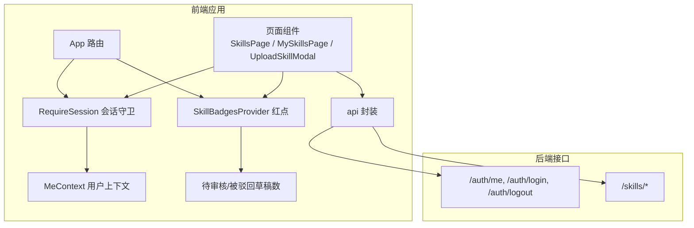
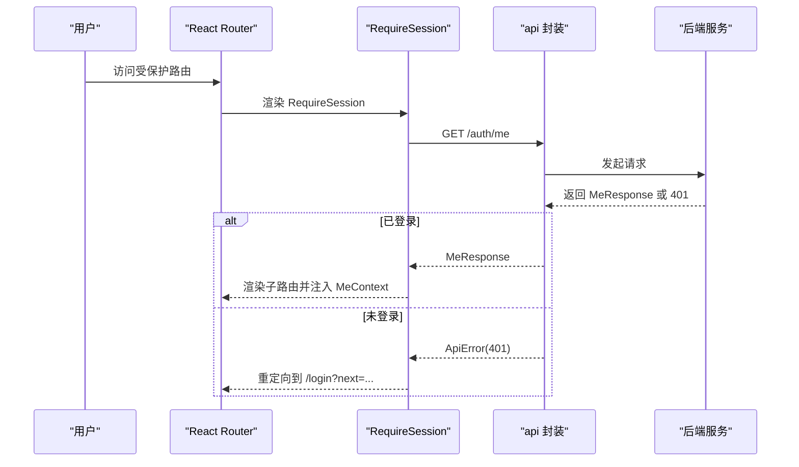
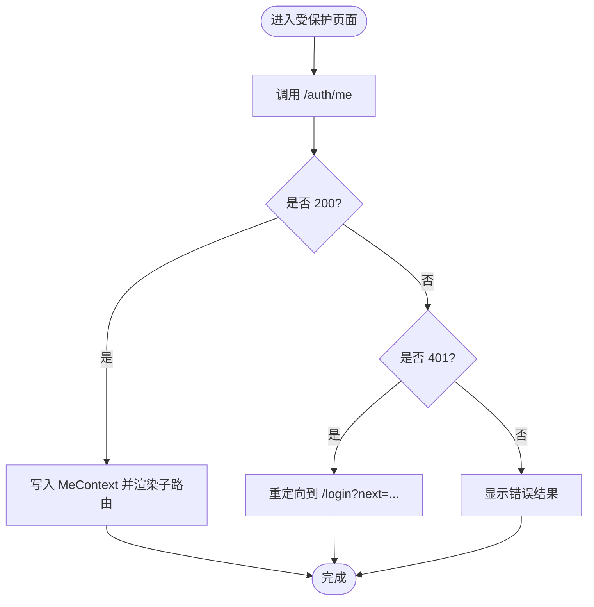
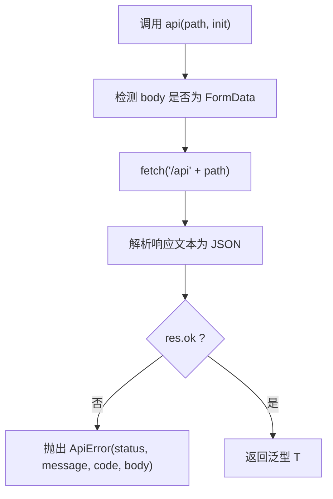
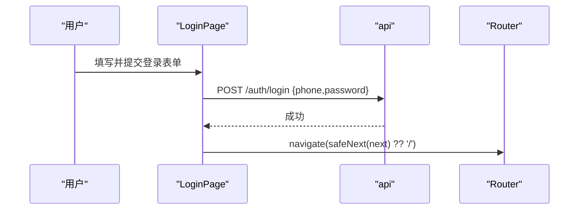
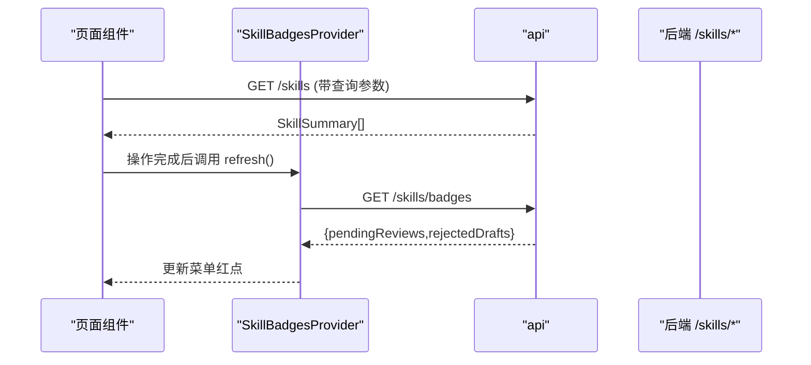
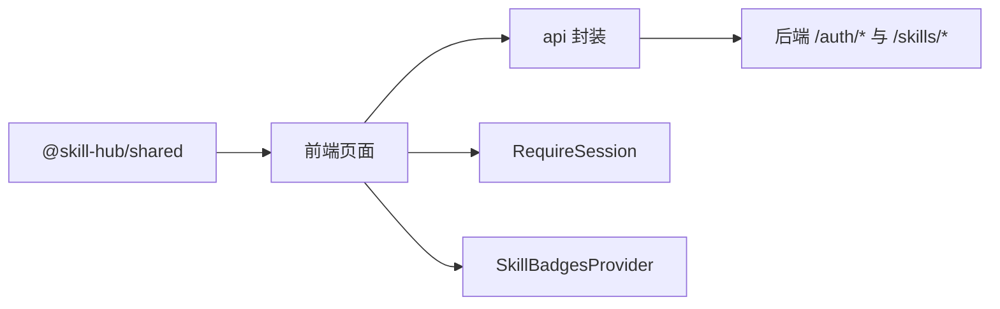

# 状态管理

<cite>
**本文引用的文件**   
- [apps/web/src/session.tsx](file://apps/web/src/session.tsx)
- [apps/web/src/api.ts](file://apps/web/src/api.ts)
- [packages/shared/src/auth.ts](file://packages/shared/src/auth.ts)
- [packages/shared/src/skill.ts](file://packages/shared/src/skill.ts)
- [apps/web/src/App.tsx](file://apps/web/src/App.tsx)
- [apps/web/src/pages/LoginPage.tsx](file://apps/web/src/pages/LoginPage.tsx)
- [apps/web/src/pages/SkillsPage.tsx](file://apps/web/src/pages/SkillsPage.tsx)
- [apps/web/src/pages/MySkillsPage.tsx](file://apps/web/src/pages/MySkillsPage.tsx)
- [apps/web/src/skillBadges.tsx](file://apps/web/src/skillBadges.tsx)
- [apps/web/src/pages/SkillCategories.tsx](file://apps/web/src/pages/SkillCategories.tsx)
- [apps/web/src/pages/UploadSkillModal.tsx](file://apps/web/src/pages/UploadSkillModal.tsx)
</cite>

## 目录
1. [引言](#引言)
2. [项目结构](#项目结构)
3. [核心组件](#核心组件)
4. [架构总览](#架构总览)
5. [详细组件分析](#详细组件分析)
6. [依赖关系分析](#依赖关系分析)
7. [性能考虑](#性能考虑)
8. [故障排查指南](#故障排查指南)
9. [结论](#结论)
10. [附录](#附录)

## 引言
本文件面向前端开发者，系统化说明 Skill Hub 教学版的前端状态管理策略与数据流设计。重点覆盖：
- 会话状态管理、用户信息存储与权限状态同步
- API 请求封装、错误处理流程与安全跳转
- 技能（Skill）数据的本地状态、实时更新与跨页面同步
- 状态持久化、数据校验与类型安全保证
- 最佳实践与性能优化建议

## 项目结构
前端采用 React + React Router + Ant Design，状态以“上下文 + 组件级状态”为主，结合共享类型定义实现前后端契约一致。关键模块职责如下：
- 会话与会话守卫：提供当前用户、租户档案、登录态检查与路由保护
- API 封装：统一 fetch 调用、错误包装、登出与返回地址校验
- 业务状态：技能列表、详情、分类、上传弹窗、菜单红点等
- 共享类型：认证、技能领域模型、校验规则与常量

图表来源
- [apps/web/src/App.tsx:39-65](file://apps/web/src/App.tsx#L39-L65)
- [apps/web/src/session.tsx:41-67](file://apps/web/src/session.tsx#L41-L67)
- [apps/web/src/skillBadges.tsx:14-25](file://apps/web/src/skillBadges.tsx#L4-L25)
- [apps/web/src/api.ts:15-41](file://apps/web/src/api.ts#L15-L41)

章节来源
- [apps/web/src/App.tsx:1-66](file://apps/web/src/App.tsx#L1-L66)
- [apps/web/src/session.tsx:1-68](file://apps/web/src/session.tsx#L1-L68)
- [apps/web/src/api.ts:1-42](file://apps/web/src/api.ts#L1-L42)
- [apps/web/src/skillBadges.tsx:1-26](file://apps/web/src/skillBadges.tsx#L1-L26)

## 核心组件
- RequireSession 与会话上下文：负责加载当前用户、未登录重定向到登录页、在 StrictMode 下避免竞态导致误跳回登录页；暴露 useMe/useCurrentUser/useCurrentEmployee/useSetMe。
- API 封装：统一 JSON/FormData 收发、非 2xx 抛出 ApiError（携带 status/code/body）、logout 忽略 401 的优雅失败、safeNext 限制返回路径为内部路径。
- 共享类型：CurrentUser、EmployeeProfile、MeResponse、ApiErrorBody、Skill 领域模型与校验常量。
- 菜单红点：SkillBadgesProvider 在路由切换时刷新待审核与被驳回草稿数量，并提供 refresh 供操作后主动更新。

章节来源
- [apps/web/src/session.tsx:1-68](file://apps/web/src/session.tsx#L1-L68)
- [apps/web/src/api.ts:1-42](file://apps/web/src/api.ts#L1-L42)
- [packages/shared/src/auth.ts:1-39](file://packages/shared/src/auth.ts#L1-L39)
- [apps/web/src/skillBadges.tsx:1-26](file://apps/web/src/skillBadges.tsx#L1-L26)

## 架构总览
前端状态分层清晰：
- 全局会话层：RequireSession 提供用户与租户上下文，所有受保护路由包裹该 Provider。
- 全局提示层：SkillBadgesProvider 提供菜单红点，按路由变化自动刷新，并在关键操作后手动刷新。
- 页面状态层：各页面通过 api 拉取并维护自身数据（如技能列表、详情、分类），必要时触发全局刷新。
- 数据契约层：@skill-hub/shared 提供前后端一致的 TypeScript 类型与校验工具。

图表来源
- [apps/web/src/App.tsx:39-65](file://apps/web/src/App.tsx#L39-L65)
- [apps/web/src/session.tsx:41-67](file://apps/web/src/session.tsx#L41-L67)
- [apps/web/src/api.ts:15-31](file://apps/web/src/api.ts#L15-L31)

## 详细组件分析

### 会话状态管理与权限同步
- 会话加载：RequireSession 在挂载时调用 /auth/me，记录 next 参数用于登录后回跳；StrictMode 下使用取消标记丢弃晚到响应，避免误跳。
- 权限判断：useCurrentEmployee 从 MeResponse 中根据 currentTenantId 选择当前租户档案；canEnterTenant 由共享类型提供，用于进入租户前的二次校验。
- 路由守卫：App 中所有受保护路由均包裹 RequireSession；首页根据 isSuperAdmin 与员工档案状态进行路由分流。
- 登出流程：logout 调用 /auth/logout，忽略 401（服务端可能已失效），确保 UI 能继续清理本地状态。

图表来源
- [apps/web/src/session.tsx:41-67](file://apps/web/src/session.tsx#L41-L67)
- [apps/web/src/App.tsx:13-28](file://apps/web/src/App.tsx#L13-L28)
- [packages/shared/src/auth.ts:14-32](file://packages/shared/src/auth.ts#L14-L32)

章节来源
- [apps/web/src/session.tsx:1-68](file://apps/web/src/session.tsx#L1-L68)
- [apps/web/src/App.tsx:1-66](file://apps/web/src/App.tsx#L1-L66)
- [packages/shared/src/auth.ts:1-39](file://packages/shared/src/auth.ts#L1-L39)

### API 请求封装与错误处理
- 统一入口：api<T>(path, init) 自动识别 JSON/FormData，设置 Content-Type，解析响应体，非 2xx 抛 ApiError（包含 status/message/code/body）。
- 登出容错：logout 捕获 401 视为成功，避免网络抖动导致 UI 卡住。
- 安全跳转：safeNext 仅允许 /admin、/tenant、/workspace、/skills 开头的内部路径，防止开放重定向。

图表来源
- [apps/web/src/api.ts:15-31](file://apps/web/src/api.ts#L15-L31)

章节来源
- [apps/web/src/api.ts:1-42](file://apps/web/src/api.ts#L1-L42)

### 登录流程与返回地址校验
- 登录表单：LoginPage 使用 Form 校验 phone/password，提交至 /auth/login，成功后 navigate 到 safeNext(next) 或根路径。
- 演示账号：内置超管、租户管理员、普通用户快捷按钮，便于快速体验。

图表来源
- [apps/web/src/pages/LoginPage.tsx:12-40](file://apps/web/src/pages/LoginPage.tsx#L12-L40)
- [apps/web/src/api.ts:38-41](file://apps/web/src/api.ts#L38-L41)

章节来源
- [apps/web/src/pages/LoginPage.tsx:1-41](file://apps/web/src/pages/LoginPage.tsx#L1-L41)
- [apps/web/src/api.ts:38-41](file://apps/web/src/api.ts#L38-L41)

### 技能数据的状态管理、实时更新与同步
- 技能目录：SkillsPage 维护查询条件与列表状态，分类变更时自动清理无效筛选并重新拉取；支持搜索、上传人筛选、分类筛选。
- 技能详情：SkillDetailPage 拉取完整详情，展示版本历史、可见性、分类、审核记录，并根据所有者/管理员身份提供操作入口。
- 我的技能：MySkillsPage 拉取本人拥有的 Skill 及其工作版本，配合 SkillBadges.refresh 在操作后刷新红点。
- 分类管理：SkillCategories 提供分类列表、增改删、一键添加常用分类，并在修改后局部或全量刷新。
- 上传流程：UploadSkillModal 支持文件夹/ZIP 拖拽与选择，预读 SKILL.md 填充版本号，新建时可设置分类与可见性；替换草稿时保持版本号不变；提交审核后刷新红点并弹出审核链接提示。

图表来源
- [apps/web/src/pages/SkillsPage.tsx:82-146](file://apps/web/src/pages/SkillsPage.tsx#L82-L146)
- [apps/web/src/pages/MySkillsPage.tsx:19-30](file://apps/web/src/pages/MySkillsPage.tsx#L19-L30)
- [apps/web/src/skillBadges.tsx:14-25](file://apps/web/src/skillBadges.tsx#L14-L25)

章节来源
- [apps/web/src/pages/SkillsPage.tsx:1-489](file://apps/web/src/pages/SkillsPage.tsx#L1-L489)
- [apps/web/src/pages/MySkillsPage.tsx:1-114](file://apps/web/src/pages/MySkillsPage.tsx#L1-L114)
- [apps/web/src/pages/SkillCategories.tsx:1-220](file://apps/web/src/pages/SkillCategories.tsx#L1-L220)
- [apps/web/src/pages/UploadSkillModal.tsx:1-269](file://apps/web/src/pages/UploadSkillModal.tsx#L1-L269)
- [apps/web/src/skillBadges.tsx:1-26](file://apps/web/src/skillBadges.tsx#L1-L26)

### 技能数据的数据校验与类型安全
- 共享类型与常量：SKILL_VERSION_PATTERN、SKILL_MAX_MB、SKILL_MAX_FILES、SKILL_ENTRY_FILE 等在前端与后端共用，保证一致性。
- 前端校验：UploadSkillModal 对版本号格式进行表单校验，并使用 nextPatchVersion 生成默认版本号；对 name 冲突（409）给出引导跳转。
- 类型安全：所有 API 调用使用泛型 T，结合 @skill-hub/shared 的类型定义，确保数据结构与字段语义一致。

章节来源
- [packages/shared/src/skill.ts:1-401](file://packages/shared/src/skill.ts#L1-L401)
- [apps/web/src/pages/UploadSkillModal.tsx:81-130](file://apps/web/src/pages/UploadSkillModal.tsx#L81-L130)

### 状态持久化与缓存策略
- 会话持久化：依赖后端会话 Cookie（SESSION_COOKIE），前端不直接持久化敏感信息；RequireSession 每次进入受保护路由都会刷新当前用户信息，保证最新权限与租户上下文。
- 数据缓存：页面级状态采用“按需拉取 + 操作后刷新”的策略，未引入全局缓存层；分类列表在组件内缓存，分类变更后按需 reload。
- 红点缓存：SkillBadgesProvider 在路由切换时刷新，失败时保留原值，避免 UI 闪烁。

章节来源
- [packages/shared/src/auth.ts:1-3](file://packages/shared/src/auth.ts#L1-L3)
- [apps/web/src/session.tsx:41-67](file://apps/web/src/session.tsx#L41-L67)
- [apps/web/src/pages/SkillCategories.tsx:18-25](file://apps/web/src/pages/SkillCategories.tsx#L18-L25)
- [apps/web/src/skillBadges.tsx:14-25](file://apps/web/src/skillBadges.tsx#L14-L25)

## 依赖关系分析
- 组件耦合：RequireSession 为全局依赖，所有受保护页面依赖 MeContext；SkillBadgesProvider 为可选全局依赖，提供菜单红点。
- API 依赖：所有页面通过 api 封装访问后端，错误统一由 ApiError 承载。
- 类型依赖：@skill-hub/shared 提供认证与技能领域类型，贯穿前后端。

图表来源
- [packages/shared/src/auth.ts:1-39](file://packages/shared/src/auth.ts#L1-L39)
- [packages/shared/src/skill.ts:1-401](file://packages/shared/src/skill.ts#L1-L401)
- [apps/web/src/api.ts:1-42](file://apps/web/src/api.ts#L1-L42)
- [apps/web/src/session.tsx:1-68](file://apps/web/src/session.tsx#L1-L68)
- [apps/web/src/skillBadges.tsx:1-26](file://apps/web/src/skillBadges.tsx#L1-L26)

章节来源
- [packages/shared/src/auth.ts:1-39](file://packages/shared/src/auth.ts#L1-L39)
- [packages/shared/src/skill.ts:1-401](file://packages/shared/src/skill.ts#L1-L401)
- [apps/web/src/api.ts:1-42](file://apps/web/src/api.ts#L1-L42)
- [apps/web/src/session.tsx:1-68](file://apps/web/src/session.tsx#L1-L68)
- [apps/web/src/skillBadges.tsx:1-26](file://apps/web/src/skillBadges.tsx#L1-L26)

## 性能考虑
- 减少重复请求：RequireSession 仅在受保护路由挂载时请求一次 /auth/me，并通过 context 共享；SkillBadgesProvider 在路由切换时刷新，避免频繁轮询。
- 局部刷新：分类管理、技能详情等操作成功后仅更新必要状态，必要时调用 refresh 刷新红点，避免整页重载。
- 表单与上传：UploadSkillModal 预读 SKILL.md 并即时校验，减少无效请求；上传失败时保留用户输入，提升交互体验。
- 严格模式兼容：RequireSession 使用取消标记丢弃晚到响应，避免 StrictMode 下的竞态导致误跳回登录页。

[本节为通用指导，不直接分析具体文件]

## 故障排查指南
- 登录后仍跳转到登录页
  - 检查 RequireSession 是否正确包裹路由，以及 /auth/me 是否返回 200。
  - 确认 Next 参数是否被 safeNext 过滤为非法路径。
- 菜单红点不更新
  - 检查 SkillBadgesProvider 是否在路由容器中；确认操作后是否调用 refresh。
- 上传失败或名称冲突
  - 查看 ApiError.body 中的 code 与 message；409 时根据 skillId 引导到已有 Skill 详情页上传新版本。
- 分类筛选异常
  - 当分类被删除时，页面会清空对应筛选条件；若未生效，检查 useSkillCategories 的 reload 逻辑。

章节来源
- [apps/web/src/session.tsx:41-67](file://apps/web/src/session.tsx#L41-L67)
- [apps/web/src/api.ts:3-13](file://apps/web/src/api.ts#L3-L13)
- [apps/web/src/pages/UploadSkillModal.tsx:123-130](file://apps/web/src/pages/UploadSkillModal.tsx#L123-L130)
- [apps/web/src/pages/SkillCategories.tsx:18-25](file://apps/web/src/pages/SkillCategories.tsx#L18-L25)

## 结论
本项目的状态管理以“会话上下文 + 页面状态 + 全局红点”为核心，结合统一的 API 封装与共享类型，实现了清晰的职责边界与良好的可维护性。通过按需拉取、操作后刷新与严格模式兼容，保证了用户体验与数据一致性。建议在扩展新功能时遵循现有模式：优先使用上下文共享全局状态，页面级状态按需维护，并通过 shared 类型保证前后端契约一致。

[本节为总结性内容，不直接分析具体文件]

## 附录
- 最佳实践
  - 将全局状态放入 Context，页面状态保持在组件内，避免过度集中。
  - 所有 API 调用使用 api 封装，统一错误处理与类型推断。
  - 使用 @skill-hub/shared 的类型与常量，避免硬编码与不一致。
  - 对敏感跳转使用 safeNext，防止开放重定向。
  - 在关键操作后调用 SkillBadges.refresh，确保红点及时更新。
- 性能优化技巧
  - 合并相关请求，避免多次短连接。
  - 对只读数据（如分类）做组件级缓存，变更时再 reload。
  - 上传前进行本地校验，减少无效请求。
  - 使用防抖/节流处理高频输入（如搜索框）。

[本节为通用指导，不直接分析具体文件]