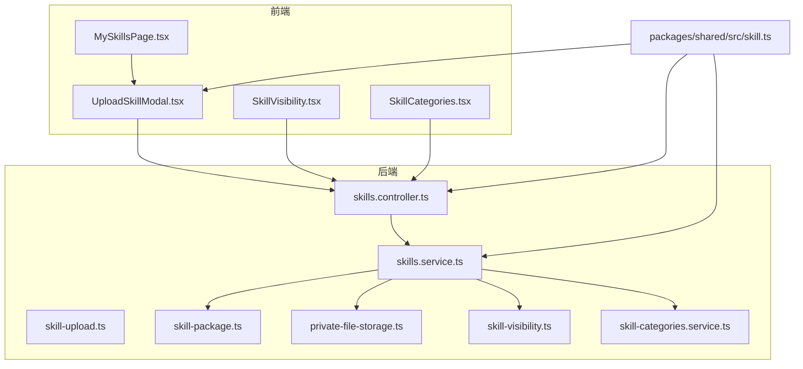
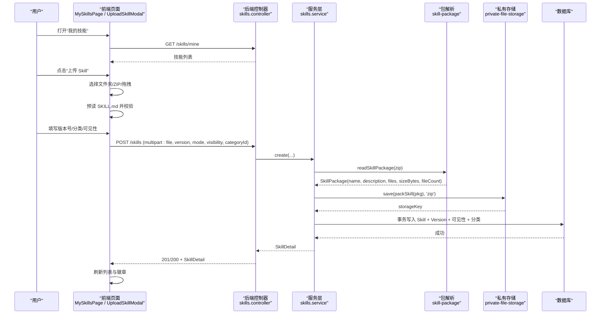
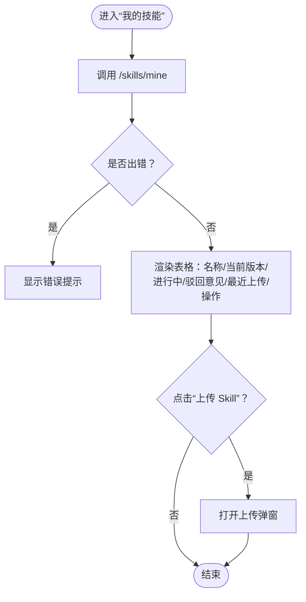
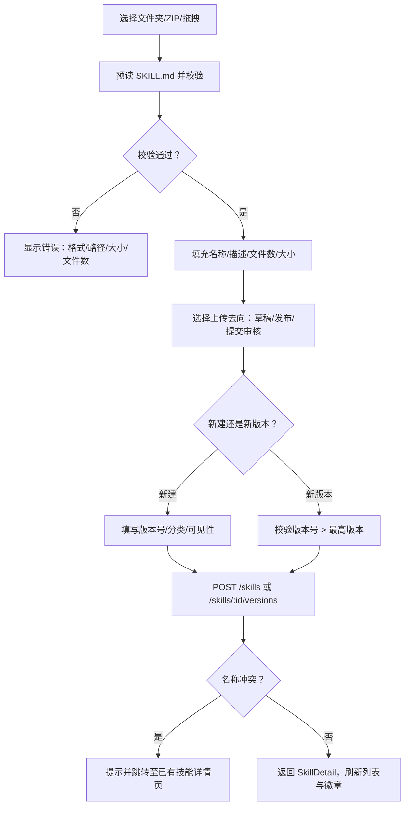
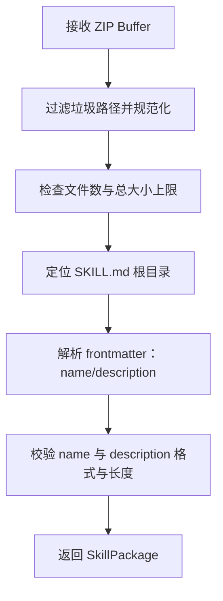
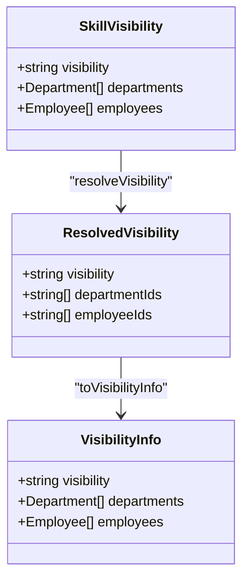
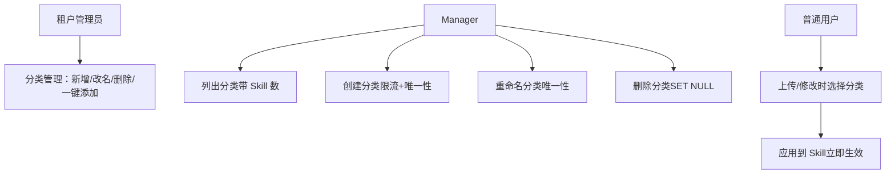
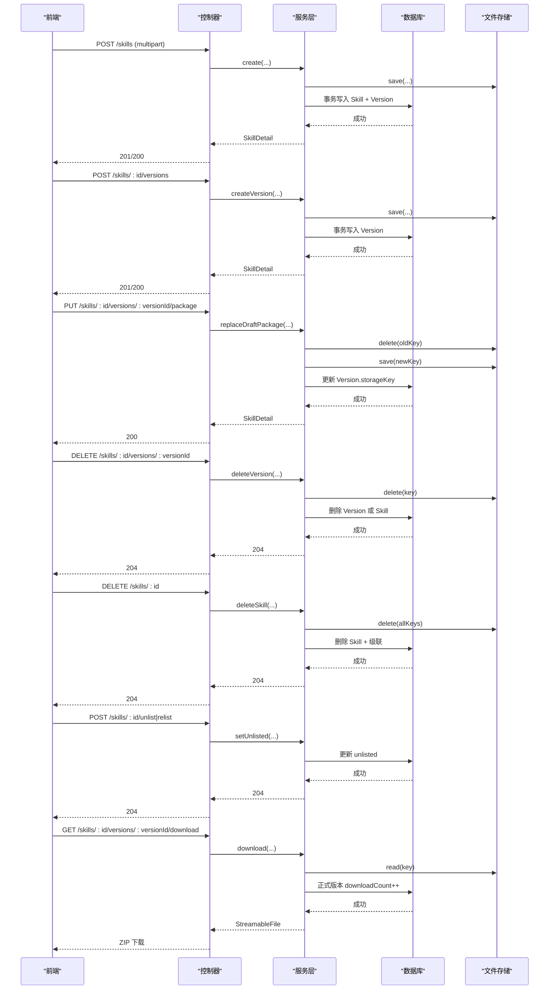
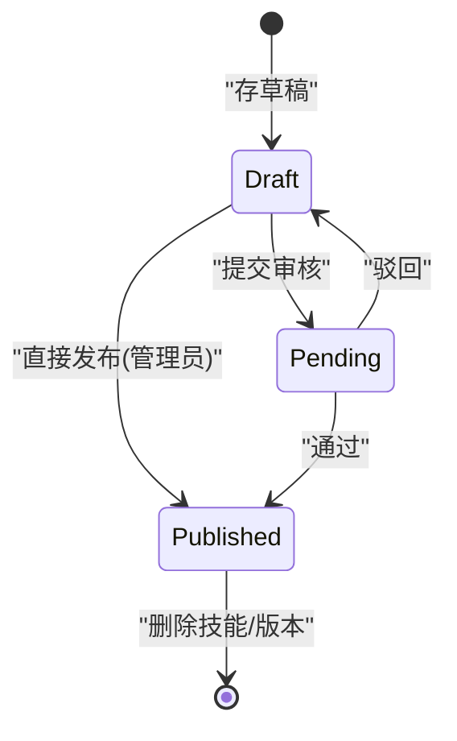
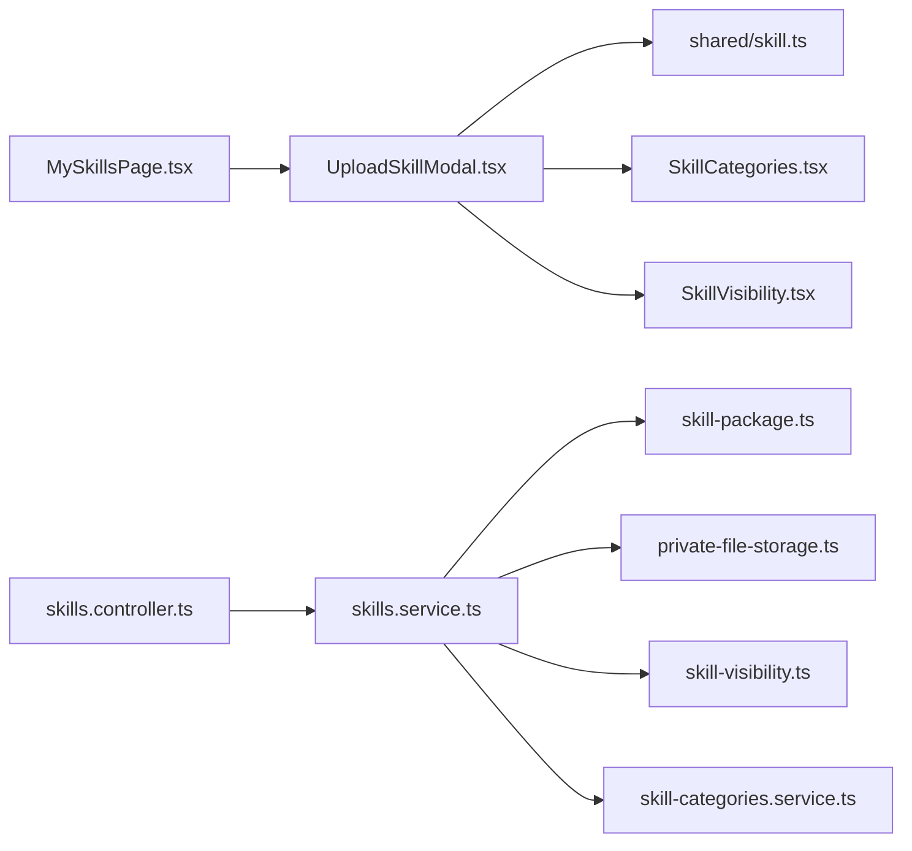

# 我的技能页面

<cite>
**本文引用的文件**   
- [MySkillsPage.tsx](file://apps/web/src/pages/MySkillsPage.tsx)
- [UploadSkillModal.tsx](file://apps/web/src/pages/UploadSkillModal.tsx)
- [SkillManage.tsx](file://apps/web/src/pages/SkillManage.tsx)
- [SkillVisibility.tsx](file://apps/web/src/pages/SkillVisibility.tsx)
- [SkillCategories.tsx](file://apps/web/src/pages/SkillCategories.tsx)
- [skills.controller.ts](file://apps/server/src/skills/skills.controller.ts)
- [skills.service.ts](file://apps/server/src/skills/skills.service.ts)
- [skill-upload.ts](file://apps/server/src/skills/skill-upload.ts)
- [skill-package.ts](file://apps/server/src/skills/skill-package.ts)
- [file-upload.interceptor.ts](file://apps/server/src/storage/file-upload.interceptor.ts)
- [private-file-storage.ts](file://apps/server/src/storage/private-file-storage.ts)
- [skill-visibility.ts](file://apps/server/src/skills/skill-visibility.ts)
- [skill-categories.service.ts](file://apps/server/src/skills/skill-categories.service.ts)
- [skill.ts](file://packages/shared/src/skill.ts)
</cite>

## 目录
1. [引言](#引言)
2. [项目结构](#项目结构)
3. [核心组件](#核心组件)
4. [架构总览](#架构总览)
5. [详细组件分析](#详细组件分析)
6. [依赖关系分析](#依赖关系分析)
7. [性能与容量特性](#性能与容量特性)
8. [故障排查指南](#故障排查指南)
9. [结论](#结论)

## 引言
“我的技能页面”用于管理个人作为所有者的技能包，涵盖上传、编辑、删除、版本控制、可见性与分类管理，以及与后端服务端的完整交互流程。该页面聚焦于：
- 查看本人拥有的技能包及其当前正式版本、进行中的版本和驳回意见。
- 新建技能包、为已有技能包上传新版本、重新上传草稿。
- 设置技能包的可见性（租户可见、特定部门可见、特定员工可见、仅自己可见）与分类。
- 对技能包执行下架/上架、删除等治理操作。
- 保证上传过程的安全校验、数据一致性与状态同步。

## 项目结构
本功能横跨前端页面、服务端控制器与服务层、共享类型定义以及私有文件存储模块。关键文件如下：
- 前端页面：
  - “我的技能”列表页：展示所有者视角的技能包与版本状态。
  - 上传弹窗：支持文件夹、ZIP 拖拽或选择，解析 SKILL.md，填写版本号、分类与可见性。
  - 可见性与分类管理：提供可见性表单、部门树与员工多选；分类增删改与筛选。
- 服务端：
  - 技能控制器：暴露目录、管理视图、“我的技能”、创建/更新/删除、下载等接口。
  - 技能服务：封装业务逻辑，包括上传去向、版本比较、可见性计算、分类校验、事务与并发控制。
  - 上传拦截器与包解析：限制请求大小、解压 ZIP、校验路径与上限、解析 SKILL.md。
  - 私有文件存储：本地磁盘实现，按 key 读写删除，避免静态路由泄露。
- 共享类型：
  - 统一定义技能包常量、SKILL.md 解析、版本号规则、审核状态、可见性模型与管理查询参数。

**图表来源**
- [MySkillsPage.tsx:1-114](file://apps/web/src/pages/MySkillsPage.tsx#L1-L114)
- [UploadSkillModal.tsx:1-269](file://apps/web/src/pages/UploadSkillModal.tsx#L1-L269)
- [SkillVisibility.tsx:1-152](file://apps/web/src/pages/SkillVisibility.tsx#L1-L152)
- [SkillCategories.tsx:1-220](file://apps/web/src/pages/SkillCategories.tsx#L1-L220)
- [skills.controller.ts:1-145](file://apps/server/src/skills/skills.controller.ts#L1-L145)
- [skills.service.ts:1-500](file://apps/server/src/skills/skills.service.ts#L1-L500)
- [skill-upload.ts:1-13](file://apps/server/src/skills/skill-upload.ts#L1-L13)
- [skill-package.ts:1-74](file://apps/server/src/skills/skill-package.ts#L1-L74)
- [private-file-storage.ts:1-41](file://apps/server/src/storage/private-file-storage.ts#L1-L41)
- [skill-visibility.ts:1-107](file://apps/server/src/skills/skill-visibility.ts#L1-L107)
- [skill-categories.service.ts:1-83](file://apps/server/src/skills/skill-categories.service.ts#L1-L83)
- [skill.ts:1-401](file://packages/shared/src/skill.ts#L1-L401)

**章节来源**
- [MySkillsPage.tsx:1-114](file://apps/web/src/pages/MySkillsPage.tsx#L1-L114)
- [UploadSkillModal.tsx:1-269](file://apps/web/src/pages/UploadSkillModal.tsx#L1-L269)
- [SkillVisibility.tsx:1-152](file://apps/web/src/pages/SkillVisibility.tsx#L1-L152)
- [SkillCategories.tsx:1-220](file://apps/web/src/pages/SkillCategories.tsx#L1-L220)
- [skills.controller.ts:1-145](file://apps/server/src/skills/skills.controller.ts#L1-L145)
- [skills.service.ts:1-500](file://apps/server/src/skills/skills.service.ts#L1-L500)
- [skill-upload.ts:1-13](file://apps/server/src/skills/skill-upload.ts#L1-L13)
- [skill-package.ts:1-74](file://apps/server/src/skills/skill-package.ts#L1-L74)
- [private-file-storage.ts:1-41](file://apps/server/src/storage/private-file-storage.ts#L1-L41)
- [skill-visibility.ts:1-107](file://apps/server/src/skills/skill-visibility.ts#L1-L107)
- [skill-categories.service.ts:1-83](file://apps/server/src/skills/skill-categories.service.ts#L1-L83)
- [skill.ts:1-401](file://packages/shared/src/skill.ts#L1-L401)

## 核心组件
- “我的技能”列表页：
  - 调用 `/skills/mine` 获取本人拥有的技能包，显示当前正式版本、进行中的版本、驳回意见与最近上传时间。
  - 提供“上传 Skill”入口，打开上传弹窗；点击“处理/查看”进入详情页。
- 上传弹窗：
  - 支持三种来源：选择文件夹、选择 ZIP、拖拽文件夹或 ZIP。
  - 预读 SKILL.md，自动填充名称、描述、文件数与大小；校验版本号格式与递增规则。
  - 新建时可选分类与可见性；根据身份决定上传去向（存草稿、直接发布、提交审核）。
  - 处理名称冲突：若同名已存在且可访问，引导跳转至已有技能详情页上传新版本。
- 可见性与分类管理：
  - 可见性四种模式：租户可见、特定部门可见、特定员工可见、仅自己可见；修改立即生效并记录审计。
  - 分类由租户管理员维护；可在上传时选择，或在详情页修改；删除分类使关联技能变为未分类。
- 服务端控制器与服务：
  - 提供目录、管理视图、“我的技能”、创建/更新/删除、下载等接口。
  - 封装上传去向、版本比较、可见性计算、分类校验、事务与并发控制。
  - 使用私有文件存储保存技能包，确保文件不通过静态路由公开。

**章节来源**
- [MySkillsPage.tsx:1-114](file://apps/web/src/pages/MySkillsPage.tsx#L1-L114)
- [UploadSkillModal.tsx:1-269](file://apps/web/src/pages/UploadSkillModal.tsx#L1-L269)
- [SkillVisibility.tsx:1-152](file://apps/web/src/pages/SkillVisibility.tsx#L1-L152)
- [SkillCategories.tsx:1-220](file://apps/web/src/pages/SkillCategories.tsx#L1-L220)
- [skills.controller.ts:1-145](file://apps/server/src/skills/skills.controller.ts#L1-L145)
- [skills.service.ts:1-500](file://apps/server/src/skills/skills.service.ts#L1-L500)
- [skill-visibility.ts:1-107](file://apps/server/src/skills/skill-visibility.ts#L1-L107)
- [skill-categories.service.ts:1-83](file://apps/server/src/skills/skill-categories.service.ts#L1-L83)

## 架构总览
“我的技能页面”的端到端流程如下：
- 用户在前端打开“我的技能”页面，加载本人拥有的技能包列表。
- 用户点击“上传 Skill”，在弹窗中选择文件夹或 ZIP，系统预读 SKILL.md 并校验包结构与元数据。
- 用户填写版本号、分类与可见性（新建时），选择上传去向（草稿/发布/提交审核）。
- 前端将 FormData（包含 zip、version、mode、visibility、categoryId）发送至后端。
- 后端通过上传拦截器限制请求大小，再解析 ZIP、校验路径与上限、解析 SKILL.md。
- 服务层校验名称唯一性、版本递增、权限与可见性，写入数据库并持久化文件。
- 返回技能详情，前端刷新列表与徽章，必要时提示审核链接或错误信息。

**图表来源**
- [MySkillsPage.tsx:1-114](file://apps/web/src/pages/MySkillsPage.tsx#L1-L114)
- [UploadSkillModal.tsx:1-269](file://apps/web/src/pages/UploadSkillModal.tsx#L1-L269)
- [skills.controller.ts:47-57](file://apps/server/src/skills/skills.controller.ts#L47-L57)
- [skills.service.ts:224-253](file://apps/server/src/skills/skills.service.ts#L224-L253)
- [skill-package.ts:19-57](file://apps/server/src/skills/skill-package.ts#L19-L57)
- [private-file-storage.ts:23-30](file://apps/server/src/storage/private-file-storage.ts#L23-L30)

## 详细组件分析

### “我的技能”列表页
- 功能要点：
  - 调用 `/skills/mine` 获取本人拥有的技能包。
  - 展示当前正式版本、进行中的版本、驳回意见与最近上传时间。
  - 提供“上传 Skill”入口，打开上传弹窗；点击“处理/查看”进入详情页。
- 交互细节：
  - 列表为空时显示提示；错误时显示 Alert。
  - 进行中的版本状态用标签表示，被驳回的版本标红并显示驳回意见。
  - 上传成功后跳转到详情页。

**图表来源**
- [MySkillsPage.tsx:19-30](file://apps/web/src/pages/MySkillsPage.tsx#L19-L30)
- [MySkillsPage.tsx:35-114](file://apps/web/src/pages/MySkillsPage.tsx#L35-L114)

**章节来源**
- [MySkillsPage.tsx:1-114](file://apps/web/src/pages/MySkillsPage.tsx#L1-L114)

### 上传弹窗与上传流程
- 功能要点：
  - 支持三种来源：选择文件夹、选择 ZIP、拖拽文件夹或 ZIP。
  - 预读 SKILL.md，自动填充名称、描述、文件数与大小；校验版本号格式与递增规则。
  - 新建时可选分类与可见性；根据身份决定上传去向（存草稿、直接发布、提交审核）。
  - 处理名称冲突：若同名已存在且可访问，引导跳转至已有技能详情页上传新版本。
- 上传去向与权限：
  - 租户管理员可选择“直接发布”或“存草稿”。
  - 其他员工可选择“存草稿”或“提交审核”。
- 错误处理：
  - 文件名不一致、版本号无效、名称冲突、网络错误等均有明确提示。
  - 提交审核后刷新待审核徽章，必要时显示审核链接。

**图表来源**
- [UploadSkillModal.tsx:69-130](file://apps/web/src/pages/UploadSkillModal.tsx#L69-L130)
- [UploadSkillModal.tsx:140-269](file://apps/web/src/pages/UploadSkillModal.tsx#L140-L269)
- [skills.controller.ts:47-92](file://apps/server/src/skills/skills.controller.ts#L47-L92)
- [skills.service.ts:224-282](file://apps/server/src/skills/skills.service.ts#L224-L282)

**章节来源**
- [UploadSkillModal.tsx:1-269](file://apps/web/src/pages/UploadSkillModal.tsx#L1-L269)
- [skills.controller.ts:47-92](file://apps/server/src/skills/skills.controller.ts#L47-L92)
- [skills.service.ts:224-282](file://apps/server/src/skills/skills.service.ts#L224-L282)

### ZIP 解析与 SKILL.md 验证
- 解析流程：
  - 忽略垃圾文件（如 .DS_Store、.git、node_modules、__pycache__）。
  - 规范化路径，检测非法路径（绝对路径或含 ..）。
  - 统计文件数与解压后总大小，超过上限则拒绝。
  - 定位 SKILL.md 所在根目录（根目录或唯一顶层文件夹）。
  - 解析 frontmatter，提取 name 与 description，校验长度与格式。
- 安全与健壮性：
  - 使用 fflate 解压并按声明大小截断输出，防止 zip 炸弹。
  - 对非法路径抛出专用错误，转换为中文提示。
  - 对无法解析的压缩包给出明确错误。

**图表来源**
- [skill-package.ts:19-57](file://apps/server/src/skills/skill-package.ts#L19-L57)
- [skill.ts:1-71](file://packages/shared/src/skill.ts#L1-L71)

**章节来源**
- [skill-package.ts:1-74](file://apps/server/src/skills/skill-package.ts#L1-L74)
- [skill.ts:1-71](file://packages/shared/src/skill.ts#L1-L71)

### 可见性设置与权限控制
- 可见性模式：
  - 租户可见：本租户所有员工可看。
  - 特定部门可见：所选部门及其下级部门的员工可看。
  - 特定员工可见：名单中的员工可看（所有者始终在内）。
  - 仅自己可见：只有所有者可看。
- 权限规则：
  - 所有者、租户管理员（与超管）不受可见性限制。
  - 非正式版本（草稿、审核中）只有所有者与租户管理员能看到。
  - 已下架的技能除所有者与管理员外不可见也不可下载。
- 可见性变更：
  - 修改可见性不需要审核，立即生效，并记录审计。
  - 部门变化实时影响可见性（基于员工当前部门）。

**图表来源**
- [skill-visibility.ts:21-27](file://apps/server/src/skills/skill-visibility.ts#L21-L27)
- [skill-visibility.ts:82-106](file://apps/server/src/skills/skill-visibility.ts#L82-L106)

**章节来源**
- [SkillVisibility.tsx:1-152](file://apps/web/src/pages/SkillVisibility.tsx#L1-L152)
- [skill-visibility.ts:1-107](file://apps/server/src/skills/skill-visibility.ts#L1-L107)
- [skill.ts:111-145](file://packages/shared/src/skill.ts#L111-L145)

### 分类管理与筛选
- 分类能力：
  - 租户管理员可新增、改名、删除分类；删除分类使关联技能变为未分类。
  - 一键添加常用分类（研发、办公、电商、行政、财务、法务、HR、运营）。
  - 每个租户最多 50 个分类，名称在租户内唯一。
- 使用场景：
  - 上传时可选择一个分类（可不选）。
  - 详情页可修改分类（立即生效，不需要审核）。
  - 目录与管理视图支持按分类筛选（含“未分类”）。

**图表来源**
- [SkillCategories.tsx:56-141](file://apps/web/src/pages/SkillCategories.tsx#L56-L141)
- [skill-categories.service.ts:20-83](file://apps/server/src/skills/skill-categories.service.ts#L20-L83)

**章节来源**
- [SkillCategories.tsx:1-220](file://apps/web/src/pages/SkillCategories.tsx#L1-L220)
- [skill-categories.service.ts:1-83](file://apps/server/src/skills/skill-categories.service.ts#L1-L83)
- [skill.ts:171-187](file://packages/shared/src/skill.ts#L171-L187)

### 与后端交互逻辑（CRUD 与状态同步）
- 创建技能包：
  - 前端 POST `/skills`，携带 zip、version、mode、visibility、categoryId。
  - 后端校验上传去向、可见性、分类、名称唯一性，写入 Skill 与 Version，持久化文件。
- 上传新版本：
  - 前端 POST `/skills/:id/versions`，携带 zip、version、mode。
  - 后端校验权限、名称一致性、版本递增、并发冲突，写入新 Version。
- 重新上传草稿：
  - 前端 PUT `/skills/:id/versions/:versionId/package`，携带 zip。
  - 后端校验草稿状态与所有权，替换存储键，记录审计。
- 删除版本/技能：
  - 前端 DELETE `/skills/:id/versions/:versionId` 或 `/skills/:id`。
  - 后端校验权限，删除版本或整个 Skill，清理存储文件。
- 下架/上架：
  - 前端 POST `/skills/:id/unlist` 或 `/skills/:id/relist`。
  - 后端校验权限，更新 unlisted 标志，记录审计。
- 下载：
  - 前端 GET `/skills/:id/versions/:versionId/download`。
  - 后端读取文件，正式版本下载次数 +1。

**图表来源**
- [skills.controller.ts:47-143](file://apps/server/src/skills/skills.controller.ts#L47-L143)
- [skills.service.ts:224-438](file://apps/server/src/skills/skills.service.ts#L224-L438)
- [private-file-storage.ts:23-39](file://apps/server/src/storage/private-file-storage.ts#L23-L39)

**章节来源**
- [skills.controller.ts:1-145](file://apps/server/src/skills/skills.controller.ts#L1-L145)
- [skills.service.ts:1-500](file://apps/server/src/skills/skills.service.ts#L1-L500)

### 文件上传进度反馈、错误处理与重试机制
- 进度反馈：
  - 前端在上传过程中禁用按钮并显示 loading。
  - 上传成功后显示成功消息，刷新徽章与列表。
- 错误处理：
  - 前端捕获 ApiError，区分 409 名称冲突与其他错误。
  - 后端对非法路径、超限、格式错误、权限不足、并发冲突等返回明确错误。
- 重试机制：
  - 前端未实现自动重试；建议在网络不稳定时由上层 UI 提供重试按钮。
  - 后端对幂等操作（如下架/上架）返回 409 重复操作错误，前端应提示用户。

**章节来源**
- [UploadSkillModal.tsx:81-130](file://apps/web/src/pages/UploadSkillModal.tsx#L81-L130)
- [file-upload.interceptor.ts:1-28](file://apps/server/src/storage/file-upload.interceptor.ts#L1-L28)
- [skills.service.ts:459-468](file://apps/server/src/skills/skills.service.ts#L459-L468)

### 技能包生命周期管理与数据一致性
- 生命周期：
  - 草稿 → 审核中 → 正式（或通过直接发布成为正式）。
  - 被驳回退回草稿，可重新上传并再次提交。
- 一致性保证：
  - 使用数据库事务确保 Skill、Version、可见性、分类写入原子性。
  - 文件先落盘再写库，失败时回滚删除临时文件。
  - 并发控制：对 Skill 行加锁，串行化上传新版本与删除版本。
  - 版本比较：严格大于已有最高版本，防止回退。
  - 名称唯一性：租户内唯一，并发冲突时返回 409 并提示。

**图表来源**
- [skills.service.ts:99-108](file://apps/server/src/skills/skills.service.ts#L99-L108)
- [skills.service.ts:259-282](file://apps/server/src/skills/skills.service.ts#L259-L282)
- [skills.service.ts:330-354](file://apps/server/src/skills/skills.service.ts#L330-L354)

**章节来源**
- [skills.service.ts:99-108](file://apps/server/src/skills/skills.service.ts#L99-L108)
- [skills.service.ts:259-282](file://apps/server/src/skills/skills.service.ts#L259-L282)
- [skills.service.ts:330-354](file://apps/server/src/skills/skills.service.ts#L330-L354)
- [skill.ts:92-109](file://packages/shared/src/skill.ts#L92-L109)

## 依赖关系分析
- 前端依赖：
  - MySkillsPage 依赖 UploadSkillModal 与 api。
  - UploadSkillModal 依赖 shared 类型、session、skillSource、SkillCategories、SkillVisibility。
- 后端依赖：
  - SkillsController 依赖 SkillsService、SkillUploadInterceptor、Auth 装饰器。
  - SkillsService 依赖 PrismaService、PrivateFileStorage、SkillCategoriesService、SkillVisibility 工具。
  - SkillPackage 依赖 shared 常量与 fflate。
- 外部依赖：
  - fflate 用于 ZIP 解压与打包。
  - Prisma 用于数据库访问与事务。
  - Node fs/promises 用于本地文件读写。

**图表来源**
- [MySkillsPage.tsx:1-114](file://apps/web/src/pages/MySkillsPage.tsx#L1-L114)
- [UploadSkillModal.tsx:1-269](file://apps/web/src/pages/UploadSkillModal.tsx#L1-L269)
- [skills.controller.ts:1-145](file://apps/server/src/skills/skills.controller.ts#L1-L145)
- [skills.service.ts:1-500](file://apps/server/src/skills/skills.service.ts#L1-L500)
- [skill-package.ts:1-74](file://apps/server/src/skills/skill-package.ts#L1-L74)
- [private-file-storage.ts:1-41](file://apps/server/src/storage/private-file-storage.ts#L1-L41)
- [skill-visibility.ts:1-107](file://apps/server/src/skills/skill-visibility.ts#L1-L107)
- [skill-categories.service.ts:1-83](file://apps/server/src/skills/skill-categories.service.ts#L1-L83)
- [skill.ts:1-401](file://packages/shared/src/skill.ts#L1-L401)

**章节来源**
- [MySkillsPage.tsx:1-114](file://apps/web/src/pages/MySkillsPage.tsx#L1-L114)
- [UploadSkillModal.tsx:1-269](file://apps/web/src/pages/UploadSkillModal.tsx#L1-L269)
- [skills.controller.ts:1-145](file://apps/server/src/skills/skills.controller.ts#L1-L145)
- [skills.service.ts:1-500](file://apps/server/src/skills/skills.service.ts#L1-L500)

## 性能与容量特性
- 容量限制：
  - 技能包解压后最大 20MB，最多 500 个文件。
  - 上传请求体略大于解压上限以容纳压缩开销。
- 性能考虑：
  - ZIP 解压使用 fflate，按声明大小截断输出，避免内存爆炸。
  - 文件先落盘再写库，减少数据库事务持有时间。
  - 目录与管理视图查询优化：只取必要字段与关系。
- 可扩展性：
  - 私有文件存储抽象类便于替换为对象存储（OSS）。
  - 分类与可见性独立模块，便于扩展策略。

**章节来源**
- [skill.ts:3-21](file://packages/shared/src/skill.ts#L3-L21)
- [skill-upload.ts:1-13](file://apps/server/src/skills/skill-upload.ts#L1-L13)
- [skill-package.ts:19-57](file://apps/server/src/skills/skill-package.ts#L19-L57)
- [private-file-storage.ts:1-41](file://apps/server/src/storage/private-file-storage.ts#L1-L41)

## 故障排查指南
- 上传失败：
  - 检查是否为 ZIP 格式，路径是否合法，是否包含非法路径（绝对路径或 ..）。
  - 检查文件数与解压后大小是否超限。
  - 检查 SKILL.md 是否存在于根目录或唯一顶层文件夹，frontmatter 是否正确。
- 名称冲突：
  - 若同名已存在且可访问，前端会提示跳转至已有技能详情页上传新版本。
  - 若同名存在但不可访问，前端提示更换名称。
- 版本号错误：
  - 版本号必须为 x.y.z 格式，且严格大于已有最高版本。
- 权限问题：
  - 只有所有者与租户管理员可上传新版本、修改可见性/分类、删除技能。
  - 非正式版本只有所有者与租户管理员可见。
- 下架/上架重复操作：
  - 重复下架或上架返回 409，前端应提示用户。
- 下载失败：
  - 确认版本存在且可访问；正式版本下载次数会在成功读取后 +1。

**章节来源**
- [skill-package.ts:19-57](file://apps/server/src/skills/skill-package.ts#L19-L57)
- [skills.service.ts:224-282](file://apps/server/src/skills/skills.service.ts#L224-L282)
- [skills.service.ts:388-409](file://apps/server/src/skills/skills.service.ts#L388-L409)
- [skills.service.ts:430-438](file://apps/server/src/skills/skills.service.ts#L430-L438)

## 结论
“我的技能页面”提供了完整的个人技能包管理能力，覆盖上传、编辑、删除、版本控制、可见性与分类管理，并通过严格的校验、事务与并发控制保证数据一致性与安全性。前端提供友好的交互与错误提示，后端通过模块化设计实现清晰的职责分离与可扩展性。建议在网络不稳定场景下增加重试机制，并在未来引入对象存储以提升文件系统的可靠性与扩展能力。