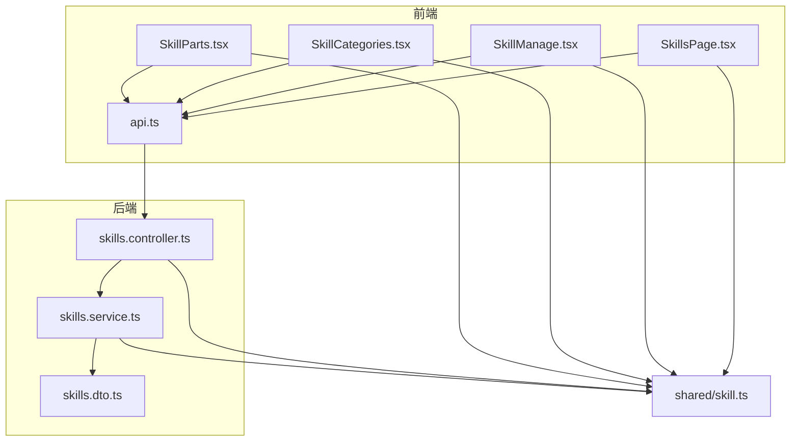
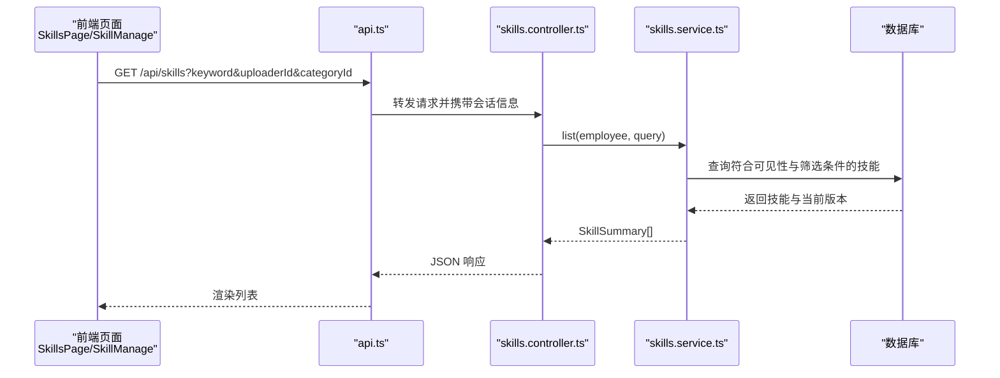
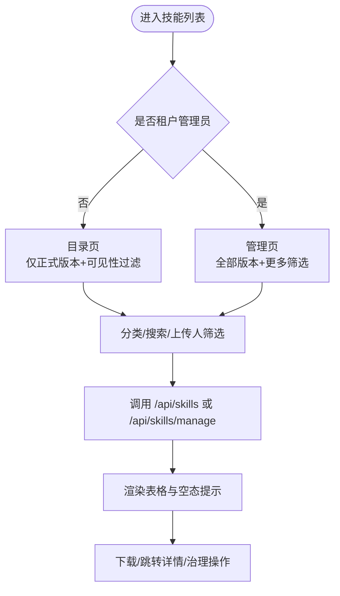
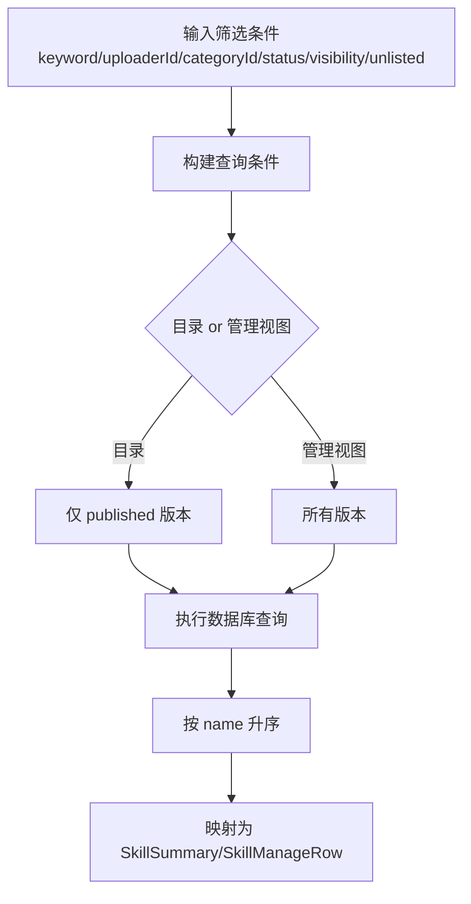
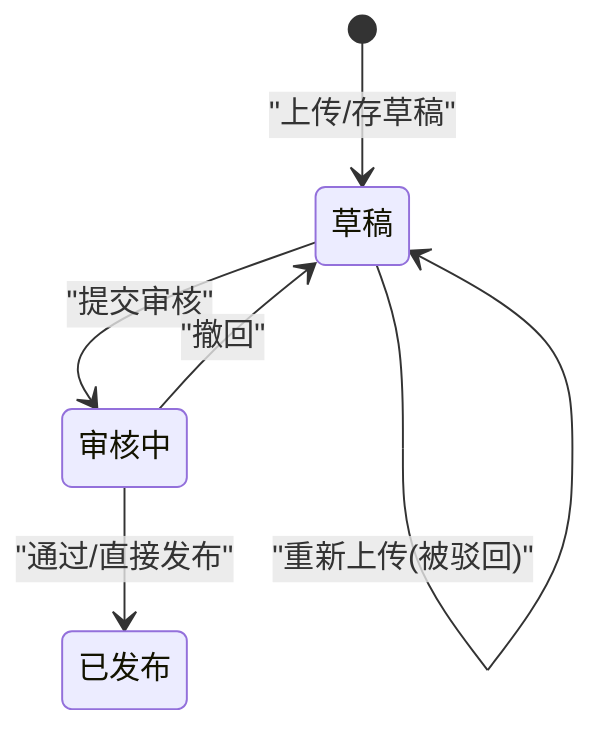
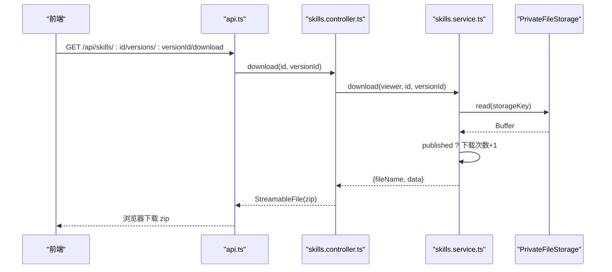
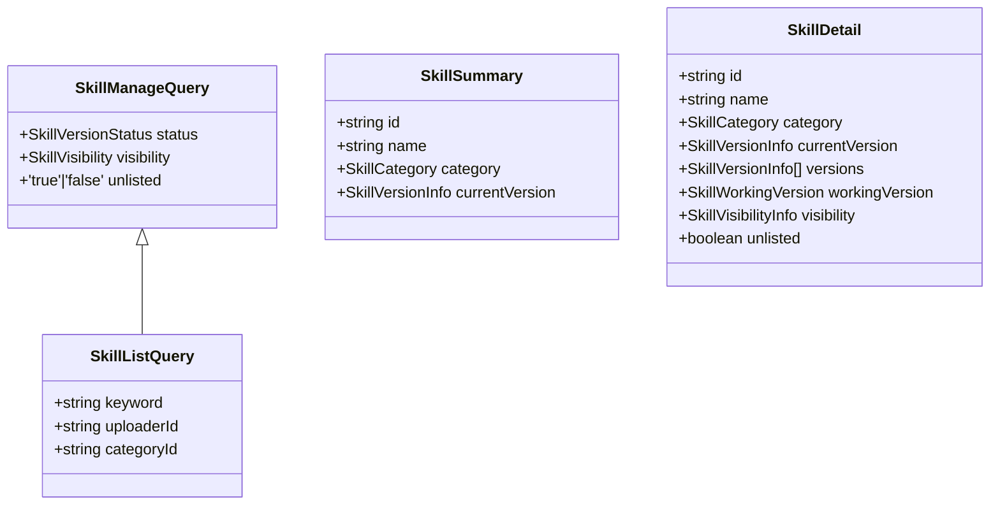
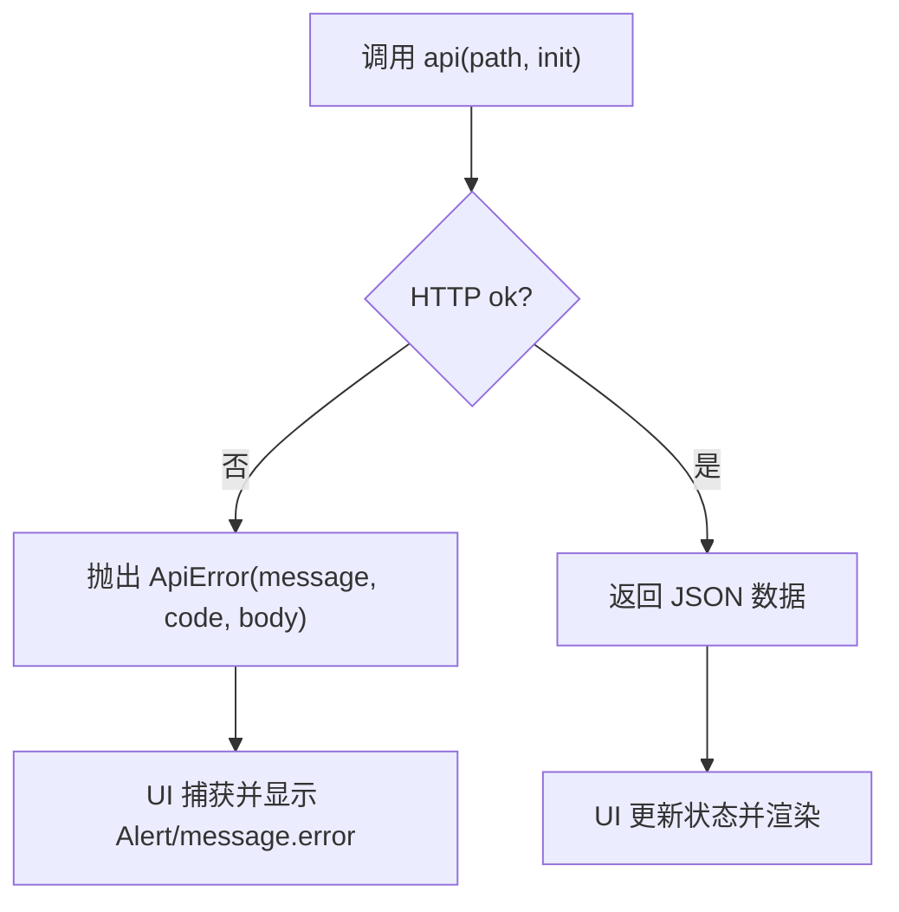

# 技能列表页面

<cite>
**本文引用的文件**   
- [SkillsPage.tsx](file://apps/web/src/pages/SkillsPage.tsx)
- [SkillManage.tsx](file://apps/web/src/pages/SkillManage.tsx)
- [SkillCategories.tsx](file://apps/web/src/pages/SkillCategories.tsx)
- [SkillParts.tsx](file://apps/web/src/pages/SkillParts.tsx)
- [api.ts](file://apps/web/src/api.ts)
- [skills.controller.ts](file://apps/server/src/skills/skills.controller.ts)
- [skills.service.ts](file://apps/server/src/skills/skills.service.ts)
- [skills.dto.ts](file://apps/server/src/skills/skills.dto.ts)
- [skill.ts](file://packages/shared/src/skill.ts)
</cite>

## 目录
1. [引言](#引言)
2. [项目结构与职责划分](#项目结构与职责划分)
3. [核心组件与数据模型](#核心组件与数据模型)
4. [架构总览](#架构总览)
5. [技能列表展示逻辑](#技能列表展示逻辑)
6. [分类、搜索过滤与排序](#分类搜索过滤与排序)
7. [分页与性能优化策略](#分页与性能优化策略)
8. [状态标识与权限控制](#状态标识与权限控制)
9. [预览、版本管理与下载机制](#预览版本管理与下载机制)
10. [后端 API 交互契约](#后端-api-交互契约)
11. [错误处理与用户反馈](#错误处理与用户反馈)
12. [常见问题排查](#常见问题排查)
13. [结论](#结论)

## 引言
本文件面向“技能列表页面”的完整实现说明，覆盖前端展示、筛选与交互，以及后端查询、权限与版本管理。重点包括：
- 技能包的分类显示、搜索过滤与排序
- 草稿、审核中、已发布等状态标识与可见性控制
- 预览、版本历史、下载与审计记录
- 前后端数据契约、查询条件与排序逻辑
- 性能优化建议（懒加载、缓存、更新监听）
- 用户交互反馈与错误处理

## 项目结构与职责划分
- 前端页面层
  - SkillsPage：技能目录页、详情页、进行中的版本卡片、版本历史卡片
  - SkillManage：通用筛选条、管理视图表格、治理操作按钮
  - SkillCategories：分类数据、分类筛选栏、分类管理弹窗
  - SkillParts：时间格式化、下载链接、状态标签、审核记录表、审核链接工具
  - api：统一 HTTP 封装与错误类型
- 后端服务层
  - skills.controller：REST 路由、鉴权装饰器、参数绑定
  - skills.service：业务逻辑、权限校验、查询构建、事务与存储协调
  - skills.dto：请求 DTO 与校验规则
- 共享类型
  - skill.ts：技能包规范、版本、可见性、分类、查询结构等公共类型

**图表来源**
- [SkillsPage.tsx:1-15](file://apps/web/src/pages/SkillsPage.tsx#L1-L15)
- [SkillManage.tsx:1-24](file://apps/web/src/pages/SkillManage.tsx#L1-L24)
- [SkillCategories.tsx:1-15](file://apps/web/src/pages/SkillCategories.tsx#L1-L15)
- [SkillParts.tsx:1-15](file://apps/web/src/pages/SkillParts.tsx#L1-L15)
- [api.ts:1-31](file://apps/web/src/api.ts#L1-L31)
- [skills.controller.ts:1-10](file://apps/server/src/skills/skills.controller.ts#L1-L10)
- [skills.service.ts:1-25](file://apps/server/src/skills/skills.service.ts#L1-L25)
- [skills.dto.ts:1-19](file://apps/server/src/skills/skills.dto.ts#L1-L19)
- [skill.ts:1-10](file://packages/shared/src/skill.ts#L1-L10)

**章节来源**
- [SkillsPage.tsx:1-79](file://apps/web/src/pages/SkillsPage.tsx#L1-L79)
- [SkillManage.tsx:25-112](file://apps/web/src/pages/SkillManage.tsx#L25-L112)
- [SkillCategories.tsx:15-54](file://apps/web/src/pages/SkillCategories.tsx#L15-L54)
- [SkillParts.tsx:1-15](file://apps/web/src/pages/SkillParts.tsx#L1-L15)
- [api.ts:15-31](file://apps/web/src/api.ts#L15-L31)
- [skills.controller.ts:11-45](file://apps/server/src/skills/skills.controller.ts#L11-L45)
- [skills.service.ts:114-136](file://apps/server/src/skills/skills.service.ts#L114-L136)
- [skills.dto.ts:115-145](file://apps/server/src/skills/skills.dto.ts#L115-L145)
- [skill.ts:198-330](file://packages/shared/src/skill.ts#L198-L330)

## 核心组件与数据模型
- 列表数据模型
  - SkillSummary：包含 id、name、category、currentVersion（当前正式版本）
  - SkillDetail：包含名称、所有者、分类、可见性、当前版本、版本历史、进行中版本、审核记录、是否下架等
  - SkillVersionInfo：版本号、描述、上传者、上传时间、文件大小、下载次数
  - SkillWorkingVersion：非正式版本（草稿/审核中），含驳回意见、上传者身份标记
- 查询模型
  - SkillListQuery：keyword、uploaderId、categoryId
  - SkillManageQuery：在 SkillListQuery 基础上增加 status、visibility、unlisted
- 分类与可见性
  - SkillCategory：id、name
  - SkillVisibility：tenant/departments/employees/private
  - SkillVisibilityOptions：部门树与在职员工列表

**章节来源**
- [skill.ts:198-330](file://packages/shared/src/skill.ts#L198-L330)
- [skills.service.ts:126-168](file://apps/server/src/skills/skills.service.ts#L126-L168)
- [skills.dto.ts:115-145](file://apps/server/src/skills/skills.dto.ts#L115-L145)

## 架构总览
技能列表页面采用“前端页面 + 共享类型 + 后端控制器 + 服务层”的分层架构：
- 前端通过 api.ts 调用 /api/skills 系列接口
- 控制器负责鉴权、参数解析与路由分发
- 服务层负责权限判断、查询构建、事务与存储协调
- 共享类型保证前后端数据结构一致

**图表来源**
- [SkillsPage.tsx:82-146](file://apps/web/src/pages/SkillsPage.tsx#L82-L146)
- [api.ts:15-31](file://apps/web/src/api.ts#L15-L31)
- [skills.controller.ts:17-21](file://apps/server/src/skills/skills.controller.ts#L17-L21)
- [skills.service.ts:126-136](file://apps/server/src/skills/skills.service.ts#L126-L136)

## 技能列表展示逻辑
- 目录页（普通员工）
  - 仅展示本租户内“有正式版本”且对当前用户可见的技能
  - 支持按名称或描述搜索、按上传人筛选、按分类筛选
  - 列表字段：名称、分类、当前版本、上传人、上传时间、操作（下载）
- 管理页（租户管理员）
  - 展示本租户全部技能（含草稿、审核中、已下架）
  - 支持按审核状态、可见性、是否下架、分类筛选
  - 列表字段：名称、分类、当前版本、进行中状态、可见性、所有者、更新时间
- 详情页
  - 展示当前版本、版本历史、进行中版本（若存在）、审核记录
  - 所有者与管理者可修改分类、可见性、上传新版本、删除版本或技能

**图表来源**
- [SkillsPage.tsx:33-79](file://apps/web/src/pages/SkillsPage.tsx#L33-L79)
- [SkillsPage.tsx:82-146](file://apps/web/src/pages/SkillsPage.tsx#L82-L146)
- [SkillManage.tsx:114-186](file://apps/web/src/pages/SkillManage.tsx#L114-L186)

**章节来源**
- [SkillsPage.tsx:33-79](file://apps/web/src/pages/SkillsPage.tsx#L33-L79)
- [SkillsPage.tsx:82-146](file://apps/web/src/pages/SkillsPage.tsx#L82-L146)
- [SkillManage.tsx:114-186](file://apps/web/src/pages/SkillManage.tsx#L114-L186)

## 分类、搜索过滤与排序
- 分类显示
  - 目录顶部提供“全部 + 各分类”的可切换标签
  - 未分类以占位文本显示；管理视图支持“未分类”选项
- 搜索过滤
  - 关键词：匹配技能名称或任一版本的描述（不区分大小写）
  - 上传人：按曾上传过该技能任一版本的员工筛选
  - 分类：精确匹配所选分类或未分类
  - 管理视图额外支持：审核状态、可见性、是否下架
- 排序逻辑
  - 目录与管理视图均按技能名称升序排序
  - 版本历史按版本号从新到旧排序

**图表来源**
- [skills.service.ts:58-82](file://apps/server/src/skills/skills.service.ts#L58-L82)
- [skills.service.ts:126-168](file://apps/server/src/skills/skills.service.ts#L126-L168)
- [skills.dto.ts:115-145](file://apps/server/src/skills/skills.dto.ts#L115-L145)

**章节来源**
- [SkillCategories.tsx:38-54](file://apps/web/src/pages/SkillCategories.tsx#L38-L54)
- [SkillManage.tsx:32-112](file://apps/web/src/pages/SkillManage.tsx#L32-L112)
- [skills.service.ts:58-82](file://apps/server/src/skills/skills.service.ts#L58-L82)
- [skills.service.ts:126-168](file://apps/server/src/skills/skills.service.ts#L126-L168)
- [skills.dto.ts:115-145](file://apps/server/src/skills/skills.dto.ts#L115-L145)

## 分页与性能优化策略
- 当前实现
  - 列表使用 antd Table 且关闭分页（pagination=false），一次性加载符合条件的数据
  - 详情与版本历史也关闭分页
- 潜在风险
  - 当技能数量较大时，全量加载会影响首屏与滚动性能
- 推荐优化
  - 懒加载：首次只加载前 N 条，滚动到底部再加载更多
  - 服务端分页：引入 page/pageSize 参数，后端返回 total/items
  - 客户端缓存：对分类、上传人选项做短期缓存，减少重复请求
  - 数据更新监听：分类变更、上传完成、审核通过后触发局部刷新或全局重拉取
  - 去抖搜索：关键词输入后延迟发起请求，避免频繁刷新

[本节为通用性能建议，不直接分析具体代码文件]

## 状态标识与权限控制
- 版本状态
  - 草稿（draft）：可编辑、删除（所有者或上传者），可提交审核
  - 审核中（pending）：可撤回，等待租户管理员审核
  - 已发布（published）：成为当前版本，所有可见用户可下载
- 可见性
  - 租户可见、特定部门可见、特定员工可见、仅自己可见
  - 非正式版本只有所有者与租户管理员能看到；尚无正式版本的技能对其他员工不可见
- 权限控制
  - 所有者：上传新版本、修改分类/可见性、删除自己的草稿
  - 租户管理员：直接发布、下架/上架、删除任意版本或技能、查看管理视图
  - 超管：跨租户治理（不在本页面范围内）

**图表来源**
- [skill.ts:92-109](file://packages/shared/src/skill.ts#L92-L109)
- [skills.service.ts:99-108](file://apps/server/src/skills/skills.service.ts#L99-L108)
- [SkillsPage.tsx:321-430](file://apps/web/src/pages/SkillsPage.tsx#L321-L430)

**章节来源**
- [skill.ts:92-149](file://packages/shared/src/skill.ts#L92-L149)
- [skills.service.ts:110-144](file://apps/server/src/skills/skills.service.ts#L110-L144)
- [SkillsPage.tsx:152-319](file://apps/web/src/pages/SkillsPage.tsx#L152-L319)
- [SkillsPage.tsx:321-430](file://apps/web/src/pages/SkillsPage.tsx#L321-L430)

## 预览、版本管理与下载机制
- 预览
  - 列表项显示当前版本的描述摘要
  - 详情页展示 SKILL.md 正文（安全渲染，不执行脚本）
- 版本管理
  - 版本历史：列出所有正式版本，标注当前版本
  - 进行中版本：显示状态、驳回意见、可用操作（提交/撤回/重新上传/删除）
  - 版本号校验：必须严格大于已有最高版本
- 下载机制
  - 列表与详情页均可下载当前版本或指定版本
  - 下载接口对正式版本计数下载次数，非正式版本不计数

**图表来源**
- [SkillParts.tsx:13-14](file://apps/web/src/pages/SkillParts.tsx#L13-L14)
- [skills.controller.ts:135-143](file://apps/server/src/skills/skills.controller.ts#L135-L143)
- [skills.service.ts:430-438](file://apps/server/src/skills/skills.service.ts#L430-L438)

**章节来源**
- [SkillsPage.tsx:152-319](file://apps/web/src/pages/SkillsPage.tsx#L152-L319)
- [SkillsPage.tsx:432-488](file://apps/web/src/pages/SkillsPage.tsx#L432-L488)
- [SkillParts.tsx:79-90](file://apps/web/src/pages/SkillParts.tsx#L79-L90)
- [skills.controller.ts:135-143](file://apps/server/src/skills/skills.controller.ts#L135-L143)
- [skills.service.ts:430-438](file://apps/server/src/skills/skills.service.ts#L430-L438)

## 后端 API 交互契约
- 列表接口
  - GET /api/skills
  - 查询参数：keyword、uploaderId、categoryId
  - 返回：SkillSummary[]
- 管理接口
  - GET /api/skills/manage
  - 查询参数：status、visibility、unlisted（继承 SkillListQuery）
  - 返回：SkillManageRow[]
- 详情接口
  - GET /api/skills/:id
  - 返回：SkillDetail
- 下载接口
  - GET /api/skills/:id/versions/:versionId/download
  - 返回：zip 流
- 其他相关接口
  - GET /api/skills/visibility-options：获取部门与员工选项
  - POST/PATCH/DELETE：创建、修改可见性/分类、删除版本/技能等

**图表来源**
- [skills.dto.ts:115-145](file://apps/server/src/skills/skills.dto.ts#L115-L145)
- [skill.ts:198-330](file://packages/shared/src/skill.ts#L198-L330)

**章节来源**
- [skills.controller.ts:17-45](file://apps/server/src/skills/skills.controller.ts#L17-L45)
- [skills.controller.ts:135-143](file://apps/server/src/skills/skills.controller.ts#L135-L143)
- [skills.dto.ts:115-145](file://apps/server/src/skills/skills.dto.ts#L115-L145)
- [skill.ts:198-330](file://packages/shared/src/skill.ts#L198-L330)

## 错误处理与用户反馈
- 统一错误封装
  - api.ts 将非 2xx 响应包装为 ApiError，携带 message/code/body
- 列表与详情
  - 请求失败时设置 error 状态并显示 Alert
  - 成功时清空 error 状态
- 治理与版本操作
  - 使用 Ant Design 的 message.success/error 反馈结果
  - 危险操作使用 Popconfirm 二次确认
- 名称冲突
  - 新建或上传新版本时，若名称已存在，返回 409 并附带已有技能 id（若可见），引导跳转到详情页上传新版本

**图表来源**
- [api.ts:15-31](file://apps/web/src/api.ts#L15-L31)
- [SkillsPage.tsx:94-101](file://apps/web/src/pages/SkillsPage.tsx#L94-L101)
- [SkillManage.tsx:138-147](file://apps/web/src/pages/SkillManage.tsx#L138-L147)

**章节来源**
- [api.ts:1-31](file://apps/web/src/api.ts#L1-L31)
- [SkillsPage.tsx:94-101](file://apps/web/src/pages/SkillsPage.tsx#L94-L101)
- [SkillManage.tsx:138-147](file://apps/web/src/pages/SkillManage.tsx#L138-L147)
- [skills.service.ts:449-457](file://apps/server/src/skills/skills.service.ts#L449-L457)

## 常见问题排查
- 列表为空
  - 检查是否有正式版本且对当前用户可见
  - 检查分类筛选是否误选
  - 检查关键词与上传人筛选条件
- 无法下载
  - 确认版本是否为正式版本或具有访问权限
  - 检查网络与后端下载接口是否正常
- 名称冲突
  - 新建或上传新版本时报 409，根据返回的 skillId 跳转到详情页上传新版本
- 审核流程异常
  - 草稿可重新上传；审核中需先撤回；被驳回会保留驳回意见

**章节来源**
- [skills.service.ts:224-253](file://apps/server/src/skills/skills.service.ts#L224-L253)
- [skills.service.ts:259-282](file://apps/server/src/skills/skills.service.ts#L259-L282)
- [skills.service.ts:330-354](file://apps/server/src/skills/skills.service.ts#L330-L354)

## 结论
技能列表页面通过清晰的前后端分层与共享类型契约，实现了技能包的分类展示、搜索过滤、状态标识与权限控制，并提供完善的版本管理与下载机制。当前实现以全量加载为主，建议在数据规模增长时引入服务端分页与客户端缓存，并结合分类/上传完成等事件进行增量更新，以提升性能与用户体验。