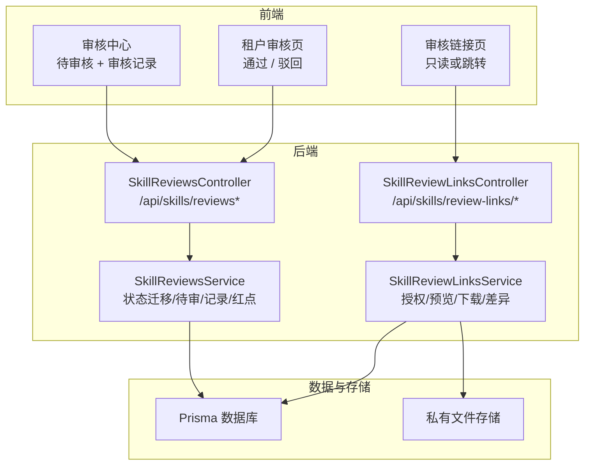
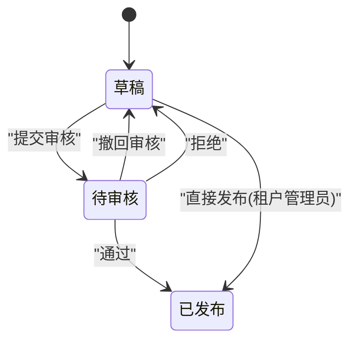
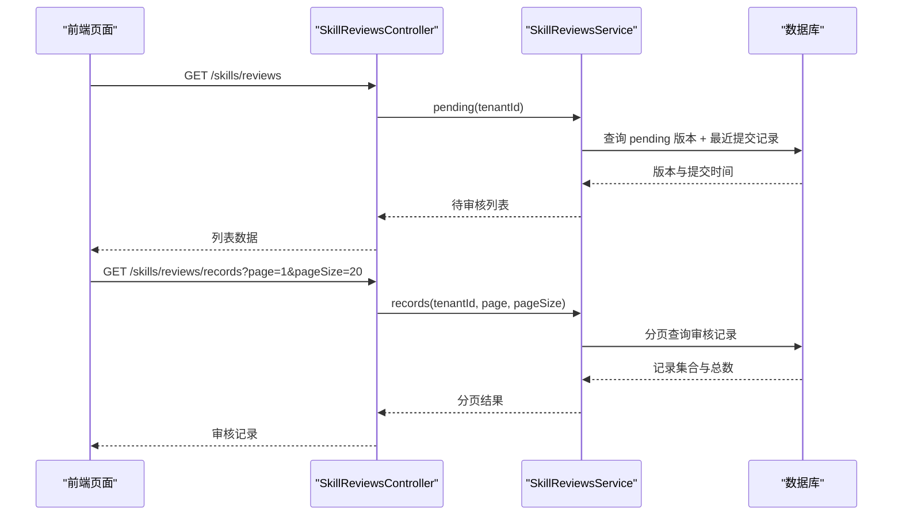
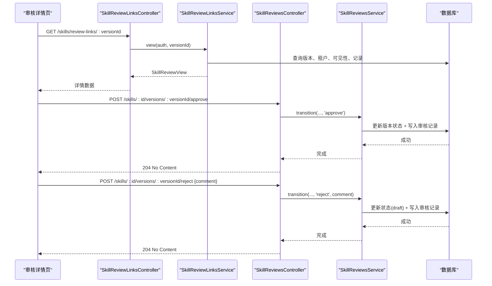
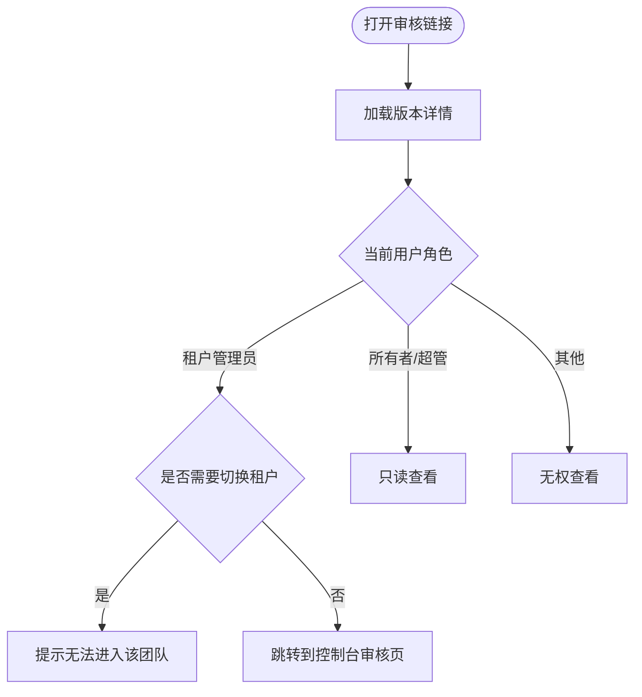
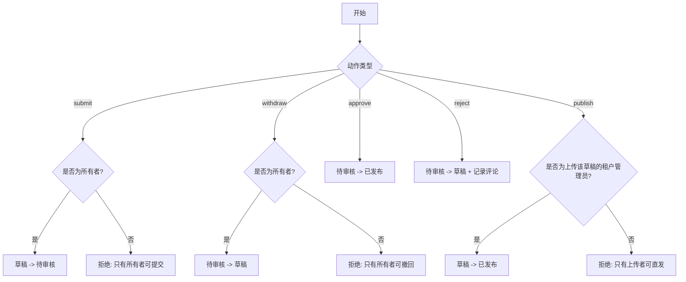
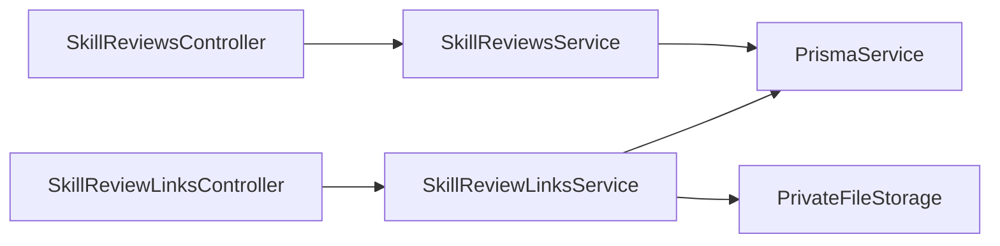

# 技能审核页面

<cite>
**本文引用的文件**   
- [SkillReviewPages.tsx](file://apps/web/src/pages/SkillReviewPages.tsx)
- [skill-reviews.controller.ts](file://apps/server/src/skills/skill-reviews.controller.ts)
- [skill-reviews.service.ts](file://apps/server/src/skills/skill-reviews.service.ts)
- [skill-review-links.controller.ts](file://apps/server/src/skills/skill-review-links.controller.ts)
- [skill-review-links.service.ts](file://apps/server/src/skills/skill-review-links.service.ts)
- [schema.prisma](file://apps/server/prisma/schema.prisma)
</cite>

## 目录
1. [引言](#引言)
2. [项目结构](#项目结构)
3. [核心组件](#核心组件)
4. [架构总览](#架构总览)
5. [详细组件分析](#详细组件分析)
6. [依赖关系分析](#依赖关系分析)
7. [性能与并发特性](#性能与并发特性)
8. [安全、权限与审计](#安全权限与审计)
9. [故障排查指南](#故障排查指南)
10. [结论](#结论)

## 引言
本文件面向“技能审核页面”的完整实现，覆盖待审核列表、审核详情查看、操作按钮、审核表单设计、审核决策逻辑、审核历史记录机制、通知机制、权限验证、数据安全保护与操作审计。文档以代码为依据，提供架构图、流程图和时序图，帮助非技术读者也能理解审核工作流。

## 项目结构
技能审核功能由前端页面与后端控制器/服务共同实现：
- 前端页面负责展示待审核列表、审核详情、差异对比、审核记录以及驳回意见输入等交互。
- 后端控制器暴露审核相关 API，服务层封装状态迁移、数据查询与权限校验。
- 数据库模型定义版本状态、审核动作与审核记录。

图表来源
- [SkillReviewPages.tsx:22-34](file://apps/web/src/pages/SkillReviewPages.tsx#L22-L34)
- [skill-reviews.controller.ts:12-75](file://apps/server/src/skills/skill-reviews.controller.ts#L12-L75)
- [skill-review-links.controller.ts:11-32](file://apps/server/src/skills/skill-review-links.controller.ts#L11-L32)
- [skill-reviews.service.ts:47-112](file://apps/server/src/skills/skill-reviews.service.ts#L47-L112)
- [skill-review-links.service.ts:68-146](file://apps/server/src/skills/skill-review-links.service.ts#L68-L146)

章节来源
- [SkillReviewPages.tsx:22-34](file://apps/web/src/pages/SkillReviewPages.tsx#L22-L34)
- [skill-reviews.controller.ts:12-75](file://apps/server/src/skills/skill-reviews.controller.ts#L12-L75)
- [skill-review-links.controller.ts:11-32](file://apps/server/src/skills/skill-review-links.controller.ts#L11-L32)

## 核心组件
- 待审核列表：列出当前租户内所有处于“待审核”状态的版本，支持跳转到审核详情页。
- 审核详情页：展示版本信息、SKILL.md、文件树、差异对比、可见性、审核记录；根据角色显示“通过/驳回”等操作按钮。
- 审核链接页：通过外部链接访问，按身份判定为租户管理员（可审核）、所有者或超管（只读），否则无权限。
- 审核记录：全租户分页展示审核历史，包含操作人、时间、变更类型与评论。
- 审核表单：驳回时弹出模态框，要求填写驳回意见并限制长度。

章节来源
- [SkillReviewPages.tsx:36-96](file://apps/web/src/pages/SkillReviewPages.tsx#L36-L96)
- [SkillReviewPages.tsx:119-173](file://apps/web/src/pages/SkillReviewPages.tsx#L119-L173)
- [SkillReviewPages.tsx:179-225](file://apps/web/src/pages/SkillReviewPages.tsx#L179-L225)
- [SkillReviewPages.tsx:228-302](file://apps/web/src/pages/SkillReviewPages.tsx#L228-L302)
- [SkillReviewPages.tsx:304-339](file://apps/web/src/pages/SkillReviewPages.tsx#L304-L339)

## 架构总览
审核流程围绕“版本状态迁移”展开，关键状态包括草稿、待审核、已发布。不同角色触发不同动作：
- 上传者：提交审核、撤回审核、直接发布（仅当上传者为租户管理员且为本人草稿）。
- 租户管理员：通过、拒绝、直接发布（仅限本人上传的草稿）。
- 所有者/超管：只读查看。

图表来源
- [skill-reviews.service.ts:32-44](file://apps/server/src/skills/skill-reviews.service.ts#L32-L44)
- [schema.prisma:164-203](file://apps/server/prisma/schema.prisma#L164-L203)

## 详细组件分析

### 待审核列表与审核记录
- 待审核列表：调用 `/skills/reviews`，返回当前租户下所有 pending 版本，附带最近提交时间与是否为新 Skill。
- 审核记录：调用 `/skills/reviews/records`，分页返回全租户审核记录，包含操作人、时间、动作与评论。

图表来源
- [skill-reviews.controller.ts:17-29](file://apps/server/src/skills/skill-reviews.controller.ts#L17-L29)
- [skill-reviews.service.ts:69-100](file://apps/server/src/skills/skill-reviews.service.ts#L69-L100)

章节来源
- [SkillReviewPages.tsx:36-96](file://apps/web/src/pages/SkillReviewPages.tsx#L36-L96)
- [skill-reviews.controller.ts:17-29](file://apps/server/src/skills/skill-reviews.controller.ts#L17-L29)
- [skill-reviews.service.ts:69-100](file://apps/server/src/skills/skill-reviews.service.ts#L69-L100)

### 审核详情页与操作按钮
- 详情视图：调用 `/skills/review-links/:versionId`，返回版本信息、SKILL.md、文件树、差异、可见性与审核记录。
- 操作按钮：若当前用户是租户管理员且版本处于待审核，则显示“通过”和“驳回”。
- 通过：调用 `POST /skills/:id/versions/:versionId/approve`，成功后刷新徽章与列表。
- 驳回：弹出模态框，要求填写驳回意见，调用 `POST /skills/:id/versions/:versionId/reject`。

图表来源
- [skill-review-links.controller.ts:15-18](file://apps/server/src/skills/skill-review-links.controller.ts#L15-L18)
- [skill-review-links.service.ts:75-103](file://apps/server/src/skills/skill-review-links.service.ts#L75-L103)
- [skill-reviews.controller.ts:48-66](file://apps/server/src/skills/skill-reviews.controller.ts#L48-L66)
- [skill-reviews.service.ts:55-67](file://apps/server/src/skills/skill-reviews.service.ts#L55-L67)

章节来源
- [SkillReviewPages.tsx:119-173](file://apps/web/src/pages/SkillReviewPages.tsx#L119-L173)
- [SkillReviewPages.tsx:228-302](file://apps/web/src/pages/SkillReviewPages.tsx#L228-L302)
- [skill-review-links.controller.ts:15-18](file://apps/server/src/skills/skill-review-links.controller.ts#L15-L18)
- [skill-reviews.controller.ts:48-66](file://apps/server/src/skills/skill-reviews.controller.ts#L48-L66)

### 审核链接页与角色判定
- 未登录：先登录再回到原链接。
- 租户管理员：若不在对应租户，提示需切换团队；若在，进入控制台审核页。
- 所有者/超管：只读查看，不显示操作按钮。
- 其他用户：返回无权查看。

图表来源
- [SkillReviewPages.tsx:179-225](file://apps/web/src/pages/SkillReviewPages.tsx#L179-L225)
- [skill-review-links.service.ts:135-145](file://apps/server/src/skills/skill-review-links.service.ts#L135-L145)

章节来源
- [SkillReviewPages.tsx:179-225](file://apps/web/src/pages/SkillReviewPages.tsx#L179-L225)
- [skill-review-links.service.ts:135-145](file://apps/server/src/skills/skill-review-links.service.ts#L135-L145)

### 审核表单设计与评分标准
- 驳回意见：必填，最大长度受常量限制，用于反馈给上传者，版本退回草稿后可再次提交。
- 评分标准：当前实现未内置评分字段，审核决策基于状态机与评论；如需引入评分，可在审核记录中扩展字段并在前端增加评分项。

章节来源
- [SkillReviewPages.tsx:304-339](file://apps/web/src/pages/SkillReviewPages.tsx#L304-L339)
- [skill-reviews.service.ts:32-44](file://apps/server/src/skills/skill-reviews.service.ts#L32-L44)

### 附件上传与审阅下载
- 审阅包下载：通过 `/skills/review-links/:versionId/download` 获取 zip 包，不计入下载次数。
- 文件预览：通过 `/skills/review-links/:versionId/file?path=...` 预览包内文本文件，二进制文件返回 truncated=false 的二进制标记。
- 路径安全：对 path 进行规范化，拒绝绝对路径与包含 `..` 的路径。

章节来源
- [skill-review-links.controller.ts:20-31](file://apps/server/src/skills/skill-review-links.controller.ts#L20-L31)
- [skill-review-links.service.ts:105-129](file://apps/server/src/skills/skill-review-links.service.ts#L105-L129)

### 审核决策逻辑
- 提交审核：仅 Skill 所有者可从草稿进入待审核。
- 撤回审核：仅所有者可从待审核退回草稿。
- 通过：租户管理员可将待审核版本发布。
- 拒绝：租户管理员将待审核版本退回草稿，并记录评论。
- 直接发布：仅上传该草稿的租户管理员可直接发布。

图表来源
- [skill-reviews.service.ts:32-44](file://apps/server/src/skills/skill-reviews.service.ts#L32-L44)

章节来源
- [skill-reviews.service.ts:32-44](file://apps/server/src/skills/skill-reviews.service.ts#L32-L44)

### 审核历史记录机制
- 记录内容：每次状态迁移都会写入一条审核记录，包含动作、操作人、评论与时间戳。
- 排序与分页：从新到旧排序，支持分页查询。
- 关联信息：记录关联 Skill 与可选 Version，便于追溯具体版本变更。

章节来源
- [skill-reviews.service.ts:92-100](file://apps/server/src/skills/skill-reviews.service.ts#L92-L100)
- [schema.prisma:205-218](file://apps/server/prisma/schema.prisma#L205-L218)

### 审核通知机制
- 邮件通知：当前代码未实现邮件发送逻辑。
- 站内消息：当前代码未实现站内消息推送逻辑。
- 建议扩展：在状态迁移成功后，调用通知服务发送站内消息或邮件，记录通知日志以便审计。

[本节为概念性说明，不涉及具体文件分析]

## 依赖关系分析
- 控制器与服务解耦：控制器仅做参数绑定与权限装饰，服务封装业务规则与数据访问。
- 权限控制：使用装饰器限定租户成员、租户管理员与超级管理员。
- 数据一致性：使用事务与乐观锁检查确保并发场景下的状态一致性。

图表来源
- [skill-reviews.controller.ts:12-75](file://apps/server/src/skills/skill-reviews.controller.ts#L12-L75)
- [skill-review-links.controller.ts:11-32](file://apps/server/src/skills/skill-review-links.controller.ts#L11-L32)
- [skill-reviews.service.ts:47-112](file://apps/server/src/skills/skill-reviews.service.ts#L47-L112)
- [skill-review-links.service.ts:68-146](file://apps/server/src/skills/skill-review-links.service.ts#L68-L146)

章节来源
- [skill-reviews.controller.ts:12-75](file://apps/server/src/skills/skill-reviews.controller.ts#L12-L75)
- [skill-review-links.controller.ts:11-32](file://apps/server/src/skills/skill-review-links.controller.ts#L11-L32)

## 性能与并发特性
- 并发安全：状态迁移使用 `updateMany` 配合断言检查，确保同一版本在同一时刻只有一个操作成功，避免竞态条件。
- 查询优化：待审核列表聚合最近提交时间，并按提交时间排序；审核记录分页查询减少单次负载。
- 差异计算：基于 sha256 比较基准版本，增量生成文件变化与差异，避免全量 diff 开销。

章节来源
- [skill-reviews.service.ts:55-67](file://apps/server/src/skills/skill-reviews.service.ts#L55-L67)
- [skill-reviews.service.ts:69-100](file://apps/server/src/skills/skill-reviews.service.ts#L69-L100)
- [skill-review-links.service.ts:43-61](file://apps/server/src/skills/skill-review-links.service.ts#L43-L61)

## 安全、权限与审计
- 权限验证：
  - 租户成员：基础访问控制。
  - 租户管理员：执行通过、拒绝、直接发布等敏感操作。
  - 超级管理员：只读查看任意版本。
  - 所有者：仅对自有 Skill 提交/撤回审核。
- 数据安全：
  - 审阅下载与文件预览均经过身份授权。
  - 文件路径规范化，拒绝非法路径。
  - 审阅下载不计入下载次数，避免统计污染。
- 操作审计：
  - 每次状态迁移写入审核记录，包含操作人、动作、评论与时间戳。
  - 审核记录可分页查询，便于审计追踪。

章节来源
- [skill-reviews.controller.ts:12-75](file://apps/server/src/skills/skill-reviews.controller.ts#L12-L75)
- [skill-review-links.controller.ts:15-31](file://apps/server/src/skills/skill-review-links.controller.ts#L15-L31)
- [skill-review-links.service.ts:105-129](file://apps/server/src/skills/skill-review-links.service.ts#L105-L129)
- [schema.prisma:205-218](file://apps/server/prisma/schema.prisma#L205-L218)

## 故障排查指南
- 403 无权查看：
  - 可能原因：用户不是租户管理员、所有者或超管；或版本不存在。
  - 处理建议：确认用户角色与租户上下文；检查链接有效性。
- 404 链接无效：
  - 可能原因：版本 ID 不存在或已被删除。
  - 处理建议：核对版本 ID；确认版本仍存在。
- 状态已变化：
  - 可能原因：并发操作导致版本状态被其他管理员修改。
  - 处理建议：刷新页面后重试；避免重复提交。
- 驳回意见为空或超长：
  - 可能原因：前端校验失败。
  - 处理建议：填写必要意见并确保不超过最大长度。

章节来源
- [SkillReviewPages.tsx:195-205](file://apps/web/src/pages/SkillReviewPages.tsx#L195-L205)
- [skill-reviews.service.ts:55-67](file://apps/server/src/skills/skill-reviews.service.ts#L55-L67)
- [SkillReviewPages.tsx:304-339](file://apps/web/src/pages/SkillReviewPages.tsx#L304-L339)

## 结论
技能审核页面以清晰的状态机为核心，结合严格的权限控制与完整的操作审计，实现了从提交、审核到发布的闭环流程。前端提供直观的待审核列表、详情查看、差异对比与驳回意见输入；后端保证并发安全与数据一致性。未来可扩展评分标准与通知机制，进一步提升审核体验与协作效率。