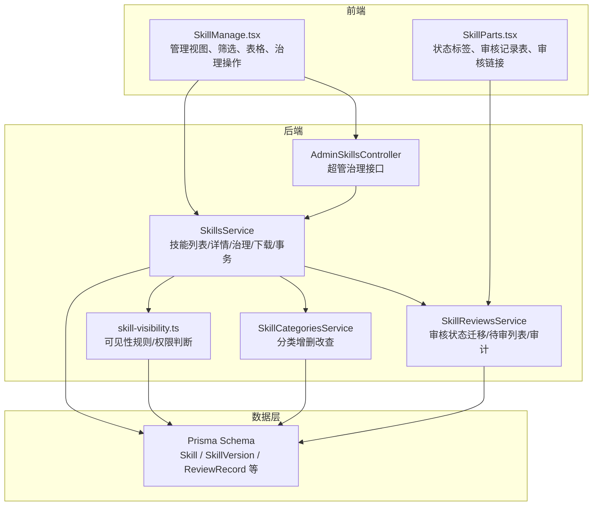
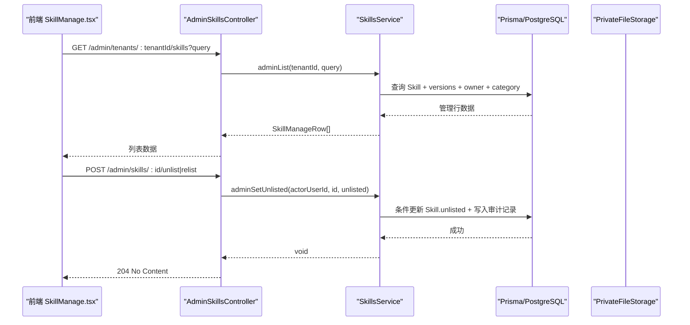
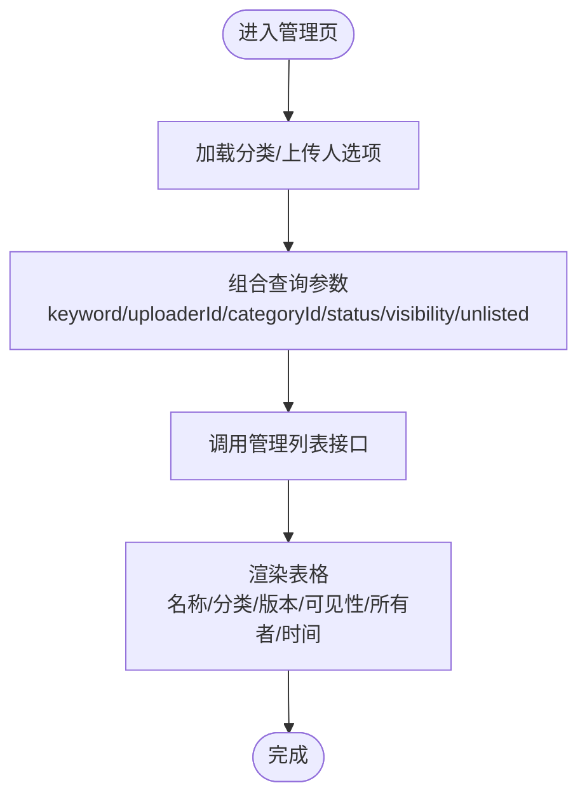
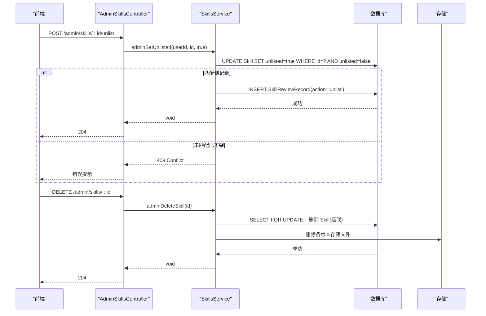
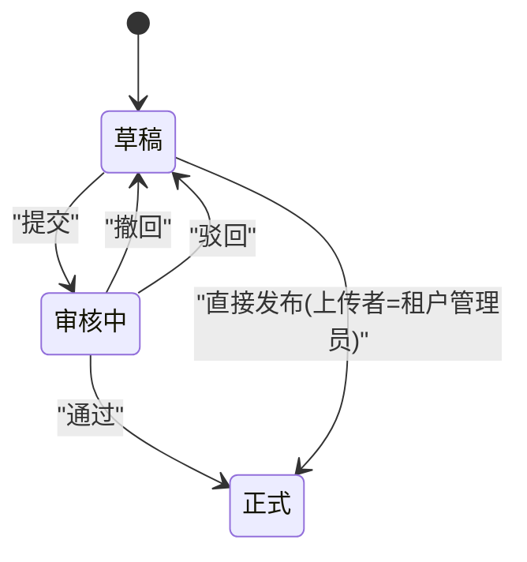
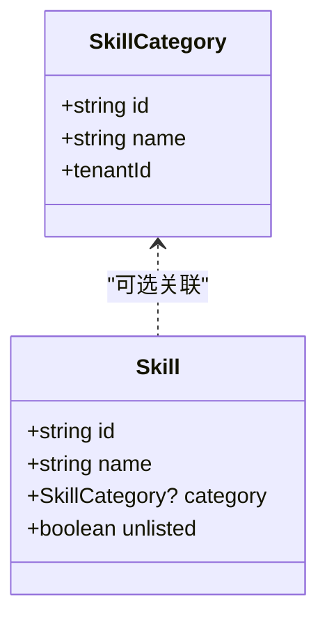
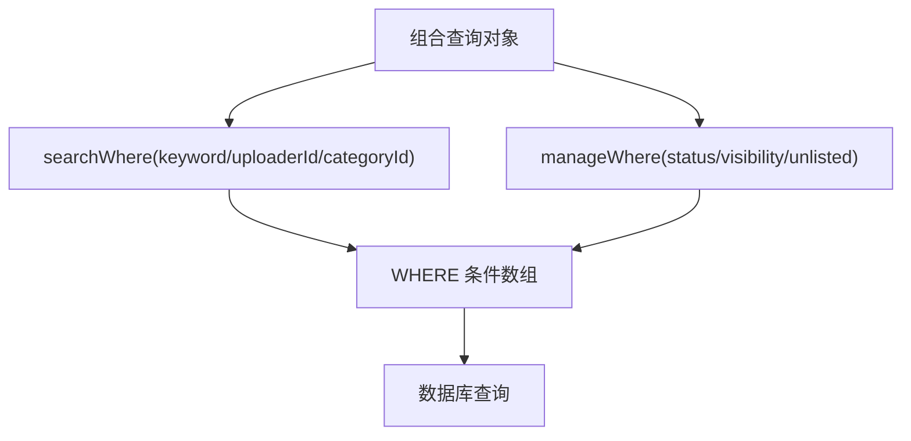
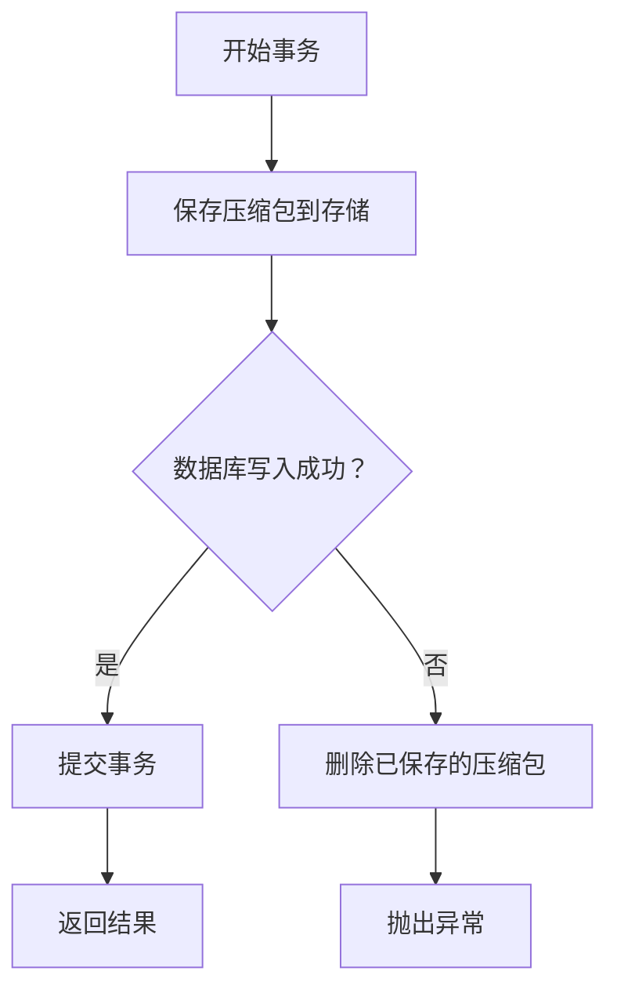
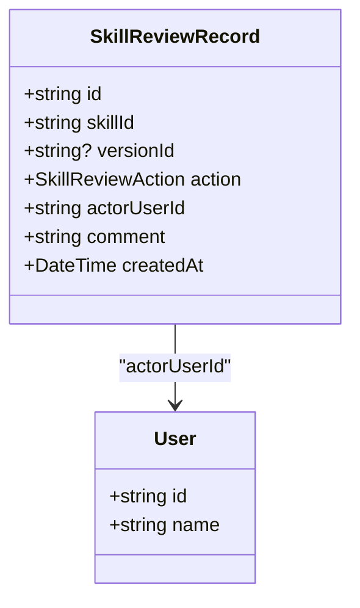
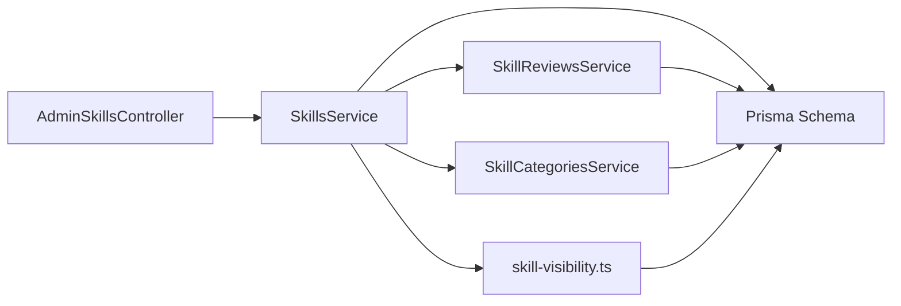

# 技能管理页面

<cite>
**本文引用的文件**   
- [SkillManage.tsx](file://apps/web/src/pages/SkillManage.tsx)
- [SkillParts.tsx](file://apps/web/src/pages/SkillParts.tsx)
- [admin-skills.controller.ts](file://apps/server/src/skills/admin-skills.controller.ts)
- [skills.service.ts](file://apps/server/src/skills/skills.service.ts)
- [skills.dto.ts](file://apps/server/src/skills/skills.dto.ts)
- [skill-reviews.service.ts](file://apps/server/src/skills/skill-reviews.service.ts)
- [skill-categories.service.ts](file://apps/server/src/skills/skill-categories.service.ts)
- [skill-visibility.ts](file://apps/server/src/skills/skill-visibility.ts)
- [schema.prisma](file://apps/server/prisma/schema.prisma)
- [skill.ts](file://packages/shared/src/skill.ts)
</cite>

## 目录
1. [引言](#引言)
2. [项目结构](#项目结构)
3. [核心组件](#核心组件)
4. [架构总览](#架构总览)
5. [详细组件分析](#详细组件分析)
6. [依赖关系分析](#依赖关系分析)
7. [性能与扩展性](#性能与扩展性)
8. [故障排查指南](#故障排查指南)
9. [结论](#结论)

## 引言
本文件面向“管理员视角”的技能包治理场景，覆盖批量操作、质量评估、合规检查、审核流程、分类与标签、搜索与高级筛选、统计报表与导出、事务与回滚、审计日志、权限校验等关键能力。系统以“租户隔离 + 角色控制”为核心：租户管理员负责本租户内技能包的上传、审核、可见性与分类治理；超级管理员可跨租户查看、下架/上架或删除违规技能包，但不参与租户内部日常审核。

## 项目结构
前端“技能管理页面”位于 Web 应用的管理视图组件中，后端由 NestJS 控制器与服务层实现，数据模型使用 Prisma 定义在 PostgreSQL 上。共享类型与常量集中在 shared 包中，前后端共用同一份语义定义。

图表来源
- [SkillManage.tsx:25-384](file://apps/web/src/pages/SkillManage.tsx#L25-L384)
- [admin-skills.controller.ts:8-53](file://apps/server/src/skills/admin-skills.controller.ts#L8-L53)
- [skills.service.ts:114-468](file://apps/server/src/skills/skills.service.ts#L114-L468)
- [skill-reviews.service.ts:47-112](file://apps/server/src/skills/skill-reviews.service.ts#L47-L112)
- [skill-categories.service.ts:20-82](file://apps/server/src/skills/skill-categories.service.ts#L20-L82)
- [skill-visibility.ts:7-106](file://apps/server/src/skills/skill-visibility.ts#L7-L106)
- [schema.prisma:104-218](file://apps/server/prisma/schema.prisma#L104-L218)

章节来源
- [SkillManage.tsx:25-384](file://apps/web/src/pages/SkillManage.tsx#L25-L384)
- [admin-skills.controller.ts:8-53](file://apps/server/src/skills/admin-skills.controller.ts#L8-L53)
- [skills.service.ts:114-468](file://apps/server/src/skills/skills.service.ts#L114-L468)
- [skill-reviews.service.ts:47-112](file://apps/server/src/skills/skill-reviews.service.ts#L47-L112)
- [skill-categories.service.ts:20-82](file://apps/server/src/skills/skill-categories.service.ts#L20-L82)
- [skill-visibility.ts:7-106](file://apps/server/src/skills/skill-visibility.ts#L7-L106)
- [schema.prisma:104-218](file://apps/server/prisma/schema.prisma#L104-L218)

## 核心组件
- 管理视图与筛选条：支持名称/描述搜索、上传人、审核状态、可见性、分类（含未分类）、上架/下架状态筛选。
- 管理表格：展示当前版本、进行中版本状态、可见性、所有者、更新时间等，并支持跳转详情。
- 治理操作：下架/上架、删除技能包；提供二次确认与成功/失败反馈。
- 超管视图：选择租户后查看该租户全部技能包，支持任意版本下载、下架/上架、删除。
- 审核流程：提交/撤回/通过/驳回/直接发布，状态迁移受严格约束，所有动作写入审计记录。
- 分类管理：按租户隔离，支持创建、重命名、删除、预设一键添加，删除时关联技能自动置空。
- 可见性与权限：基于部门树与员工名单的可见性规则，结合是否下架决定普通员工可见范围。
- 审计日志：所有关键动作（提交、撤回、通过、驳回、重新上传、修改可见性/分类、下架/上架）均持久化。

章节来源
- [SkillManage.tsx:32-248](file://apps/web/src/pages/SkillManage.tsx#L32-L248)
- [SkillParts.tsx:16-77](file://apps/web/src/pages/SkillParts.tsx#L16-L77)
- [skills.service.ts:146-181](file://apps/server/src/skills/skills.service.ts#L146-L181)
- [skill-reviews.service.ts:32-67](file://apps/server/src/skills/skill-reviews.service.ts#L32-L67)
- [skill-categories.service.ts:20-82](file://apps/server/src/skills/skill-categories.service.ts#L20-L82)
- [skill-visibility.ts:7-106](file://apps/server/src/skills/skill-visibility.ts#L7-L106)

## 架构总览
从请求到落库的关键路径如下：

图表来源
- [SkillManage.tsx:115-186](file://apps/web/src/pages/SkillManage.tsx#L115-L186)
- [admin-skills.controller.ts:19-46](file://apps/server/src/skills/admin-skills.controller.ts#L19-L46)
- [skills.service.ts:388-409](file://apps/server/src/skills/skills.service.ts#L388-L409)
- [schema.prisma:104-124](file://apps/server/prisma/schema.prisma#L104-L124)

## 详细组件分析

### 管理视图与筛选
- 搜索与筛选条：
  - 通用搜索：名称或描述包含关键词（不区分大小写）。
  - 上传人筛选：按上传过任一版本的员工过滤。
  - 管理视图增强：审核状态（草稿/审核中/正式）、可见性（租户可见/特定部门/特定员工/仅自己）、分类（含未分类）、上架/下架状态。
- 管理表格：
  - 列包括名称、分类、当前版本、进行中版本状态、可见性、所有者、更新时间。
  - 已下架标记、分类文本、时间格式化统一复用。
- 分类变化处理：当分类被删除或改名时，自动清理对应筛选条件并刷新列表。

图表来源
- [SkillManage.tsx:32-112](file://apps/web/src/pages/SkillManage.tsx#L32-L112)
- [skills.service.ts:58-82](file://apps/server/src/skills/skills.service.ts#L58-L82)
- [skills.dto.ts:115-145](file://apps/server/src/skills/skills.dto.ts#L115-L145)

章节来源
- [SkillManage.tsx:32-186](file://apps/web/src/pages/SkillManage.tsx#L32-L186)
- [skills.service.ts:58-82](file://apps/server/src/skills/skills.service.ts#L58-L82)
- [skills.dto.ts:115-145](file://apps/server/src/skills/skills.dto.ts#L115-L145)

### 治理操作（下架/上架/删除）
- 下架/上架：
  - 前端使用二次确认弹窗，成功后刷新列表。
  - 后端以条件更新防止重复操作，同时写入审计记录。
- 删除：
  - 前端二次确认提示不可恢复。
  - 后端先锁住 Skill 行，再级联删除版本、审核记录、可见性名单，最后清理存储文件。

图表来源
- [SkillManage.tsx:193-248](file://apps/web/src/pages/SkillManage.tsx#L193-L248)
- [admin-skills.controller.ts:36-52](file://apps/server/src/skills/admin-skills.controller.ts#L36-L52)
- [skills.service.ts:374-428](file://apps/server/src/skills/skills.service.ts#L374-L428)

章节来源
- [SkillManage.tsx:193-248](file://apps/web/src/pages/SkillManage.tsx#L193-L248)
- [admin-skills.controller.ts:36-52](file://apps/server/src/skills/admin-skills.controller.ts#L36-L52)
- [skills.service.ts:374-428](file://apps/server/src/skills/skills.service.ts#L374-L428)

### 审核流程管理
- 状态迁移规则：
  - 草稿 → 审核中（提交），仅所有者可提交。
  - 审核中 → 草稿（撤回），仅所有者可撤回。
  - 审核中 → 正式（通过），租户管理员执行。
  - 审核中 → 草稿（驳回），租户管理员执行，附带意见。
  - 草稿 → 正式（直接发布），仅限上传该草稿的租户管理员。
- 并发安全：
  - 使用“期望起始状态 = 当前状态”的条件更新，避免两名管理员同时处理同一版本导致状态错乱。
- 审计记录：
  - 每次状态变更都写入审计记录，包含动作、操作人、意见、时间。
- 待审列表与红点：
  - 待审列表按最近提交时间排序。
  - 菜单红点显示待审核数与被驳回且仍为草稿的版本数。

图表来源
- [skill-reviews.service.ts:20-67](file://apps/server/src/skills/skill-reviews.service.ts#L20-L67)
- [schema.prisma:164-218](file://apps/server/prisma/schema.prisma#L164-L218)

章节来源
- [skill-reviews.service.ts:20-112](file://apps/server/src/skills/skill-reviews.service.ts#L20-L112)
- [SkillParts.tsx:16-77](file://apps/web/src/pages/SkillParts.tsx#L16-L77)

### 分类管理与标签系统
- 分类维度：
  - 按租户隔离，租户管理员维护。
  - 支持创建、重命名、删除、预设一键添加。
  - 删除分类时，使用该分类的技能自动变为“未分类”。
- 标签系统：
  - 当前以“分类”作为主要标签维度；未见独立标签实体。
  - 管理视图支持按分类筛选，包括“未分类”。

图表来源
- [schema.prisma:104-135](file://apps/server/prisma/schema.prisma#L104-L135)
- [skill-categories.service.ts:20-82](file://apps/server/src/skills/skill-categories.service.ts#L20-L82)

章节来源
- [skill-categories.service.ts:20-82](file://apps/server/src/skills/skill-categories.service.ts#L20-L82)
- [schema.prisma:104-135](file://apps/server/prisma/schema.prisma#L104-L135)

### 搜索与高级筛选
- 基础搜索：
  - 名称或描述包含关键词（不区分大小写）。
  - 上传人筛选：按上传过任一版本的员工过滤。
- 高级筛选（管理视图）：
  - 审核状态：有某状态的版本即命中。
  - 可见性：按 Skill.visibility 精确匹配。
  - 上架/下架：按 Skill.unlisted 布尔值筛选。
  - 分类：支持精确分类与“未分类”。

图表来源
- [skills.service.ts:58-82](file://apps/server/src/skills/skills.service.ts#L58-L82)
- [skills.dto.ts:115-145](file://apps/server/src/skills/skills.dto.ts#L115-L145)

章节来源
- [skills.service.ts:58-82](file://apps/server/src/skills/skills.service.ts#L58-L82)
- [skills.dto.ts:115-145](file://apps/server/src/skills/skills.dto.ts#L115-L145)

### 统计报表与数据导出
- 统计指标：
  - 版本下载次数（每个版本独立计数）。
  - 审核记录数量（分页查询）。
  - 待审核数与被驳回草稿数（菜单红点）。
- 导出能力：
  - 当前未发现统一的“导出报表”接口；可通过审核记录分页与版本信息自行聚合。
  - 建议后续增加导出接口（CSV/Excel），将审核记录、版本统计、分类分布等汇总输出。

章节来源
- [skill-reviews.service.ts:92-111](file://apps/server/src/skills/skill-reviews.service.ts#L92-L111)
- [skills.service.ts:430-438](file://apps/server/src/skills/skills.service.ts#L430-L438)

### 批量操作、事务处理与回滚策略
- 批量操作现状：
  - 管理视图未提供“批量下架/批量删除”按钮；现有批量能力体现在“条件筛选 + 单条治理操作”。
  - 若需批量治理，可在前端增加多选与批量确认，后端提供批量接口并在事务中逐条执行。
- 事务与回滚：
  - 新建/更新/删除等操作使用数据库事务保证一致性。
  - 文件存储采用“先落盘、后写库”模式，写库失败时删除已落盘文件，确保无脏数据。
  - 并发冲突通过“FOR UPDATE”与条件更新（期望状态=当前状态）进行串行化与幂等保护。

图表来源
- [skills.service.ts:459-468](file://apps/server/src/skills/skills.service.ts#L459-L468)
- [skills.service.ts:238-252](file://apps/server/src/skills/skills.service.ts#L238-L252)

章节来源
- [skills.service.ts:238-252](file://apps/server/src/skills/skills.service.ts#L238-L252)
- [skills.service.ts:459-468](file://apps/server/src/skills/skills.service.ts#L459-L468)

### 审计日志、操作追踪与权限验证
- 审计日志：
  - 所有关键动作（提交、撤回、通过、驳回、重新上传、修改可见性/分类、下架/上架）均写入审计记录。
  - 审计记录包含动作、操作人、意见、时间，支持分页查询。
- 操作追踪：
  - 管理详情页与审核记录表展示完整审计轨迹。
- 权限验证：
  - 可见性规则：所有者、租户管理员、超管不受限制；其他员工须满足未下架且可见性命中。
  - 管理权限：只有所有者或租户管理员可修改可见性/分类、上传新版本、删除技能包。
  - 超管权限：仅用于跨租户治理（查看、下载、下架/上架、删除），不参与租户内部审核。

图表来源
- [schema.prisma:192-218](file://apps/server/prisma/schema.prisma#L192-L218)
- [skills.service.ts:284-319](file://apps/server/src/skills/skills.service.ts#L284-L319)
- [skills.service.ts:398-409](file://apps/server/src/skills/skills.service.ts#L398-L409)
- [skill-reviews.service.ts:55-67](file://apps/server/src/skills/skill-reviews.service.ts#L55-L67)

章节来源
- [schema.prisma:192-218](file://apps/server/prisma/schema.prisma#L192-L218)
- [skills.service.ts:284-319](file://apps/server/src/skills/skills.service.ts#L284-L319)
- [skills.service.ts:398-409](file://apps/server/src/skills/skills.service.ts#L398-L409)
- [skill-reviews.service.ts:55-67](file://apps/server/src/skills/skill-reviews.service.ts#L55-L67)

## 依赖关系分析
- 控制器依赖服务：
  - AdminSkillsController 依赖 SkillsService 提供超管治理能力。
- 服务间协作：
  - SkillsService 依赖 SkillReviewsService 获取审核相关能力（如驳回意见、最新记录）。
  - SkillsService 依赖 SkillCategoriesService 校验分类存在性。
  - SkillsService 依赖 skill-visibility 模块进行可见性解析与权限判断。
- 数据模型依赖：
  - Skill、SkillVersion、SkillReviewRecord、SkillVisibleDepartment、SkillVisibleEmployee 等实体构成完整的数据关系。

图表来源
- [admin-skills.controller.ts:1-53](file://apps/server/src/skills/admin-skills.controller.ts#L1-L53)
- [skills.service.ts:114-468](file://apps/server/src/skills/skills.service.ts#L114-L468)
- [skill-reviews.service.ts:47-112](file://apps/server/src/skills/skill-reviews.service.ts#L47-L112)
- [skill-categories.service.ts:20-82](file://apps/server/src/skills/skill-categories.service.ts#L20-L82)
- [skill-visibility.ts:7-106](file://apps/server/src/skills/skill-visibility.ts#L7-L106)
- [schema.prisma:104-218](file://apps/server/prisma/schema.prisma#L104-L218)

章节来源
- [admin-skills.controller.ts:1-53](file://apps/server/src/skills/admin-skills.controller.ts#L1-L53)
- [skills.service.ts:114-468](file://apps/server/src/skills/skills.service.ts#L114-L468)
- [skill-reviews.service.ts:47-112](file://apps/server/src/skills/skill-reviews.service.ts#L47-L112)
- [skill-categories.service.ts:20-82](file://apps/server/src/skills/skill-categories.service.ts#L20-L82)
- [skill-visibility.ts:7-106](file://apps/server/src/skills/skill-visibility.ts#L7-L106)
- [schema.prisma:104-218](file://apps/server/prisma/schema.prisma#L104-L218)

## 性能与扩展性
- 查询优化：
  - 管理列表与目录列表分别使用不同的 include 与 where 条件，减少不必要字段加载。
  - 审核记录分页查询，限制每页最大条数。
- 并发控制：
  - 使用数据库行锁（FOR UPDATE）与条件更新保证并发安全。
- 存储与回滚：
  - 文件先落盘再写库，失败时自动清理，避免资源泄漏。
- 扩展建议：
  - 增加批量治理接口（批量下架/删除），在服务层使用事务包裹逐条操作。
  - 增加统计报表导出接口，支持 CSV/Excel 输出。
  - 引入缓存层（如 Redis）对高频只读数据（分类、可见性选项）进行缓存，降低数据库压力。

[本节为通用指导，不涉及具体文件分析]

## 故障排查指南
- 常见错误与定位：
  - 版本号不合法：检查版本号格式与比较逻辑。
  - 名称冲突：新建或上传新版本时，若同名则返回 409，并提示已有 Skill 的 id（若可见）。
  - 权限不足：非所有者或非租户管理员尝试修改可见性/分类/删除，返回 403；不可见 Skill 返回 404。
  - 重复下架/上架：条件更新未命中返回 409。
  - 审核状态不一致：并发操作导致状态变化，返回“状态已变化”错误。
- 排查步骤：
  - 查看审核记录表，确认最近一次动作与操作人。
  - 检查 Skill 的可见性与下架状态，确认是否符合预期。
  - 核对分类是否存在且属于当前租户。
  - 检查存储文件是否存在，必要时清理孤儿文件。

章节来源
- [skills.service.ts:43-46](file://apps/server/src/skills/skills.service.ts#L43-L46)
- [skills.service.ts:449-457](file://apps/server/src/skills/skills.service.ts#L449-L457)
- [skills.service.ts:398-409](file://apps/server/src/skills/skills.service.ts#L398-L409)
- [skill-reviews.service.ts:55-67](file://apps/server/src/skills/skill-reviews.service.ts#L55-L67)

## 结论
技能管理页面围绕“租户隔离 + 角色控制 + 审计可追溯”构建，提供了完善的管理视图、审核流程、分类与可见性治理、搜索与筛选、以及事务与回滚保障。当前尚未提供统一的批量治理与报表导出能力，建议在后续迭代中补充批量接口与导出功能，以提升管理员效率与数据治理能力。