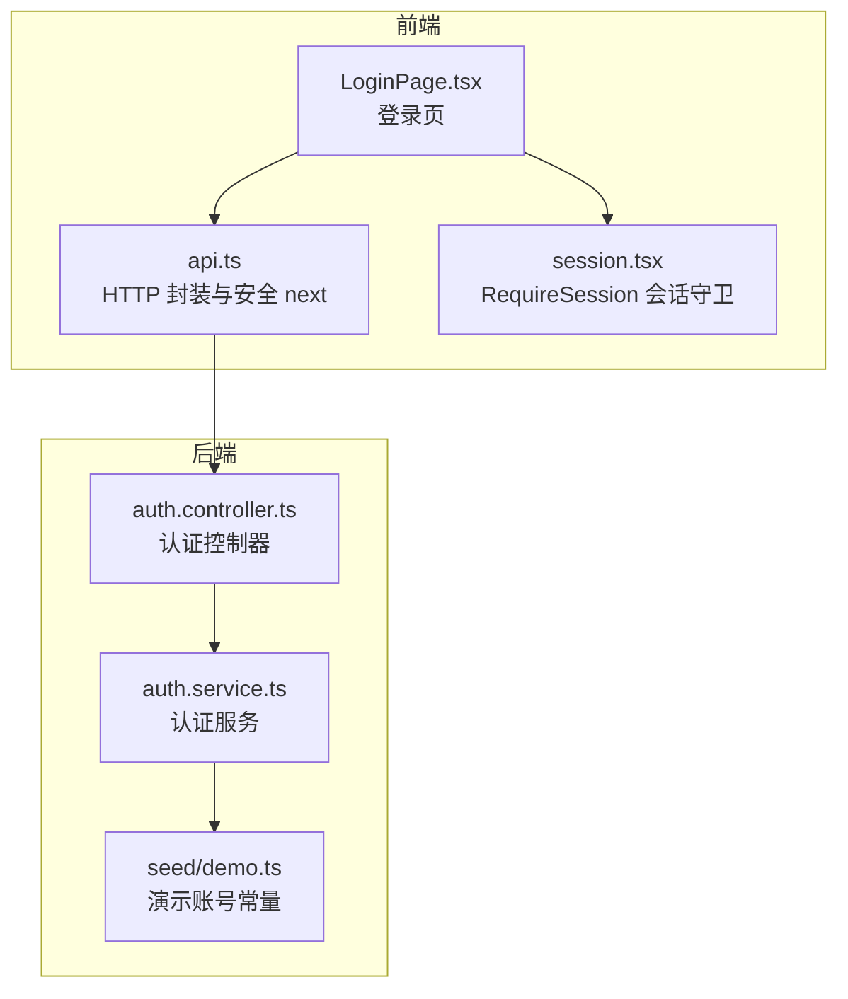
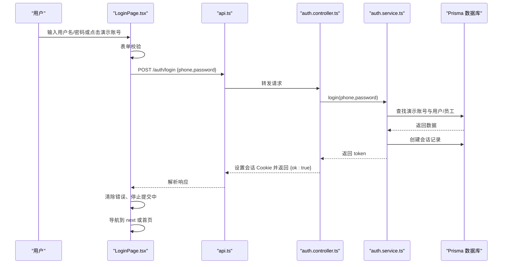
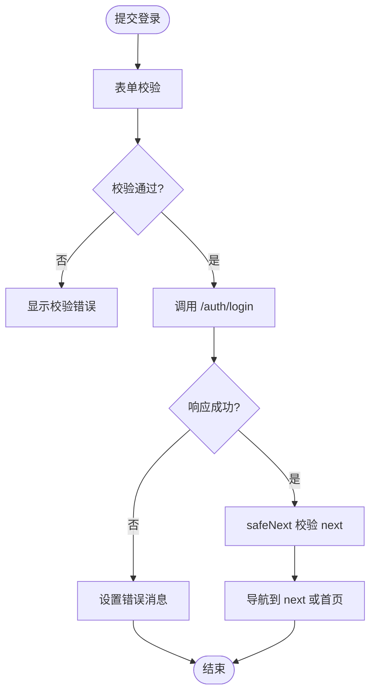
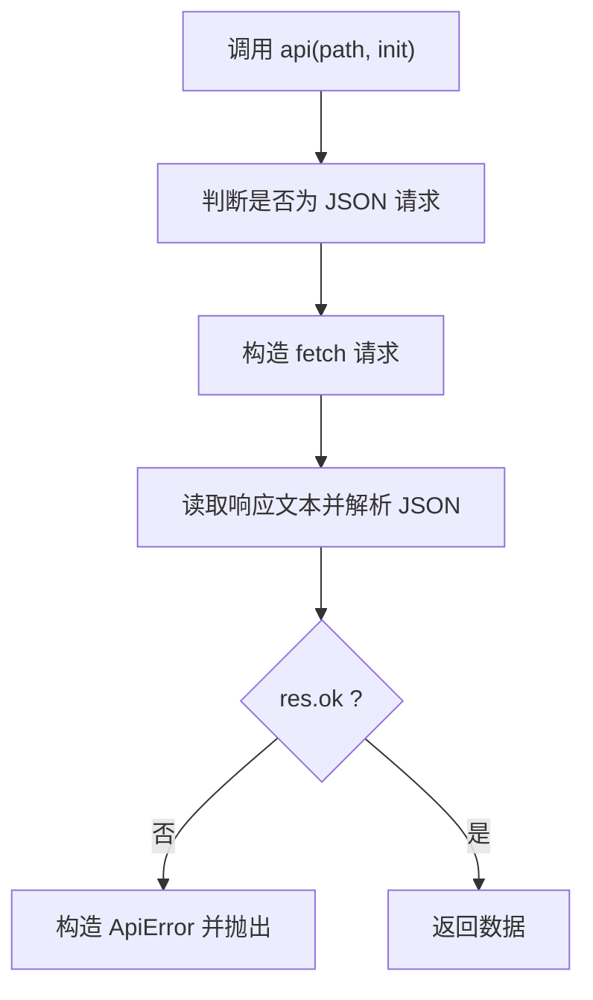
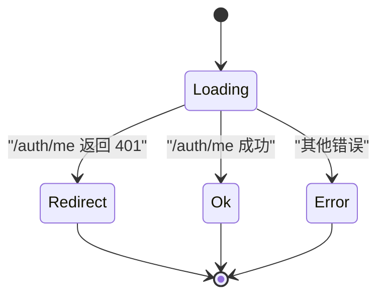
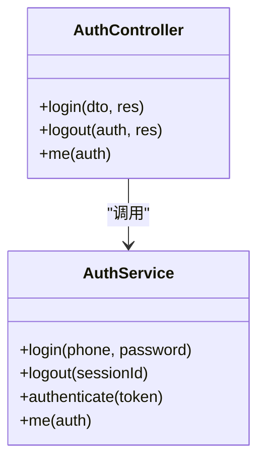
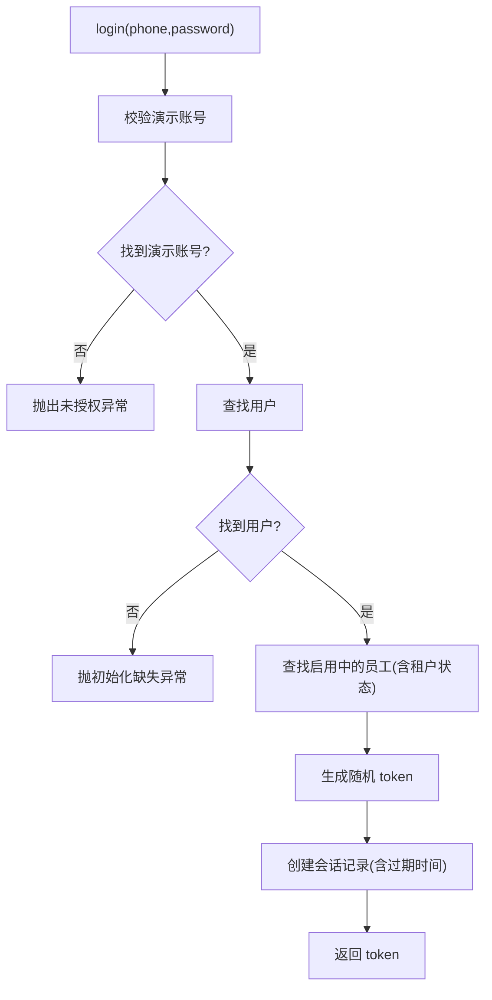
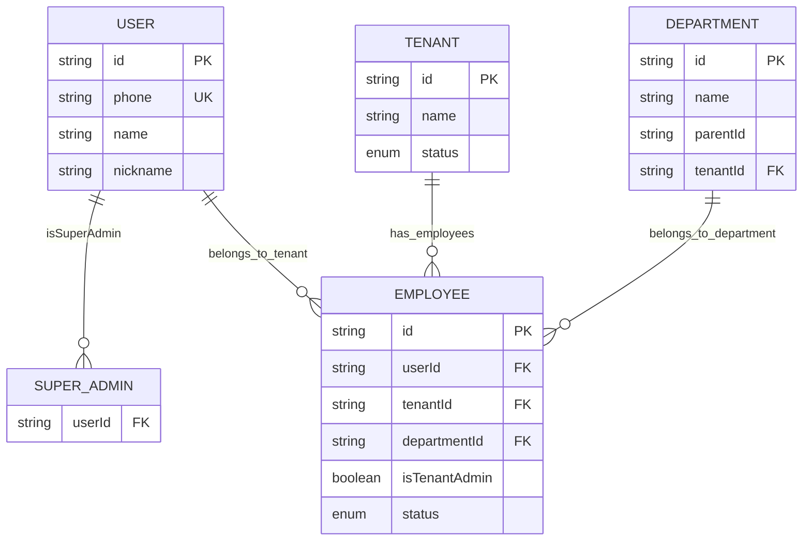
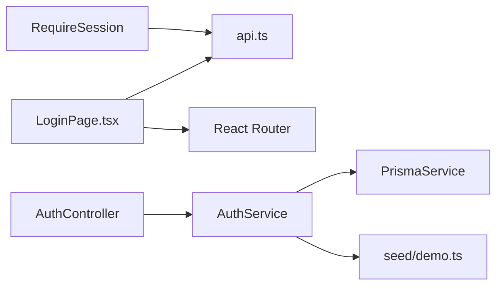

# 登录页面

<cite>
**本文引用的文件**   
- [apps/web/src/pages/LoginPage.tsx](file://apps/web/src/pages/LoginPage.tsx)
- [apps/web/src/api.ts](file://apps/web/src/api.ts)
- [apps/web/src/session.tsx](file://apps/web/src/session.tsx)
- [apps/server/src/auth/auth.controller.ts](file://apps/server/src/auth/auth.controller.ts)
- [apps/server/src/auth/auth.service.ts](file://apps/server/src/auth/auth.service.ts)
- [apps/server/src/seed/demo.ts](file://apps/server/src/seed/demo.ts)
</cite>

## 目录
1. [简介](#简介)
2. [项目结构](#项目结构)
3. [核心组件](#核心组件)
4. [架构总览](#架构总览)
5. [详细组件分析](#详细组件分析)
6. [依赖关系分析](#依赖关系分析)
7. [性能与体验优化](#性能与体验优化)
8. [故障排查指南](#故障排查指南)
9. [结论](#结论)

## 简介
本文件面向“Skill Hub 演示”项目的登录页面，系统性说明其功能实现、表单验证、用户认证流程、错误处理机制、演示账号快速登录、前端状态管理、提交与导航逻辑，以及与后端认证 API 的交互方式。文档同时覆盖用户体验设计与安全性考虑，帮助开发者与维护者快速理解并扩展登录能力。

## 项目结构
登录功能横跨前后端：
- 前端（React + Ant Design）：提供登录表单、演示账号快捷填充、错误提示、路由跳转与会话守卫。
- 后端（NestJS）：提供 /auth/login、/auth/logout、/auth/me 等接口，基于会话 Cookie 维持登录态，并通过 Prisma 访问数据库。

**图表来源**
- [apps/web/src/pages/LoginPage.tsx:1-41](file://apps/web/src/pages/LoginPage.tsx#L1-L41)
- [apps/web/src/api.ts:1-42](file://apps/web/src/api.ts#L1-L42)
- [apps/web/src/session.tsx:1-68](file://apps/web/src/session.tsx#L1-L68)
- [apps/server/src/auth/auth.controller.ts:1-26](file://apps/server/src/auth/auth.controller.ts#L1-L26)
- [apps/server/src/auth/auth.service.ts:1-77](file://apps/server/src/auth/auth.service.ts#L1-L77)
- [apps/server/src/seed/demo.ts:1-35](file://apps/server/src/seed/demo.ts#L1-L35)

**章节来源**
- [apps/web/src/pages/LoginPage.tsx:1-41](file://apps/web/src/pages/LoginPage.tsx#L1-L41)
- [apps/web/src/api.ts:1-42](file://apps/web/src/api.ts#L1-L42)
- [apps/web/src/session.tsx:1-68](file://apps/web/src/session.tsx#L1-L68)
- [apps/server/src/auth/auth.controller.ts:1-26](file://apps/server/src/auth/auth.controller.ts#L1-L26)
- [apps/server/src/auth/auth.service.ts:1-77](file://apps/server/src/auth/auth.service.ts#L1-L77)
- [apps/server/src/seed/demo.ts:1-35](file://apps/server/src/seed/demo.ts#L1-L35)

## 核心组件
- 登录页面组件：负责演示账号快速填充、表单校验、提交调用、错误展示与登录后跳转。
- HTTP 客户端封装：统一请求头、JSON 序列化、非 2xx 响应抛出结构化错误，并提供安全 next 白名单校验。
- 会话守卫 RequireSession：在受保护路由前检查登录态，未登录时携带 next 参数重定向到登录页。
- 后端认证控制器：暴露登录、登出、获取当前用户信息接口，设置会话 Cookie。
- 认证服务：校验演示账号、创建会话、鉴权上下文构建、查询当前租户下的员工档案。
- 演示数据：预置超管、租户管理员、普通用户的演示账号及组织关系。

**章节来源**
- [apps/web/src/pages/LoginPage.tsx:1-41](file://apps/web/src/pages/LoginPage.tsx#L1-L41)
- [apps/web/src/api.ts:1-42](file://apps/web/src/api.ts#L1-L42)
- [apps/web/src/session.tsx:1-68](file://apps/web/src/session.tsx#L1-L68)
- [apps/server/src/auth/auth.controller.ts:1-26](file://apps/server/src/auth/auth.controller.ts#L1-L26)
- [apps/server/src/auth/auth.service.ts:1-77](file://apps/server/src/auth/auth.service.ts#L1-L77)
- [apps/server/src/seed/demo.ts:1-35](file://apps/server/src/seed/demo.ts#L1-L35)

## 架构总览
登录流程从前端表单提交开始，经 HTTP 客户端封装调用后端认证接口，后端校验演示账号并创建会话，返回成功响应后前端更新 UI 并导航至目标页面；后续受保护路由通过 RequireSession 发起 /auth/me 校验会话有效性。

**图表来源**
- [apps/web/src/pages/LoginPage.tsx:18-24](file://apps/web/src/pages/LoginPage.tsx#L18-L24)
- [apps/web/src/api.ts:16-30](file://apps/web/src/api.ts#L16-L30)
- [apps/server/src/auth/auth.controller.ts:12-17](file://apps/server/src/auth/auth.controller.ts#L12-L17)
- [apps/server/src/auth/auth.service.ts:15-23](file://apps/server/src/auth/auth.service.ts#L15-L23)

## 详细组件分析

### 登录页面 LoginPage.tsx
- 演示账号快速登录：提供超管、租户管理员、普通用户三类预设账号，点击按钮自动填充表单并清空错误提示。
- 表单字段与校验：
  - 用户名（phone）：必填。
  - 密码（password）：必填。
- 提交处理：
  - 提交开始时进入 loading 状态并清空错误。
  - 调用 api('/auth/login', { method: 'POST', body: values })。
  - 成功后使用 safeNext 解析 next 参数进行安全跳转，否则返回首页。
  - 失败时捕获错误消息并显示在 Alert 中。
- 导航逻辑：
  - 支持 URL 中的 next 参数，但仅允许本地应用路径（如 /admin、/tenant、/workspace、/skills），防止外部重定向风险。

**图表来源**
- [apps/web/src/pages/LoginPage.tsx:18-24](file://apps/web/src/pages/LoginPage.tsx#L18-L24)
- [apps/web/src/api.ts:38-41](file://apps/web/src/api.ts#L38-L41)

**章节来源**
- [apps/web/src/pages/LoginPage.tsx:7-11](file://apps/web/src/pages/LoginPage.tsx#L7-L11)
- [apps/web/src/pages/LoginPage.tsx:18-38](file://apps/web/src/pages/LoginPage.tsx#L18-L38)
- [apps/web/src/api.ts:38-41](file://apps/web/src/api.ts#L38-L41)

### 前端 HTTP 客户端 api.ts
- JSON 请求封装：自动设置 Content-Type，序列化 body。
- 错误处理：非 2xx 响应抛出 ApiError，message 优先取服务端 message，支持数组 message 取首项。
- 安全 next：仅允许以 /admin、/tenant、/workspace、/skills 开头的本地路径，且不含反斜杠，避免开放重定向。
- 登出封装：调用 /auth/logout，忽略 401 错误（已过期）。

**图表来源**
- [apps/web/src/api.ts:16-30](file://apps/web/src/api.ts#L16-L30)
- [apps/web/src/api.ts:38-41](file://apps/web/src/api.ts#L38-L41)

**章节来源**
- [apps/web/src/api.ts:1-42](file://apps/web/src/api.ts#L1-L42)

### 会话守卫 session.tsx
- RequireSession：在渲染子路由前调用 /auth/me 获取当前用户信息。
- 未登录处理：当 /auth/me 返回 401 时，将 state 切换为 redirect，并重定向到 /login?next=当前路径。
- 加载与错误状态：loading 显示全屏 Spin，error 显示 Result 错误页。
- 开发模式兼容：effect 清理避免 StrictMode 下重复请求导致的竞态问题。

**图表来源**
- [apps/web/src/session.tsx:41-67](file://apps/web/src/session.tsx#L41-L67)

**章节来源**
- [apps/web/src/session.tsx:1-68](file://apps/web/src/session.tsx#L1-L68)

### 后端认证控制器 auth.controller.ts
- POST /auth/login：接收 LoginDto，调用 AuthService.login，设置会话 Cookie（httpOnly、sameSite=lax、可选 secure），返回 { ok: true }。
- POST /auth/logout：根据会话 ID 删除会话，清除 Cookie。
- GET /auth/me：返回当前用户信息与租户相关数据。

**图表来源**
- [apps/server/src/auth/auth.controller.ts:9-25](file://apps/server/src/auth/auth.controller.ts#L9-L25)
- [apps/server/src/auth/auth.service.ts:11-76](file://apps/server/src/auth/auth.service.ts#L11-L76)

**章节来源**
- [apps/server/src/auth/auth.controller.ts:1-26](file://apps/server/src/auth/auth.controller.ts#L1-L26)

### 后端认证服务 auth.service.ts
- 演示账号校验：比对 DEMO_ACCOUNTS 中的 phone/password，不匹配抛出未授权异常。
- 用户与员工校验：根据 phone 查找 user，再查找 active 且 tenant 为 active 的 employee。
- 会话创建：生成随机 token，哈希存储于 session 表，设置过期时间 SESSION_TTL_MS。
- 鉴权上下文：根据 token 查找有效会话，组装 AuthContext（包含用户、是否超管、当前租户 ID、会话 ID）。
- 当前租户角色查询：提供 findActiveEmployee 与 findActiveTenantAdmin 方法。
- 当前用户信息：返回 MeResponse，包括用户基本信息、员工列表与当前租户 ID。

**图表来源**
- [apps/server/src/auth/auth.service.ts:15-23](file://apps/server/src/auth/auth.service.ts#L15-L23)

**章节来源**
- [apps/server/src/auth/auth.service.ts:1-77](file://apps/server/src/auth/auth.service.ts#L1-L77)

### 演示账号 seed/demo.ts
- 预置演示账号：
  - 超管：phone=root，password=admin
  - 租户管理员：phone=15168466666，password=test
  - 普通用户：phone=15168488888，password=test
- 演示租户与部门：创建演示租户与部门树，并为非超管用户创建员工档案，标记租户管理员身份。

**图表来源**
- [apps/server/src/seed/demo.ts:1-35](file://apps/server/src/seed/demo.ts#L1-L35)

**章节来源**
- [apps/server/src/seed/demo.ts:1-35](file://apps/server/src/seed/demo.ts#L1-L35)

## 依赖关系分析
- 前端依赖：
  - LoginPage.tsx 依赖 api.ts 进行网络请求与错误处理，依赖 React Router 进行导航。
  - RequireSession 依赖 api.ts 获取当前用户信息，并在未登录时重定向到登录页。
- 后端依赖：
  - AuthController 依赖 AuthService 完成业务逻辑。
  - AuthService 依赖 PrismaService 访问数据库，依赖 seed/demo.ts 提供的演示账号常量。

**图表来源**
- [apps/web/src/pages/LoginPage.tsx:1-41](file://apps/web/src/pages/LoginPage.tsx#L1-L41)
- [apps/web/src/api.ts:1-42](file://apps/web/src/api.ts#L1-L42)
- [apps/web/src/session.tsx:1-68](file://apps/web/src/session.tsx#L1-L68)
- [apps/server/src/auth/auth.controller.ts:1-26](file://apps/server/src/auth/auth.controller.ts#L1-L26)
- [apps/server/src/auth/auth.service.ts:1-77](file://apps/server/src/auth/auth.service.ts#L1-L77)
- [apps/server/src/seed/demo.ts:1-35](file://apps/server/src/seed/demo.ts#L1-L35)

**章节来源**
- [apps/web/src/pages/LoginPage.tsx:1-41](file://apps/web/src/pages/LoginPage.tsx#L1-L41)
- [apps/web/src/api.ts:1-42](file://apps/web/src/api.ts#L1-L42)
- [apps/web/src/session.tsx:1-68](file://apps/web/src/session.tsx#L1-L68)
- [apps/server/src/auth/auth.controller.ts:1-26](file://apps/server/src/auth/auth.controller.ts#L1-L26)
- [apps/server/src/auth/auth.service.ts:1-77](file://apps/server/src/auth/auth.service.ts#L1-L77)
- [apps/server/src/seed/demo.ts:1-35](file://apps/server/src/seed/demo.ts#L1-L35)

## 性能与体验优化
- 表单提交防抖与状态：
  - 使用 submitting 状态控制按钮 loading，避免重复提交。
  - 提交前清空 error，提升反馈及时性。
- 安全跳转：
  - safeNext 限制 next 参数为本地路径，防止开放重定向攻击。
- 会话守卫：
  - RequireSession 在受保护路由前异步获取用户信息，减少无效渲染。
- 后端会话：
  - 使用 httpOnly Cookie 降低 XSS 窃取风险；sameSite=lax 平衡跨站与安全性；secure 环境变量控制 HTTPS 强制。
- 演示账号一键填充：
  - 减少用户输入成本，提升演示体验。

[本节为通用指导，无需特定文件引用]

## 故障排查指南
- 登录失败提示“账号或密码错误”：
  - 检查输入的 phone/password 是否与演示账号一致。
  - 确认演示数据已初始化（运行 pnpm setup）。
- 登录成功但无法进入预期页面：
  - 检查 URL 中的 next 参数是否符合 safeNext 白名单规则。
  - 查看浏览器控制台是否有 401 或其他错误。
- 会话失效或频繁跳转登录页：
  - 检查 Cookie 是否被浏览器策略拦截（如第三方 Cookie 禁用）。
  - 确认后端 SESSION_COOKIE_SECURE 配置与部署环境（HTTPS）一致。
- 受保护页面空白或报错：
  - 查看 RequireSession 的错误分支，确认 /auth/me 是否正常返回。
  - 检查网络请求是否携带 Cookie。

**章节来源**
- [apps/server/src/auth/auth.service.ts:15-23](file://apps/server/src/auth/auth.service.ts#L15-L23)
- [apps/web/src/api.ts:38-41](file://apps/web/src/api.ts#L38-L41)
- [apps/web/src/session.tsx:41-67](file://apps/web/src/session.tsx#L41-L67)

## 结论
登录页面通过简洁的前端表单与稳健的后端认证流程，实现了演示账号的快速体验与安全的会话管理。前端采用 Ant Design 表单与统一的 HTTP 客户端封装，确保校验与错误提示的一致性；后端基于 NestJS 与 Prisma 提供稳定的认证与会话能力。整体设计兼顾了易用性与安全性，适合演示与教学场景。