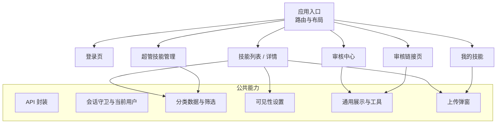
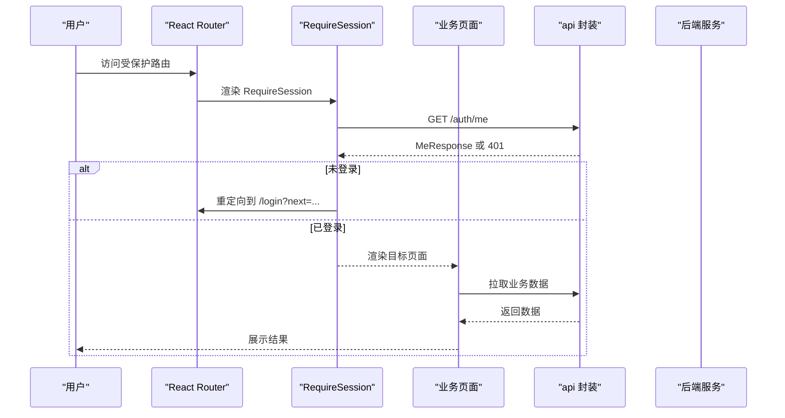
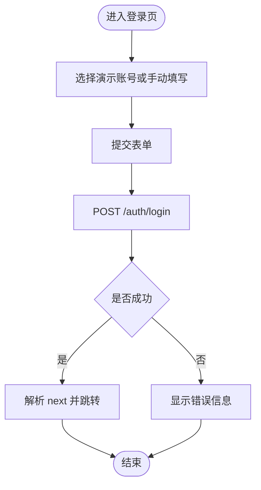
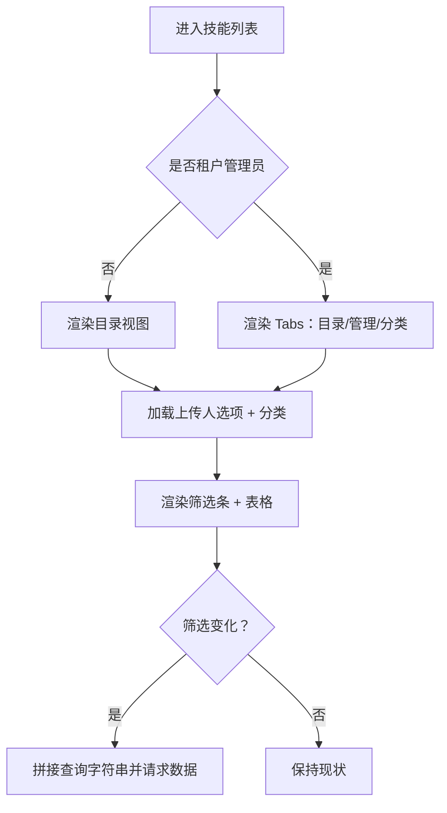
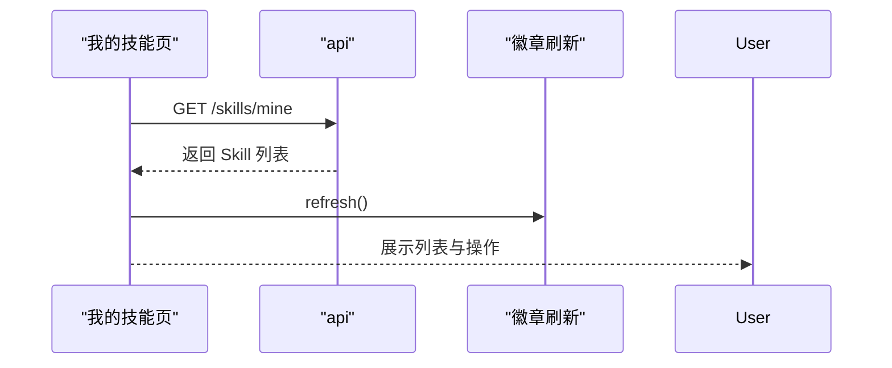
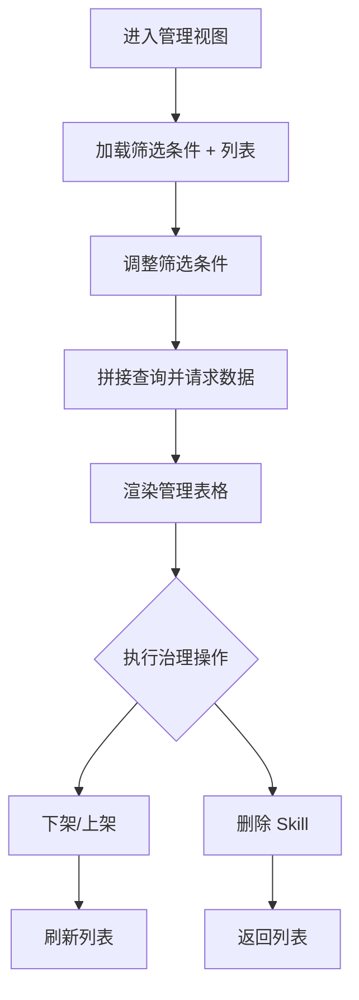
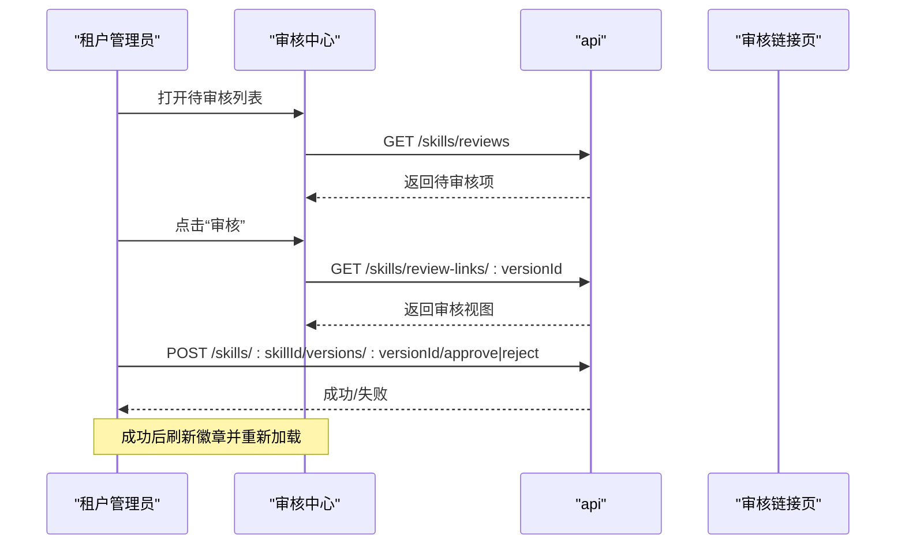
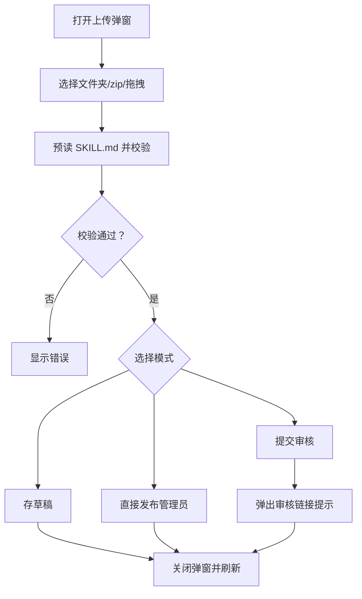
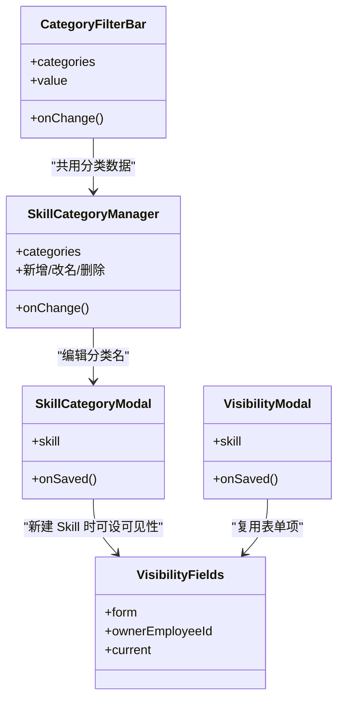
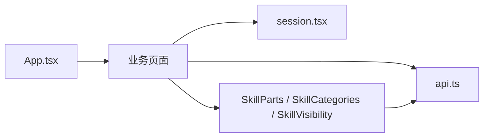

# 页面组件

<cite>
**本文引用的文件**   
- [App.tsx](file://apps/web/src/App.tsx)
- [LoginPage.tsx](file://apps/web/src/pages/LoginPage.tsx)
- [SkillsPage.tsx](file://apps/web/src/pages/SkillsPage.tsx)
- [MySkillsPage.tsx](file://apps/web/src/pages/MySkillsPage.tsx)
- [SkillManage.tsx](file://apps/web/src/pages/SkillManage.tsx)
- [SkillReviewPages.tsx](file://apps/web/src/pages/SkillReviewPages.tsx)
- [SkillCategories.tsx](file://apps/web/src/pages/SkillCategories.tsx)
- [SkillParts.tsx](file://apps/web/src/pages/SkillParts.tsx)
- [SkillVisibility.tsx](file://apps/web/src/pages/SkillVisibility.tsx)
- [UploadSkillModal.tsx](file://apps/web/src/pages/UploadSkillModal.tsx)
- [session.tsx](file://apps/web/src/session.tsx)
- [api.ts](file://apps/web/src/api.ts)
</cite>

## 目录
1. [引言](#引言)
2. [项目结构](#项目结构)
3. [核心页面与职责](#核心页面与职责)
4. [架构总览](#架构总览)
5. [详细组件分析](#详细组件分析)
6. [依赖关系分析](#依赖关系分析)
7. [性能与可维护性建议](#性能与可维护性建议)
8. [常见问题排查](#常见问题排查)
9. [结论](#结论)

## 引言
本文件面向前端开发者，系统化说明 Skill Hub 教学版 Web 端各业务页面的功能职责、用户交互流程、导航逻辑、参数传递、数据共享机制、表单处理、验证与错误反馈策略，以及状态管理、数据获取和性能优化实践。重点覆盖登录页、技能列表页、我的技能页、技能管理页和审核相关页面，帮助读者快速理解并长期维护这些页面。

## 项目结构
Web 应用采用 React Router 进行路由组织，使用 Ant Design 作为 UI 基础库，通过统一的 `api` 封装调用后端接口，并通过 `RequireSession` 做会话守卫。页面按业务域拆分到 `apps/web/src/pages` 下：

图表来源
- [App.tsx:39-65](file://apps/web/src/App.tsx#L39-L65)
- [SkillsPage.tsx:33-79](file://apps/web/src/pages/SkillsPage.tsx#L33-L79)
- [MySkillsPage.tsx:12-30](file://apps/web/src/pages/MySkillsPage.tsx#L12-L30)
- [SkillManage.tsx:250-274](file://apps/web/src/pages/SkillManage.tsx#L250-L274)
- [SkillReviewPages.tsx:22-34](file://apps/web/src/pages/SkillReviewPages.tsx#L22-L34)

章节来源
- [App.tsx:1-66](file://apps/web/src/App.tsx#L1-L66)

## 核心页面与职责
- 登录页：演示账号快捷填充、表单校验、登录后跳转回原地址。
- 技能列表页：租户内可见的 Skill 目录；租户管理员额外提供“管理”和“分类”视图；支持搜索、上传人筛选、分类筛选、下载。
- 我的技能页：列出本人作为所有者的 Skill，展示正式版本、进行中版本、驳回意见与操作入口。
- 技能管理页：租户管理员与超管的治理视图，含多条件筛选、下架/上架、删除等治理操作。
- 审核相关页：待审核列表、全量审核记录、单个版本审核（通过/驳回）、审核链接只读或跳转。

章节来源
- [LoginPage.tsx:12-40](file://apps/web/src/pages/LoginPage.tsx#L12-L40)
- [SkillsPage.tsx:33-79](file://apps/web/src/pages/SkillsPage.tsx#L33-L79)
- [MySkillsPage.tsx:12-30](file://apps/web/src/pages/MySkillsPage.tsx#L12-L30)
- [SkillManage.tsx:25-27](file://apps/web/src/pages/SkillManage.tsx#L25-L27)
- [SkillReviewPages.tsx:22-34](file://apps/web/src/pages/SkillReviewPages.tsx#L22-L34)

## 架构总览
应用以 `App.tsx` 为路由中枢，根据当前用户身份决定默认首页与菜单项；`RequireSession` 在受保护路由前统一鉴权；各页面通过 `api` 调用后端，并使用本地 state 管理加载、错误与数据。

图表来源
- [session.tsx:40-67](file://apps/web/src/session.tsx#L40-L67)
- [api.ts:15-31](file://apps/web/src/api.ts#L15-L31)
- [App.tsx:39-65](file://apps/web/src/App.tsx#L39-L65)

## 详细组件分析

### 登录页面
- 功能职责
  - 提供演示账号一键填充，减少输入成本。
  - 用户名/密码必填校验。
  - 登录成功后跳转到 next 参数指定的页面，否则返回首页。
- 用户交互流程
  - 点击演示账号按钮 → 自动填充表单 → 点击登录 → 调用 `/auth/login` → 成功则跳转，失败显示错误提示。
- 参数与导航
  - 从 URL 查询参数读取 `next`，经 `safeNext` 校验后用于跳转。
- 错误处理
  - 捕获异常并显示 Alert；提交中禁用按钮避免重复提交。

图表来源
- [LoginPage.tsx:12-40](file://apps/web/src/pages/LoginPage.tsx#L12-L40)
- [api.ts:38-41](file://apps/web/src/api.ts#L38-L41)

章节来源
- [LoginPage.tsx:1-41](file://apps/web/src/pages/LoginPage.tsx#L1-L41)
- [api.ts:1-42](file://apps/web/src/api.ts#L1-L42)

### 技能列表页面
- 功能职责
  - 目录视图：展示本租户可见且有正式版本的 Skill，支持名称/描述搜索、上传人筛选、分类筛选、下载。
  - 管理视图（仅租户管理员）：包含草稿、审核中、已下架 Skill，支持按审核状态、可见性、是否下架、分类筛选。
  - 分类管理（仅租户管理员）：新增、改名、删除分类，一键添加常用分类。
- 数据获取
  - 目录：`/skills${toQueryString(query)`。
  - 管理：`/skills/manage${toQueryString(query)`。
  - 分类：`/skills/categories`。
  - 上传人选项：`/skills/visibility-options`。
- 关键交互
  - 点击“上传 Skill”打开上传弹窗；上传成功后跳转到对应 Skill 详情页。
  - 分类变更时清理无效筛选条件并重新拉取列表。
  - 管理表格支持多条件筛选，分类被删除时自动清空筛选。

图表来源
- [SkillsPage.tsx:33-79](file://apps/web/src/pages/SkillsPage.tsx#L33-L79)
- [SkillsPage.tsx:82-146](file://apps/web/src/pages/SkillsPage.tsx#L82-L146)
- [SkillManage.tsx:27-30](file://apps/web/src/pages/SkillManage.tsx#L27-L30)
- [SkillCategories.tsx:18-25](file://apps/web/src/pages/SkillCategories.tsx#L18-L25)

章节来源
- [SkillsPage.tsx:1-489](file://apps/web/src/pages/SkillsPage.tsx#L1-L489)
- [SkillManage.tsx:27-186](file://apps/web/src/pages/SkillManage.tsx#L27-L186)
- [SkillCategories.tsx:18-141](file://apps/web/src/pages/SkillCategories.tsx#L18-L141)

### 我的技能页面
- 功能职责
  - 展示本人作为所有者的 Skill，包括当前正式版本、进行中版本、驳回意见、最近上传时间。
  - 提供“上传 Skill”入口，上传成功后跳转到对应 Skill 详情页。
- 数据获取
  - 拉取 `/skills/mine`，并在刷新时同步更新徽章计数。
- 交互要点
  - 进行中版本为“pending”时提供复制审核链接。
  - 点击“处理/查看”跳转到详情页。

图表来源
- [MySkillsPage.tsx:12-30](file://apps/web/src/pages/MySkillsPage.tsx#L12-L30)
- [MySkillsPage.tsx:97-110](file://apps/web/src/pages/MySkillsPage.tsx#L97-L110)

章节来源
- [MySkillsPage.tsx:1-114](file://apps/web/src/pages/MySkillsPage.tsx#L1-L114)

### 技能管理页面
- 功能职责
  - 租户管理员：对 Skill 进行下架/上架、删除；查看版本历史与审核记录。
  - 超管：先选租户，再查看该租户全部 Skill，具备下架/上架、删除权限。
- 筛选与展示
  - 支持名称/描述搜索、上传人、审核状态、可见性、分类、上架状态筛选。
  - 管理表格展示当前版本、进行中版本、可见性、所有者、更新时间。
- 治理操作
  - 下架/上架：二次确认，成功后刷新列表。
  - 删除：二次确认，成功后回到上级列表。

图表来源
- [SkillManage.tsx:114-186](file://apps/web/src/pages/SkillManage.tsx#L114-L186)
- [SkillManage.tsx:193-248](file://apps/web/src/pages/SkillManage.tsx#L193-L248)
- [SkillManage.tsx:250-274](file://apps/web/src/pages/SkillManage.tsx#L250-L274)

章节来源
- [SkillManage.tsx:1-385](file://apps/web/src/pages/SkillManage.tsx#L1-L385)

### 审核相关页面
- 功能职责
  - 审核中心：待审核列表、全量审核记录分页。
  - 单个版本审核：通过/驳回，驳回需填写意见；通过后成为当前版本。
  - 审核链接：员工提交后转发给租户管理员；未登录先登录再进入；租户管理员进入控制台审核页；所有者/超管只读。
- 数据获取
  - 待审核：`/skills/reviews`。
  - 审核记录：`/skills/reviews/records?page=&pageSize=`。
  - 审核内容：`/skills/review-links/:versionId`。
- 交互要点
  - 需要切换租户时自动跳转至 `/tenant/reviews/:versionId`。
  - 驳回弹出模态框，带必填与长度校验。
  - 通过/驳回成功后刷新徽章并重新加载当前版本。

图表来源
- [SkillReviewPages.tsx:22-34](file://apps/web/src/pages/SkillReviewPages.tsx#L22-L34)
- [SkillReviewPages.tsx:36-76](file://apps/web/src/pages/SkillReviewPages.tsx#L36-L76)
- [SkillReviewPages.tsx:98-113](file://apps/web/src/pages/SkillReviewPages.tsx#L98-L113)
- [SkillReviewPages.tsx:119-173](file://apps/web/src/pages/SkillReviewPages.tsx#L119-L173)
- [SkillReviewPages.tsx:179-225](file://apps/web/src/pages/SkillReviewPages.tsx#L179-L225)

章节来源
- [SkillReviewPages.tsx:1-340](file://apps/web/src/pages/SkillReviewPages.tsx#L1-L340)

### 上传 Skill 弹窗
- 功能职责
  - 支持三种来源：文件夹、zip、拖拽。
  - 预读 SKILL.md，校验名称冲突、版本号格式、最大文件数与大小。
  - 新建时可选分类与可见性；已有 Skill 上传新版本或替换草稿。
  - 根据身份提供不同模式：存草稿、直接发布（仅租户管理员）、提交审核。
- 交互要点
  - 提交审核后弹出审核链接提示。
  - 名称冲突时引导前往已有 Skill 上传新版本。
  - 上传成功后刷新徽章并回调父页面。

图表来源
- [UploadSkillModal.tsx:42-130](file://apps/web/src/pages/UploadSkillModal.tsx#L42-L130)
- [UploadSkillModal.tsx:140-269](file://apps/web/src/pages/UploadSkillModal.tsx#L140-L269)

章节来源
- [UploadSkillModal.tsx:1-269](file://apps/web/src/pages/UploadSkillModal.tsx#L1-L269)

### 分类与可见性
- 分类
  - 提供分类筛选栏、分类管理（增删改、一键添加常用分类）、Skill 分类修改弹窗。
  - 分类被删除时自动清理筛选条件。
- 可见性
  - 四种可见性：全员、特定部门、特定员工、私有。
  - 部门树形选择、员工多选（所有者始终在内）。
  - 修改可见性立即生效，无需审核，但记入审核记录。

图表来源
- [SkillCategories.tsx:38-54](file://apps/web/src/pages/SkillCategories.tsx#L38-L54)
- [SkillCategories.tsx:56-141](file://apps/web/src/pages/SkillCategories.tsx#L56-L141)
- [SkillCategories.tsx:180-219](file://apps/web/src/pages/SkillCategories.tsx#L180-L219)
- [SkillVisibility.tsx:57-118](file://apps/web/src/pages/SkillVisibility.tsx#L57-L118)
- [SkillVisibility.tsx:120-151](file://apps/web/src/pages/SkillVisibility.tsx#L120-L151)

章节来源
- [SkillCategories.tsx:1-220](file://apps/web/src/pages/SkillCategories.tsx#L1-L220)
- [SkillVisibility.tsx:1-152](file://apps/web/src/pages/SkillVisibility.tsx#L1-L152)

## 依赖关系分析
- 路由与布局
  - `App.tsx` 定义 `/login`、`/admin`、`/tenant`、`/workspace` 等路由，并根据用户身份决定默认跳转与菜单。
- 会话与鉴权
  - `RequireSession` 在受保护路由前调用 `/auth/me`，未登录重定向到 `/login?next=...`。
- API 封装
  - `api` 统一处理 JSON/Formdata、非 2xx 抛出 `ApiError`，并提供 `logout`、`safeNext`。
- 页面间数据共享
  - 徽章计数通过 `useSkillBadges` 在各页面刷新。
  - 分类数据通过 `useSkillCategories` 在多个页面共享。
  - 通用工具如 `formatTime`、`downloadUrl`、`StatusTag`、`ReviewRecordsTable` 在多处复用。

图表来源
- [App.tsx:39-65](file://apps/web/src/App.tsx#L39-L65)
- [session.tsx:40-67](file://apps/web/src/session.tsx#L40-L67)
- [api.ts:15-31](file://apps/web/src/api.ts#L15-L31)

章节来源
- [App.tsx:1-66](file://apps/web/src/App.tsx#L1-L66)
- [session.tsx:1-68](file://apps/web/src/session.tsx#L1-L68)
- [api.ts:1-42](file://apps/web/src/api.ts#L1-L42)

## 性能与可维护性建议
- 数据获取
  - 列表页按需拼接查询字符串，避免无谓请求；分类变化时触发重新加载。
  - 使用 `useCallback` 包裹重载函数，避免不必要的 effect 重跑。
- 状态管理
  - 局部状态优先；跨页面共享的数据（分类、徽章）通过自定义 Hook 暴露。
  - 表单状态集中在 antd Form 实例中，避免分散 state。
- 交互体验
  - 长耗时操作使用 Popconfirm 二次确认，避免误操作。
  - 错误统一通过 Alert 或 message 提示，保持反馈一致。
- 可维护性
  - 将通用 UI 与逻辑抽离为独立模块（如 `SkillParts`、`SkillCategories`、`SkillVisibility`），便于复用与测试。
  - 使用 `data-testid` 标注关键节点，便于端到端测试定位。

[本节为通用指导，不直接分析具体文件]

## 常见问题排查
- 登录后无法回到原页面
  - 检查 `safeNext` 是否允许该路径；确保 next 参数符合白名单规则。
- 上传失败或名称冲突
  - 查看 `ApiError.status === 409` 分支，若服务端返回 skillId，引导前往已有 Skill 上传新版本。
- 审核链接无权或无效
  - 审核链接页对 403/404 分别展示“无权查看/链接无效”，检查链接有效性与会话权限。
- 分类筛选无效
  - 确认分类是否已被删除；分类变更后应清空对应筛选条件并重新拉取数据。
- 可见性设置后无人可见
  - 若选择了部门但部门被删除，会显示“当前没有可见范围”警告，需修改可见性。

章节来源
- [api.ts:38-41](file://apps/web/src/api.ts#L38-L41)
- [UploadSkillModal.tsx:123-129](file://apps/web/src/pages/UploadSkillModal.tsx#L123-L129)
- [SkillReviewPages.tsx:195-205](file://apps/web/src/pages/SkillReviewPages.tsx#L195-L205)
- [SkillCategories.tsx:130-135](file://apps/web/src/pages/SkillCategories.tsx#L130-L135)
- [SkillVisibility.tsx:28-33](file://apps/web/src/pages/SkillVisibility.tsx#L28-L33)

## 结论
本项目的页面组件围绕 Skill 的生命周期展开：上传、审核、发布、可见性与分类管理、治理与审计。通过清晰的路由划分、统一的 API 封装、可复用的公共组件与一致的表单与错误处理模式，开发者可以快速理解各页面职责与交互流程，并在扩展新功能时遵循现有模式，保证代码的可维护性与一致性。