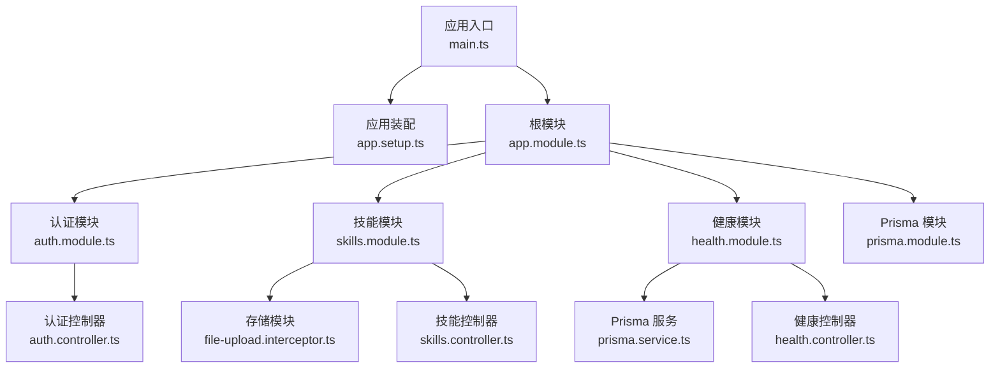
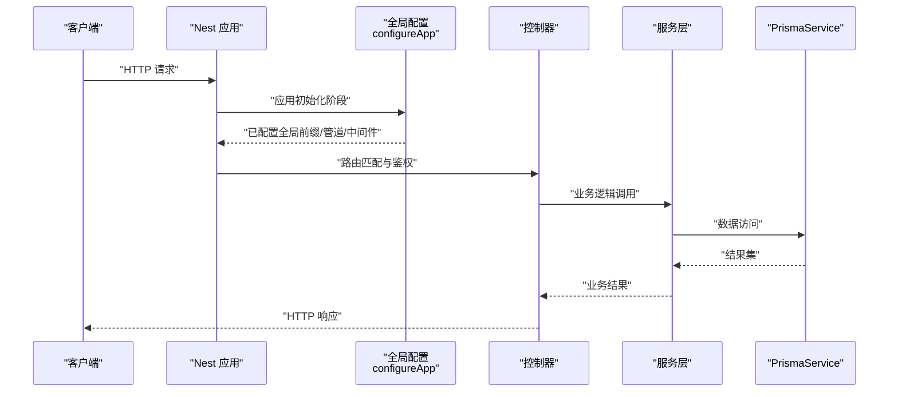
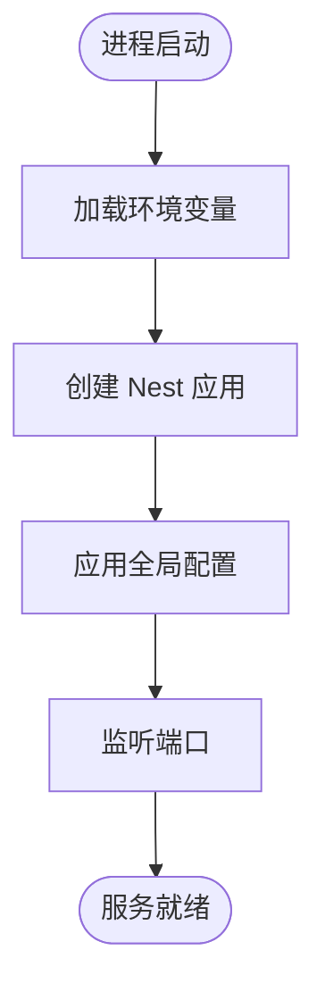
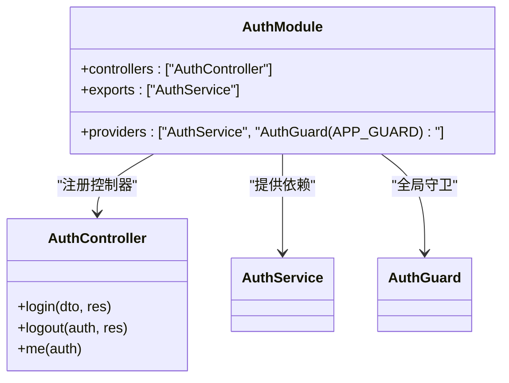
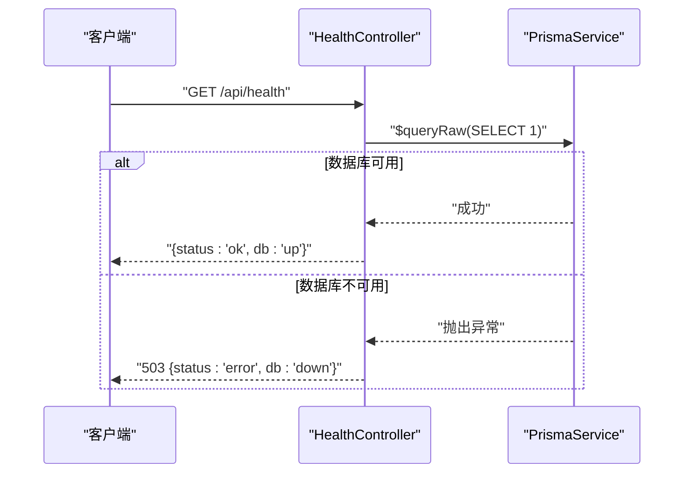
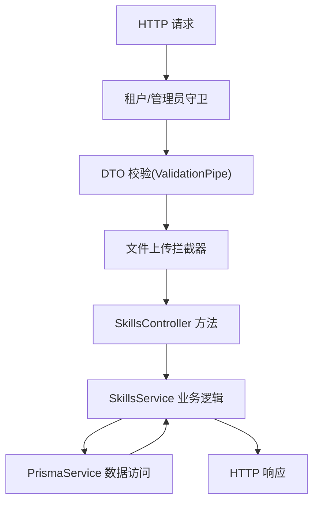
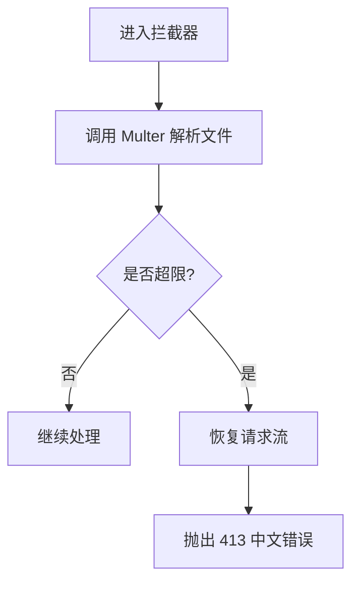
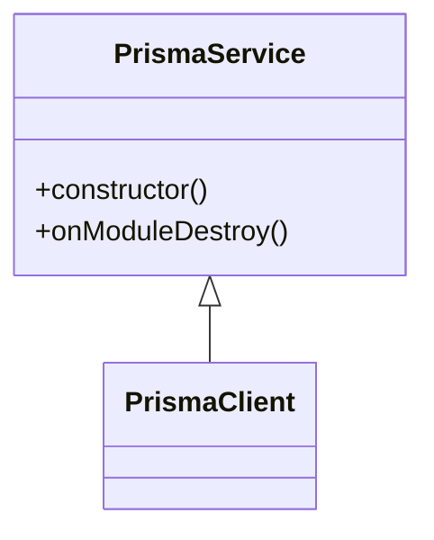
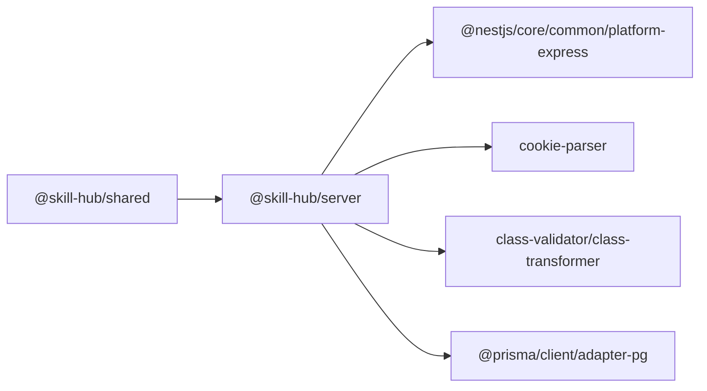

# 后端服务

<cite>
**本文引用的文件**   
- [apps/server/src/main.ts](file://apps/server/src/main.ts)
- [apps/server/src/app.module.ts](file://apps/server/src/app.module.ts)
- [apps/server/src/app.setup.ts](file://apps/server/src/app.setup.ts)
- [apps/server/package.json](file://apps/server/package.json)
- [packages/shared/src/index.ts](file://packages/shared/src/index.ts)
- [apps/server/src/auth/auth.module.ts](file://apps/server/src/auth/auth.module.ts)
- [apps/server/src/health/health.module.ts](file://apps/server/src/health/health.module.ts)
- [apps/server/src/prisma/prisma.module.ts](file://apps/server/src/prisma/prisma.module.ts)
- [apps/server/src/skills/skills.module.ts](file://apps/server/src/skills/skills.module.ts)
- [apps/server/src/auth/auth.controller.ts](file://apps/server/src/auth/auth.controller.ts)
- [apps/server/src/health/health.controller.ts](file://apps/server/src/health/health.controller.ts)
- [apps/server/src/prisma/prisma.service.ts](file://apps/server/src/prisma/prisma.service.ts)
- [apps/server/src/skills/skills.controller.ts](file://apps/server/src/skills/skills.controller.ts)
- [apps/server/src/storage/file-upload.interceptor.ts](file://apps/server/src/storage/file-upload.interceptor.ts)
</cite>

## 目录
1. [简介](#简介)
2. [项目结构](#项目结构)
3. [核心组件](#核心组件)
4. [架构总览](#架构总览)
5. [详细组件分析](#详细组件分析)
6. [依赖关系分析](#依赖关系分析)
7. [性能与可观测性](#性能与可观测性)
8. [故障排查指南](#故障排查指南)
9. [结论](#结论)
10. [附录](#附录)

## 简介
本文件面向开发者，系统化阐述基于 NestJS 构建的企业级 API 后端服务。内容涵盖应用初始化流程、模块注册机制、中间件与全局管道配置、RESTful API 设计原则与统一响应格式、错误处理策略、日志与监控集成建议、配置文件与环境变量安全、CORS 与请求拦截器、全局异常处理、API 版本管理与向后兼容策略，以及调试技巧与性能分析方法，帮助读者快速理解并扩展该服务。

## 项目结构
后端服务位于 apps/server 目录，采用按领域划分的模块化组织方式：
- 应用入口与装配：main.ts、app.module.ts、app.setup.ts
- 领域模块：auth（认证与会话）、skills（技能资源与审核相关控制器）、health（健康检查）
- 基础设施：prisma（数据库客户端封装）、storage（文件上传拦截器）
- 共享契约：packages/shared（API 前缀、健康响应模型等）

图表来源
- [apps/server/src/main.ts:8-11](file://apps/server/src/main.ts#L8-L11)
- [apps/server/src/app.setup.ts:7-24](file://apps/server/src/app.setup.ts#L7-L24)
- [apps/server/src/app.module.ts:7-9](file://apps/server/src/app.module.ts#L7-L9)
- [apps/server/src/auth/auth.module.ts:7-11](file://apps/server/src/auth/auth.module.ts#L7-L11)
- [apps/server/src/skills/skills.module.ts:13-18](file://apps/server/src/skills/skills.module.ts#L13-L18)
- [apps/server/src/health/health.module.ts:4-7](file://apps/server/src/health/health.module.ts#L4-L7)
- [apps/server/src/prisma/prisma.module.ts:4-9](file://apps/server/src/prisma/prisma.module.ts#L4-L9)
- [apps/server/src/storage/file-upload.interceptor.ts:6-26](file://apps/server/src/storage/file-upload.interceptor.ts#L6-L26)
- [apps/server/src/auth/auth.controller.ts:9-25](file://apps/server/src/auth/auth.controller.ts#L9-L25)
- [apps/server/src/health/health.controller.ts:6-20](file://apps/server/src/health/health.controller.ts#L6-L20)
- [apps/server/src/skills/skills.controller.ts:12-143](file://apps/server/src/skills/skills.controller.ts#L12-L143)
- [apps/server/src/prisma/prisma.service.ts:5-13](file://apps/server/src/prisma/prisma.service.ts#L5-L13)

章节来源
- [apps/server/src/main.ts:1-14](file://apps/server/src/main.ts#L1-L14)
- [apps/server/src/app.module.ts:1-10](file://apps/server/src/app.module.ts#L1-L10)
- [apps/server/src/app.setup.ts:1-26](file://apps/server/src/app.setup.ts#L1-L26)
- [apps/server/package.json:10-20](file://apps/server/package.json#L10-L20)

## 核心组件
- 应用启动与监听：通过 NestFactory 创建应用实例，调用 configureApp 完成全局配置后监听端口。
- 全局配置：设置 API 前缀、启用 Cookie 解析、注册全局 ValidationPipe、启用优雅关闭钩子。
- 模块装配：根模块聚合 PrismaModule、AuthModule、HealthModule、SkillsModule。
- 认证与会话：提供登录、登出、当前用户信息接口，使用 Cookie 承载会话令牌，并通过全局守卫 AuthGuard 保护路由。
- 健康检查：对外暴露 /api/health，检测数据库连通性并返回状态。
- 技能资源：提供技能的列表、详情、创建、更新可见性与分类、版本管理、下载、下架/重新上架等能力。
- 文件上传：封装 Multer 的单文件上传拦截器，限制大小并给出中文提示，避免连接重置。
- 数据库访问：封装 PrismaClient，注入 PostgreSQL 适配器，并在模块销毁时断开连接。

章节来源
- [apps/server/src/main.ts:8-11](file://apps/server/src/main.ts#L8-L11)
- [apps/server/src/app.setup.ts:7-24](file://apps/server/src/app.setup.ts#L7-L24)
- [apps/server/src/app.module.ts:7-9](file://apps/server/src/app.module.ts#L7-L9)
- [apps/server/src/auth/auth.module.ts:7-11](file://apps/server/src/auth/auth.module.ts#L7-L11)
- [apps/server/src/health/health.controller.ts:6-20](file://apps/server/src/health/health.controller.ts#L6-L20)
- [apps/server/src/skills/skills.controller.ts:12-143](file://apps/server/src/skills/skills.controller.ts#L12-L143)
- [apps/server/src/storage/file-upload.interceptor.ts:6-26](file://apps/server/src/storage/file-upload.interceptor.ts#L6-L26)
- [apps/server/src/prisma/prisma.service.ts:5-13](file://apps/server/src/prisma/prisma.service.ts#L5-L13)

## 架构总览
下图展示从 HTTP 请求到控制器、服务、数据库的调用链，以及全局中间件与管道的参与点。

图表来源
- [apps/server/src/main.ts:8-11](file://apps/server/src/main.ts#L8-L11)
- [apps/server/src/app.setup.ts:7-24](file://apps/server/src/app.setup.ts#L7-L24)
- [apps/server/src/auth/auth.controller.ts:9-25](file://apps/server/src/auth/auth.controller.ts#L9-L25)
- [apps/server/src/skills/skills.controller.ts:12-143](file://apps/server/src/skills/skills.controller.ts#L12-L143)
- [apps/server/src/prisma/prisma.service.ts:5-13](file://apps/server/src/prisma/prisma.service.ts#L5-L13)

## 详细组件分析

### 应用初始化与模块注册
- 入口 main.ts 加载环境变量与反射元数据，创建 NestExpressApplication，交由 app.setup.ts 的全局配置函数进行装配，最后监听端口。
- 根模块 app.module.ts 导入 PrismaModule、AuthModule、HealthModule、SkillsModule，形成清晰的领域边界。
- 全局配置 app.setup.ts 设置 API 前缀为 packages/shared 中定义的常量，启用 cookie-parser，注册全局 ValidationPipe（白名单、转换、首个错误即停），并开启优雅关闭钩子。

图表来源
- [apps/server/src/main.ts:1-11](file://apps/server/src/main.ts#L1-L11)
- [apps/server/src/app.setup.ts:7-24](file://apps/server/src/app.setup.ts#L7-L24)
- [packages/shared/src/index.ts:1-3](file://packages/shared/src/index.ts#L1-L3)

章节来源
- [apps/server/src/main.ts:1-14](file://apps/server/src/main.ts#L1-L14)
- [apps/server/src/app.module.ts:1-10](file://apps/server/src/app.module.ts#L1-L10)
- [apps/server/src/app.setup.ts:1-26](file://apps/server/src/app.setup.ts#L1-L26)
- [packages/shared/src/index.ts:1-8](file://packages/shared/src/index.ts#L1-L8)

### 认证与会话
- 认证模块 auth.module.ts 将 AuthService 作为提供者，并通过 APP_GUARD 注入 AuthGuard，实现全局鉴权。
- 认证控制器 auth.controller.ts 提供登录、登出、获取当前用户信息接口；登录成功后写入 HttpOnly Cookie，登出时清除 Cookie；me 接口返回当前用户信息。
- 会话 TTL 与 Cookie 安全属性在控制器内集中定义，支持根据环境变量切换 secure 模式。

图表来源
- [apps/server/src/auth/auth.module.ts:7-11](file://apps/server/src/auth/auth.module.ts#L7-L11)
- [apps/server/src/auth/auth.controller.ts:9-25](file://apps/server/src/auth/auth.controller.ts#L9-L25)

章节来源
- [apps/server/src/auth/auth.module.ts:1-13](file://apps/server/src/auth/auth.module.ts#L1-L13)
- [apps/server/src/auth/auth.controller.ts:1-26](file://apps/server/src/auth/auth.controller.ts#L1-L26)

### 健康检查
- 健康控制器 health.controller.ts 暴露 GET /api/health，尝试执行 SELECT 1 以探测数据库连通性；失败时抛出 ServiceUnavailableException，成功返回 ok/up 状态。
- 健康模块 health.module.ts 仅注册控制器，保持职责单一。

图表来源
- [apps/server/src/health/health.controller.ts:6-20](file://apps/server/src/health/health.controller.ts#L6-L20)
- [apps/server/src/prisma/prisma.service.ts:5-13](file://apps/server/src/prisma/prisma.service.ts#L5-L13)

章节来源
- [apps/server/src/health/health.module.ts:1-8](file://apps/server/src/health/health.module.ts#L1-L8)
- [apps/server/src/health/health.controller.ts:1-21](file://apps/server/src/health/health.controller.ts#L1-L21)
- [apps/server/src/prisma/prisma.service.ts:1-15](file://apps/server/src/prisma/prisma.service.ts#L1-L15)

### 技能资源 API
- 技能控制器 skills.controller.ts 提供丰富的 RESTful 端点：列表、详情、创建、更新可见性与分类、版本管理、下载、下架/重新上架等。
- 权限控制通过装饰器组合实现：TenantMember、TenantAdminOnly、CurrentEmployee、Auth 等，确保租户隔离与管理员权限。
- 文件上传通过 UseInterceptors(SkillUploadInterceptor) 接入，结合 DTO 校验与业务参数传递。

图表来源
- [apps/server/src/skills/skills.controller.ts:12-143](file://apps/server/src/skills/skills.controller.ts#L12-L143)
- [apps/server/src/storage/file-upload.interceptor.ts:6-26](file://apps/server/src/storage/file-upload.interceptor.ts#L6-L26)

章节来源
- [apps/server/src/skills/skills.module.ts:1-19](file://apps/server/src/skills/skills.module.ts#L1-L19)
- [apps/server/src/skills/skills.controller.ts:1-145](file://apps/server/src/skills/skills.controller.ts#L1-L145)
- [apps/server/src/storage/file-upload.interceptor.ts:1-28](file://apps/server/src/storage/file-upload.interceptor.ts#L1-L28)

### 文件上传拦截器
- fileUploadInterceptor 工厂函数返回一个 NestInterceptor，内部包装 FileInterceptor('file')，限制单文件大小与数量。
- 当超过限制时捕获 PayloadTooLargeException，先恢复请求流以避免客户端连接重置，再抛出带中文提示的 413 错误。

图表来源
- [apps/server/src/storage/file-upload.interceptor.ts:6-26](file://apps/server/src/storage/file-upload.interceptor.ts#L6-L26)

章节来源
- [apps/server/src/storage/file-upload.interceptor.ts:1-28](file://apps/server/src/storage/file-upload.interceptor.ts#L1-L28)

### 数据库访问与生命周期
- PrismaService 继承 PrismaClient，使用 @prisma/adapter-pg 适配 PostgreSQL，连接字符串来自环境变量 DATABASE_URL。
- 实现 OnModuleDestroy 钩子在模块销毁时断开数据库连接，保证优雅退出。

图表来源
- [apps/server/src/prisma/prisma.service.ts:5-13](file://apps/server/src/prisma/prisma.service.ts#L5-L13)

章节来源
- [apps/server/src/prisma/prisma.service.ts:1-15](file://apps/server/src/prisma/prisma.service.ts#L1-L15)
- [apps/server/src/prisma/prisma.module.ts:1-10](file://apps/server/src/prisma/prisma.module.ts#L1-L10)

## 依赖关系分析
- 模块耦合：根模块聚合各业务模块；SkillsModule 依赖 StorageModule；HealthModule 与 PrismaModule 解耦但通过控制器消费 PrismaService。
- 外部依赖：@nestjs/* 框架包、cookie-parser、dotenv、class-validator/class-transformer、Prisma 生态、fflate（用于 zip 处理）。
- 共享契约：packages/shared 提供 API_PREFIX、HEALTH_PATH 与健康响应类型，前后端共用，降低耦合。

图表来源
- [apps/server/package.json:22-36](file://apps/server/package.json#L22-L36)
- [packages/shared/src/index.ts:1-8](file://packages/shared/src/index.ts#L1-L8)

章节来源
- [apps/server/package.json:1-55](file://apps/server/package.json#L1-L55)
- [packages/shared/src/index.ts:1-13](file://packages/shared/src/index.ts#L1-L13)

## 性能与可观测性
- 请求体校验：全局 ValidationPipe 开启 transform 与 whitelist，减少无效字段传输，提升一致性；stopAtFirstError 使前端更快获知首个错误。
- 文件上传限流：拦截器限制文件大小，避免大文件阻塞工作线程；提前恢复请求流防止连接重置。
- 优雅关闭：enableShutdownHooks 配合 PrismaService 的 onModuleDestroy，确保在停机时释放数据库连接。
- 可观测性建议：
  - 日志：引入 Winston/Pino 适配器，统一记录请求 ID、耗时、状态码与关键业务上下文。
  - 指标：集成 Prometheus 指标收集（如请求计数、延迟直方图、错误率），对健康检查与关键接口暴露指标。
  - 追踪：引入 OpenTelemetry 链路追踪，串联网关、API、数据库与对象存储调用。
- 缓存与分页：对高频只读接口（如技能列表）考虑 Redis 缓存与游标分页；对大体积下载接口使用流式传输（已在下载接口中使用 StreamableFile）。

[本节为通用指导，不直接分析具体文件]

## 故障排查指南
- 参数校验失败：全局 ValidationPipe 会返回 BadRequestException，消息取自第一个校验错误的 constraints；检查 DTO 定义与传入参数。
- 文件过大：拦截器返回 413 并附带中文提示；确认客户端上传大小与服务端限制一致，必要时调整 maxBytes。
- 数据库不可用：健康检查返回 503 且 db=down；检查 DATABASE_URL、网络连通性与数据库服务状态。
- 会话问题：Cookie 未生效或跨域丢失；检查 SESSION_COOKIE_SECURE、SameSite、Path 与 CORS 配置；确认浏览器是否允许第三方 Cookie。
- 优雅关闭：服务停止后仍有数据库连接占用；确认 enableShutdownHooks 已启用且 PrismaService 正确断开连接。

章节来源
- [apps/server/src/app.setup.ts:10-22](file://apps/server/src/app.setup.ts#L10-L22)
- [apps/server/src/storage/file-upload.interceptor.ts:13-23](file://apps/server/src/storage/file-upload.interceptor.ts#L13-L23)
- [apps/server/src/health/health.controller.ts:11-18](file://apps/server/src/health/health.controller.ts#L11-L18)
- [apps/server/src/auth/auth.controller.ts:8-22](file://apps/server/src/auth/auth.controller.ts#L8-L22)
- [apps/server/src/prisma/prisma.service.ts:11-13](file://apps/server/src/prisma/prisma.service.ts#L11-L13)

## 结论
该后端服务以 NestJS 为核心，采用模块化与领域驱动的组织方式，结合全局管道、守卫与拦截器，实现了统一的参数校验、鉴权与文件处理能力。通过共享契约与清晰的路由设计，保证了前后端协作效率与可扩展性。在生产环境中，建议补充日志、指标与链路追踪，完善错误上报与告警，持续优化性能与稳定性。

[本节为总结性内容，不直接分析具体文件]

## 附录

### RESTful API 设计原则与统一响应格式
- 资源命名：名词化、复数形式（如 /skills、/categories）。
- 动作语义：使用 HTTP 动词表达操作意图（GET/POST/PATCH/DELETE）。
- 路径层级：合理划分资源层级（如 /skills/:id/versions/:versionId/download）。
- 状态码：遵循标准语义（200/201/204/400/401/403/404/413/503）。
- 统一响应：建议统一包裹 { ok, data, message } 结构；当前部分接口直接返回业务对象，可在全局过滤器中规范化。

[本节为概念性说明，不直接分析具体文件]

### 环境变量与安全
- 必要变量：PORT、DATABASE_URL、SESSION_COOKIE_SECURE。
- 安全建议：
  - 不在代码中硬编码敏感信息，使用 .env 与密钥管理服务。
  - 生产环境启用 HTTPS 与 secure Cookie。
  - 最小权限原则配置数据库账户与网络访问。

章节来源
- [apps/server/src/main.ts:1-11](file://apps/server/src/main.ts#L1-L11)
- [apps/server/src/prisma/prisma.service.ts:7-9](file://apps/server/src/prisma/prisma.service.ts#L7-L9)
- [apps/server/src/auth/auth.controller.ts:8-8](file://apps/server/src/auth/auth.controller.ts#L8-L8)

### CORS、请求拦截器与全局异常处理
- CORS：如需跨域，可在 configureApp 中启用 cors 中间件并配置 allowed origins、methods、credentials。
- 请求拦截器：文件上传拦截器已处理超大请求体；可按需扩展日志、审计、限流等拦截器。
- 全局异常处理：可注册全局 ExceptionFilter 统一格式化错误响应，包含 code、message、traceId 等字段。

[本节为通用指导，不直接分析具体文件]

### API 版本管理与向后兼容
- 版本策略：建议使用 URL 前缀（如 /api/v1）或请求头（X-API-Version）进行版本控制。
- 兼容性：新增字段默认可选，废弃字段保留一段时间并提供迁移指引；变更行为时发布新版本并维护旧版本。
- 文档与契约：使用 OpenAPI/Swagger 生成契约文档，配合 packages/shared 的类型定义保障前后端一致性。

[本节为通用指导，不直接分析具体文件]

### 调试技巧与性能分析方法
- 调试：
  - 使用 nest start --watch 开发热重载。
  - 在控制器或服务中添加结构化日志，输出请求 ID、入参摘要与耗时。
  - 使用 curl 或 Postman 验证端点，关注状态码与响应体。
- 性能分析：
  - 使用 Node.js 内置 profiler 或 Clinic.js 定位热点。
  - 对数据库查询添加索引与慢查询日志，结合 Prisma 日志观察 SQL。
  - 对大文件下载使用流式传输，避免内存峰值。

章节来源
- [apps/server/package.json:10-20](file://apps/server/package.json#L10-L20)
- [apps/server/src/skills/skills.controller.ts:135-143](file://apps/server/src/skills/skills.controller.ts#L135-L143)