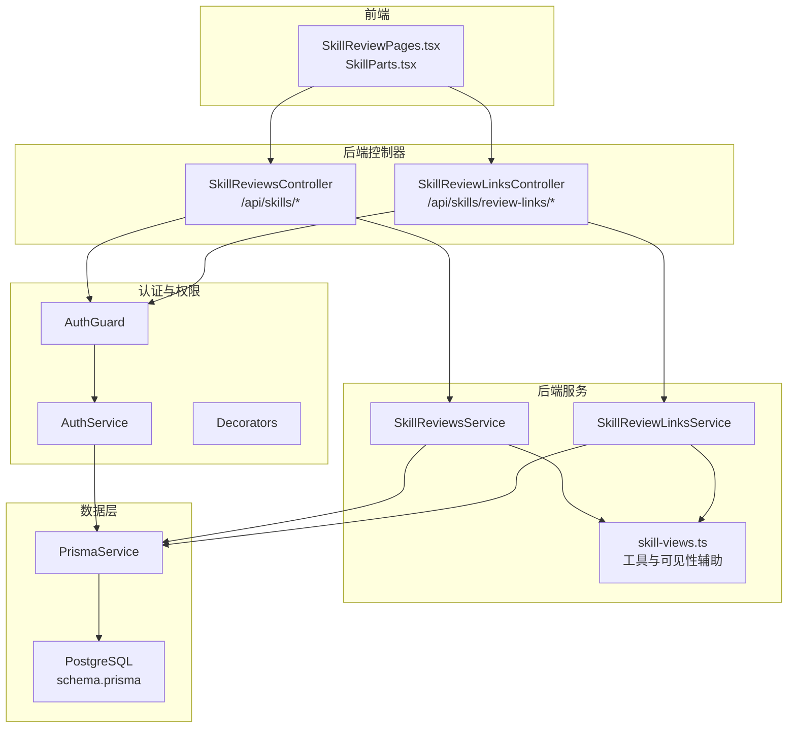
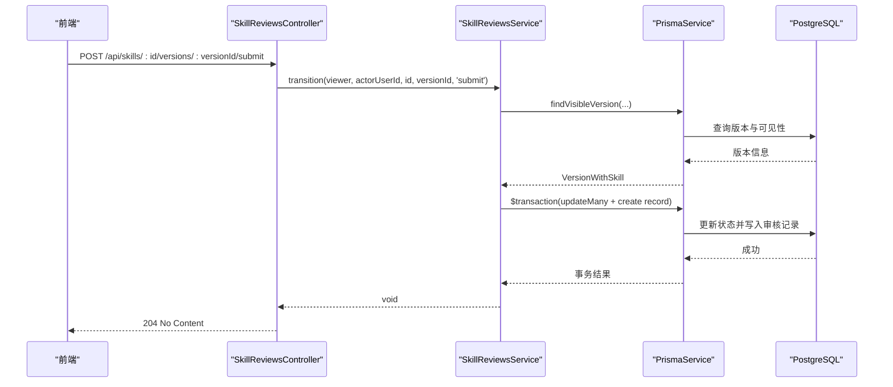
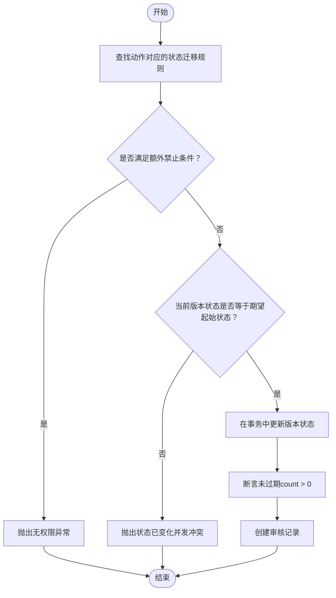
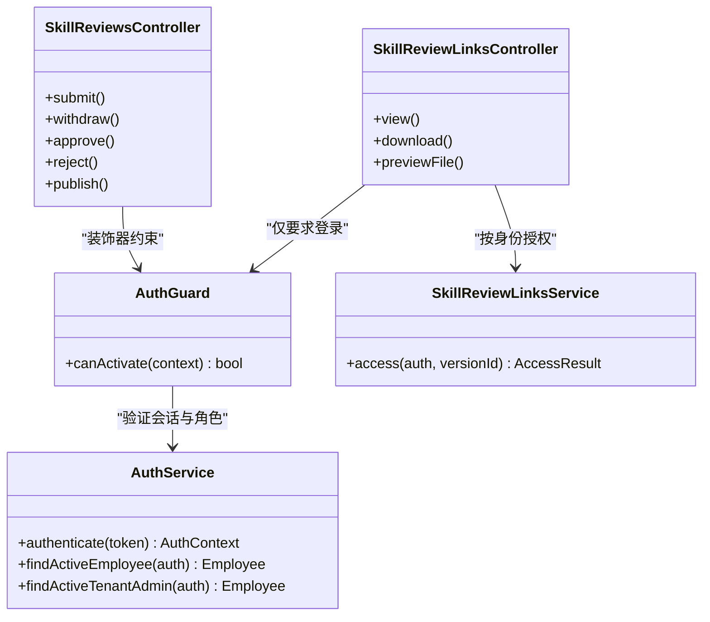
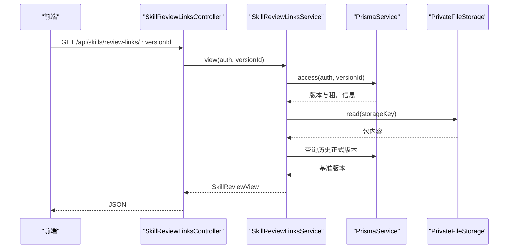
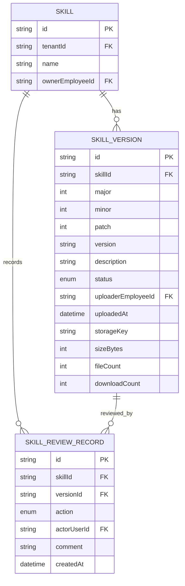
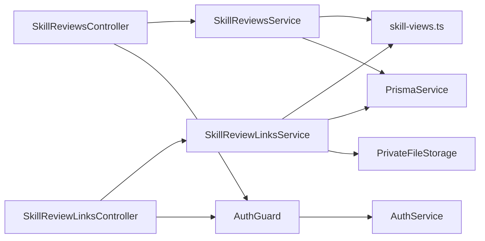

# 审核工作流系统

<cite>
**本文引用的文件**   
- [skill-reviews.service.ts](file://apps/server/src/skills/skill-reviews.service.ts)
- [skill-reviews.controller.ts](file://apps/server/src/skills/skill-reviews.controller.ts)
- [skill-review-links.service.ts](file://apps/server/src/skills/skill-review-links.service.ts)
- [skill-review-links.controller.ts](file://apps/server/src/skills/skill-review-links.controller.ts)
- [skill-views.ts](file://apps/server/src/skills/skill-views.ts)
- [skills.dto.ts](file://apps/server/src/skills/skills.dto.ts)
- [schema.prisma](file://apps/server/prisma/schema.prisma)
- [auth.service.ts](file://apps/server/src/auth/auth.service.ts)
- [auth.guard.ts](file://apps/server/src/auth/auth.guard.ts)
- [decorators.ts](file://apps/server/src/auth/decorators.ts)
- [skill.ts](file://packages/shared/src/skill.ts)
- [index.ts](file://packages/shared/src/index.ts)
- [SkillReviewPages.tsx](file://apps/web/src/pages/SkillReviewPages.tsx)
- [SkillParts.tsx](file://apps/web/src/pages/SkillParts.tsx)
- [skill-reviews.e2e-spec.ts](file://apps/server/test/skill-reviews.e2e-spec.ts)
</cite>

## 目录
1. [引言](#引言)
2. [项目结构](#项目结构)
3. [核心组件](#核心组件)
4. [架构总览](#架构总览)
5. [详细组件分析](#详细组件分析)
6. [依赖关系分析](#依赖关系分析)
7. [性能与并发特性](#性能与并发特性)
8. [故障排查指南](#故障排查指南)
9. [结论](#结论)
10. [附录：API 调用示例与集成指南](#附录api-调用示例与集成指南)

## 引言
本技术文档围绕“审核工作流系统”展开，聚焦以下目标：
- 解释审核状态机设计模式，包括草稿、待审核、已发布等状态转换规则。
- 说明审核权限控制机制，包括管理员角色验证和操作权限检查。
- 阐述审核链接生成和验证机制，确保审核过程的安全性和可追溯性。
- 解释审核记录的持久化存储和历史追踪功能。
- 说明异步审核任务处理和通知机制（当前实现为同步流程，扩展点见文末）。
- 提供审核流程的配置选项和扩展点。
- 给出审核工作流的 API 调用示例和集成指南。

该系统以 NestJS 后端为核心，使用 Prisma 管理 PostgreSQL 数据模型，前端通过页面与接口交互完成上传、提交、审核、查看差异等操作。

## 项目结构
审核相关代码主要分布在以下位置：
- 后端服务层：`apps/server/src/skills/skill-reviews.service.ts`、`apps/server/src/skills/skill-review-links.service.ts`
- 控制器层：`apps/server/src/skills/skill-reviews.controller.ts`、`apps/server/src/skills/skill-review-links.controller.ts`
- 通用视图与工具：`apps/server/src/skills/skill-views.ts`
- 校验 DTO：`apps/server/src/skills/skills.dto.ts`
- 数据库模型：`apps/server/prisma/schema.prisma`
- 认证与权限：`apps/server/src/auth/auth.service.ts`、`apps/server/src/auth/auth.guard.ts`、`apps/server/src/auth/decorators.ts`
- 共享类型与常量：`packages/shared/src/skill.ts`、`packages/shared/src/index.ts`
- 前端审核页：`apps/web/src/pages/SkillReviewPages.tsx`、`apps/web/src/pages/SkillParts.tsx`

**图表来源**
- [skill-reviews.controller.ts:1-76](file://apps/server/src/skills/sill-reviews.controller.ts#L1-L76)
- [skill-review-links.controller.ts:1-33](file://apps/server/src/skills/skill-review-links.controller.ts#L1-L33)
- [skill-reviews.service.ts:1-113](file://apps/server/src/skills/skill-reviews.service.ts#L1-L113)
- [skill-review-links.service.ts:1-147](file://apps/server/src/skills/skill-review-links.service.ts#L1-L147)
- [skill-views.ts:1-111](file://apps/server/src/skills/skill-views.ts#L1-L111)
- [auth.guard.ts:1-49](file://apps/server/src/auth/auth.guard.ts#L1-L49)
- [auth.service.ts:1-77](file://apps/server/src/auth/auth.service.ts#L1-L77)
- [schema.prisma:1-219](file://apps/server/prisma/schema.prisma#L1-L219)

**章节来源**
- [skill-reviews.controller.ts:1-76](file://apps/server/src/skills/skill-reviews.controller.ts#L1-L76)
- [skill-review-links.controller.ts:1-33](file://apps/server/src/skills/skill-review-links.controller.ts#L1-L33)
- [skill-reviews.service.ts:1-113](file://apps/server/src/skills/skill-reviews.service.ts#L1-L113)
- [skill-review-links.service.ts:1-147](file://apps/server/src/skills/skill-review-links.service.ts#L1-L147)
- [skill-views.ts:1-111](file://apps/server/src/skills/skill-views.ts#L1-L111)
- [auth.guard.ts:1-49](file://apps/server/src/auth/auth.guard.ts#L1-L49)
- [auth.service.ts:1-77](file://apps/server/src/auth/auth.service.ts#L1-L77)
- [schema.prisma:1-219](file://apps/server/prisma/schema.prisma#L1-L219)

## 核心组件
- SkillReviewsService：负责版本状态迁移、待审核列表、全租户审核记录分页、菜单红点统计。
- SkillReviewLinksService：负责审核链接的访问授权、文件预览、下载审阅、与基准版本的差异计算。
- SkillReviewsController：暴露审核动作（提交、撤回、通过、驳回、直接发布）与查询接口。
- SkillReviewLinksController：暴露审核链接查看、下载、文件预览接口。
- skill-views.ts：提供可见性判断、版本与记录信息转换、并发安全断言等工具。
- 认证模块：AuthGuard、AuthService、Decorators 提供登录态、租户成员/管理员/超管权限校验。
- 数据模型：Prisma schema 定义 Skill、SkillVersion、SkillReviewRecord 等实体及枚举。

**章节来源**
- [skill-reviews.service.ts:1-113](file://apps/server/src/skills/skill-reviews.service.ts#L1-L113)
- [skill-review-links.service.ts:1-147](file://apps/server/src/skills/skill-review-links.service.ts#L1-L147)
- [skill-reviews.controller.ts:1-76](file://apps/server/src/skills/skill-reviews.controller.ts#L1-L76)
- [skill-review-links.controller.ts:1-33](file://apps/server/src/skills/skill-review-links.controller.ts#L1-L33)
- [skill-views.ts:1-111](file://apps/server/src/skills/skill-views.ts#L1-L111)
- [auth.guard.ts:1-49](file://apps/server/src/auth/auth.guard.ts#L1-L49)
- [auth.service.ts:1-77](file://apps/server/src/auth/auth.service.ts#L1-L77)
- [schema.prisma:1-219](file://apps/server/prisma/schema.prisma#L1-L219)

## 架构总览
审核工作流采用“控制器 → 服务 → 数据层”的分层架构，并通过装饰器与守卫进行权限控制。状态机逻辑集中在 Service 层，保证业务规则集中且可测试；控制器仅做参数绑定与路由职责。

**图表来源**
- [skill-reviews.controller.ts:36-40](file://apps/server/src/skills/skill-reviews.controller.ts#L36-L40)
- [skill-reviews.service.ts:55-67](file://apps/server/src/skills/skill-reviews.service.ts#L55-L67)
- [skill-views.ts:96-101](file://apps/server/src/skills/skill-views.ts#L96-L101)
- [schema.prisma:170-218](file://apps/server/prisma/schema.prisma#L170-L218)

## 详细组件分析

### 审核状态机设计
状态机将“状态变更规则”与“权限校验”解耦，使用映射表定义每个步骤的起始状态、目标状态、动作标识以及额外禁止条件。

- 状态集合：草稿（draft）、待审核（pending）、已发布（published）。
- 动作集合：提交（submit）、撤回（withdraw）、通过（approve）、驳回（reject）、直接发布（publish_direct）。
- 关键规则：
  - 提交：仅允许从草稿到待审核，且只有该 Skill 的所有者可提交或撤回。
  - 撤回：仅允许从待审核回到草稿，且只有所有者可操作。
  - 通过：仅允许从待审核到已发布，由租户管理员执行。
  - 驳回：仅允许从待审核回到草稿，由租户管理员执行，必须填写意见。
  - 直接发布：仅允许租户管理员对自己上传的草稿直接发布；员工草稿须提交审核。

**图表来源**
- [skill-reviews.service.ts:20-44](file://apps/server/src/skills/skill-reviews.service.ts#L20-L44)
- [skill-reviews.service.ts:55-67](file://apps/server/src/skills/skill-reviews.service.ts#L55-L67)
- [skill-views.ts:103-110](file://apps/server/src/skills/skill-views.ts#L103-L110)

**章节来源**
- [skill-reviews.service.ts:20-44](file://apps/server/src/skills/skill-reviews.service.ts#L20-L44)
- [skill-reviews.service.ts:55-67](file://apps/server/src/skills/skill-reviews.service.ts#L55-L67)
- [skill-views.ts:103-110](file://apps/server/src/skills/skill-views.ts#L103-L110)
- [skill.ts:92-109](file://packages/shared/src/skill.ts#L92-L109)

### 审核权限控制机制
权限控制基于全局守卫与装饰器：
- 默认所有接口需登录。
- `@TenantMember()`：仅当前租户的启用中员工可访问。
- `@TenantAdminOnly()`：仅当前租户的管理员可访问。
- `@SuperAdminOnly()`：仅超管可访问。
- 审核链接接口不强制租户成员，但按身份授权（租户管理员、所有者、超管），其他用户一律 403。

**图表来源**
- [auth.guard.ts:1-49](file://apps/server/src/auth/auth.guard.ts#L1-L49)
- [auth.service.ts:30-49](file://apps/server/src/auth/auth.service.ts#L30-L49)
- [skill-reviews.controller.ts:12-74](file://apps/server/src/skills/skill-reviews.controller.ts#L12-L74)
- [skill-review-links.controller.ts:11-31](file://apps/server/src/skills/skill-review-links.controller.ts#L11-L31)
- [skill-review-links.service.ts:135-145](file://apps/server/src/skills/skill-review-links.service.ts#L135-L145)

**章节来源**
- [auth.guard.ts:1-49](file://apps/server/src/auth/auth.guard.ts#L1-L49)
- [auth.service.ts:30-49](file://apps/server/src/auth/auth.service.ts#L30-L49)
- [decorators.ts:1-18](file://apps/server/src/auth/decorators.ts#L1-L18)
- [skill-reviews.controller.ts:12-74](file://apps/server/src/skills/skill-reviews.controller.ts#L12-L74)
- [skill-review-links.controller.ts:11-31](file://apps/server/src/skills/skill-review-links.controller.ts#L11-L31)
- [skill-review-links.service.ts:135-145](file://apps/server/src/skills/skill-review-links.service.ts#L135-L145)

### 审核链接生成与验证机制
- 审核链接路径：`/skills/review/:versionId`，对应后端 `/api/skills/review-links/:versionId`。
- 链接本身不带权限令牌，仍需登录；服务端根据登录身份决定角色：
  - 超管：只读。
  - 租户管理员：若版本处于待审核则可审核，否则只读。
  - 所有者：只读。
  - 其他人：403。
- 安全性：
  - 文件预览路径规范化，拒绝绝对路径与包含 `..` 的路径。
  - 二进制文件检测与截断预览，避免大文件影响性能。
  - 下载审阅不计入下载次数，避免刷量。

**图表来源**
- [skill-review-links.controller.ts:15-18](file://apps/server/src/skills/skill-review-links.controller.ts#L15-L18)
- [skill-review-links.service.ts:75-103](file://apps/server/src/skills/skill-review-links.service.ts#L75-L103)
- [skill-review-links.service.ts:131-133](file://apps/server/src/skills/skill-review-links.service.ts#L131-L133)

**章节来源**
- [skill-review-links.controller.ts:1-33](file://apps/server/src/skills/skill-review-links.controller.ts#L1-L33)
- [skill-review-links.service.ts:1-147](file://apps/server/src/skills/skill-review-links.service.ts#L1-L147)
- [skill.ts:295-315](file://packages/shared/src/skill.ts#L295-L315)

### 审核记录的持久化存储与历史追踪
- 数据模型：
  - `SkillVersion`：保存版本号、描述、状态、上传者、存储键、大小、文件数、下载次数等。
  - `SkillReviewRecord`：记录每次审核动作的操作人、关联 Skill 与版本、动作类型、意见、时间戳。
- 历史记录查询：
  - 全租户审核记录分页，按创建时间与 ID 排序保证稳定顺序。
  - 针对草稿版本，最近一次非 reupload 的驳回意见会返回给所有者。
- 审计能力：
  - 每条状态变更都落库，支持回溯与审计。
  - 前端展示审核记录表格，包含动作标签、操作人、意见等。

**图表来源**
- [schema.prisma:104-218](file://apps/server/prisma/schema.prisma#L104-L218)
- [skill-views.ts:43-56](file://apps/server/src/skills/skill-views.ts#L43-L56)
- [skill-views.ts:72-79](file://apps/server/src/skills/skill-views.ts#L72-L79)

**章节来源**
- [schema.prisma:104-218](file://apps/server/prisma/schema.prisma#L104-L218)
- [skill-views.ts:43-56](file://apps/server/src/skills/skill-views.ts#L43-L56)
- [skill-views.ts:72-79](file://apps/server/src/skills/skill-views.ts#L72-L79)

### 异步审核任务处理与通知机制
当前实现为同步流程：
- 审核动作在请求上下文中直接执行状态迁移与记录写入。
- 没有独立的异步任务队列或消息总线。
- 通知机制未在代码中出现，可通过扩展点接入邮件、站内信或外部通知系统。

建议扩展点：
- 在 `SkillReviewsService.transition` 成功后触发事件（如使用 NestJS Events 或外部消息队列）。
- 在 `SkillReviewLinksService.view` 后对需要切换租户的场景发送提醒。
- 在审核通过后向 Skill 所有者发送通知。

**章节来源**
- [skill-reviews.service.ts:55-67](file://apps/server/src/skills/skill-reviews.service.ts#L55-L67)
- [skill-review-links.service.ts:75-103](file://apps/server/src/skills/skill-review-links.service.ts#L75-L103)

### 配置选项与扩展点
- 状态与动作枚举：
  - `SkillVersionStatus`：draft、pending、published。
  - `SkillReviewAction`：publish_direct、submit、withdraw、approve、reject、reupload、change_visibility、change_category、unlist、relist。
- 上传模式：
  - `SkillUploadMode`：publish、draft、submit。
- 可见性：
  - `SkillVisibility`：tenant、departments、employees、private。
- 预览限制：
  - `SKILL_PREVIEW_MAX_CHARS`：文本预览最大字符数。
- 扩展点：
  - 新增状态迁移规则可在 `TRANSITIONS` 中添加。
  - 新增权限策略可在 `AuthGuard` 与装饰器中扩展。
  - 新增审核动作可在 `SkillReviewAction` 与 UI 标签中扩展。

**章节来源**
- [skill.ts:92-154](file://packages/shared/src/skill.ts#L92-L154)
- [skill.ts:292-315](file://packages/shared/src/skill.ts#L292-L315)
- [skill-reviews.service.ts:20-44](file://apps/server/src/skills/skill-reviews.service.ts#L20-L44)
- [auth.guard.ts:1-49](file://apps/server/src/auth/auth.guard.ts#L1-L49)

## 依赖关系分析
- 控制器依赖服务：
  - `SkillReviewsController` 依赖 `SkillReviewsService`。
  - `SkillReviewLinksController` 依赖 `SkillReviewLinksService`。
- 服务依赖数据层与工具：
  - `SkillReviewsService` 依赖 `PrismaService` 与 `skill-views.ts`。
  - `SkillReviewLinksService` 依赖 `PrismaService`、`PrivateFileStorage` 与 `skill-views.ts`。
- 权限依赖：
  - 控制器通过 `AuthGuard` 与装饰器进行权限校验。
  - `AuthService` 提供会话认证与员工/管理员查询。

**图表来源**
- [skill-reviews.controller.ts:1-76](file://apps/server/src/skills/skill-reviews.controller.ts#L1-L76)
- [skill-review-links.controller.ts:1-33](file://apps/server/src/skills/skill-review-links.controller.ts#L1-L33)
- [skill-reviews.service.ts:1-113](file://apps/server/src/skills/skill-reviews.service.ts#L1-L113)
- [skill-review-links.service.ts:1-147](file://apps/server/src/skills/skill-review-links.service.ts#L1-L147)
- [skill-views.ts:1-111](file://apps/server/src/skills/skill-views.ts#L1-L111)
- [auth.guard.ts:1-49](file://apps/server/src/auth/auth.guard.ts#L1-L49)
- [auth.service.ts:1-77](file://apps/server/src/auth/auth.service.ts#L1-L77)

**章节来源**
- [skill-reviews.controller.ts:1-76](file://apps/server/src/skills/skill-reviews.controller.ts#L1-L76)
- [skill-review-links.controller.ts:1-33](file://apps/server/src/skills/skill-review-links.controller.ts#L1-L33)
- [skill-reviews.service.ts:1-113](file://apps/server/src/skills/skill-reviews.service.ts#L1-L113)
- [skill-review-links.service.ts:1-147](file://apps/server/src/skills/skill-review-links.service.ts#L1-L147)
- [skill-views.ts:1-111](file://apps/server/src/skills/skill-views.ts#L1-L111)
- [auth.guard.ts:1-49](file://apps/server/src/auth/auth.guard.ts#L1-L49)
- [auth.service.ts:1-77](file://apps/server/src/auth/auth.service.ts#L1-L77)

## 性能与并发特性
- 并发安全：
  - 使用 `$transaction` 与 `updateMany` 的条件更新，确保同一版本在同一时刻只有一个审核动作生效。
  - `assertNotStale` 在更新行数为 0 时抛出冲突异常，提示状态已被他人处理。
- 查询优化：
  - 待审核列表按提交时间排序，结合最新版本查询减少冗余数据。
  - 审核记录分页查询，限制每页条数上限。
- 文件处理：
  - 二进制检测与文本截断，避免大文件导致内存压力。
  - 下载审阅不计入下载次数，防止刷量影响指标。

**章节来源**
- [skill-reviews.service.ts:55-67](file://apps/server/src/skills/skill-reviews.service.ts#L55-L67)
- [skill-views.ts:103-110](file://apps/server/src/skills/skill-views.ts#L103-L110)
- [skill-review-links.service.ts:105-123](file://apps/server/src/skills/skill-review-links.service.ts#L105-L123)

## 故障排查指南
- 常见错误：
  - “请先登录”：会话无效或未携带 Cookie。
  - “仅租户管理员可访问”：当前用户不是租户管理员或未选择租户。
  - “只有该 Skill 的所有者可以提交或撤回审核”：非所有者尝试提交或撤回。
  - “该版本状态已变化（当前：...），可能已被他人处理，请刷新后查看”：并发冲突或重复操作。
  - “无权查看这个 Skill 版本”：非所有者、非租户管理员、非超管访问审核链接。
- 定位方法：
  - 检查控制器装饰器与守卫是否正确应用。
  - 检查 `TRANSITIONS` 中的 forbidden 条件是否符合预期。
  - 检查数据库记录是否存在，状态是否与预期一致。
  - 检查前端传递的版本号与 Skill ID 是否正确。

**章节来源**
- [skill-reviews.controller.ts:36-74](file://apps/server/src/skills/skill-reviews.controller.ts#L36-L74)
- [skill-reviews.service.ts:55-67](file://apps/server/src/skills/skill-reviews.service.ts#L55-L67)
- [skill-review-links.service.ts:135-145](file://apps/server/src/skills/skill-review-links.service.ts#L135-L145)
- [skill-reviews.e2e-spec.ts:144-231](file://apps/server/test/skill-reviews.e2e-spec.ts#L144-L231)

## 结论
审核工作流系统通过清晰的状态机设计与严格的权限控制，实现了从草稿到待审核再到已发布的完整生命周期管理。审核链接机制确保了跨租户的可访问性与安全性，审核记录提供了完整的审计轨迹。当前实现为同步流程，具备良好扩展性，便于后续引入异步任务与通知机制。

## 附录：API 调用示例与集成指南

### 审核动作接口
- 提交审核
  - 方法：POST
  - 路径：`/api/skills/:id/versions/:versionId/submit`
  - 鉴权：`@TenantMember()`，仅所有者可提交。
  - 响应：204 No Content。
- 撤回审核
  - 方法：POST
  - 路径：`/api/skills/:id/versions/:versionId/withdraw`
  - 鉴权：`@TenantMember()`，仅所有者可撤回。
  - 响应：204 No Content。
- 通过审核
  - 方法：POST
  - 路径：`/api/skills/:id/versions/:versionId/approve`
  - 鉴权：`@TenantAdminOnly()`。
  - 响应：204 No Content。
- 驳回审核
  - 方法：POST
  - 路径：`/api/skills/:id/versions/:versionId/reject`
  - 鉴权：`@TenantAdminOnly()`。
  - 请求体：`RejectSkillVersionDto`（comment 必填，长度限制见 DTO）。
  - 响应：204 No Content。
- 直接发布
  - 方法：POST
  - 路径：`/api/skills/:id/versions/:versionId/publish`
  - 鉴权：`@TenantAdminOnly()`，仅管理员对自己上传的草稿有效。
  - 响应：204 No Content。

**章节来源**
- [skill-reviews.controller.ts:36-74](file://apps/server/src/skills/skill-reviews.controller.ts#L36-L74)
- [skills.dto.ts:90-96](file://apps/server/src/skills/skills.dto.ts#L90-L96)

### 审核链接接口
- 查看审核详情
  - 方法：GET
  - 路径：`/api/skills/review-links/:versionId`
  - 鉴权：仅需登录，按身份授权。
  - 响应：`SkillReviewView`。
- 下载审阅
  - 方法：GET
  - 路径：`/api/skills/review-links/:versionId/download`
  - 鉴权：仅需登录，按身份授权。
  - 响应：ZIP 文件流。
- 预览文件
  - 方法：GET
  - 路径：`/api/skills/review-links/:versionId/file?path=相对路径`
  - 鉴权：仅需登录，按身份授权。
  - 响应：`SkillFilePreview`。

**章节来源**
- [skill-review-links.controller.ts:15-31](file://apps/server/src/skills/skill-review-links.controller.ts#L15-L31)
- [skill-review-links.service.ts:75-129](file://apps/server/src/skills/skill-review-links.service.ts#L75-L129)

### 前端集成要点
- 审核页面：
  - 管理员可看到“通过”“驳回”按钮，普通用户与超管只读。
  - 若需要切换租户才能审核，前端应引导用户切换后再操作。
- 审核记录表格：
  - 展示动作标签、操作人、意见等信息。
  - 对于版本被删除的动作，显示“已删除”。

**章节来源**
- [SkillReviewPages.tsx:145-225](file://apps/web/src/pages/SkillReviewPages.tsx#L145-L225)
- [SkillParts.tsx:40-77](file://apps/web/src/pages/SkillParts.tsx#L40-L77)