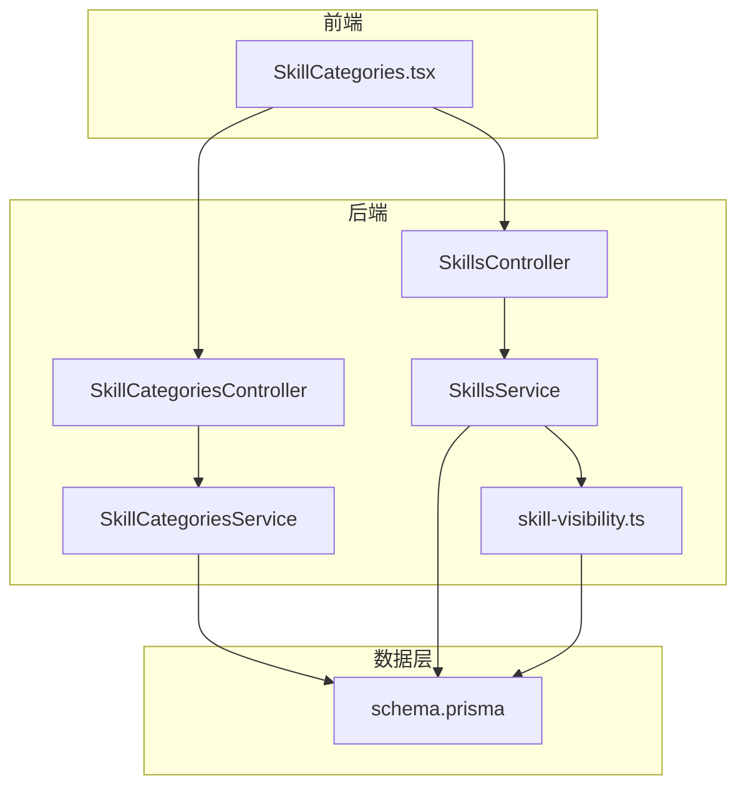
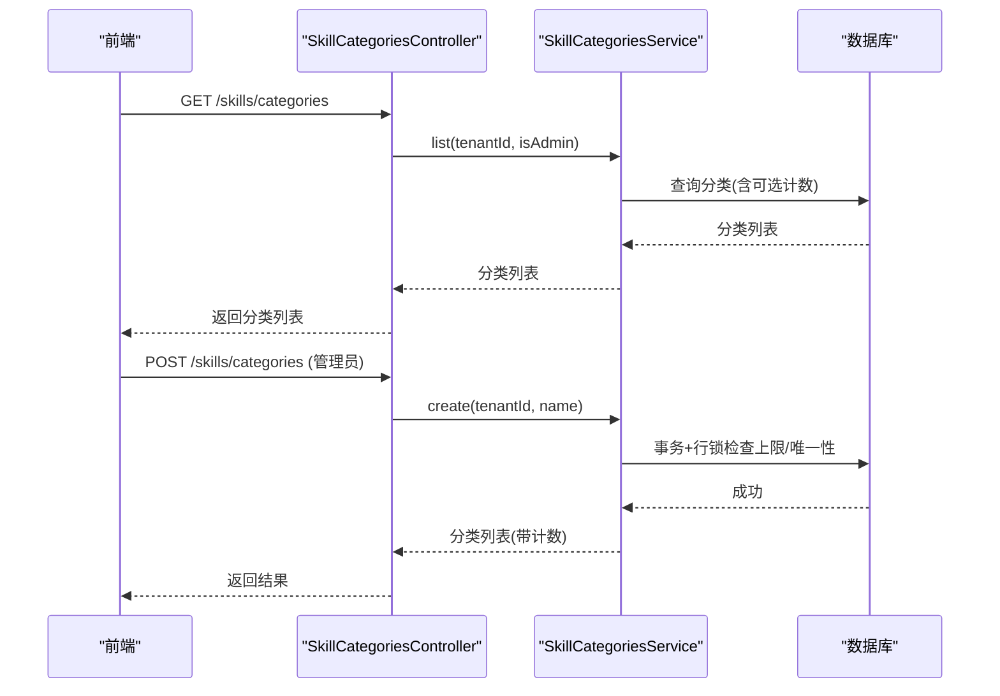
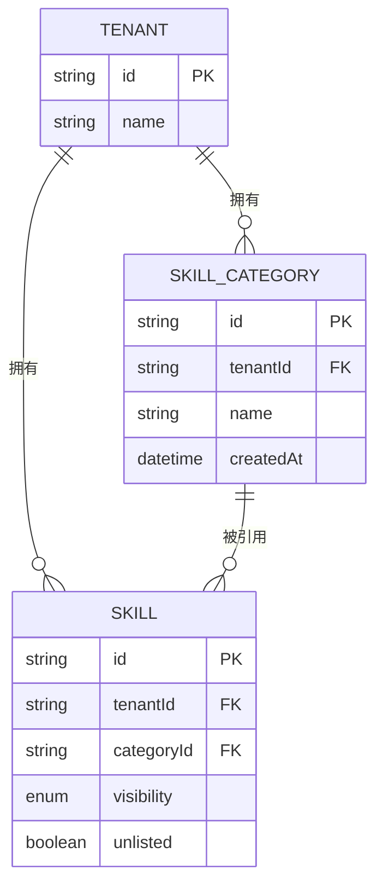
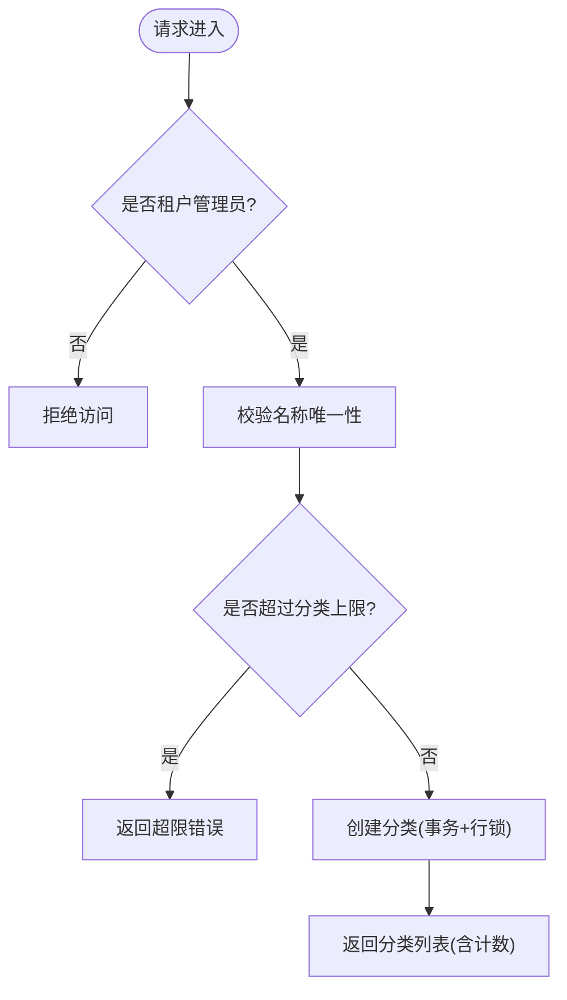
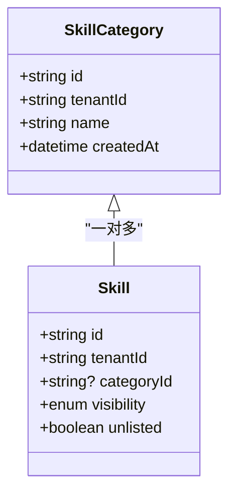
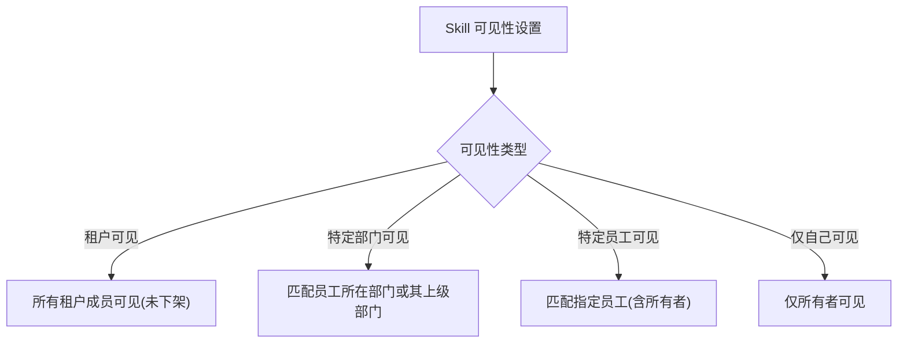
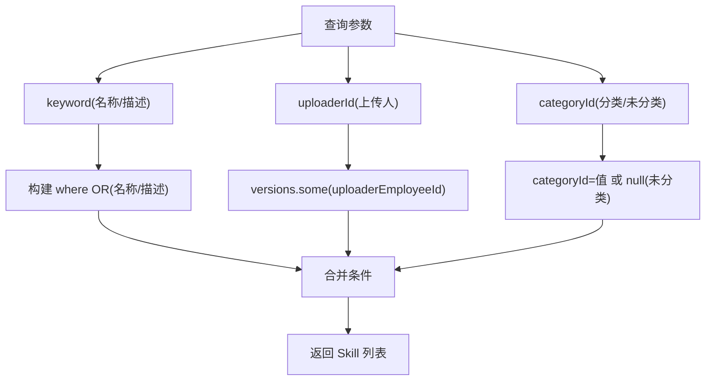
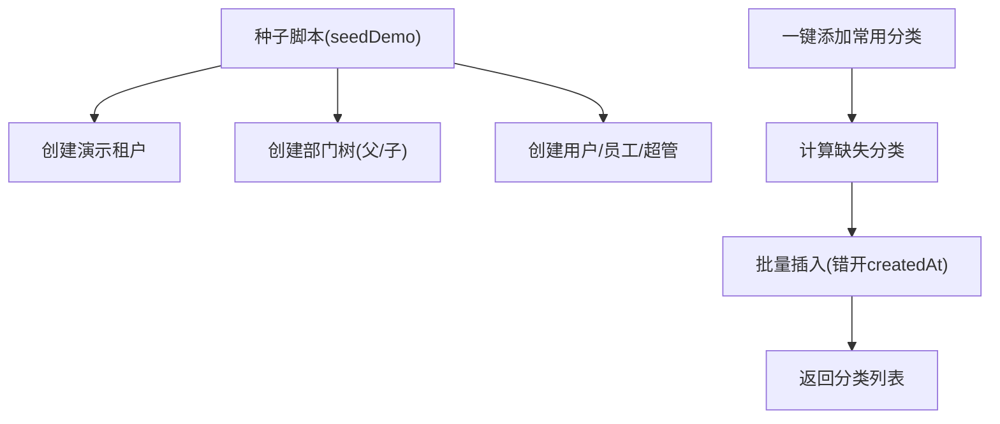
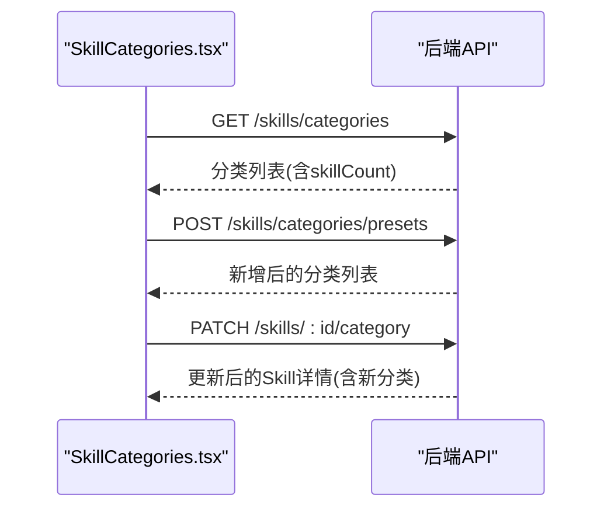
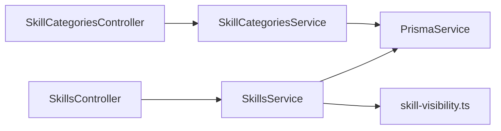

# 分类管理系统

<cite>
**本文引用的文件**   
- [schema.prisma](file://apps/server/prisma/schema.prisma)
- [skill-categories.controller.ts](file://apps/server/src/skills/skill-categories.controller.ts)
- [skill-categories.service.ts](file://apps/server/src/skills/skill-categories.service.ts)
- [skills.controller.ts](file://apps/server/src/skills/skills.controller.ts)
- [skills.service.ts](file://apps/server/src/skills/skills.service.ts)
- [skill-visibility.ts](file://apps/server/src/skills/skill-visibility.ts)
- [SkillCategories.tsx](file://apps/web/src/pages/SkillCategories.tsx)
- [skill.ts](file://packages/shared/src/skill.ts)
- [demo.ts](file://apps/server/src/seed/demo.ts)
</cite>

## 目录
1. [引言](#引言)
2. [项目结构](#项目结构)
3. [核心组件](#核心组件)
4. [架构总览](#架构总览)
5. [详细组件分析](#详细组件分析)
6. [依赖关系分析](#依赖关系分析)
7. [性能与优化](#性能与优化)
8. [故障排查](#故障排查)
9. [结论](#结论)
10. [附录：接口与数据模型速查](#附录接口与数据模型速查)

## 引言
本技术文档聚焦“技能分类”在系统中的设计、实现与使用方式，覆盖以下目标：
- 说明分类的层次结构与树形能力边界（当前分类为扁平结构，部门具备层级）。
- 给出分类的 CRUD 接口与权限控制。
- 解释分类与技能的关联关系、数据库设计与查询优化。
- 说明分类与可见性、权限机制的关系。
- 介绍分类搜索与筛选能力。
- 提供分类数据的初始化与迁移策略。
- 总结最佳实践与性能建议。

## 项目结构
围绕分类管理的相关代码分布在服务端控制器、服务层、数据库模型、前端页面以及共享类型定义中：
- 数据库模型：Prisma schema 定义了 SkillCategory、Skill 等实体及关联。
- 后端接口：SkillCategoriesController 暴露分类列表、新增、改名、删除、预设分类等接口；SkillsController 暴露修改 Skill 分类的接口。
- 业务逻辑：SkillCategoriesService 负责分类的创建、重命名、删除、预设填充与计数统计；SkillsService 负责 Skill 的分类校验与更新。
- 前端交互：SkillCategories.tsx 提供分类管理界面、分类筛选条、修改分类弹窗等。
- 共享类型：shared/skill.ts 定义分类相关类型常量与接口。

图表来源
- [skill-categories.controller.ts:1-47](file://apps/server/src/skills/skill-categories.controller.ts#L1-L47)
- [skill-categories.service.ts:1-83](file://apps/server/src/skills/skill-categories.service.ts#L1-L83)
- [skills.controller.ts:1-145](file://apps/server/src/skills/skills.controller.ts#L1-L145)
- [skills.service.ts:1-500](file://apps/server/src/skills/skills.service.ts#L1-L500)
- [skill-visibility.ts:1-107](file://apps/server/src/skills/skill-visibility.ts#L1-L107)
- [schema.prisma:104-135](file://apps/server/prisma/schema.prisma#L104-L135)

章节来源
- [schema.prisma:104-135](file://apps/server/prisma/schema.prisma#L104-L135)
- [skill-categories.controller.ts:1-47](file://apps/server/src/skills/skill-categories.controller.ts#L1-L47)
- [skill-categories.service.ts:1-83](file://apps/server/src/skills/skill-categories.service.ts#L1-L83)
- [skills.controller.ts:1-145](file://apps/server/src/skills/skills.controller.ts#L1-L145)
- [skills.service.ts:1-500](file://apps/server/src/skills/skills.service.ts#L1-L500)
- [SkillCategories.tsx:1-220](file://apps/web/src/pages/SkillCategories.tsx#L1-L220)
- [skill.ts:171-187](file://packages/shared/src/skill.ts#L171-L187)

## 核心组件
- 分类数据模型：SkillCategory 与 Skill 通过 categoryId 建立一对多关系；删除分类时外键置空，使对应 Skill 变为“未分类”。
- 分类控制器：提供租户内分类的只读访问（所有成员），以及管理员的增删改操作。
- 分类服务：实现分类唯一性约束、并发安全、数量上限、预设分类一键添加、按租户隔离等逻辑。
- 技能服务：在创建或更新 Skill 时校验分类归属（同租户），并记录分类变更审计。
- 前端分类管理：提供分类列表、新增/改名/删除、常用分类一键添加、Skill 详情页修改分类等交互。

章节来源
- [schema.prisma:104-135](file://apps/server/prisma/schema.prisma#L104-L135)
- [skill-categories.controller.ts:8-46](file://apps/server/src/skills/skill-categories.controller.ts#L8-L46)
- [skill-categories.service.ts:16-82](file://apps/server/src/skills/skill-categories.service.ts#L16-L82)
- [skills.service.ts:224-319](file://apps/server/src/skills/skills.service.ts#L224-L319)
- [SkillCategories.tsx:17-219](file://apps/web/src/pages/SkillCategories.tsx#L17-L219)

## 架构总览
分类管理的关键流程如下：
- 分类列表：所有租户成员可读取；管理员额外返回每个分类的 Skill 数。
- 分类新增/改名/删除：仅租户管理员可用；名称在租户内唯一；删除后关联 Skill 变为未分类。
- 常用分类：一键添加预设分类，重复调用无副作用。
- Skill 分类关联：创建或更新 Skill 时可设置分类；分类变更会记录审计日志。
- 分类筛选：目录与管理视图支持按分类过滤；“未分类”以特殊值表示。

图表来源
- [skill-categories.controller.ts:14-31](file://apps/server/src/skills/skill-categories.controller.ts#L14-L31)
- [skill-categories.service.ts:24-44](file://apps/server/src/skills/skill-categories.service.ts#L24-L44)
- [schema.prisma:126-135](file://apps/server/prisma/schema.prisma#L126-L135)

## 详细组件分析

### 分类数据模型与层次结构
- SkillCategory 字段包含 id、tenantId、name、createdAt 等；与 Tenant 一对多，与 Skill 一对多。
- Skill 字段包含 categoryId（可为空）；删除分类时外键 SET NULL，使 Skill 变为“未分类”。
- 分类在当前实现中是扁平结构（无 parentId），但系统存在 Department 的父子层级（用于可见性控制）。

图表来源
- [schema.prisma:48-60](file://apps/server/prisma/schema.prisma#L48-L60)
- [schema.prisma:104-135](file://apps/server/prisma/schema.prisma#L104-L135)

章节来源
- [schema.prisma:104-135](file://apps/server/prisma/schema.prisma#L104-L135)

### 分类 CRUD 接口与权限
- 列表：GET /skills/categories，所有租户成员可读；管理员返回 skillCount。
- 新增：POST /skills/categories，仅租户管理员；名称在租户内唯一；受最大数量限制。
- 预设：POST /skills/categories/presets，仅租户管理员；只补缺失项。
- 改名：PATCH /skills/categories/:id，仅租户管理员；名称唯一性校验。
- 删除：DELETE /skills/categories/:id，仅租户管理员；删除后关联 Skill 变为未分类。

图表来源
- [skill-categories.controller.ts:20-45](file://apps/server/src/skills/skill-categories.controller.ts#L20-L45)
- [skill-categories.service.ts:34-58](file://apps/server/src/skills/skill-categories.service.ts#L34-L58)

章节来源
- [skill-categories.controller.ts:8-46](file://apps/server/src/skills/skill-categories.controller.ts#L8-L46)
- [skill-categories.service.ts:16-82](file://apps/server/src/skills/skill-categories.service.ts#L16-L82)

### 分类与技能的关联关系
- 关联方式：Skill.categoryId 指向 SkillCategory.id；删除分类时外键置空。
- 查询优化：Skill 表对 categoryId 建索引；分类列表可按租户过滤并按创建时间/名称排序。
- 未分类表示：前端与管理视图使用特殊值 SKILL_UNCATEGORIZED 表示未分类。

图表来源
- [schema.prisma:104-135](file://apps/server/prisma/schema.prisma#L104-L135)
- [skill.ts:171-187](file://packages/shared/src/skill.ts#L171-L187)

章节来源
- [schema.prisma:104-135](file://apps/server/prisma/schema.prisma#L104-L135)
- [skill.ts:171-187](file://packages/shared/src/skill.ts#L171-L187)

### 分类的可见性与权限机制
- 分类本身不直接参与可见性控制；可见性由 Skill.visibility 决定。
- 可见性规则：所有者、租户管理员不受限；其他员工需满足未下架且命中可见范围（租户可见、特定部门及其下级、特定员工名单）。
- 分类变更与可见性变更均记录审核日志，便于审计。

图表来源
- [skill-visibility.ts:7-16](file://apps/server/src/skills/skill-visibility.ts#L7-L16)
- [skill-visibility.ts:38-57](file://apps/server/src/skills/skill-visibility.ts#L38-L57)
- [skill.ts:111-139](file://packages/shared/src/skill.ts#L111-L139)

章节来源
- [skill-visibility.ts:7-107](file://apps/server/src/skills/skill-visibility.ts#L7-L107)
- [skill.ts:111-139](file://packages/shared/src/skill.ts#L111-L139)

### 分类搜索与筛选
- 目录搜索：支持按名称或版本描述关键字搜索；支持按上传人、分类筛选。
- 管理视图：除目录搜索外，还支持按审核状态、可见性、是否下架筛选；分类筛选支持“未分类”。
- 分类选项：前端提供分类下拉选项，支持“未分类”作为首项。

图表来源
- [skills.service.ts:54-82](file://apps/server/src/skills/skills.service.ts#L54-L82)
- [skill.ts:317-330](file://packages/shared/src/skill.ts#L317-L330)
- [SkillCategories.tsx:32-54](file://apps/web/src/pages/SkillCategories.tsx#L32-L54)

章节来源
- [skills.service.ts:54-82](file://apps/server/src/skills/skills.service.ts#L54-L82)
- [skill.ts:317-330](file://packages/shared/src/skill.ts#L317-L330)
- [SkillCategories.tsx:32-54](file://apps/web/src/pages/SkillCategories.tsx#L32-L54)

### 分类数据的初始化与迁移策略
- 预设分类：通过“一键添加常用分类”接口批量插入缺失的分类；为避免排序问题，逐个错开 1 毫秒创建时间。
- 演示数据：种子脚本初始化租户、部门与用户，但不初始化分类；分类由业务接口按需创建。
- 迁移策略：分类模型在 Prisma schema 中定义，随数据库迁移生效；删除分类时外键 SET NULL，保证数据一致性。

图表来源
- [skill-categories.service.ts:46-58](file://apps/server/src/skills/skill-categories.service.ts#L46-L58)
- [demo.ts:11-33](file://apps/server/src/seed/demo.ts#L11-L33)
- [schema.prisma:126-135](file://apps/server/prisma/schema.prisma#L126-L135)

章节来源
- [skill-categories.service.ts:46-58](file://apps/server/src/skills/skill-categories.service.ts#L46-L58)
- [demo.ts:11-33](file://apps/server/src/seed/demo.ts#L11-L33)
- [schema.prisma:126-135](file://apps/server/prisma/schema.prisma#L126-L135)

### 前端分类管理交互
- 分类列表：展示分类名称与 Skill 数（管理员），支持改名与删除。
- 新增/改名：弹窗表单校验名称长度与必填；成功后刷新列表。
- 一键添加常用分类：提示缺失分类并批量添加。
- 修改 Skill 分类：在 Skill 详情页弹出选择框，支持清空为“未分类”，立即生效无需审核。

图表来源
- [SkillCategories.tsx:17-219](file://apps/web/src/pages/SkillCategories.tsx#L17-L219)
- [skills.controller.ts:70-79](file://apps/server/src/skills/skills.controller.ts#L70-L79)

章节来源
- [SkillCategories.tsx:17-219](file://apps/web/src/pages/SkillCategories.tsx#L17-L219)
- [skills.controller.ts:70-79](file://apps/server/src/skills/skills.controller.ts#L70-L79)

## 依赖关系分析
- 控制器与服务：SkillCategoriesController 依赖 SkillCategoriesService；SkillsController 依赖 SkillsService。
- 服务与数据：SkillCategoriesService 与 SkillsService 均依赖 PrismaService 访问数据库。
- 可见性模块：SkillsService 依赖 skill-visibility.ts 进行可见性解析与写入。
- 前端与后端：SkillCategories.tsx 通过 REST 接口与后端交互。

图表来源
- [skill-categories.controller.ts:1-47](file://apps/server/src/skills/skill-categories.controller.ts#L1-L47)
- [skill-categories.service.ts:1-83](file://apps/server/src/skills/skill-categories.service.ts#L1-L83)
- [skills.controller.ts:1-145](file://apps/server/src/skills/skills.controller.ts#L1-L145)
- [skills.service.ts:1-500](file://apps/server/src/skills/skills.service.ts#L1-L500)
- [skill-visibility.ts:1-107](file://apps/server/src/skills/skill-visibility.ts#L1-L107)

章节来源
- [skill-categories.controller.ts:1-47](file://apps/server/src/skills/skill-categories.controller.ts#L1-L47)
- [skill-categories.service.ts:1-83](file://apps/server/src/skills/skill-categories.service.ts#L1-L83)
- [skills.controller.ts:1-145](file://apps/server/src/skills/skills.controller.ts#L1-L145)
- [skills.service.ts:1-500](file://apps/server/src/skills/skills.service.ts#L1-L500)
- [skill-visibility.ts:1-107](file://apps/server/src/skills/skill-visibility.ts#L1-L107)

## 性能与优化
- 分类列表查询：按 tenantId 过滤，并按 createdAt 与 name 排序；管理员模式启用 _count 聚合，减少前端二次请求。
- 并发控制：新增分类时对 Tenant 行加锁，串行化同一租户的并发新增，避免超出上限。
- 唯一性约束：利用 Prisma 唯一约束与 P2002 错误码处理冲突，返回友好错误信息。
- 分类索引：Skill.categoryId 建索引，提升按分类筛选的性能。
- 预设分类插入：批量 createMany 并错开 createdAt，确保列表顺序稳定。

章节来源
- [skill-categories.service.ts:24-44](file://apps/server/src/skills/skill-categories.service.ts#L24-L44)
- [skill-categories.service.ts:46-58](file://apps/server/src/skills/skill-categories.service.ts#L46-L58)
- [schema.prisma:122-124](file://apps/server/prisma/schema.prisma#L122-L124)

## 故障排查
- 分类不存在：当所选分类不属于当前租户或 ID 无效时，返回“所选分类不存在，请刷新后重试”。
- 分类数量超限：单租户最多 N 个分类（N 由常量定义），新增或批量添加时会校验并报错。
- 名称冲突：分类名称在租户内唯一，重复创建或改名会返回冲突错误。
- 删除分类影响：删除分类会使使用该分类的 Skill 变为未分类，前端应提示并刷新列表。

章节来源
- [skill-categories.service.ts:6-14](file://apps/server/src/skills/skill-categories.service.ts#L6-L14)
- [skill-categories.service.ts:34-44](file://apps/server/src/skills/skill-categories.service.ts#L34-L44)
- [skill-categories.service.ts:60-72](file://apps/server/src/skills/skill-categories.service.ts#L60-L72)

## 结论
本系统的分类管理采用扁平结构，专注于按租户隔离与基础 CRUD 能力；分类与技能通过外键关联，删除分类时自动降级为未分类，保障数据一致性。可见性控制独立于分类，基于部门与员工维度实现细粒度访问控制。分类筛选与搜索在目录与管理视图中得到统一支持，并通过索引与事务锁优化性能。前端提供了完整的分类管理与 Skill 分类修改交互，配合后端审计日志，形成闭环的管理体验。

## 附录：接口与数据模型速查
- 分类接口
  - GET /skills/categories：列出分类（管理员返回 skillCount）。
  - POST /skills/categories：新增分类（管理员）。
  - POST /skills/categories/presets：一键添加常用分类（管理员）。
  - PATCH /skills/categories/:id：改名分类（管理员）。
  - DELETE /skills/categories/:id：删除分类（管理员）。
- Skill 分类接口
  - PATCH /skills/:id/category：修改 Skill 的分类（所有者或管理员）。
- 数据模型要点
  - SkillCategory：id、tenantId、name、createdAt。
  - Skill：id、tenantId、categoryId（可空）、visibility、unlisted。
  - 关联：Skill.categoryId → SkillCategory.id；删除分类外键置空。

章节来源
- [skill-categories.controller.ts:14-45](file://apps/server/src/skills/skill-categories.controller.ts#L14-L45)
- [skills.controller.ts:70-79](file://apps/server/src/skills/skills.controller.ts#L70-L79)
- [schema.prisma:104-135](file://apps/server/prisma/schema.prisma#L104-L135)