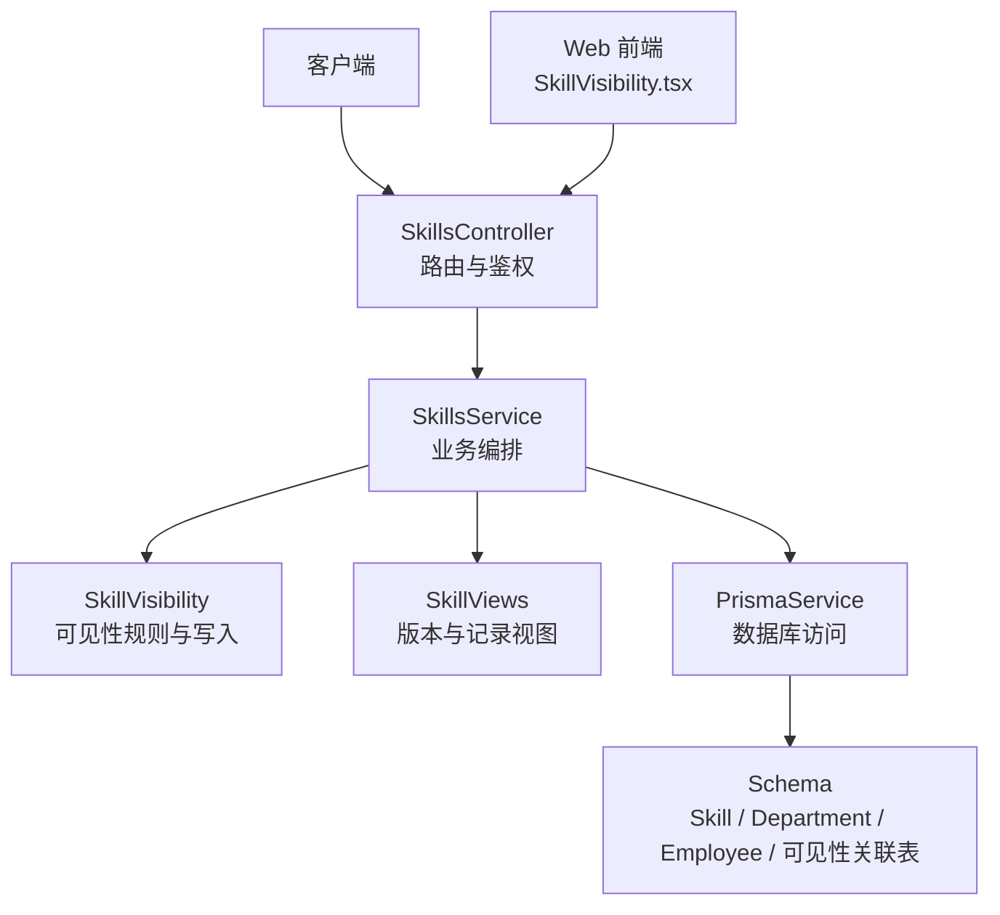
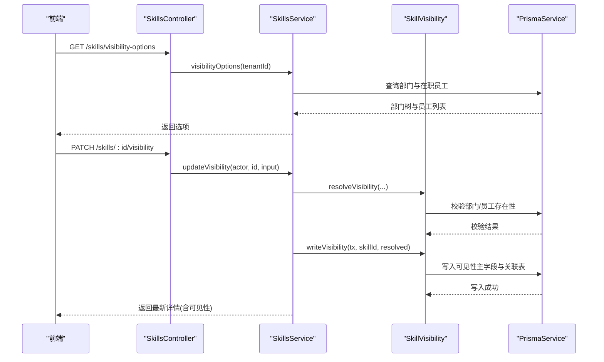
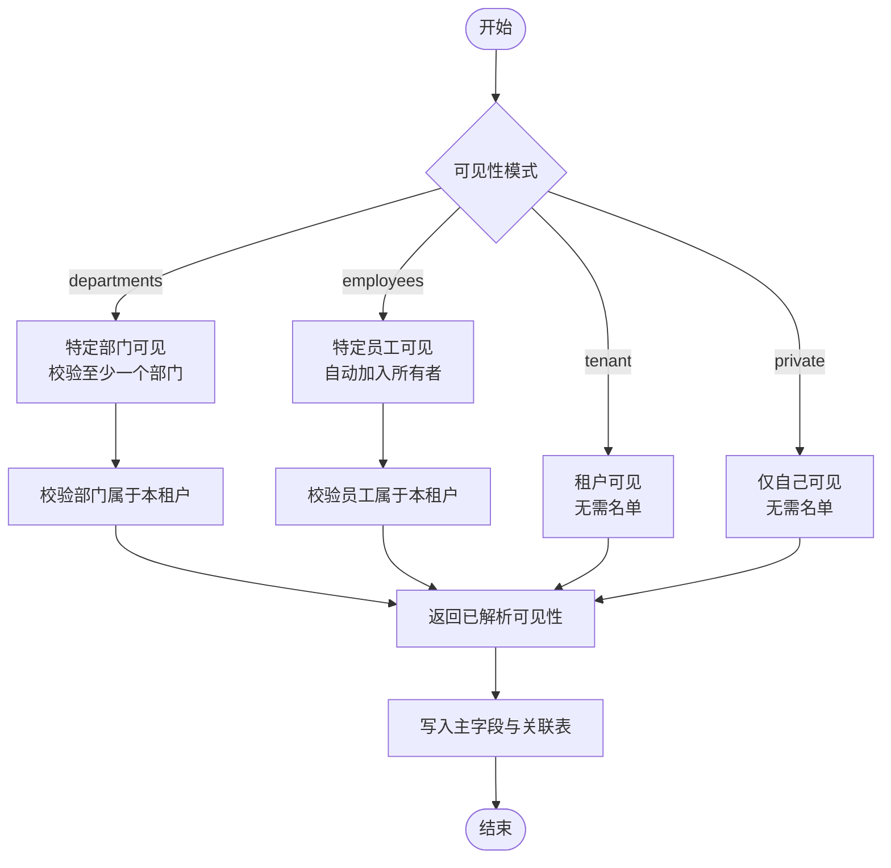
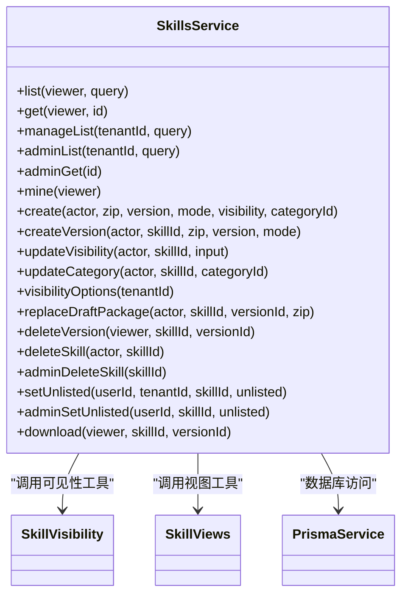
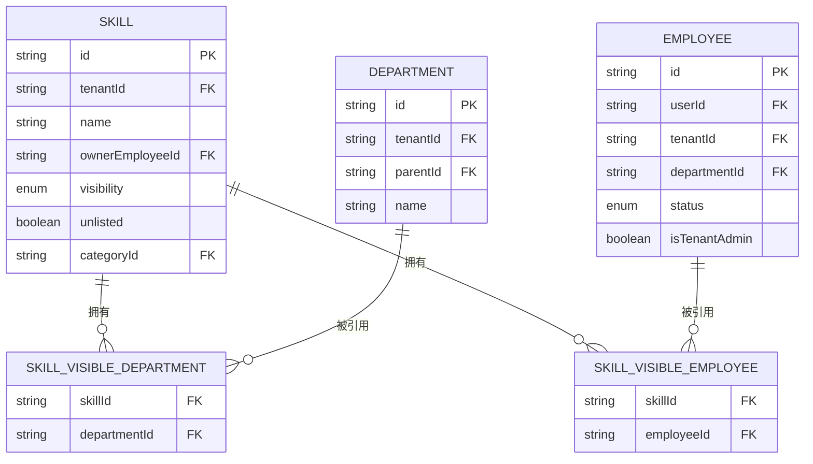
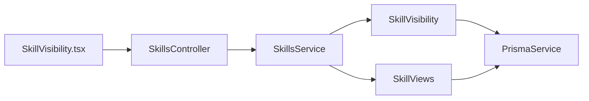

# 可见性控制系统

<cite>
**本文引用的文件**   
- [skill-visibility.ts](file://apps/server/src/skills/skill-visibility.ts)
- [skills.service.ts](file://apps/server/src/skills/skills.service.ts)
- [skills.controller.ts](file://apps/server/src/skills/skills.controller.ts)
- [skill-views.ts](file://apps/server/src/skills/skill-views.ts)
- [schema.prisma](file://apps/server/prisma/schema.prisma)
- [skill.ts](file://packages/shared/src/skill.ts)
- [SkillVisibility.tsx](file://apps/web/src/pages/SkillVisibility.tsx)
- [skill-visibility.e2e-spec.ts](file://apps/server/test/skill-visibility.e2e-spec.ts)
</cite>

## 目录
1. [引言](#引言)
2. [项目结构](#项目结构)
3. [核心组件](#核心组件)
4. [架构总览](#架构总览)
5. [详细组件分析](#详细组件分析)
6. [依赖关系分析](#依赖关系分析)
7. [性能与批量优化](#性能与批量优化)
8. [故障排查指南](#故障排查指南)
9. [结论](#结论)
10. [附录：常见场景与最佳实践](#附录常见场景与最佳实践)

## 引言
本技术文档聚焦“技能可见性”的多层级控制机制，覆盖租户隔离、部门可见性与员工可见性规则；说明可见性配置的数据结构与存储策略；阐述可见性检查的执行流程、权限验证与数据过滤；解释可见性更新的实时生效机制与缓存策略；详细说明部门树与员工列表的获取逻辑；给出性能优化建议与批量操作支持；并提供常见场景与最佳实践。

## 项目结构
可见性控制贯穿后端控制器、服务层、领域工具模块、数据库模型以及前端页面：
- 控制器负责路由与参数绑定，调用服务层方法。
- 服务层封装业务逻辑：创建/更新 Skill、版本管理、可见性校验与写入、查询选项等。
- 领域工具模块提供可见性判断、解析与写入能力。
- Prisma 模型定义可见性枚举、关联表与索引。
- 共享类型定义可见性输入、输出与描述函数。
- 前端页面提供可见性编辑表单与部门树展示。

**图表来源**
- [skills.controller.ts:11-68](file://apps/server/src/skills/skills.controller.ts#L11-L68)
- [skills.service.ts:114-328](file://apps/server/src/skills/skills.service.ts#L114-L328)
- [skill-visibility.ts:13-106](file://apps/server/src/skills/skill-visibility.ts#L13-L106)
- [skill-views.ts:17-101](file://apps/server/src/skills/skill-views.ts#L17-L101)
- [schema.prisma:104-162](file://apps/server/prisma/schema.prisma#L104-L162)
- [SkillVisibility.tsx:53-138](file://apps/web/src/pages/SkillVisibility.tsx#L53-L138)

**章节来源**
- [skills.controller.ts:11-68](file://apps/server/src/skills/skills.controller.ts#L11-L68)
- [skills.service.ts:114-328](file://apps/server/src/skills/skills.service.ts#L114-L328)
- [skill-visibility.ts:13-106](file://apps/server/src/skills/skill-visibility.ts#L13-L106)
- [skill-views.ts:17-101](file://apps/server/src/skills/skill-views.ts#L17-L101)
- [schema.prisma:104-162](file://apps/server/prisma/schema.prisma#L104-L162)
- [SkillVisibility.tsx:53-138](file://apps/web/src/pages/SkillVisibility.tsx#L53-L138)

## 核心组件
- 可见性规则与工具：提供可见性解析、校验、写入、查询条件生成与权限断言。
- 技能服务：编排 Skill 生命周期（创建、版本、分类、下架/上架）、可见性更新、查询与详情组装。
- 视图工具：统一版本与审核记录的视图转换、可见性访问判定。
- 控制器：暴露 REST 接口，承载鉴权与参数校验。
- 数据模型：定义 Skill 可见性枚举、部门与员工可见性关联表及索引。
- 共享类型：定义可见性输入、输出、描述与选项结构。
- 前端页面：可视化编辑可见性，加载部门树与在职员工列表。

**章节来源**
- [skill-visibility.ts:13-106](file://apps/server/src/skills/skill-visibility.ts#L13-L106)
- [skills.service.ts:114-328](file://apps/server/src/skills/skills.service.ts#L114-L328)
- [skill-views.ts:17-101](file://apps/server/src/skills/skill-views.ts#L17-L101)
- [schema.prisma:104-162](file://apps/server/prisma/schema.prisma#L104-L162)
- [skill.ts:111-145](file://packages/shared/src/skill.ts#L111-L145)
- [SkillVisibility.tsx:53-138](file://apps/web/src/pages/SkillVisibility.tsx#L53-L138)

## 架构总览
可见性控制的端到端流程如下：
- 前端通过 GET /api/skills/visibility-options 获取部门树与在职员工列表。
- 用户选择可见性模式与名单后，调用 PATCH /api/skills/:id/visibility 提交。
- 控制器将请求转给服务层，服务层调用可见性工具进行校验与写入。
- 写入成功后返回最新 Skill 详情，包含可见性信息。
- 后续查询 Skill 时，服务层使用可见性查询条件对结果进行过滤。

**图表来源**
- [skills.controller.ts:30-68](file://apps/server/src/skills/skills.controller.ts#L30-L68)
- [skills.service.ts:284-299](file://apps/server/src/skills/skills.service.ts#L284-L299)
- [skill-visibility.ts:82-106](file://apps/server/src/skills/skill-visibility.ts#L82-L106)

## 详细组件分析

### 可见性规则与工具（SkillVisibility）
- 可见性模式：租户可见、特定部门可见、特定员工可见、仅自己可见。
- 默认值：新建 Skill 时默认为租户可见。
- 部门可见性：所选部门及其所有上级部门的员工均可见；换部门立即生效。
- 员工可见性：名单中员工可见；所有者始终在名单中。
- 查询条件：非管理员且未下架的技能需命中可见性规则；所有者与管理员不受限制。
- 权限断言：只有所有者或租户管理员可修改可见性；不可见时返回 404，无权限时返回 403。
- 写入策略：先清空原有部门与员工名单，再批量写入新名单；事务内完成。

**图表来源**
- [skill-visibility.ts:82-106](file://apps/server/src/skills/skill-visibility.ts#L82-L106)

**章节来源**
- [skill-visibility.ts:13-106](file://apps/server/src/skills/skill-visibility.ts#L13-L106)

### 技能服务（SkillsService）
- 目录与详情：按可见性过滤并返回有正式版本的 Skill；详情中包含可见性信息与版本历史。
- 管理视图：租户管理员可查看全部 Skill，并按状态、可见性、是否下架筛选。
- 可见性更新：立即生效，不经过审核流程，记录变更审计。
- 选项接口：并行获取部门树与在职员工列表，供前端构建可见性表单。
- 并发安全：上传新版本与删除版本时对 Skill 行加锁，避免竞态。

**图表来源**
- [skills.service.ts:114-328](file://apps/server/src/skills/skills.service.ts#L114-L328)
- [skill-visibility.ts:13-106](file://apps/server/src/skills/skill-visibility.ts#L13-L106)
- [skill-views.ts:17-101](file://apps/server/src/skills/skill-views.ts#L17-L101)

**章节来源**
- [skills.service.ts:114-328](file://apps/server/src/skills/skills.service.ts#L114-L328)

### 控制器（SkillsController）
- 路由：列出 Skill、管理视图、可见性选项、我的 Skill、详情、创建、更新可见性、更新分类、上传新版本、替换草稿包、删除版本/Skill、下架/上架、下载。
- 鉴权：租户成员、租户管理员、超管等装饰器控制访问。
- 参数：multipart 上传 zip、版本号、去向模式、可见性输入、分类 ID。

**章节来源**
- [skills.controller.ts:11-145](file://apps/server/src/skills/skills.controller.ts#L11-L145)

### 视图工具（SkillViews）
- 角色与权限：SkillViewer 表示当前登录员工；canManage 判断是否为所有者或租户管理员。
- 版本与记录：toVersionInfo、toRecordInfo、toWorkingVersion 等视图转换。
- 可见性访问：findVisibleVersion 根据身份与可见性决定能否查看版本；否则返回 404。

**章节来源**
- [skill-views.ts:17-101](file://apps/server/src/skills/skill-views.ts#L17-L101)

### 数据模型（Prisma Schema）
- Skill 可见性枚举：tenant、departments、employees、private。
- 可见性关联表：SkillVisibleDepartment、SkillVisibleEmployee，带复合主键与索引。
- 部门与员工：Department 与 Employee 分别维护组织关系与员工档案。
- 版本与审核：SkillVersion、SkillReviewRecord 用于版本管理与审计。

**图表来源**
- [schema.prisma:104-162](file://apps/server/prisma/schema.prisma#L104-L162)

**章节来源**
- [schema.prisma:104-162](file://apps/server/prisma/schema.prisma#L104-L162)

### 共享类型（Shared Types）
- 可见性类型与标签：SkillVisibility、SKILL_VISIBILITY_LABELS。
- 可见性输入与输出：SkillVisibilityInput、SkillVisibilityInfo。
- 可见性描述：describeSkillVisibility。
- 可见性选项：SkillVisibilityOptions（部门树与在职员工）。

**章节来源**
- [skill.ts:111-145](file://packages/shared/src/skill.ts#L111-L145)

### 前端页面（SkillVisibility.tsx）
- 表单字段：可见性单选、部门多选（树形）、员工多选（含停用员工显示）。
- 选项加载：调用 /skills/visibility-options 获取部门树与在职员工。
- 默认行为：特定员工可见时自动包含所有者。
- 保存反馈：提示可见性已改为某模式，立即生效。

**章节来源**
- [SkillVisibility.tsx:53-138](file://apps/web/src/pages/SkillVisibility.tsx#L53-L138)

## 依赖关系分析
- 控制器依赖服务层，服务层依赖可见性工具与视图工具，最终通过 PrismaService 访问数据库。
- 可见性工具依赖 PrismaService 进行部门与员工的校验与查询。
- 前端依赖控制器暴露的接口获取选项与提交可见性变更。

**图表来源**
- [skills.controller.ts:11-68](file://apps/server/src/skills/skills.controller.ts#L11-L68)
- [skills.service.ts:114-328](file://apps/server/src/skills/skills.service.ts#L114-L328)
- [skill-visibility.ts:13-106](file://apps/server/src/skills/skill-visibility.ts#L13-L106)
- [skill-views.ts:17-101](file://apps/server/src/skills/skill-views.ts#L17-L101)
- [SkillVisibility.tsx:53-138](file://apps/web/src/pages/SkillVisibility.tsx#L53-L138)

**章节来源**
- [skills.controller.ts:11-68](file://apps/server/src/skills/skills.controller.ts#L11-L68)
- [skills.service.ts:114-328](file://apps/server/src/skills/skills.service.ts#L114-L328)
- [skill-visibility.ts:13-106](file://apps/server/src/skills/skill-visibility.ts#L13-L106)
- [skill-views.ts:17-101](file://apps/server/src/skills/skill-views.ts#L17-L101)
- [SkillVisibility.tsx:53-138](file://apps/web/src/pages/SkillVisibility.tsx#L53-L138)

## 性能与批量优化
- 查询优化：
  - 目录查询直接附加可见性 WHERE 条件，减少应用层过滤开销。
  - 详情查询使用 include 预加载可见性关联，避免 N+1。
- 写入优化：
  - 可见性写入采用 deleteMany + createMany 批量操作，减少往返次数。
  - 事务内完成主字段与关联表的原子更新。
- 并发安全：
  - 上传新版本与删除版本时使用 SELECT ... FOR UPDATE 锁定 Skill 行，串行化关键路径。
- 选项加载：
  - 部门与员工列表使用 Promise.all 并行查询，降低延迟。
- 索引利用：
  - 可见性关联表对 departmentId、employeeId 建立索引，加速 IN 查询。

[本节为通用性能指导，不直接分析具体代码片段]

## 故障排查指南
- 可见性设置非法：
  - 特定部门可见但未选择部门：返回错误“请选择可见的部门”。
  - 所选部门不属于本租户：返回错误“所选部门不存在”。
  - 所选员工不属于本租户：返回错误“所选员工不存在”。
- 权限问题：
  - 非所有者或非租户管理员尝试修改可见性：返回 403。
  - 非所有者或非租户管理员访问不可见 Skill：返回 404。
- 名称冲突：
  - 新建 Skill 时名称已存在：返回 409，若调用者能看到已有 Skill，则附带其 id 引导上传新版本。
- 版本状态变化：
  - 并发处理导致版本状态变化：返回 409 并提示刷新。

**章节来源**
- [skill-visibility.ts:82-97](file://apps/server/src/skills/skill-visibility.ts#L82-L97)
- [skills.service.ts:224-253](file://apps/server/src/skills/skills.service.ts#L224-L253)
- [skill-views.ts:103-110](file://apps/server/src/skills/skill-views.ts#L103-L110)
- [skill-visibility.e2e-spec.ts:180-229](file://apps/server/test/skill-visibility.e2e-spec.ts#L180-L229)

## 结论
可见性控制系统以“租户隔离 + 部门继承 + 员工白名单 + 私有”四层规则为核心，结合事务写入与索引优化，确保权限校验准确、数据过滤高效、更新即时生效。前端提供直观的可见性编辑界面，后端通过服务层与工具模块实现清晰的职责分离与可扩展性。

[本节为总结性内容，不直接分析具体代码片段]

## 附录：常见场景与最佳实践
- 全租户公开：
  - 适用：面向全组织的通用技能。
  - 设置：visibility=tenant。
  - 注意：仍需具备正式版本才能被普通员工看到。
- 限定部门范围：
  - 适用：研发部、运营部等内部技能。
  - 设置：visibility=departments，选择部门（含下级）。
  - 注意：换部门后立即生效，无需重新发布。
- 指定个人可见：
  - 适用：敏感或试点技能。
  - 设置：visibility=employees，选择员工（自动包含所有者）。
  - 注意：停用员工仍可在列表中显示但不可选。
- 私有技能：
  - 适用：仅所有者可见。
  - 设置：visibility=private。
  - 注意：其他员工即使知道 ID 也无法访问。
- 最佳实践：
  - 优先使用部门可见性，便于组织结构调整后的自动继承。
  - 定期审查特定员工可见名单，避免权限膨胀。
  - 结合下架/上架功能进行灰度发布与回滚。
  - 使用管理视图按可见性筛选，快速定位权限范围异常。

[本节为概念性指导，不直接分析具体代码片段]