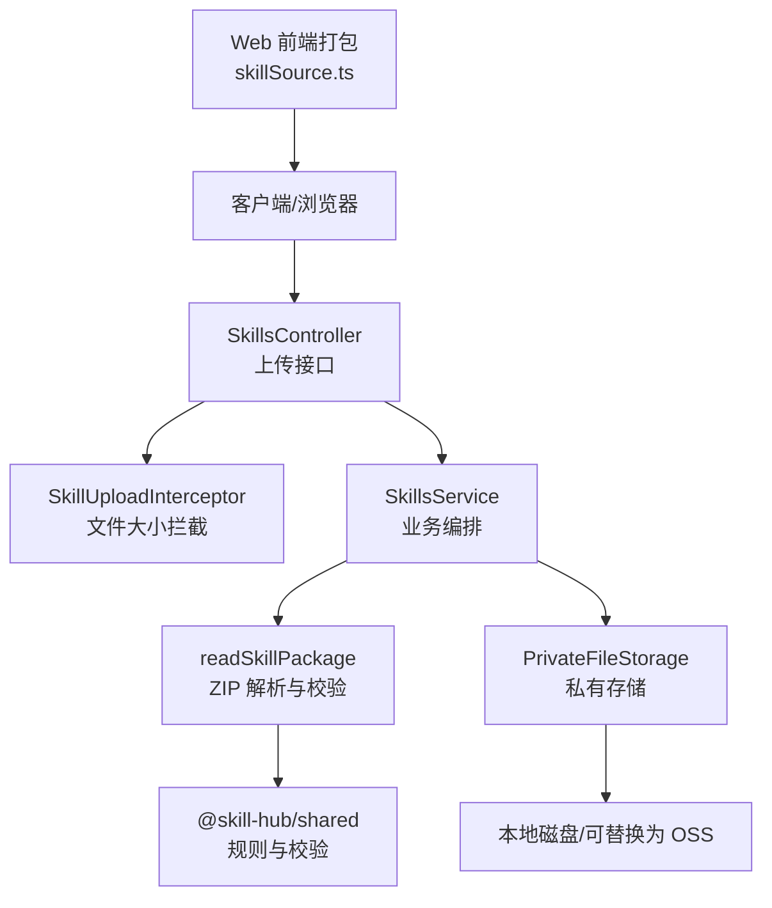
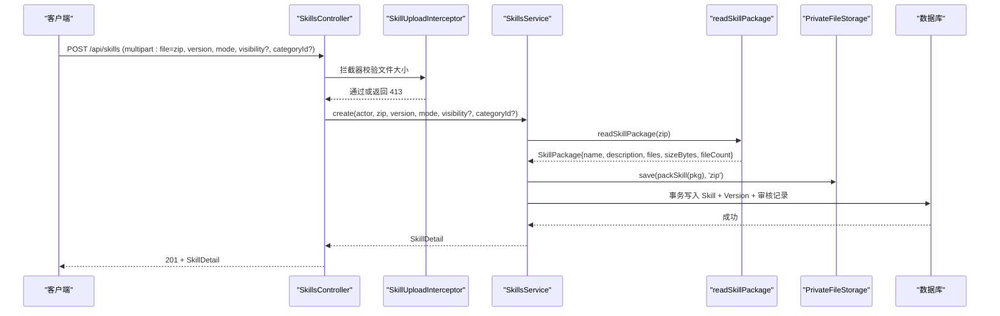
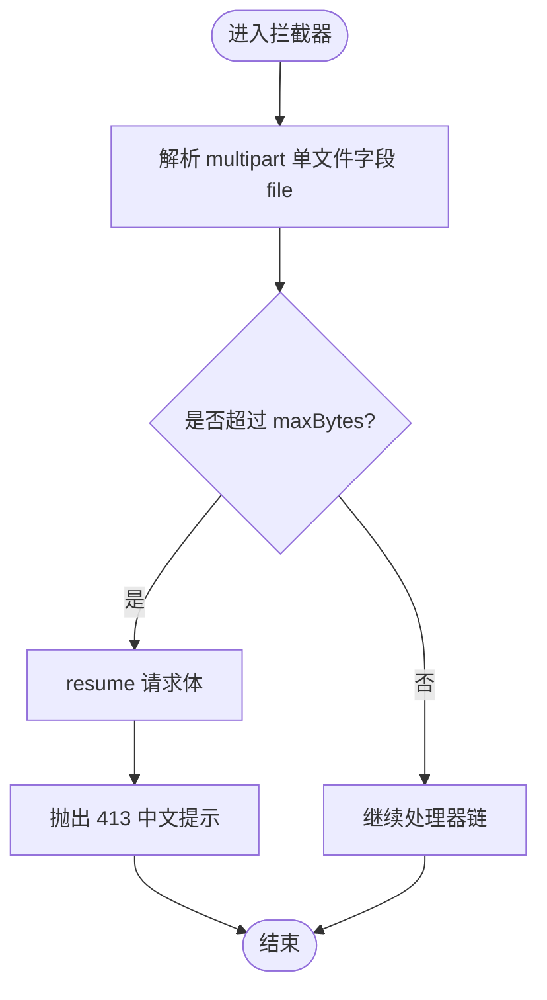
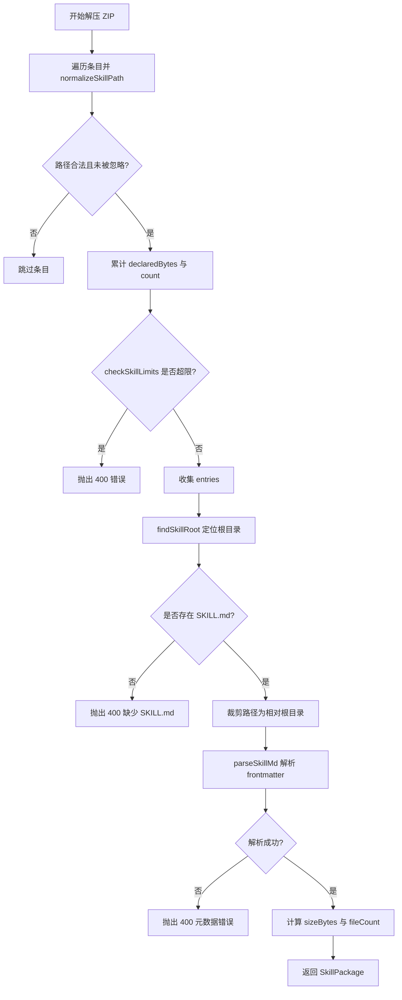
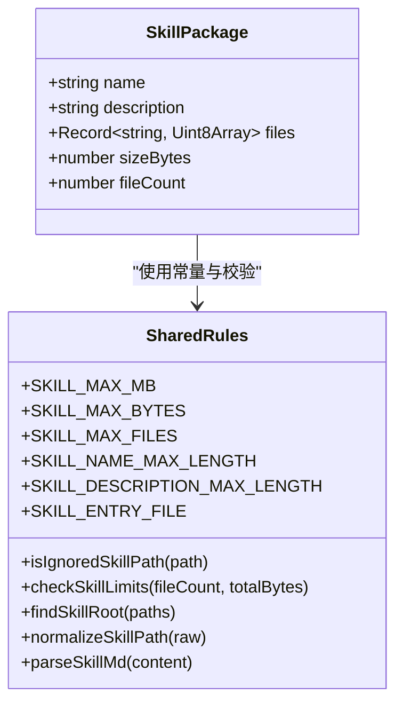
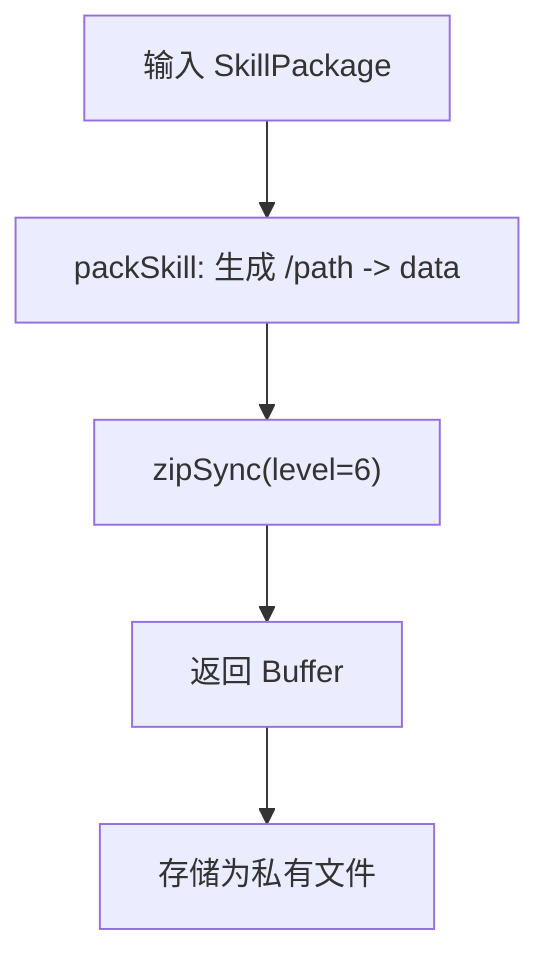
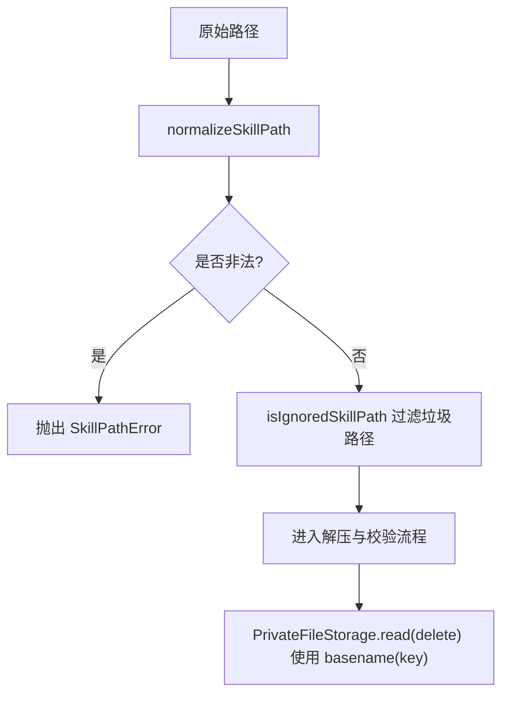
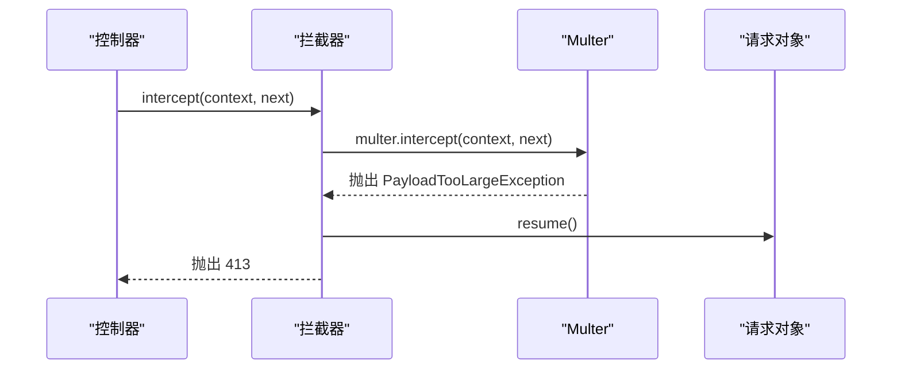
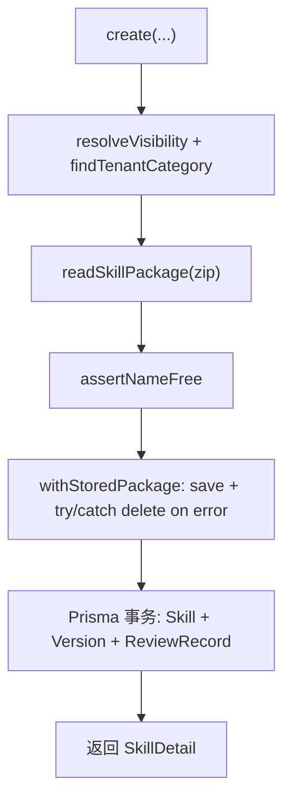
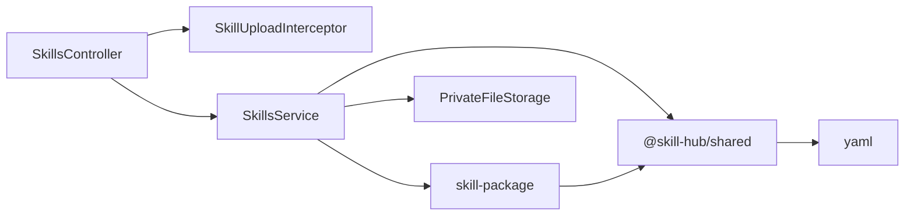

# 技能包上传与解析

<cite>
**本文引用的文件**   
- [apps/server/src/skills/skill-upload.ts](file://apps/server/src/skills/skill-upload.ts)
- [apps/server/src/skills/skill-package.ts](file://apps/server/src/skills/skill-package.ts)
- [apps/server/src/storage/file-upload.interceptor.ts](file://apps/server/src/storage/file-upload.interceptor.ts)
- [apps/server/src/skills/skills.controller.ts](file://apps/server/src/skills/skills.controller.ts)
- [apps/server/src/skills/skills.service.ts](file://apps/server/src/skills/skills.service.ts)
- [packages/shared/src/skill.ts](file://packages/shared/src/skill.ts)
- [apps/server/src/storage/private-file-storage.ts](file://apps/server/src/storage/private-file-storage.ts)
- [examples/hello-skill/SKILL.md](file://examples/hello-skill/SKILL.md)
- [apps/server/test/skills.e2e-spec.ts](file://apps/server/test/skills.e2e-spec.ts)
- [apps/web/src/skillSource.ts](file://apps/web/src/skillSource.ts)
</cite>

## 目录
1. [简介](#简介)
2. [项目结构](#项目结构)
3. [核心组件](#核心组件)
4. [架构总览](#架构总览)
5. [详细组件分析](#详细组件分析)
6. [依赖关系分析](#依赖关系分析)
7. [性能考虑](#性能考虑)
8. [故障排除指南](#故障排除指南)
9. [结论](#结论)
10. [附录：开发集成示例](#附录开发集成示例)

## 简介
本文面向“技能包上传与解析”功能，系统性说明 ZIP 格式技能包的上传流程、SKILL.md 解析机制、技能包结构规范、文件安全检查、上传拦截器工作原理与错误处理策略，并给出性能优化建议、批量上传支持与完整的开发集成示例。文档以服务端实现为主线，同时覆盖前端打包校验逻辑与端到端测试用例，帮助读者从整体到细节掌握该功能的实现与扩展方式。

## 项目结构
技能包上传与解析涉及控制器、服务、共享常量与工具、存储抽象以及前端打包逻辑。关键路径如下：
- 控制器层：接收上传请求，绑定拦截器与参数校验。
- 服务层：业务编排，包括权限、可见性、版本管理、存储落盘与数据库事务。
- 包解析层：ZIP 解压、路径规范化、垃圾文件过滤、大小与数量限制、根目录与 SKILL.md 定位、元数据解析。
- 共享规则层：常量、校验函数、类型定义。
- 存储层：私有文件存储抽象与本地实现。
- 前端层：浏览器侧打包、预校验与上传。

**图表来源**
- [apps/server/src/skills/skills.controller.ts:47-57](file://apps/server/src/skills/skills.controller.ts#L47-L57)
- [apps/server/src/skills/skill-upload.ts:5-12](file://apps/server/src/skills/skill-upload.ts#L5-L12)
- [apps/server/src/skills/skills.service.ts:224-253](file://apps/server/src/skills/skills.service.ts#L224-L253)
- [apps/server/src/skills/skill-package.ts:19-57](file://apps/server/src/skills/skill-package.ts#L19-L57)
- [packages/shared/src/skill.ts:3-21](file://packages/shared/src/skill.ts#L3-L21)
- [apps/server/src/storage/private-file-storage.ts:20-39](file://apps/server/src/storage/private-file-storage.ts#L20-L39)
- [apps/web/src/skillSource.ts:53-78](file://apps/web/src/skillSource.ts#L53-L78)

**章节来源**
- [apps/server/src/skills/skills.controller.ts:1-145](file://apps/server/src/skills/skills.controller.ts#L1-L145)
- [apps/server/src/skills/skills.service.ts:1-500](file://apps/server/src/skills/skills.service.ts#L1-L500)
- [apps/server/src/skills/skill-package.ts:1-74](file://apps/server/src/skills/skill-package.ts#L1-L74)
- [apps/server/src/skills/skill-upload.ts:1-13](file://apps/server/src/skills/skill-upload.ts#L1-L13)
- [packages/shared/src/skill.ts:1-401](file://packages/shared/src/skill.ts#L1-L401)
- [apps/server/src/storage/private-file-storage.ts:1-41](file://apps/server/src/storage/private-file-storage.ts#L1-L41)
- [apps/web/src/skillSource.ts:53-78](file://apps/web/src/skillSource.ts#L53-L78)

## 核心组件
- 上传拦截器：对 multipart file 字段进行大小限制与异常处理，避免连接重置。
- 包解析器：解压 ZIP、过滤垃圾文件、校验大小与数量、定位根目录与 SKILL.md、解析 frontmatter。
- 技能服务：编排创建/更新/删除等业务流程，负责权限、可见性、版本号比较、存储落盘与事务一致性。
- 共享规则：定义最大包大小、最大文件数、名称与描述长度、版本号格式、忽略路径集合等。
- 私有存储：按随机 key 保存 ZIP，读取时仅使用 basename 防止路径穿越。
- 前端打包：在浏览器侧过滤垃圾文件、预校验、打包 ZIP 并上传。

**章节来源**
- [apps/server/src/storage/file-upload.interceptor.ts:1-28](file://apps/server/src/storage/file-upload.interceptor.ts#L1-L28)
- [apps/server/src/skills/skill-package.ts:1-74](file://apps/server/src/skills/skill-package.ts#L1-L74)
- [apps/server/src/skills/skills.service.ts:224-500](file://apps/server/src/skills/skills.service.ts#L224-L500)
- [packages/shared/src/skill.ts:1-401](file://packages/shared/src/skill.ts#L1-L401)
- [apps/server/src/storage/private-file-storage.ts:1-41](file://apps/server/src/storage/private-file-storage.ts#L1-L41)
- [apps/web/src/skillSource.ts:53-78](file://apps/web/src/skillSource.ts#L53-L78)

## 架构总览
技能包上传的整体调用链如下：

**图表来源**
- [apps/server/src/skills/skills.controller.ts:47-57](file://apps/server/src/skills/skills.controller.ts#L47-L57)
- [apps/server/src/skills/skill-upload.ts:5-12](file://apps/server/src/skills/skill-upload.ts#L5-L12)
- [apps/server/src/skills/skills.service.ts:224-253](file://apps/server/src/skills/skills.service.ts#L224-L253)
- [apps/server/src/skills/skill-package.ts:19-57](file://apps/server/src/skills/skill-package.ts#L19-L57)
- [apps/server/src/storage/private-file-storage.ts:24-30](file://apps/server/src/storage/private-file-storage.ts#L24-L30)

## 详细组件分析

### 上传拦截器与文件验证
- 拦截目标：multipart 表单中的 file 字段，单文件内存模式。
- 大小限制：基于共享常量 SKILL_MAX_BYTES 增加余量，用于提前拒绝明显超大的压缩包，避免后续解压阶段资源消耗。
- 错误处理：捕获 PayloadTooLargeException，先 resume 请求体再抛出 413，避免客户端仍在上传导致连接重置。
- 必填校验：requireFile 确保存在 file 字段，否则返回 400。

**图表来源**
- [apps/server/src/storage/file-upload.interceptor.ts:5-27](file://apps/server/src/storage/file-upload.interceptor.ts#L5-L27)
- [apps/server/src/skills/skill-upload.ts:5-12](file://apps/server/src/skills/skill-upload.ts#L5-L12)

**章节来源**
- [apps/server/src/storage/file-upload.interceptor.ts:1-28](file://apps/server/src/storage/file-upload.interceptor.ts#L1-L28)
- [apps/server/src/skills/skill-upload.ts:1-13](file://apps/server/src/skills/skill-upload.ts#L1-L13)

### ZIP 包结构与解析流程
- 垃圾文件过滤：忽略 .DS_Store、.git、node_modules、__pycache__ 等路径段。
- 路径规范化：统一斜杠、去除空段与点段；拒绝绝对路径、盘符路径与包含 .. 的路径，抛出自定义路径错误。
- 根目录判定：SKILL.md 必须在根目录或唯一的顶层文件夹中。
- 大小与数量限制：解压前按声明大小累计，超过上限立即中断；最终统计实际字节数与文件数。
- SKILL.md 解析：提取 name 与 description，并进行格式与长度校验。
- 输出结构：SkillPackage 包含 name、description、files（相对根目录）、sizeBytes、fileCount。

**图表来源**
- [apps/server/src/skills/skill-package.ts:19-57](file://apps/server/src/skills/skill-package.ts#L19-L57)
- [packages/shared/src/skill.ts:11-48](file://packages/shared/src/skill.ts#L11-L48)
- [packages/shared/src/skill.ts:50-71](file://packages/shared/src/skill.ts#L50-L71)

**章节来源**
- [apps/server/src/skills/skill-package.ts:1-74](file://apps/server/src/skills/skill-package.ts#L1-L74)
- [packages/shared/src/skill.ts:1-71](file://packages/shared/src/skill.ts#L1-L71)

### SKILL.md 解析机制与业务规则
- 元数据提取：解析 YAML frontmatter，提取 name 与 description。
- 字段验证：
  - name：非空字符串，长度不超过上限，仅允许小写字母、数字和连字符。
  - description：非空字符串，长度不超过上限。
- 业务规则：
  - 新版本上传时，SKILL.md 的 name 必须与 Skill 名称一致。
  - 版本号必须符合 x.y.z 格式，且严格大于已有最高版本。
  - 上传去向 mode 决定初始状态：租户管理员可选直接发布或草稿；普通员工只能提交审核或草稿。

**图表来源**
- [apps/server/src/skills/skill-package.ts:5-12](file://apps/server/src/skills/skill-package.ts#L5-L12)
- [packages/shared/src/skill.ts:3-71](file://packages/shared/src/skill.ts#L3-L71)

**章节来源**
- [packages/shared/src/skill.ts:50-71](file://packages/shared/src/skill.ts#L50-L71)
- [apps/server/src/skills/skills.service.ts:471-473](file://apps/server/src/skills/skills.service.ts#L471-L473)
- [apps/server/src/skills/skills.service.ts:259-282](file://apps/server/src/skills/skills.service.ts#L259-L282)

### 技能包结构规范与文件处理逻辑
- 必需文件：SKILL.md 位于根目录或唯一顶层文件夹。
- 可选文件：任意其他文件，但会被过滤掉垃圾路径段。
- 根目录裁剪：所有文件路径相对于 SKILL.md 所在目录。
- 打包与解包：
  - packSkill：将 SkillPackage 重新打包为 <name>/... 规范目录。
  - unpackStored：从已存储的包中按 <name>/ 前缀解出文件映射。

**图表来源**
- [apps/server/src/skills/skill-package.ts:59-63](file://apps/server/src/skills/skill-package.ts#L59-L63)
- [apps/server/src/skills/skill-package.ts:65-73](file://apps/server/src/skills/skill-package.ts#L65-L73)

**章节来源**
- [apps/server/src/skills/skill-package.ts:59-73](file://apps/server/src/skills/skill-package.ts#L59-L73)

### 文件安全检查机制
- 路径安全：normalizeSkillPath 拒绝绝对路径、盘符路径与包含 .. 的路径，防止路径穿越。
- 垃圾文件过滤：isIgnoredSkillPath 忽略常见垃圾路径段，不计入大小与数量。
- 存储安全：PrivateFileStorage.read/delete 使用 basename(key) 防止恶意 key 访问外部路径。
- 炸弹防护：fflate unzipSync 按声明大小截断输出，结合 checkSkillLimits 在解压前阻断超大包。

**图表来源**
- [packages/shared/src/skill.ts:34-48](file://packages/shared/src/skill.ts#L34-L48)
- [apps/server/src/storage/private-file-storage.ts:32-39](file://apps/server/src/storage/private-file-storage.ts#L32-L39)

**章节来源**
- [packages/shared/src/skill.ts:34-48](file://packages/shared/src/skill.ts#L34-L48)
- [apps/server/src/storage/private-file-storage.ts:20-39](file://apps/server/src/storage/private-file-storage.ts#L20-L39)

### 上传拦截器的工作原理与错误处理策略
- 前置拦截：在控制器方法执行前，拦截器对 multipart 进行解析与大小检查。
- 大请求处理：捕获 PayloadTooLargeException，先 resume 请求体，再抛出 413，避免客户端连接重置。
- 缺失文件处理：requireFile 在控制器内校验 file 字段是否存在，不存在则返回 400。

**图表来源**
- [apps/server/src/storage/file-upload.interceptor.ts:13-24](file://apps/server/src/storage/file-upload.interceptor.ts#L13-L24)

**章节来源**
- [apps/server/src/storage/file-upload.interceptor.ts:1-28](file://apps/server/src/storage/file-upload.interceptor.ts#L1-L28)
- [apps/server/src/skills/skill-upload.ts:8-12](file://apps/server/src/skills/skill-upload.ts#L8-L12)

### 服务层业务编排与事务一致性
- 创建技能：校验可见性与分类，解析包，检查名称唯一性，先落盘再写库，失败回滚并删除已存文件。
- 新增版本：权限校验、名称一致性校验、并发锁（FOR UPDATE）保证串行化，版本号严格递增。
- 修改草稿：仅允许草稿所有者或上传者替换包内容，记录审计动作。
- 删除操作：支持删除单个版本或删除整个 Skill，清理存储文件。
- 下载：正式版本下载次数自增，文件名遵循 <name>-<version>.zip。

**图表来源**
- [apps/server/src/skills/skills.service.ts:224-253](file://apps/server/src/skills/skills.service.ts#L224-L253)
- [apps/server/src/skills/skills.service.ts:459-468](file://apps/server/src/skills/skills.service.ts#L459-L468)

**章节来源**
- [apps/server/src/skills/skills.service.ts:224-500](file://apps/server/src/skills/skills.service.ts#L224-L500)

## 依赖关系分析
- 控制器依赖：
  - 拦截器：SkillUploadInterceptor
  - DTO：UploadSkillDto
  - 服务：SkillsService
- 服务依赖：
  - 共享规则：@skill-hub/shared（常量、校验、类型）
  - 包解析：readSkillPackage/packSkill/unpackStored
  - 存储：PrivateFileStorage
  - 可见性与视图工具：skill-visibility、skill-views
- 共享规则依赖：
  - YAML 解析：yaml
- 存储实现依赖：
  - Node fs/promises、path、crypto

**图表来源**
- [apps/server/src/skills/skills.controller.ts:1-8](file://apps/server/src/skills/skills.controller.ts#L1-L8)
- [apps/server/src/skills/skills.service.ts:1-25](file://apps/server/src/skills/skills.service.ts#L1-L25)
- [apps/server/src/skills/skill-package.ts:1-4](file://apps/server/src/skills/skill-package.ts#L1-L4)
- [packages/shared/src/skill.ts:1](file://packages/shared/src/skill.ts#L1)

**章节来源**
- [apps/server/src/skills/skills.controller.ts:1-145](file://apps/server/src/skills/skills.controller.ts#L1-L145)
- [apps/server/src/skills/skills.service.ts:1-500](file://apps/server/src/skills/skills.service.ts#L1-L500)
- [apps/server/src/skills/skill-package.ts:1-74](file://apps/server/src/skills/skill-package.ts#L1-L74)
- [packages/shared/src/skill.ts:1-401](file://packages/shared/src/skill.ts#L1-L401)

## 性能考虑
- 解压前限制：按条目声明大小累计，避免 zip 炸弹与超大包解压导致的内存峰值。
- 压缩级别：packSkill 使用 level=6 平衡体积与速度。
- 内存模型：上传采用内存存储（Buffer），适合中小规模技能包；若需支持更大包，可考虑流式处理与分片上传。
- 并发控制：新增版本使用 FOR UPDATE 行级锁，避免并发冲突与重复工作。
- 存储优化：私有存储使用随机 UUID 命名，避免文件名冲突；未来可替换为对象存储以提升吞吐与可靠性。
- 前端预校验：浏览器侧提前过滤垃圾文件与大小检查，减少无效上传。

[本节为通用性能建议，不直接分析具体文件]

## 故障排除指南
常见问题与对应处理：
- 未选择文件：返回 400，提示“请选择要上传的 Skill 文件夹”。
- 不是 ZIP 格式：返回 400，提示“无法解析上传的压缩包，请确认是 zip 格式”。
- 路径非法（含 .. 或绝对路径）：返回 400，提示“压缩包中包含非法路径”。
- 缺少 SKILL.md 或位置不正确：返回 400，提示“根目录（或唯一的顶层文件夹）中缺少 SKILL.md”。
- 文件数或解压后大小超限：返回 400，提示“Skill 包最多 500 个文件”或“Skill 包解压后不能超过 20MB”。
- 压缩包本身过大：返回 413，提示“Skill 包不能超过 20MB”。
- 版本号格式错误或不大于已有最高版本：返回 400，提示版本号相关错误。
- 名称冲突：返回 409，可能附带已有 Skill id（若当前用户可见）。
- 权限不足：返回 403，如非所有者或租户管理员尝试上传新版本或修改可见性/分类。

参考端到端测试用例：
- 垃圾文件过滤、SKILL.md 位置校验、文件数与大小限制、压缩包过大、非法路径、未选择文件、版本号校验、名称冲突、包不合法不落盘等。

**章节来源**
- [apps/server/test/skills.e2e-spec.ts:91-189](file://apps/server/test/skills.e2e-spec.ts#L91-L189)
- [apps/server/test/skills.e2e-spec.ts:370-389](file://apps/server/test/skills.e2e-spec.ts#L370-L389)

## 结论
技能包上传与解析功能通过多层校验与安全防护，确保上传的 ZIP 包结构合规、内容安全、大小可控，并在服务层完成权限、可见性、版本管理与存储一致性保障。共享规则与前端预校验提升了用户体验与系统稳定性。未来可扩展流式上传、批量上传与更丰富的文件类型预览能力。

[本节为总结性内容，不直接分析具体文件]

## 附录：开发集成示例

### 后端集成要点
- 控制器：
  - 使用 @UseInterceptors(SkillUploadInterceptor) 保护上传接口。
  - 使用 @UploadedFile() 获取 file，并通过 requireFile 校验。
  - 调用 SkillsService.create/createVersion 等业务方法。
- 服务：
  - 使用 readSkillPackage 解析包，packSkill 落盘。
  - 使用 withStoredPackage 保证事务失败时清理已存文件。
  - 使用 Prisma 事务与 FOR UPDATE 保证并发安全。
- 共享规则：
  - 使用 SKILL_MAX_BYTES、SKILL_MAX_FILES、SKILL_NAME_MAX_LENGTH 等常量。
  - 使用 parseSkillMd、checkSkillLimits、findSkillRoot、normalizeSkillPath 等工具。
- 存储：
  - 使用 PrivateFileStorage.save/read/delete 管理私有文件。

**章节来源**
- [apps/server/src/skills/skills.controller.ts:47-92](file://apps/server/src/skills/skills.controller.ts#L47-L92)
- [apps/server/src/skills/skills.service.ts:224-500](file://apps/server/src/skills/skills.service.ts#L224-L500)
- [apps/server/src/skills/skill-package.ts:19-73](file://apps/server/src/skills/skill-package.ts#L19-L73)
- [packages/shared/src/skill.ts:3-71](file://packages/shared/src/skill.ts#L3-L71)
- [apps/server/src/storage/private-file-storage.ts:24-39](file://apps/server/src/storage/private-file-storage.ts#L24-L39)

### 前端打包与上传
- 前端打包：
  - 过滤垃圾文件：isIgnoredSkillPath。
  - 预校验：checkSkillLimits、findSkillRoot、parseSkillMd。
  - 打包：zipSync(level=6)，生成 application/zip Blob。
- 上传：
  - multipart 字段 file 为 zip，body 包含 version、mode、visibility?、categoryId?。
  - 服务端再次完整校验，前端错误仅为早期提示。

**章节来源**
- [apps/web/src/skillSource.ts:53-78](file://apps/web/src/skillSource.ts#L53-L78)
- [packages/shared/src/skill.ts:11-71](file://packages/shared/src/skill.ts#L11-L71)

### SKILL.md 示例
- 示例文件展示了标准的 frontmatter 与正文结构，name 与 description 符合规则。

**章节来源**
- [examples/hello-skill/SKILL.md:1-12](file://examples/hello-skill/SKILL.md#L1-L12)