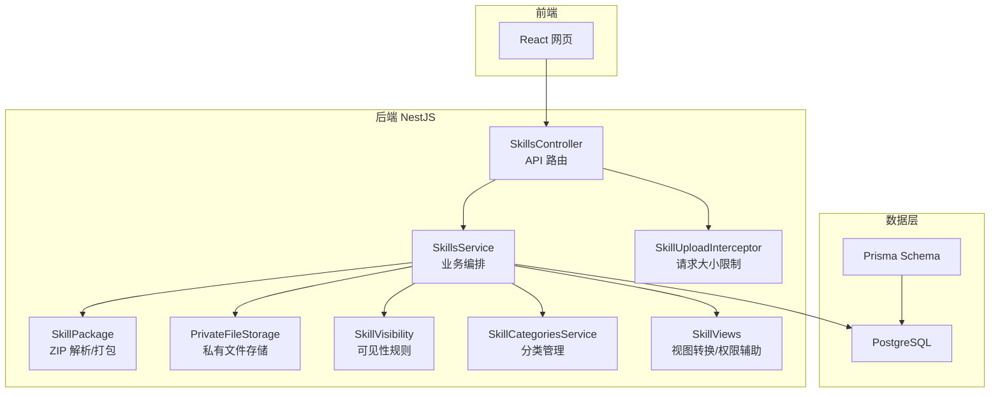
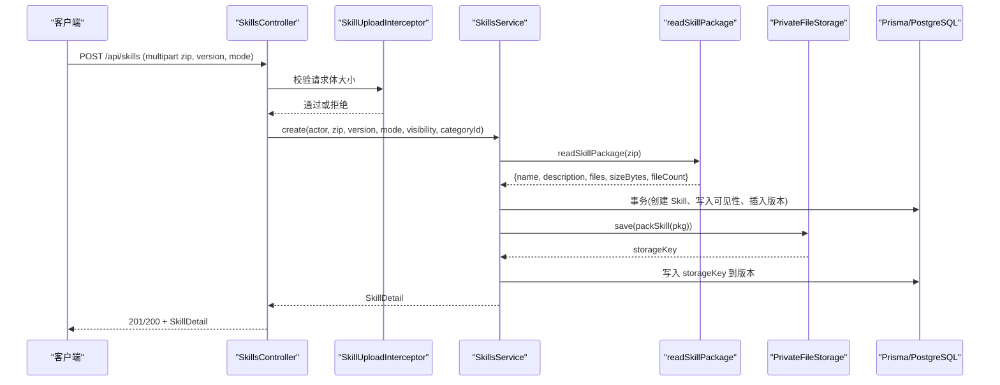
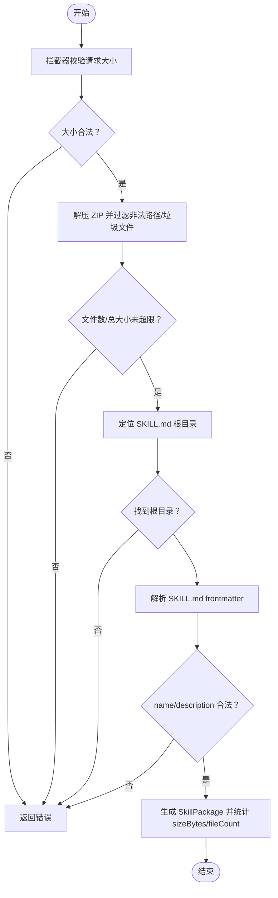
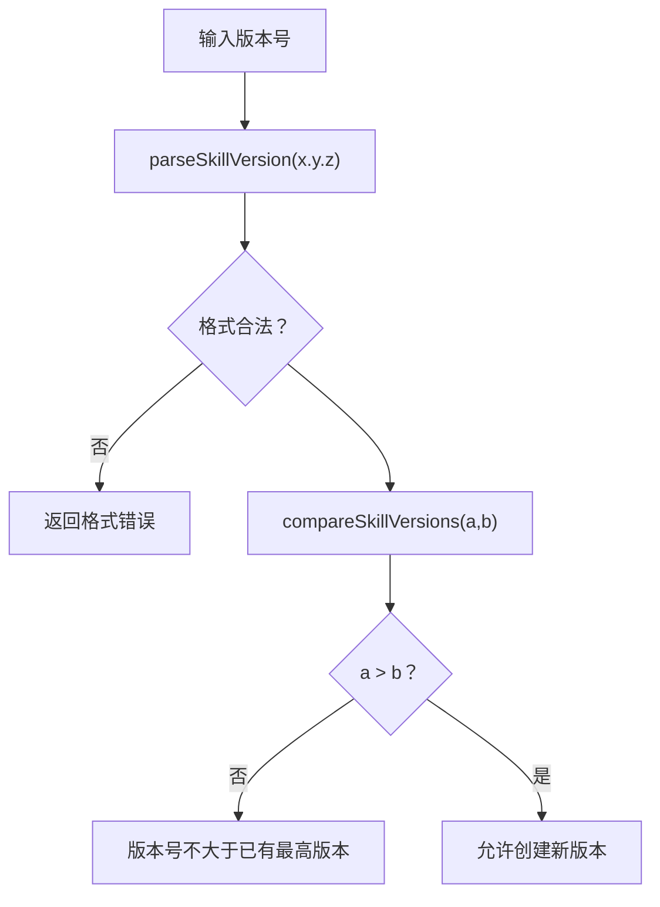
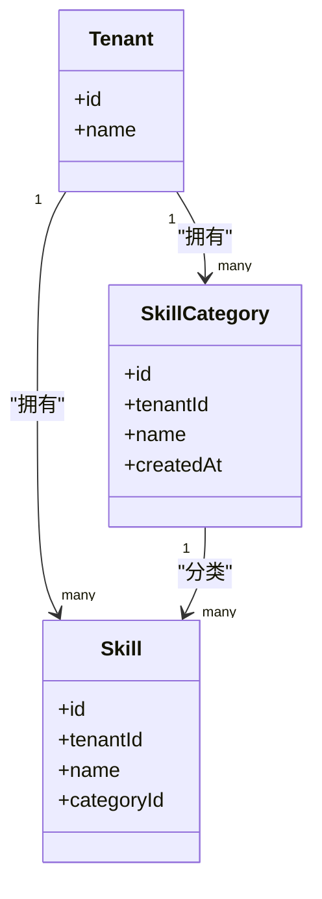
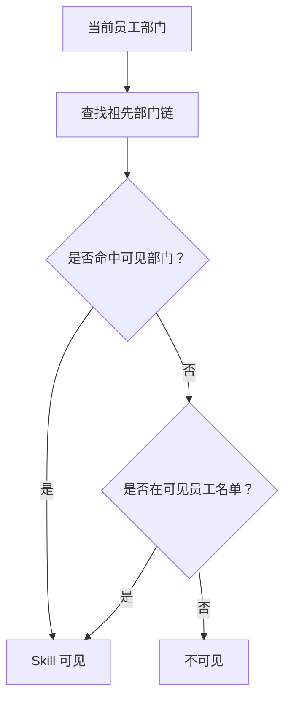
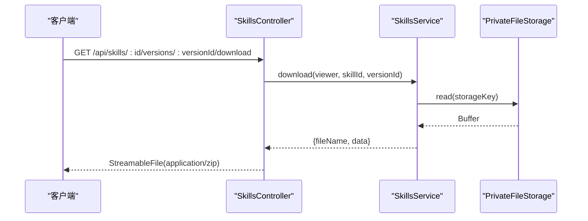
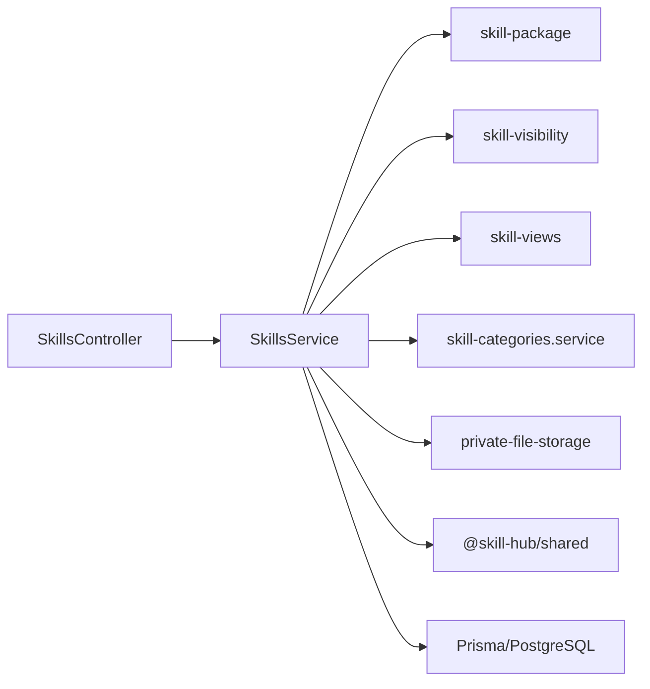
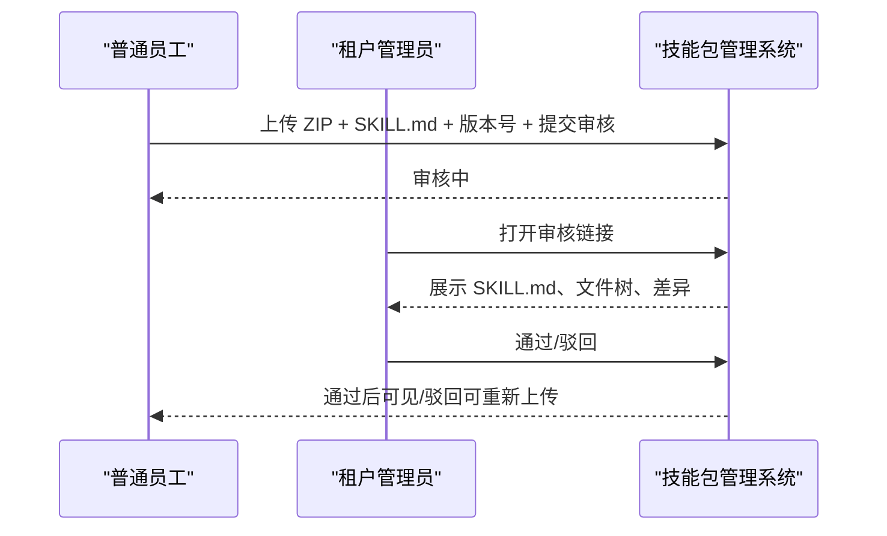

# 技能包管理系统

<cite>
**本文引用的文件**   
- [README.md](file://README.md)
- [skill-package.ts](file://apps/server/src/skills/skill-package.ts)
- [skill-upload.ts](file://apps/server/src/skills/skill-upload.ts)
- [skills.controller.ts](file://apps/server/src/skills/skills.controller.ts)
- [skills.service.ts](file://apps/server/src/skills/skills.service.ts)
- [skill-visibility.ts](file://apps/server/src/skills/skill-visibility.ts)
- [skill-categories.service.ts](file://apps/server/src/skills/skill-categories.service.ts)
- [skill-views.ts](file://apps/server/src/skills/skill-views.ts)
- [private-file-storage.ts](file://apps/server/src/storage/private-file-storage.ts)
- [schema.prisma](file://apps/server/prisma/schema.prisma)
- [skill.ts](file://packages/shared/src/skill.ts)
- [index.ts](file://packages/shared/src/index.ts)
- [SKILL.md](file://examples/hello-skill/SKILL.md)
</cite>

## 目录
1. [简介](#简介)
2. [项目结构](#项目结构)
3. [核心组件](#核心组件)
4. [架构总览](#架构总览)
5. [详细组件分析](#详细组件分析)
6. [依赖关系分析](#依赖关系分析)
7. [性能与并发优化](#性能与并发优化)
8. [批量操作支持](#批量操作支持)
9. [开发集成示例](#开发集成示例)
10. [故障排除指南](#故障排除指南)
11. [结论](#结论)

## 简介
本系统提供企业级“技能包”管理能力：上传 ZIP 格式的技能包，解析并校验 SKILL.md 元数据，执行语义化版本控制、审核流程、分类管理与可见性控制。技能包内容存储在私有目录中，通过鉴权接口下载；所有查询均按租户隔离，支持部门与员工维度的可见范围控制。系统采用 NestJS + Prisma + PostgreSQL，前端为 React，测试覆盖端到端场景。

## 项目结构
后端服务位于 `apps/server`，包含认证、健康检查、存储、技能管理、分类管理等模块；共享类型与规则在 `packages/shared`；示例技能包在 `examples/hello-skill`；数据库模型定义在 `apps/server/prisma/schema.prisma`。

**图表来源**
- [skills.controller.ts:12-144](file://apps/server/src/skills/skills.controller.ts#L12-L144)
- [skills.service.ts:114-468](file://apps/server/src/skills/skills.service.ts#L114-L468)
- [skill-package.ts:5-73](file://apps/server/src/skills/skill-package.ts#L5-L73)
- [skill-upload.ts:5-12](file://apps/server/src/skills/skill-upload.ts#L5-L12)
- [private-file-storage.ts:10-40](file://apps/server/src/storage/private-file-storage.ts#L10-L40)
- [skill-visibility.ts:7-106](file://apps/server/src/skills/skill-visibility.ts#L7-L106)
- [skill-categories.service.ts:20-82](file://apps/server/src/skills/skill-categories.service.ts#L20-L82)
- [skill-views.ts:17-101](file://apps/server/src/skills/skill-views.ts#L17-L101)
- [schema.prisma:104-218](file://apps/server/prisma/schema.prisma#L104-L218)

**章节来源**
- [README.md:1-67](file://README.md#L1-L67)
- [index.ts:1-13](file://packages/shared/src/index.ts#L1-L13)

## 核心组件
- **技能包解析与打包**：负责 ZIP 解压、路径规范化、垃圾文件忽略、根目录定位、SKILL.md 解析、容量与文件数限制、安全防 zip bomb。
- **上传拦截器**：对 multipart 请求进行体积限制，防止超大请求进入服务。
- **技能服务**：编排创建、更新、删除、版本管理、可见性修改、分类调整、下架/上架、下载等业务流程。
- **可见性控制**：实现租户可见、特定部门可见、特定员工可见、仅自己可见的规则，并结合部门树计算上级部门影响。
- **分类管理**：租户内唯一名称、上限控制、预设分类一键添加、删除时 Skill 置空。
- **视图与权限辅助**：统一版本信息转换、审核记录转换、可见性判断、状态一致性校验。
- **私有文件存储**：本地磁盘实现，随机文件名、独立目录、只通过业务接口读取。

**章节来源**
- [skill-package.ts:5-73](file://apps/server/src/skills/skill-package.ts#L5-L73)
- [skill-upload.ts:5-12](file://apps/server/src/skills/skill-upload.ts#L5-L12)
- [skills.service.ts:114-468](file://apps/server/src/skills/skills.service.ts#L114-L468)
- [skill-visibility.ts:7-106](file://apps/server/src/skills/skill-visibility.ts#L7-L106)
- [skill-categories.service.ts:20-82](file://apps/server/src/skills/skill-categories.service.ts#L20-L82)
- [skill-views.ts:17-101](file://apps/server/src/skills/skill-views.ts#L17-L101)
- [private-file-storage.ts:10-40](file://apps/server/src/storage/private-file-storage.ts#L10-L40)

## 架构总览
技能包的完整生命周期包括：上传 → 解析校验 → 存储 → 写入版本 → 审核 → 发布 → 可见性控制 → 下载。

**图表来源**
- [skills.controller.ts:47-57](file://apps/server/src/skills/skills.controller.ts#L47-L57)
- [skill-upload.ts:5-12](file://apps/server/src/skills/skill-upload.ts#L5-L12)
- [skills.service.ts:224-253](file://apps/server/src/skills/skills.service.ts#L224-L253)
- [skill-package.ts:19-57](file://apps/server/src/skills/skill-package.ts#L19-L57)
- [private-file-storage.ts:24-30](file://apps/server/src/storage/private-file-storage.ts#L24-L30)
- [schema.prisma:170-190](file://apps/server/prisma/schema.prisma#L170-L190)

## 详细组件分析

### ZIP 技能包上传、解析与验证
- **上传入口**：控制器接收 multipart 表单，字段 `file` 为 ZIP，`version` 为版本号，`mode` 决定上传去向（直接发布/提交审核/存草稿）。
- **请求大小限制**：拦截器基于共享常量设置最大请求体，阻止明显超大的请求。
- **ZIP 解析与安全**：
  - 使用 fflate 解压，过滤非法路径和垃圾文件（`.DS_Store`、`.git`、`node_modules`、`__pycache`）。
  - 按声明大小累计字节数与文件数，超过上限立即拒绝，避免 zip bomb。
  - 定位 SKILL.md 所在根目录（根目录或唯一顶层文件夹），提取相对路径的文件集合。
  - 解析 SKILL.md frontmatter，校验 name/description 长度与格式。
- **打包与解包**：
  - 将 Skill 包按 `<name>/...` 规范目录重新打包，便于本地目录使用。
  - 已存储的包按相同规范解出相对路径文件。

**图表来源**
- [skill-upload.ts:5-12](file://apps/server/src/skills/skill-upload.ts#L5-L12)
- [skill-package.ts:19-57](file://apps/server/src/skills/skill-package.ts#L19-L57)
- [skill.ts:3-21](file://packages/shared/src/skill.ts#L3-L21)
- [skill.ts:23-48](file://packages/shared/src/skill.ts#L23-L48)
- [skill.ts:50-71](file://packages/shared/src/skill.ts#L50-L71)

**章节来源**
- [skills.controller.ts:47-57](file://apps/server/src/skills/skills.controller.ts#L47-L57)
- [skill-upload.ts:5-12](file://apps/server/src/skills/skill-upload.ts#L5-L12)
- [skill-package.ts:19-73](file://apps/server/src/skills/skill-package.ts#L19-L73)
- [skill.ts:3-71](file://packages/shared/src/skill.ts#L3-L71)
- [SKILL.md:1-12](file://examples/hello-skill/SKILL.md#L1-L12)

### 语义化版本控制（SemVer）
- **版本格式**：x.y.z，每段最多 9 位数字，正则校验。
- **比较逻辑**：数值比较 major/minor/patch，确保 1.10.0 > 1.9.0。
- **冲突检测**：
  - 同名 Skill 在租户内唯一；新建时若存在同名，返回 409 并附带已有 Skill id（如果当前用户可看到）。
  - 同一 Skill 同时最多一个非正式版本（草稿/审核中），再次上传新版本需先处理现有工作版本。
  - 新版本号必须严格大于已有最高版本，否则返回错误提示。
- **升级策略**：
  - 默认下一个补丁版本为 `nextPatchVersion(highest)`。
  - 审核通过后成为正式版本；历史版本按版本号降序展示。
  - 审核链接复用：撤回后再次提交仍使用同一审核链接。

**图表来源**
- [skill.ts:73-90](file://packages/shared/src/skill.ts#L73-L90)
- [skills.service.ts:259-282](file://apps/server/src/skills/skills.service.ts#L259-L282)
- [skills.service.ts:449-457](file://apps/server/src/skills/skills.service.ts#L449-L457)

**章节来源**
- [skill.ts:73-90](file://packages/shared/src/skill.ts#L73-L90)
- [skill.ts:388-392](file://packages/shared/src/skill.ts#L388-L392)
- [skills.service.ts:259-282](file://apps/server/src/skills/skills.service.ts#L259-L282)
- [skills.service.ts:449-457](file://apps/server/src/skills/skills.service.ts#L449-L457)

### 技能分类管理
- **层次结构与关联**：
  - 分类属于租户，名称在租户内唯一。
  - Skill 与分类多对一（Skill.categoryId 可为 null，表示未分类）。
  - 删除分类时，使用该分类的 Skill 变为未分类（外键 SET NULL）。
- **管理规则**：
  - 只有租户管理员能增删改分类。
  - 每个租户最多 N 个分类（上限由共享常量控制）。
  - 支持一键添加常用分类（只补上尚未存在的）。
- **查询与计数**：
  - 列表按创建时间排序，可选显示每个分类的 Skill 数量（含未发布、已下架）。

**图表来源**
- [schema.prisma:48-60](file://apps/server/prisma/schema.prisma#L48-L60)
- [schema.prisma:104-135](file://apps/server/prisma/schema.prisma#L104-L135)
- [skill-categories.service.ts:20-82](file://apps/server/src/skills/skill-categories.service.ts#L20-L82)

**章节来源**
- [skill-categories.service.ts:20-82](file://apps/server/src/skills/skill-categories.service.ts#L20-L82)
- [schema.prisma:104-135](file://apps/server/prisma/schema.prisma#L104-L135)

### 技能可见性控制机制
- **可见性类型**：
  - 租户可见：同租户内除下架外的 Skill 对所有员工可见（所有者与管理员不受限）。
  - 特定部门可见：所选部门及其下级部门的员工可见。
  - 特定员工可见：名单中的员工可见（所有者始终在名单中）。
  - 仅自己可见：只有所有者可见。
- **计算规则**：
  - 根据当前员工的部门递归向上查找祖先部门，匹配可见部门集合。
  - 未下架且命中可见性条件才可见。
- **写入规则**：
  - 更新可见性前先清空原有部门/员工名单，再批量写入新名单。
  - 修改可见性会记录审核记录（描述前后变化）。

**图表来源**
- [skill-visibility.ts:29-57](file://apps/server/src/skills/skill-visibility.ts#L29-L57)
- [skill-visibility.ts:82-106](file://apps/server/src/skills/skill-visibility.ts#L82-L106)
- [schema.prisma:137-162](file://apps/server/prisma/schema.prisma#L137-L162)

**章节来源**
- [skill-visibility.ts:7-106](file://apps/server/src/skills/skill-visibility.ts#L7-L106)
- [schema.prisma:137-162](file://apps/server/prisma/schema.prisma#L137-L162)

### 元数据处理、文件结构验证与业务规则
- **SKILL.md 规范**：
  - 必须以 frontmatter 包裹 `name` 与 `description`。
  - name 只能包含小写字母、数字和连字符，长度不超过上限。
  - description 不能为空，长度不超过上限。
- **文件结构验证**：
  - 忽略垃圾文件与非法路径（绝对路径、`..`、盘符）。
  - SKILL.md 必须在根目录或唯一的顶层文件夹中。
- **业务规则检查**：
  - 新建 Skill 时名称在租户内唯一。
  - 新版本 SKILL.md 的 name 必须与 Skill 名称一致。
  - 版本号必须严格递增。
  - 同一 Skill 同时最多一个非正式版本。
  - 可见性设置需校验部门/员工属于本租户，特定部门可见至少选一个部门，特定员工可见时所有者始终包含。

**章节来源**
- [skill.ts:3-71](file://packages/shared/src/skill.ts#L3-L71)
- [skill-package.ts:19-57](file://apps/server/src/skills/skill-package.ts#L19-L57)
- [skills.service.ts:224-282](file://apps/server/src/skills/skills.service.ts#L224-L282)
- [skill-visibility.ts:82-97](file://apps/server/src/skills/skill-visibility.ts#L82-L97)

### 私有文件存储与下载
- **存储策略**：
  - 文件保存在独立私有目录，不通过静态路由公开。
  - 文件名使用 UUID + 扩展名，读取时取 basename 防止路径穿越。
- **下载流程**：
  - 控制器返回 StreamableFile，类型为 application/zip。
  - 正式版本下载次数 +1，非正式版本不计入。
  - 超管治理下载不计入下载次数。

**图表来源**
- [skills.controller.ts:135-143](file://apps/server/src/skills/skills.controller.ts#L135-L143)
- [skills.service.ts:430-438](file://apps/server/src/skills/skills.service.ts#L430-L438)
- [private-file-storage.ts:24-35](file://apps/server/src/storage/private-file-storage.ts#L24-L35)

**章节来源**
- [private-file-storage.ts:10-40](file://apps/server/src/storage/private-file-storage.ts#L10-L40)
- [skills.controller.ts:135-143](file://apps/server/src/skills/skills.controller.ts#L135-L143)
- [skills.service.ts:430-438](file://apps/server/src/skills/skills.service.ts#L430-L438)

## 依赖关系分析
- **控制器依赖服务**：SkillsController 调用 SkillsService 完成业务编排。
- **服务依赖工具模块**：SkillsService 依赖 skill-package、skill-visibility、skill-views、skill-categories.service、private-file-storage。
- **共享类型**：@skill-hub/shared 提供常量、类型定义、解析函数与业务枚举。
- **数据库模型**：Prisma schema 定义 Tenant、Department、Employee、Skill、SkillVersion、SkillCategory、SkillReviewRecord 等实体及关系。

**图表来源**
- [skills.controller.ts:12-144](file://apps/server/src/skills/skills.controller.ts#L12-L144)
- [skills.service.ts:1-42](file://apps/server/src/skills/skills.service.ts#L1-L42)
- [skill-package.ts:1-3](file://apps/server/src/skills/skill-package.ts#L1-L3)
- [skill-visibility.ts:1-5](file://apps/server/src/skills/skill-visibility.ts#L1-L5)
- [skill-views.ts:1-10](file://apps/server/src/skills/skill-views.ts#L1-L10)
- [skill-categories.service.ts:1-4](file://apps/server/src/skills/skill-categories.service.ts#L1-L4)
- [private-file-storage.ts:1-4](file://apps/server/src/storage/private-file-storage.ts#L1-L4)
- [index.ts:10-12](file://packages/shared/src/index.ts#L10-L12)

**章节来源**
- [skills.controller.ts:12-144](file://apps/server/src/skills/skills.controller.ts#L12-L144)
- [skills.service.ts:1-42](file://apps/server/src/skills/skills.service.ts#L1-L42)
- [index.ts:10-12](file://packages/shared/src/index.ts#L10-L12)

## 性能与并发优化
- **ZIP 炸弹防护**：按声明大小累计字节数与文件数，超过上限立即拒绝；fflate 按声明大小截断输出，防止恶意压缩包导致内存膨胀。
- **请求体限制**：上传拦截器提前拒绝超大请求，减少无效处理。
- **事务与行锁**：
  - 创建/更新版本使用 Prisma 事务，保证原子性。
  - 使用 `SELECT ... FOR UPDATE` 串行化同名 Skill 的并发创建与版本写入。
- **索引与查询优化**：
  - 版本按版本号降序查询，结合 include 预加载 uploader/category/visibility。
  - 管理视图与目录查询分别限定 published 或全部版本，减少不必要数据。
- **存储优化**：
  - 包先落盘再写库，写库失败回滚删除已落盘文件，避免孤儿文件。
  - 下载成功后对正式版本 increment 下载次数，避免频繁全量更新。

**章节来源**
- [skill-package.ts:19-41](file://apps/server/src/skills/skill-package.ts#L19-L41)
- [skill-upload.ts:5-6](file://apps/server/src/skills/skill-upload.ts#L5-L6)
- [skills.service.ts:238-253](file://apps/server/src/skills/skills.service.ts#L238-L253)
- [skills.service.ts:269-280](file://apps/server/src/skills/skills.service.ts#L269-L280)
- [skills.service.ts:459-468](file://apps/server/src/skills/skills.service.ts#L459-L468)

## 批量操作支持
- **分类预设一键添加**：按租户批量插入缺失的分类，创建时间逐个错开 1 毫秒以维持预设顺序。
- **可见性批量写入**：更新可见性时先清空原有部门/员工名单，再批量写入新名单。
- **删除 Skill 级联清理**：删除 Skill 时级联删除版本、审核记录、可见性名单，并批量删除存储文件。

**章节来源**
- [skill-categories.service.ts:46-58](file://apps/server/src/skills/skill-categories.service.ts#L46-L58)
- [skill-visibility.ts:100-106](file://apps/server/src/skills/skill-visibility.ts#L100-L106)
- [skills.service.ts:418-428](file://apps/server/src/skills/skills.service.ts#L418-L428)

## 开发集成示例
- **示例技能包**：`examples/hello-skill/SKILL.md` 演示了 frontmatter 的 name 与 description 写法，以及正文说明。
- **上传流程**：
  - 前端选择文件夹或 ZIP，填写版本号与上传模式（publish/draft/submit），可选分类与可见性。
  - 后端校验 ZIP 结构、SKILL.md 元数据、名称唯一性与版本号递增。
  - 审核通过后成为正式版本，可在目录中查看与下载。
- **审核流程**：
  - 普通员工提交审核后，租户管理员可通过审核链接查看 SKILL.md、文件树与差异。
  - 管理员可选择通过或驳回；驳回后员工可重新上传内容并再次提交。

**图表来源**
- [SKILL.md:1-12](file://examples/hello-skill/SKILL.md#L1-L12)
- [skills.controller.ts:47-92](file://apps/server/src/skills/skills.controller.ts#L47-L92)
- [skills.service.ts:224-282](file://apps/server/src/skills/skills.service.ts#L224-L282)

**章节来源**
- [SKILL.md:1-12](file://examples/hello-skill/SKILL.md#L1-L12)
- [skills.controller.ts:47-92](file://apps/server/src/skills/skills.controller.ts#L47-L92)
- [skills.service.ts:224-282](file://apps/server/src/skills/skills.service.ts#L224-L282)

## 故障排除指南
- **ZIP 解析失败**：确认上传的是 ZIP 格式，且包含合法的 SKILL.md 与文件结构。
- **SKILL.md 校验失败**：检查 frontmatter 是否包含 name 与 description，name 是否符合命名规则，description 是否为空或超长。
- **名称冲突**：新建 Skill 时若租户内已有同名，返回 409；若能查看已有 Skill，引导去详情页上传新版本。
- **版本号不合法或不递增**：确保 x.y.z 格式正确，且大于已有最高版本。
- **可见性设置错误**：部门/员工必须属于本租户；特定部门可见至少选一个部门；特定员工可见时所有者始终包含。
- **并发冲突**：版本状态变化或重复操作时返回 409；请刷新后重试。

**章节来源**
- [skill-package.ts:37-41](file://apps/server/src/skills/skill-package.ts#L37-L41)
- [skill.ts:50-71](file://packages/shared/src/skill.ts#L50-L71)
- [skills.service.ts:247-253](file://apps/server/src/skills/skills.service.ts#L247-L253)
- [skills.service.ts:276-278](file://apps/server/src/skills/skills.service.ts#L276-L278)
- [skill-visibility.ts:82-97](file://apps/server/src/skills/skill-visibility.ts#L82-L97)
- [skill-views.ts:103-110](file://apps/server/src/skills/skill-views.ts#L103-L110)

## 结论
本技能包管理系统以严格的 ZIP 解析与 SKILL.md 规范为基础，实现了语义化版本控制、审核流程、分类管理与细粒度可见性控制。通过事务与行锁保障并发安全，通过私有存储与鉴权接口保护数据安全。系统具备良好的可扩展性与可维护性，适合在企业环境中作为技能资产管理的核心平台。