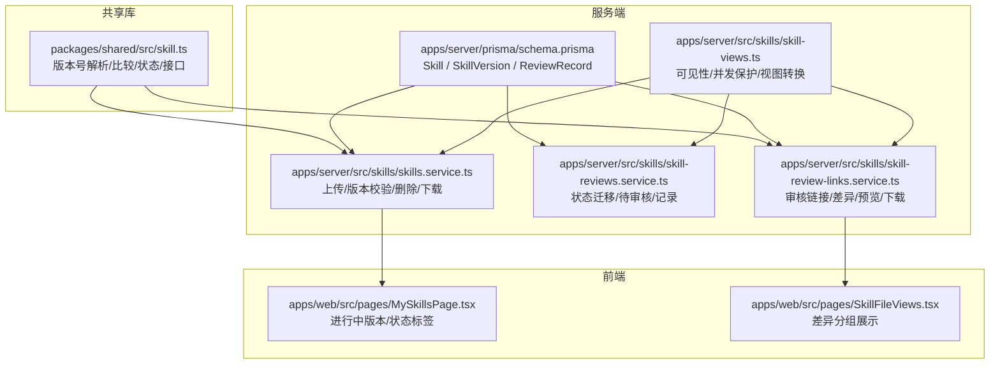
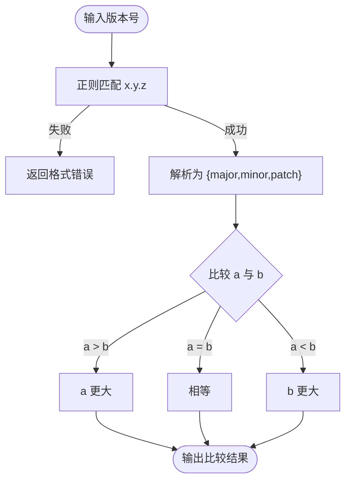
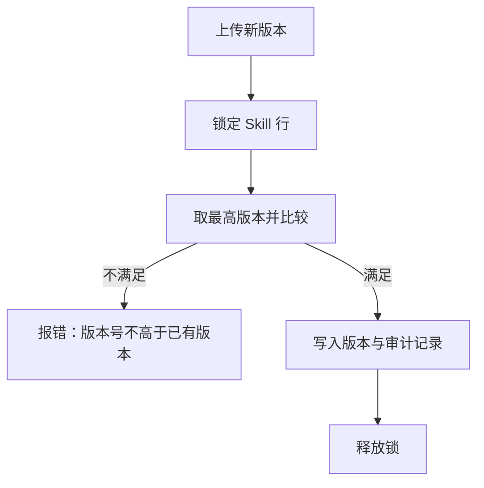
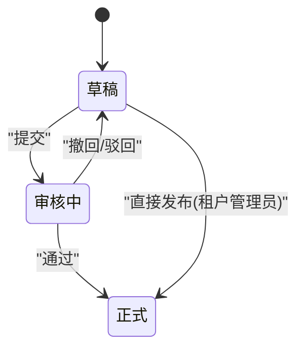
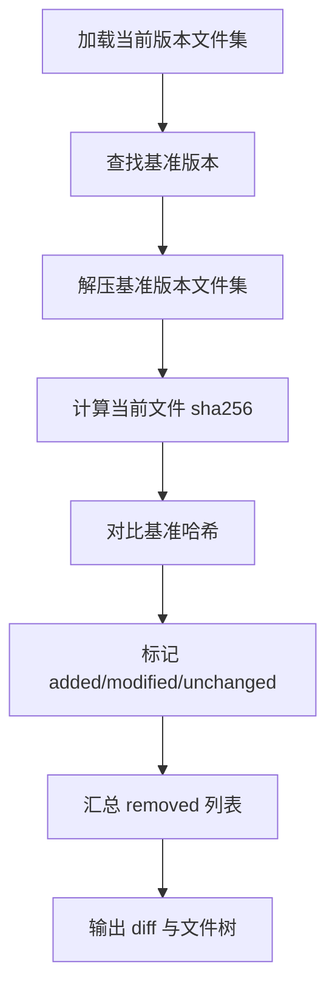
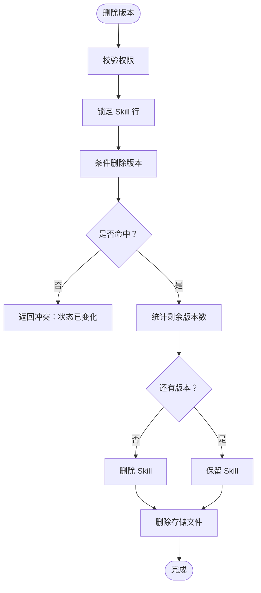
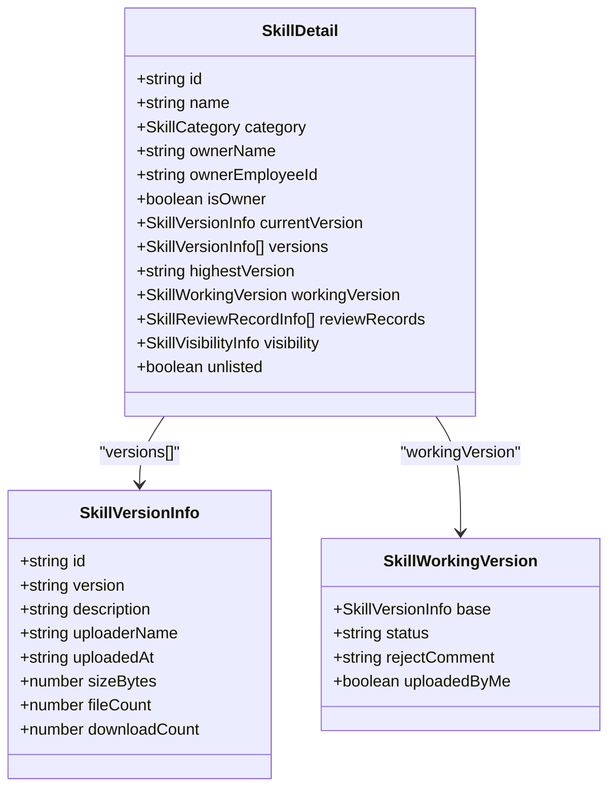
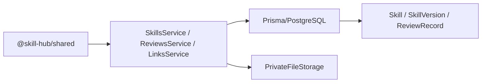

# 版本控制系统

<cite>
**本文引用的文件**   
- [README.md](file://README.md)
- [schema.prisma](file://apps/server/prisma/schema.prisma)
- [skill.ts](file://packages/shared/src/skill.ts)
- [skills.service.ts](file://apps/server/src/skills/skills.service.ts)
- [skill-views.ts](file://apps/server/src/skills/skill-views.ts)
- [skill-reviews.service.ts](file://apps/server/src/skills/skill-reviews.service.ts)
- [skill-review-links.service.ts](file://apps/server/src/skills/skill-review-links.service.ts)
- [MySkillsPage.tsx](file://apps/web/src/pages/MySkillsPage.tsx)
- [SkillFileViews.tsx](file://apps/web/src/pages/SkillFileViews.tsx)
- [skill-review-links.e2e-spec.ts](file://apps/server/test/skill-review-links.e2e-spec.ts)
</cite>

## 目录
1. [引言](#引言)
2. [项目结构](#项目结构)
3. [核心组件](#核心组件)
4. [架构总览](#架构总览)
5. [详细组件分析](#详细组件分析)
6. [依赖关系分析](#依赖关系分析)
7. [性能与一致性](#性能与一致性)
8. [故障排查指南](#故障排查指南)
9. [结论](#结论)
10. [附录：最佳实践与常见问题](#附录最佳实践与常见问题)

## 引言
本技术文档围绕仓库中的“技能包”版本控制系统展开，重点说明语义化版本控制（SemVer）的实现机制、版本升级策略、版本状态管理、版本差异对比、删除策略与数据保留规则、版本历史查询与选择逻辑，并给出可操作的最佳实践与常见问题解决方案。该系统以 PostgreSQL 为持久层，使用 Prisma 建模，后端基于 NestJS，前端基于 React；版本信息、比较算法、状态枚举等共享类型定义在 `@skill-hub/shared` 中，由服务端和网页端共同复用。

## 项目结构
从版本控制视角看，关键代码分布在以下位置：
- 共享类型与语义化版本实现：`packages/shared/src/skill.ts`
- 数据库模型与约束：`apps/server/prisma/schema.prisma`
- 版本生命周期与业务编排：`apps/server/src/skills/skills.service.ts`
- 可见性与视图转换、并发保护工具：`apps/server/src/skills/skill-views.ts`
- 审核流程与状态迁移：`apps/server/src/skills/skill-reviews.service.ts`
- 审核链接、文件差异与审阅下载：`apps/server/src/skills/skill-review-links.service.ts`
- 前端“我的技能”列表与状态展示：`apps/web/src/pages/MySkillsPage.tsx`
- 前端差异面板展示：`apps/web/src/pages/SkillFileViews.tsx`
- 端到端测试验证差异与权限行为：`apps/server/test/skill-review-links.e2e-spec.ts`
- 项目启动与演示说明：`README.md`



**图表来源**
- [skill.ts:74-90](file://packages/shared/src/skill.ts#L74-L90)
- [schema.prisma:164-190](file://apps/server/prisma/schema.prisma#L164-L190)
- [skills.service.ts:259-282](file://apps/server/src/skills/skills.service.ts#L259-L282)
- [skill-views.ts:93-110](file://apps/server/src/skills/skill-views.ts#L93-L110)
- [skill-reviews.service.ts:32-44](file://apps/server/src/skills/skill-reviews.service.ts#L32-L44)
- [skill-review-links.service.ts:43-61](file://apps/server/src/skills/skill-review-links.service.ts#L43-L61)
- [MySkillsPage.tsx:61-96](file://apps/web/src/pages/MySkillsPage.tsx#L61-L96)
- [SkillFileViews.tsx:96-136](file://apps/web/src/pages/SkillFileViews.tsx#L96-L136)

**章节来源**
- [README.md:1-67](file://README.md#L1-L67)

## 核心组件
- 语义化版本解析与比较：提供正则校验、三段数值解析、严格数值比较，以及“下一个补丁号”辅助函数。
- 版本状态机：草稿、审核中、正式三种状态，配合审核动作形成迁移图。
- 版本可见性与访问控制：按所有者、租户管理员、超管及可见性配置决定能否查看非正式版本或下载。
- 版本差异对比：基于 sha256 的文件级差异，基准为“版本号小于当前版本的最高正式版本”。
- 版本删除与清理：支持删除单个版本或删除整个 Skill，同时清理存储文件并保留必要审计记录。
- 版本历史与选择：目录仅展示正式版本，详情返回所有正式版本并按版本号降序排列，“当前版本”为最高正式版本。

**章节来源**
- [skill.ts:74-90](file://packages/shared/src/skill.ts#L74-L90)
- [skill.ts:92-97](file://packages/shared/src/skill.ts#L92-L97)
- [skill.ts:158-251](file://packages/shared/src/skill.ts#L158-L251)
- [skill.ts:263-312](file://packages/shared/src/skill.ts#L263-L312)
- [skills.service.ts:47-52](file://apps/server/src/skills/skills.service.ts#L47-L52)
- [skills.service.ts:356-372](file://apps/server/src/skills/skills.service.ts#L356-L372)

## 架构总览
版本控制的核心流程包括：
- 上传与创建：校验 SKILL.md、名称唯一性、版本号严格递增，写入存储后落库，并根据角色设置初始状态。
- 审核流转：提交、撤回、通过、驳回、直接发布，状态变更伴随审计记录。
- 差异对比：读取当前版本与基准版本的包内容，计算新增、修改、删除文件清单。
- 下载与计数：正式版本下载增加下载次数，审阅下载不计入。
- 删除与清理：删除版本或 Skill 时，先锁行再删库，最后清理存储文件。

```mermaid
sequenceDiagram
participant Client as "客户端"
participant API as "SkillsService"
participant DB as "Prisma/PostgreSQL"
participant Store as "私有文件存储"
participant Review as "SkillReviewsService"
participant Link as "SkillReviewLinksService"
Client->>API : "上传新版本含 zip、版本号、mode"
API->>Store : "保存压缩包"
API->>DB : "事务：校验最高版本/插入版本/写审计记录"
DB-->>API : "成功"
API-->>Client : "返回详情含 workingVersion/currentVersion"
Client->>Review : "执行审核步骤submit/approve/reject/publish"
Review->>DB : "条件更新状态 + 写审计记录"
DB-->>Review : "成功/冲突"
Client->>Link : "打开审核链接/预览文件/下载审阅包"
Link->>Store : "解压包/读取文件"
Link->>DB : "查询基准版本/审核记录"
Link-->>Client : "返回文件树、差异、预览内容"
```

**图表来源**
- [skills.service.ts:259-282](file://apps/server/src/skills/skills.service.ts#L259-L282)
- [skill-reviews.service.ts:55-67](file://apps/server/src/skills/skill-reviews.service.ts#L55-L67)
- [skill-review-links.service.ts:75-103](file://apps/server/src/skills/skill-review-links.service.ts#L75-L103)

## 详细组件分析

### 语义化版本控制（SemVer）实现
- 版本格式：采用 x.y.z 三段整数，每段最多 9 位，确保能安全存入 32 位整型字段。
- 解析与比较：
  - 解析函数将字符串转为 `{ major, minor, patch }` 对象。
  - 比较函数按主版本、次版本、修订版本顺序进行数值比较。
  - 提供“下一个补丁号”生成器，便于前端默认填充。
- 约束与校验：
  - 前端使用相同正则进行输入校验。
  - 服务端 DTO 使用同一正则进行请求体验证。
  - 数据库对 `(skillId, major, minor, patch)` 建立唯一索引，防止重复版本。



**图表来源**
- [skill.ts:74-90](file://packages/shared/src/skill.ts#L74-L90)
- [schema.prisma:170-190](file://apps/server/prisma/schema.prisma#L170-L190)

**章节来源**
- [skill.ts:74-90](file://packages/shared/src/skill.ts#L74-L90)
- [skill.ts:388-392](file://packages/shared/src/skill.ts#L388-L392)
- [schema.prisma:170-190](file://apps/server/prisma/schema.prisma#L170-L190)

### 版本升级策略与向后兼容性检查
- 严格递增：新版本必须大于已有最高版本（包含非正式版本），否则抛出“版本号必须大于已有的最高版本”错误。
- 并发保护：上传新版本前对 Skill 行加锁，串行化并发上传，避免竞态导致版本号回退。
- 名称一致性：新包的 SKILL.md 的 name 必须与 Skill 名称一致，否则拒绝。
- 向后兼容性：系统未内置破坏性变更检测；破坏性变更由团队规范与审核流程保障。若需自动化检测，可在审核环节引入契约测试或 API 兼容检查。



**图表来源**
- [skills.service.ts:269-280](file://apps/server/src/skills/skills.service.ts#L269-L280)

**章节来源**
- [skills.service.ts:259-282](file://apps/server/src/skills/skills.service.ts#L259-L282)

### 版本状态管理与转换规则
- 状态集合：草稿（draft）、审核中（pending）、正式（published）。
- 允许的动作：
  - 提交（submit）：草稿 → 审核中
  - 撤回（withdraw）：审核中 → 草稿
  - 通过（approve）：审核中 → 正式
  - 驳回（reject）：审核中 → 草稿
  - 直接发布（publish_direct）：草稿 → 正式（仅限上传该草稿的租户管理员）
- 并发安全：使用“当前状态=期望起始状态”的条件更新，后到者收到“状态已变化”冲突提示。
- 审计记录：每次状态迁移都记录动作、操作人、评论和时间。



**图表来源**
- [skill-reviews.service.ts:32-44](file://apps/server/src/skills/skill-reviews.service.ts#L32-L44)
- [skill-views.ts:103-110](file://apps/server/src/skills/skill-views.ts#L103-L110)

**章节来源**
- [skill-reviews.service.ts:20-44](file://apps/server/src/skills/skill-reviews.service.ts#L20-L44)
- [skill-views.ts:103-110](file://apps/server/src/skills/skill-views.ts#L103-L110)

### 版本差异对比与文件变更检测
- 基准版本：版本号比当前版本小的最高正式版本；若无则视为首个版本，全部文件为新增。
- 差异计算：
  - 解压当前版本与基准版本的包，得到路径→字节数组映射。
  - 对每个文件计算 sha256，与基准哈希比较得出“新增/修改/未变”。
  - 统计新增、修改、删除文件路径列表，并排序输出。
- 前端展示：按新增、修改、删除分组展示，并显示基准版本号。



**图表来源**
- [skill-review-links.service.ts:43-61](file://apps/server/src/skills/skill-review-links.service.ts#L43-L61)
- [skill-review-links.service.ts:75-103](file://apps/server/src/skills/skill-review-links.service.ts#L75-L103)
- [SkillFileViews.tsx:96-136](file://apps/web/src/pages/SkillFileViews.tsx#L96-L136)

**章节来源**
- [skill-review-links.service.ts:43-61](file://apps/server/src/skills/skill-review-links.service.ts#L43-L61)
- [skill-review-links.service.ts:75-103](file://apps/server/src/skills/skill-review-links.service.ts#L75-L103)
- [SkillFileViews.tsx:96-136](file://apps/web/src/pages/SkillFileViews.tsx#L96-L136)
- [skill-review-links.e2e-spec.ts:146-164](file://apps/server/test/skill-review-links.e2e-spec.ts#L146-L164)

### 版本删除策略与数据保留规则
- 删除单个版本：
  - 租户管理员可删除任意版本；其他人只能删除自己的草稿。
  - 删除时使用“当前状态=期望状态”条件删除，并发改变时返回冲突。
  - 若删除后该 Skill 无版本，则一并删除 Skill。
  - 删除后仍保留与该版本相关的审计记录（versionId 置空）。
- 删除整个 Skill：
  - 所有者或租户管理员可删除；超管可删除任意租户的 Skill。
  - 删除前先锁 Skill 行，收集所有版本的 storageKey，再级联删除 Skill、版本、可见性名单与审计记录。
  - 最后遍历删除存储文件，保证存储与数据库一致。



**图表来源**
- [skills.service.ts:356-372](file://apps/server/src/skills/skills.service.ts#L356-L372)
- [skills.service.ts:418-428](file://apps/server/src/skills/skills.service.ts#L418-L428)

**章节来源**
- [skills.service.ts:356-372](file://apps/server/src/skills/skills.service.ts#L356-L372)
- [skills.service.ts:418-428](file://apps/server/src/skills/skills.service.ts#L418-L428)

### 版本历史查询与版本选择逻辑
- 目录列表：仅展示有正式版本的 Skill，并返回“当前版本”（版本号最高的正式版本）。
- 详情页面：返回所有正式版本（按版本号降序），以及进行中的非正式版本（仅所有者/管理员可见）。
- 可见性控制：
  - 所有者与租户管理员可查看非正式版本与审核记录。
  - 其他员工只能看到可见性命中的正式版本；否则返回 404。
- “我的技能”页面：展示进行中的版本及其状态标签，支持复制审核链接。



**图表来源**
- [skill.ts:158-251](file://packages/shared/src/skill.ts#L158-L251)
- [skills.service.ts:138-206](file://apps/server/src/skills/skills.service.ts#L138-L206)
- [MySkillsPage.tsx:61-96](file://apps/web/src/pages/MySkillsPage.tsx#L61-L96)

**章节来源**
- [skills.service.ts:126-206](file://apps/server/src/skills/skills.service.ts#L126-L206)
- [skill-views.ts:93-101](file://apps/server/src/skills/skill-views.ts#L93-L101)
- [MySkillsPage.tsx:61-96](file://apps/web/src/pages/MySkillsPage.tsx#L61-L96)

### 版本回滚机制
- 系统未提供“一键回滚”按钮；但可通过以下方式实现回滚：
  - 选择一个旧正式版本作为基准，重新打包并提交新版本，版本号严格递增。
  - 审核通过后，该旧版本成为历史，新版本成为新的“当前版本”。
- 若需要强制回滚到某个历史版本，建议：
  - 将该历史版本的内容复制到新的 zip 包。
  - 使用 `nextPatchVersion` 或手动指定一个更高的版本号。
  - 走正常上传与审核流程，确保审计链完整。

[本节为概念性说明，不直接分析具体文件]

## 依赖关系分析
- 共享库 `@skill-hub/shared` 提供版本解析、比较、状态与接口定义，被服务端与前端共同引用。
- 服务端服务之间：
  - `SkillsService` 依赖 `PrivateFileStorage`、`PrismaService` 与 `skill-views` 工具。
  - `SkillReviewsService` 依赖 `PrismaService` 与 `skill-views` 工具。
  - `SkillReviewLinksService` 依赖 `PrismaService`、`PrivateFileStorage` 与 `skill-package` 解压工具。
- 数据库模型：
  - `Skill` 与 `SkillVersion` 一对多。
  - `SkillVersion` 与 `SkillReviewRecord` 一对多（版本删除后记录保留，versionId 置空）。
  - `Skill` 与 `SkillVisibleDepartment`、`SkillVisibleEmployee` 一对多，用于细粒度可见性。



**图表来源**
- [skill.ts:74-90](file://packages/shared/src/skill.ts#L74-L90)
- [skills.service.ts:21-25](file://apps/server/src/skills/skills.service.ts#L21-L25)
- [skill-reviews.service.ts:1-18](file://apps/server/src/skills/skill-reviews.service.ts#L1-L18)
- [skill-review-links.service.ts:1-22](file://apps/server/src/skills/skill-review-links.service.ts#L1-L22)
- [schema.prisma:104-190](file://apps/server/prisma/schema.prisma#L104-L190)

**章节来源**
- [schema.prisma:104-190](file://apps/server/prisma/schema.prisma#L104-L190)

## 性能与一致性
- 版本号比较为 O(1)，文件差异为 O(N)（N 为文件数量），sha256 计算开销与文件大小成正比。
- 大文件预览存在截断上限（文本预览最大字符数），避免内存溢出。
- 并发安全：
  - 上传新版本时对 Skill 行加锁。
  - 状态迁移与删除使用“条件更新/删除 + assertNotStale”保证幂等与冲突检测。
- 下载计数：仅正式版本成功读取后增加下载次数，审阅下载不计入。

[本节为通用指导，不直接分析具体文件]

## 故障排查指南
- 版本号不合法：
  - 现象：前端或后端报“版本号格式应为 x.y.z”。
  - 处理：检查输入是否符合正则；确认每段不超过 9 位。
- 版本号不高于已有版本：
  - 现象：上传新版本时报错“版本号必须大于已有的最高版本”。
  - 处理：使用更高版本号；或使用“下一个补丁号”辅助函数。
- 状态已变化（并发冲突）：
  - 现象：审核或删除时返回“该版本状态已变化”。
  - 处理：刷新页面后重试；避免多人同时处理同一版本。
- 无权查看/下载：
  - 现象：审核链接或下载返回 403。
  - 处理：确认登录身份与租户；检查可见性配置是否为“仅自己可见”或不在部门/员工名单中。
- 文件路径非法：
  - 现象：预览文件时报“文件路径不合法”。
  - 处理：检查路径是否包含 `..` 或绝对路径；使用规范化路径。

**章节来源**
- [skill.ts:74-76](file://packages/shared/src/skill.ts#L74-L76)
- [skills.service.ts:44-45](file://apps/server/src/skills/skills.service.ts#L44-L45)
- [skill-views.ts:103-110](file://apps/server/src/skills/skill-views.ts#L103-L110)
- [skill-review-links.service.ts:105-123](file://apps/server/src/skills/skill-review-links.service.ts#L105-L123)

## 结论
该版本控制系统以严格的 SemVer 为基础，结合清晰的状态机与完善的审计记录，实现了安全的版本升级、差异对比与审阅协作。通过共享类型定义与前后端一致的校验规则，保证了版本行为的确定性；通过数据库唯一约束与事务锁，保障了并发安全与数据一致性。对于破坏性变更与回滚，系统依赖流程规范与人工审核；如需自动化，可在审核环节扩展契约测试与兼容性检查。

[本节为总结性内容，不直接分析具体文件]

## 附录：最佳实践与常见问题

### 最佳实践
- 版本号命名：
  - 遵循 x.y.z，主版本表示破坏性变更，次版本表示新功能，修订版本表示修复。
  - 使用“下一个补丁号”辅助函数自动生成默认版本号。
- 上传与审核：
  - 上传前先本地校验 SKILL.md 的 name 与描述。
  - 审核时关注差异报告，重点关注新增、修改、删除文件。
- 可见性与下架：
  - 谨慎设置“仅自己可见”，避免影响团队协作。
  - 下架/上架操作会记录审计日志，便于追溯。
- 删除与清理：
  - 删除版本前先评估是否仍有下游依赖。
  - 删除 Skill 会级联删除版本与可见性名单，请谨慎操作。

### 常见问题
- 为什么不能直接覆盖旧版本？
  - 系统设计为不可变历史，新版本必须严格递增，以保证可追溯与回滚能力。
- 为什么审阅下载不计入下载次数？
  - 审阅下载用于审核与评审，不应影响正式下载的统计数据。
- 如何快速定位某版本的变更？
  - 使用审核链接查看文件差异；前端会按新增、修改、删除分组展示。

[本节为通用指导，不直接分析具体文件]