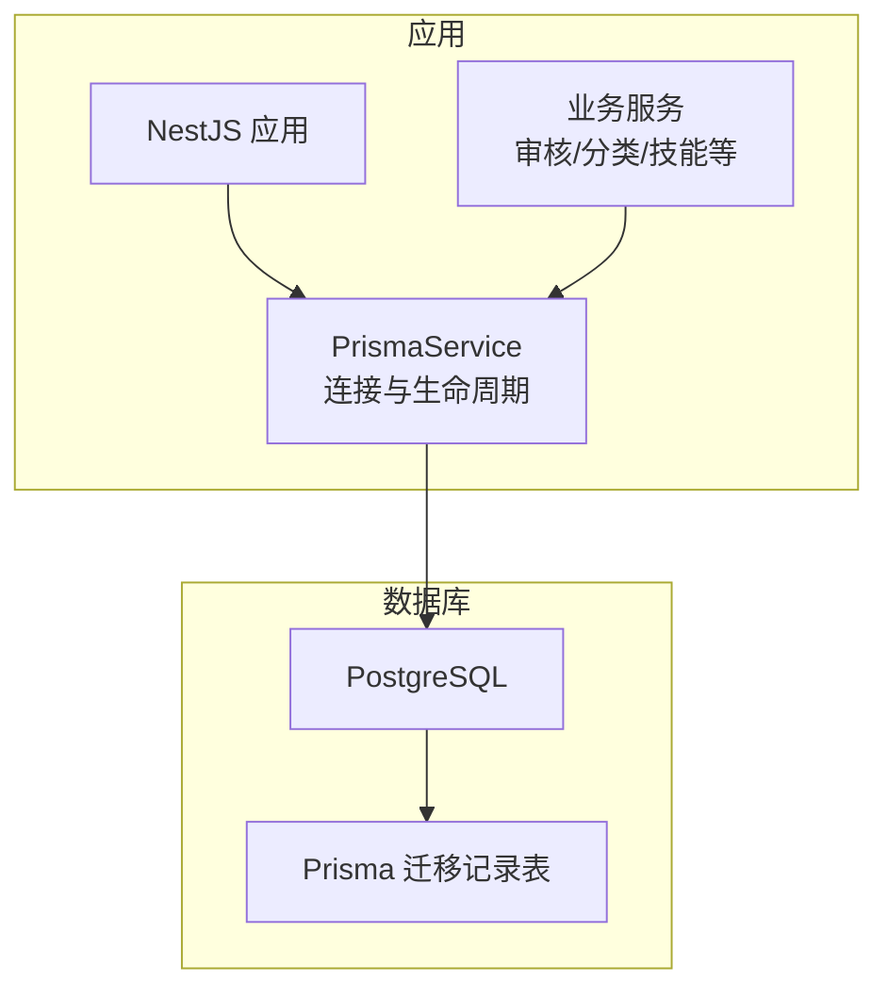
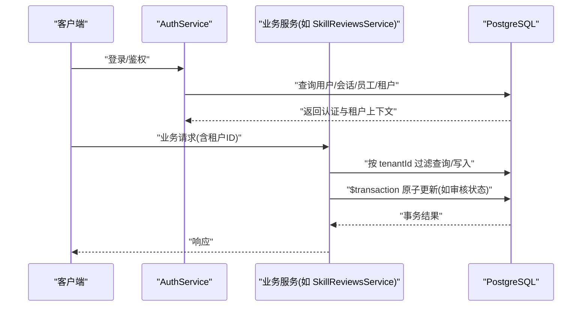
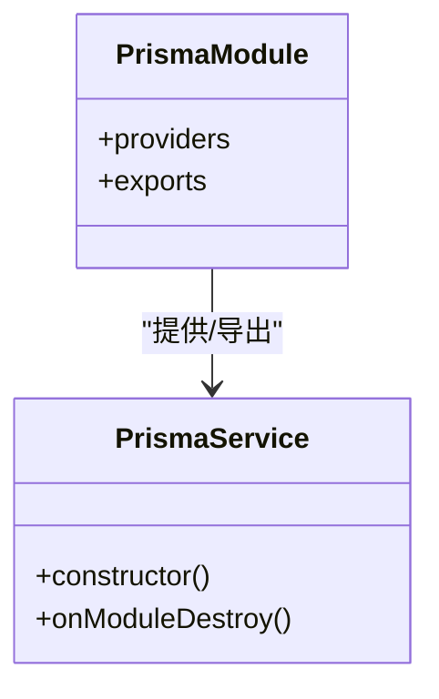
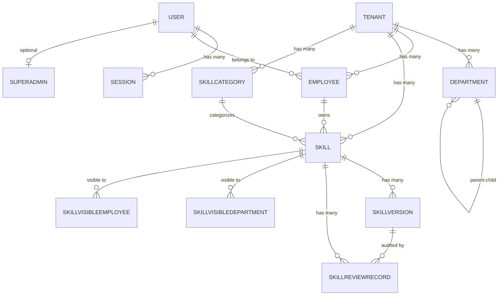
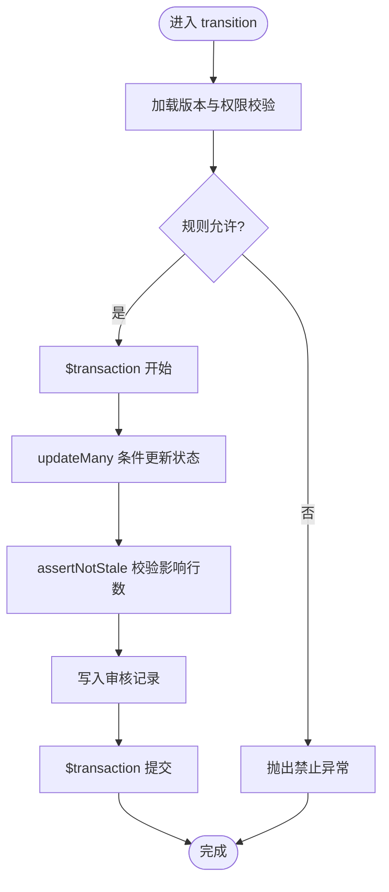
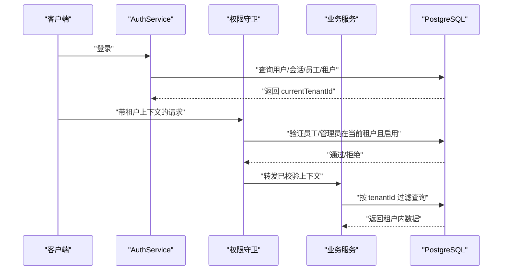
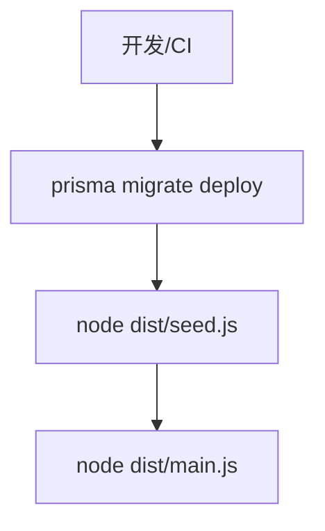
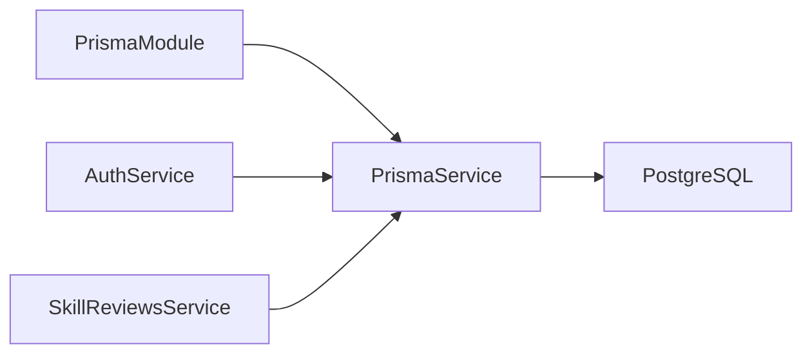

# 数据库管理

<cite>
**本文引用的文件**   
- [schema.prisma](file://apps/server/prisma/schema.prisma)
- [prisma.service.ts](file://apps/server/src/prisma/prisma.service.ts)
- [prisma.module.ts](file://apps/server/src/prisma/prisma.module.ts)
- [prisma.config.ts](file://apps/server/prisma.config.ts)
- [migration.sql](file://apps/server/prisma/migrations/20261004080000_demo_init/migration.sql)
- [skill-reviews.service.ts](file://apps/server/src/skills/skill-reviews.service.ts)
- [auth.service.ts](file://apps/server/src/auth/auth.service.ts)
- [session.ts](file://apps/server/src/auth/session.ts)
- [reset-database.ts](file://apps/server/test/reset-database.ts)
- [global-setup.ts](file://apps/server/test/global-setup.ts)
- [server.Dockerfile](file://deploy/server.Dockerfile)
- [seed.ts](file://apps/server/src/seed.ts)
</cite>

## 目录
1. [引言](#引言)
2. [项目结构](#项目结构)
3. [核心组件](#核心组件)
4. [架构总览](#架构总览)
5. [详细组件分析](#详细组件分析)
6. [依赖关系分析](#依赖关系分析)
7. [性能与优化](#性能与优化)
8. [故障排查](#故障排查)
9. [结论](#结论)
10. [附录：操作示例与最佳实践](#附录操作示例与最佳实践)

## 引言
本文件面向后端开发者与运维人员，系统性说明 Skill Hub 教学平台的数据库管理方案。内容覆盖 Prisma ORM 配置、连接池与生命周期、事务处理、数据模型设计、多租户隔离、迁移与版本管理、备份恢复策略、性能监控与优化建议，以及可复用的代码示例与最佳实践。目标是帮助读者在理解现有实现的基础上，安全扩展、稳定运行并持续优化数据库层。

## 项目结构
本项目采用 NestJS + Prisma + PostgreSQL 的架构。数据库相关的关键位置如下：
- Prisma 数据源与模型定义位于 apps/server/prisma/schema.prisma。
- Prisma 客户端通过 NestJS 模块注入，服务类封装连接生命周期。
- Prisma CLI 配置位于 apps/server/prisma.config.ts，统一 schema、migrations 路径与种子脚本。
- 初始迁移脚本位于 apps/server/prisma/migrations/20261004080000_demo_init/migration.sql。
- 测试环境使用独立数据库 URL，并在全局初始化时执行迁移。
- 生产镜像启动前自动执行迁移与种子数据。

**图示来源**
- [prisma.service.ts:1-14](file://apps/server/src/prisma/prisma.service.ts#L1-L14)
- [prisma.config.ts:1-14](file://apps/server/prisma.config.ts#L1-L14)
- [server.Dockerfile:19-25](file://deploy/server.Dockerfile#L19-L25)

**章节来源**
- [schema.prisma:1-219](file://apps/server/prisma/schema.prisma#L1-L219)
- [prisma.service.ts:1-14](file://apps/server/src/prisma/prisma.service.ts#L1-L14)
- [prisma.module.ts:1-10](file://apps/server/src/prisma/prisma.module.ts#L1-L10)
- [prisma.config.ts:1-14](file://apps/server/prisma.config.ts#L1-L14)
- [server.Dockerfile:19-25](file://deploy/server.Dockerfile#L19-L25)

## 核心组件
- Prisma 客户端与服务：通过 PrismaPg 适配器从环境变量 DATABASE_URL 获取连接字符串，模块销毁时断开连接。
- Prisma 模块：以 Global 模式导出 PrismaService，供其他模块直接注入。
- Prisma 配置：集中声明 schema 路径、migrations 路径、seed 命令与 datasource.url。
- 数据模型：用户、会话、租户、部门、员工、技能、技能分类、技能可见性、技能版本、审核记录等。
- 事务处理：审核状态迁移、类别批量创建/更新、演示数据初始化等场景使用 $transaction。
- 多租户隔离：所有业务查询均基于 tenantId 过滤；会话携带 currentTenantId，认证与权限校验贯穿全链路。
- 迁移与部署：Docker 启动前执行 prisma migrate deploy，测试环境通过 global-setup 执行迁移。

**章节来源**
- [prisma.service.ts:1-14](file://apps/server/src/prisma/prisma.service.ts#L1-L14)
- [prisma.module.ts:1-10](file://apps/server/src/prisma/prisma.module.ts#L1-L10)
- [prisma.config.ts:1-14](file://apps/server/prisma.config.ts#L1-L14)
- [schema.prisma:1-219](file://apps/server/prisma/schema.prisma#L1-L219)
- [skill-reviews.service.ts:51-67](file://apps/server/src/skills/skill-reviews.service.ts#L51-L67)
- [auth.service.ts:15-49](file://apps/server/src/auth/auth.service.ts#L15-L49)
- [server.Dockerfile:19-25](file://deploy/server.Dockerfile#L19-L25)

## 架构总览
下图展示从请求到数据库访问的整体流程，包括认证、租户上下文、业务逻辑与事务写入。

**图示来源**
- [auth.service.ts:15-49](file://apps/server/src/auth/auth.service.ts#L15-L49)
- [skill-reviews.service.ts:51-67](file://apps/server/src/skills/skill-reviews.service.ts#L51-L67)

## 详细组件分析

### Prisma 客户端与连接管理
- 连接来源：通过 PrismaPg 适配器读取 process.env.DATABASE_URL。
- 生命周期：实现 OnModuleDestroy，在模块销毁时调用 $disconnect 释放连接。
- 模块注册：PrismaModule 为 Global 模块，导出 PrismaService，便于跨模块注入。
- 构建与运行：Dockerfile 在启动前执行 prisma migrate deploy，确保数据库结构与种子数据就绪。

**图示来源**
- [prisma.service.ts:1-14](file://apps/server/src/prisma/prisma.service.ts#L1-L14)
- [prisma.module.ts:1-10](file://apps/server/src/prisma/prisma.module.ts#L1-L10)
- [server.Dockerfile:19-25](file://deploy/server.Dockerfile#L19-L25)

**章节来源**
- [prisma.service.ts:1-14](file://apps/server/src/prisma/prisma.service.ts#L1-L14)
- [prisma.module.ts:1-10](file://apps/server/src/prisma/prisma.module.ts#L1-L10)
- [server.Dockerfile:19-25](file://deploy/server.Dockerfile#L19-L25)

### 数据模型与实体关系
- 用户与会话：User 与 Session 一对多，Session 包含 currentTenantId 表示当前租户上下文。
- 租户与组织：Tenant 下有多 Department 与 Employee；Department 支持父子树形结构。
- 技能体系：Skill 属于 Tenant，由 Employee 拥有；SkillCategory 按租户维度唯一；SkillVersion 维护语义化版本与状态机。
- 可见性与权限：SkillVisibleDepartment/SkillVisibleEmployee 作为多对多中间表控制可见范围。
- 审核记录：SkillReviewRecord 记录每次动作（提交、撤回、批准、驳回、发布等），关联 Skill 与可选 Version。

**图示来源**
- [schema.prisma:12-219](file://apps/server/prisma/schema.prisma#L12-L219)

**章节来源**
- [schema.prisma:12-219](file://apps/server/prisma/schema.prisma#L12-L219)

### 事务处理与并发控制
- 审核状态迁移：使用 $transaction 包裹“乐观条件更新”和“审计记录写入”，保证状态变更与审计日志原子一致。
- 并发保护：通过 updateMany 的条件 where status = from 与 assertNotStale 检查影响行数，避免重复或过期操作。
- 类别管理：批量新增/更新/删除类别时使用事务，结合租户维度的计数与唯一约束防止越界与冲突。

**图示来源**
- [skill-reviews.service.ts:51-67](file://apps/server/src/skills/skill-reviews.service.ts#L51-L67)

**章节来源**
- [skill-reviews.service.ts:51-67](file://apps/server/src/skills/skill-reviews.service.ts#L51-L67)

### 多租户数据隔离与查询过滤
- 会话上下文：Session.currentTenantId 标识当前租户；认证后返回 AuthContext 包含 currentTenantId。
- 员工与管理员查找：根据 currentTenantId 与 tenant.status=active 过滤，确保仅活跃租户下的有效档案可用。
- 业务查询：所有涉及 Skill、SkillCategory、SkillVersion、SkillReviewRecord 的查询均以 skill.tenantId 或显式 tenantId 过滤。
- 权限边界：控制器与守卫层强制租户上下文，超管只读租户列表，不修改租户内数据。

**图示来源**
- [auth.service.ts:15-49](file://apps/server/src/auth/auth.service.ts#L15-L49)
- [session.ts:1-29](file://apps/server/src/auth/session.ts#L1-L29)

**章节来源**
- [auth.service.ts:15-49](file://apps/server/src/auth/auth.service.ts#L15-L49)
- [session.ts:1-29](file://apps/server/src/auth/session.ts#L1-L29)

### 数据库迁移与版本管理
- 迁移配置：prisma.config.ts 指定 schema 与 migrations 路径，并配置 seed 命令。
- 初始迁移：migration.sql 由 Prisma 生成，包含用户、会话、租户、部门、员工、技能、分类、版本、审核记录等建表语句。
- 测试环境：global-setup 在执行测试前调用 prisma migrate deploy，确保测试库结构一致。
- 生产环境：Dockerfile 启动命令先执行 prisma migrate deploy，再运行种子脚本与主程序。

**图示来源**
- [prisma.config.ts:1-14](file://apps/server/prisma.config.ts#L1-L14)
- [global-setup.ts:1-9](file://apps/server/test/global-setup.ts#L1-L9)
- [server.Dockerfile:19-25](file://deploy/server.Dockerfile#L19-L25)
- [seed.ts:1-5](file://apps/server/src/seed.ts#L1-L5)

**章节来源**
- [prisma.config.ts:1-14](file://apps/server/prisma.config.ts#L1-L14)
- [migration.sql:48-88](file://apps/server/prisma/migrations/20261004080000_demo_init/migration.sql#L48-L88)
- [global-setup.ts:1-9](file://apps/server/test/global-setup.ts#L1-L9)
- [server.Dockerfile:19-25](file://deploy/server.Dockerfile#L19-L25)
- [seed.ts:1-5](file://apps/server/src/seed.ts#L1-L5)

### 备份恢复与灾难恢复
- 备份策略建议：
  - 定期全量备份 PostgreSQL 数据库（pg_dump）与对象存储中的文件索引键（storageKey）。
  - 保留最近 N 次增量 WAL 归档，用于时间点恢复（PITR）。
  - 将备份文件加密并异地存储，保留策略遵循合规要求。
- 恢复流程建议：
  - 优先恢复最新全量备份，再回放增量 WAL 至目标时间点。
  - 校验迁移记录表与 schema 一致性，必要时回滚或重放迁移。
  - 恢复后执行幂等种子脚本（若需要），但需避免覆盖已有业务数据。
- 演练与验证：
  - 定期进行恢复演练，验证 RTO/RPO 指标。
  - 建立回滚预案，确保新版本不可用时能快速切回旧版本。

[本节为通用指导，不直接分析具体源码文件]

## 依赖关系分析
- 模块耦合：
  - PrismaModule 全局导出 PrismaService，降低各业务模块的耦合度。
  - AuthService 与 SkillReviewsService 等业务服务依赖 PrismaService 进行数据访问。
- 外部依赖：
  - @prisma/adapter-pg 提供 PostgreSQL 适配器。
  - Prisma CLI 负责迁移与代码生成。
- 潜在风险：
  - 直连数据库 URL 需严格保密，建议使用密钥管理服务。
  - 测试环境必须使用独立数据库，避免污染生产数据。

**图示来源**
- [prisma.module.ts:1-10](file://apps/server/src/prisma/prisma.module.ts#L1-L10)
- [prisma.service.ts:1-14](file://apps/server/src/prisma/prisma.service.ts#L1-L14)
- [auth.service.ts:1-77](file://apps/server/src/auth/auth.service.ts#L1-L77)
- [skill-reviews.service.ts:1-113](file://apps/server/src/skills/skill-reviews.service.ts#L1-L113)

**章节来源**
- [prisma.module.ts:1-10](file://apps/server/src/prisma/prisma.module.ts#L1-L10)
- [prisma.service.ts:1-14](file://apps/server/src/prisma/prisma.service.ts#L1-L14)
- [auth.service.ts:1-77](file://apps/server/src/auth/auth.service.ts#L1-L77)
- [skill-reviews.service.ts:1-113](file://apps/server/src/skills/skill-reviews.service.ts#L1-L113)

## 性能与优化
- 连接池与资源管理：
  - 使用 PrismaPg 适配器，建议在环境变量中配置连接池参数（如连接数、超时、空闲回收等），以匹配负载与数据库容量。
  - 确保进程退出时调用 $disconnect，避免连接泄漏。
- 索引设计：
  - 已在关键查询字段上添加索引，如 Session.userId、Department.tenantId、Employee.tenantId、Skill.categoryId、SkillReviewRecord.skillId 等。
  - 复合唯一约束（如 Tenant+Name、Skill+Name、SkillVersion 三元组）提升去重与查询效率。
- 查询优化：
  - 多租户查询务必带上 tenantId，避免全表扫描。
  - 分页查询使用 skip/take，并结合 orderBy 提高稳定性。
  - 批量操作尽量使用 updateMany/deleteMany 减少往返次数。
- 事务优化：
  - 将多个写操作放入同一事务，减少锁竞争与网络开销。
  - 使用乐观条件更新（where status=from）避免并发冲突。
- 监控建议：
  - 采集慢查询日志、连接池使用率、事务耗时、错误码分布。
  - 针对高频接口建立 SQL 执行计划分析，定期审视索引命中情况。

[本节为通用指导，不直接分析具体源码文件]

## 故障排查
- 常见错误与定位：
  - 唯一约束冲突：捕获 Prisma.PrismaClientKnownRequestError 的 P2002，转换为业务冲突异常。
  - 非测试库误清空：resetDatabase 会拒绝在非 _test 后缀数据库上执行 TRUNCATE，防止误删生产数据。
  - 会话过期或无效：authenticate 会检查 expiresAt，过期或不存在则返回 null。
- 测试环境清理：
  - reset-database.ts 仅允许 _test 数据库，TRUNCATE 业务表并保留迁移记录。
  - global-setup.ts 在测试前执行 prisma migrate deploy，保证结构一致。
- 生产启动问题：
  - Dockerfile 启动命令顺序：迁移 -> 种子 -> 主程序，任一失败都会阻止应用启动。

**章节来源**
- [skill-categories.service.ts:78-78](file://apps/server/src/skills/skill-categories.service.ts#L78-L78)
- [reset-database.ts:1-12](file://apps/server/test/reset-database.ts#L1-L12)
- [auth.service.ts:30-35](file://apps/server/src/auth/auth.service.ts#L30-L35)
- [global-setup.ts:1-9](file://apps/server/test/global-setup.ts#L1-L9)
- [server.Dockerfile:19-25](file://deploy/server.Dockerfile#L19-L25)

## 结论
该项目的数据库层以 Prisma 为核心，围绕多租户隔离、事务一致性与迁移可追溯性展开。通过全局 PrismaService、严格的租户上下文与事务保护，系统在并发与一致性方面具备良好基础。后续可在连接池调优、索引治理、慢查询分析与备份演练等方面持续完善，以提升稳定性与可观测性。

[本节为总结性内容，不直接分析具体源码文件]

## 附录：操作示例与最佳实践

- 初始化与迁移
  - 开发/CI：执行 prisma migrate deploy 以应用迁移。
  - 生产：容器启动前自动执行迁移与种子数据。
  - 参考路径：
    - [prisma.config.ts:1-14](file://apps/server/prisma.config.ts#L1-L14)
    - [global-setup.ts:1-9](file://apps/server/test/global-setup.ts#L1-L9)
    - [server.Dockerfile:19-25](file://deploy/server.Dockerfile#L19-L25)

- 事务写入示例（审核状态迁移）
  - 步骤：加载版本与权限 -> 条件更新状态 -> 写入审计记录 -> 提交事务。
  - 参考路径：
    - [skill-reviews.service.ts:51-67](file://apps/server/src/skills/skill-reviews.service.ts#L51-L67)

- 多租户查询示例（按租户过滤）
  - 步骤：从会话获取 currentTenantId -> 在查询中附加 tenantId 条件。
  - 参考路径：
    - [auth.service.ts:15-49](file://apps/server/src/auth/auth.service.ts#L15-L49)
    - [skill-reviews.service.ts:69-100](file://apps/server/src/skills/skill-reviews.service.ts#L69-L100)

- 测试环境清理示例
  - 步骤：校验数据库名后缀 -> 列出业务表 -> TRUNCATE 业务表（保留迁移记录）。
  - 参考路径：
    - [reset-database.ts:1-12](file://apps/server/test/reset-database.ts#L1-L12)

- 最佳实践清单
  - 始终通过 PrismaService 访问数据库，避免直接实例化 PrismaClient。
  - 所有业务查询必须包含 tenantId，确保多租户隔离。
  - 使用 $transaction 包裹多写操作，保证原子性与一致性。
  - 捕获并转换 Prisma 错误码为业务异常，便于前端提示与日志追踪。
  - 谨慎对待 TRUNCATE/DROP 等破坏性操作，仅在测试或受控环境下执行。
  - 定期演练备份恢复流程，验证 RTO/RPO 指标。

[本节为示例与指南，不直接分析具体源码文件]