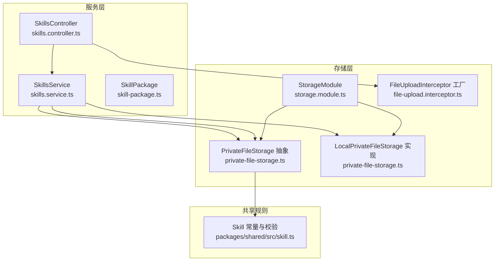
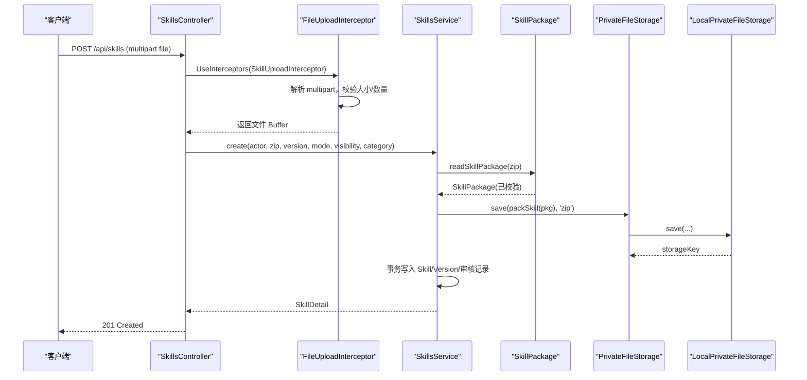
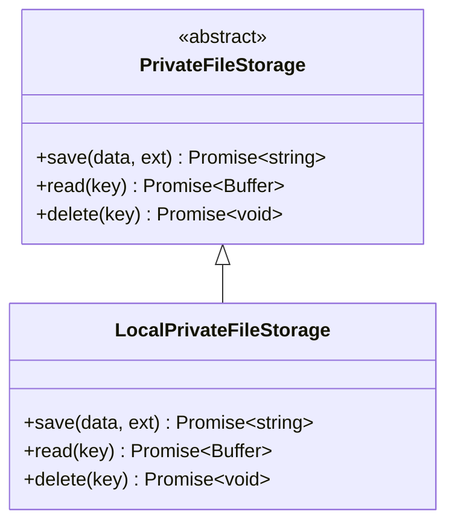
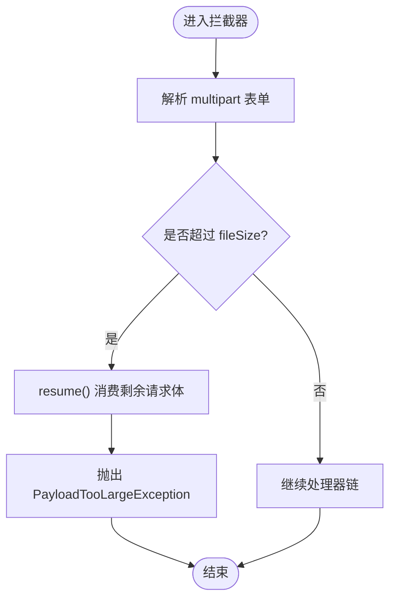
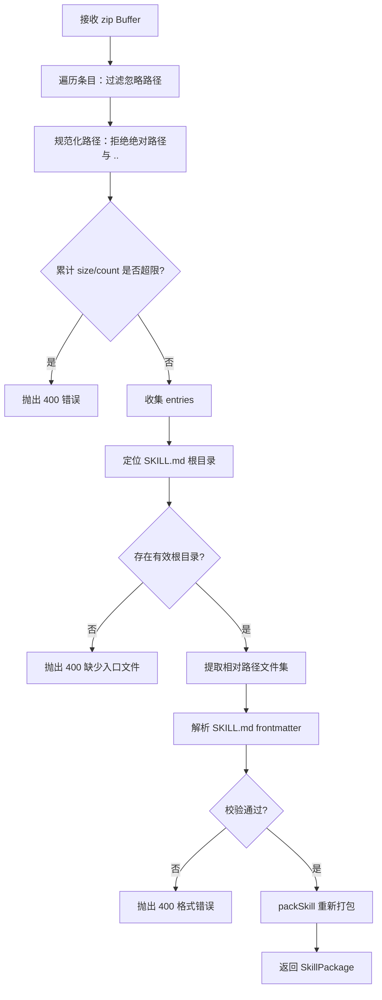
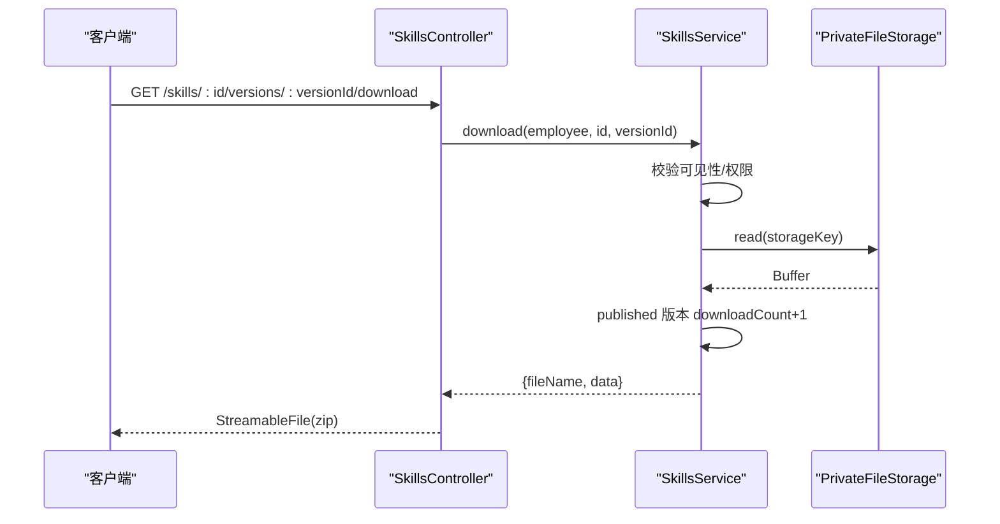
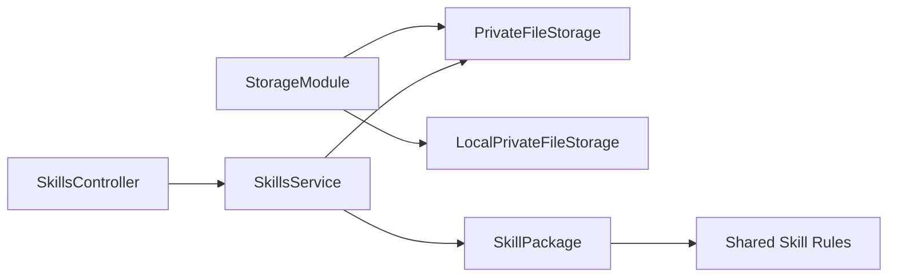

# 文件存储系统

<cite>
**本文引用的文件**   
- [private-file-storage.ts](file://apps/server/src/storage/private-file-storage.ts)
- [file-upload.interceptor.ts](file://apps/server/src/storage/file-upload.interceptor.ts)
- [storage.module.ts](file://apps/server/src/storage/storage.module.ts)
- [skill-upload.ts](file://apps/server/src/skills/skill-upload.ts)
- [skills.controller.ts](file://apps/server/src/skills/skills.controller.ts)
- [skills.service.ts](file://apps/server/src/skills/skills.service.ts)
- [skill-package.ts](file://apps/server/src/skills/skill-package.ts)
- [skill.ts](file://packages/shared/src/skill.ts)
- [README.md](file://README.md)
- [docker-compose.yml](file://docker-compose.yml)
- [setup-env.ts](file://apps/server/test/setup-env.ts)
</cite>

## 目录
1. [引言](#引言)
2. [项目结构](#项目结构)
3. [核心组件](#核心组件)
4. [架构总览](#架构总览)
5. [详细组件分析](#详细组件分析)
6. [依赖关系分析](#依赖关系分析)
7. [性能与可扩展性](#性能与可扩展性)
8. [配置与环境变量](#配置与环境变量)
9. [使用示例](#使用示例)
10. [故障排查](#故障排查)
11. [结论](#结论)

## 引言
本技术文档聚焦于“文件存储系统”，重点说明私有文件存储抽象层的设计模式、实现原理，以及 Skill 包上传拦截器的安全策略。文档还覆盖访问权限控制、后端实现与扩展点、生命周期管理、清理策略、配置项与环境变量，并给出上传下载的使用示例和性能优化建议。

该系统采用“接口抽象 + 本地磁盘实现”的解耦设计：业务代码通过 `PrivateFileStorage` 抽象进行读写，默认由 `LocalPrivateFileStorage` 落盘到独立私有目录；所有文件不通过静态路由公开，仅经鉴权接口流出，从而降低直接暴露风险。

## 项目结构
文件存储相关代码主要位于服务端 NestJS 应用的 `apps/server/src/storage` 与 `apps/server/src/skills` 两个模块中，共享常量与校验逻辑位于 `packages/shared/src/skill.ts`。

图表来源
- [skills.controller.ts:1-145](file://apps/server/src/skills/skills.controller.ts#L1-L145)
- [skills.service.ts:1-500](file://apps/server/src/skills/skills.service.ts#L1-L500)
- [skill-package.ts:1-74](file://apps/server/src/skills/skill-package.ts#L1-L74)
- [storage.module.ts:1-5](file://apps/server/src/storage/storage.module.ts#L1-L5)
- [private-file-storage.ts:1-41](file://apps/server/src/storage/private-file-storage.ts#L1-L41)
- [file-upload.interceptor.ts:1-28](file://apps/server/src/storage/file-upload.interceptor.ts#L1-L28)
- [skill.ts:1-401](file://packages/shared/src/skill.ts#L1-L401)

章节来源
- [skills.controller.ts:1-145](file://apps/server/src/skills/skills.controller.ts#L1-L145)
- [storage.module.ts:1-5](file://apps/server/src/storage/storage.module.ts#L1-L5)
- [private-file-storage.ts:1-41](file://apps/server/src/storage/private-file-storage.ts#L1-L41)
- [file-upload.interceptor.ts:1-28](file://apps/server/src/storage/file-upload.interceptor.ts#L1-L28)
- [skill.ts:1-401](file://packages/shared/src/skill.ts#L1-L401)

## 核心组件
- 私有文件存储抽象层
  - 定义统一的保存、读取、删除接口，屏蔽底层实现差异，便于未来替换为对象存储（如 OSS）。
- 本地磁盘实现
  - 以随机 UUID 命名文件，写入独立私有目录；读取/删除时强制取文件名，防止路径穿越。
- 文件上传拦截器
  - 基于 Multer 的单文件拦截器，限制请求体大小与文件数量，并在超限时正确消费剩余请求体，避免客户端连接异常。
- Skill 包处理
  - 解压、校验、规范化路径、限制文件大小与数量、检查入口文件与非法路径，再重新打包为规范目录结构后落盘。
- 控制器与服务
  - 控制器负责鉴权、参数绑定与响应封装；服务负责业务编排、事务、可见性、版本管理与存储协调。

章节来源
- [private-file-storage.ts:1-41](file://apps/server/src/storage/private-file-storage.ts#L1-L41)
- [file-upload.interceptor.ts:1-28](file://apps/server/src/storage/file-upload.interceptor.ts#L1-L28)
- [skill-package.ts:1-74](file://apps/server/src/skills/skill-package.ts#L1-L74)
- [skills.controller.ts:1-145](file://apps/server/src/skills/skills.controller.ts#L1-L145)
- [skills.service.ts:1-500](file://apps/server/src/skills/skills.service.ts#L1-L500)

## 架构总览
下图展示从 HTTP 请求到文件落盘的完整调用链，体现“拦截器 → 控制器 → 服务 → 存储抽象 → 本地实现”的分层。

图表来源
- [skills.controller.ts:47-57](file://apps/server/src/skills/skills.controller.ts#L47-L57)
- [skill-upload.ts:1-13](file://apps/server/src/skills/skill-upload.ts#L1-L13)
- [file-upload.interceptor.ts:1-28](file://apps/server/src/storage/file-upload.interceptor.ts#L1-L28)
- [skills.service.ts:224-253](file://apps/server/src/skills/skills.service.ts#L224-L253)
- [skill-package.ts:19-57](file://apps/server/src/skills/skill-package.ts#L19-L57)
- [private-file-storage.ts:24-30](file://apps/server/src/storage/private-file-storage.ts#L24-L30)

## 详细组件分析

### 私有文件存储抽象层与本地实现
- 设计要点
  - 抽象类 `PrivateFileStorage` 定义 `save/read/delete` 三个方法，调用方无需关心具体存储介质。
  - 默认实现 `LocalPrivateFileStorage` 使用 Node.js 文件系统 API，将文件写入独立私有目录。
  - 读取/删除时使用 `basename` 过滤路径，防止恶意 key 导致路径穿越。
  - 目录可通过环境变量 `PRIVATE_UPLOAD_DIR` 覆盖，便于容器化部署挂载独立数据卷。
- 复杂度与安全
  - 保存：O(1) 生成随机 key，I/O 写盘；读取/删除：O(1) 文件操作。
  - 安全性：随机文件名 + 白名单式 basename 过滤，避免任意路径读取。
- 可观测性与运维
  - 私有目录与公开上传目录分离，便于备份、迁移与容量治理。

图表来源
- [private-file-storage.ts:10-40](file://apps/server/src/storage/private-file-storage.ts#L10-L40)

章节来源
- [private-file-storage.ts:1-41](file://apps/server/src/storage/private-file-storage.ts#L1-L41)

### 文件上传拦截器与安全检查
- 功能
  - 使用 `FileInterceptor('file', ...)` 解析单文件字段 `file`。
  - 限制 `fileSize` 与 `files=1`，超过上限抛出 `PayloadTooLargeException`。
  - 捕获超限异常后主动 `resume()` 请求流，避免客户端连接被重置。
- 与 Skill 上传的结合
  - `SkillUploadInterceptor` 在基础限制上增加额外余量，用于提前拦截明显超大的压缩包。
  - 实际包内容的大小与文件数限制由 `SkillPackage` 在解压阶段校验。

图表来源
- [file-upload.interceptor.ts:6-27](file://apps/server/src/storage/file-upload.interceptor.ts#L6-L27)
- [skill-upload.ts:5-6](file://apps/server/src/skills/skill-upload.ts#L5-L6)

章节来源
- [file-upload.interceptor.ts:1-28](file://apps/server/src/storage/file-upload.interceptor.ts#L1-L28)
- [skill-upload.ts:1-13](file://apps/server/src/skills/skill-upload.ts#L1-L13)

### Skill 包解析与校验流程
- 关键步骤
  - 使用 fflate 解压，过滤忽略的文件/目录，按声明大小累计总量与文件数，超出即拒绝。
  - 规范化路径，拒绝绝对路径与包含 `..` 的路径，防止 Zip Slip 攻击。
  - 校验入口文件 `SKILL.md` 必须位于根目录或唯一顶层文件夹。
  - 解析 frontmatter，校验 name/description 格式与长度。
  - 最终按规范目录 `<name>/...` 重新打包，供存储层持久化。
- 安全与健壮性
  - 防 Zip Bomb：按声明大小截断输出，即使元数据造假也不会解压出超量数据。
  - 防路径穿越：统一规范化路径并拒绝非法段。
  - 容错：非 zip 或损坏包会返回明确的中文错误提示。

图表来源
- [skill-package.ts:19-63](file://apps/server/src/skills/skill-package.ts#L19-L63)
- [skill.ts:3-21](file://packages/shared/src/skill.ts#L3-L21)
- [skill.ts:34-48](file://packages/shared/src/skill.ts#L34-L48)
- [skill.ts:52-71](file://packages/shared/src/skill.ts#L52-L71)

章节来源
- [skill-package.ts:1-74](file://apps/server/src/skills/skill-package.ts#L1-L74)
- [skill.ts:1-401](file://packages/shared/src/skill.ts#L1-L401)

### 控制器与服务中的权限与生命周期
- 权限控制
  - 控制器使用租户成员/管理员装饰器保护上传与修改接口。
  - 服务层对“所有者/租户管理员/超管”等角色进行细粒度校验，例如新版本上传、可见性修改、分类修改、删除等。
- 生命周期管理
  - 新建 Skill：先落盘再写库，写库失败回滚删除已落盘文件，保证一致性。
  - 更新版本：并发串行化（行级锁），确保同一 Skill 同时最多一个非正式版本。
  - 删除版本/Skill：先删数据库记录，再清理对应 storageKey；若删除后无版本则级联删除 Skill。
  - 下载次数统计：仅对正式版本成功读取后计数。
- 临时访问令牌与权限验证
  - 当前实现未引入临时访问令牌；文件访问通过业务接口鉴权后直接返回流，避免直链泄露。
  - 审阅下载接口同样基于身份授权，不计入下载次数。

图表来源
- [skills.controller.ts:135-143](file://apps/server/src/skills/skills.controller.ts#L135-L143)
- [skills.service.ts:430-438](file://apps/server/src/skills/skills.service.ts#L430-L438)
- [private-file-storage.ts:33-35](file://apps/server/src/storage/private-file-storage.ts#L33-L35)

章节来源
- [skills.controller.ts:1-145](file://apps/server/src/skills/skills.controller.ts#L1-L145)
- [skills.service.ts:1-500](file://apps/server/src/skills/skills.service.ts#L1-L500)

## 依赖关系分析
- 模块装配
  - `StorageModule` 将 `PrivateFileStorage` 绑定为 `LocalPrivateFileStorage`，并向外导出抽象类型，供其他模块注入。
- 依赖方向
  - Skills 模块依赖 Storage 抽象；Skill 包解析依赖共享常量与校验函数。
  - 测试环境通过 `setup-env.ts` 设置临时上传目录，隔离 e2e 测试数据。

图表来源
- [storage.module.ts:1-5](file://apps/server/src/storage/storage.module.ts#L1-L5)
- [skills.controller.ts:1-145](file://apps/server/src/skills/skills.controller.ts#L1-L145)
- [skills.service.ts:1-500](file://apps/server/src/skills/skills.service.ts#L1-L500)
- [skill-package.ts:1-74](file://apps/server/src/skills/skill-package.ts#L1-L74)
- [skill.ts:1-401](file://packages/shared/src/skill.ts#L1-L401)

章节来源
- [storage.module.ts:1-5](file://apps/server/src/storage/storage.module.ts#L1-L5)
- [setup-env.ts:6-7](file://apps/server/test/setup-env.ts#L6-L7)

## 性能与可扩展性
- 性能特性
  - 上传拦截器在内存中解析单文件，适合中小体积 Skill 包；大文件场景建议结合分片上传与流式处理。
  - Skill 包解压与校验在内存中进行，需关注峰值内存占用；f late 的截断机制有助于防御 Zip Bomb。
  - 本地磁盘 I/O 为顺序写/读，适合单机部署；高并发下可考虑异步队列与缓存热点包。
- 可扩展性
  - 通过 `PrivateFileStorage` 抽象，可无缝替换为对象存储（如阿里云 OSS、AWS S3），只需新增实现类并注册 DI。
  - 目录与密钥命名策略（UUID）天然支持分布式去重与扩容。
  - 可在存储服务层加入压缩、加密、CDN 加速、冷热分层等能力。

[本节为通用指导，不直接分析具体文件]

## 配置与环境变量
- 私有上传目录
  - 环境变量 `PRIVATE_UPLOAD_DIR` 决定私有文件存储根目录；未设置时默认为 `uploads-private`。
  - 生产环境建议在 compose 中挂载独立数据卷，便于备份与迁移。
- 测试环境
  - e2e 测试通过 `setup-env.ts` 将 `UPLOAD_DIR` 与 `PRIVATE_UPLOAD_DIR` 指向临时目录，避免污染宿主环境。
- 容器化
  - docker-compose 中显式设置 `PRIVATE_UPLOAD_DIR`，确保容器内路径一致。

章节来源
- [private-file-storage.ts:20-21](file://apps/server/src/storage/private-file-storage.ts#L20-L21)
- [README.md:52-52](file://README.md#L52-L52)
- [setup-env.ts:6-7](file://apps/server/test/setup-env.ts#L6-L7)
- [docker-compose.yml:23-23](file://docker-compose.yml#L23-L23)

## 使用示例
- 上传 Skill 包
  - 前端构造 FormData，字段 `file` 为 zip，附带 `version`、`mode`、可选 `visibility` 与 `categoryId`。
  - 服务端控制器使用 `SkillUploadInterceptor` 拦截，校验通过后交由服务处理。
- 下载 Skill 包
  - 调用 `/skills/:id/versions/:versionId/download`，服务端鉴权后返回 zip 流；正式版本下载次数 +1。
- 替换草稿包
  - PUT `/skills/:id/versions/:versionId/package`，仅允许草稿状态且具备权限的用户替换包内容，随后删除旧包。

章节来源
- [skills.controller.ts:47-57](file://apps/server/src/skills/skills.controller.ts#L47-L57)
- [skills.controller.ts:94-105](file://apps/server/src/skills/skills.controller.ts#L94-L105)
- [skills.controller.ts:135-143](file://apps/server/src/skills/skills.controller.ts#L135-L143)
- [skills.service.ts:330-354](file://apps/server/src/skills/skills.service.ts#L330-L354)
- [skills.service.ts:430-438](file://apps/server/src/skills/skills.service.ts#L430-L438)

## 故障排查
- 上传失败常见原因
  - 未选择文件：返回 400，提示请选择要上传的 Skill 文件夹。
  - 不是 zip 或损坏：返回 400，提示无法解析压缩包。
  - 包内缺少 `SKILL.md`：返回 400，提示缺少入口文件。
  - 包内包含非法路径：返回 400，提示压缩包中包含非法路径。
  - 文件数或解压后大小超限：返回 400，提示相应限制。
  - 压缩包本身过大：返回 413，提示超过最大体积。
- 权限问题
  - 非所有者或非管理员尝试上传新版本：返回 403。
  - 普通员工尝试直接发布：返回 403，应提交审核。
- 存储一致性
  - 写库失败时会回滚删除已落盘文件，避免孤儿文件。
  - 删除 Skill 或版本后会清理对应 storageKey。

章节来源
- [skill-upload.ts:8-12](file://apps/server/src/skills/skill-upload.ts#L8-L12)
- [skill-package.ts:37-57](file://apps/server/src/skills/skill-package.ts#L37-L57)
- [skills.service.ts:459-468](file://apps/server/src/skills/skills.service.ts#L459-L468)
- [skills.service.ts:374-428](file://apps/server/src/skills/skills.service.ts#L374-L428)

## 结论
该文件存储系统通过抽象层与本地实现的解耦，提供了安全、可控、可扩展的私有文件管理能力。上传拦截器与 Skill 包校验共同构成多层安全防线，配合严格的权限控制与事务一致性保障，确保文件从上传、存储到下载的完整链路可靠运行。未来可通过替换存储实现接入对象存储，并结合 CDN、缓存与异步任务进一步提升性能与可用性。