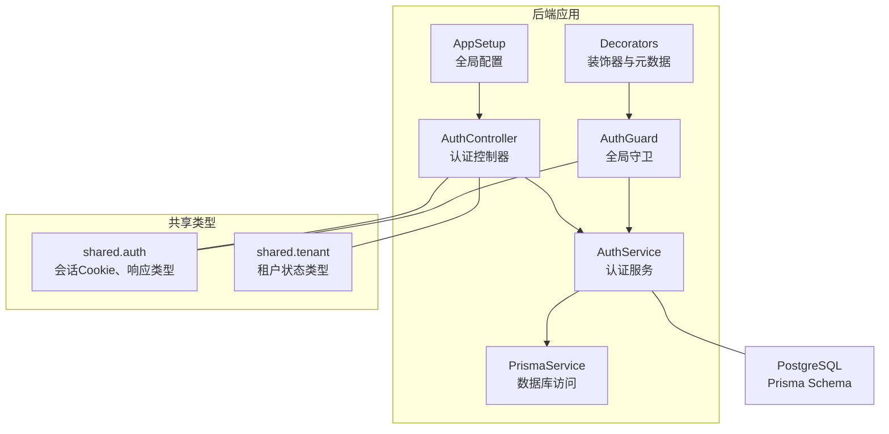
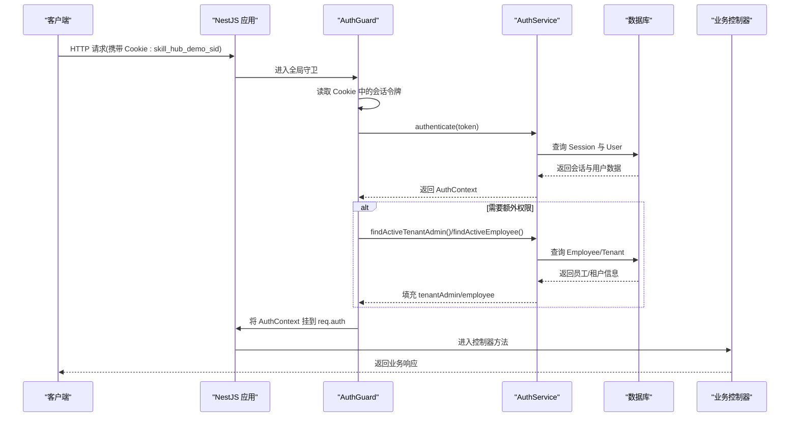
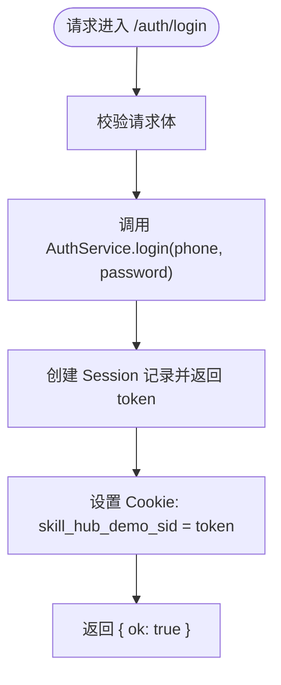
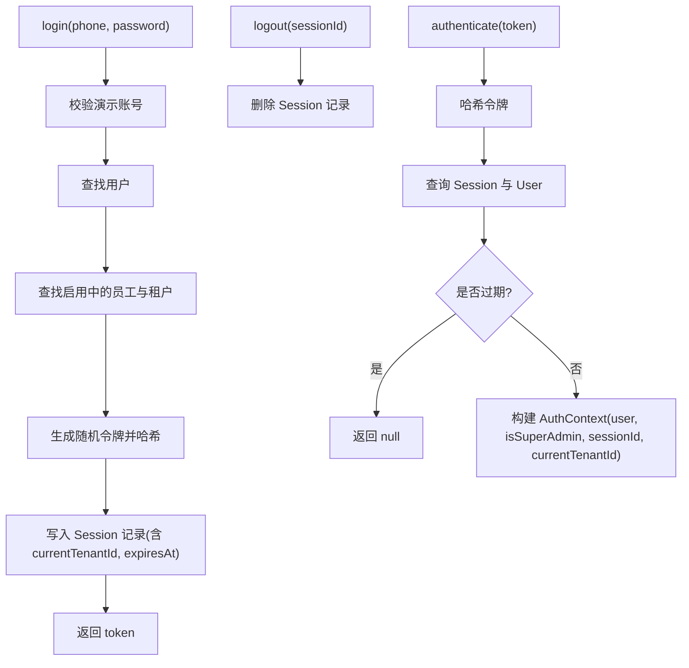
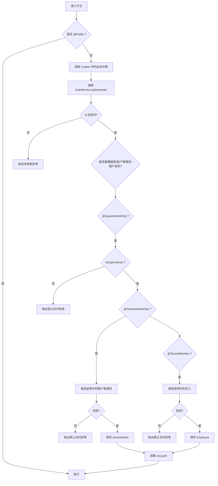
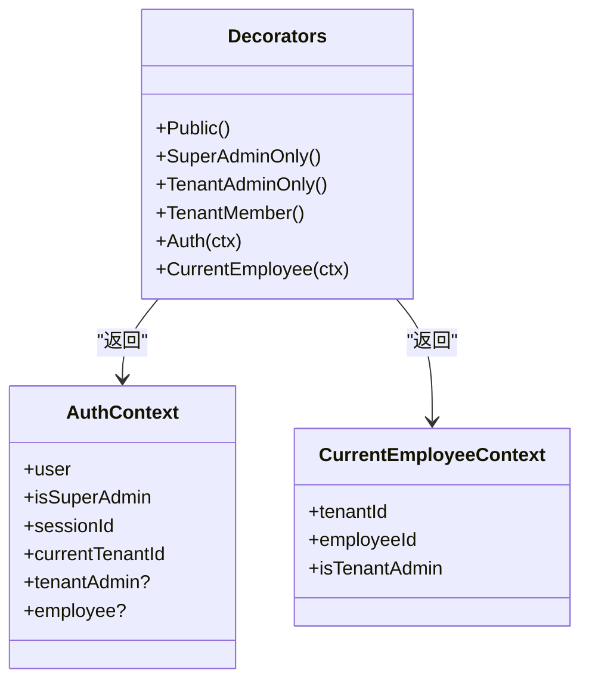
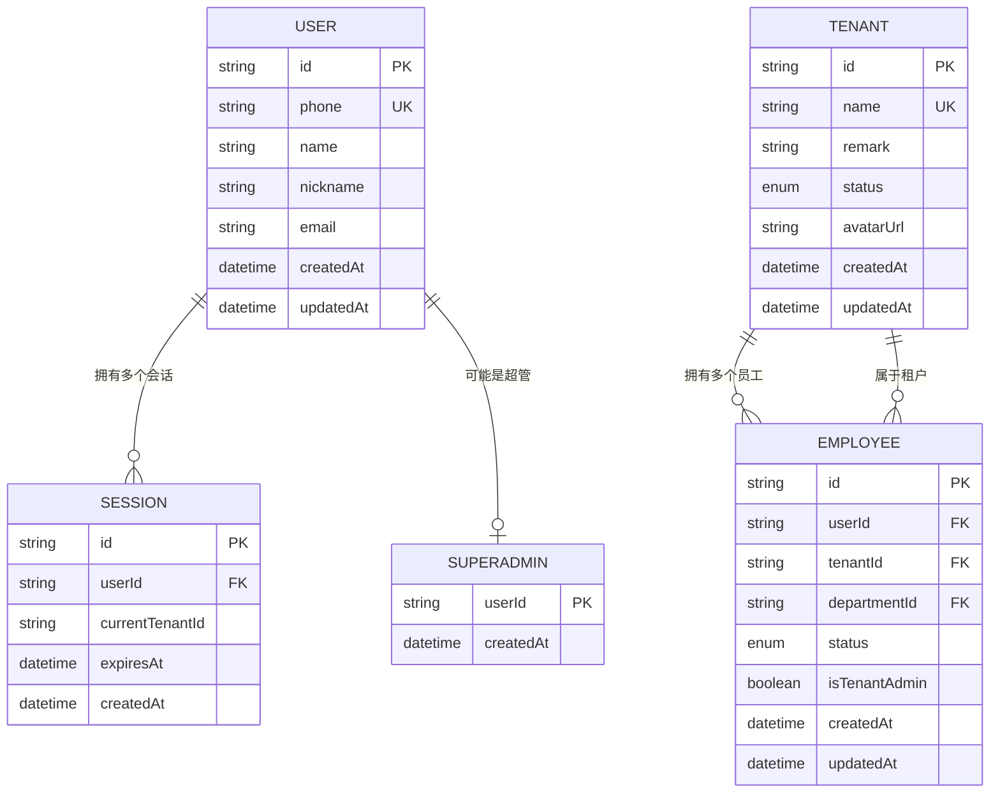
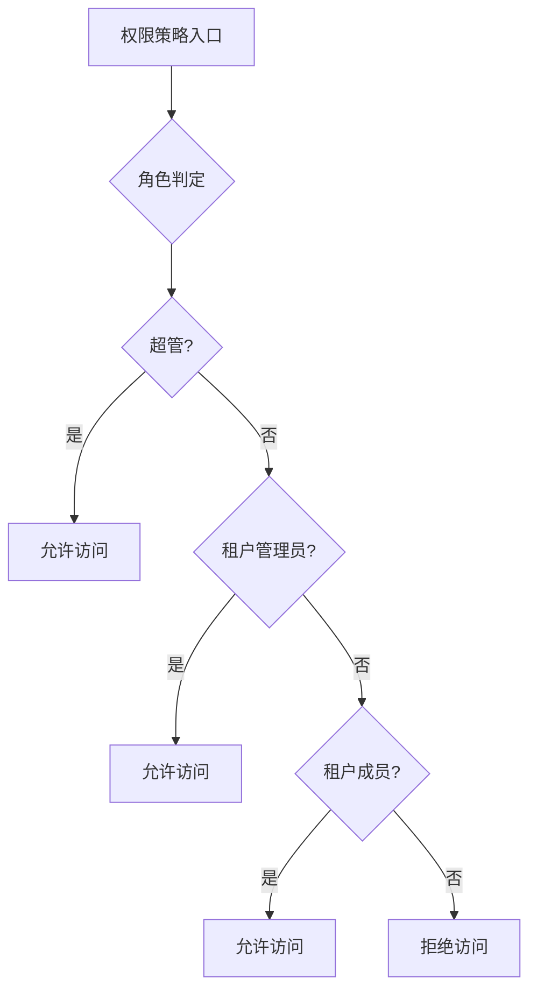
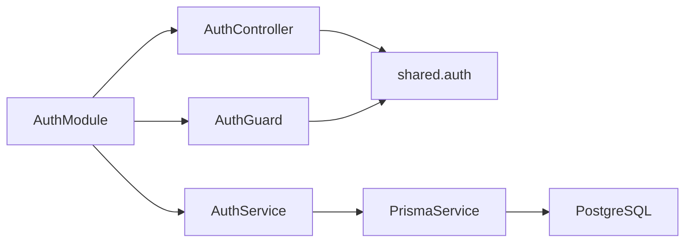

# 认证授权系统

<cite>
**本文引用的文件**   
- [apps/server/src/auth/auth.controller.ts](file://apps/server/src/auth/auth.controller.ts)
- [apps/server/src/auth/auth.service.ts](file://apps/server/src/auth/auth.service.ts)
- [apps/server/src/auth/auth.guard.ts](file://apps/server/src/auth/auth.guard.ts)
- [apps/server/src/auth/decorators.ts](file://apps/server/src/auth/decorators.ts)
- [apps/server/src/auth/session.ts](file://apps/server/src/auth/session.ts)
- [apps/server/src/auth/auth.module.ts](file://apps/server/src/auth/auth.module.ts)
- [apps/server/src/app.setup.ts](file://apps/server/src/app.setup.ts)
- [apps/server/src/seed/demo.ts](file://apps/server/src/seed/demo.ts)
- [packages/shared/src/auth.ts](file://packages/shared/src/auth.ts)
- [packages/shared/src/tenant.ts](file://packages/shared/src/tenant.ts)
- [apps/server/prisma/schema.prisma](file://apps/server/prisma/schema.prisma)
</cite>

## 目录
1. [简介](#简介)
2. [项目结构](#项目结构)
3. [核心组件](#核心组件)
4. [架构总览](#架构总览)
5. [详细组件分析](#详细组件分析)
6. [依赖关系分析](#依赖关系分析)
7. [性能与可扩展性](#性能与可扩展性)
8. [故障排查指南](#故障排查指南)
9. [结论](#结论)
10. [附录：API 使用示例与错误处理](#附录api-使用示例与错误处理)

## 简介
本技术文档围绕项目的认证与授权子系统展开，重点说明以下方面：
- 基于会话的认证机制：登录、登出、会话校验与会话上下文注入。
- 多租户权限模型：角色（超管、租户管理员、普通员工）、权限分配与访问控制策略。
- 自定义装饰器：@CurrentUser、@TenantId 的实现原理与用法（结合当前实现给出等价方案）。
- 守卫机制：如何保护路由端点，以及不同角色的访问控制流程。
- 用户认证流程、密码存储与安全建议。
- 权限检查的业务规则与安全注意事项。
- 认证相关 API 的使用示例与错误处理方案。

本项目采用 NestJS 框架，认证模块通过全局守卫统一拦截请求，结合 Cookie 中的会话标识进行鉴权；权限控制通过元数据装饰器驱动，支持“公开接口”“仅超管”“仅租户管理员”“仅租户成员”等策略。

## 项目结构
认证授权相关代码主要位于后端应用的 auth 模块，并与共享类型包 shared 协同工作。数据库模型由 Prisma 管理，包含用户、会话、租户、员工等实体。

图表来源
- [apps/server/src/auth/auth.controller.ts:1-26](file://apps/server/src/auth/auth.controller.ts#L1-L26)
- [apps/server/src/auth/auth.service.ts:1-77](file://apps/server/src/auth/auth.service.ts#L1-L77)
- [apps/server/src/auth/auth.guard.ts:1-49](file://apps/server/src/auth/auth.guard.ts#L1-L49)
- [apps/server/src/auth/decorators.ts:1-18](file://apps/server/src/auth/decorators.ts#L1-L18)
- [apps/server/src/app.setup.ts:1-26](file://apps/server/src/app.setup.ts#L1-L26)
- [packages/shared/src/auth.ts:1-39](file://packages/shared/src/auth.ts#L1-L39)
- [packages/shared/src/tenant.ts:1-3](file://packages/shared/src/tenant.ts#L1-L3)
- [apps/server/prisma/schema.prisma:12-41](file://apps/server/prisma/schema.prisma#L12-L41)

章节来源
- [apps/server/src/auth/auth.controller.ts:1-26](file://apps/server/src/auth/auth.controller.ts#L1-L26)
- [apps/server/src/auth/auth.service.ts:1-77](file://apps/server/src/auth/auth.service.ts#L1-L77)
- [apps/server/src/auth/auth.guard.ts:1-49](file://apps/server/src/auth/auth.guard.ts#L1-L49)
- [apps/server/src/auth/decorators.ts:1-18](file://apps/server/src/auth/decorators.ts#L1-L18)
- [apps/server/src/auth/session.ts:1-30](file://apps/server/src/auth/session.ts#L1-L30)
- [apps/server/src/auth/auth.module.ts:1-13](file://apps/server/src/auth/auth.module.ts#L1-L13)
- [apps/server/src/app.setup.ts:1-26](file://apps/server/src/app.setup.ts#L1-L26)
- [packages/shared/src/auth.ts:1-39](file://packages/shared/src/auth.ts#L1-L39)
- [packages/shared/src/tenant.ts:1-3](file://packages/shared/src/tenant.ts#L1-L3)
- [apps/server/prisma/schema.prisma:12-41](file://apps/server/prisma/schema.prisma#L12-L41)

## 核心组件
- 认证控制器：提供登录、登出、获取当前用户信息接口，负责设置和清理会话 Cookie。
- 认证服务：封装登录、登出、会话验证、当前租户下的员工/管理员查询、当前用户信息组装等业务逻辑。
- 全局守卫：默认要求登录，根据装饰器元数据执行超管、租户管理员、租户成员的权限校验，并将认证上下文挂载到请求对象。
- 装饰器：定义公开接口、超管、租户管理员、租户成员等元数据，并提供从请求中读取认证上下文的参数装饰器。
- 会话类型：定义认证上下文结构与当前员工上下文结构，扩展 Express Request 类型。
- 模块注册：将 AuthGuard 作为全局守卫注入，导出 AuthService。
- 应用配置：启用 cookie-parser、全局校验管道、统一前缀等。
- 共享类型：定义会话 Cookie 名称、登录请求/响应、当前用户、员工档案、租户状态等类型。
- 数据库模型：User、Session、SuperAdmin、Tenant、Department、Employee 等实体及关系。

章节来源
- [apps/server/src/auth/auth.controller.ts:1-26](file://apps/server/src/auth/auth.controller.ts#L1-L26)
- [apps/server/src/auth/auth.service.ts:1-77](file://apps/server/src/auth/auth.service.ts#L1-L77)
- [apps/server/src/auth/auth.guard.ts:1-49](file://apps/server/src/auth/auth.guard.ts#L1-L49)
- [apps/server/src/auth/decorators.ts:1-18](file://apps/server/src/auth/decorators.ts#L1-L18)
- [apps/server/src/auth/session.ts:1-30](file://apps/server/src/auth/session.ts#L1-L30)
- [apps/server/src/auth/auth.module.ts:1-13](file://apps/server/src/auth/auth.module.ts#L1-L13)
- [apps/server/src/app.setup.ts:1-26](file://apps/server/src/app.setup.ts#L1-L26)
- [packages/shared/src/auth.ts:1-39](file://packages/shared/src/auth.ts#L1-L39)
- [packages/shared/src/tenant.ts:1-3](file://packages/shared/src/tenant.ts#L1-L3)
- [apps/server/prisma/schema.prisma:12-41](file://apps/server/prisma/schema.prisma#L12-L41)

## 架构总览
下图展示了认证授权的端到端流程：客户端发起请求，全局守卫解析 Cookie 中的会话令牌，调用认证服务验证会话并填充权限上下文，随后进入业务控制器。

图表来源
- [apps/server/src/auth/auth.guard.ts:20-46](file://apps/server/src/auth/auth.guard.ts#L20-L46)
- [apps/server/src/auth/auth.service.ts:30-49](file://apps/server/src/auth/auth.service.ts#L30-L49)
- [apps/server/src/auth/auth.controller.ts:12-24](file://apps/server/src/auth/auth.controller.ts#L12-L24)
- [apps/server/prisma/schema.prisma:32-41](file://apps/server/prisma/schema.prisma#L32-L41)

## 详细组件分析

### 认证控制器（登录、登出、当前用户）
- 登录：接收手机号与密码，调用认证服务生成会话令牌，写入 Cookie，返回成功标志。
- 登出：从认证上下文取出 sessionId，删除对应会话记录，清除 Cookie。
- 当前用户：返回当前用户信息与所属租户档案列表，以及当前会话的租户上下文。

图表来源
- [apps/server/src/auth/auth.controller.ts:12-16](file://apps/server/src/auth/auth.controller.ts#L12-L16)
- [apps/server/src/auth/auth.service.ts:15-24](file://apps/server/src/auth/auth.service.ts#L15-L24)
- [packages/shared/src/auth.ts:1-3](file://packages/shared/src/auth.ts#L1-L3)

章节来源
- [apps/server/src/auth/auth.controller.ts:1-26](file://apps/server/src/auth/auth.controller.ts#L1-L26)

### 认证服务（会话与权限查询）
- 登录流程：
  - 校验演示账号（开发环境），若不存在则抛出未授权异常。
  - 查找用户与员工档案，确保租户启用且员工启用。
  - 生成随机令牌，哈希后存入 Session 表，设置过期时间。
- 登出流程：按 sessionId 删除会话记录。
- 会话验证：根据令牌哈希查询 Session，校验是否过期，加载用户与超管标记，构造 AuthContext。
- 权限查询：
  - findActiveEmployee：在当前租户下查找启用的员工档案。
  - findActiveTenantAdmin：在当前租户下查找启用的租户管理员档案。
- 当前用户信息：聚合用户基本信息与所有租户档案，返回 currentTenantId。

图表来源
- [apps/server/src/auth/auth.service.ts:15-35](file://apps/server/src/auth/auth.service.ts#L15-L35)
- [apps/server/src/auth/auth.service.ts:51-74](file://apps/server/src/auth/auth.service.ts#L51-L74)
- [apps/server/prisma/schema.prisma:32-41](file://apps/server/prisma/schema.prisma#L32-L41)

章节来源
- [apps/server/src/auth/auth.service.ts:1-77](file://apps/server/src/auth/auth.service.ts#L1-L77)

### 全局守卫（权限校验与上下文注入）
- 默认策略：所有接口需登录，除非被 @Public 标记为公开。
- 令牌解析：从 Cookie 中读取会话令牌，调用 AuthService.authenticate 验证。
- 角色校验：
  - @SuperAdminOnly：仅允许超管访问。
  - @TenantAdminOnly：必须选择当前租户，且当前租户下存在启用的租户管理员。
  - @TenantMember：必须选择当前租户，且当前租户下存在启用的员工。
- 上下文注入：将 AuthContext 挂载到 req.auth，并在满足条件时填充 tenantAdmin 或 employee。

图表来源
- [apps/server/src/auth/auth.guard.ts:20-46](file://apps/server/src/auth/auth.guard.ts#L20-L46)
- [apps/server/src/auth/auth.service.ts:37-49](file://apps/server/src/auth/auth.service.ts#L37-L49)
- [apps/server/src/auth/decorators.ts:4-11](file://apps/server/src/auth/decorators.ts#L4-L11)

章节来源
- [apps/server/src/auth/auth.guard.ts:1-49](file://apps/server/src/auth/auth.guard.ts#L1-L49)
- [apps/server/src/auth/decorators.ts:1-18](file://apps/server/src/auth/decorators.ts#L1-L18)

### 装饰器与参数注入
- 元数据装饰器：
  - @Public：标记公开接口。
  - @SuperAdminOnly：仅超管可访问。
  - @TenantAdminOnly：仅当前租户的管理员可访问。
  - @TenantMember：仅当前租户的成员可访问。
- 参数装饰器：
  - @Auth：从 req.auth 读取认证上下文。
  - @CurrentEmployee：从 req.auth.employee 读取当前员工上下文。

注意：仓库中未直接暴露名为 @CurrentUser 或 @TenantId 的装饰器。当前实现提供了等价能力：
- 使用 @Auth 获取完整认证上下文，其中包含 user、isSuperAdmin、currentTenantId 等字段。
- 使用 @CurrentEmployee 获取当前租户的员工上下文，其中包含 tenantId、employeeId、isTenantAdmin。

图表来源
- [apps/server/src/auth/decorators.ts:1-18](file://apps/server/src/auth/decorators.ts#L1-L18)
- [apps/server/src/auth/session.ts:5-23](file://apps/server/src/auth/session.ts#L5-L23)

章节来源
- [apps/server/src/auth/decorators.ts:1-18](file://apps/server/src/auth/decorators.ts#L1-L18)
- [apps/server/src/auth/session.ts:1-30](file://apps/server/src/auth/session.ts#L1-L30)

### 会话管理与令牌生命周期
- 令牌生成：使用随机字节生成 base64url 字符串，哈希后作为 Session.id 持久化。
- 会话存储：Session 表包含 userId、currentTenantId、expiresAt 等字段。
- 会话校验：每次请求通过 Cookie 中的原始令牌计算哈希，查询 Session 并判断是否过期。
- 会话过期：超过 expiresAt 视为无效，守卫拒绝访问。
- 会话清理：登出时删除对应 Session 记录。

图表来源
- [apps/server/prisma/schema.prisma:12-41](file://apps/server/prisma/schema.prisma#L12-L41)
- [apps/server/prisma/schema.prisma:48-102](file://apps/server/prisma/schema.prisma#L48-L102)

章节来源
- [apps/server/src/auth/auth.service.ts:15-35](file://apps/server/src/auth/auth.service.ts#L15-L35)
- [apps/server/prisma/schema.prisma:32-41](file://apps/server/prisma/schema.prisma#L32-L41)

### 多租户权限控制模型
- 角色定义：
  - 超管：在 SuperAdmin 表中有记录的用户。
  - 租户管理员：Employee.isTenantAdmin 为真且在当前租户下启用。
  - 普通员工：Employee.status 为 active 且在当前租户下启用。
- 权限分配：
  - 通过 Employee 表关联用户与租户，并标记是否为租户管理员。
  - 通过 Tenant.status 控制租户是否可用。
- 访问控制策略：
  - @SuperAdminOnly：仅超管可访问。
  - @TenantAdminOnly：必须选择当前租户，且当前租户下存在启用的租户管理员。
  - @TenantMember：必须选择当前租户，且当前租户下存在启用的员工。

图表来源
- [apps/server/src/auth/auth.guard.ts:29-44](file://apps/server/src/auth/auth.guard.ts#L29-L44)
- [apps/server/src/auth/auth.service.ts:37-49](file://apps/server/src/auth/auth.service.ts#L37-L49)
- [apps/server/prisma/schema.prisma:84-102](file://apps/server/prisma/schema.prisma#L84-L102)

章节来源
- [apps/server/src/auth/auth.guard.ts:1-49](file://apps/server/src/auth/auth.guard.ts#L1-L49)
- [apps/server/src/auth/auth.service.ts:37-49](file://apps/server/src/auth/auth.service.ts#L37-L49)
- [apps/server/prisma/schema.prisma:84-102](file://apps/server/prisma/schema.prisma#L84-L102)

### 用户认证流程、密码加密存储与会话最佳实践
- 当前实现：
  - 登录使用演示账号集合进行比对，未对密码进行哈希存储。
  - 会话令牌为随机值，服务端以哈希形式存储在 Session 表中。
- 安全建议：
  - 生产环境应使用强哈希算法（如 bcrypt）对用户密码进行加密存储，避免明文或弱哈希。
  - 会话令牌应具备足够熵值，并定期轮换；考虑引入刷新令牌机制以提升安全性与用户体验。
  - Cookie 应启用 httpOnly、secure、sameSite 等属性，防止 XSS 与 CSRF 攻击。
  - 会话过期策略应合理设置，避免过长导致安全风险。
  - 对敏感操作增加二次确认或 MFA。

章节来源
- [apps/server/src/auth/auth.service.ts:15-24](file://apps/server/src/auth/auth.service.ts#L15-L24)
- [apps/server/src/auth/auth.controller.ts:8-16](file://apps/server/src/auth/auth.controller.ts#L8-L16)
- [apps/server/src/seed/demo.ts:4-8](file://apps/server/src/seed/demo.ts#L4-L8)

## 依赖关系分析
- 模块依赖：
  - AuthModule 注册 AuthController、AuthService，并将 AuthGuard 作为全局守卫。
- 运行时依赖：
  - AuthController 依赖 AuthService 与共享类型。
  - AuthGuard 依赖 Reflector、AuthService 与共享类型。
  - AuthService 依赖 PrismaService 与数据库模型。
- 外部集成：
  - cookie-parser 用于解析 Cookie。
  - ValidationPipe 用于统一参数校验与错误返回。

图表来源
- [apps/server/src/auth/auth.module.ts:7-12](file://apps/server/src/auth/auth.module.ts#L7-L12)
- [apps/server/src/app.setup.ts:7-24](file://apps/server/src/app.setup.ts#L7-L24)
- [packages/shared/src/auth.ts:1-39](file://packages/shared/src/auth.ts#L1-L39)

章节来源
- [apps/server/src/auth/auth.module.ts:1-13](file://apps/server/src/auth/auth.module.ts#L1-L13)
- [apps/server/src/app.setup.ts:1-26](file://apps/server/src/app.setup.ts#L1-L26)
- [packages/shared/src/auth.ts:1-39](file://packages/shared/src/auth.ts#L1-L39)

## 性能与可扩展性
- 会话查询优化：
  - 为 Session.userId 建立索引，提升按用户查询效率。
  - 考虑对 Session.expiresAt 建立索引以支持批量清理过期会话。
- 缓存策略：
  - 对于频繁访问的租户/员工信息，可在内存缓存中短期缓存，减少数据库压力。
- 令牌刷新：
  - 引入刷新令牌机制，降低主令牌泄露风险，同时提升用户体验。
- 并发与锁：
  - 在高并发场景下，注意会话创建与删除的原子性，避免竞态条件。

[本节为通用指导，不直接分析具体文件]

## 故障排查指南
- 常见错误：
  - “请先登录”：Cookie 缺失或会话已过期。
  - “仅超管可访问”：非超管访问了 @SuperAdminOnly 接口。
  - “仅租户管理员可访问”：未选择当前租户或当前租户下无启用管理员。
  - “仅本租户员工可访问”：未选择当前租户或当前租户下无启用员工。
- 排查步骤：
  - 检查 Cookie 是否正确设置与传递。
  - 检查 Session 是否存在且未过期。
  - 检查 Employee 与 Tenant 的状态是否为启用。
  - 检查装饰器是否正确标注在控制器或方法上。
- 日志与调试：
  - 在服务端打印会话查询结果与权限判定过程，定位问题。
  - 使用统一的错误处理管道输出结构化错误信息。

章节来源
- [apps/server/src/auth/auth.guard.ts:24-44](file://apps/server/src/auth/auth.guard.ts#L24-L44)
- [apps/server/src/app.setup.ts:10-22](file://apps/server/src/app.setup.ts#L10-L22)

## 结论
该认证授权系统通过全局守卫与装饰器实现了灵活的访问控制，结合会话机制完成用户身份认证。多租户模型通过 Employee 与 Tenant 的关系进行权限隔离，支持超管、租户管理员与普通员工的分层权限。当前实现适合演示与快速迭代，生产环境建议增强密码加密、令牌刷新与安全防护措施。

[本节为总结性内容，不直接分析具体文件]

## 附录：API 使用示例与错误处理

### 登录
- 请求：POST /auth/login
- 请求体：{ phone, password }
- 响应：{ ok: true }
- 行为：成功后设置 Cookie skill_hub_demo_sid 为会话令牌。

章节来源
- [apps/server/src/auth/auth.controller.ts:12-16](file://apps/server/src/auth/auth.controller.ts#L12-L16)
- [packages/shared/src/auth.ts:3-4](file://packages/shared/src/auth.ts#L3-L4)

### 登出
- 请求：POST /auth/logout
- 响应：204 No Content
- 行为：删除会话记录并清除 Cookie。

章节来源
- [apps/server/src/auth/auth.controller.ts:18-22](file://apps/server/src/auth/auth.controller.ts#L18-L22)
- [apps/server/src/auth/auth.service.ts:26-28](file://apps/server/src/auth/auth.service.ts#L26-L28)

### 获取当前用户信息
- 请求：GET /auth/me
- 响应：MeResponse
- 行为：返回用户基本信息、租户档案列表与当前租户上下文。

章节来源
- [apps/server/src/auth/auth.controller.ts:23-24](file://apps/server/src/auth/auth.controller.ts#L23-L24)
- [apps/server/src/auth/auth.service.ts:51-74](file://apps/server/src/auth/auth.service.ts#L51-L74)
- [packages/shared/src/auth.ts:27-32](file://packages/shared/src/auth.ts#L27-L32)

### 错误处理
- 未授权：当 Cookie 缺失或会话无效时，返回“请先登录”。
- 禁止访问：当角色不满足时，返回相应禁止访问提示。
- 参数校验：统一通过 ValidationPipe 返回第一条校验错误的消息。

章节来源
- [apps/server/src/auth/auth.guard.ts:24-44](file://apps/server/src/auth/auth.guard.ts#L24-L44)
- [apps/server/src/app.setup.ts:10-22](file://apps/server/src/app.setup.ts#L10-L22)