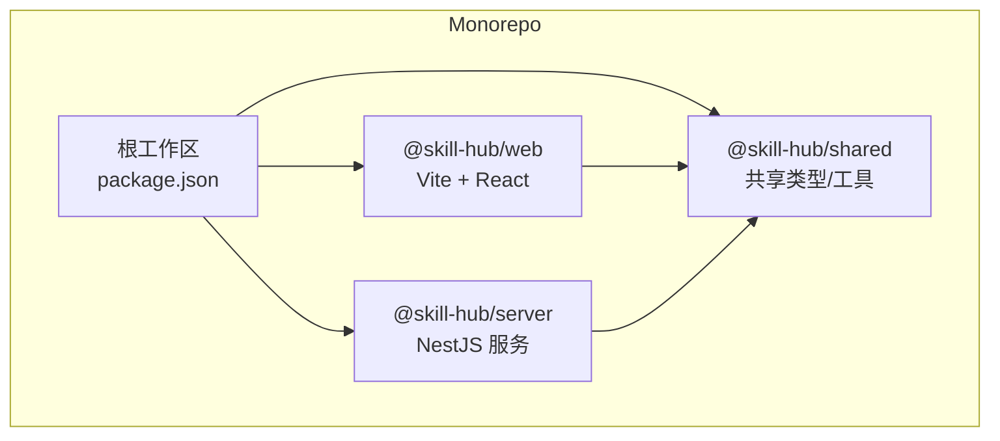
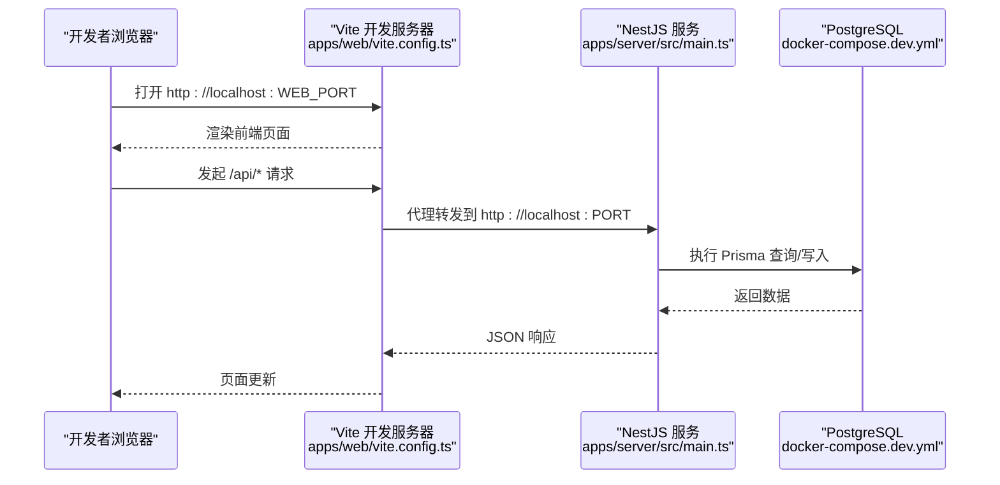
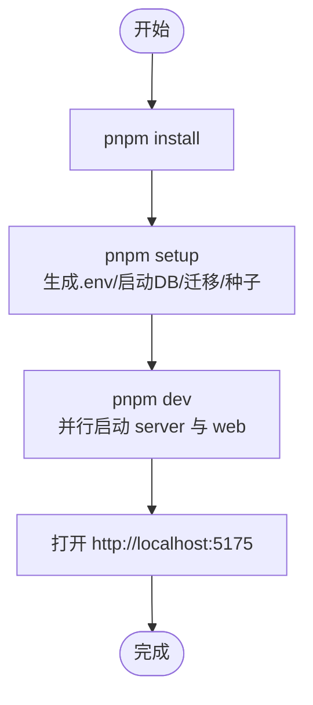
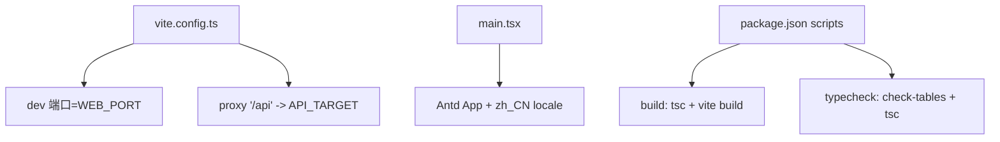
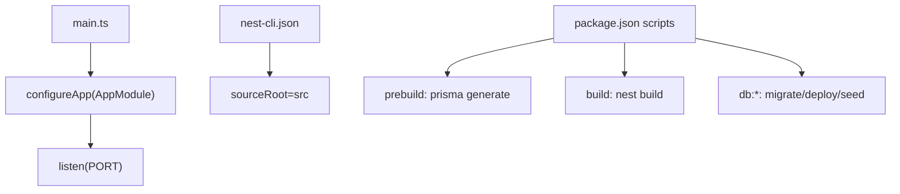
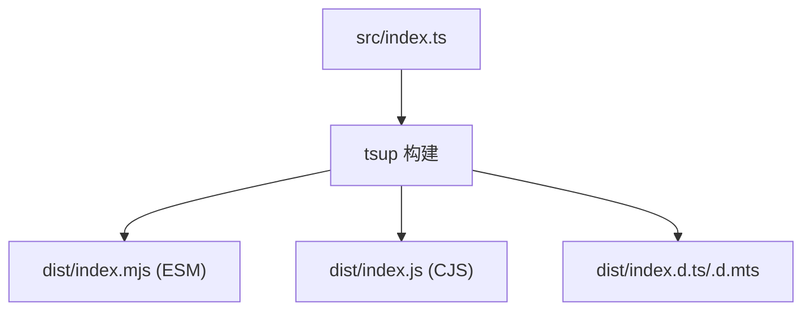
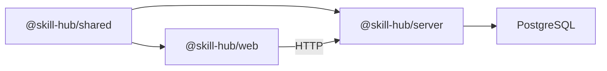

# 开发指南

<cite>
**本文引用的文件**   
- [README.md](file://README.md)
- [package.json](file://package.json)
- [apps/server/package.json](file://apps/server/package.json)
- [apps/web/package.json](file://apps/web/package.json)
- [packages/shared/package.json](file://packages/shared/package.json)
- [scripts/dev.mjs](file://scripts/dev.mjs)
- [scripts/setup.mjs](file://scripts/setup.mjs)
- [apps/web/vite.config.ts](file://apps/web/vite.config.ts)
- [apps/server/nest-cli.json](file://apps/server/nest-cli.json)
- [tsconfig.base.json](file://tsconfig.base.json)
- [apps/server/src/main.ts](file://apps/server/src/main.ts)
- [apps/web/src/main.tsx](file://apps/web/src/main.tsx)
- [docker-compose.dev.yml](file://docker-compose.dev.yml)
</cite>

## 目录
1. [简介](#简介)
2. [项目结构](#项目结构)
3. [核心组件](#核心组件)
4. [架构总览](#架构总览)
5. [详细组件分析](#详细组件分析)
6. [依赖关系分析](#依赖关系分析)
7. [性能与构建优化](#性能与构建优化)
8. [故障排查](#故障排查)
9. [结论](#结论)
10. [附录：常用命令与环境变量](#附录常用命令与环境变量)

## 简介
本指南面向新加入的开发者，帮助你在本地快速搭建 Skill Hub 教学演示项目的开发环境，理解前后端协作方式、代码规范、调试技巧、自动化流程以及常见问题处理方法。项目采用 Monorepo（pnpm workspace），包含 NestJS 后端、React + Vite 前端、Prisma + PostgreSQL 数据层，并提供 Docker Compose 一键启动数据库。

## 项目结构
仓库为多包工作区，根目录通过 pnpm workspace 管理三个主要子包：
- apps/server：NestJS 服务端，提供 API、鉴权、Skill 管理与审核等能力，使用 Prisma 操作 PostgreSQL。
- apps/web：基于 React + Ant Design + Vite 的前端应用，负责页面交互与调用后端 API。
- packages/shared：前后端共享的类型与工具库。

图表来源
- [package.json:1-19](file://package.json#L1-L19)
- [apps/server/package.json:1-55](file://apps/server/package.json#L1-L55)
- [apps/web/package.json:1-34](file://apps/web/package.json#L1-L34)
- [packages/shared/package.json:1-35](file://packages/shared/package.json#L1-L35)

章节来源
- [README.md:1-67](file://README.md#L1-L67)
- [package.json:1-19](file://package.json#L1-L19)

## 核心组件
- 开发入口脚本
  - scripts/dev.mjs：并行启动 server 与 web 两个子包的 dev 进程，统一处理退出信号。
  - scripts/setup.mjs：初始化 .env、启动本地数据库、执行迁移与种子数据。
- 前端
  - apps/web/vite.config.ts：配置 Vite 开发服务器端口、严格端口模式与 /api 代理到后端。
  - apps/web/src/main.tsx：React 应用入口，挂载 Ant Design 中文语言包与应用壳。
- 后端
  - apps/server/src/main.ts：NestJS 应用引导，加载环境变量并监听端口。
  - apps/server/nest-cli.json：Nest CLI 配置，指定源码根目录与构建选项。
- 共享包
  - packages/shared/package.json：定义 ESM/CJS 双格式输出与类型声明导出。

章节来源
- [scripts/dev.mjs:1-12](file://scripts/dev.mjs#L1-L12)
- [scripts/setup.mjs:1-8](file://scripts/setup.mjs#L1-L8)
- [apps/web/vite.config.ts:1-4](file://apps/web/vite.config.ts#L1-L4)
- [apps/web/src/main.tsx:1-17](file://apps/web/src/main.tsx#L1-L17)
- [apps/server/src/main.ts:1-14](file://apps/server/src/main.ts#L1-L14)
- [apps/server/nest-cli.json:1-9](file://apps/server/nest-cli.json#L1-L9)
- [packages/shared/package.json:1-35](file://packages/shared/package.json#L1-L35)

## 架构总览
下图展示开发阶段的关键运行路径：Vite 开发服务器代理 /api 请求到 NestJS 服务；NestJS 通过 Prisma 访问 PostgreSQL；Docker Compose 提供数据库实例。

图表来源
- [apps/web/vite.config.ts:1-4](file://apps/web/vite.config.ts#L1-L4)
- [apps/server/src/main.ts:1-14](file://apps/server/src/main.ts#L1-L14)
- [docker-compose.dev.yml:1-20](file://docker-compose.dev.yml#L1-L20)

## 详细组件分析

### 开发环境与启动流程
- Node.js 与包管理器
  - Node.js 版本要求：>=22
  - pnpm 版本固定：10.33.2
- 首次安装与初始化
  - 安装依赖：pnpm install
  - 初始化环境：pnpm setup（复制 .env.example、启动数据库、执行迁移与种子）
  - 启动开发：pnpm dev（同时启动 server 与 web）
- 数据库与端口
  - 默认数据库端口：5434（可通过 DB_PORT 调整）
  - 默认 API 端口：3001（可通过 PORT 调整）
  - 默认网页端口：5175（可通过 WEB_PORT 调整）
  - 网页代理目标：API_TARGET=http://localhost:端口

图表来源
- [README.md:5-15](file://README.md#L5-L15)
- [scripts/setup.mjs:1-8](file://scripts/setup.mjs#L1-L8)
- [scripts/dev.mjs:1-12](file://scripts/dev.mjs#L1-L12)

章节来源
- [README.md:5-15](file://README.md#L5-L15)
- [package.json:1-19](file://package.json#L1-L19)
- [scripts/setup.mjs:1-8](file://scripts/setup.mjs#L1-L8)
- [scripts/dev.mjs:1-12](file://scripts/dev.mjs#L1-L12)

### 前端（Vite + React）
- 开发服务器
  - 端口：由 WEB_PORT 决定，默认 5175
  - 严格端口：strictPort=true，避免端口冲突
  - API 代理：/api 代理至 API_TARGET，默认 http://localhost:3001
- 应用入口
  - 使用 React StrictMode 与 Ant Design ConfigProvider 注入中文语言包
- 构建与类型检查
  - build：先 tsc --noEmit 再 vite build
  - typecheck：先校验数据库表结构一致性，再 tsc --noEmit

图表来源
- [apps/web/vite.config.ts:1-4](file://apps/web/vite.config.ts#L1-L4)
- [apps/web/src/main.tsx:1-17](file://apps/web/src/main.tsx#L1-L17)
- [apps/web/package.json:1-34](file://apps/web/package.json#L1-L34)

章节来源
- [apps/web/vite.config.ts:1-4](file://apps/web/vite.config.ts#L1-L4)
- [apps/web/src/main.tsx:1-17](file://apps/web/src/main.tsx#L1-L17)
- [apps/web/package.json:1-34](file://apps/web/package.json#L1-L34)

### 后端（NestJS + Prisma）
- 应用引导
  - 加载 dotenv 与 reflect-metadata
  - 创建 Nest 应用并监听 PORT，默认 3001
- 构建与类型检查
  - prebuild：prisma generate
  - build：nest build
  - typecheck：prisma generate + tsc --noEmit
- 数据库操作
  - db:migrate：开发迁移
  - db:deploy：部署迁移
  - db:seed：执行种子数据

图表来源
- [apps/server/src/main.ts:1-14](file://apps/server/src/main.ts#L1-L14)
- [apps/server/nest-cli.json:1-9](file://apps/server/nest-cli.json#L1-L9)
- [apps/server/package.json:1-55](file://apps/server/package.json#L1-L55)

章节来源
- [apps/server/src/main.ts:1-14](file://apps/server/src/main.ts#L1-L14)
- [apps/server/nest-cli.json:1-9](file://apps/server/nest-cli.json#L1-L9)
- [apps/server/package.json:1-55](file://apps/server/package.json#L1-L55)

### 共享包（@skill-hub/shared）
- 输出格式：ESM 与 CJS 双格式
- 类型导出：同时提供 .d.ts 与 .d.mts
- 构建：tsup 构建 index.ts，清理 dist 后输出

图表来源
- [packages/shared/package.json:1-35](file://packages/shared/package.json#L1-L35)

章节来源
- [packages/shared/package.json:1-35](file://packages/shared/package.json#L1-L35)

## 依赖关系分析
- 工作区依赖
  - server 与 web 均依赖 @skill-hub/shared（workspace:*）
- 运行时依赖
  - server：NestJS、Prisma、class-validator/class-transformer、cookie-parser、dotenv 等
  - web：React、Ant Design、Vite、Playwright 测试等
- TypeScript 基础配置
  - tsconfig.base.json 启用 strict、target ES2022、sourceMap 等

图表来源
- [apps/server/package.json:1-55](file://apps/server/package.json#L1-L55)
- [apps/web/package.json:1-34](file://apps/web/package.json#L1-L34)
- [packages/shared/package.json:1-35](file://packages/shared/package.json#L1-L35)
- [docker-compose.dev.yml:1-20](file://docker-compose.dev.yml#L1-L20)

章节来源
- [apps/server/package.json:1-55](file://apps/server/package.json#L1-L55)
- [apps/web/package.json:1-34](file://apps/web/package.json#L1-L34)
- [packages/shared/package.json:1-35](file://packages/shared/package.json#L1-L35)
- [tsconfig.base.json:1-13](file://tsconfig.base.json#L1-L13)

## 性能与构建优化
- 开发体验
  - Vite 严格端口模式避免端口占用导致的热重载异常
  - NestJS 使用 nest start --watch 实现热重载
- 构建产物
  - server 使用 nest build 输出 dist
  - web 使用 vite build 输出静态资源
  - shared 使用 tsup 输出 ESM/CJS 与类型声明
- 类型检查
  - 根级 typecheck 会遍历所有子包进行类型检查，确保跨包类型一致

建议
- 在大型功能迭代时，优先运行 pnpm typecheck 与 pnpm build，尽早发现类型与构建问题。
- 若遇到端口冲突，优先检查 WEB_PORT、PORT、DB_PORT 是否被其他进程占用。

[本节为通用指导，不直接分析具体文件]

## 故障排查
- 无法连接数据库
  - 确认 docker-compose.dev.yml 中 PostgreSQL 已启动且端口映射正确（默认 5434）
  - 检查 apps/server/.env 中的 DATABASE_URL 是否与 DB_PORT 一致
- 前端无法访问后端接口
  - 检查 vite.config.ts 中 proxy 的 API_TARGET 是否正确指向后端端口
  - 确认后端已在 PORT 上监听（默认 3001）
- 端口冲突
  - 修改 WEB_PORT、PORT 或 DB_PORT 后，需同步更新相关环境变量与配置
- 类型检查失败
  - 先运行 pnpm typecheck 查看具体报错位置，必要时单独对某个子包执行 typecheck
- 构建失败
  - server：确认已执行 prisma generate（prebuild 会自动执行）
  - web：确认依赖安装完整，必要时重新安装依赖
- 测试相关
  - e2e 测试使用独立数据库与临时目录，不会污染开发数据
  - 如需重置测试数据库，使用 server 子包的 test:reset-db 脚本

章节来源
- [README.md:45-67](file://README.md#L45-L67)
- [apps/web/vite.config.ts:1-4](file://apps/web/vite.config.ts#L1-L4)
- [apps/server/src/main.ts:1-14](file://apps/server/src/main.ts#L1-L14)
- [docker-compose.dev.yml:1-20](file://docker-compose.dev.yml#L1-L20)

## 结论
通过本指南，你可以快速完成环境搭建、理解前后端协作方式、掌握常用开发与调试命令，并在遇到问题时高效定位与解决。建议在日常开发中遵循“先类型检查、再构建、最后运行测试”的流程，以保证代码质量与稳定性。

[本节为总结性内容，不直接分析具体文件]

## 附录：常用命令与环境变量
- 常用命令
  - 安装依赖：pnpm install
  - 初始化环境：pnpm setup
  - 启动开发：pnpm dev
  - 类型检查：pnpm typecheck
  - 构建：pnpm build
  - 端到端测试（API/Web）：pnpm test:e2e:api / pnpm test:e2e:web
  - 数据库迁移/种子：pnpm --filter @skill-hub/server db:migrate / db:seed
- 关键环境变量
  - DB_PORT：数据库端口（默认 5434）
  - PORT：后端端口（默认 3001）
  - WEB_PORT：前端端口（默认 5175）
  - API_TARGET：前端代理目标地址（默认 http://localhost:3001）
  - PRIVATE_UPLOAD_DIR：私有上传目录（默认 apps/server/uploads-private）

章节来源
- [README.md:45-67](file://README.md#L45-L67)
- [package.json:1-19](file://package.json#L1-L19)
- [apps/server/package.json:1-55](file://apps/server/package.json#L1-L55)
- [apps/web/package.json:1-34](file://apps/web/package.json#L1-L34)