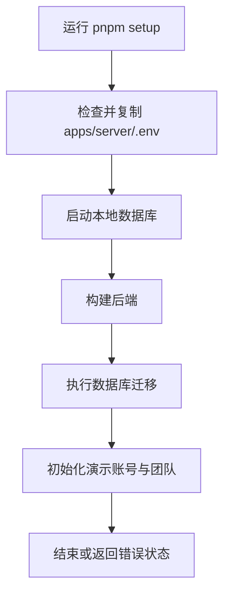
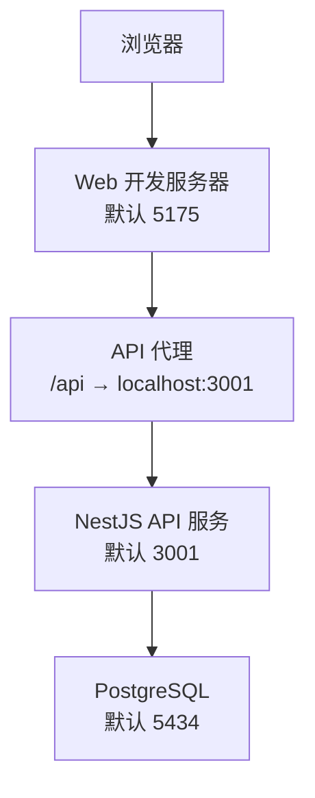
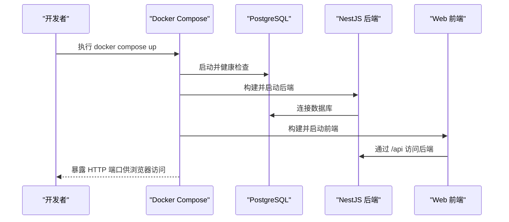
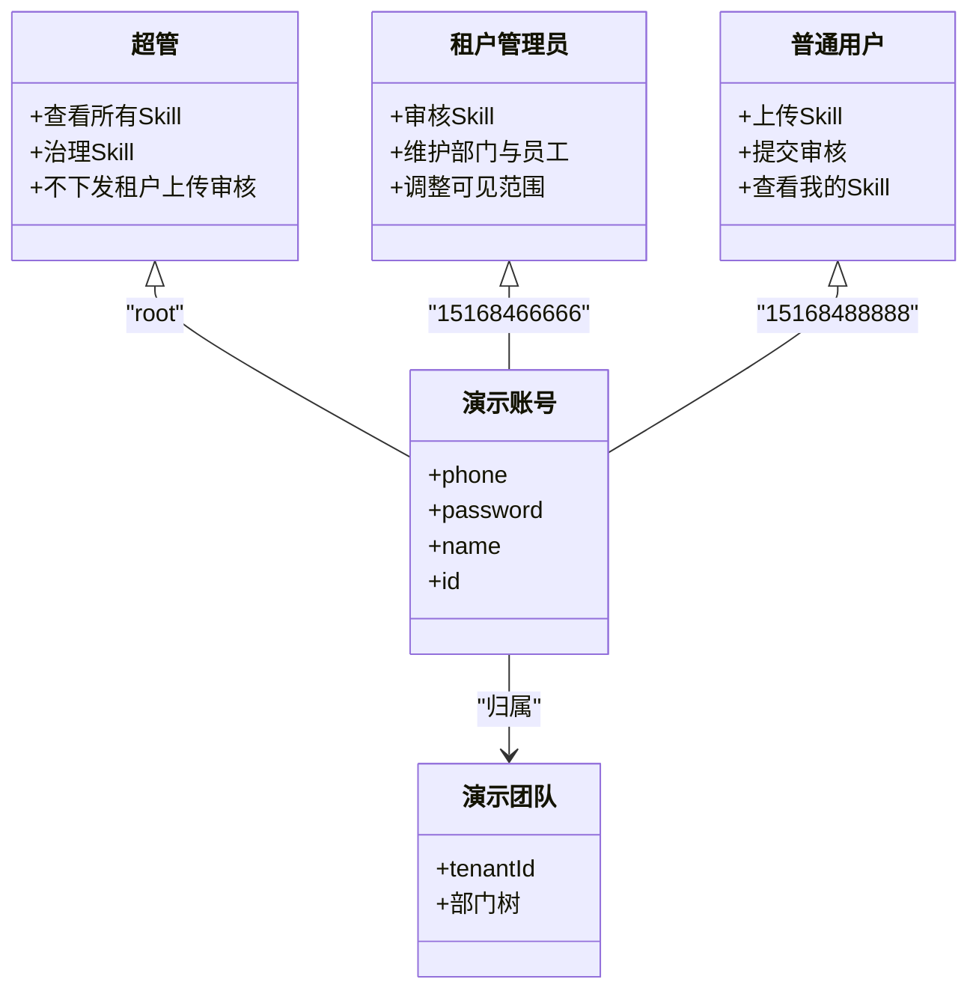

# 快速开始

<cite>
**本文引用的文件**   
- [README.md](file://README.md)
- [package.json](file://package.json)
- [scripts/setup.mjs](file://scripts/setup.mjs)
- [scripts/dev.mjs](file://scripts/dev.mjs)
- [docker-compose.yml](file://docker-compose.yml)
- [docker-compose.dev.yml](file://docker-compose.dev.yml)
- [apps/server/package.json](file://apps/server/package.json)
- [apps/web/package.json](file://apps/web/package.json)
- [apps/web/vite.config.ts](file://apps/web/vite.config.ts)
- [apps/server/src/seed.ts](file://apps/server/src/seed.ts)
- [apps/server/src/seed/demo.ts](file://apps/server/src/seed/demo.ts)
</cite>

## 目录
1. [简介](#简介)
2. [环境要求](#环境要求)
3. [本地开发：一键安装与启动](#本地开发一键安装与启动)
4. [setup 脚本的作用与幂等性](#setup-脚本的作用与幂等性)
5. [开发模式端口说明](#开发模式端口说明)
6. [Docker 一键部署](#docker-一键部署)
7. [默认演示账号与权限](#默认演示账号与权限)
8. [访问 Web 界面与基本操作](#访问-web-界面与基本操作)
9. [常见问题排查](#常见问题排查)
10. [结论](#结论)

## 简介
Skill Hub Teaching 是 Skill Hub 的教学演示版本，提供真实上传、审核、多版本、分类、可见范围、上下架和下载能力。前端使用 React 与 Ant Design，后端使用 NestJS、Prisma 和 PostgreSQL，私有文件保存在独立目录中。项目采用 pnpm workspace 管理 apps/server、apps/web 与 packages/shared。

## 环境要求
- Node.js 22 或更高版本
- pnpm 10.33.2（由根 packageManager 字段固定）
- Docker（用于数据库与一键部署）

这些要求来自项目的 README 与根 package.json 的 engines 与 packageManager 配置。

**章节来源**
- [README.md:7-15](file://README.md#L7-L15)
- [package.json:1-7](file://package.json#L1-L7)

## 本地开发：一键安装与启动
推荐按以下顺序执行：

1. 安装依赖  
   ```bash
   pnpm install
   ```

2. 初始化环境与数据  
   ```bash
   pnpm setup
   ```

3. 启动开发服务  
   ```bash
   pnpm dev
   ```

4. 打开浏览器访问  
   ```text
   http://localhost:5175
   ```

pnpm setup 会复制环境变量模板、启动本地数据库、构建后端、执行数据库迁移并初始化演示数据。pnpm dev 会同时启动后端 API 与前端 Web 服务。

**章节来源**
- [README.md:9-15](file://README.md#L9-L15)
- [package.json:8-16](file://package.json#L8-L16)
- [scripts/dev.mjs:1-12](file://scripts/dev.mjs#L1-L12)

## setup 脚本的作用与幂等性
scripts/setup.mjs 是一个轻量编排脚本，主要完成以下工作：

- 如果 `apps/server/.env` 不存在，则从同目录模板复制生成。
- 依次执行：
  - 启动本地 PostgreSQL 数据库
  - 构建后端应用
  - 执行数据库迁移
  - 执行演示数据种子脚本

该脚本通过子进程调用 pnpm 命令，并在任一步骤失败时直接退出，便于快速定位问题。



**图表来源**
- [scripts/setup.mjs:1-8](file://scripts/setup.mjs#L1-L8)
- [apps/server/src/seed.ts:1-6](file://apps/server/src/seed.ts#L1-L6)

### 幂等性特点
演示数据初始化逻辑明确声明“仅插入缺失项，不重置 Skill、会话或已有演示工作”。因此重复运行 setup 不会覆盖已上传的 Skill 或用户会话，适合反复调试。

**章节来源**
- [scripts/setup.mjs:1-8](file://scripts/setup.mjs#L1-L8)
- [apps/server/src/seed/demo.ts:10-34](file://apps/server/src/seed/demo.ts#L10-L34)

## 开发模式端口说明
| 服务 | 默认端口 | 说明 |
|---|---:|---|
| 数据库 | 5434 | 开发用 PostgreSQL，由开发 compose 暴露到宿主机 |
| API 后端 | 3001 | NestJS 服务监听端口 |
| Web 前端 | 5175 | Vite 开发服务器端口 |

端口行为依据如下：

- 开发数据库端口可通过根目录 `.env` 中的 `DB_PORT` 调整；compose 会将容器内 5432 映射到宿主机的 `DB_PORT`。
- API 端口可通过 `PORT` 修改，但需要同步更新前端代理目标。
- Web 端口可通过 `WEB_PORT` 修改，例如 `WEB_PORT=5176 pnpm dev`。
- Web 前端默认将 `/api` 请求代理到 `http://localhost:3001`，可通过 `API_TARGET` 覆盖。



**图表来源**
- [docker-compose.dev.yml:3-17](file://docker-compose.dev.yml#L3-L17)
- [apps/web/vite.config.ts:1-4](file://apps/web/vite.config.ts#L1-L4)
- [README.md:45-52](file://README.md#L45-L52)

**章节来源**
- [README.md:15-16](file://README.md#L15-L16)
- [README.md:45-52](file://README.md#L45-L52)
- [docker-compose.dev.yml:3-17](file://docker-compose.dev.yml#L3-L17)
- [apps/web/vite.config.ts:1-4](file://apps/web/vite.config.ts#L1-L4)

## Docker 一键部署
项目提供生产风格的 Docker Compose 配置，可一键拉起数据库、后端与前端。

### 启动流程
```bash
docker compose up -d --build --wait
```

启动成功后访问：
```text
http://localhost:8081
```

### 关键行为
- 数据库镜像为 `postgres:17-alpine`，数据库名为 `skill_hub_demo`。
- 后端自动等待数据库健康检查通过后启动。
- 前端默认暴露到宿主机的 `HTTP_PORT`，未设置时为 8081。
- 数据库文件和私有包分别使用命名卷 `demo_db` 与 `demo_packages`。
- 正常停止与重启会保留数据；不要随意使用 `down -v`，否则会删除演示数据。



**图表来源**
- [docker-compose.yml:1-47](file://docker-compose.yml#L1-L47)
- [README.md:37-43](file://README.md#L37-L43)

**章节来源**
- [README.md:37-43](file://README.md#L37-L43)
- [docker-compose.yml:1-47](file://docker-compose.yml#L1-L47)

## 默认演示账号与权限
项目预置三个演示账号，用于快速体验完整流程。

| 角色 | 用户名 | 密码 | 权限说明 |
|---|---|---|---|
| 超管 | root | admin | 可查看、下载和治理所有 Skill，但不执行租户内上传和审核 |
| 租户管理员 | 15168466666 | test | 可审核、维护部门与员工、调整可见范围 |
| 普通用户 | 15168488888 | test | 可上传 Skill、提交审核、查看自己的 Skill |

演示团队包含根部门、研发部、运营部。普通用户属于研发部。身份、团队和权限由服务端确定。登录页支持点击账号卡片填入用户名和密码后登录，无需强制改密。



**图表来源**
- [README.md:17-25](file://README.md#L17-L25)
- [apps/server/src/seed/demo.ts:3-34](file://apps/server/src/seed/demo.ts#L3-L34)

**章节来源**
- [README.md:17-25](file://README.md#L17-L25)
- [apps/server/src/seed/demo.ts:3-34](file://apps/server/src/seed/demo.ts#L3-L34)

## 访问 Web 界面与基本操作
### 访问地址
- 本地开发：`http://localhost:5175`
- Docker 部署：`http://localhost:8081`

### 基本操作流程
1. 使用普通用户登录，进入「我的 Skill」或「Skill」。
2. 上传示例 Skill 文件夹 `examples/hello-skill`，也支持拖入文件夹或 ZIP。
3. 填写版本号并提交审核。
4. 复制审核链接，退出后用租户管理员登录，进入审核页面检查内容。
5. 执行通过或驳回。如驳回，普通用户可在「我的 Skill」查看原因并重新上传。
6. 管理员通过后，Skill 在目录中可见并可下载。
7. 如需发布新版本，以新版本号再次上传，审核页可查看差异。

初始演示不会自动灌入 Skill，避免混淆实际上传结果。示例内容仅在手动上传后进入数据库。

**章节来源**
- [README.md:27-35](file://README.md#L27-L35)

## 常见问题排查
### 无法访问 Web 界面
- 确认是否执行了 `pnpm setup` 与 `pnpm dev`。
- 确认浏览器访问的是 `http://localhost:5175`。
- 若修改过 `WEB_PORT`，请使用新端口访问。
- 若修改过 `API_TARGET`，请确保前端能代理到正确的 API 地址。

**章节来源**
- [README.md:9-15](file://README.md#L9-L15)
- [README.md:45-52](file://README.md#L45-L52)
- [apps/web/vite.config.ts:1-4](file://apps/web/vite.config.ts#L1-L4)

### 数据库连接失败
- 确认本地数据库已启动，默认端口为 5434。
- 若修改了 `DB_PORT`，请同步更新 API 的 `DATABASE_URL` 与测试用的 `TEST_DATABASE_URL`。
- 检查 `apps/server/.env` 是否已由 setup 生成。

**章节来源**
- [README.md:45-49](file://README.md#L45-L49)
- [scripts/setup.mjs:1-8](file://scripts/setup.mjs#L1-L8)

### API 端口不一致导致前端请求失败
- 若修改了后端 `PORT`，需同步设置前端的 `API_TARGET`。
- 若使用 Docker，注意后端在容器内监听 3000，前端通过反向代理访问。

**章节来源**
- [README.md:47-51](file://README.md#L47-L51)
- [docker-compose.yml:16-35](file://docker-compose.yml#L16-L35)

### Docker 数据丢失
- 不要使用 `docker compose down -v`，除非确实要删除演示数据。
- 数据库与私有包分别保存在 `demo_db` 与 `demo_packages` 命名卷中。

**章节来源**
- [README.md:37-43](file://README.md#L37-L43)
- [docker-compose.yml:45-47](file://docker-compose.yml#L45-L47)

### 登录账号无效
- 确认使用的是演示账号：root/admin、15168466666/test、15168488888/test。
- 确认已执行 `pnpm setup` 或 Docker 启动流程，以便初始化演示账号与团队。

**章节来源**
- [README.md:17-25](file://README.md#L17-L25)
- [apps/server/src/seed.ts:1-6](file://apps/server/src/seed.ts#L1-L6)

## 结论
按照本指南，新用户可以在最短时间内完成依赖安装、环境配置与服务启动，并通过默认演示账号体验上传、审核、版本管理与下载等核心功能。本地开发推荐使用 `pnpm install`、`pnpm setup`、`pnpm dev`；生产风格部署推荐使用 `docker compose up -d --build --wait`。遇到端口、数据库或代理问题时，优先对照本文的端口说明与常见问题排查部分进行定位。