# 数据库设计

<cite>
**本文引用的文件**   
- [schema.prisma](file://apps/server/prisma/schema.prisma)
- [migration.sql](file://apps/server/prisma/migrations/20261004080000_demo_init/migration.sql)
- [demo.ts](file://apps/server/src/seed/demo.ts)
- [auth.service.ts](file://apps/server/src/auth/auth.service.ts)
- [auth.guard.ts](file://apps/server/src/auth/auth.guard.ts)
- [prisma.service.ts](file://apps/server/src/prisma/prisma.service.ts)
- [skill-categories.service.ts](file://apps/server/src/skills/skill-categories.service.ts)
- [skills.service.ts](file://apps/server/src/skills/skills.service.ts)
- [skill-reviews.service.ts](file://apps/server/src/skills/skill-reviews.service.ts)
- [server.Dockerfile](file://deploy/server.Dockerfile)
- [reset-database.ts](file://apps/server/test/reset-database.ts)
- [health.controller.ts](file://apps/server/src/health/health.controller.ts)
</cite>

## 目录
1. [引言](#引言)
2. [项目结构](#项目结构)
3. [核心数据模型](#核心数据模型)
4. [架构总览](#架构总览)
5. [详细组件分析](#详细组件分析)
6. [依赖关系分析](#依赖关系分析)
7. [性能与查询优化](#性能与查询优化)
8. [多租户与权限隔离](#多租户与权限隔离)
9. [迁移与版本管理](#迁移与版本管理)
10. [数据初始化与演示数据](#数据初始化与演示数据)
11. [备份恢复与灾难恢复](#备份恢复与灾难恢复)
12. [故障排查指南](#故障排查指南)
13. [结论](#结论)

## 引言
本文件面向数据库管理员与后端开发者，系统化说明基于 Prisma ORM 的数据库设计。文档覆盖实体关系图、字段定义、约束与索引、多租户隔离机制、迁移策略、演示数据生成、查询优化建议、备份恢复与灾难恢复方案，帮助读者理解设计意图并掌握维护方法。

## 项目结构
本项目使用 PostgreSQL 作为数据库，通过 Prisma 进行数据建模与迁移。核心数据库定义位于 Prisma Schema，实际建表语句由首次迁移脚本生成；应用层通过 NestJS 服务访问数据库，并在部署时自动执行迁移与演示数据初始化。

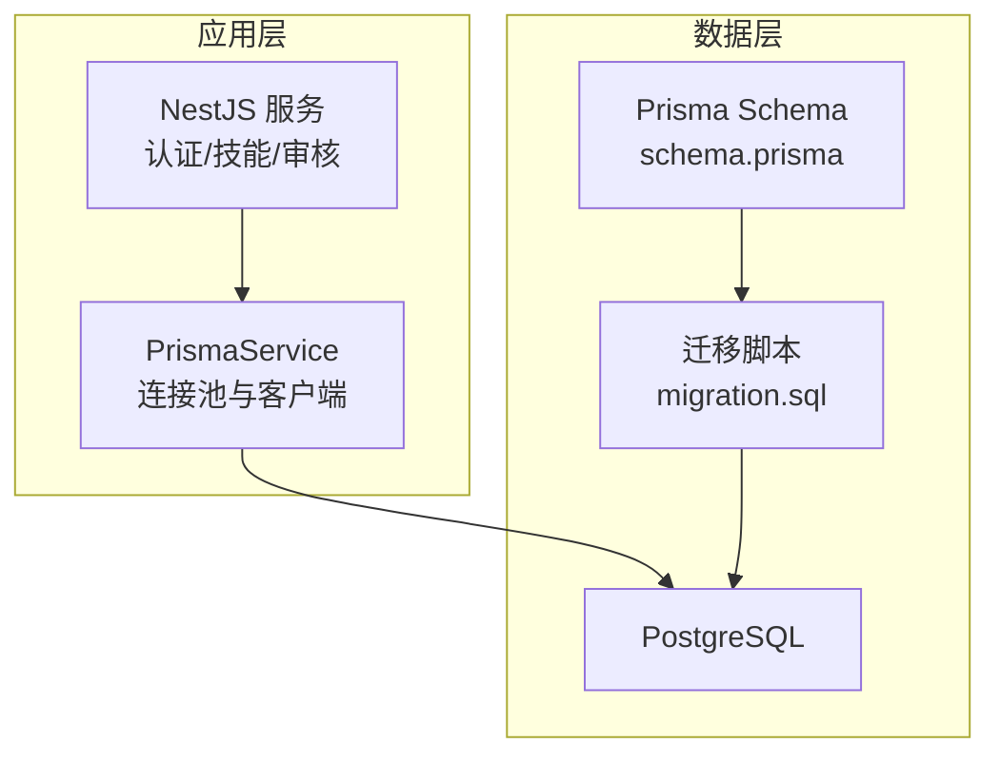

**图表来源**
- [schema.prisma:1-10](file://apps/server/prisma/schema.prisma#L1-L10)
- [migration.sql:1-18](file://apps/server/prisma/migrations/20261004080000_demo_init/migration.sql#L1-L18)
- [prisma.service.ts:1-15](file://apps/server/src/prisma/prisma.service.ts#L1-L15)

**章节来源**
- [schema.prisma:1-10](file://apps/server/prisma/schema.prisma#L1-L10)
- [migration.sql:1-18](file://apps/server/prisma/migrations/20261004080000_demo_init/migration.sql#L1-L18)
- [prisma.service.ts:1-15](file://apps/server/src/prisma/prisma.service.ts#L1-L15)

## 核心数据模型
以下为核心实体的职责与关键字段摘要：

- User（用户）
  - 唯一标识 id、手机号 phone、姓名 name、昵称 nickname、邮箱 email、时间戳 createdAt/updatedAt。
  - 关联 Session、Employee、SkillReviewRecord、SuperAdmin。
- SuperAdmin（超级管理员）
  - 一对一映射到 User，用于标记系统级超管身份。
- Session（会话）
  - 存储登录令牌哈希、当前租户上下文 currentTenantId、过期时间 expiresAt。
- Tenant（租户）
  - 租户名称、状态、备注、头像地址等，是所有业务数据的隔离边界。
- Department（部门）
  - 支持树形结构 parentId/children，按 tenantId 隔离。
- Employee（员工档案）
  - 绑定 User 与 Tenant，归属 Department，包含状态与是否租户管理员标志。
- Skill（技能包）
  - 属于 Tenant，有可见性 visibility、是否下架 unlisted、可选分类 categoryId。
- SkillCategory（技能分类）
  - 按 Tenant 隔离，名称在租户内唯一。
- SkillVisibleDepartment / SkillVisibleEmployee（可见性关联）
  - 实现“按部门可见”和“按员工可见”的多对多关系。
- SkillVersion（技能版本）
  - 语义化版本号 major/minor/patch，状态 draft/pending/published，上传者 uploaderEmployeeId，存储 key、大小、文件数、下载次数。
- SkillReviewRecord（审核记录）
  - 记录操作 action、操作人 actorUserId、可选 versionId、评论 comment。

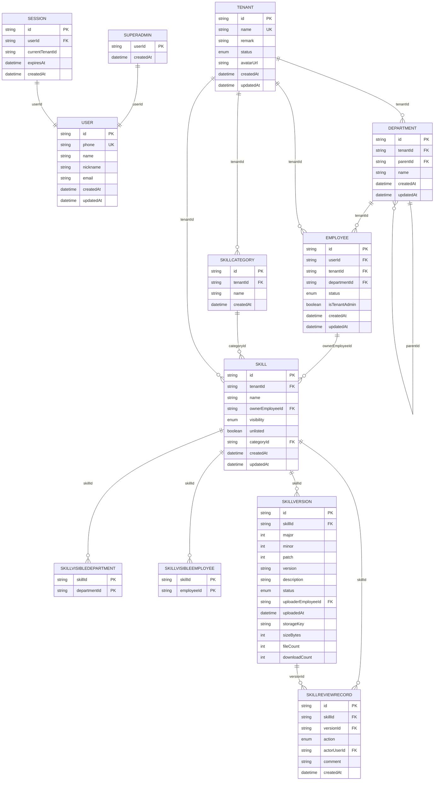

**图表来源**
- [schema.prisma:12-219](file://apps/server/prisma/schema.prisma#L12-L219)

**章节来源**
- [schema.prisma:12-219](file://apps/server/prisma/schema.prisma#L12-L219)

## 架构总览
从数据访问角度，应用通过 PrismaService 获取类型安全的 PrismaClient，所有业务模块（认证、技能、审核、健康检查等）以 service/controller 形式组织，最终统一落库。

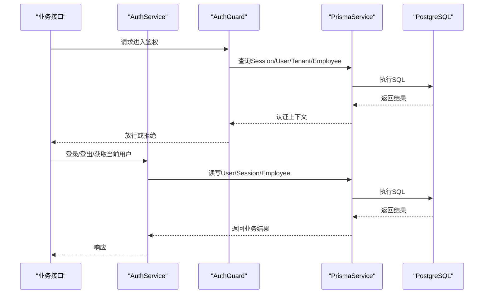

**图表来源**
- [auth.guard.ts:29-48](file://apps/server/src/auth/auth.guard.ts#L29-L48)
- [auth.service.ts:15-35](file://apps/server/src/auth/auth.service.ts#L15-L35)
- [prisma.service.ts:1-15](file://apps/server/src/prisma/prisma.service.ts#L1-L15)

**章节来源**
- [auth.guard.ts:29-48](file://apps/server/src/auth/auth.guard.ts#L29-L48)
- [auth.service.ts:15-35](file://apps/server/src/auth/auth.service.ts#L15-L35)
- [prisma.service.ts:1-15](file://apps/server/src/prisma/prisma.service.ts#L1-L15)

## 详细组件分析

### 用户与会话
- User 提供基础身份信息，phone 全局唯一。
- SuperAdmin 为 User 的扩展角色，删除 User 时级联删除。
- Session 保存登录态，包含 currentTenantId 表示当前租户上下文；userId 上建立索引加速查询。

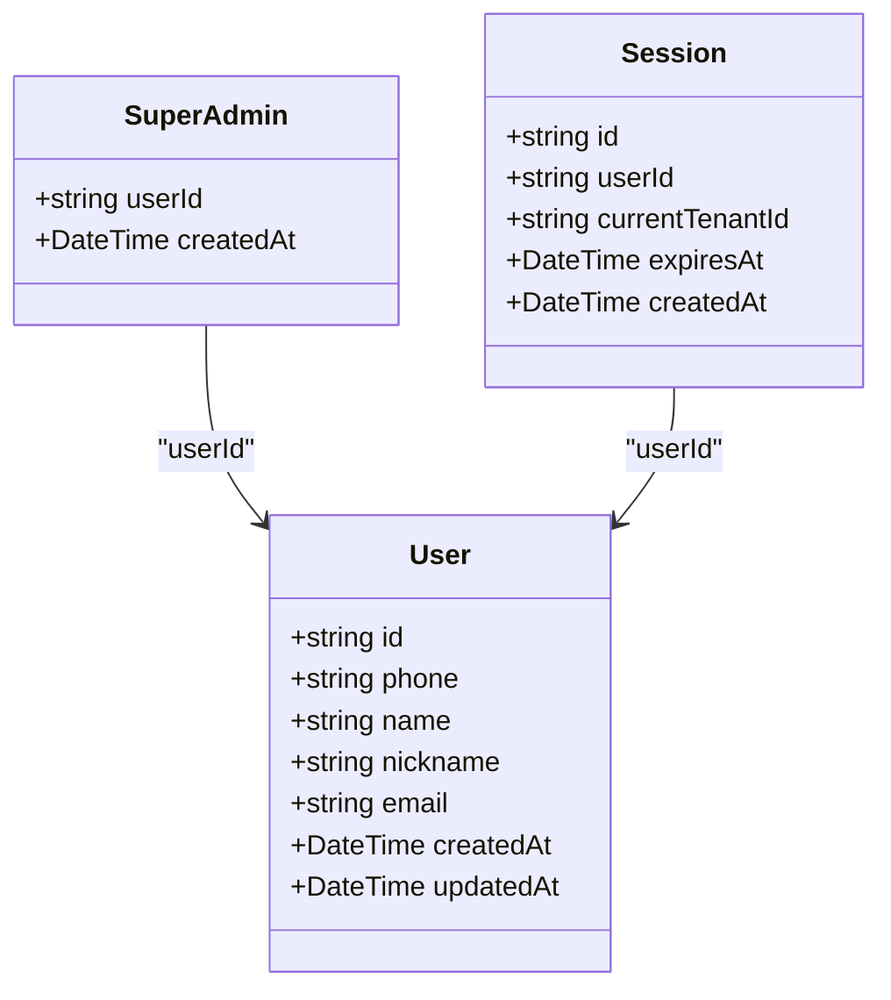

**图表来源**
- [schema.prisma:12-41](file://apps/server/prisma/schema.prisma#L12-L41)

**章节来源**
- [schema.prisma:12-41](file://apps/server/prisma/schema.prisma#L12-L41)

### 租户、部门与员工
- Tenant 是数据隔离根节点，name 唯一。
- Department 支持树形结构，(tenantId, parentId, name) 组合唯一，tenantId 单独索引。
- Employee 将 User 与 Tenant 关联，并归属 Department；(userId, tenantId) 组合唯一，tenantId 单独索引。

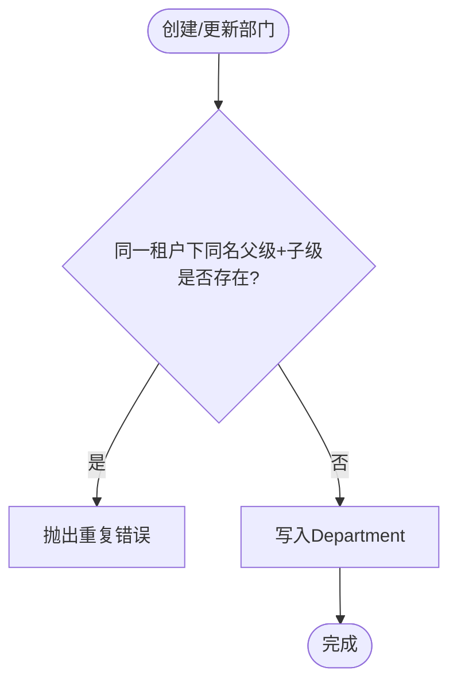

**图表来源**
- [schema.prisma:62-77](file://apps/server/prisma/schema.prisma#L62-L77)

**章节来源**
- [schema.prisma:62-77](file://apps/server/prisma/schema.prisma#L62-L77)

### 技能、分类与可见性
- Skill 属于 Tenant，具有 visibility 控制可见范围（租户/部门/员工/私有），unlisted 控制是否上架。
- SkillCategory 在租户内名称唯一。
- SkillVisibleDepartment 与 SkillVisibleEmployee 分别维护“按部门可见”和“按员工可见”的关系。

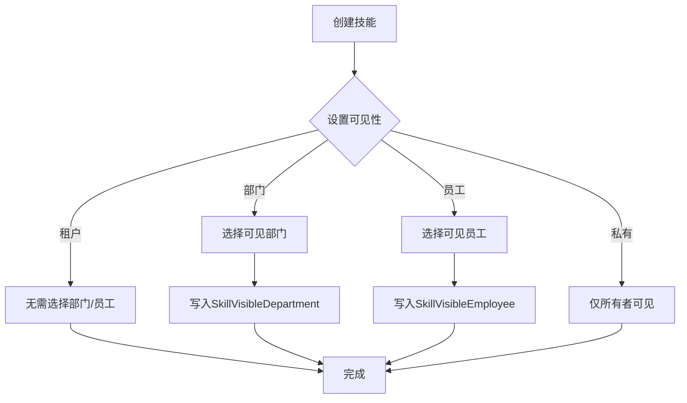

**图表来源**
- [schema.prisma:104-162](file://apps/server/prisma/schema.prisma#L104-L162)

**章节来源**
- [schema.prisma:104-162](file://apps/server/prisma/schema.prisma#L104-L162)

### 技能版本与审核
- SkillVersion 采用语义化版本 major/minor/patch，状态包括草稿、待审、已发布；uploaderEmployeeId 记录上传者。
- SkillReviewRecord 记录每次动作（提交、撤回、批准、驳回、重新上传、变更可见性/分类、下架/上架等），可关联具体 versionId。

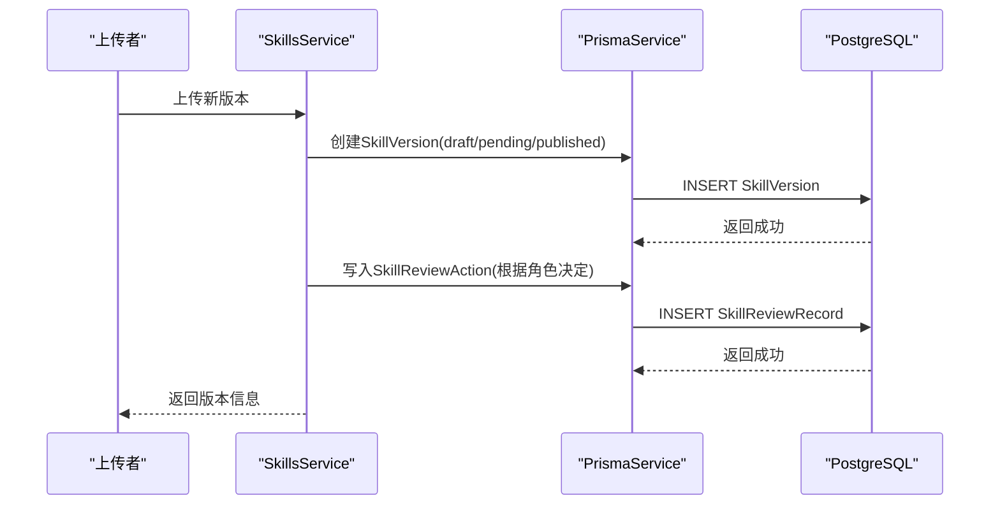

**图表来源**
- [schema.prisma:170-218](file://apps/server/prisma/schema.prisma#L170-L218)
- [skills.service.ts:75-97](file://apps/server/src/skills/skills.service.ts#L75-L97)

**章节来源**
- [schema.prisma:170-218](file://apps/server/prisma/schema.prisma#L170-L218)
- [skills.service.ts:75-97](file://apps/server/src/skills/skills.service.ts#L75-L97)

## 依赖关系分析
- 外键约束确保数据一致性：例如 SkillVersion 删除会级联删除相关审核记录；Skill 删除会级联删除可见性关联与版本。
- 部分外键采用 RESTRICT 防止误删关键主数据（如 Tenant、Department、Employee）。
- 枚举类型在数据库层约束取值，保证数据质量。

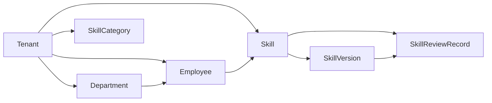

**图表来源**
- [migration.sql:206-264](file://apps/server/prisma/migrations/20261004080000_demo_init/migration.sql#L206-L264)

**章节来源**
- [migration.sql:206-264](file://apps/server/prisma/migrations/20261004080000_demo_init/migration.sql#L206-L264)

## 性能与查询优化
- 常用过滤字段已建立索引：
  - Session.userId
  - Department.tenantId
  - Employee.tenantId
  - Skill.categoryId
  - SkillVisibleDepartment.departmentId
  - SkillVisibleEmployee.employeeId
  - SkillReviewRecord.skillId
- 高频查询场景建议：
  - 按租户筛选：优先使用 tenantId 条件，配合已有索引。
  - 按分类筛选：使用 categoryId 索引。
  - 按可见性筛选：结合 SkillVisibleDepartment/SkillVisibleEmployee 表，避免全表扫描。
  - 审核记录分页：使用 skillId 索引并按 createdAt 排序分页。
- 事务与并发：
  - 分类创建时对 Tenant 行加锁串行化，避免并发超限。
  - 审核记录分页查询使用事务包裹 count 与 findMany，保证一致性。

**章节来源**
- [schema.prisma:40-41](file://apps/server/prisma/schema.prisma#L40-L41)
- [schema.prisma:75-77](file://apps/server/prisma/schema.prisma#L75-L77)
- [schema.prisma:100-102](file://apps/server/prisma/schema.prisma#L100-L102)
- [schema.prisma:122-124](file://apps/server/prisma/schema.prisma#L122-L124)
- [schema.prisma:150-152](file://apps/server/prisma/schema.prisma#L150-L152)
- [schema.prisma:160-162](file://apps/server/prisma/schema.prisma#L160-L162)
- [schema.prisma:217-218](file://apps/server/prisma/schema.prisma#L217-L218)
- [skill-categories.service.ts:34-44](file://apps/server/src/skills/skill-categories.service.ts#L34-L44)
- [skill-reviews.service.ts:92-112](file://apps/server/src/skills/skill-reviews.service.ts#L92-L112)

## 多租户与权限隔离
- 数据隔离：
  - 所有业务数据均携带 tenantId，并通过唯一约束与索引保障隔离。
  - Skill 的可见性通过 visibility 与关联表进一步细化到部门/员工维度。
- 会话与上下文：
  - Session.currentTenantId 表示当前租户上下文；认证流程中根据该上下文加载对应 Employee。
- 权限校验：
  - 认证守卫根据路由装饰器判断是否需要租户管理员或普通成员，并校验当前租户是否启用。
  - 超管可跨租户查看只读信息，但不可直接调用租户专属接口。

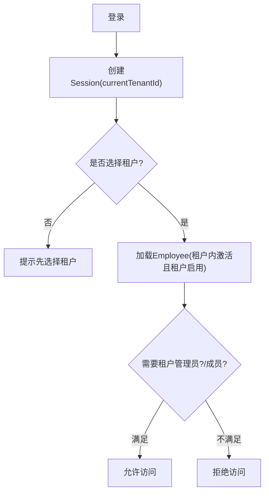

**图表来源**
- [auth.service.ts:15-49](file://apps/server/src/auth/auth.service.ts#L15-L49)
- [auth.guard.ts:29-48](file://apps/server/src/auth/auth.guard.ts#L29-L48)

**章节来源**
- [auth.service.ts:15-49](file://apps/server/src/auth/auth.service.ts#L15-L49)
- [auth.guard.ts:29-48](file://apps/server/src/auth/auth.guard.ts#L29-L48)

## 迁移与版本管理
- 迁移位置：apps/server/prisma/migrations。
- 首次迁移脚本：20261004080000_demo_init/migration.sql，包含建表、索引、外键与枚举定义。
- 运行时：
  - Docker 启动命令在执行应用前运行 prisma migrate deploy，确保数据库结构与代码一致。
  - Prisma 配置指定 migrations 路径与 seed 脚本入口。

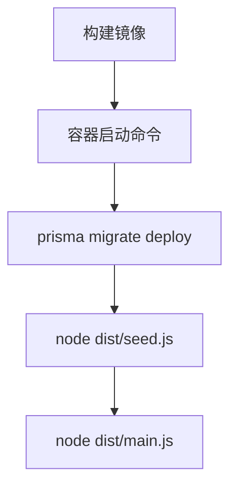

**图表来源**
- [server.Dockerfile:24-25](file://deploy/server.Dockerfile#L24-L25)
- [prisma.config.ts:6-9](file://apps/server/prisma/config.ts#L6-L9)

**章节来源**
- [migration.sql:1-265](file://apps/server/prisma/migrations/20261004080000_demo_init/migration.sql#L1-L265)
- [server.Dockerfile:24-25](file://deploy/server.Dockerfile#L24-L25)
- [prisma.config.ts:6-9](file://apps/server/prisma/config.ts#L6-L9)

## 数据初始化与演示数据
- 演示租户与账号：
  - 固定演示租户 ID 与若干演示账号（超管、租户管理员、普通用户）。
  - 初始化逻辑幂等：使用 upsert 避免重复插入，不会重置现有业务数据。
- 测试环境：
  - 测试用例开始前执行 prisma migrate deploy，确保结构一致。
  - 每个用例前清空业务表（保留迁移记录），保证干净状态。

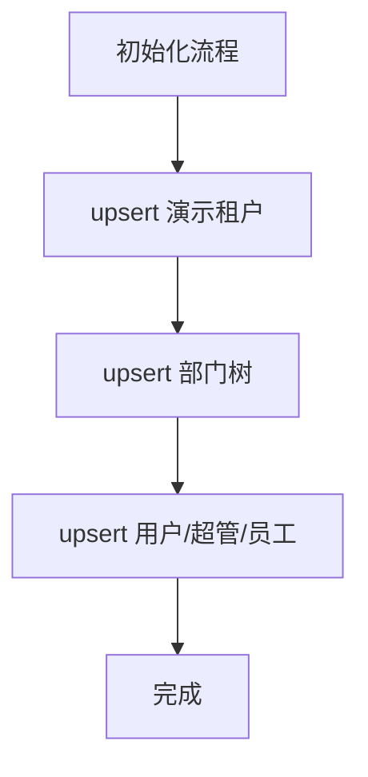

**图表来源**
- [demo.ts:10-34](file://apps/server/src/seed/demo.ts#L10-L34)
- [global-setup.ts:4-8](file://apps/server/test/global-setup.ts#L4-L8)
- [reset-database.ts:4-12](file://apps/server/test/reset-database.ts#L4-L12)

**章节来源**
- [demo.ts:10-34](file://apps/server/src/seed/demo.ts#L10-L34)
- [global-setup.ts:4-8](file://apps/server/test/global-setup.ts#L4-L8)
- [reset-database.ts:4-12](file://apps/server/test/reset-database.ts#L4-L12)

## 备份恢复与灾难恢复
- 备份策略建议：
  - 定期全量备份 PostgreSQL 数据库（pg_dump），并结合对象存储归档。
  - 开启 WAL 日志与增量备份，缩短 RPO。
- 恢复流程建议：
  - 先恢复最新全量备份，再回放增量 WAL 至目标时间点。
  - 验证数据库连通性与健康检查接口。
- 健康检查：
  - 应用暴露 /health 端点，内部执行 SELECT 1 检测数据库可用性。

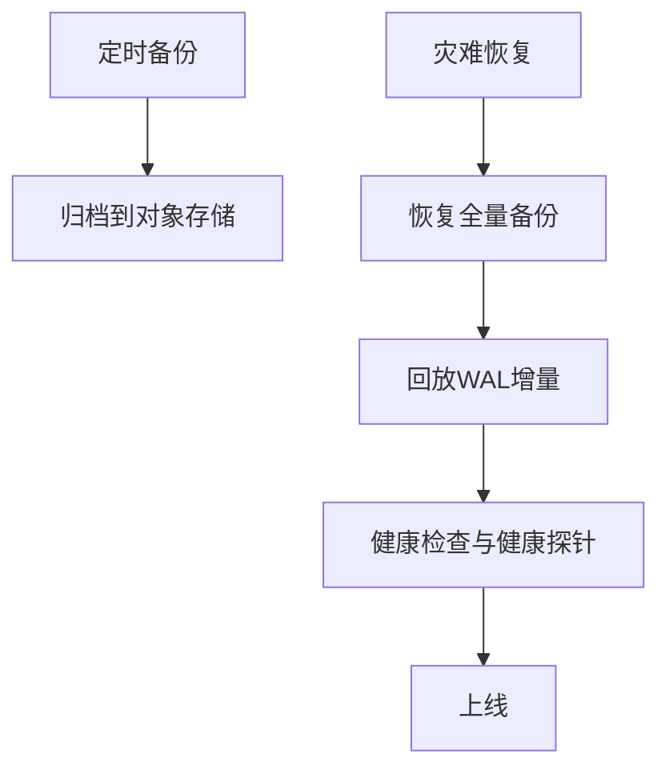

**图表来源**
- [health.controller.ts:11-20](file://apps/server/src/health/health.controller.ts#L11-L20)

**章节来源**
- [health.controller.ts:11-20](file://apps/server/src/health/health.controller.ts#L11-L20)

## 故障排查指南
- 认证失败：
  - 检查 Session 是否存在且未过期，currentTenantId 是否正确。
  - 确认 Employee 与 Tenant 状态均为 active。
- 权限不足：
  - 若路由要求租户管理员，需确保当前用户在目标租户下为 isTenantAdmin=true。
- 数据不一致：
  - 检查外键约束是否被破坏（通常由外部脚本直写导致）。
  - 核对迁移记录与应用代码是否匹配。
- 性能问题：
  - 检查慢查询是否命中索引（tenantId、categoryId、departmentId、employeeId、skillId）。
  - 关注大事务与 N+1 查询，必要时拆分或批量处理。

**章节来源**
- [auth.service.ts:15-49](file://apps/server/src/auth/auth.service.ts#L15-L49)
- [auth.guard.ts:29-48](file://apps/server/src/auth/auth.guard.ts#L29-L48)
- [schema.prisma:40-41](file://apps/server/prisma/schema.prisma#L40-L41)
- [schema.prisma:75-77](file://apps/server/prisma/schema.prisma#L75-L77)
- [schema.prisma:100-102](file://apps/server/prisma/schema.prisma#L100-L102)
- [schema.prisma:122-124](file://apps/server/prisma/schema.prisma#L122-L124)
- [schema.prisma:150-152](file://apps/server/prisma/schema.prisma#L150-L152)
- [schema.prisma:160-162](file://apps/server/prisma/schema.prisma#L160-L162)
- [schema.prisma:217-218](file://apps/server/prisma/schema.prisma#L217-L218)

## 结论
本数据库设计以 Tenant 为核心实现多租户隔离，围绕 Skill 生命周期构建版本与审核体系，并通过显式的外键与索引保障数据一致性与查询性能。认证与会话机制结合 currentTenantId 实现细粒度的权限控制。在生产环境中，应遵循迁移与演示数据初始化流程，并配套完善的备份恢复与健康检查策略，以确保系统的稳定性与可维护性。