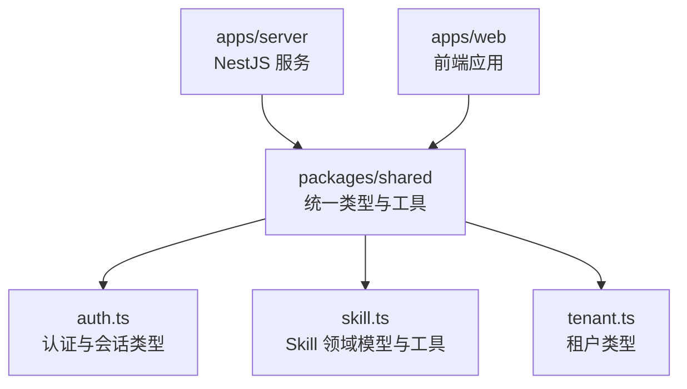
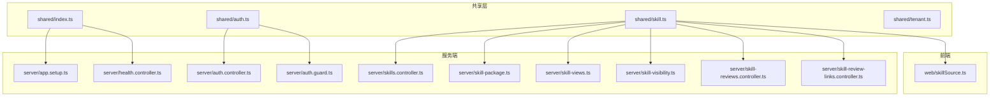
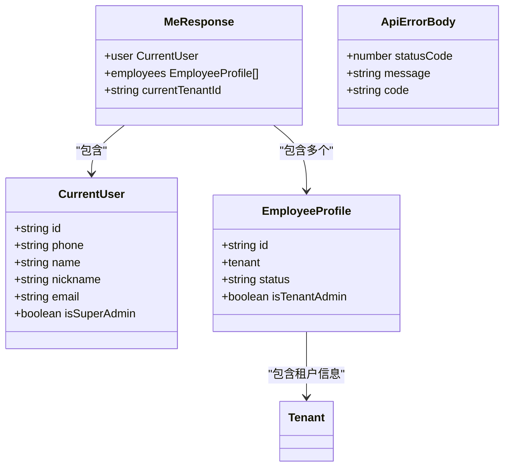
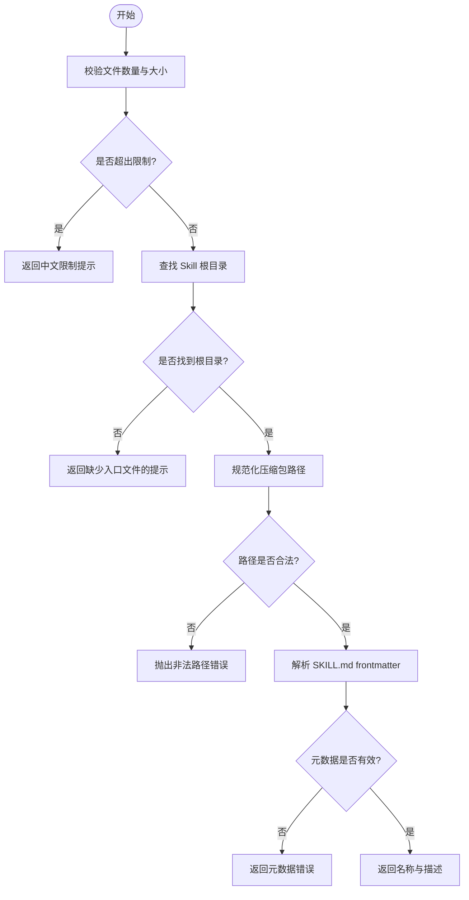
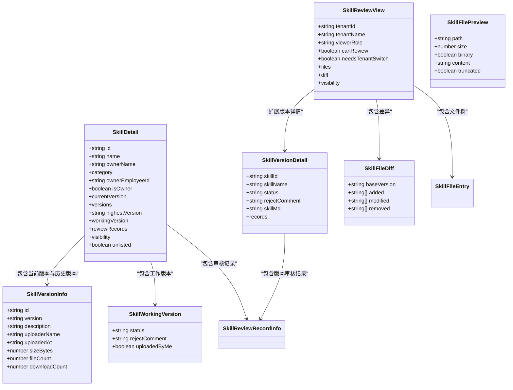
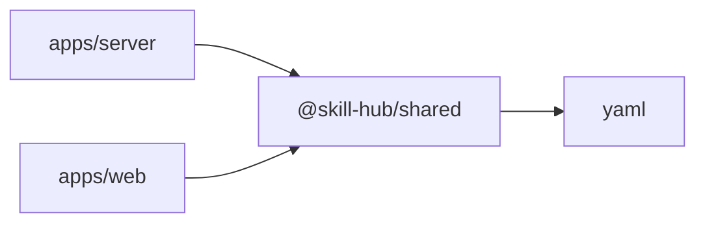

# 共享库设计

<cite>
**本文引用的文件**   
- [packages/shared/src/index.ts](file://packages/shared/src/index.ts)
- [packages/shared/src/auth.ts](file://packages/shared/src/auth.ts)
- [packages/shared/src/skill.ts](file://packages/shared/src/skill.ts)
- [packages/shared/src/tenant.ts](file://packages/shared/src/tenant.ts)
- [packages/shared/package.json](file://packages/shared/package.json)
- [apps/server/src/app.setup.ts](file://apps/server/src/app.setup.ts)
- [apps/server/src/auth/auth.controller.ts](file://apps/server/src/auth/auth.controller.ts)
- [apps/server/src/auth/auth.guard.ts](file://apps/server/src/auth/auth.guard.ts)
- [apps/server/src/auth/auth.service.ts](file://apps/server/src/auth/auth.service.ts)
- [apps/server/src/health/health.controller.ts](file://apps/server/src/health/health.controller.ts)
- [apps/server/src/skills/admin-skills.controller.ts](file://apps/server/src/skills/admin-skills.controller.ts)
- [apps/server/src/skills/skill-categories.controller.ts](file://apps/server/src/skills/skill-categories.controller.ts)
- [apps/server/src/skills/skill-categories.service.ts](file://apps/server/src/skills/skill-categories.service.ts)
- [apps/server/src/skills/skill-package.ts](file://apps/server/src/skills/skill-package.ts)
- [apps/server/src/skills/skill-review-links.controller.ts](file://apps/server/src/skills/skill-review-links.controller.ts)
- [apps/server/src/skills/skill-review-links.service.ts](file://apps/server/src/skills/skill-review-links.service.ts)
- [apps/server/src/skills/skill-reviews.controller.ts](file://apps/server/src/skills/skill-reviews.controller.ts)
- [apps/server/src/skills/skill-reviews.service.ts](file://apps/server/src/skills/skill-reviews.service.ts)
- [apps/server/src/skills/skill-upload.ts](file://apps/server/src/skills/skill-upload.ts)
- [apps/server/src/skills/skill-views.ts](file://apps/server/src/skills/skill-views.ts)
- [apps/server/src/skills/skill-visibility.ts](file://apps/server/src/skills/skill-visibility.ts)
- [apps/server/src/skills/skills.controller.ts](file://apps/server/src/skills/skills.controller.ts)
- [apps/server/src/skills/skills.dto.ts](file://apps/server/src/skills/skills.dto.ts)
- [apps/server/src/skills/skills.service.ts](file://apps/server/src/skills/skills.service.ts)
- [apps/web/src/skillSource.ts](file://apps/web/src/skillSource.ts)
- [package.json](file://package.json)
</cite>

## 目录
1. [引言](#引言)
2. [项目结构](#项目结构)
3. [核心组件](#核心组件)
4. [架构总览](#架构总览)
5. [详细组件分析](#详细组件分析)
6. [依赖关系分析](#依赖关系分析)
7. [性能与一致性考量](#性能与一致性考量)
8. [版本管理与向后兼容](#版本管理与向后兼容)
9. [Monorepo 引用与管理规范](#monorepo-引用与管理规范)
10. [故障排查指南](#故障排查指南)
11. [结论](#结论)

## 引言
本设计文档围绕 `packages/shared` 共享库，说明其设计理念、类型组织方式、前后端共用的业务逻辑与工具函数、接口契约以及如何在 Monorepo 中正确引用。该共享库的目标是：
- 统一用户、技能、租户等核心领域的数据模型和校验规则；
- 将前后端重复的解析、校验、格式化逻辑收敛到单一来源；
- 通过 TypeScript 类型定义保证前后端数据结构一致；
- 为服务端 API、前端页面、测试用例提供一致的常量、枚举和工具函数。

## 项目结构
`packages/shared` 是一个独立的 npm 包，对外暴露统一的入口 `index.ts`，并按领域拆分源文件：
- `index.ts`：聚合导出 API 前缀、健康检查响应类型，并转发其他模块的类型与工具；
- `auth.ts`：认证与会话相关类型、当前用户信息、员工档案及进入租户的判断逻辑；
- `skill.ts`：Skill 包的上传限制、路径处理、SKILL.md 解析、版本号管理、可见性、分类、审核流程、差异比较、预览等完整领域模型与工具；
- `tenant.ts`：租户状态与租户实体类型。

**图表来源**
- [packages/shared/src/index.ts:1-12](file://packages/shared/src/index.ts#L1-L12)
- [packages/shared/src/auth.ts:1-39](file://packages/shared/src/auth.ts#L1-L39)
- [packages/shared/src/skill.ts:1-401](file://packages/shared/src/skill.ts#L1-L401)
- [packages/shared/src/tenant.ts:1-3](file://packages/shared/src/tenant.ts#L1-L3)

**章节来源**
- [packages/shared/src/index.ts:1-12](file://packages/shared/src/index.ts#L1-L12)
- [packages/shared/package.json:1-35](file://packages/shared/package.json#L1-L35)

## 核心组件
共享库的核心由三类内容构成：
- 常量与配置：如 API 前缀、健康检查路径、Skill 包大小上限、文件名忽略列表、预览字符上限等；
- 类型定义：包括用户、员工、租户、Skill、版本、分类、审核记录、可见性、查询参数、错误体等；
- 工具函数：包括 Skill 包限制校验、根目录查找、路径规范化、SKILL.md frontmatter 解析、版本号解析与比较、可见性描述、下一个补丁号生成等。

这些内容被服务端控制器、服务、拦截器、DTO 以及前端打包逻辑共同消费，从而避免各自实现重复逻辑。

**章节来源**
- [packages/shared/src/index.ts:1-12](file://packages/shared/src/index.ts#L1-L12)
- [packages/shared/src/auth.ts:1-39](file://packages/shared/src/auth.ts#L1-L39)
- [packages/shared/src/skill.ts:1-401](file://packages/shared/src/skill.ts#L1-L401)
- [packages/shared/src/tenant.ts:1-3](file://packages/shared/src/tenant.ts#L1-L3)

## 架构总览
共享库在系统中的位置如下：
- 服务端 NestJS 应用从 `@skill-hub/shared` 导入 API 前缀、会话 Cookie 名称、健康检查响应类型、Skill 领域类型与工具；
- 前端 web 应用从 `@skill-hub/shared` 导入 Skill 打包相关的工具函数和常量；
- 测试用例也直接复用共享库中的常量与类型，确保端到端测试与服务端行为一致。

**图表来源**
- [packages/shared/src/index.ts:1-12](file://packages/shared/src/index.ts#L1-L12)
- [packages/shared/src/auth.ts:1-39](file://packages/shared/src/auth.ts#L1-L39)
- [packages/shared/src/skill.ts:1-401](file://packages/shared/src/skill.ts#L1-L401)
- [apps/server/src/app.setup.ts:1-10](file://apps/server/src/app.setup.ts#L1-L10)
- [apps/server/src/health/health.controller.ts:1-10](file://apps/server/src/health/health.controller.ts#L1-L10)
- [apps/server/src/auth/auth.controller.ts:1-10](file://apps/server/src/auth/auth.controller.ts#L1-L10)
- [apps/server/src/auth/auth.guard.ts:1-10](file://apps/server/src/auth/auth.guard.ts#L1-L10)
- [apps/server/src/skills/skills.controller.ts:1-10](file://apps/server/src/skills/skills.controller.ts#L1-L10)
- [apps/server/src/skills/skill-package.ts:1-10](file://apps/server/src/skills/skill-package.ts#L1-L10)
- [apps/server/src/skills/skill-views.ts:1-10](file://apps/server/src/skills/skill-views.ts#L1-L10)
- [apps/server/src/skills/skill-visibility.ts:1-10](file://apps/server/src/skills/skill-visibility.ts#L1-L10)
- [apps/server/src/skills/skill-reviews.controller.ts:1-10](file://apps/server/src/skills/skill-reviews.controller.ts#L1-L10)
- [apps/server/src/skills/skill-review-links.controller.ts:1-10](file://apps/server/src/skills/skill-review-links.controller.ts#L1-L10)
- [apps/web/src/skillSource.ts:1-10](file://apps/web/src/skillSource.ts#L1-L10)

## 详细组件分析

### 认证与会话类型
认证模块定义了会话 Cookie 名称、登录请求与响应、当前用户信息、员工档案、进入租户的判断函数、当前用户详情响应以及通用 API 错误体。

关键设计点：
- `SESSION_COOKIE` 作为前后端共用的会话标识键；
- `CurrentUser` 表达登录后的基础用户信息；
- `EmployeeProfile` 表达用户在某个租户下的身份、状态和管理员权限；
- `canEnterTenant` 提供“员工档案启用且租户启用”的统一判断；
- `MeResponse` 表达登录后返回的用户、员工档案集合以及当前租户上下文；
- `ApiErrorBody` 为前后端统一错误体结构。

**图表来源**
- [packages/shared/src/auth.ts:1-39](file://packages/shared/src/auth.ts#L1-L39)
- [packages/shared/src/tenant.ts:1-3](file://packages/shared/src/tenant.ts#L1-L3)

使用示例（以路径形式给出）：
- 服务端控制器使用 `MeResponse` 类型约束登录接口返回结构：[apps/server/src/auth/auth.controller.ts:1-10](file://apps/server/src/auth/auth.controller.ts#L1-L10)
- 服务端守卫使用 `SESSION_COOKIE` 读取会话标识：[apps/server/src/auth/auth.guard.ts:1-10](file://apps/server/src/auth/auth.guard.ts#L1-L10)
- 服务端服务使用 `MeResponse` 类型约束获取当前用户接口：[apps/server/src/auth/auth.service.ts:1-10](file://apps/server/src/auth/auth.service.ts#L1-L10)

**章节来源**
- [packages/shared/src/auth.ts:1-39](file://packages/shared/src/auth.ts#L1-L39)
- [apps/server/src/auth/auth.controller.ts:1-10](file://apps/server/src/auth/auth.controller.ts#L1-L10)
- [apps/server/src/auth/auth.guard.ts:1-10](file://apps/server/src/auth/auth.guard.ts#L1-L10)
- [apps/server/src/auth/auth.service.ts:1-10](file://apps/server/src/auth/auth.service.ts#L1-L10)

### 技能领域模型与工具
技能模块是共享库中最复杂的部分，涵盖 Skill 包上传、解析、版本管理、可见性、分类、审核流程、差异比较、预览、查询与管理视图等。

#### 常量与限制
- 包大小上限、文件数量上限、名称长度上限、入口文件名；
- 自动忽略的文件或目录名；
- 预览文本最大字符数；
- 版本号格式正则与提示信息；
- 分类预设、未分类占位值、分类数量上限等。

这些常量在服务端上传校验、前端打包校验、审核页展示中保持一致。

#### 工具函数
- `checkSkillLimits`：校验文件数量和总大小，返回中文提示或空；
- `findSkillRoot`：根据路径集合推断 Skill 根目录；
- `normalizeSkillPath`：规范化 zip 内路径，拒绝绝对路径和非法跳转；
- `parseSkillMd`：解析 SKILL.md frontmatter，返回名称与描述或中文错误；
- `parseSkillVersion`、`compareSkillVersions`、`nextPatchVersion`：版本号解析、比较与自动生成下一个补丁号；
- `describeSkillVisibility`：将可见性设置转换为可读文案；
- `skillReviewPath`：生成审核链接路径。

**图表来源**
- [packages/shared/src/skill.ts:16-71](file://packages/shared/src/skill.ts#L16-L71)

#### 类型体系
技能领域的类型按职责分层：
- 版本相关：`SkillVersionNumber`、`SkillVersionStatus`、`SkillVersionInfo`、`SkillWorkingVersion`、`SkillVersionDetail`；
- 可见性相关：`SkillVisibility`、`SkillVisibilityInput`、`SkillVisibilityInfo`、`SkillVisibilityOptions`；
- 分类相关：`SkillCategory`、`SkillCategoryItem`、`SkillCategoryRequest`、`UpdateSkillCategoryRequest`；
- 审核相关：`SkillReviewAction`、`SkillReviewStep`、`SkillReviewRecordInfo`、`PendingSkillReview`、`SkillReviewView`、`RejectSkillVersionRequest`；
- 查询与管理：`SkillListQuery`、`SkillManageQuery`、`SkillManageRow`、`MySkill`、`SkillBadges`、`SkillReviewRecordPage`；
- 文件差异与预览：`SkillFileChange`、`SkillFileEntry`、`SkillFileDiff`、`SkillFilePreview`；
- 上传请求：`UploadSkillRequest`。

**图表来源**
- [packages/shared/src/skill.ts:158-315](file://packages/shared/src/skill.ts#L158-L315)
- [packages/shared/src/skill.ts:317-401](file://packages/shared/src/skill.ts#L317-L401)

使用示例（以路径形式给出）：
- 服务端 Skill 控制器使用 `SkillDetail`、`SkillManageRow`、`MySkill`、`SkillVisibilityOptions` 等类型：[apps/server/src/skills/skills.controller.ts:1-10](file://apps/server/src/skills/skills.controller.ts#L1-L10)
- 服务端 Skill 服务使用大量 Skill 类型进行数据组装与校验：[apps/server/src/skills/skills.service.ts:1-20](file://apps/server/src/skills/skills.service.ts#L1-L20)
- 服务端 Skill 包处理使用 `checkSkillLimits`、`findSkillRoot`、`isIgnoredSkillPath`、`normalizeSkillPath`、`parseSkillMd`、`SKILL_ENTRY_FILE`：[apps/server/src/skills/skill-package.ts:1-10](file://apps/server/src/skills/skill-package.ts#L1-L10)
- 服务端 Skill 查看逻辑使用 `SkillSummary`、`SkillDetail`、`SkillVersionInfo`、`SkillVersionStatus`、`SkillVisibilityInfo`：[apps/server/src/skills/skill-views.ts:1-10](file://apps/server/src/skills/skill-views.ts#L1-L10)
- 服务端可见性逻辑使用 `SkillVisibilityInfo`、`SkillVisibilityInput`：[apps/server/src/skills/skill-visibility.ts:1-10](file://apps/server/src/skills/skill-visibility.ts#L1-L10)
- 服务端审核控制器使用 `PendingSkillReview`、`SkillBadges`、`SkillReviewRecordPage`：[apps/server/src/skills/skill-reviews.controller.ts:1-10](file://apps/server/src/skills/skill-reviews.controller.ts#L1-L10)
- 服务端审核服务使用 `SkillReviewStep`：[apps/server/src/skills/skill-reviews.service.ts:1-10](file://apps/server/src/skills/skill-reviews.service.ts#L1-L10)
- 服务端审核链接控制器使用 `SkillFilePreview`、`SkillReviewView`：[apps/server/src/skills/skill-review-links.controller.ts:1-10](file://apps/server/src/skills/skill-review-links.controller.ts#L1-L10)
- 服务端审核链接服务使用 `SkillFilePreview`、`SkillReviewView`：[apps/server/src/skills/skill-review-links.service.ts:1-20](file://apps/server/src/skills/skill-review-links.service.ts#L1-L20)
- 前端打包逻辑使用 `checkSkillLimits`、`findSkillRoot`、`isIgnoredSkillPath`、`normalizeSkillPath`、`parseSkillMd`、`SKILL_ENTRY_FILE`、`SkillPathError`：[apps/web/src/skillSource.ts:1-10](file://apps/web/src/skillSource.ts#L1-L10)

**章节来源**
- [packages/shared/src/skill.ts:1-401](file://packages/shared/src/skill.ts#L1-L401)
- [apps/server/src/skills/skills.controller.ts:1-10](file://apps/server/src/skills/skills.controller.ts#L1-L10)
- [apps/server/src/skills/skills.service.ts:1-20](file://apps/server/src/skills/skills.service.ts#L1-L20)
- [apps/server/src/skills/skill-package.ts:1-10](file://apps/server/src/skills/skill-package.ts#L1-L10)
- [apps/server/src/skills/skill-views.ts:1-10](file://apps/server/src/skills/skill-views.ts#L1-L10)
- [apps/server/src/skills/skill-visibility.ts:1-10](file://apps/server/src/skills/skill-visibility.ts#L1-L10)
- [apps/server/src/skills/skill-reviews.controller.ts:1-10](file://apps/server/src/skills/skill-reviews.controller.ts#L1-L10)
- [apps/server/src/skills/skill-reviews.service.ts:1-10](file://apps/server/src/skills/skill-reviews.service.ts#L1-L10)
- [apps/server/src/skills/skill-review-links.controller.ts:1-10](file://apps/server/src/skills/skill-review-links.controller.ts#L1-L10)
- [apps/server/src/skills/skill-review-links.service.ts:1-20](file://apps/server/src/skills/skill-review-links.service.ts#L1-L20)
- [apps/web/src/skillSource.ts:1-10](file://apps/web/src/skillSource.ts#L1-L10)

### 租户类型
租户类型非常简洁，仅定义租户状态与租户实体字段，供认证模块与 Skill 审核链接等场景使用。

**章节来源**
- [packages/shared/src/tenant.ts:1-3](file://packages/shared/src/tenant.ts#L1-L3)
- [packages/shared/src/auth.ts:1-25](file://packages/shared/src/auth.ts#L1-L25)

### 健康检查与 API 前缀
共享库导出统一的 API 前缀与健康检查路径，以及健康检查响应类型，使服务端路由配置与测试用例保持一致。

**章节来源**
- [packages/shared/src/index.ts:1-12](file://packages/shared/src/index.ts#L1-L12)
- [apps/server/src/app.setup.ts:1-10](file://apps/server/src/app.setup.ts#L1-L10)
- [apps/server/src/health/health.controller.ts:1-10](file://apps/server/src/health/health.controller.ts#L1-L10)

## 依赖关系分析
共享库对外的依赖较少，主要依赖 `yaml` 用于解析 SKILL.md 的 frontmatter。这种轻量依赖有利于在前端与 Node.js 环境中复用。

**图表来源**
- [packages/shared/package.json:27-33](file://packages/shared/package.json#L27-L33)
- [package.json:1-19](file://package.json#L1-L19)

**章节来源**
- [packages/shared/package.json:1-35](file://packages/shared/package.json#L1-L35)
- [package.json:1-19](file://package.json#L1-L19)

## 性能与一致性考量
- 共享库中的工具函数在服务端与浏览器共用，避免两端重复实现导致的行为差异；
- 所有中文错误提示集中在共享库，便于统一本地化与维护；
- 版本号解析与比较使用数值比较而非字符串比较，避免 `1.10.0 < 1.9.0` 这类字符串排序问题；
- 预览文本截断上限明确，防止前端渲染过大内容；
- Skill 包限制校验同时考虑文件数量与解压后总大小，兼顾 I/O 与存储压力。

[本节为通用指导，不直接分析具体文件]

## 版本管理与向后兼容
- 共享库采用语义化版本策略，当前包版本为 `0.0.0`，表示仍在早期迭代阶段；
- 向后兼容性建议：
  - 新增字段时优先使用可选字段，避免破坏现有消费者；
  - 修改枚举值时提供映射或兼容旧值；
  - 修改工具函数返回值时保持错误对象结构稳定，或提供迁移指引；
  - 发布前运行类型检查脚本，确保类型变更不会意外引入编译错误；
- 当前构建脚本输出 ESM 与 CJS 两种格式，并提供 `.d.ts` 类型声明，便于不同环境消费。

**章节来源**
- [packages/shared/package.json:1-35](file://packages/shared/package.json#L1-L35)

## Monorepo 引用与管理规范
本项目使用 pnpm workspace，根 `package.json` 提供统一脚本，子应用通过包名 `@skill-hub/shared` 引用共享库。

推荐实践：
- 在 `apps/server` 与 `apps/web` 的依赖声明中添加 `@skill-hub/shared`；
- 使用 `pnpm install` 安装依赖后，通过 `pnpm build` 或 `pnpm typecheck` 触发全仓构建与类型检查；
- 修改共享库后，应同步更新服务端与前端的使用处，确保类型一致；
- 测试用例也应复用共享库中的常量与类型，避免测试与服务端行为不一致。

**章节来源**
- [package.json:1-19](file://package.json#L1-L19)
- [apps/server/src/app.setup.ts:1-10](file://apps/server/src/app.setup.ts#L1-L10)
- [apps/web/src/skillSource.ts:1-10](file://apps/web/src/skillSource.ts#L1-L10)

## 故障排查指南
常见问题与定位方法：
- 前端打包失败：检查 `SKILL_ENTRY_FILE` 是否存在于所选文件夹根目录或唯一顶层文件夹；确认 `parseSkillMd` 返回的错误信息；
- 服务端上传报错：检查 `checkSkillLimits` 返回的中文提示，确认文件数量与解压后大小是否符合限制；
- 路径异常：检查 `normalizeSkillPath` 是否抛出非法路径错误，确认 zip 内路径不包含绝对路径或 `..`；
- 版本号冲突：检查 `parseSkillVersion` 与 `nextPatchVersion`，确保新版本号大于最高版本号；
- 可见性显示异常：检查 `describeSkillVisibility` 的输出，确认部门与员工列表是否正确；
- 健康检查失败：检查 `HEALTH_PATH` 与 `HealthResponse` 结构是否与控制器返回一致。

**章节来源**
- [packages/shared/src/skill.ts:16-71](file://packages/shared/src/skill.ts#L16-L71)
- [packages/shared/src/skill.ts:73-90](file://packages/shared/src/skill.ts#L73-L90)
- [packages/shared/src/skill.ts:133-139](file://packages/shared/src/skill.ts#L133-L139)
- [packages/shared/src/index.ts:1-12](file://packages/shared/src/index.ts#L1-L12)

## 结论
`packages/shared` 共享库通过集中定义类型、常量与工具函数，显著减少了前后端重复代码，提升了数据契约的一致性与可维护性。它覆盖了认证、租户、Skill 包上传与审核等核心领域，并为服务端、前端与测试提供了统一的契约基础。建议在后续迭代中继续遵循“单一来源”的原则，谨慎处理向后兼容，并通过类型检查与测试保障共享库质量。