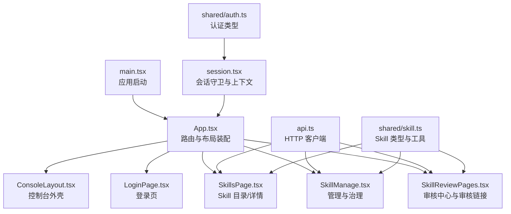
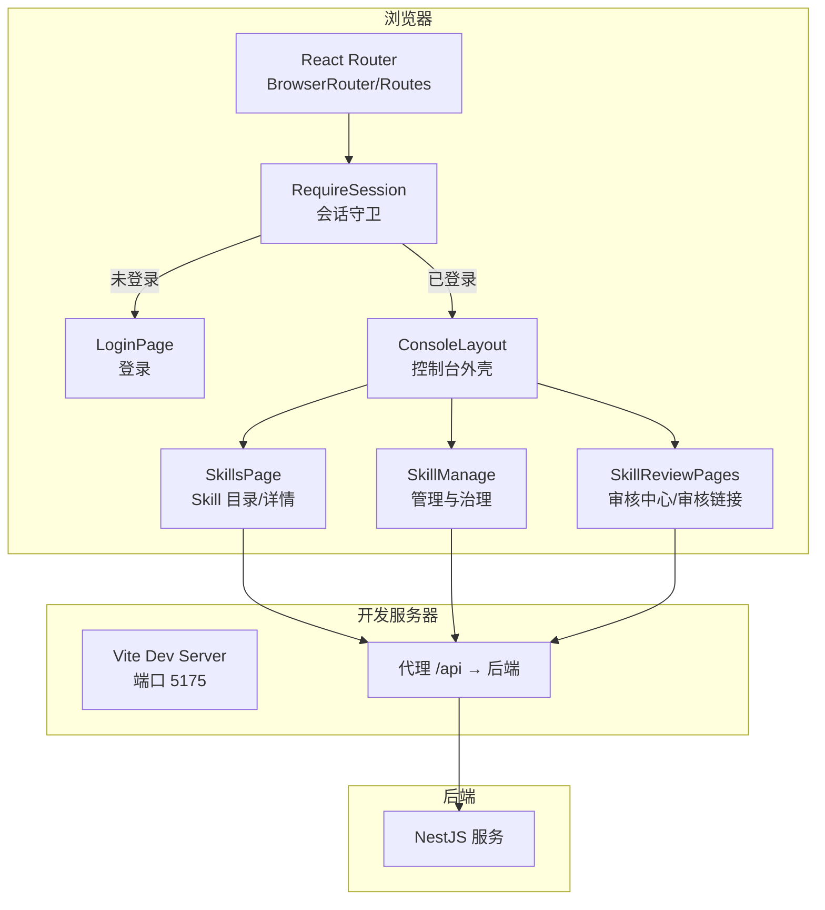
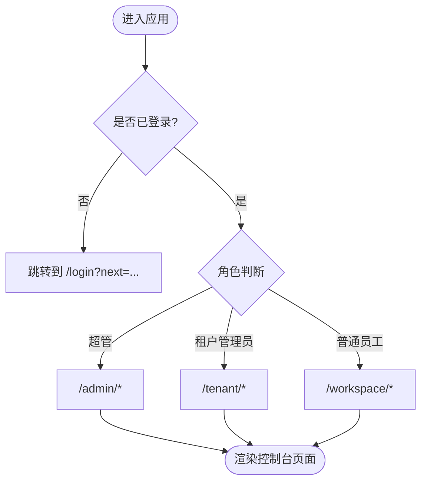
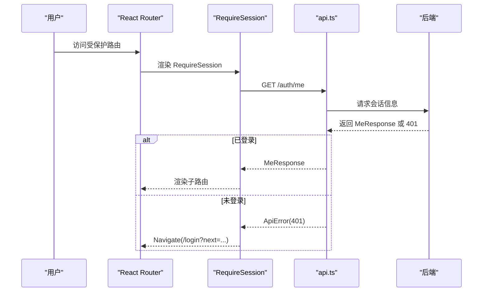
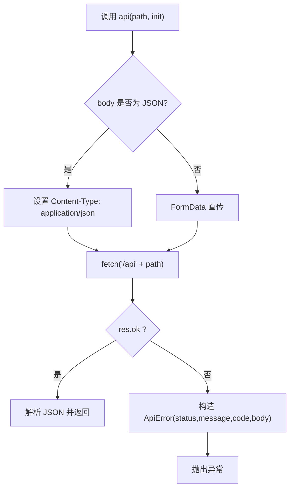
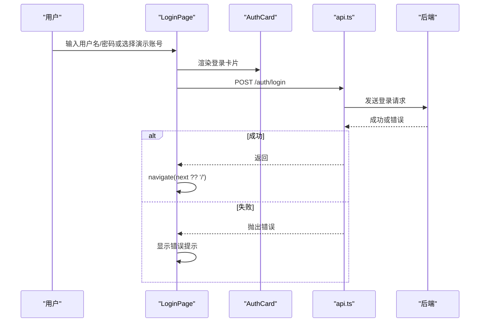
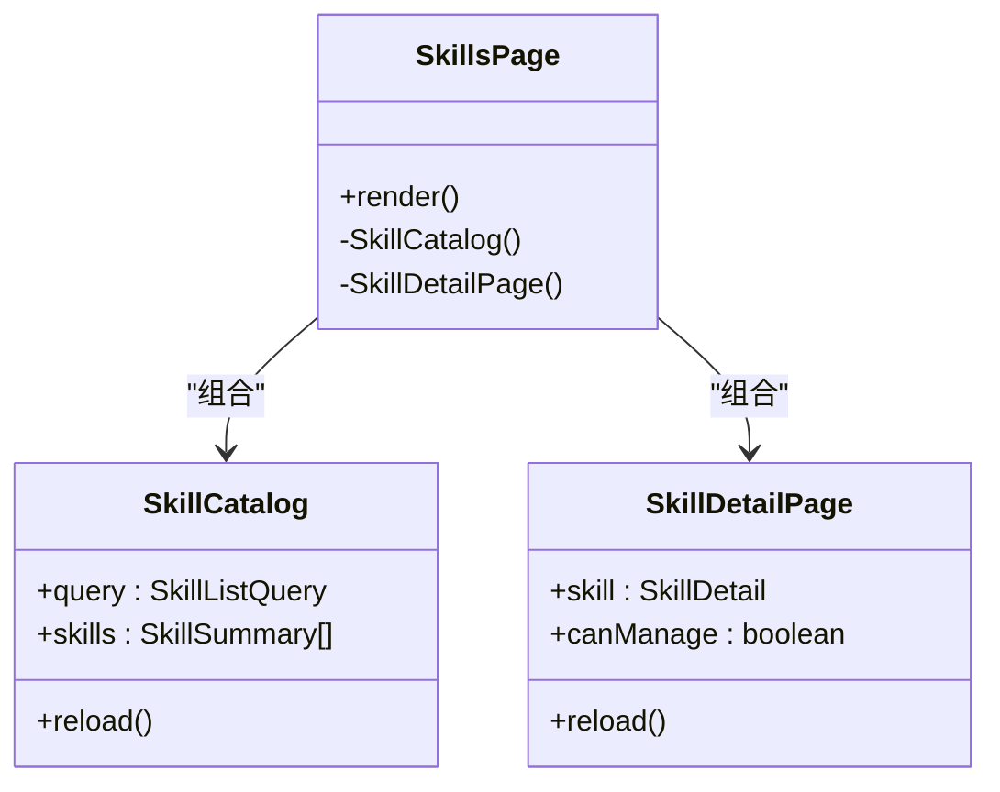
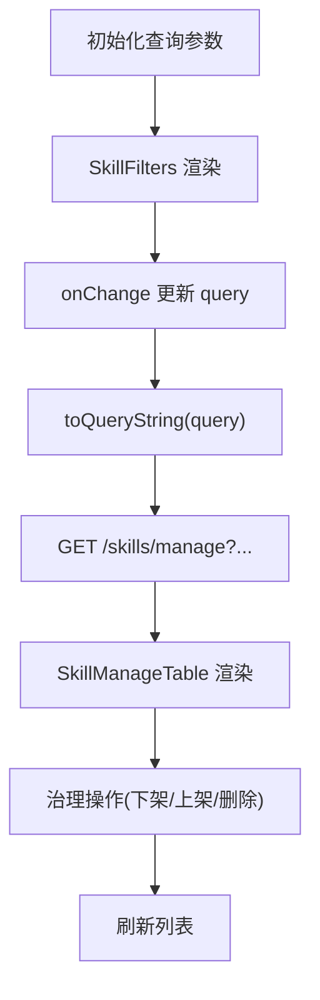
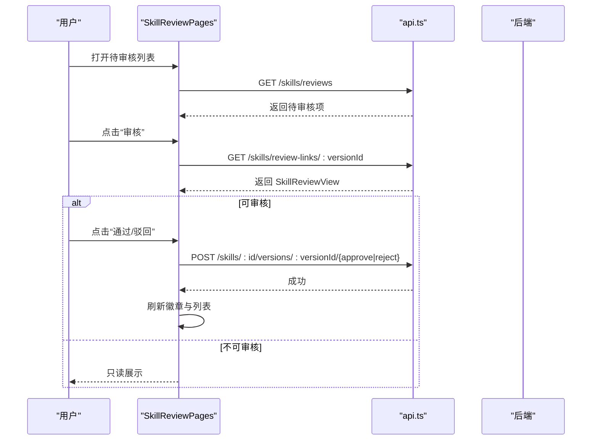
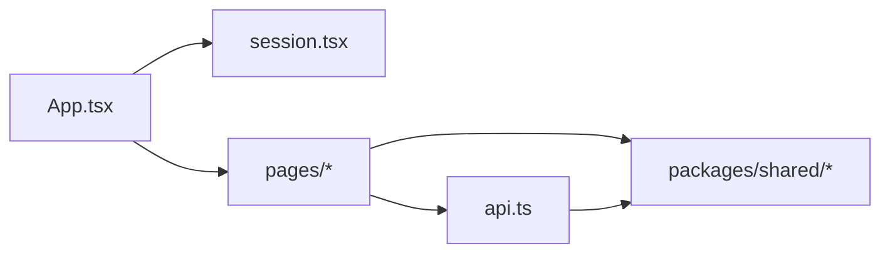

# 前端架构设计

<cite>
**本文引用的文件**   
- [main.tsx](file://apps/web/src/main.tsx)
- [App.tsx](file://apps/web/src/App.tsx)
- [vite.config.ts](file://apps/web/vite.config.ts)
- [package.json](file://apps/web/package.json)
- [api.ts](file://apps/web/src/api.ts)
- [session.tsx](file://apps/web/src/session.tsx)
- [AuthCard.tsx](file://apps/web/src/pages/AuthCard.tsx)
- [LoginPage.tsx](file://apps/web/src/pages/LoginPage.tsx)
- [ConsoleLayout.tsx](file://apps/web/src/pages/ConsoleLayout.tsx)
- [SkillsPage.tsx](file://apps/web/src/pages/SkillsPage.tsx)
- [SkillManage.tsx](file://apps/web/src/pages/SkillManage.tsx)
- [SkillReviewPages.tsx](file://apps/web/src/pages/SkillReviewPages.tsx)
- [skill.ts](file://packages/shared/src/skill.ts)
- [auth.ts](file://packages/shared/src/auth.ts)
- [index.ts](file://packages/shared/src/index.ts)
</cite>

## 目录
1. [引言](#引言)
2. [项目结构](#项目结构)
3. [核心组件](#核心组件)
4. [架构总览](#架构总览)
5. [详细组件分析](#详细组件分析)
6. [依赖关系分析](#依赖关系分析)
7. [性能与构建优化](#性能与构建优化)
8. [故障排查指南](#故障排查指南)
9. [结论](#结论)

## 引言
本文件面向基于 React + Vite 的前端应用，系统化阐述其架构设计、组件化模式、状态管理、路由组织、前后端通信机制、构建配置与优化策略，并给出组件关系图与用户交互流程图。该应用围绕“Skill”的上传、审核、分发与治理展开，提供超管、租户管理员与普通员工三类角色的控制台体验。

## 项目结构
前端位于 apps/web，采用功能页面拆分与共享类型定义分离的模式：
- 入口与全局配置：main.tsx、App.tsx、vite.config.ts、package.json
- API 与会话：api.ts、session.tsx
- 页面组件：pages 目录下按业务域划分（登录、控制台外壳、Skill 目录与管理、审核等）
- 共享类型：packages/shared 中定义 Skill、认证、租户等类型常量

图表来源
- [main.tsx:1-16](file://apps/web/src/main.tsx#L1-L16)
- [App.tsx:1-66](file://apps/web/src/App.tsx#L1-L66)
- [vite.config.ts:1-4](file://apps/web/vite.config.ts#L1-L4)
- [api.ts:1-42](file://apps/web/src/api.ts#L1-L42)
- [session.tsx:1-68](file://apps/web/src/session.tsx#L1-L68)
- [skill.ts:1-401](file://packages/shared/src/skill.ts#L1-L401)
- [auth.ts:1-39](file://packages/shared/src/auth.ts#L1-L39)

章节来源
- [main.tsx:1-16](file://apps/web/src/main.tsx#L1-L16)
- [App.tsx:1-66](file://apps/web/src/App.tsx#L1-L66)
- [vite.config.ts:1-4](file://apps/web/vite.config.ts#L1-L4)
- [package.json:1-34](file://apps/web/package.json#L1-L34)

## 核心组件
- 应用入口与全局 UI 主题：main.tsx 使用 Ant Design 的 ConfigProvider 与 App 包裹，注入中文本地化；React StrictMode 开启严格模式。
- 路由与角色导航：App.tsx 定义 BrowserRouter/Routes，按超管、租户、工作台三条路径组织页面，并通过 RequireSession 进行鉴权拦截。
- 控制台外壳：ConsoleLayout.tsx 提供侧栏菜单、顶栏当前用户与退出操作，支持折叠与错误提示。
- 登录流程：LoginPage.tsx 封装表单提交、错误展示与安全跳转 next 校验。
- Skill 业务页面：SkillsPage.tsx 负责目录浏览、搜索筛选、版本历史与下载；SkillManage.tsx 提供管理视图、治理操作（下架/上架/删除）。
- 审核流程：SkillReviewPages.tsx 提供待审核列表、全量审核记录、审核详情页与审核链接访问控制。

章节来源
- [main.tsx:1-16](file://apps/web/src/main.tsx#L1-L16)
- [App.tsx:1-66](file://apps/web/src/App.tsx#L1-L66)
- [ConsoleLayout.tsx:1-66](file://apps/web/src/pages/ConsoleLayout.tsx#L1-L66)
- [LoginPage.tsx:1-41](file://apps/web/src/pages/LoginPage.tsx#L1-L41)
- [SkillsPage.tsx:1-489](file://apps/web/src/pages/SkillsPage.tsx#L1-L489)
- [SkillManage.tsx:1-385](file://apps/web/src/pages/SkillManage.tsx#L1-L385)
- [SkillReviewPages.tsx:1-340](file://apps/web/src/pages/SkillReviewPages.tsx#L1-L340)

## 架构总览
前端以 React Router 为路由中枢，Ant Design 作为 UI 基础库，Vite 作为开发与构建工具。API 统一通过 api.ts 发起，所有后端接口以 /api 前缀代理到服务端。会话由 session.tsx 在路由层保护，未登录自动跳转登录页并携带回跳地址。

图表来源
- [App.tsx:1-66](file://apps/web/src/App.tsx#L1-L66)
- [session.tsx:1-68](file://apps/web/src/session.tsx#L1-L68)
- [LoginPage.tsx:1-41](file://apps/web/src/pages/LoginPage.tsx#L1-L41)
- [ConsoleLayout.tsx:1-66](file://apps/web/src/pages/ConsoleLayout.tsx#L1-L66)
- [SkillsPage.tsx:1-489](file://apps/web/src/pages/SkillsPage.tsx#L1-L489)
- [SkillManage.tsx:1-385](file://apps/web/src/pages/SkillManage.tsx#L1-L385)
- [SkillReviewPages.tsx:1-340](file://apps/web/src/pages/SkillReviewPages.tsx#L1-L340)
- [vite.config.ts:1-4](file://apps/web/vite.config.ts#L1-L4)

## 详细组件分析

### 路由与页面组织
- 根路由：/login 登录；/ 根据角色重定向至超管、租户或工作台。
- 超管控制台：/admin/* 下包含 Skill 列表与详情。
- 租户控制台：/tenant/* 下包含 Skill 目录、我的 Skill、审核中心与审核详情。
- 工作台：/workspace/* 下包含 Skill 目录、我的 Skill。
- 未知路由统一重定向到首页。

图表来源
- [App.tsx:1-66](file://apps/web/src/App.tsx#L1-L66)
- [session.tsx:1-68](file://apps/web/src/session.tsx#L1-L68)

章节来源
- [App.tsx:1-66](file://apps/web/src/App.tsx#L1-L66)

### 会话管理与鉴权
- RequireSession 在受保护路由内调用 /auth/me 获取当前用户信息，若返回 401 则跳转到 /login 并附带 next 参数。
- 提供 useCurrentUser、useCurrentEmployee、useMe/useSetMe 等 Hook 暴露会话数据与更新能力。
- 登录成功后通过 safeNext 校验回跳地址，仅允许内部路径，防止开放重定向。

图表来源
- [session.tsx:1-68](file://apps/web/src/session.tsx#L1-L68)
- [api.ts:1-42](file://apps/web/src/api.ts#L1-L42)

章节来源
- [session.tsx:1-68](file://apps/web/src/session.tsx#L1-L68)
- [api.ts:1-42](file://apps/web/src/api.ts#L1-L42)
- [auth.ts:1-39](file://packages/shared/src/auth.ts#L1-L39)

### API 客户端与错误处理
- api.ts 封装 fetch，统一处理 JSON 与 FormData 上传，非 2xx 抛出 ApiError，消息取自服务端响应体。
- logout 在调用失败时忽略 401（会话已失效），避免二次跳转。
- safeNext 限制回跳路径仅限内部路径，提升安全性。

图表来源
- [api.ts:1-42](file://apps/web/src/api.ts#L1-L42)

章节来源
- [api.ts:1-42](file://apps/web/src/api.ts#L1-L42)

### 登录流程
- LoginPage.tsx 提供演示账号快捷填充与表单验证，提交后调用 /auth/login，成功后安全跳转 next 或首页。
- AuthCard.tsx 提供居中的卡片布局，用于登录页统一视觉。

图表来源
- [LoginPage.tsx:1-41](file://apps/web/src/pages/LoginPage.tsx#L1-L41)
- [AuthCard.tsx:1-16](file://apps/web/src/pages/AuthCard.tsx#L1-L16)
- [api.ts:1-42](file://apps/web/src/api.ts#L1-L42)

章节来源
- [LoginPage.tsx:1-41](file://apps/web/src/pages/LoginPage.tsx#L1-L41)
- [AuthCard.tsx:1-16](file://apps/web/src/pages/AuthCard.tsx#L1-L16)

### Skill 目录与详情
- SkillsPage.tsx 提供 Skill 目录、搜索与分类筛选、下载与版本历史；详情展示当前版本、所有者、分类、可见性，并提供治理操作入口。
- 工作区与租户管理员拥有不同视图与权限，如管理标签页、分类维护、可见性与分类编辑。

图表来源
- [SkillsPage.tsx:1-489](file://apps/web/src/pages/SkillsPage.tsx#L1-L489)

章节来源
- [SkillsPage.tsx:1-489](file://apps/web/src/pages/SkillsPage.tsx#L1-L489)

### 管理与治理
- SkillManage.tsx 提供管理视图表格、过滤条件（审核状态、可见性、分类、上架状态）、治理操作（下架/上架/删除）以及超管跨租户 Skill 管理。
- toQueryString 将查询对象序列化为 URL 参数，保持 URL 可分享与可刷新。

图表来源
- [SkillManage.tsx:1-385](file://apps/web/src/pages/SkillManage.tsx#L1-L385)

章节来源
- [SkillManage.tsx:1-385](file://apps/web/src/pages/SkillManage.tsx#L1-L385)

### 审核流程
- SkillReviewPages.tsx 提供待审核列表、全量审核记录、审核详情页与审核链接访问控制。
- 审核中心：租户管理员可查看待审核与全部记录；审核详情页支持通过/驳回，驳回需填写意见。
- 审核链接：/skills/review/:versionId 根据 viewerRole 决定只读或进入控制台审核页，必要时切换租户。

图表来源
- [SkillReviewPages.tsx:1-340](file://apps/web/src/pages/SkillReviewPages.tsx#L1-L340)
- [api.ts:1-42](file://apps/web/src/api.ts#L1-L42)

章节来源
- [SkillReviewPages.tsx:1-340](file://apps/web/src/pages/SkillReviewPages.tsx#L1-L340)

## 依赖关系分析
- 组件耦合：
  - App.tsx 依赖 session.tsx 进行鉴权，依赖各页面组件进行路由装配。
  - 页面组件普遍依赖 api.ts 进行数据获取与变更，依赖 shared 类型定义保证数据结构一致。
- 外部依赖：
  - react-router 提供路由与导航能力。
  - antd 提供 UI 组件与国际化。
  - fflate、react-markdown 用于压缩包处理与 Markdown 渲染。
- 共享类型：
  - packages/shared/src/skill.ts 定义 Skill 相关类型、常量与工具函数。
  - packages/shared/src/auth.ts 定义认证与会话相关类型。
  - packages/shared/src/index.ts 导出公共常量与类型。

图表来源
- [App.tsx:1-66](file://apps/web/src/App.tsx#L1-L66)
- [session.tsx:1-68](file://apps/web/src/session.tsx#L1-L68)
- [api.ts:1-42](file://apps/web/src/api.ts#L1-L42)
- [skill.ts:1-401](file://packages/shared/src/skill.ts#L1-L401)
- [auth.ts:1-39](file://packages/shared/src/auth.ts#L1-L39)
- [index.ts:1-12](file://packages/shared/src/index.ts#L1-L12)

章节来源
- [package.json:1-34](file://apps/web/package.json#L1-L34)
- [skill.ts:1-401](file://packages/shared/src/skill.ts#L1-L401)
- [auth.ts:1-39](file://packages/shared/src/auth.ts#L1-L39)
- [index.ts:1-12](file://packages/shared/src/index.ts#L1-L12)

## 性能与构建优化
- 开发服务器：
  - vite.config.ts 配置 React 插件，端口默认 5175，严格端口占用，并将 /api 代理到后端目标（环境变量 API_TARGET 或默认 localhost:3001）。
- 构建脚本：
  - package.json 中 build 先执行 tsc --noEmit 进行类型检查，再执行 vite build 构建产物。
- 代码分割与懒加载：
  - 当前路由均为同步导入，可按需对大页面（如审核、管理）使用 React.lazy 与 Suspense 实现路由级懒加载，减少首屏体积。
- 资源优化建议：
  - 对静态资源（图片、图标）进行压缩与按需加载。
  - 对大型第三方库（如 react-markdown）考虑按需引入或替换轻量实现。
  - 利用 Vite 的预构建与缓存机制，合理拆分 vendor 包。

章节来源
- [vite.config.ts:1-4](file://apps/web/vite.config.ts#L1-L4)
- [package.json:1-34](file://apps/web/package.json#L1-L34)

## 故障排查指南
- 会话加载失败：
  - RequireSession 在 /auth/me 失败且非 401 时显示错误结果；检查网络与后端健康状态。
- 登录失败：
  - LoginPage 捕获 api 抛出的错误并展示；确认凭证正确与后端登录接口可用。
- 退出登录异常：
  - ConsoleLayout 调用 logout，若后端返回 401 会忽略错误；其他错误会显示在顶栏 Alert。
- 审核链接无权限：
  - ReviewLinkPage 对 403/404 返回相应 Result 页面；检查链接有效性与会话权限。

章节来源
- [session.tsx:1-68](file://apps/web/src/session.tsx#L1-L68)
- [LoginPage.tsx:1-41](file://apps/web/src/pages/LoginPage.tsx#L1-L41)
- [ConsoleLayout.tsx:1-66](file://apps/web/src/pages/ConsoleLayout.tsx#L1-L66)
- [SkillReviewPages.tsx:1-340](file://apps/web/src/pages/SkillReviewPages.tsx#L1-L340)

## 结论
该前端架构以 React + Vite 为基础，采用清晰的路由分层与组件职责划分，结合统一的 API 客户端与会话守卫，实现了多角色控制台与完整的 Skill 生命周期管理。通过共享类型定义保障前后端契约一致性，借助 Ant Design 提供一致的交互体验。后续可在路由懒加载、资源优化与错误边界方面进一步增强用户体验与可维护性。