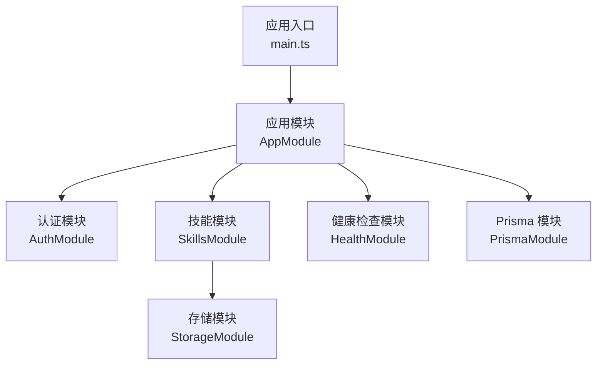
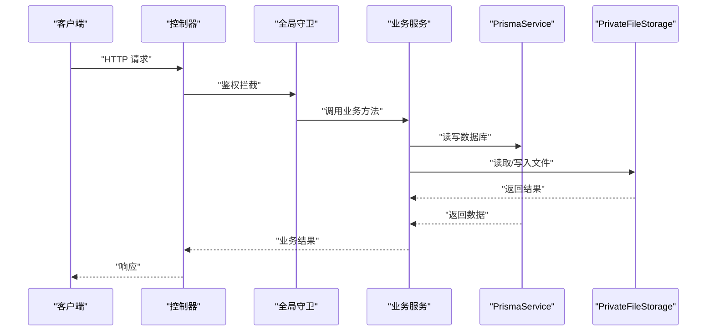
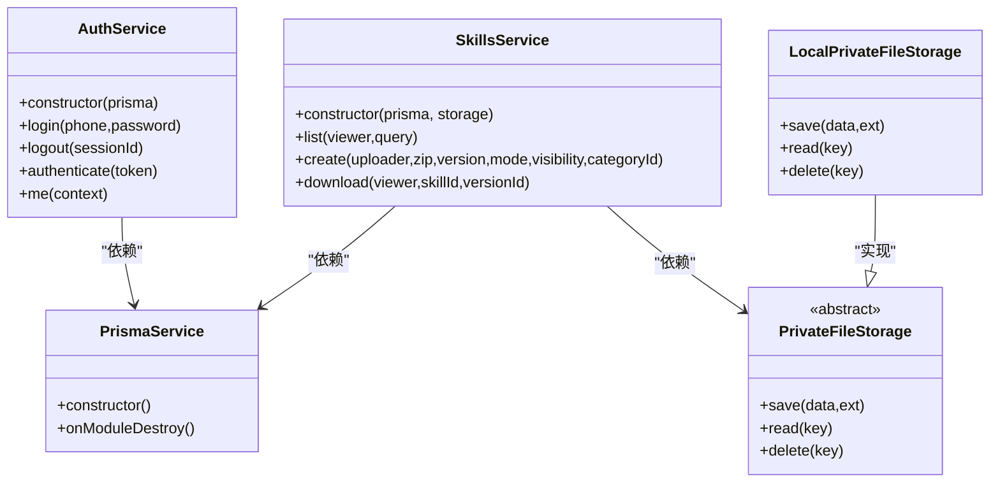
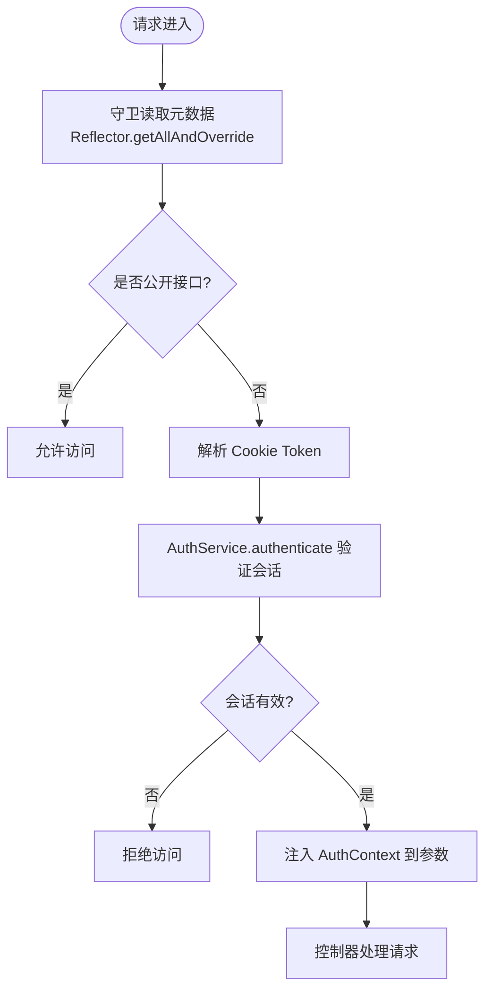
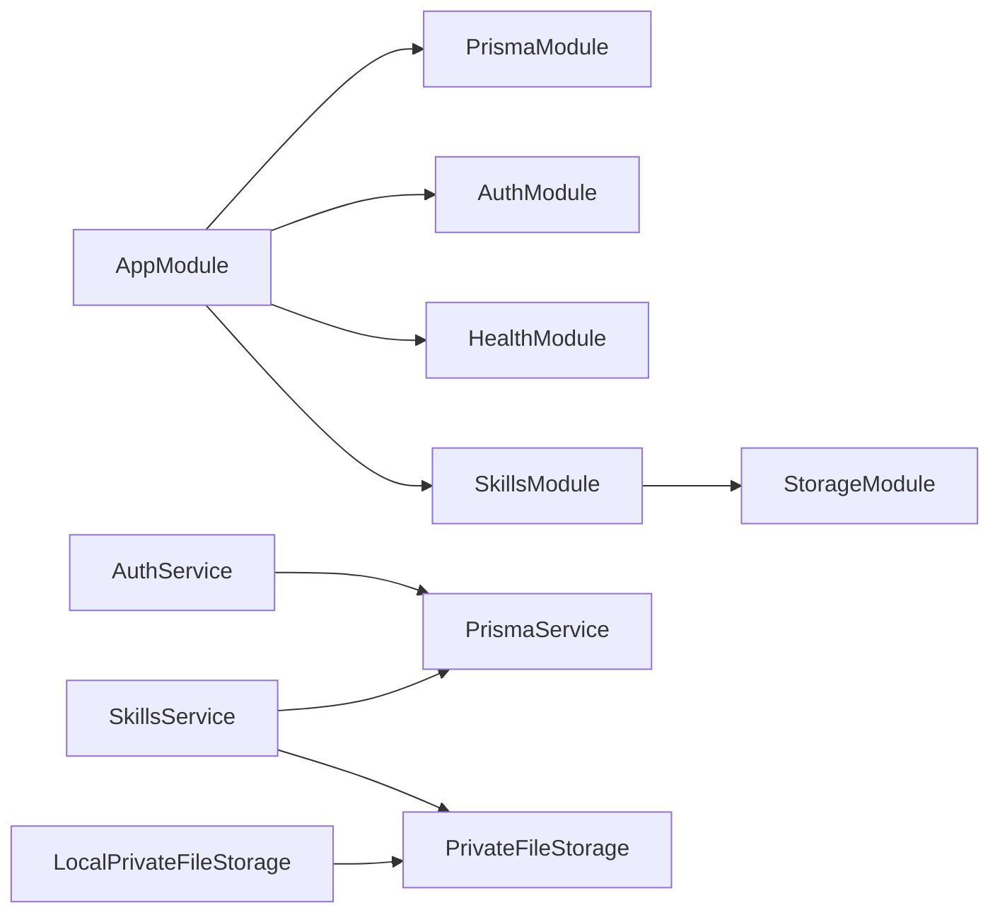
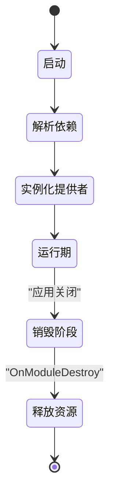

# 依赖注入机制

<cite>
**本文引用的文件**   
- [main.ts](file://apps/server/src/main.ts)
- [app.module.ts](file://apps/server/src/app.module.ts)
- [auth.module.ts](file://apps/server/src/auth/auth.module.ts)
- [skills.module.ts](file://apps/server/src/skills/skills.module.ts)
- [prisma.module.ts](file://apps/server/src/prisma/prisma.module.ts)
- [storage.module.ts](file://apps/server/src/storage/storage.module.ts)
- [auth.service.ts](file://apps/server/src/auth/auth.service.ts)
- [skills.service.ts](file://apps/server/src/skills/skills.service.ts)
- [private-file-storage.ts](file://apps/server/src/storage/private-file-storage.ts)
- [prisma.service.ts](file://apps/server/src/prisma/prisma.service.ts)
- [decorators.ts](file://apps/server/src/auth/decorators.ts)
- [app.setup.ts](file://apps/server/src/app.setup.ts)
</cite>

## 目录
1. [引言](#引言)
2. [项目结构](#项目结构)
3. [核心组件](#核心组件)
4. [架构总览](#架构总览)
5. [详细组件分析](#详细组件分析)
6. [依赖关系分析](#依赖关系分析)
7. [作用域与生命周期](#作用域与生命周期)
8. [性能考虑与优化策略](#性能考虑与优化策略)
9. [设计模式与反模式](#设计模式与反模式)
10. [故障排查指南](#故障排查指南)
11. [结论](#结论)

## 引言
本文围绕 NestJS 的依赖注入（DI）容器，结合本仓库的实际代码，系统梳理服务提供者（Providers）的定义与注册方式、模块级与全局注入的差异、自定义装饰器与元数据的注入方式，以及作用域、生命周期、性能影响和优化策略。目标是帮助读者在真实项目中正确、高效地使用 NestJS DI。

## 项目结构
本项目采用按领域划分的模块化结构：
- 应用根模块负责导入各业务模块。
- 认证模块提供鉴权守卫与服务。
- 技能模块聚合多个控制器与服务，并依赖存储抽象。
- Prisma 模块以全局模块形式暴露数据库客户端。
- 存储模块通过工厂/类映射暴露存储抽象实现。

**图表来源**
- [main.ts:8-10](file://apps/server/src/main.ts#L8-L10)
- [app.module.ts:7-9](file://apps/server/src/app.module.ts#L7-L9)
- [auth.module.ts:7-11](file://apps/server/src/auth/auth.module.ts#L7-L11)
- [skills.module.ts:13-18](file://apps/server/src/skills/skills.module.ts#L13-L18)
- [prisma.module.ts:4-8](file://apps/server/src/prisma/prisma.module.ts#L4-L8)
- [storage.module.ts:1-4](file://apps/server/src/storage/storage.module.ts#L1-L4)

**章节来源**
- [main.ts:1-13](file://apps/server/src/main.ts#L1-L13)
- [app.module.ts:1-10](file://apps/server/src/app.module.ts#L1-L10)

## 核心组件
- 应用启动与配置：
  - 入口创建 Nest 应用并加载 AppModule。
  - 统一配置前缀、Cookie 解析、参数校验管道和关闭钩子。
- 模块与提供者：
  - AppModule 聚合 PrismaModule、AuthModule、HealthModule、SkillsModule。
  - AuthModule 注册 AuthService 与全局守卫 APP_GUARD。
  - SkillsModule 注册多个 Service 并依赖 StorageModule。
  - StorageModule 使用类映射将抽象 PrivateFileStorage 绑定到 LocalPrivateFileStorage。
  - PrismaModule 标记为 @Global()，导出 PrismaService。
- 关键服务：
  - PrismaService：封装 PrismaClient，实现 OnModuleDestroy 释放连接。
  - AuthService：基于 PrismaService 进行会话与用户信息处理。
  - SkillsService：依赖 PrismaService 与 PrivateFileStorage，实现技能版本、可见性与审核流程。
  - LocalPrivateFileStorage：本地磁盘实现的私有文件存储。

**章节来源**
- [app.setup.ts:7-24](file://apps/server/src/app.setup.ts#L7-L24)
- [auth.module.ts:7-11](file://apps/server/src/auth/auth.module.ts#L7-L11)
- [skills.module.ts:13-18](file://apps/server/src/skills/skills.module.ts#L13-L18)
- [storage.module.ts:1-4](file://apps/server/src/storage/storage.module.ts#L1-L4)
- [prisma.module.ts:4-8](file://apps/server/src/prisma/prisma.module.ts#L4-L8)
- [prisma.service.ts:5-13](file://apps/server/src/prisma/prisma.service.ts#L5-L13)
- [auth.service.ts:11-13](file://apps/server/src/auth/auth.service.ts#L11-L13)
- [skills.service.ts:114-120](file://apps/server/src/skills/skills.service.ts#L114-L120)
- [private-file-storage.ts:23-40](file://apps/server/src/storage/private-file-storage.ts#L23-L40)

## 架构总览
下图展示请求从入口进入，经控制器到服务，再到数据库与存储的依赖链，体现 DI 如何贯穿整个调用栈。

**图表来源**
- [main.ts:8-10](file://apps/server/src/main.ts#L8-L10)
- [auth.guard.ts:13-18](file://apps/server/src/auth/auth.guard.ts#L13-L18)
- [auth.service.ts:11-13](file://apps/server/src/auth/auth.service.ts#L11-L13)
- [skills.service.ts:114-120](file://apps/server/src/skills/skills.service.ts#L114-L120)
- [prisma.service.ts:5-13](file://apps/server/src/prisma/prisma.service.ts#L5-L13)
- [private-file-storage.ts:23-40](file://apps/server/src/storage/private-file-storage.ts#L23-L40)

## 详细组件分析

### 服务提供者（Providers）定义与注册
- 类提供者（Class Provider）
  - 使用 @Injectable() 标注的服务类，如 AuthService、SkillsService、LocalPrivateFileStorage、PrismaService。
  - 在模块 providers 数组中直接引用类名，Nest 自动实例化并注入其构造器依赖。
- 工厂/类映射提供者（Factory/UseClass Provider）
  - StorageModule 使用 { provide: PrivateFileStorage, useClass: LocalPrivateFileStorage } 将抽象接口映射到具体实现，便于替换实现或测试时替换。
- 值提供者（Value Provider）
  - 示例：APP_GUARD 作为令牌，配合 useClass 注入全局守卫；也可用于注入常量或配置对象。
- 模块导出与消费
  - PrismaModule 使用 @Global() 并 exports: [PrismaService]，使其他模块无需显式 import 即可直接使用 PrismaService。
  - AuthModule 导出 AuthService，供其他模块按需引入。

**图表来源**
- [prisma.service.ts:5-13](file://apps/server/src/prisma/prisma.service.ts#L5-L13)
- [auth.service.ts:11-13](file://apps/server/src/auth/auth.service.ts#L11-L13)
- [skills.service.ts:114-120](file://apps/server/src/skills/skills.service.ts#L114-L120)
- [private-file-storage.ts:10-18](file://apps/server/src/storage/private-file-storage.ts#L10-L18)
- [private-file-storage.ts:23-40](file://apps/server/src/storage/private-file-storage.ts#L23-L40)

**章节来源**
- [storage.module.ts:1-4](file://apps/server/src/storage/storage.module.ts#L1-L4)
- [auth.module.ts:7-11](file://apps/server/src/auth/auth.module.ts#L7-L11)
- [prisma.module.ts:4-8](file://apps/server/src/prisma/prisma.module.ts#L4-L8)
- [skills.module.ts:13-18](file://apps/server/src/skills/skills.module.ts#L13-L18)

### 依赖注入的作用域（Singleton、Transient、Scope）
- Singleton（单例）
  - 默认作用域：每个模块内一个实例，跨控制器和服务共享。
  - 适用场景：无状态服务、数据库客户端、配置服务等。
  - 本项目中 AuthService、SkillsService、PrismaService 均为单例。
- Transient（瞬时）
  - 每次注入都创建新实例。适合需要隔离状态的轻量对象。
  - 当前仓库未直接使用，但可通过 provider 配置启用。
- Scope（作用域）
  - Request/Session 级别作用域：适合持有请求上下文或会话相关状态的对象。
  - 当前仓库未直接使用，但在复杂多租户或请求级隔离场景中可考虑。

最佳实践建议：
- 优先使用单例，避免不必要的实例化开销。
- 仅在确需隔离状态时使用 Transient 或 Request/Session 作用域。
- 对 I/O 密集或昂贵初始化对象，确保单例复用。

[本节为概念性说明，不直接分析具体文件]

### 模块级别的依赖注入与全局注入的区别
- 模块级注入
  - 通过 Module 的 imports 引入依赖模块，并在 providers 中声明依赖。
  - 例如 SkillsModule 导入 StorageModule，并使用 PrivateFileStorage。
- 全局注入
  - 使用 @Global() 标记模块后，其导出的提供者对所有模块可用，无需显式 import。
  - 例如 PrismaModule 标记为 @Global()，所有模块可直接注入 PrismaService。

对比要点：
- 全局注入简化了模块间耦合，但可能隐藏依赖关系，降低可读性。
- 模块级注入更明确，利于边界划分与测试隔离。

**章节来源**
- [skills.module.ts:13-18](file://apps/server/src/skills/skills.module.ts#L13-L18)
- [prisma.module.ts:4-8](file://apps/server/src/prisma/prisma.module.ts#L4-L8)

### 自定义装饰器与元数据的注入方式
- 元数据装饰器
  - Public、SuperAdminOnly、TenantAdminOnly、TenantMember 使用 SetMetadata 设置权限元数据。
  - 守卫通过 Reflector.getAllAndOverride 读取元数据，决定访问控制逻辑。
- 参数装饰器
  - Auth、CurrentEmployee 使用 createParamDecorator 从请求上下文中提取已解析的认证信息。
  - 控制器方法通过 @Auth() 获取 AuthContext，@CurrentEmployee() 获取当前员工上下文。

**图表来源**
- [decorators.ts:1-17](file://apps/server/src/auth/decorators.ts#L1-L17)
- [auth.guard.ts:13-18](file://apps/server/src/auth/auth.guard.ts#L13-L18)
- [auth.service.ts:30-35](file://apps/server/src/auth/auth.service.ts#L30-L35)

**章节来源**
- [decorators.ts:1-17](file://apps/server/src/auth/decorators.ts#L1-L17)
- [auth.guard.ts:13-18](file://apps/server/src/auth/auth.guard.ts#L13-L18)

## 依赖关系分析
- 模块依赖图
  - AppModule 导入 PrismaModule、AuthModule、HealthModule、SkillsModule。
  - SkillsModule 导入 StorageModule。
- 服务依赖图
  - AuthService 依赖 PrismaService。
  - SkillsService 依赖 PrismaService 与 PrivateFileStorage。
  - LocalPrivateFileStorage 实现 PrivateFileStorage。

**图表来源**
- [app.module.ts:7-9](file://apps/server/src/app.module.ts#L7-L9)
- [skills.module.ts:13-18](file://apps/server/src/skills/skills.module.ts#L13-L18)
- [auth.service.ts:11-13](file://apps/server/src/auth/auth.service.ts#L11-L13)
- [skills.service.ts:114-120](file://apps/server/src/skills/skills.service.ts#L114-L120)
- [private-file-storage.ts:23-40](file://apps/server/src/storage/private-file-storage.ts#L23-L40)

**章节来源**
- [app.module.ts:1-10](file://apps/server/src/app.module.ts#L1-L10)
- [skills.module.ts:13-18](file://apps/server/src/skills/skills.module.ts#L13-L18)

## 作用域与生命周期
- 生命周期钩子
  - OnModuleDestroy：PrismaService 在应用销毁时断开数据库连接，避免资源泄漏。
  - enableShutdownHooks：应用配置中启用关闭钩子，确保优雅退出。
- 实例化时机
  - 模块启动时，Nest 根据依赖图解析并实例化提供者。
  - 单例提供者在整个模块生命周期内复用。
- 作用域选择建议
  - 数据库客户端、存储服务、业务服务均使用单例。
  - 若存在请求级状态（如临时缓存），可考虑 Request 作用域，但需谨慎管理内存。

**图表来源**
- [prisma.service.ts:5-13](file://apps/server/src/prisma/prisma.service.ts#L5-L13)
- [app.setup.ts:23-24](file://apps/server/src/app.setup.ts#L23-L24)

**章节来源**
- [prisma.service.ts:5-13](file://apps/server/src/prisma/prisma.service.ts#L5-L13)
- [app.setup.ts:7-24](file://apps/server/src/app.setup.ts#L7-L24)

## 性能考虑与优化策略
- 单例复用
  - 数据库客户端、存储服务、业务服务均为单例，减少重复初始化成本。
- 懒加载与按需注入
  - 仅在必要时注入重型依赖，避免无关模块的初始化开销。
- 避免循环依赖
  - 通过抽象接口（如 PrivateFileStorage）解耦实现，降低耦合度。
- 批量与并发
  - 使用 Promise.all 并行查询提升吞吐（如 SkillsService 中的部门与员工列表查询）。
- 事务与锁
  - 使用 $transaction 保证一致性；必要时使用行级锁防止并发冲突。
- 存储层优化
  - 先落盘再写库，失败回滚删除文件，避免脏数据。

[本节为通用指导，不直接分析具体文件]

## 设计模式与反模式
- 推荐模式
  - 抽象接口 + 具体实现：PrivateFileStorage 抽象存储，LocalPrivateFileStorage 实现，便于替换与测试。
  - 模块边界清晰：按领域拆分模块，职责单一。
  - 全局基础设施：PrismaModule 使用 @Global() 暴露数据库客户端。
  - 守卫与装饰器：集中权限控制，增强可维护性。
- 反模式
  - 过度使用全局模块导致隐式依赖，降低可读性。
  - 在服务中直接操作 HTTP 上下文，破坏分层。
  - 在单例中保存请求级状态，引发并发问题。
  - 滥用 Transient/Request 作用域造成过多实例化。

[本节为概念性说明，不直接分析具体文件]

## 故障排查指南
- 常见问题
  - 数据库连接未释放：确认 OnModuleDestroy 是否正确实现。
  - 权限校验失败：检查装饰器元数据与守卫逻辑是否匹配。
  - 文件读取失败：确认存储 key 与路径安全（basename 防穿越）。
  - 并发冲突：检查事务与行级锁的使用是否覆盖关键路径。
- 调试建议
  - 使用统一的 ValidationPipe 错误消息定位参数问题。
  - 在守卫中打印请求上下文与元数据，辅助权限问题排查。
  - 在存储服务增加日志记录 save/read/delete 的关键步骤。

**章节来源**
- [prisma.service.ts:11-13](file://apps/server/src/prisma/prisma.service.ts#L11-L13)
- [decorators.ts:1-17](file://apps/server/src/auth/decorators.ts#L1-L17)
- [private-file-storage.ts:32-39](file://apps/server/src/storage/private-file-storage.ts#L32-L39)
- [app.setup.ts:10-22](file://apps/server/src/app.setup.ts#L10-L22)

## 结论
本仓库展示了 NestJS DI 的典型用法：通过模块组织依赖、使用类提供者与类映射提供者解耦实现、利用全局模块简化基础设施注入、借助装饰器与守卫实现权限控制。在实践中，应优先使用单例作用域，谨慎使用 Transient/Request 作用域，并通过抽象接口与事务锁保障扩展性与一致性。同时，注意全局模块的适度使用，保持依赖关系清晰可维护。