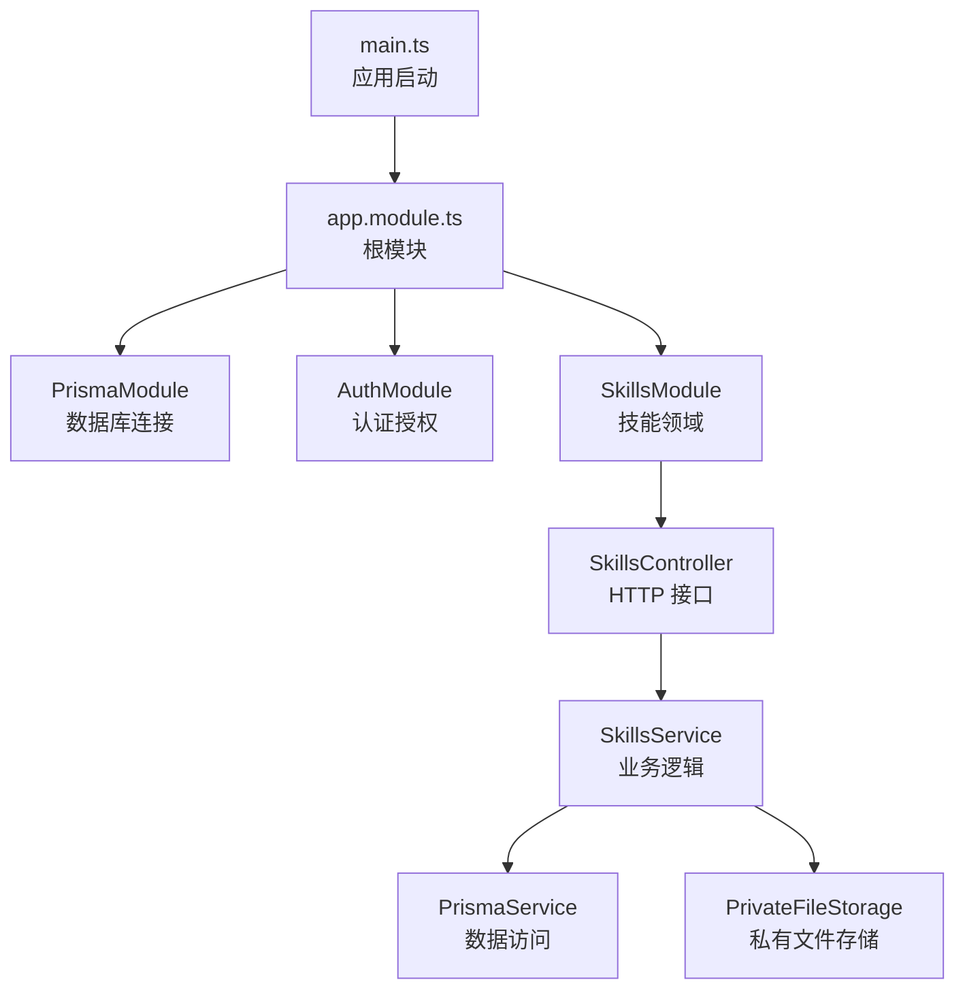
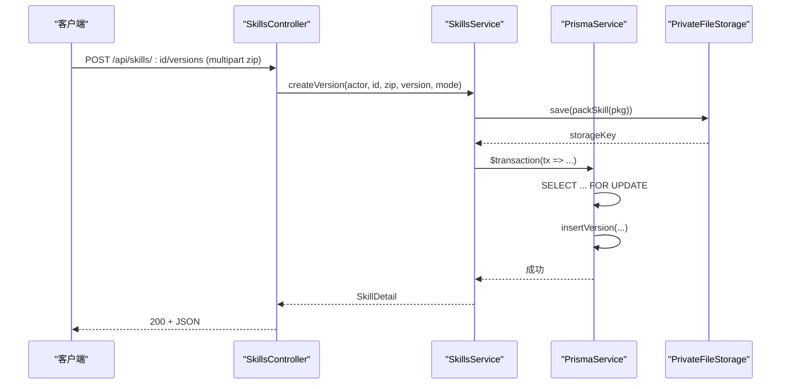
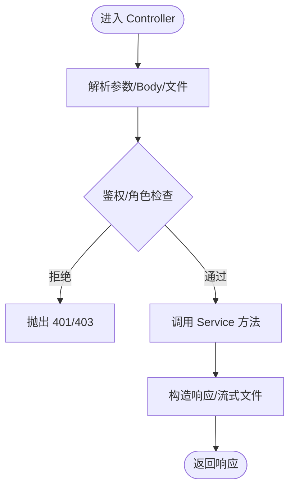
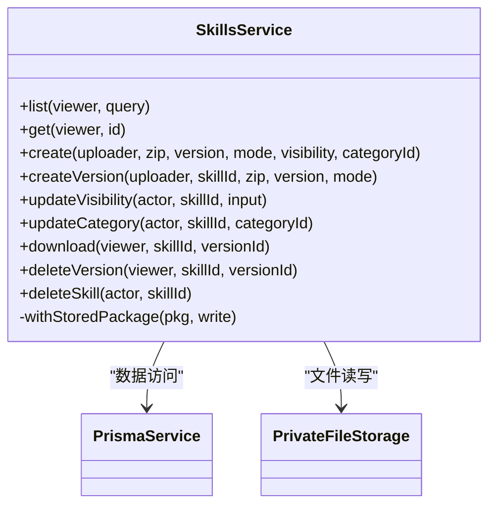
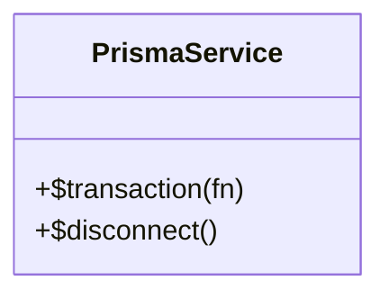
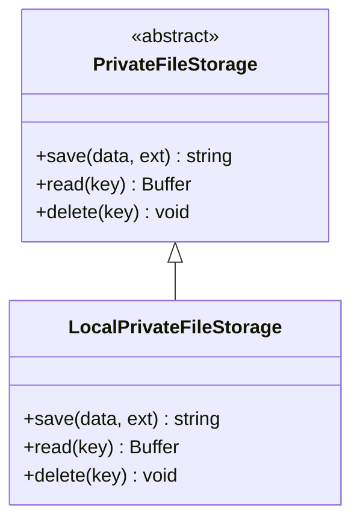
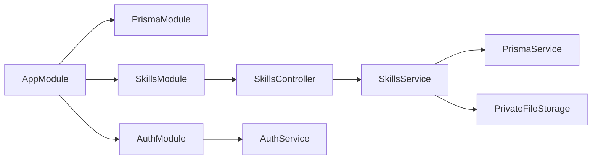

# 分层架构模式

<cite>
**本文引用的文件**   
- [main.ts](file://apps/server/src/main.ts)
- [app.module.ts](file://apps/server/src/app.module.ts)
- [app.setup.ts](file://apps/server/src/app.setup.ts)
- [auth.controller.ts](file://apps/server/src/auth/auth.controller.ts)
- [auth.service.ts](file://apps/server/src/auth/auth.service.ts)
- [decorators.ts](file://apps/server/src/auth/decorators.ts)
- [skills.controller.ts](file://apps/server/src/skills/skills.controller.ts)
- [skills.service.ts](file://apps/server/src/skills/skills.service.ts)
- [skill-views.ts](file://apps/server/src/skills/skill-views.ts)
- [skill-package.ts](file://apps/server/src/skills/skill-package.ts)
- [prisma.service.ts](file://apps/server/src/prisma/prisma.service.ts)
- [private-file-storage.ts](file://apps/server/src/storage/private-file-storage.ts)
</cite>

## 目录
1. [引言](#引言)
2. [项目结构](#项目结构)
3. [核心组件](#核心组件)
4. [架构总览](#架构总览)
5. [详细组件分析](#详细组件分析)
6. [依赖关系分析](#依赖关系分析)
7. [性能与优化](#性能与优化)
8. [故障排查指南](#故障排查指南)
9. [结论](#结论)

## 引言
本文围绕该仓库的后端实现，系统化阐述 Controller → Service → Repository（以 PrismaService 为数据访问层）的分层架构。重点说明：
- 各层职责边界：Controller 处理 HTTP、Service 封装业务、Repository 负责数据访问。
- 层间通信机制、数据流向与依赖注入带来的松耦合。
- 横切关注点：异常处理、日志记录、事务管理、鉴权与权限控制。
- 请求处理流程图与组件交互图。
- 性能优化策略：缓存、批量操作、并发安全等。
- 各层最佳实践与可复用的代码片段路径。

## 项目结构
后端基于 NestJS 模块化组织，入口启动应用并加载全局配置；根模块聚合功能模块；技能领域按 Controller/Service/工具类拆分；认证与存储作为独立能力模块。

**图表来源**
- [main.ts:8-13](file://apps/server/src/main.ts#L8-L13)
- [app.module.ts:7-9](file://apps/server/src/app.module.ts#L7-L9)
- [skills.controller.ts:13-15](file://apps/server/src/skills/skills.controller.ts#L13-L15)
- [skills.service.ts:114-120](file://apps/server/src/skills/skills.service.ts#L114-L120)
- [prisma.service.ts:5-9](file://apps/server/src/prisma/prisma.service.ts#L5-L9)
- [private-file-storage.ts:23-39](file://apps/server/src/storage/private-file-storage.ts#L23-L39)

**章节来源**
- [main.ts:8-13](file://apps/server/src/main.ts#L8-L13)
- [app.module.ts:7-9](file://apps/server/src/app.module.ts#L7-L9)

## 核心组件
- Controller 层
  - SkillsController：暴露技能相关的 REST 接口，负责参数解析、鉴权装饰器、调用 Service 并返回响应。
  - AuthController：登录、登出、当前用户信息接口。
- Service 层
  - SkillsService：封装技能的创建、版本管理、可见性、分类、审核记录、下载、删除等业务逻辑，协调 PrismaService 与 PrivateFileStorage。
  - AuthService：会话、用户、员工档案查询与鉴权上下文构建。
- Repository 层
  - PrismaService：封装 PrismaClient，提供数据库连接与事务能力。
  - PrivateFileStorage：抽象的私有文件存储接口，本地实现用于 Skill 包持久化。

**章节来源**
- [skills.controller.ts:13-144](file://apps/server/src/skills/skills.controller.ts#L13-L144)
- [auth.controller.ts:9-25](file://apps/server/src/auth/auth.controller.ts#L9-L25)
- [skills.service.ts:114-468](file://apps/server/src/skills/skills.service.ts#L114-L468)
- [auth.service.ts:11-76](file://apps/server/src/auth/auth.service.ts#L11-L76)
- [prisma.service.ts:5-14](file://apps/server/src/prisma/prisma.service.ts#L5-L14)
- [private-file-storage.ts:10-40](file://apps/server/src/storage/private-file-storage.ts#L10-L40)

## 架构总览
下图展示一次“上传新版本”的请求在三层之间的流转：Controller 接收请求并校验，Service 执行业务规则与事务，Repository 完成数据写入，同时与存储服务协作。

**图表来源**
- [skills.controller.ts:81-92](file://apps/server/src/skills/skills.controller.ts#L81-L92)
- [skills.service.ts:259-282](file://apps/server/src/skills/skills.service.ts#L259-L282)
- [skill-package.ts:59-63](file://apps/server/src/skills/skill-package.ts#L59-L63)
- [private-file-storage.ts:24-29](file://apps/server/src/storage/private-file-storage.ts#L24-L29)
- [prisma.service.ts:5-9](file://apps/server/src/prisma/prisma.service.ts#L5-L9)

## 详细组件分析

### Controller 层：请求处理与响应
- 职责
  - 解析路由、查询参数、Body、文件上传。
  - 使用装饰器进行鉴权与角色限制。
  - 将上下文（当前租户、员工、用户）组装后交给 Service。
  - 返回结构化响应或流式文件。
- 关键设计
  - 通过装饰器 @TenantMember、@TenantAdminOnly 限定访问范围。
  - 通过 @CurrentEmployee、@Auth 获取会话上下文。
  - 使用拦截器 SkillUploadInterceptor 处理文件上传。
  - 下载接口返回 StreamableFile，避免内存放大。

**图表来源**
- [skills.controller.ts:17-143](file://apps/server/src/skills/skills.controller.ts#L17-L143)
- [decorators.ts:8-17](file://apps/server/src/auth/decorators.ts#L8-L17)

**章节来源**
- [skills.controller.ts:17-143](file://apps/server/src/skills/skills.controller.ts#L17-L143)
- [auth.controller.ts:9-25](file://apps/server/src/auth/auth.controller.ts#L9-L25)
- [decorators.ts:8-17](file://apps/server/src/auth/decorators.ts#L8-L17)

### Service 层：业务编排与一致性保障
- 职责
  - 封装复杂业务规则：版本比较、可见性计算、分类校验、审核动作记录。
  - 协调数据访问与文件存储，保证事务一致性与幂等性。
  - 统一错误语义：冲突、未找到、禁止访问、参数非法。
- 关键设计
  - 使用 Prisma 事务确保多表写操作的原子性。
  - 使用行级锁（SELECT ... FOR UPDATE）串行化并发写。
  - 通过 withStoredPackage 先落盘再写库，失败时回滚文件。
  - 通过 skill-views 与 skill-visibility 复用可见性与版本转换逻辑。

**图表来源**
- [skills.service.ts:114-468](file://apps/server/src/skills/skills.service.ts#L114-L468)
- [prisma.service.ts:5-14](file://apps/server/src/prisma/prisma.service.ts#L5-L14)
- [private-file-storage.ts:10-40](file://apps/server/src/storage/private-file-storage.ts#L10-L40)

**章节来源**
- [skills.service.ts:114-468](file://apps/server/src/skills/skills.service.ts#L114-L468)
- [skill-views.ts:15-110](file://apps/server/src/skills/skill-views.ts#L15-L110)
- [skill-package.ts:19-63](file://apps/server/src/skills/skill-package.ts#L19-L63)

### Repository 层：数据访问与事务
- PrismaService
  - 继承 PrismaClient，注入数据库连接字符串，提供 $transaction 能力。
  - 模块销毁时断开连接，避免资源泄漏。
- 数据访问模式
  - 直接通过 Prisma 客户端执行查询与更新。
  - 使用条件更新与 count 判断并发状态，抛出冲突异常。
  - 使用 raw SQL 加锁（FOR UPDATE）串行化写操作。

**图表来源**
- [prisma.service.ts:5-14](file://apps/server/src/prisma/prisma.service.ts#L5-L14)

**章节来源**
- [prisma.service.ts:5-14](file://apps/server/src/prisma/prisma.service.ts#L5-L14)

### 存储层：私有文件存储
- 抽象接口 PrivateFileStorage
  - 定义 save/read/delete 三个方法，屏蔽底层实现差异。
- 本地实现 LocalPrivateFileStorage
  - 使用随机 UUID 命名，防止路径穿越（basename）。
  - 支持环境变量覆盖私有目录，便于容器挂载数据卷。

**图表来源**
- [private-file-storage.ts:10-40](file://apps/server/src/storage/private-file-storage.ts#L10-L40)

**章节来源**
- [private-file-storage.ts:10-40](file://apps/server/src/storage/private-file-storage.ts#L10-L40)

## 依赖关系分析
- 模块装配
  - AppModule 导入 PrismaModule、AuthModule、HealthModule、SkillsModule。
  - main.ts 启动 Nest 应用并调用 configureApp 设置全局前缀、Cookie、验证管道等。
- 控制器与服务依赖
  - SkillsController 依赖 SkillsService。
  - SkillsService 依赖 PrismaService 与 PrivateFileStorage。
- 鉴权与权限
  - decorators.ts 提供 Public/SuperAdminOnly/TenantAdminOnly/TenantMember 元数据与 CurrentEmployee/Auth 参数装饰器。
  - AuthService 负责会话、用户、员工信息查询与鉴权上下文构建。

**图表来源**
- [app.module.ts:7-9](file://apps/server/src/app.module.ts#L7-L9)
- [skills.controller.ts:13-15](file://apps/server/src/skills/skills.controller.ts#L13-L15)
- [skills.service.ts:114-120](file://apps/server/src/skills/skills.service.ts#L114-L120)
- [auth.controller.ts:9-11](file://apps/server/src/auth/auth.controller.ts#L9-L11)

**章节来源**
- [app.module.ts:7-9](file://apps/server/src/app.module.ts#L7-L9)
- [app.setup.ts:7-24](file://apps/server/src/app.setup.ts#L7-L24)
- [decorators.ts:8-17](file://apps/server/src/auth/decorators.ts#L8-L17)

## 性能与优化
- 并发安全
  - 使用 SELECT ... FOR UPDATE 对 Skill 行加锁，串行化上传新版本与删除版本，避免竞态条件。
  - 使用条件更新与 assertNotStale 检测状态变更，返回 409 冲突。
- 事务与一致性
  - 所有涉及多表写（Skill、SkillVersion、SkillReviewRecord、可见性名单）均包裹在 $transaction 中。
  - 文件先落盘再写库，失败时删除已保存文件，保证最终一致性。
- 查询优化
  - 列表查询仅包含必要字段与关联，减少数据传输。
  - 使用 orderBy 与分页 take 控制结果集大小。
- 存储优化
  - 私有文件使用随机文件名与 basename 防护路径穿越。
  - 打包/解包使用 fflate 流式处理，限制文件大小与数量，防 Zip Bomb。
- 建议的进一步优化
  - 引入 Redis 缓存热门 Skill 详情与分类树，降低热点读压力。
  - 对大文件下载采用分片与断点续传，提升用户体验。
  - 对高频只读接口增加缓存失效策略（如按 SkillId 失效）。
  - 对批量操作（如批量下架/上架）使用事务与批量更新 API。

[本节为通用性能指导，不直接分析具体文件]

## 故障排查指南
- 常见异常类型
  - BadRequestException：参数非法、压缩包格式错误、版本号不合法。
  - ConflictException：重复操作、状态不一致、已有未正式版本。
  - ForbiddenException：越权访问、非所有者修改草稿。
  - NotFoundException：Skill/版本不存在。
  - UnauthorizedException：账号密码错误或演示账号未初始化。
- 定位要点
  - 查看 Controller 的参数绑定与装饰器是否生效。
  - 检查 Service 中的业务校验与事务边界。
  - 确认 Prisma 事务是否捕获并正确抛出异常。
  - 检查文件存储路径权限与磁盘空间。
- 调试建议
  - 开启全局验证管道异常工厂，统一前端提示文案。
  - 在关键分支添加日志（如事务开始/结束、文件保存/删除）。
  - 使用 e2e 测试用例验证并发场景与权限边界。

**章节来源**
- [app.setup.ts:10-22](file://apps/server/src/app.setup.ts#L10-L22)
- [skills.service.ts:43-46](file://apps/server/src/skills/skills.service.ts#L43-L46)
- [skill-views.ts:103-110](file://apps/server/src/skills/skill-views.ts#L103-L110)
- [auth.service.ts:15-23](file://apps/server/src/auth/auth.service.ts#L15-L23)

## 结论
该项目的后端实现了清晰的三层架构：Controller 专注 HTTP 契约与鉴权，Service 封装复杂业务与一致性，Repository（PrismaService）提供稳定数据访问。通过依赖注入、装饰器与事务机制，系统具备良好的可扩展性与可维护性。结合文件存储抽象与并发控制策略，系统在安全性与性能上达到平衡。建议在后续迭代中引入缓存、批处理与更完善的监控日志，进一步提升吞吐与可观测性。