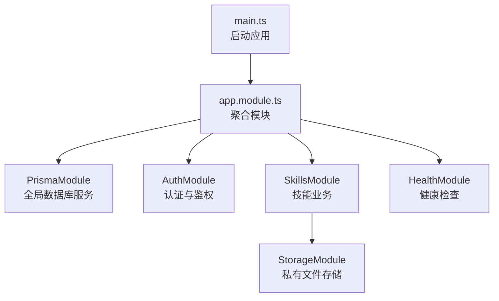
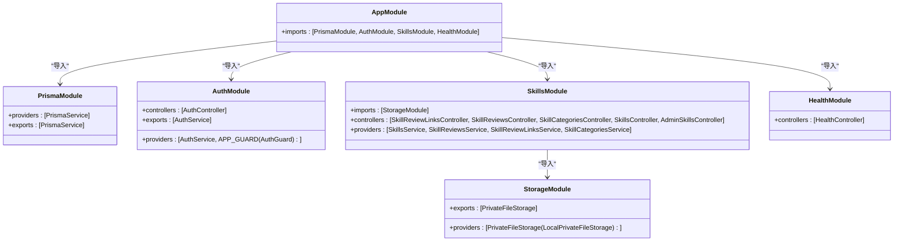
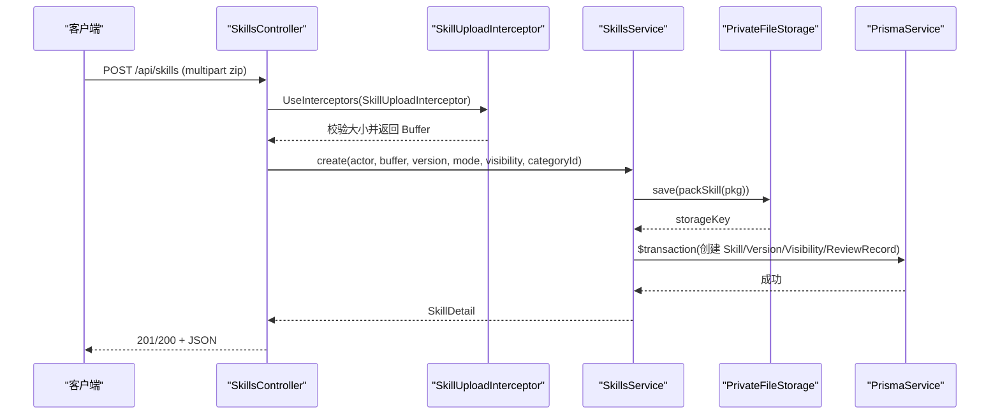
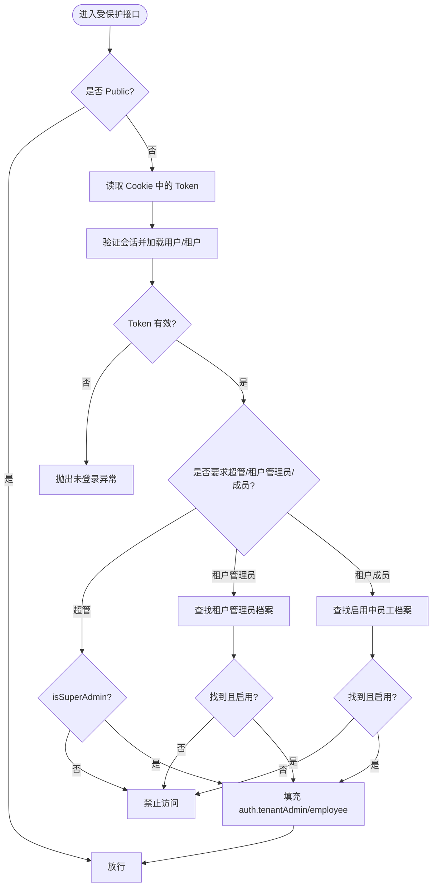
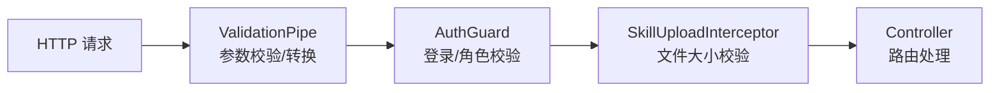
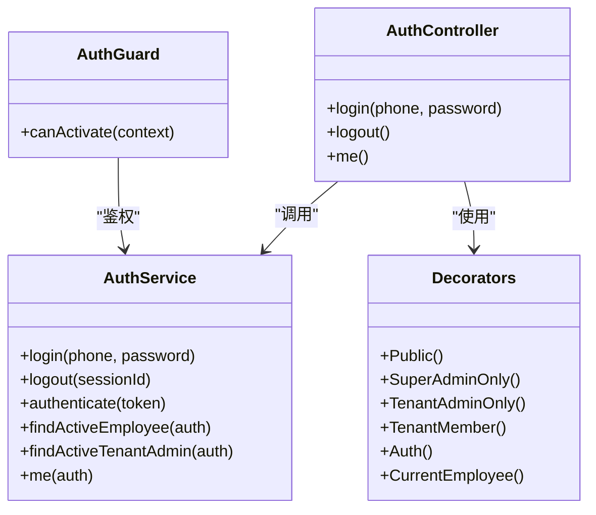
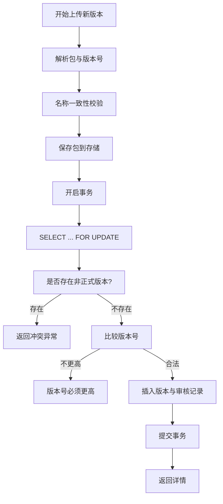
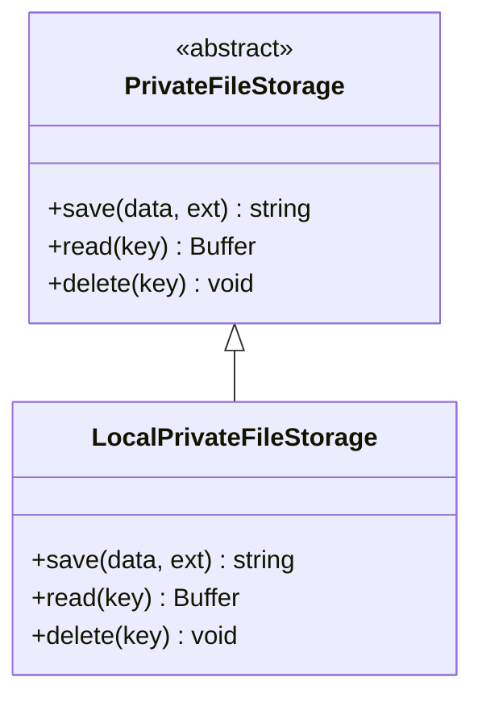
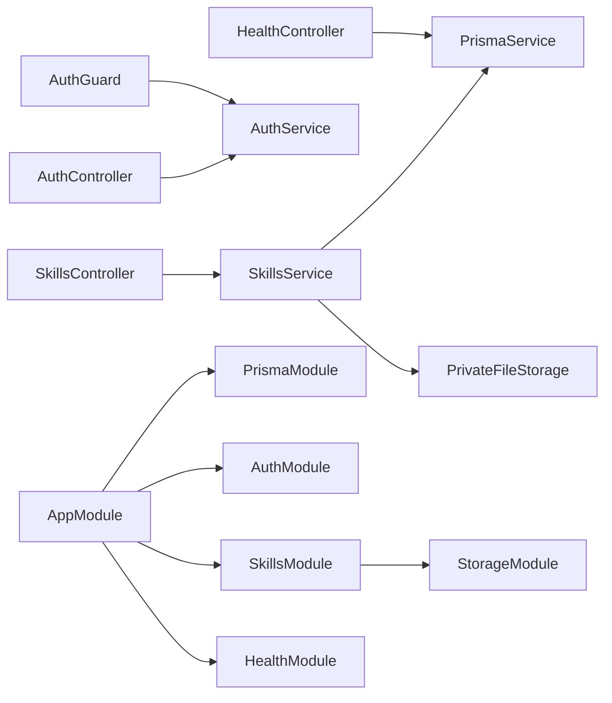

# 后端架构设计

<cite>
**本文引用的文件**   
- [main.ts](file://apps/server/src/main.ts)
- [app.module.ts](file://apps/server/src/app.module.ts)
- [app.setup.ts](file://apps/server/src/app.setup.ts)
- [auth.module.ts](file://apps/server/src/auth/auth.module.ts)
- [auth.controller.ts](file://apps/server/src/auth/auth.controller.ts)
- [auth.service.ts](file://apps/server/src/auth/auth.service.ts)
- [auth.guard.ts](file://apps/server/src/auth/auth.guard.ts)
- [decorators.ts](file://apps/server/src/auth/decorators.ts)
- [session.ts](file://apps/server/src/auth/session.ts)
- [skills.module.ts](file://apps/server/src/skills/skills.module.ts)
- [skills.controller.ts](file://apps/server/src/skills/skills.controller.ts)
- [skills.service.ts](file://apps/server/src/skills/skills.service.ts)
- [skill-upload.ts](file://apps/server/src/skills/skill-upload.ts)
- [storage.module.ts](file://apps/server/src/storage/storage.module.ts)
- [private-file-storage.ts](file://apps/server/src/storage/private-file-storage.ts)
- [prisma.module.ts](file://apps/server/src/prisma/prisma.module.ts)
- [prisma.service.ts](file://apps/server/src/prisma/prisma.service.ts)
- [health.controller.ts](file://apps/server/src/health/health.controller.ts)
- [health.module.ts](file://apps/server/src/health/health.module.ts)
</cite>

## 目录
1. [引言](#引言)
2. [项目结构](#项目结构)
3. [核心模块与职责划分](#核心模块与职责划分)
4. [分层架构与请求处理流程](#分层架构与请求处理流程)
5. [依赖注入与扩展点](#依赖注入与扩展点)
6. [多租户与权限模型](#多租户与权限模型)
7. [中间件、拦截器与守卫](#中间件拦截器与守卫)
8. [详细组件分析](#详细组件分析)
9. [依赖关系图](#依赖关系图)
10. [性能与可扩展性](#性能与可扩展性)
11. [故障排查指南](#故障排查指南)
12. [结论](#结论)

## 引言
本文件面向基于 NestJS 的后端服务，系统性解析模块化架构、分层模式（Controller → Service → Repository）、依赖注入机制、多租户数据隔离策略、权限控制模型以及中间件、拦截器、守卫等特性的使用方式。文档同时提供架构图、类图、时序图和流程图，帮助读者从宏观到微观理解系统设计与实现细节。

## 项目结构
后端应用位于 apps/server 下，采用按领域划分的模块组织：
- 入口与全局配置：main.ts、app.module.ts、app.setup.ts
- 认证模块：auth/*
- 技能业务模块：skills/*
- 存储抽象与本地实现：storage/*
- 数据库访问封装：prisma/*
- 健康检查：health/*

**图表来源**
- [main.ts:8-11](file://apps/server/src/main.ts#L8-L11)
- [app.module.ts:7-9](file://apps/server/src/app.module.ts#L7-L9)

**章节来源**
- [main.ts:1-14](file://apps/server/src/main.ts#L1-L14)
- [app.module.ts:1-10](file://apps/server/src/app.module.ts#L1-L10)

## 核心模块与职责划分
- PrismaModule：以 @Global() 暴露 PrismaService，供全应用直接注入；负责数据库连接生命周期管理。
- AuthModule：注册 AuthController、AuthService，并全局启用 AuthGuard；导出 AuthService 供其他模块复用。
- SkillsModule：聚合技能相关控制器与服务，依赖 StorageModule 进行包文件读写。
- StorageModule：通过 DI 容器将 PrivateFileStorage 抽象绑定到 LocalPrivateFileStorage 实现。
- HealthModule：对外暴露健康检查接口，校验数据库连通性。

**图表来源**
- [app.module.ts:7-9](file://apps/server/src/app.module.ts#L7-L9)
- [prisma.module.ts:4-9](file://apps/server/src/prisma/prisma.module.ts#L4-L9)
- [auth.module.ts:7-11](file://apps/server/src/auth/auth.module.ts#L7-L11)
- [skills.module.ts:13-18](file://apps/server/src/skills/skills.module.ts#L13-L18)
- [storage.module.ts:1-4](file://apps/server/src/storage/storage.module.ts#L1-L4)
- [health.module.ts:4-7](file://apps/server/src/health/health.module.ts#L4-L7)

**章节来源**
- [prisma.module.ts:1-10](file://apps/server/src/prisma/prisma.module.ts#L1-L10)
- [auth.module.ts:1-13](file://apps/server/src/auth/auth.module.ts#L1-L13)
- [skills.module.ts:1-19](file://apps/server/src/skills/skills.module.ts#L1-L19)
- [storage.module.ts:1-5](file://apps/server/src/storage/storage.module.ts#L1-L5)
- [health.module.ts:1-8](file://apps/server/src/health/health.module.ts#L1-L8)

## 分层架构与请求处理流程
分层遵循 Controller → Service → Repository（PrismaService）模式：
- Controller：接收 HTTP 请求，参数校验、鉴权上下文注入、调用 Service。
- Service：业务编排、事务、权限判断、调用存储与数据库。
- Repository：PrismaService 作为统一数据访问层，屏蔽底层 ORM 细节。

以“上传技能包”为例的时序如下：

**图表来源**
- [skills.controller.ts:47-57](file://apps/server/src/skills/skills.controller.ts#L47-L57)
- [skill-upload.ts:1-12](file://apps/server/src/skills/skill-upload.ts#L1-L12)
- [skills.service.ts:224-253](file://apps/server/src/skills/skills.service.ts#L224-L253)
- [private-file-storage.ts:23-30](file://apps/server/src/storage/private-file-storage.ts#L23-L30)
- [prisma.service.ts:5-14](file://apps/server/src/prisma/prisma.service.ts#L5-L14)

**章节来源**
- [skills.controller.ts:1-145](file://apps/server/src/skills/skills.controller.ts#L1-L145)
- [skills.service.ts:1-500](file://apps/server/src/skills/skills.service.ts#L1-L500)
- [skill-upload.ts:1-13](file://apps/server/src/skills/skill-upload.ts#L1-L13)
- [private-file-storage.ts:1-41](file://apps/server/src/storage/private-file-storage.ts#L1-L41)
- [prisma.service.ts:1-15](file://apps/server/src/prisma/prisma.service.ts#L1-L15)

## 依赖注入与扩展点
- 全局模块：PrismaModule 标记为 @Global()，所有模块可直接注入 PrismaService，无需重复 import。
- 跨模块导出：AuthModule 导出 AuthService，SkillsModule 可复用认证能力。
- 抽象与实现解耦：StorageModule 将 PrivateFileStorage 抽象绑定到 LocalPrivateFileStorage，便于未来替换为对象存储。
- 装饰器参数注入：@Auth()、@CurrentEmployee() 从 Express Request 上读取 auth 上下文，简化控制器签名。

最佳实践：
- 将共享基础设施（如数据库、存储）以模块形式集中管理并通过 exports 暴露。
- 使用装饰器声明式地表达横切关注点（鉴权、当前租户员工），避免在控制器中重复逻辑。
- 对易变的外部依赖（如文件存储）定义抽象接口，通过 DI 容器切换实现。

**章节来源**
- [prisma.module.ts:1-10](file://apps/server/src/prisma/prisma.module.ts#L1-L10)
- [auth.module.ts:7-11](file://apps/server/src/auth/auth.module.ts#L7-L11)
- [storage.module.ts:1-4](file://apps/server/src/storage/storage.module.ts#L1-L4)
- [decorators.ts:12-17](file://apps/server/src/auth/decorators.ts#L12-L17)

## 多租户与权限模型
- 会话上下文：登录成功后生成 token，写入 Cookie；服务端根据 token 查询 Session，得到用户、是否超管、当前租户 ID。
- 角色与权限：
  - 超管：isSuperAdmin 为 true，可访问仅超管接口。
  - 租户管理员：@TenantAdminOnly 校验后，填充 tenantAdmin 信息。
  - 租户成员：@TenantMember 校验后，填充 employee 信息。
- 数据隔离：所有业务查询强制携带 tenantId，非当前租户的数据视为不存在（404）。

**图表来源**
- [auth.guard.ts:20-46](file://apps/server/src/auth/auth.guard.ts#L20-L46)
- [auth.service.ts:30-49](file://apps/server/src/auth/auth.service.ts#L30-L49)
- [session.ts:5-23](file://apps/server/src/auth/session.ts#L5-L23)

**章节来源**
- [auth.guard.ts:1-49](file://apps/server/src/auth/auth.guard.ts#L1-L49)
- [auth.service.ts:1-77](file://apps/server/src/auth/auth.service.ts#L1-L77)
- [session.ts:1-30](file://apps/server/src/auth/session.ts#L1-L30)
- [decorators.ts:1-18](file://apps/server/src/auth/decorators.ts#L1-L18)

## 中间件、拦截器与守卫
- 全局管道：ValidationPipe 开启白名单与转换，统一错误消息格式，提升前端展示体验。
- Cookie 解析：cookie-parser 用于解析登录 Cookie。
- 全局守卫：AuthGuard 默认要求登录，并结合装饰器实现细粒度权限控制。
- 文件上传拦截器：SkillUploadInterceptor 限制压缩包大小，结合 requireFile 确保必填字段。

**图表来源**
- [app.setup.ts:7-24](file://apps/server/src/app.setup.ts#L7-L24)
- [auth.guard.ts:1-49](file://apps/server/src/auth/auth.guard.ts#L1-L49)
- [skill-upload.ts:1-12](file://apps/server/src/skills/skill-upload.ts#L1-L12)

**章节来源**
- [app.setup.ts:1-26](file://apps/server/src/app.setup.ts#L1-L26)
- [auth.guard.ts:1-49](file://apps/server/src/auth/auth.guard.ts#L1-L49)
- [skill-upload.ts:1-13](file://apps/server/src/skills/skill-upload.ts#L1-L13)

## 详细组件分析

### 认证模块（AuthModule）
- 职责：提供登录、登出、获取当前用户信息；维护会话与 Cookie；全局鉴权守卫。
- 关键交互：
  - 登录：校验演示账号，创建 Session，设置 Cookie。
  - 鉴权：从 Cookie 取 token，反查 Session，填充 auth 上下文。
  - 权限：根据装饰器校验超管、租户管理员、租户成员。

**图表来源**
- [auth.controller.ts:9-25](file://apps/server/src/auth/auth.controller.ts#L9-L25)
- [auth.service.ts:11-76](file://apps/server/src/auth/auth.service.ts#L11-L76)
- [auth.guard.ts:13-48](file://apps/server/src/auth/auth.guard.ts#L13-L48)
- [decorators.ts:1-18](file://apps/server/src/auth/decorators.ts#L1-L18)

**章节来源**
- [auth.controller.ts:1-26](file://apps/server/src/auth/auth.controller.ts#L1-L26)
- [auth.service.ts:1-77](file://apps/server/src/auth/auth.service.ts#L1-L77)
- [auth.guard.ts:1-49](file://apps/server/src/auth/auth.guard.ts#L1-L49)
- [decorators.ts:1-18](file://apps/server/src/auth/decorators.ts#L1-L18)

### 技能业务模块（SkillsModule）
- 职责：提供技能的增删改查、版本管理、可见性与分类管理、下载与管理视图。
- 关键逻辑：
  - 上传：校验包大小、解析 SKILL.md、名称冲突检测、持久化包与元数据、记录审核动作。
  - 并发安全：使用 FOR UPDATE 锁与事务保证版本唯一性与一致性。
  - 权限：所有者或租户管理员可修改可见性/分类/删除；租户管理员可下架/上架。

**图表来源**
- [skills.service.ts:259-282](file://apps/server/src/skills/skills.service.ts#L259-L282)
- [skills.service.ts:475-499](file://apps/server/src/skills/skills.service.ts#L475-L499)

**章节来源**
- [skills.controller.ts:1-145](file://apps/server/src/skills/skills.controller.ts#L1-L145)
- [skills.service.ts:1-500](file://apps/server/src/skills/skills.service.ts#L1-L500)

### 存储模块（StorageModule）
- 职责：抽象私有文件存储接口并提供本地磁盘实现；文件名随机化、路径穿越防护。
- 关键点：
  - 抽象类 PrivateFileStorage 定义 save/read/delete。
  - LocalPrivateFileStorage 使用环境变量 PRIVATE_UPLOAD_DIR 指定目录。
  - read/delete 使用 basename 防止路径穿越。

**图表来源**
- [private-file-storage.ts:10-40](file://apps/server/src/storage/private-file-storage.ts#L10-L40)

**章节来源**
- [storage.module.ts:1-5](file://apps/server/src/storage/storage.module.ts#L1-L5)
- [private-file-storage.ts:1-41](file://apps/server/src/storage/private-file-storage.ts#L1-L41)

### 数据库模块（PrismaModule）
- 职责：提供全局 PrismaService，封装连接与销毁生命周期。
- 关键点：
  - @Global() 使 PrismaService 在全局可用。
  - OnModuleDestroy 中断开连接，避免进程退出时资源泄漏。

**章节来源**
- [prisma.module.ts:1-10](file://apps/server/src/prisma/prisma.module.ts#L1-L10)
- [prisma.service.ts:1-15](file://apps/server/src/prisma/prisma.service.ts#L1-L15)

### 健康检查模块（HealthModule）
- 职责：对外暴露 /health 接口，执行 SELECT 1 校验数据库可用性。
- 关键点：
  - 使用 @Public() 跳过鉴权。
  - 捕获异常并返回结构化健康状态。

**章节来源**
- [health.controller.ts:1-21](file://apps/server/src/health/health.controller.ts#L1-L21)
- [health.module.ts:1-8](file://apps/server/src/health/health.module.ts#L1-L8)

## 依赖关系图

**图表来源**
- [skills.controller.ts:1-145](file://apps/server/src/skills/skills.controller.ts#L1-L145)
- [skills.service.ts:1-500](file://apps/server/src/skills/skills.service.ts#L1-L500)
- [auth.controller.ts:1-26](file://apps/server/src/auth/auth.controller.ts#L1-L26)
- [auth.guard.ts:1-49](file://apps/server/src/auth/auth.guard.ts#L1-L49)
- [health.controller.ts:1-21](file://apps/server/src/health/health.controller.ts#L1-L21)
- [app.module.ts:7-9](file://apps/server/src/app.module.ts#L7-L9)

**章节来源**
- [app.module.ts:1-10](file://apps/server/src/app.module.ts#L1-L10)

## 性能与可扩展性
- 数据库访问：
  - 使用 Prisma 事务与行级锁（FOR UPDATE）保证并发安全，减少竞争条件。
  - 查询包含必要关联字段，避免 N+1 问题。
- 文件存储：
  - 先落盘再写库，失败回滚时清理临时文件，保障一致性。
  - 抽象存储接口，便于迁移至对象存储以提升吞吐与可靠性。
- 鉴权与缓存：
  - 会话校验走数据库，可在高频读场景引入 Redis 缓存会话以提升性能。
- 可扩展性：
  - 模块边界清晰，新增功能可通过新模块与控制器/服务扩展。
  - 权限模型通过装饰器扩展，新增角色只需添加守卫分支与装饰器。

[本节为通用指导，不直接分析具体文件]

## 故障排查指南
- 登录失败：
  - 检查演示账号初始化与用户/员工/租户状态。
  - 确认 Cookie 是否正确设置与传输（secure/lax/httpOnly）。
- 鉴权异常：
  - 未登录：检查 Cookie 与 Token 有效性。
  - 仅超管/租户管理员/成员：检查装饰器使用与会话中的 currentTenantId。
- 上传失败：
  - 包大小超限：调整拦截器阈值或前端限制。
  - 名称冲突：根据返回的 skillId 提示用户选择已有 Skill 上传新版本。
- 版本冲突：
  - 存在草稿或审核中版本：先处理进行中版本后再上传。
  - 版本号不高于最高版本：严格递增版本号。
- 健康检查异常：
  - 数据库不可用：检查 DATABASE_URL 与数据库服务状态。

**章节来源**
- [auth.service.ts:15-35](file://apps/server/src/auth/auth.service.ts#L15-L35)
- [auth.guard.ts:20-46](file://apps/server/src/auth/auth.guard.ts#L20-L46)
- [skill-upload.ts:1-12](file://apps/server/src/skills/skill-upload.ts#L1-L12)
- [skills.service.ts:259-282](file://apps/server/src/skills/skills.service.ts#L259-L282)
- [health.controller.ts:11-19](file://apps/server/src/health/health.controller.ts#L11-L19)

## 结论
该后端服务采用清晰的模块化与分层架构，结合 NestJS 的依赖注入、守卫与拦截器机制，实现了稳健的多租户权限控制与数据隔离。通过抽象存储接口与事务/行锁保障数据一致性，具备良好的可扩展性与可维护性。建议在后续迭代中引入会话缓存、优化大文件流式处理，并持续完善监控与日志体系，进一步提升系统的稳定性与可观测性。