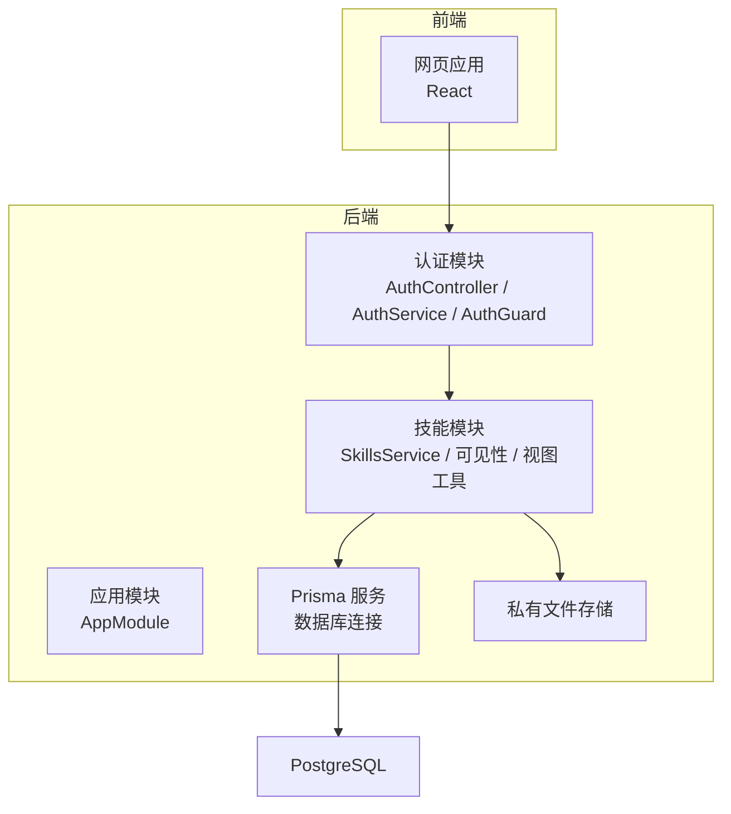
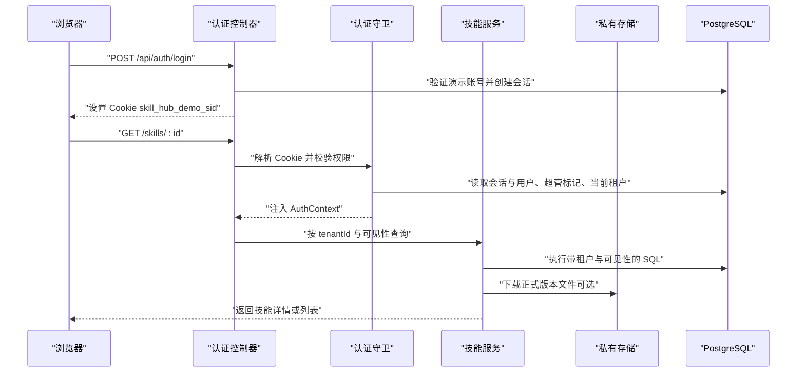
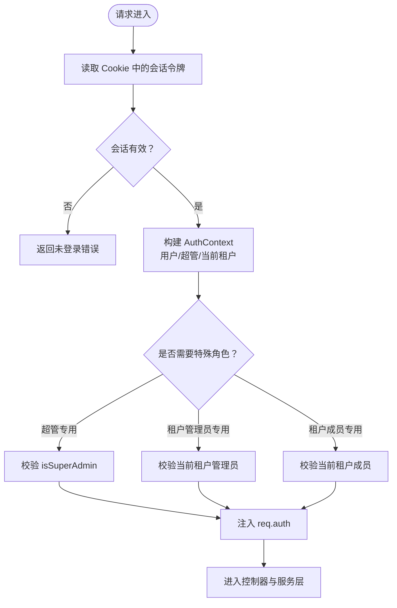
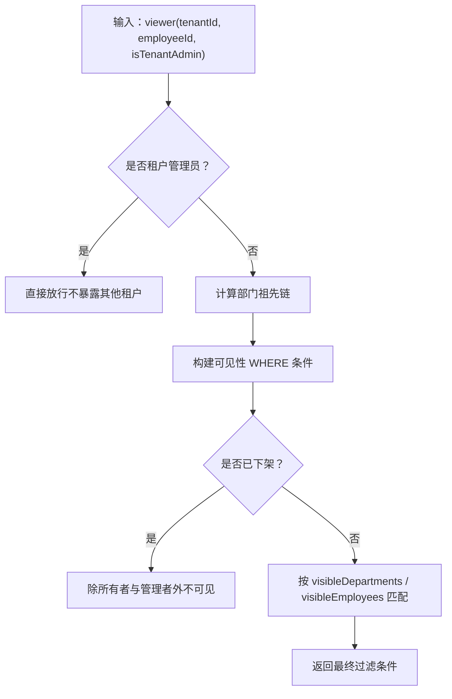
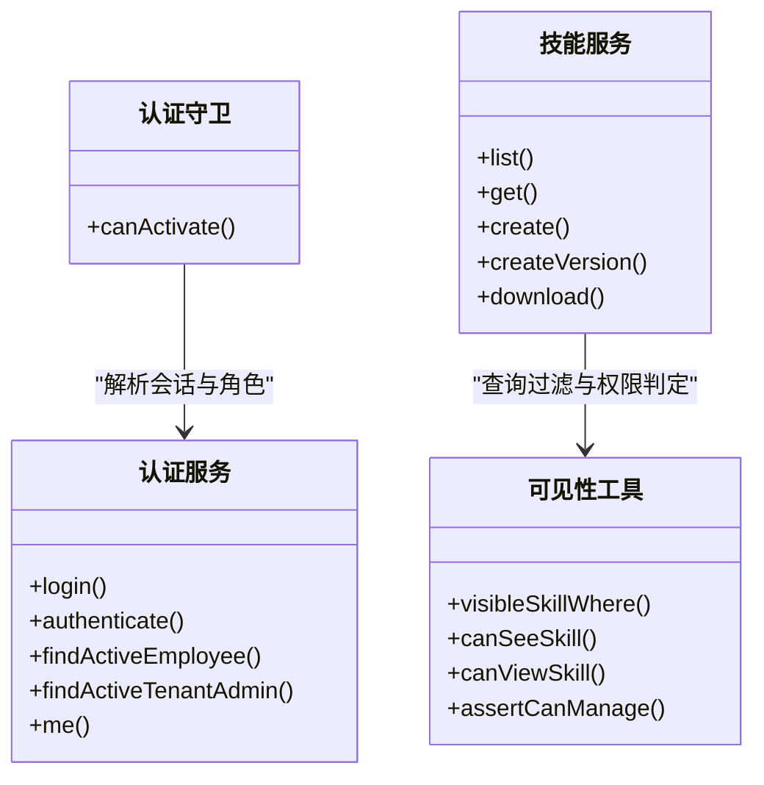
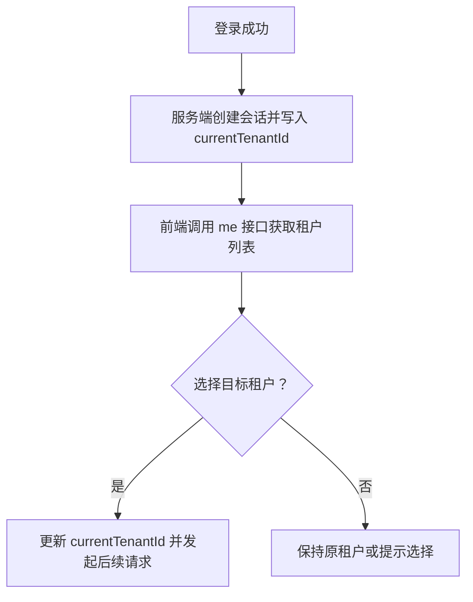
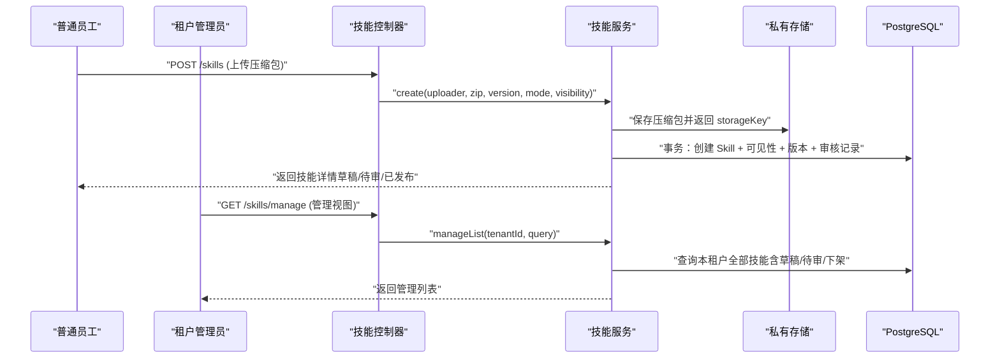
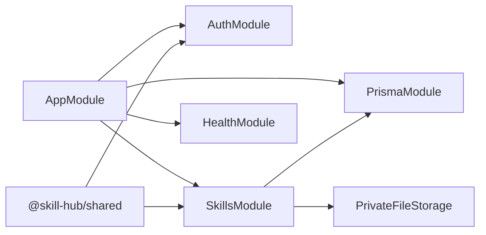

# 多租户架构

<cite>
**本文引用的文件**   
- [README.md](file://README.md)
- [apps/server/src/app.module.ts](file://apps/server/src/app.module.ts)
- [apps/server/src/auth/auth.controller.ts](file://apps/server/src/auth/auth.controller.ts)
- [apps/server/src/auth/auth.guard.ts](file://apps/server/src/auth/auth.guard.ts)
- [apps/server/src/auth/auth.service.ts](file://apps/server/src/auth/auth.service.ts)
- [apps/server/src/auth/decorators.ts](file://apps/server/src/auth/decorators.ts)
- [apps/server/src/auth/session.ts](file://apps/server/src/auth/session.ts)
- [apps/server/src/prisma/prisma.service.ts](file://apps/server/src/prisma/prisma.service.ts)
- [apps/server/prisma/schema.prisma](file://apps/server/prisma/schema.prisma)
- [packages/shared/src/index.ts](file://packages/shared/src/index.ts)
- [packages/shared/src/auth.ts](file://packages/shared/src/auth.ts)
- [packages/shared/src/tenant.ts](file://packages/shared/src/tenant.ts)
- [apps/server/src/skills/skills.service.ts](file://apps/server/src/skills/skills.service.ts)
- [apps/server/src/skills/skill-visibility.ts](file://apps/server/src/skills/skill-visibility.ts)
- [apps/server/src/skills/skill-views.ts](file://apps/server/src/skills/skill-views.ts)
- [apps/server/src/skills/skill-upload.ts](file://apps/server/src/skills/skill-upload.ts)
- [apps/server/src/skills/skill-categories.service.ts](file://apps/server/src/skills/skill-categories.service.ts)
</cite>

## 目录
1. [简介](#简介)
2. [项目结构](#项目结构)
3. [核心组件](#核心组件)
4. [架构总览](#架构总览)
5. [详细组件分析](#详细组件分析)
6. [依赖关系分析](#依赖关系分析)
7. [性能与扩展性](#性能与扩展性)
8. [安全与合规](#安全与合规)
9. [故障排查指南](#故障排查指南)
10. [结论](#结论)
11. [附录：API 与数据模型要点](#附录api-与数据模型要点)

## 简介
本仓库实现了一个企业级多租户演示系统，围绕“技能包（Skill）”的上传、审核、版本管理、分类与可见范围控制展开。系统在服务端采用 NestJS + Prisma + PostgreSQL，前端为 React；通过会话 Cookie 维持登录态，并在请求上下文中注入当前用户、是否超管、当前租户及员工档案等上下文信息。所有业务数据均按租户隔离，结合行级权限与查询过滤实现细粒度访问控制。

## 项目结构
- 应用层
  - apps/server：NestJS 后端，包含认证、健康检查、Prisma 客户端封装、技能领域模块、存储模块等。
  - apps/web：React 前端，提供登录、技能目录、管理视图、分类维护等页面。
- 共享包
  - packages/shared：前后端共享的类型、常量与接口定义，包括会话 Cookie 名称、租户类型、认证响应等。
- 数据库
  - apps/server/prisma/schema.prisma：统一描述租户、部门、员工、技能、版本、分类、可见性映射表等实体与关系。
- 部署与脚本
  - deploy、scripts、docker-compose.*：容器化与本地开发辅助。

**图表来源**
- [apps/server/src/app.module.ts:7-9](file://apps/server/src/app.module.ts#L7-L9)
- [apps/server/src/auth/auth.controller.ts:9-25](file://apps/server/src/auth/auth.controller.ts#L9-L25)
- [apps/server/src/skills/skills.service.ts:114-120](file://apps/server/src/skills/skills.service.ts#L114-L120)
- [apps/server/src/prisma/prisma.service.ts:5-13](file://apps/server/src/prisma/prisma.service.ts#L5-L13)

**章节来源**
- [README.md:1-67](file://README.md#L1-L67)
- [apps/server/src/app.module.ts:1-10](file://apps/server/src/app.module.ts#L1-L10)

## 核心组件
- 认证与会话
  - 登录接口设置会话 Cookie，会话中保存当前租户 ID。
  - 全局守卫解析 Cookie，校验登录态并填充请求上下文。
  - 装饰器区分公开接口、超管专用、租户管理员专用、租户成员专用。
- 租户与员工
  - 会话携带 currentTenantId；员工档案绑定 tenantId、departmentId、isTenantAdmin。
  - 可进入租户的条件为员工与租户均处于启用状态。
- 技能与可见性
  - 技能属于特定租户，支持按租户、部门、员工、仅本人四种可见范围。
  - 查询时根据当前员工部门树与可见名单动态生成过滤条件。
- 版本与审核
  - 草稿、审核中、已发布三种版本状态；不同角色上传时的初始状态与审核动作不同。
  - 审核记录持久化操作人、动作与评论，支持撤回、重新上传、变更可见性与分类等审计。

**章节来源**
- [apps/server/src/auth/auth.controller.ts:9-25](file://apps/server/src/auth/auth.controller.ts#L9-L25)
- [apps/server/src/auth/auth.guard.ts:8-47](file://apps/server/src/auth/auth.guard.ts#L8-L47)
- [apps/server/src/auth/decorators.ts:4-17](file://apps/server/src/auth/decorators.ts#L4-L17)
- [apps/server/src/auth/auth.service.ts:15-74](file://apps/server/src/auth/auth.service.ts#L15-L74)
- [packages/shared/src/auth.ts:1-39](file://packages/shared/src/auth.ts#L1-L39)
- [apps/server/prisma/schema.prisma:48-102](file://apps/server/prisma/schema.prisma#L48-L102)
- [apps/server/src/skills/skill-visibility.ts:7-106](file://apps/server/src/skills/skill-visibility.ts#L7-L106)
- [apps/server/src/skills/skills.service.ts:89-108](file://apps/server/src/skills/skills.service.ts#L89-L108)

## 架构总览
下图展示从浏览器到数据库的多租户数据流：Cookie 中的会话令牌在每次请求中被守卫解析，构造出当前用户、是否超管、当前租户与员工身份；控制器将身份传递给服务层，服务层基于 tenantId 进行数据隔离，并通过可见性规则进一步限制查询结果。

**图表来源**
- [apps/server/src/auth/auth.controller.ts:12-24](file://apps/server/src/auth/auth.controller.ts#L12-L24)
- [apps/server/src/auth/auth.guard.ts:20-46](file://apps/server/src/auth/auth.guard.ts#L20-L46)
- [apps/server/src/auth/auth.service.ts:15-35](file://apps/server/src/auth/auth.service.ts#L15-L35)
- [apps/server/src/skills/skills.service.ts:126-143](file://apps/server/src/skills/skills.service.ts#L126-L143)
- [apps/server/src/skills/skills.service.ts:431-438](file://apps/server/src/skills/skills.service.ts#L431-L438)

## 详细组件分析

### 租户上下文与权限控制流程
- 会话建立
  - 登录成功后在服务端创建会话，写入当前租户 ID（若用户有可用租户）。
  - 使用随机令牌作为会话值，服务端以 SHA-256 摘要形式持久化。
- 请求鉴权
  - 全局守卫从 Cookie 中读取会话令牌，校验有效期后返回 AuthContext。
  - 根据装饰器判断是否为超管、租户管理员或租户成员，并填充 tenantAdmin 与 employee 上下文。
- 资源访问
  - 控制器通过 CurrentEmployee 获取当前租户与员工身份，再调用服务层方法。
  - 服务层对所有查询强制附加 tenantId，确保跨租户不可见。

**图表来源**
- [apps/server/src/auth/auth.guard.ts:20-46](file://apps/server/src/auth/auth.guard.ts#L20-L46)
- [apps/server/src/auth/auth.service.ts:30-49](file://apps/server/src/auth/auth.service.ts#L30-L49)
- [apps/server/src/auth/decorators.ts:8-17](file://apps/server/src/auth/decorators.ts#L8-L17)

**章节来源**
- [apps/server/src/auth/auth.controller.ts:12-24](file://apps/server/src/auth/auth.controller.ts#L12-L24)
- [apps/server/src/auth/auth.guard.ts:8-47](file://apps/server/src/auth/auth.guard.ts#L8-L47)
- [apps/server/src/auth/auth.service.ts:15-49](file://apps/server/src/auth/auth.service.ts#L15-L49)
- [apps/server/src/auth/session.ts:3-23](file://apps/server/src/auth/session.ts#L3-L23)

### 数据隔离策略：行级约束与查询过滤
- 行级隔离
  - 所有核心业务表（如 Skill、SkillCategory、Department、Employee）均包含 tenantId，并通过唯一索引与外键保证归属。
  - 查询一律以 viewer.tenantId 作为首要过滤条件，其他租户的数据视为不存在。
- 可见性过滤
  - 对非管理员员工，按可见范围（租户、部门、员工、仅本人）与是否下架进行组合过滤。
  - 部门可见性会递归计算当前员工的部门及其上级部门链，命中任一即允许访问。
- 版本与审核可见性
  - 所有者与租户管理员可查看非正式版本与审核记录；普通员工只能看到有正式版本且满足可见性的技能。

**图表来源**
- [apps/server/src/skills/skill-visibility.ts:29-57](file://apps/server/src/skills/skill-visibility.ts#L29-L57)
- [apps/server/src/skills/skill-views.ts:93-101](file://apps/server/src/skills/skill-views.ts#L93-L101)

**章节来源**
- [apps/server/prisma/schema.prisma:48-162](file://apps/server/prisma/schema.prisma#L48-L162)
- [apps/server/src/skills/skill-visibility.ts:7-106](file://apps/server/src/skills/skill-visibility.ts#L7-L106)
- [apps/server/src/skills/skills.service.ts:126-143](file://apps/server/src/skills/skills.service.ts#L126-L143)

### 权限控制模型：角色与资源访问
- 角色
  - 超管：跨租户治理，可查看所有租户的技能与审核记录。
  - 租户管理员：本租户内管理分类、可见性、上架/下架、删除等。
  - 普通员工：上传技能（默认提交审核）、查看可见范围内的技能、管理自己的草稿。
- 资源访问
  - 控制器通过 @TenantAdminOnly、@TenantMember、@SuperAdminOnly 限定入口。
  - 服务层通过 canManage、canViewSkill、visibleSkillWhere 等方法实现细粒度权限。

**图表来源**
- [apps/server/src/auth/auth.guard.ts:14-47](file://apps/server/src/auth/auth.guard.ts#L14-L47)
- [apps/server/src/auth/auth.service.ts:15-74](file://apps/server/src/auth/auth.service.ts#L15-L74)
- [apps/server/src/skills/skills.service.ts:126-143](file://apps/server/src/skills/skills.service.ts#L126-L143)
- [apps/server/src/skills/skill-visibility.ts:38-74](file://apps/server/src/skills/skill-visibility.ts#L38-L74)

**章节来源**
- [apps/server/src/auth/decorators.ts:4-17](file://apps/server/src/auth/decorators.ts#L4-L17)
- [apps/server/src/skills/skill-views.ts:17-26](file://apps/server/src/skills/skill-views.ts#L17-L26)
- [apps/server/src/skills/skill-visibility.ts:38-74](file://apps/server/src/skills/skill-visibility.ts#L38-L74)

### 租户配置管理与动态切换机制
- 租户配置
  - 租户表包含 id、name、status、avatarUrl、remark 等字段；状态为 active/disabled。
  - 员工档案与租户关联，只有当员工与租户均为 active 时才可进入该租户。
- 动态切换
  - 会话中保存 currentTenantId；登录后 me 接口返回用户在多个租户下的档案与当前租户。
  - 前端可根据 employees 列表切换 currentTenantId，后续请求自动在该租户下执行。

**图表来源**
- [apps/server/src/auth/auth.service.ts:20-35](file://apps/server/src/auth/auth.service.ts#L20-L35)
- [apps/server/src/auth/auth.service.ts:51-74](file://apps/server/src/auth/auth.service.ts#L51-L74)
- [packages/shared/src/auth.ts:16-32](file://packages/shared/src/auth.ts#L16-L32)
- [apps/server/prisma/schema.prisma:48-60](file://apps/server/prisma/schema.prisma#L48-L60)

**章节来源**
- [packages/shared/src/tenant.ts:1-3](file://packages/shared/src/tenant.ts#L1-L3)
- [apps/server/src/auth/auth.service.ts:20-74](file://apps/server/src/auth/auth.service.ts#L20-L74)
- [apps/server/prisma/schema.prisma:48-102](file://apps/server/prisma/schema.prisma#L48-L102)

### 多租户数据流图（上传与审核）

**图表来源**
- [apps/server/src/skills/skills.service.ts:224-253](file://apps/server/src/skills/skills.service.ts#L224-L253)
- [apps/server/src/skills/skills.service.ts:146-174](file://apps/server/src/skills/skills.service.ts#L146-L174)
- [apps/server/src/skills/skill-upload.ts:5-12](file://apps/server/src/skills/skill-upload.ts#L5-L12)

**章节来源**
- [apps/server/src/skills/skills.service.ts:224-253](file://apps/server/src/skills/skills.service.ts#L224-L253)
- [apps/server/src/skills/skills.service.ts:146-174](file://apps/server/src/skills/skills.service.ts#L146-L174)

## 依赖关系分析
- 模块依赖
  - AppModule 导入 PrismaModule、AuthModule、HealthModule、SkillsModule。
  - SkillsModule 依赖 PrismaService 与 PrivateFileStorage。
- 外部依赖
  - PrismaPg 适配器连接 PostgreSQL。
  - Multer 用于 multipart 文件上传（由拦截器封装）。
- 共享依赖
  - packages/shared 导出 API 前缀、健康路径、认证与租户类型等。

**图表来源**
- [apps/server/src/app.module.ts:7-9](file://apps/server/src/app.module.ts#L7-L9)
- [apps/server/src/prisma/prisma.service.ts:5-13](file://apps/server/src/prisma/prisma.service.ts#L5-L13)
- [packages/shared/src/index.ts:1-12](file://packages/shared/src/index.ts#L1-L12)

**章节来源**
- [apps/server/src/app.module.ts:1-10](file://apps/server/src/app.module.ts#L1-L10)
- [apps/server/src/prisma/prisma.service.ts:1-15](file://apps/server/src/prisma/prisma.service.ts#L1-L15)
- [packages/shared/src/index.ts:1-12](file://packages/shared/src/index.ts#L1-L12)

## 性能与扩展性
- 查询优化
  - 列表查询先按“有正式版本”粗筛，再进行关键词与上传者筛选，减少无效结果集。
  - 可见性过滤通过 OR 条件与部门祖先链一次性构建，避免多次往返。
- 并发控制
  - 上传新版本与删除版本时使用 SELECT ... FOR UPDATE 锁住 Skill 行，串行化关键路径。
  - 分类创建时对 Tenant 行加锁，防止同一租户并发超限。
- 存储与 IO
  - 先落盘再写库，失败时回滚删除临时文件，保证一致性。
  - 下载正式版本后递增下载次数，非正式版本不计数，降低统计开销。
- 可扩展性建议
  - 引入缓存层（如 Redis）缓存部门树与可见性选项，减少高频查询压力。
  - 对大文件下载与打包解压考虑异步任务队列，避免阻塞主线程。
  - 针对多租户场景，可在数据库层面按租户分库或分区，提升水平扩展能力。

[本节为通用指导，无需代码引用]

## 安全与合规
- 会话安全
  - Cookie 使用 httpOnly、sameSite=lax，并根据环境变量决定是否启用 secure。
  - 会话令牌在服务端以 SHA-256 摘要存储，避免明文泄露。
- 权限最小化
  - 默认接口需登录；超管、租户管理员、租户成员分别受装饰器保护。
  - 非正式版本与审核记录仅所有者与管理者可访问。
- 数据隔离
  - 所有查询强制附加 tenantId；其他租户数据视为不存在。
  - 可见性规则对非管理员员工进行严格过滤，避免越权访问。
- 审计与追溯
  - 所有重要操作（发布、提交、撤回、批准、拒绝、重新上传、变更可见性/分类、下架/上架）均记录审核日志。

**章节来源**
- [apps/server/src/auth/auth.controller.ts:8-24](file://apps/server/src/auth/auth.controller.ts#L8-L24)
- [apps/server/src/auth/auth.guard.ts:8-47](file://apps/server/src/auth/auth.guard.ts#L8-L47)
- [apps/server/src/skills/skills.service.ts:388-409](file://apps/server/src/skills/skills.service.ts#L388-L409)
- [apps/server/src/skills/skill-visibility.ts:38-74](file://apps/server/src/skills/skill-visibility.ts#L38-L74)

## 故障排查指南
- 登录失败
  - 检查演示账号是否存在；若尚未初始化，请先运行 setup。
  - 确认 Cookie 是否正确设置与传递。
- 权限不足
  - 确认当前租户是否已选择；租户管理员接口需要 isTenantAdmin。
  - 租户成员接口需要当前租户下存在启用中的员工档案。
- 数据不可见
  - 检查技能是否已发布；非正式版本仅所有者与管理者可看。
  - 检查可见性设置与部门树是否命中；确认未下架。
- 并发冲突
  - 上传新版本或删除版本时出现状态变化错误，请刷新后重试。
  - 分类数量超过上限时，需清理或等待后台限额调整。

**章节来源**
- [apps/server/src/auth/auth.service.ts:15-24](file://apps/server/src/auth/auth.service.ts#L15-L24)
- [apps/server/src/auth/auth.guard.ts:29-44](file://apps/server/src/auth/auth.guard.ts#L29-L44)
- [apps/server/src/skills/skill-views.ts:103-110](file://apps/server/src/skills/skill-views.ts#L103-L110)
- [apps/server/src/skills/skill-categories.service.ts:34-44](file://apps/server/src/skills/skill-categories.service.ts#L34-L44)

## 结论
本系统通过“会话上下文 + 装饰器守卫 + 服务层可见性过滤”的组合，实现了稳健的企业级多租户数据隔离与权限控制。所有业务数据以 tenantId 为核心边界，结合部门树与可见名单实现细粒度访问控制；同时通过审核记录与版本管理保障可追溯性与合规性。建议在大规模部署时引入缓存、异步处理与数据库分层，进一步提升性能与扩展性。

[本节为总结性内容，无需代码引用]

## 附录：API 与数据模型要点
- 认证接口
  - POST /api/auth/login：登录并设置 Cookie。
  - GET /api/auth/me：返回当前用户、租户档案与当前租户。
  - POST /api/auth/logout：登出并清除 Cookie。
- 技能接口（节选）
  - GET /skills：目录（当前租户可见且有正式版本的技能）。
  - GET /skills/:id：详情（含版本与可见性）。
  - POST /skills：上传新技能（默认提交审核）。
  - GET /skills/manage：管理视图（租户管理员）。
  - GET /skills/visibility-options：可见范围选项（部门与员工）。
- 数据模型要点
  - Tenant、Department、Employee：租户与组织架构。
  - Skill、SkillVersion、SkillReviewRecord：技能、版本与审核记录。
  - SkillVisibleDepartment、SkillVisibleEmployee：可见性映射。
  - SkillCategory：分类（租户内唯一）。

**章节来源**
- [apps/server/src/auth/auth.controller.ts:9-25](file://apps/server/src/auth/auth.controller.ts#L9-L25)
- [apps/server/src/skills/skills.service.ts:126-174](file://apps/server/src/skills/skills.service.ts#L126-L174)
- [apps/server/prisma/schema.prisma:48-219](file://apps/server/prisma/schema.prisma#L48-L219)