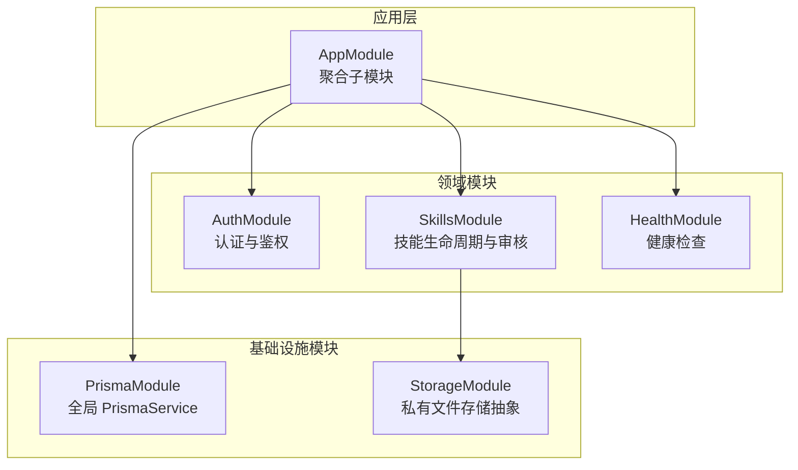
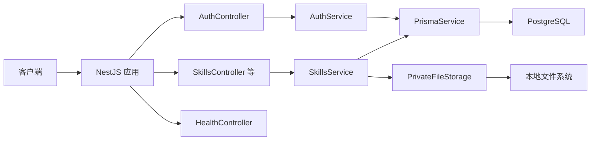
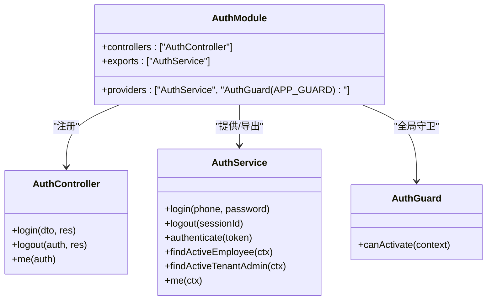
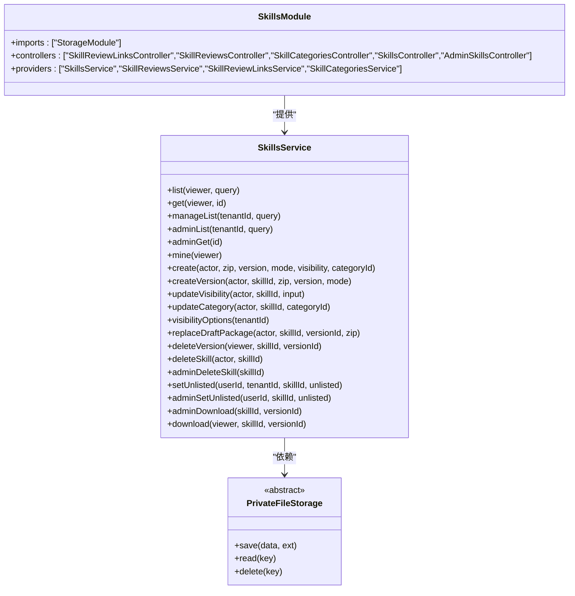
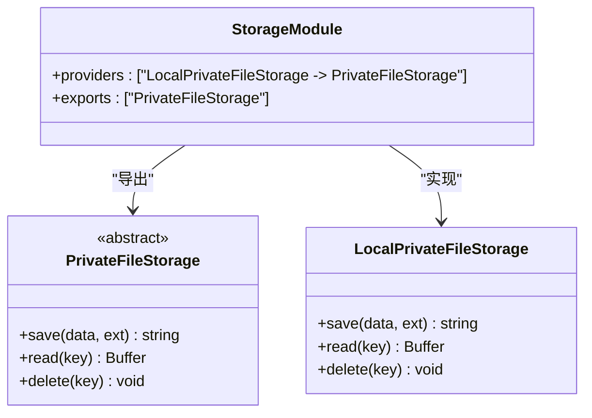
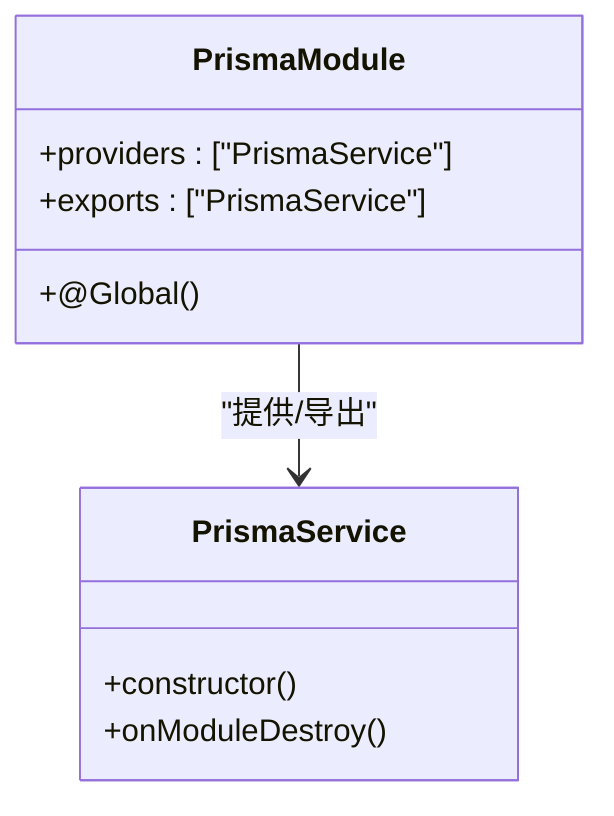
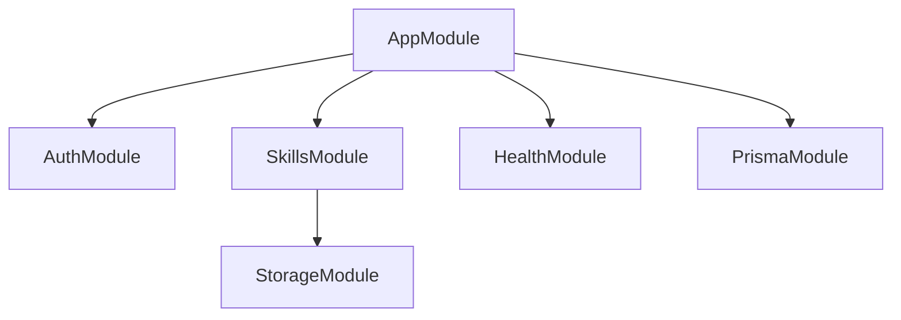

# 模块化设计

<cite>
**本文引用的文件**   
- [app.module.ts](file://apps/server/src/app.module.ts)
- [auth.module.ts](file://apps/server/src/auth/auth.module.ts)
- [auth.controller.ts](file://apps/server/src/auth/auth.controller.ts)
- [auth.service.ts](file://apps/server/src/auth/auth.service.ts)
- [auth.guard.ts](file://apps/server/src/auth/auth.guard.ts)
- [skills.module.ts](file://apps/server/src/skills/skills.module.ts)
- [skills.service.ts](file://apps/server/src/skills/skills.service.ts)
- [storage.module.ts](file://apps/server/src/storage/storage.module.ts)
- [private-file-storage.ts](file://apps/server/src/storage/private-file-storage.ts)
- [prisma.module.ts](file://apps/server/src/prisma/prisma.module.ts)
- [prisma.service.ts](file://apps/server/src/prisma/prisma.service.ts)
- [health.module.ts](file://apps/server/src/health/health.module.ts)
</cite>

## 目录
1. [引言](#引言)
2. [项目结构](#项目结构)
3. [核心模块](#核心模块)
4. [架构总览](#架构总览)
5. [详细组件分析](#详细组件分析)
6. [依赖关系分析](#依赖关系分析)
7. [性能与可扩展性](#性能与可扩展性)
8. [可测试性与复用性](#可测试性与复用性)
9. [模块扩展最佳实践](#模块扩展最佳实践)
10. [故障排查指南](#故障排查指南)
11. [结论](#结论)

## 引言
本文件面向基于 NestJS 的后端应用，系统性梳理其模块化设计。重点围绕以下五个核心模块展开：认证授权（AuthModule）、技能管理（SkillsModule）、文件存储（StorageModule）、数据库访问（PrismaModule）与健康检查（HealthModule）。文档将说明各模块职责、边界、依赖关系、配置方式、提供者与服务组织，并给出模块层次图与依赖注入图，同时讨论可测试性、可复用性与扩展模式。

## 项目结构
应用采用单 NestJS 应用结构，根模块负责聚合子模块；业务按领域划分到独立目录，基础设施能力以模块形式提供。

图表来源
- [app.module.ts:1-10](file://apps/server/src/app.module.ts#L1-L10)
- [auth.module.ts:1-13](file://apps/server/src/auth/auth.module.ts#L1-L13)
- [skills.module.ts:1-19](file://apps/server/src/skills/skills.module.ts#L1-L19)
- [storage.module.ts:1-5](file://apps/server/src/storage/storage.module.ts#L1-L5)
- [prisma.module.ts:1-10](file://apps/server/src/prisma/prisma.module.ts#L1-L10)
- [health.module.ts:1-8](file://apps/server/src/health/health.module.ts#L1-L8)

章节来源
- [app.module.ts:1-10](file://apps/server/src/app.module.ts#L1-L10)

## 核心模块
- AuthModule：定义登录、登出、当前用户信息接口；通过全局守卫实现默认鉴权与角色控制；对外暴露 AuthService。
- SkillsModule：封装技能的创建、版本管理、可见性、分类、审核流程、下载与管理视图；依赖 StorageModule 进行包文件存取。
- StorageModule：提供 PrivateFileStorage 抽象及其本地磁盘实现 LocalPrivateFileStorage，导出供其他模块使用。
- PrismaModule：注册全局的 PrismaService，所有需要数据库访问的模块无需重复导入即可注入。
- HealthModule：提供健康检查控制器，用于运行期健康探测。

章节来源
- [auth.module.ts:1-13](file://apps/server/src/auth/auth.module.ts#L1-L13)
- [skills.module.ts:1-19](file://apps/server/src/skills/skills.module.ts#L1-L19)
- [storage.module.ts:1-5](file://apps/server/src/storage/storage.module.ts#L1-L5)
- [prisma.module.ts:1-10](file://apps/server/src/prisma/prisma.module.ts#L1-L10)
- [health.module.ts:1-8](file://apps/server/src/health/health.module.ts#L1-L8)

## 架构总览
NestJS 应用启动时，AppModule 导入四个子模块。PrismaModule 被标记为全局模块，因此后续模块可直接注入 PrismaService。SkillsModule 显式导入 StorageModule，从而获得文件存储能力。AuthModule 通过 APP_GUARD 注入全局守卫，对所有路由进行统一鉴权。

图表来源
- [auth.controller.ts:1-26](file://apps/server/src/auth/auth.controller.ts#L1-L26)
- [skills.service.ts:1-500](file://apps/server/src/skills/skills.service.ts#L1-L500)
- [private-file-storage.ts:1-41](file://apps/server/src/storage/private-file-storage.ts#L1-L41)
- [prisma.service.ts:1-15](file://apps/server/src/prisma/prisma.service.ts#L1-L15)

## 详细组件分析

### 认证授权模块（AuthModule）
职责
- 提供登录、登出、获取当前用户信息的控制器。
- 通过全局守卫对请求进行身份校验与权限判定。
- 维护会话上下文，包括用户、租户、管理员状态等。

关键实现要点
- 登录流程生成令牌并写入 Cookie，设置过期时间。
- 全局守卫默认要求登录，支持公开接口注解、超管、租户管理员、租户成员等权限策略。
- 对外暴露 AuthService，供其他模块复用认证逻辑。

图表来源
- [auth.module.ts:1-13](file://apps/server/src/auth/auth.module.ts#L1-L13)
- [auth.controller.ts:1-26](file://apps/server/src/auth/auth.controller.ts#L1-L26)
- [auth.service.ts:1-77](file://apps/server/src/auth/auth.service.ts#L1-L77)
- [auth.guard.ts:1-49](file://apps/server/src/auth/auth.guard.ts#L1-L49)

章节来源
- [auth.module.ts:1-13](file://apps/server/src/auth/auth.module.ts#L1-L13)
- [auth.controller.ts:1-26](file://apps/server/src/auth/auth.controller.ts#L1-L26)
- [auth.service.ts:1-77](file://apps/server/src/auth/auth.service.ts#L1-L77)
- [auth.guard.ts:1-49](file://apps/server/src/auth/auth.guard.ts#L1-L49)

### 技能管理模块（SkillsModule）
职责
- 提供技能目录、详情、管理视图、我的技能等查询接口。
- 处理技能包的上传、版本管理、可见性与分类变更、审核记录、下架/上架、删除等操作。
- 与 StorageModule 协作完成二进制包文件的持久化与读取。

关键实现要点
- 控制器顺序固定，确保精确路径优先匹配，避免与动态 :id 冲突。
- 业务逻辑集中在 SkillsService，封装事务、并发锁、权限判断与数据转换。
- 通过 StorageModule 提供的 PrivateFileStorage 抽象解耦底层存储实现。

图表来源
- [skills.module.ts:1-19](file://apps/server/src/skills/skills.module.ts#L1-L19)
- [skills.service.ts:1-500](file://apps/server/src/skills/skills.service.ts#L1-L500)
- [private-file-storage.ts:1-41](file://apps/server/src/storage/private-file-storage.ts#L1-L41)

章节来源
- [skills.module.ts:1-19](file://apps/server/src/skills/skills.module.ts#L1-L19)
- [skills.service.ts:1-500](file://apps/server/src/skills/skills.service.ts#L1-L500)
- [private-file-storage.ts:1-41](file://apps/server/src/storage/private-file-storage.ts#L1-L41)

### 文件存储模块（StorageModule）
职责
- 定义私有文件存储抽象 PrivateFileStorage，屏蔽具体存储实现差异。
- 提供本地磁盘实现 LocalPrivateFileStorage，并通过模块导出该抽象，供其他模块注入。

关键实现要点
- save/read/delete 三方法约定了统一的存储操作契约。
- 本地实现使用随机文件名与独立目录，防止路径穿越。
- 通过环境变量覆盖私有存储目录，便于容器化部署挂载数据卷。

图表来源
- [storage.module.ts:1-5](file://apps/server/src/storage/storage.module.ts#L1-L5)
- [private-file-storage.ts:1-41](file://apps/server/src/storage/private-file-storage.ts#L1-L41)

章节来源
- [storage.module.ts:1-5](file://apps/server/src/storage/storage.module.ts#L1-L5)
- [private-file-storage.ts:1-41](file://apps/server/src/storage/private-file-storage.ts#L1-L41)

### 数据库访问模块（PrismaModule）
职责
- 注册全局的 PrismaService，封装 PrismaClient 实例与连接生命周期。
- 通过 @Global() 装饰器使 PrismaService 在所有模块中可用，无需显式导入。

关键实现要点
- 使用 PrismaPg 适配器与 DATABASE_URL 建立数据库连接。
- 在模块销毁时断开连接，保证资源释放。

图表来源
- [prisma.module.ts:1-10](file://apps/server/src/prisma/prisma.module.ts#L1-L10)
- [prisma.service.ts:1-15](file://apps/server/src/prisma/prisma.service.ts#L1-L15)

章节来源
- [prisma.module.ts:1-10](file://apps/server/src/prisma/prisma.module.ts#L1-L10)
- [prisma.service.ts:1-15](file://apps/server/src/prisma/prisma.service.ts#L1-L15)

### 健康检查模块（HealthModule）
职责
- 暴露健康检查控制器，用于外部探针或编排系统探测服务可用性。

关键实现要点
- 仅包含控制器，无额外提供者，保持轻量。

章节来源
- [health.module.ts:1-8](file://apps/server/src/health/health.module.ts#L1-L8)

## 依赖关系分析
模块间依赖清晰且单向：
- AppModule 聚合所有子模块。
- SkillsModule 依赖 StorageModule。
- AuthModule 与 SkillsModule 均依赖 PrismaModule（通过全局模块注入）。
- HealthModule 不依赖其他业务模块。

图表来源
- [app.module.ts:1-10](file://apps/server/src/app.module.ts#L1-L10)
- [skills.module.ts:1-19](file://apps/server/src/skills/skills.module.ts#L1-L19)
- [storage.module.ts:1-5](file://apps/server/src/storage/storage.module.ts#L1-L5)
- [prisma.module.ts:1-10](file://apps/server/src/prisma/prisma.module.ts#L1-L10)

章节来源
- [app.module.ts:1-10](file://apps/server/src/app.module.ts#L1-L10)
- [skills.module.ts:1-19](file://apps/server/src/skills/skills.module.ts#L1-L19)
- [storage.module.ts:1-5](file://apps/server/src/storage/storage.module.ts#L1-L5)
- [prisma.module.ts:1-10](file://apps/server/src/prisma/prisma.module.ts#L1-L10)

## 性能与可扩展性
- 数据库访问：PrismaService 作为单例全局提供，减少连接对象创建开销；在模块销毁时断开连接，避免资源泄漏。
- 文件存储：通过抽象 PrivateFileStorage 隔离底层实现，便于未来替换为对象存储而不影响上层业务。
- 并发安全：技能版本写入与删除使用行级锁与事务，避免竞态条件导致的数据不一致。
- 路由匹配：SkillsModule 中控制器顺序固定，确保精确路径优先匹配，降低误匹配带来的额外解析成本。

[本节为通用指导，不直接分析具体文件]

## 可测试性与复用性
- 可测试性
  - 控制器与服务的职责分离，便于单元测试 Mock 依赖（如 PrismaService、PrivateFileStorage）。
  - 全局守卫可通过 Reflector 与装饰器组合，测试时可针对特定路由或控制器进行白名单/黑名单验证。
  - 存储抽象便于在测试中使用内存或临时文件系统替代本地磁盘。
- 复用性
  - AuthService 暴露认证相关能力，供其他模块复用（例如审计、日志等场景）。
  - PrivateFileStorage 抽象允许在不同环境切换实现，提升代码复用度。
  - PrismaModule 的全局特性简化跨模块数据访问的依赖声明。

章节来源
- [auth.guard.ts:1-49](file://apps/server/src/auth/auth.guard.ts#L1-L49)
- [private-file-storage.ts:1-41](file://apps/server/src/storage/private-file-storage.ts#L1-L41)
- [prisma.module.ts:1-10](file://apps/server/src/prisma/prisma.module.ts#L1-L10)

## 模块扩展最佳实践
- 新增领域模块
  - 新建模块文件，明确 imports、controllers、providers、exports。
  - 若需数据库访问，直接注入 PrismaService（无需再次导入 PrismaModule）。
  - 若需文件存储，导入 StorageModule 并使用 PrivateFileStorage。
- 新增控制器
  - 将控制器放入对应领域模块的 controllers 数组。
  - 注意精确路径与动态路径的顺序，必要时调整控制器顺序以避免冲突。
- 新增提供者
  - 将服务类放入 providers 数组，并在 exports 中暴露给其他模块。
  - 如需替换实现，可在模块中通过 provide/useClass 映射抽象到具体实现。
- 鉴权扩展
  - 通过装饰器与 Reflector 扩展新的权限策略，并在 AuthGuard 中统一处理。
  - 对于公开接口，使用 Public 装饰器跳过鉴权。
- 存储扩展
  - 实现 PrivateFileStorage 的新实现，并在 StorageModule 中替换 useClass。
  - 通过环境变量控制存储目录或后端地址，便于多环境部署。

章节来源
- [skills.module.ts:1-19](file://apps/server/src/skills/skills.module.ts#L1-L19)
- [storage.module.ts:1-5](file://apps/server/src/storage/storage.module.ts#L1-L5)
- [auth.guard.ts:1-49](file://apps/server/src/auth/auth.guard.ts#L1-L49)

## 故障排查指南
- 登录失败
  - 检查账号密码与演示账户初始化是否完成。
  - 确认 Cookie 配置与安全选项是否正确。
- 鉴权异常
  - 未登录：检查 Cookie 是否携带有效令牌。
  - 权限不足：根据装饰器判断是否为超管或租户管理员。
- 技能操作失败
  - 名称冲突：检查同名 Skill 是否存在及可见性。
  - 版本冲突：确认版本号严格递增且不存在进行中的非正式版本。
  - 并发问题：查看事务与行级锁是否生效。
- 文件读写错误
  - 检查私有存储目录权限与路径穿越防护。
  - 确认存储服务实现与配置一致。

章节来源
- [auth.controller.ts:1-26](file://apps/server/src/auth/auth.controller.ts#L1-L26)
- [auth.guard.ts:1-49](file://apps/server/src/auth/auth.guard.ts#L1-L49)
- [skills.service.ts:1-500](file://apps/server/src/skills/skills.service.ts#L1-L500)
- [private-file-storage.ts:1-41](file://apps/server/src/storage/private-file-storage.ts#L1-L41)

## 结论
本项目通过清晰的模块边界与依赖关系，实现了认证授权、技能管理、文件存储、数据库访问与健康检查的职责分离。PrismaModule 的全局特性简化了跨模块数据访问；StorageModule 的抽象提升了存储实现的灵活性；AuthModule 的全局守卫提供了统一的鉴权机制。遵循本文的扩展最佳实践，可以在保持模块内聚与低耦合的前提下，持续扩展业务能力。