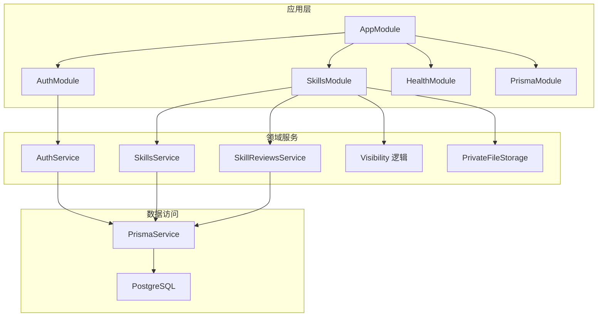
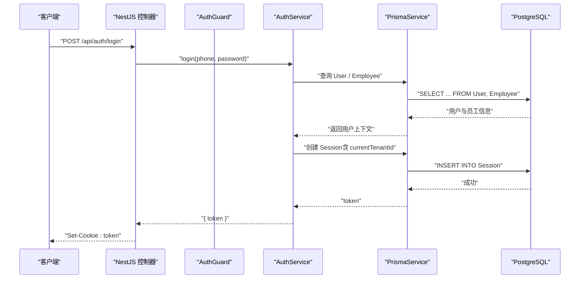
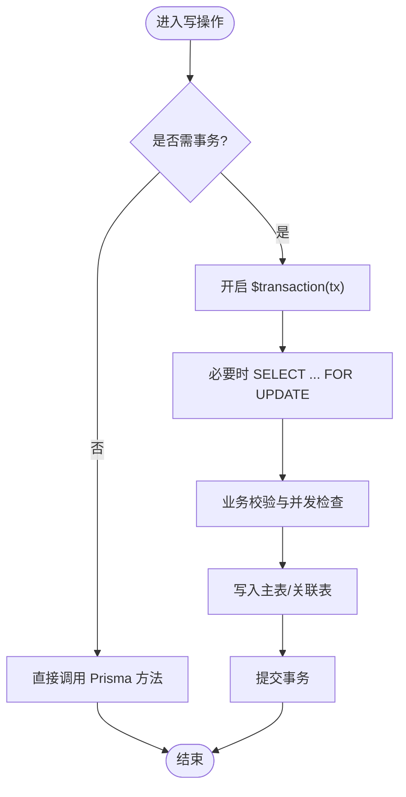
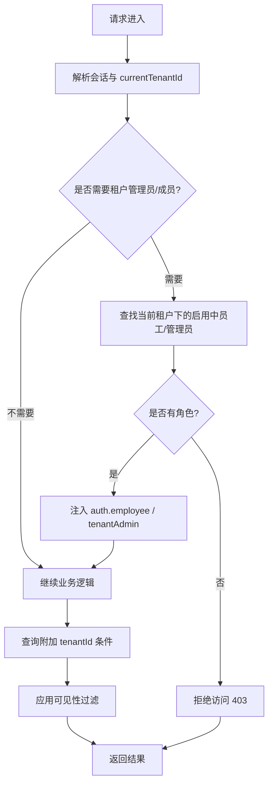
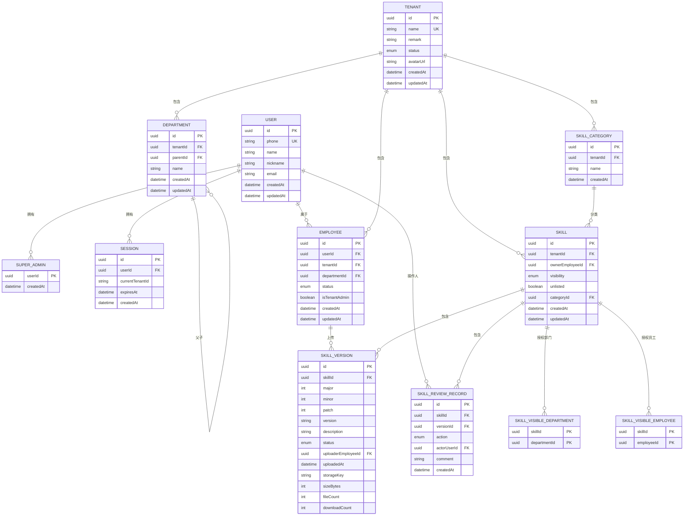
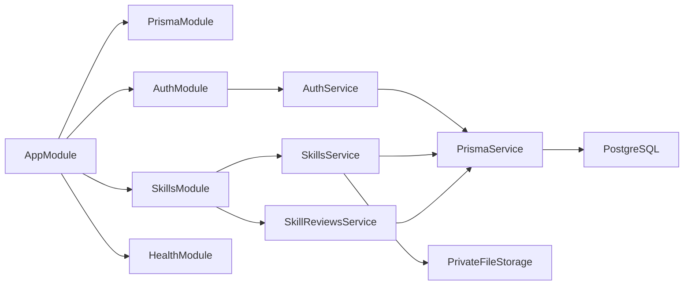
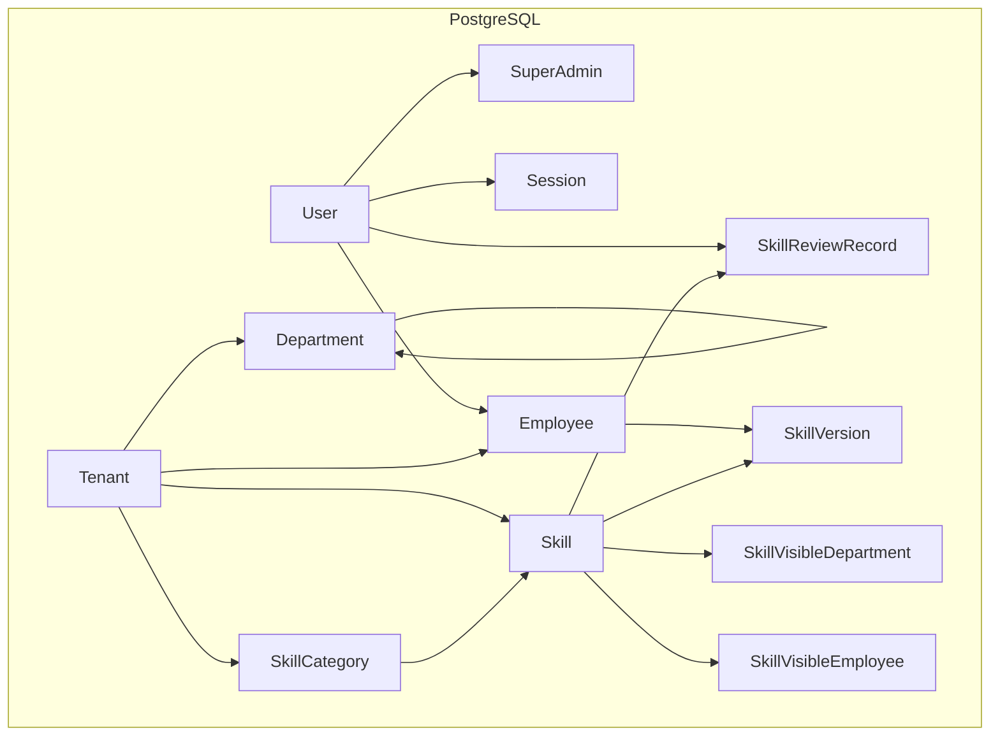
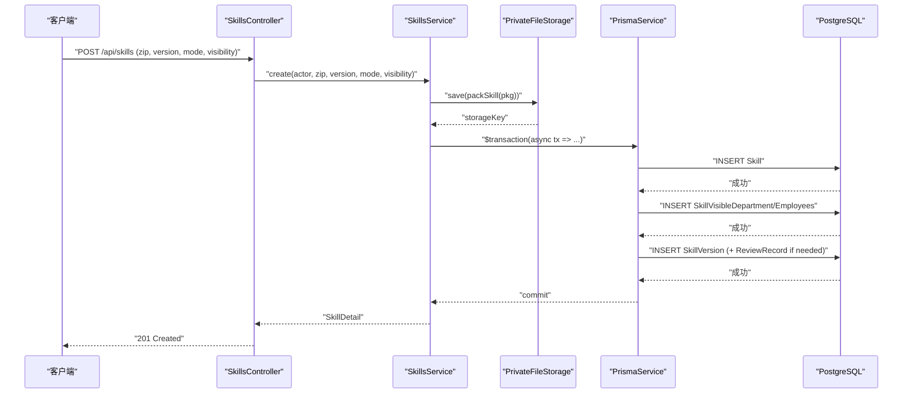

# 数据存储流

<cite>
**本文引用的文件**   
- [schema.prisma](file://apps/server/prisma/schema.prisma)
- [migration.sql](file://apps/server/prisma/migrations/20261004080000_demo_init/migration.sql)
- [prisma.service.ts](file://apps/server/src/prisma/prisma.service.ts)
- [prisma.module.ts](file://apps/server/src/prisma/prisma.module.ts)
- [app.module.ts](file://apps/server/src/app.module.ts)
- [prisma.config.ts](file://apps/server/prisma.config.ts)
- [server.Dockerfile](file://deploy/server.Dockerfile)
- [session.ts](file://apps/server/src/auth/session.ts)
- [auth.service.ts](file://apps/server/src/auth/auth.service.ts)
- [auth.guard.ts](file://apps/server/src/auth/auth.guard.ts)
- [decorators.ts](file://apps/server/src/auth/decorators.ts)
- [skills.service.ts](file://apps/server/src/skills/skills.service.ts)
- [skill-visibility.ts](file://apps/server/src/skills/skill-visibility.ts)
- [skill-reviews.service.ts](file://apps/server/src/skills/skill-reviews.service.ts)
- [private-file-storage.ts](file://apps/server/src/storage/private-file-storage.ts)
- [tenant.ts](file://packages/shared/src/tenant.ts)
</cite>

## 目录
1. [引言](#引言)
2. [项目结构](#项目结构)
3. [核心组件](#核心组件)
4. [架构总览](#架构总览)
5. [详细组件分析](#详细组件分析)
6. [依赖关系分析](#依赖关系分析)
7. [性能与索引优化](#性能与索引优化)
8. [故障排查指南](#故障排查指南)
9. [结论](#结论)
10. [附录：数据模型与流转图](#附录数据模型与流转图)

## 引言
本文面向“数据存储流”，系统性说明本项目的持久化策略、Prisma ORM 使用模式、多租户隔离机制、实体关系映射、数据验证与约束、索引优化，以及备份恢复与版本管理方案。文档同时给出数据库架构图和数据流转图，帮助读者从业务到代码层面完整理解数据如何产生、校验、存储、访问与迁移。

## 项目结构
后端服务位于 apps/server，采用 NestJS 模块化架构；数据库定义与迁移位于 apps/server/prisma；共享类型位于 packages/shared。部署阶段通过 Dockerfile 在启动前执行 Prisma 迁移并初始化演示数据。

**图表来源**
- [app.module.ts:1-10](file://apps/server/src/app.module.ts#L1-L10)
- [prisma.module.ts:1-10](file://apps/server/src/prisma/prisma.module.ts#L1-L10)
- [prisma.service.ts:1-15](file://apps/server/src/prisma/prisma.service.ts#L1-L15)
- [auth.service.ts:1-77](file://apps/server/src/auth/auth.service.ts#L1-L77)
- [skills.service.ts:1-500](file://apps/server/src/skills/skills.service.ts#L1-L500)
- [skill-reviews.service.ts:1-112](file://apps/server/src/skills/skill-reviews.service.ts#L1-L112)
- [skill-visibility.ts:1-107](file://apps/server/src/skills/skill-visibility.ts#L1-L107)
- [private-file-storage.ts:1-41](file://apps/server/src/storage/private-file-storage.ts#L1-L41)

**章节来源**
- [app.module.ts:1-10](file://apps/server/src/app.module.ts#L1-L10)
- [prisma.module.ts:1-10](file://apps/server/src/prisma/prisma.module.ts#L1-L10)
- [prisma.service.ts:1-15](file://apps/server/src/prisma/prisma.service.ts#L1-L15)
- [server.Dockerfile:1-25](file://deploy/server.Dockerfile#L1-L25)

## 核心组件
- Prisma 客户端与服务：封装连接、生命周期管理，全局模块导出。
- 认证与会话：基于会话令牌鉴权，维护当前租户上下文。
- 技能（Skill）领域服务：负责 Skill、版本、可见性、分类、审核记录等核心数据操作。
- 可见性计算：按租户、部门、员工维度动态过滤。
- 私有文件存储：Skill 包以 key 形式落盘，不直接暴露静态路径。
- 共享类型：Tenant 类型与状态枚举。

**章节来源**
- [prisma.service.ts:1-15](file://apps/server/src/prisma/prisma.service.ts#L1-L15)
- [auth.service.ts:1-77](file://apps/server/src/auth/auth.service.ts#L1-L77)
- [skills.service.ts:1-500](file://apps/server/src/skills/skills.service.ts#L1-L500)
- [skill-visibility.ts:1-107](file://apps/server/src/skills/skill-visibility.ts#L1-L107)
- [private-file-storage.ts:1-41](file://apps/server/src/storage/private-file-storage.ts#L1-L41)
- [tenant.ts:1-3](file://packages/shared/src/tenant.ts#L1-L3)

## 架构总览
系统采用“会话 + 租户上下文”的多租户隔离方式。用户登录后生成会话，会话携带 currentTenantId；后续请求经守卫解析身份与权限，将 AuthContext 注入控制器，再由服务层结合 tenantId 进行数据过滤与写入。

**图表来源**
- [auth.service.ts:15-24](file://apps/server/src/auth/auth.service.ts#L15-L24)
- [session.ts:1-29](file://apps/server/src/auth/session.ts#L1-L29)
- [prisma.service.ts:1-15](file://apps/server/src/prisma/prisma.service.ts#L1-L15)

## 详细组件分析

### Prisma ORM 使用模式
- 数据模型定义：所有实体、枚举、关系、唯一约束与索引均在 schema.prisma 中声明，生成客户端类型供 TypeScript 使用。
- 查询构建：服务层通过 Prisma 客户端的 findMany/findFirst/create/update/delete 等方法组合 where/include/orderBy 构建查询。
- 事务处理：关键写路径使用 $transaction，包括并发锁行（FOR UPDATE）、条件更新（updateMany）与关联记录写入。
- 数据迁移：通过 prisma.config.ts 指定 schema 与 migrations 路径；Dockerfile 在启动时执行 migrate deploy 并 seed。

**图表来源**
- [skills.service.ts:240-251](file://apps/server/src/skills/skills.service.ts#L240-L251)
- [skills.service.ts:270-280](file://apps/server/src/skills/skills.service.ts#L270-L280)
- [skill-reviews.service.ts:62-66](file://apps/server/src/skills/skill-reviews.service.ts#L62-L66)

**章节来源**
- [schema.prisma:1-219](file://apps/server/prisma/schema.prisma#L1-L219)
- [prisma.config.ts:1-13](file://apps/server/prisma.config.ts#L1-L13)
- [server.Dockerfile:24-25](file://deploy/server.Dockerfile#L24-L25)
- [skills.service.ts:240-280](file://apps/server/src/skills/skills.service.ts#L240-L280)
- [skill-reviews.service.ts:62-66](file://apps/server/src/skills/skill-reviews.service.ts#L62-L66)

### 多租户数据隔离机制
- 租户上下文传递：登录成功后在 Session 中保存 currentTenantId；守卫根据路由元数据校验超管、租户管理员或租户成员，并将 employee/tenantAdmin 注入请求上下文。
- 数据过滤策略：所有涉及 Skill、Category 等资源的查询均附加 tenantId 条件；可见性进一步按部门树与员工名单实时计算。
- 访问控制：未选择租户或无权限时返回 403；对不可见资源统一返回 404，避免泄露存在性。

**图表来源**
- [auth.guard.ts:29-48](file://apps/server/src/auth/auth.guard.ts#L29-L48)
- [auth.service.ts:30-49](file://apps/server/src/auth/auth.service.ts#L30-L49)
- [skills.service.ts:126-131](file://apps/server/src/skills/skills.service.ts#L126-L131)
- [skill-visibility.ts:38-57](file://apps/server/src/skills/skill-visibility.ts#L38-L57)

**章节来源**
- [session.ts:1-29](file://apps/server/src/auth/session.ts#L1-L29)
- [auth.guard.ts:29-48](file://apps/server/src/auth/auth.guard.ts#L29-L48)
- [auth.service.ts:30-49](file://apps/server/src/auth/auth.service.ts#L30-L49)
- [skills.service.ts:126-131](file://apps/server/src/skills/skills.service.ts#L126-L131)
- [skill-visibility.ts:38-57](file://apps/server/src/skills/skill-visibility.ts#L38-L57)

### 实体关系映射
- 一对一：User 与 SuperAdmin（SuperAdmin.userId 为 PK 且外键指向 User）。
- 一对多：
  - Tenant → Department、Employee、Skill、SkillCategory
  - Department → Department（父子自引用）
  - Employee → SkillVersion（上传者）
  - Skill → SkillVersion、SkillReviewRecord
  - Skill → SkillVisibleDepartment、SkillVisibleEmployee（多对多中间表）
- 多对多：Skill 与 Department（通过 SkillVisibleDepartment），Skill 与 Employee（通过 SkillVisibleEmployee）。

**图表来源**
- [schema.prisma:12-219](file://apps/server/prisma/schema.prisma#L12-L219)

**章节来源**
- [schema.prisma:12-219](file://apps/server/prisma/schema.prisma#L12-L219)

### 数据验证规则、约束与索引优化
- 唯一约束：
  - User.phone 唯一
  - Tenant.name 唯一
  - Employee(userId, tenantId) 唯一
  - Skill(tenantId, name) 唯一
  - SkillCategory(tenantId, name) 唯一
  - SkillVersion(skillId, major, minor, patch) 唯一
- 级联删除：
  - SuperAdmin 删除级联至 User
  - Session 删除级联至 User
  - SkillVersion 删除级联至 Skill
  - SkillVisibleDepartment/SkillVisibleEmployee 删除级联至 Skill
  - Department 父子关系 Restrict 删除防止破坏结构
- 索引优化：
  - Session.userId 索引
  - Department.tenantId 索引
  - Employee.tenantId 索引
  - Skill.categoryId 索引
  - SkillVisibleDepartment.departmentId 索引
  - SkillVisibleEmployee.employeeId 索引
  - SkillReviewRecord.skillId 索引
- 业务校验：
  - 版本号严格递增比较
  - 名称冲突检测（同租户内）
  - 可见性设置校验（部门/员工必须属于当前租户）
  - 草稿/审核中状态转换限制

**章节来源**
- [schema.prisma:12-219](file://apps/server/prisma/schema.prisma#L12-L219)
- [skills.service.ts:43-45](file://apps/server/src/skills/skills.service.ts#L43-L45)
- [skills.service.ts:237-251](file://apps/server/src/skills/skills.service.ts#L237-L251)
- [skills.service.ts:259-280](file://apps/server/src/skills/skills.service.ts#L259-L280)
- [skill-visibility.ts:82-97](file://apps/server/src/skills/skill-visibility.ts#L82-L97)

### 数据备份、恢复与版本管理
- 数据库迁移与版本管理：
  - 通过 prisma.config.ts 配置 schema 与 migrations 路径。
  - Dockerfile 在容器启动时执行 npx prisma migrate deploy，确保数据库结构与代码一致。
  - 演示数据通过 seed.js 初始化（由 prisma.config.ts 的 seed 字段触发）。
- 文件备份建议：
  - 私有文件存储在本地磁盘（可通过环境变量 PRIVATE_UPLOAD_DIR 覆盖），建议挂载独立数据卷并纳入备份策略。
  - 文件读取走业务接口，避免直接暴露静态路径，降低误删风险。
- 数据恢复流程建议：
  - 先恢复 PostgreSQL 快照，再执行 prisma migrate deploy 保证结构一致，最后运行 seed 恢复演示数据。
  - 若使用外部对象存储替换本地存储，需保持 storageKey 命名规范不变，以便迁移后文件可被正确读取。

**章节来源**
- [prisma.config.ts:1-13](file://apps/server/prisma.config.ts#L1-L13)
- [server.Dockerfile:24-25](file://deploy/server.Dockerfile#L24-L25)
- [private-file-storage.ts:20-39](file://apps/server/src/storage/private-file-storage.ts#L20-L39)

## 依赖关系分析
- 模块依赖：AppModule 导入 PrismaModule、AuthModule、HealthModule、SkillsModule。
- 服务依赖：
  - AuthService 依赖 PrismaService 进行会话与用户数据读写。
  - SkillsService 依赖 PrismaService 与 PrivateFileStorage 进行 Skill、版本、可见性与文件存取。
  - SkillReviewsService 依赖 PrismaService 进行版本状态迁移与审核记录。
- 外部依赖：PostgreSQL 作为数据库；Prisma 适配器使用 @prisma/adapter-pg。

**图表来源**
- [app.module.ts:1-10](file://apps/server/src/app.module.ts#L1-L10)
- [prisma.module.ts:1-10](file://apps/server/src/prisma/prisma.module.ts#L1-L10)
- [auth.service.ts:1-77](file://apps/server/src/auth/auth.service.ts#L1-L77)
- [skills.service.ts:1-500](file://apps/server/src/skills/skills.service.ts#L1-L500)
- [skill-reviews.service.ts:1-112](file://apps/server/src/skills/skill-reviews.service.ts#L1-L112)
- [private-file-storage.ts:1-41](file://apps/server/src/storage/private-file-storage.ts#L1-L41)

**章节来源**
- [app.module.ts:1-10](file://apps/server/src/app.module.ts#L1-L10)
- [prisma.module.ts:1-10](file://apps/server/src/prisma/prisma.module.ts#L1-L10)
- [auth.service.ts:1-77](file://apps/server/src/auth/auth.service.ts#L1-L77)
- [skills.service.ts:1-500](file://apps/server/src/skills/skills.service.ts#L1-L500)
- [skill-reviews.service.ts:1-112](file://apps/server/src/skills/skill-reviews.service.ts#L1-L112)

## 性能与索引优化
- 查询优化：
  - 列表查询仅加载必要字段与关系，减少 N+1 问题。
  - 搜索使用数据库侧 contains 与 OR 组合，配合索引提升匹配效率。
- 索引设计：
  - 高频过滤字段如 tenantId、userId、departmentId、employeeId、categoryId、skillId 均已建索引。
  - 复合唯一约束保障业务唯一性，避免重复写入。
- 并发控制：
  - 关键写路径使用 FOR UPDATE 锁定行，串行化上传新版本、删除版本等操作。
  - updateMany 条件更新保证幂等与并发安全。

**章节来源**
- [skills.service.ts:126-131](file://apps/server/src/skills/skills.service.ts#L126-L131)
- [skills.service.ts:270-280](file://apps/server/src/skills/skills.service.ts#L270-L280)
- [skills.service.ts:364-371](file://apps/server/src/skills/skills.service.ts#L364-L371)
- [schema.prisma:40-41](file://apps/server/prisma/schema.prisma#L40-L41)
- [schema.prisma:75-77](file://apps/server/prisma/schema.prisma#L75-L77)
- [schema.prisma:100-102](file://apps/server/prisma/schema.prisma#L100-L102)
- [schema.prisma:122-124](file://apps/server/prisma/schema.prisma#L122-L124)
- [schema.prisma:150-152](file://apps/server/prisma/schema.prisma#L150-L152)
- [schema.prisma:160-162](file://apps/server/prisma/schema.prisma#L160-L162)
- [schema.prisma:217-218](file://apps/server/prisma/schema.prisma#L217-L218)

## 故障排查指南
- 登录失败：
  - 检查 DEMO_ACCOUNTS 是否已初始化；确认 DATABASE_URL 是否正确。
  - 查看 Session 是否过期或 currentTenantId 是否为空。
- 权限不足：
  - 确认是否选择了正确的租户；检查 @TenantAdminOnly/@TenantMember 装饰器使用。
  - 查看 employee 是否存在且处于 active 状态。
- 数据不一致：
  - 检查事务是否成功提交；关注 updateMany 的 count 是否为 0。
  - 核对唯一约束冲突（P2002）与业务校验错误消息。
- 文件读取失败：
  - 确认 PRIVATE_UPLOAD_DIR 挂载与权限；检查 storageKey 是否与文件名一致。
  - 注意 read 使用 basename 防止路径穿越。

**章节来源**
- [auth.service.ts:15-24](file://apps/server/src/auth/auth.service.ts#L15-L24)
- [auth.guard.ts:29-48](file://apps/server/src/auth/auth.guard.ts#L29-L48)
- [skills.service.ts:240-251](file://apps/server/src/skills/skills.service.ts#L240-L251)
- [skills.service.ts:270-280](file://apps/server/src/skills/skills.service.ts#L270-L280)
- [private-file-storage.ts:32-39](file://apps/server/src/storage/private-file-storage.ts#L32-L39)

## 结论
本项目通过 Prisma ORM 统一管理数据模型与迁移，结合 NestJS 的守卫与服务层实现严谨的多租户隔离与访问控制。Skill 的生命周期（创建、版本管理、可见性、审核）通过事务与并发锁保证一致性。索引与唯一约束提升了查询性能与数据完整性。私有文件存储与数据库分离，便于扩展与备份恢复。整体架构清晰、职责分明，适合教学场景中的技能管理与协作。

## 附录：数据模型与流转图

### 数据库架构图

**图表来源**
- [schema.prisma:12-219](file://apps/server/prisma/schema.prisma#L12-L219)

### 数据流转图（Skill 创建与版本发布）

**图表来源**
- [skills.service.ts:237-251](file://apps/server/src/skills/skills.service.ts#L237-L251)
- [private-file-storage.ts:24-30](file://apps/server/src/storage/private-file-storage.ts#L24-L30)