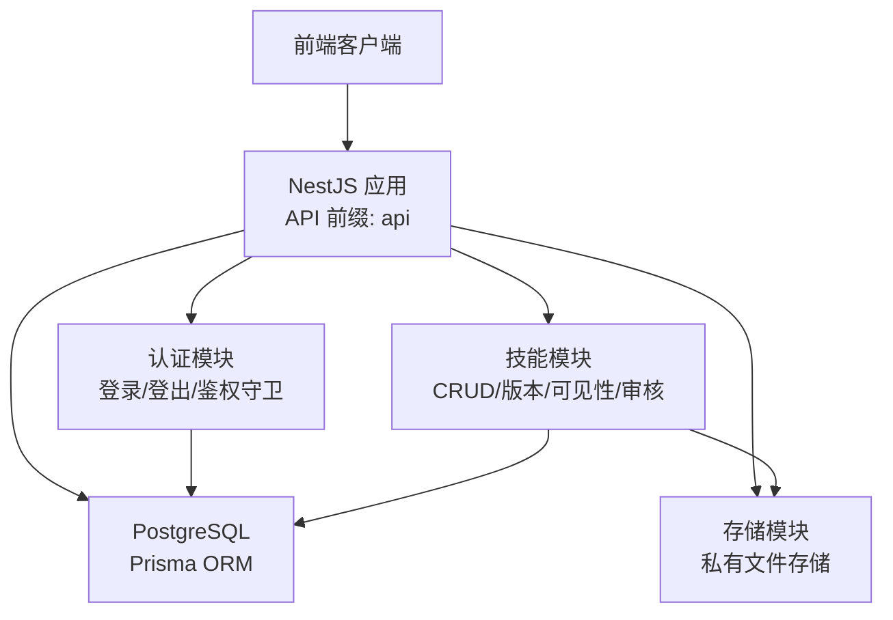
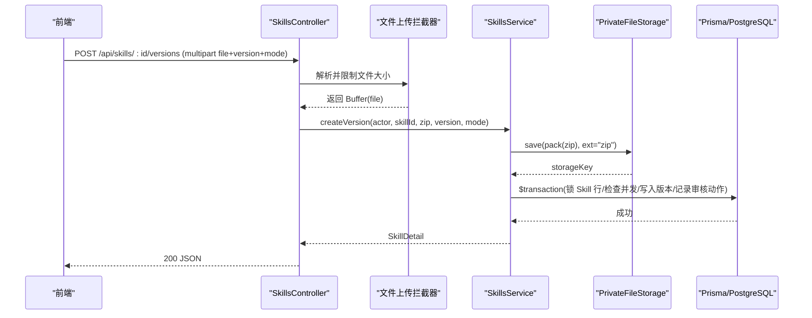
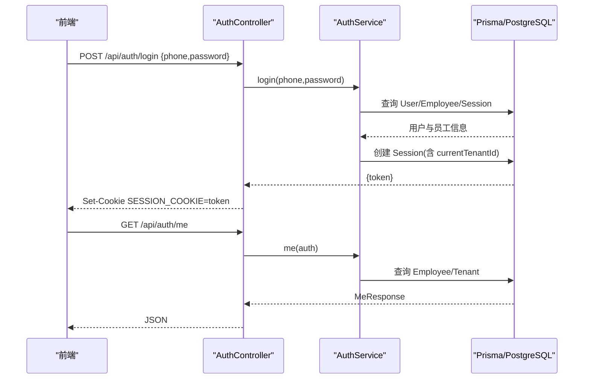
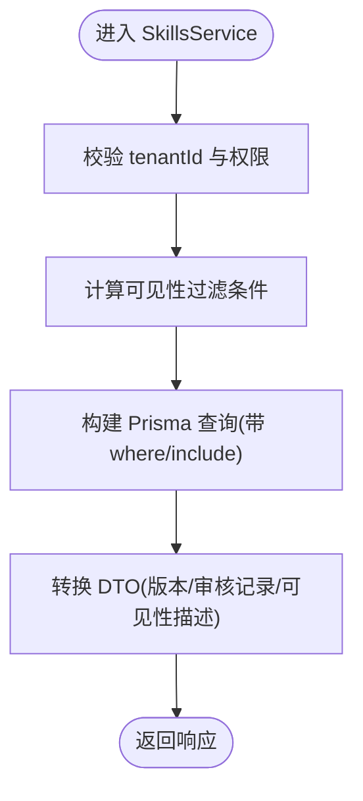
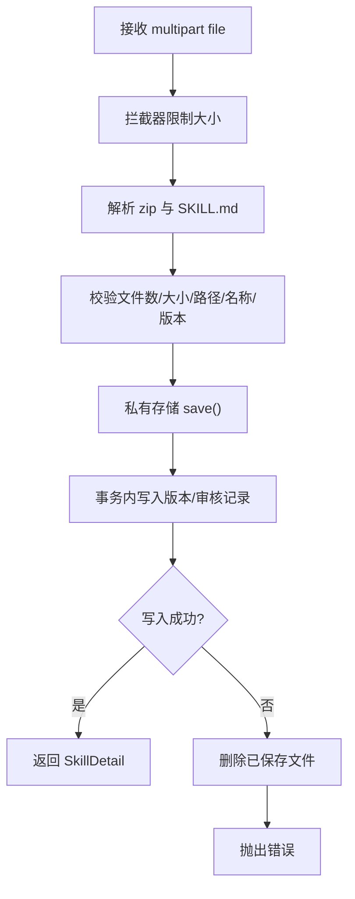
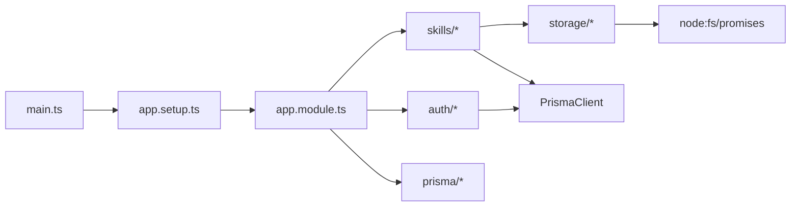
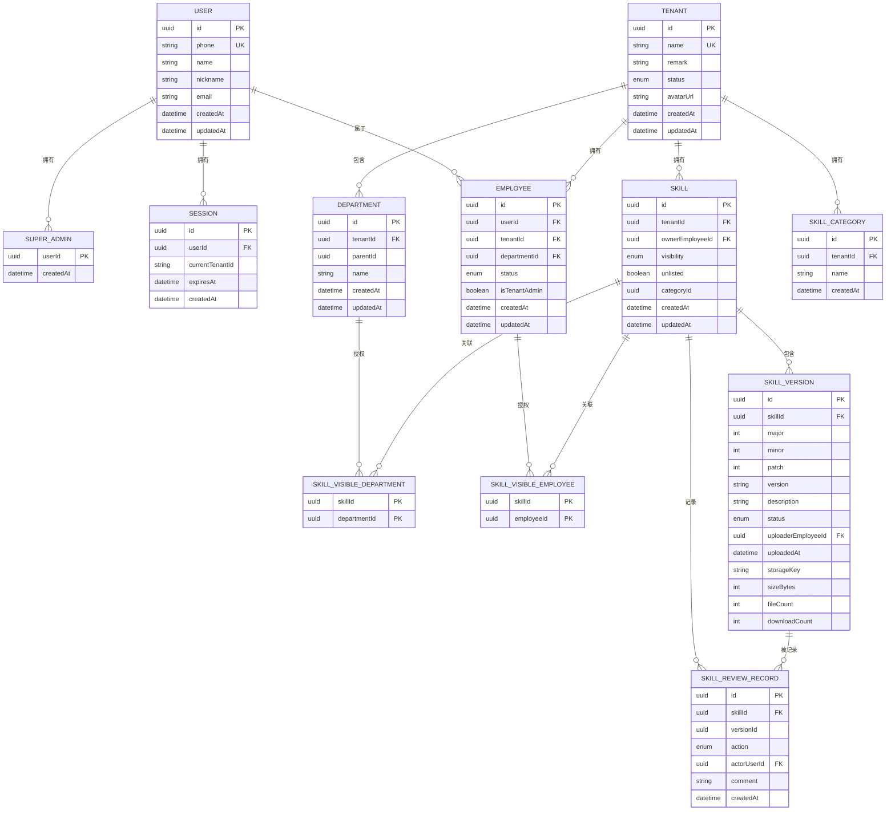

# 数据流设计

<cite>
**本文引用的文件**   
- [main.ts](file://apps/server/src/main.ts)
- [app.module.ts](file://apps/server/src/app.module.ts)
- [app.setup.ts](file://apps/server/src/app.setup.ts)
- [schema.prisma](file://apps/server/prisma/schema.prisma)
- [prisma.service.ts](file://apps/server/src/prisma/prisma.service.ts)
- [auth.controller.ts](file://apps/server/src/auth/auth.controller.ts)
- [auth.guard.ts](file://apps/server/src/auth/auth.guard.ts)
- [auth.service.ts](file://apps/server/src/auth/auth.service.ts)
- [session.ts](file://apps/server/src/auth/session.ts)
- [skills.controller.ts](file://apps/server/src/skills/skills.controller.ts)
- [skills.service.ts](file://apps/server/src/skills/skills.service.ts)
- [skill-upload.ts](file://apps/server/src/skills/skill-upload.ts)
- [skill-views.ts](file://apps/server/src/skills/skill-views.ts)
- [file-upload.interceptor.ts](file://apps/server/src/storage/file-upload.interceptor.ts)
- [private-file-storage.ts](file://apps/server/src/storage/private-file-storage.ts)
- [index.ts](file://packages/shared/src/index.ts)
- [skill.ts](file://packages/shared/src/skill.ts)
</cite>

## 目录
1. [引言](#引言)
2. [项目结构](#项目结构)
3. [核心组件](#核心组件)
4. [架构总览](#架构总览)
5. [详细组件分析](#详细组件分析)
6. [依赖关系分析](#依赖关系分析)
7. [性能与一致性](#性能与一致性)
8. [故障排查指南](#故障排查指南)
9. [结论](#结论)
10. [附录：实体关系图](#附录实体关系图)

## 引言
本文面向“技能库教学”系统的数据流设计，覆盖从前端到后端的完整请求链路、业务处理、数据库操作、多租户隔离、文件上传下载、以及事务与一致性策略。重点说明 Prisma ORM 的使用模式（模型定义、查询构建、事务）、多租户上下文传递与过滤、私有文件存储的安全访问控制，并给出数据流图和实体关系图，帮助读者快速理解系统的整体数据流转与关键约束。

## 项目结构
后端采用 NestJS 模块化架构，入口启动应用并挂载全局配置；Prisma 作为 ORM 提供类型安全的数据库访问；认证模块负责会话与会话上下文；技能模块承载核心业务；存储模块抽象私有文件存取。共享包提供 API 前缀、常量与 DTO 类型。

图表来源
- [main.ts:8-11](file://apps/server/src/main.ts#L8-L11)
- [app.setup.ts:7-24](file://apps/server/src/app.setup.ts#L7-L24)
- [app.module.ts:7-9](file://apps/server/src/app.module.ts#L7-L9)
- [index.ts:1-3](file://packages/shared/src/index.ts#L1-L3)

章节来源
- [main.ts:1-14](file://apps/server/src/main.ts#L1-L14)
- [app.module.ts:1-10](file://apps/server/src/app.module.ts#L1-L10)
- [app.setup.ts:1-26](file://apps/server/src/app.setup.ts#L1-L26)
- [index.ts:1-13](file://packages/shared/src/index.ts#L1-L13)

## 核心组件
- 应用启动与全局配置：统一 API 前缀、Cookie 解析、参数校验管道、优雅关闭钩子。
- 认证与会话：基于 Cookie 的 Token 会话，支持超管、租户管理员、租户成员三种角色校验，并在请求上注入当前租户上下文。
- 技能业务：Skill、SkillVersion、分类、可见性、审核记录等核心实体的增删改查、版本比较、并发保护、可见性过滤。
- 存储抽象：私有文件本地实现，按 key 读写，防止路径穿越，供业务层安全访问。
- Prisma ORM：PostgreSQL 适配器，集中管理连接与生命周期。

章节来源
- [app.setup.ts:7-24](file://apps/server/src/app.setup.ts#L7-L24)
- [auth.guard.ts:13-48](file://apps/server/src/auth/auth.guard.ts#L13-L48)
- [auth.service.ts:11-76](file://apps/server/src/auth/auth.service.ts#L11-L76)
- [skills.service.ts:114-469](file://apps/server/src/skills/skills.service.ts#L114-L469)
- [private-file-storage.ts:10-40](file://apps/server/src/storage/private-file-storage.ts#L10-L40)
- [prisma.service.ts:5-14](file://apps/server/src/prisma/prisma.service.ts#L5-L14)

## 架构总览
下图展示一次典型“上传 Skill 包并创建新版本”的端到端数据流：前端通过 multipart/form-data 上传 zip，服务端拦截器限制大小，控制器校验字段，服务层先落盘再写库，使用事务保证一致性，最后返回详情。

图表来源
- [skills.controller.ts:81-92](file://apps/server/src/skills/skills.controller.ts#L81-L92)
- [skill-upload.ts:5-12](file://apps/server/src/skills/skill-upload.ts#L5-L12)
- [skills.service.ts:259-282](file://apps/server/src/skills/skills.service.ts#L259-L282)
- [private-file-storage.ts:24-30](file://apps/server/src/storage/private-file-storage.ts#L24-L30)

## 详细组件分析

### 认证与会话数据流
- 登录：验证演示账号，查找用户与员工档案，生成随机 token，写入 Session 表，设置 Cookie。
- 鉴权守卫：默认需登录；根据装饰器判断是否超管、租户管理员或租户成员，填充 request.auth 上下文。
- 登出：删除 Session，清除 Cookie。

图表来源
- [auth.controller.ts:9-25](file://apps/server/src/auth/auth.controller.ts#L9-L25)
- [auth.service.ts:15-74](file://apps/server/src/auth/auth.service.ts#L15-L74)

章节来源
- [auth.controller.ts:1-26](file://apps/server/src/auth/auth.controller.ts#L1-L26)
- [auth.guard.ts:1-49](file://apps/server/src/auth/auth.guard.ts#L1-L49)
- [auth.service.ts:1-77](file://apps/server/src/auth/auth.service.ts#L1-L77)
- [session.ts:1-30](file://apps/server/src/auth/session.ts#L1-L30)

### 技能业务数据流与多租户隔离
- 多租户上下文：所有 Skill 查询强制携带 tenantId；非本租户资源一律视为不存在（404）。
- 可见性过滤：Skill 支持租户可见、特定部门可见、特定员工可见、仅自己可见；列表与详情均按当前员工身份动态过滤。
- 版本与审核：草稿/审核中/正式三态；管理员可直发，普通员工提交审核；变更可见性与分类会记录审计日志。
- 并发保护：对 Skill 行加锁（FOR UPDATE），确保同一 Skill 同时只有一个非正式版本，且版本号严格递增。

图表来源
- [skills.service.ts:126-144](file://apps/server/src/skills/skills.service.ts#L126-L144)
- [skill-views.ts:17-26](file://apps/server/src/skills/skill-views.ts#L17-L26)
- [skill-views.ts:96-101](file://apps/server/src/skills/skill-views.ts#L96-L101)

章节来源
- [skills.service.ts:54-113](file://apps/server/src/skills/skills.service.ts#L54-L113)
- [skills.service.ts:126-181](file://apps/server/src/skills/skills.service.ts#L126-L181)
- [skills.service.ts:224-282](file://apps/server/src/skills/skills.service.ts#L224-L282)
- [skills.service.ts:284-319](file://apps/server/src/skills/skills.service.ts#L284-L319)
- [skills.service.ts:330-428](file://apps/server/src/skills/skills.service.ts#L330-L428)
- [skill-views.ts:1-111](file://apps/server/src/skills/skill-views.ts#L1-L111)

### 文件上传下载数据流与安全策略
- 上传拦截：限制单文件大小，超过阈值直接返回 413，并消费剩余请求体避免连接重置。
- 包校验：解压后校验文件数与大小上限、非法路径、SKILL.md frontmatter、版本号格式与递增规则。
- 存储策略：先保存 zip 到私有目录，成功后再写库；失败则回滚删除已保存的文件，避免孤儿文件。
- 下载控制：仅允许查看者下载其有权访问的版本；正式版本下载次数 +1；文件名由业务生成。

图表来源
- [file-upload.interceptor.ts:5-27](file://apps/server/src/storage/file-upload.interceptor.ts#L5-L27)
- [skill-upload.ts:5-12](file://apps/server/src/skills/skill-upload.ts#L5-L12)
- [skill.ts:3-21](file://packages/shared/src/skill.ts#L3-L21)
- [skill.ts:52-71](file://packages/shared/src/skill.ts#L52-L71)
- [skill.ts:73-90](file://packages/shared/src/skill.ts#L73-L90)
- [private-file-storage.ts:24-39](file://apps/server/src/storage/private-file-storage.ts#L24-L39)
- [skills.service.ts:459-468](file://apps/server/src/skills/skills.service.ts#L459-L468)

章节来源
- [file-upload.interceptor.ts:1-28](file://apps/server/src/storage/file-upload.interceptor.ts#L1-L28)
- [skill-upload.ts:1-13](file://apps/server/src/skills/skill-upload.ts#L1-L13)
- [private-file-storage.ts:1-41](file://apps/server/src/storage/private-file-storage.ts#L1-L41)
- [skill.ts:1-90](file://packages/shared/src/skill.ts#L1-L90)
- [skills.service.ts:459-468](file://apps/server/src/skills/skills.service.ts#L459-L468)

### Prisma ORM 使用模式
- 数据模型：在 schema.prisma 中定义 Tenant、Department、Employee、Skill、SkillVersion、SkillReviewRecord 等实体及关系。
- 查询构建：使用 findMany/findFirst/where/include/orderBy 组合复杂查询；结合可见性过滤与搜索条件。
- 事务处理：$transaction 包裹多步写操作；必要时使用原生 SQL 行级锁 FOR UPDATE 串行化并发更新。
- 适配器：通过 PrismaPg 适配器连接 PostgreSQL，连接串来自环境变量。

章节来源
- [schema.prisma:1-219](file://apps/server/prisma/schema.prisma#L1-L219)
- [skills.service.ts:238-251](file://apps/server/src/skills/skills.service.ts#L238-L251)
- [skills.service.ts:269-280](file://apps/server/src/skills/skills.service.ts#L269-L280)
- [prisma.service.ts:5-14](file://apps/server/src/prisma/prisma.service.ts#L5-L14)

### 多租户数据隔离机制
- 上下文传递：会话中包含 currentTenantId；守卫在 @TenantMember/@TenantAdminOnly 时进一步加载 employee/tenantAdmin 上下文。
- 数据过滤：所有 Skill 查询强制 tenantId；可见性维度（部门/员工）通过中间表与辅助函数动态拼接 where 条件。
- 越权防护：跨租户访问一律 404；未选择租户或无权限访问租户接口时返回 403。

章节来源
- [auth.guard.ts:29-44](file://apps/server/src/auth/auth.guard.ts#L29-L44)
- [auth.service.ts:37-49](file://apps/server/src/auth/auth.service.ts#L37-L49)
- [skills.service.ts:126-144](file://apps/server/src/skills/skills.service.ts#L126-L144)

### 缓存策略与数据同步
- 缓存：当前代码未引入显式缓存层（如 Redis），热点数据读取直接走数据库。
- 同步：无外部数据源同步逻辑；审核记录与状态变更通过数据库事务保证一致。
- 扩展建议：如需提升读性能，可在 Service 层增加轻量级内存缓存或接入 Redis，注意失效策略与租户隔离键空间。

[本节为通用指导，不直接分析具体文件]

## 依赖关系分析

图表来源
- [main.ts:8-11](file://apps/server/src/main.ts#L8-L11)
- [app.setup.ts:7-24](file://apps/server/src/app.setup.ts#L7-L24)
- [app.module.ts:7-9](file://apps/server/src/app.module.ts#L7-L9)
- [private-file-storage.ts:1-4](file://apps/server/src/storage/private-file-storage.ts#L1-L4)

章节来源
- [main.ts:1-14](file://apps/server/src/main.ts#L1-L14)
- [app.module.ts:1-10](file://apps/server/src/app.module.ts#L1-L10)
- [private-file-storage.ts:1-41](file://apps/server/src/storage/private-file-storage.ts#L1-L41)

## 性能与一致性
- 数据库索引与唯一约束：Schema 中对常用查询字段建立索引（如 tenantId、categoryId、userId），并对唯一性进行约束（如 tenantId+name、userId+tenantId），减少冲突与扫描成本。
- 查询优化：列表查询优先在数据库侧完成过滤与排序，仅在必要时进行内存过滤（如关键词二次匹配）。
- 并发控制：使用 FOR UPDATE 锁定 Skill 行，配合“当前状态 = 期望状态”的条件更新，避免竞态导致的状态错乱。
- I/O 分离：大文件先落盘再写库，失败自动清理，降低长事务持有时间。
- 建议优化：
  - 对高频只读接口增加短 TTL 缓存（注意租户隔离键）。
  - 将下载次数统计改为异步任务或批量更新，降低写放大。
  - 对大结果集分页与游标排序，避免全量传输。

[本节为通用指导，不直接分析具体文件]

## 故障排查指南
- 登录失败：检查演示账号初始化与 Session 表写入；确认 Cookie 域名与 SameSite 配置。
- 403 权限不足：确认当前租户是否选择、是否为租户管理员或成员；检查装饰器使用是否正确。
- 404 资源不存在：核对 tenantId 是否匹配；检查可见性过滤是否排除了该 Skill。
- 409 冲突：版本号不合法或存在未发布版本；Skill 下架/上架重复操作；名称冲突。
- 上传失败：检查文件大小限制、zip 内容合法性、SKILL.md frontmatter 与 name 一致性。
- 文件丢失：检查 withStoredPackage 的回滚逻辑与存储目录权限。

章节来源
- [auth.controller.ts:9-25](file://apps/server/src/auth/auth.controller.ts#L9-L25)
- [auth.guard.ts:29-44](file://apps/server/src/auth/auth.guard.ts#L29-L44)
- [skills.service.ts:238-282](file://apps/server/src/skills/skills.service.ts#L238-L282)
- [skills.service.ts:398-428](file://apps/server/src/skills/skills.service.ts#L398-L428)
- [skill-upload.ts:5-12](file://apps/server/src/skills/skill-upload.ts#L5-L12)

## 结论
该系统以 Prisma ORM 为核心，围绕多租户隔离、可见性控制与版本审核流程构建了稳健的数据流。通过拦截器与存储服务实现安全的文件上传下载，利用事务与行级锁保障并发一致性。未来可在缓存与异步统计方面进一步优化性能，同时保持现有强一致与可审计的设计原则。

[本节为总结性内容，不直接分析具体文件]

## 附录：实体关系图

图表来源
- [schema.prisma:12-218](file://apps/server/prisma/schema.prisma#L12-L218)