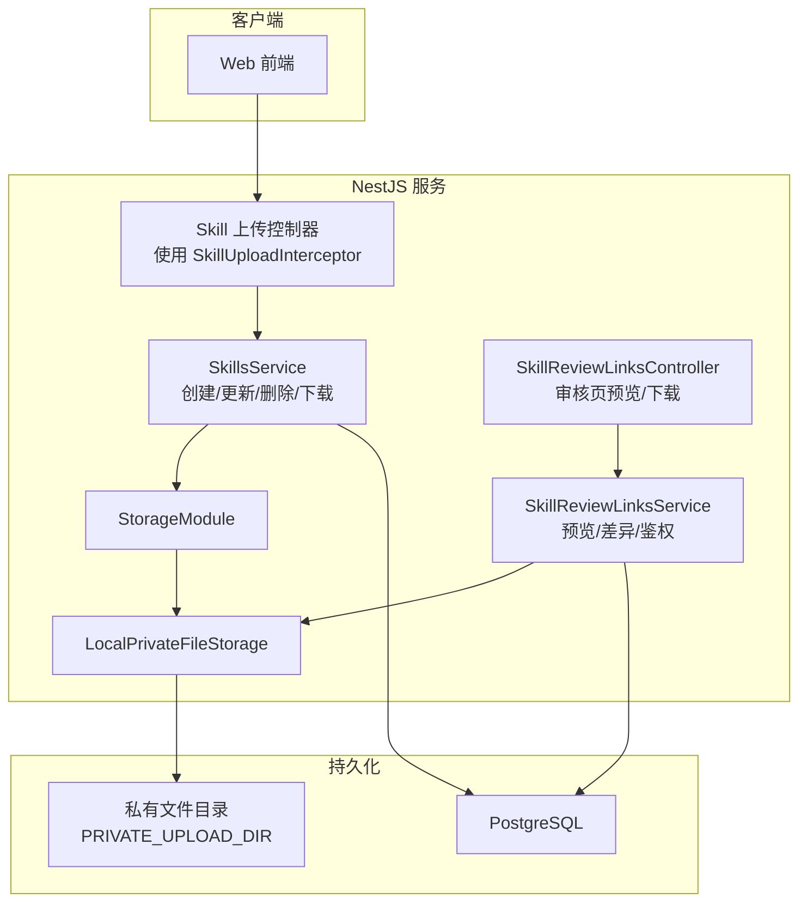
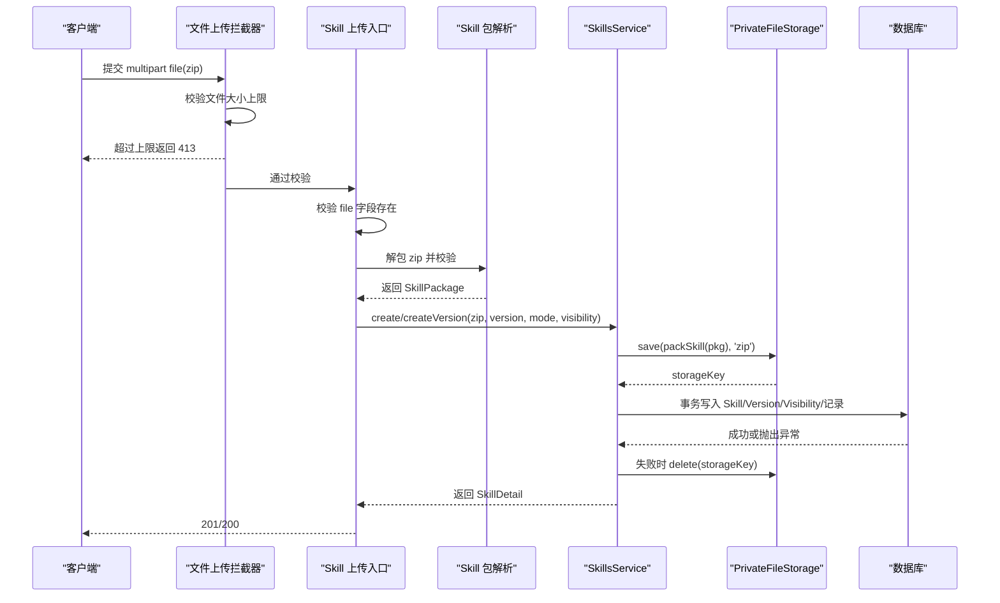
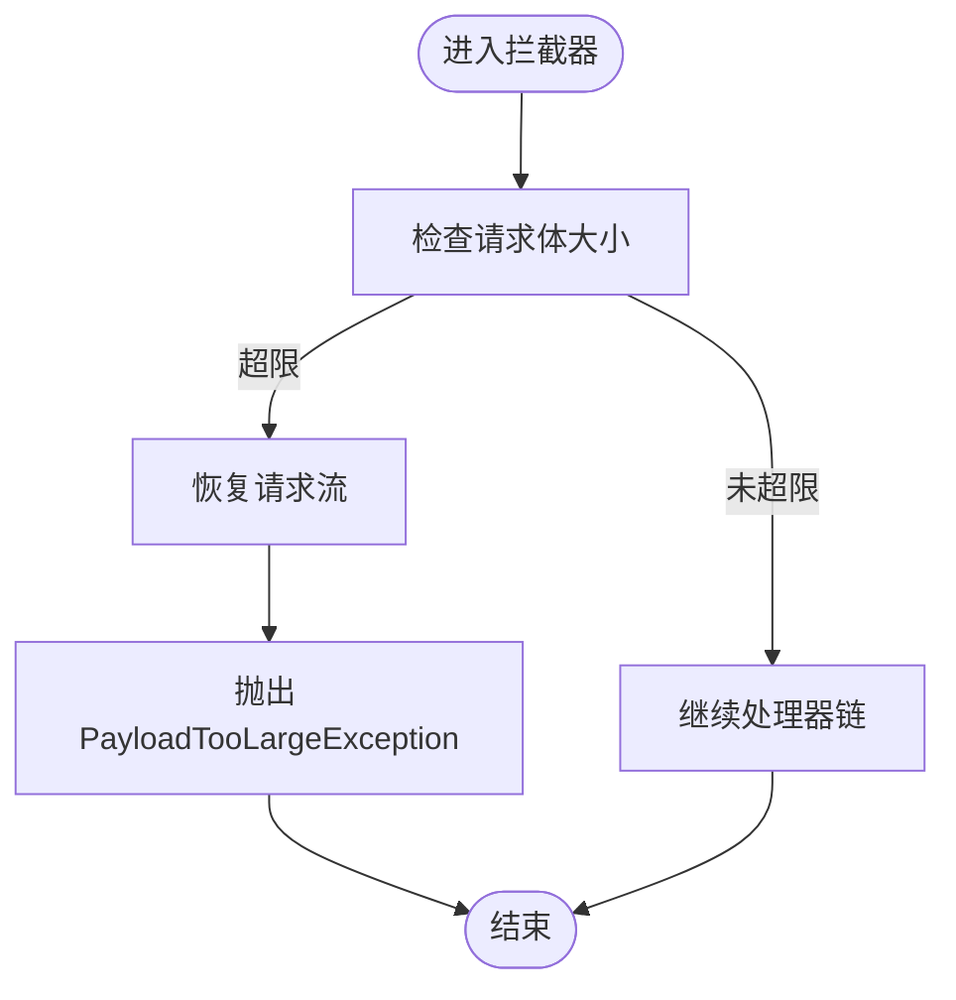
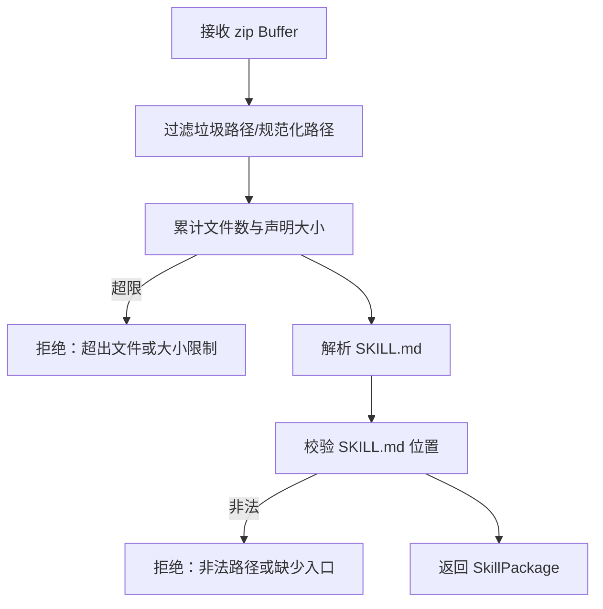
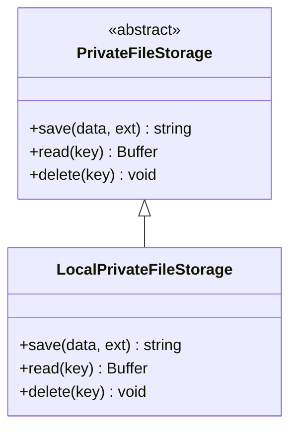
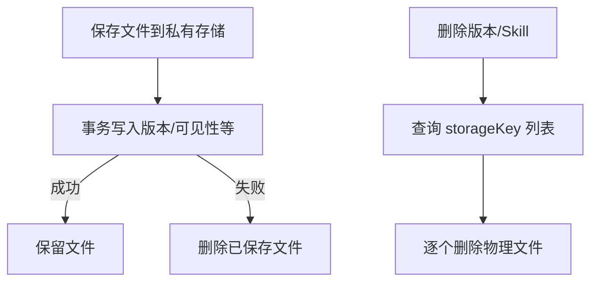
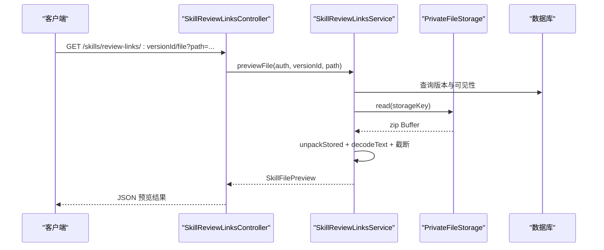
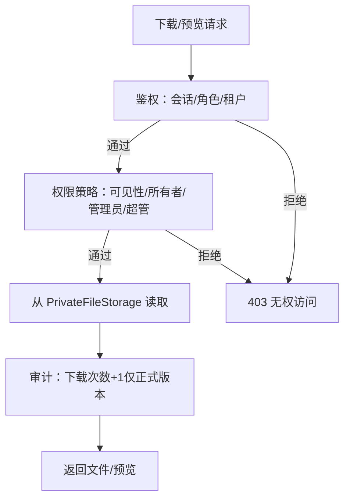
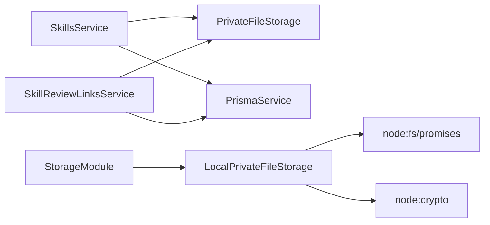

# 文件数据流

<cite>
**本文引用的文件**   
- [apps/server/src/storage/file-upload.interceptor.ts](file://apps/server/src/storage/file-upload.interceptor.ts)
- [apps/server/src/storage/private-file-storage.ts](file://apps/server/src/storage/private-file-storage.ts)
- [apps/server/src/storage/storage.module.ts](file://apps/server/src/storage/storage.module.ts)
- [apps/server/src/skills/skill-upload.ts](file://apps/server/src/skills/skill-upload.ts)
- [apps/server/src/skills/skill-package.ts](file://apps/server/src/skills/skill-package.ts)
- [apps/server/src/skills/skills.service.ts](file://apps/server/src/skills/skills.service.ts)
- [apps/server/src/skills/skill-review-links.controller.ts](file://apps/server/src/skills/skill-review-links.controller.ts)
- [apps/server/src/skills/skill-review-links.service.ts](file://apps/server/src/skills/skill-review-links.service.ts)
- [packages/shared/src/skill.ts](file://packages/shared/src/skill.ts)
- [docker-compose.yml](file://docker-compose.yml)
- [.gitignore](file://.gitignore)
</cite>

## 目录
1. [引言](#引言)
2. [项目结构](#项目结构)
3. [核心组件](#核心组件)
4. [架构总览](#架构总览)
5. [详细组件分析](#详细组件分析)
6. [依赖关系分析](#依赖关系分析)
7. [性能与容量特性](#性能与容量特性)
8. [故障排查指南](#故障排查指南)
9. [结论](#结论)

## 引言
本文面向“技能包”这一典型文件对象，完整描述其在系统中的上传、存储、访问与下载流程。重点包括：
- 文件上传拦截器：大小限制、类型校验、压缩包安全处理。
- 私有文件存储机制：本地磁盘实现、随机 key、路径穿越防护。
- 文件预览能力：文本/二进制识别、内容截断、差异对比。
- 生命周期管理：事务回滚清理、删除级联清理、部署卷挂载。
- 访问安全：鉴权接口、权限模型、防下载保护与审计计数。

## 项目结构
与文件数据流直接相关的后端模块集中在 `apps/server/src` 下，分为三层：
- 存储层：抽象私有存储接口与本地实现。
- 业务层：Skill 上传、版本管理、审核链接预览与下载。
- 共享常量与工具：文件大小、文件数、预览上限等跨端规则。

**图表来源**
- [apps/server/src/skills/skill-upload.ts:1-13](file://apps/server/src/skills/skill-upload.ts#L1-L13)
- [apps/server/src/skills/skills.service.ts:114-120](file://apps/server/src/skills/skills.service.ts#L114-L120)
- [apps/server/src/storage/storage.module.ts:1-4](file://apps/server/src/storage/storage.module.ts#L1-L4)
- [apps/server/src/storage/private-file-storage.ts:23-40](file://apps/server/src/storage/private-file-storage.ts#L23-L40)
- [apps/server/src/skills/skill-review-links.controller.ts:11-32](file://apps/server/src/skills/skill-review-links.controller.ts#L11-L32)
- [apps/server/src/skills/skill-review-links.service.ts:68-73](file://apps/server/src/skills/skill-review-links.service.ts#L68-L73)

**章节来源**
- [apps/server/src/storage/file-upload.interceptor.ts:1-28](file://apps/server/src/storage/file-upload.interceptor.ts#L1-L28)
- [apps/server/src/storage/private-file-storage.ts:1-41](file://apps/server/src/storage/private-file-storage.ts#L1-L41)
- [apps/server/src/skills/skill-upload.ts:1-13](file://apps/server/src/skills/skill-upload.ts#L1-L13)
- [apps/server/src/skills/skills.service.ts:114-120](file://apps/server/src/skills/skills.service.ts#L114-L120)
- [apps/server/src/skills/skill-review-links.controller.ts:11-32](file://apps/server/src/skills/skill-review-links.controller.ts#L11-L32)
- [apps/server/src/skills/skill-review-links.service.ts:68-73](file://apps/server/src/skills/skill-review-links.service.ts#L68-L73)
- [packages/shared/src/skill.ts:3-20](file://packages/shared/src/skill.ts#L3-L20)

## 核心组件
- 文件上传拦截器：基于 Multer 的单文件拦截器，按字节上限拒绝过大请求，并正确消费剩余请求体避免连接重置。
- Skill 上传入口：复用拦截器，设置略大于解压后上限的压缩包体积阈值；缺失 file 字段时返回 400。
- Skill 包解析：解包 zip，过滤垃圾路径，按声明大小与文件数做“zip 炸弹”防护，校验 SKILL.md 位置与元信息。
- 私有文件存储：抽象接口 + 本地磁盘实现；保存返回随机 key，读取/删除均对 key 取 basename 防止路径穿越。
- Skill 业务服务：负责版本状态、可见性、事务写入、下载计数、删除清理等。
- 审核链接服务：按身份授权，提供审阅页、包内文件预览、审阅下载。

**章节来源**
- [apps/server/src/storage/file-upload.interceptor.ts:5-27](file://apps/server/src/storage/file-upload.interceptor.ts#L5-L27)
- [apps/server/src/skills/skill-upload.ts:1-13](file://apps/server/src/skills/skill-upload.ts#L1-L13)
- [apps/server/src/skills/skill-package.ts:14-57](file://apps/server/src/skills/skill-package.ts#L14-L57)
- [apps/server/src/storage/private-file-storage.ts:6-40](file://apps/server/src/storage/private-file-storage.ts#L6-L40)
- [apps/server/src/skills/skills.service.ts:224-282](file://apps/server/src/skills/skills.service.ts#L224-L282)
- [apps/server/src/skills/skill-review-links.service.ts:68-146](file://apps/server/src/skills/skill-review-links.service.ts#L68-L146)

## 架构总览
下图展示从上传到存储、再到访问下载的端到端数据流与安全控制点。

**图表来源**
- [apps/server/src/storage/file-upload.interceptor.ts:13-24](file://apps/server/src/storage/file-upload.interceptor.ts#L13-L24)
- [apps/server/src/skills/skill-upload.ts:5-12](file://apps/server/src/skills/skill-upload.ts#L5-L12)
- [apps/server/src/skills/skill-package.ts:19-57](file://apps/server/src/skills/skill-package.ts#L19-L57)
- [apps/server/src/skills/skills.service.ts:236-253](file://apps/server/src/skills/skills.service.ts#L236-L253)
- [apps/server/src/skills/skills.service.ts:459-468](file://apps/server/src/skills/skills.service.ts#L459-L468)
- [apps/server/src/storage/private-file-storage.ts:24-30](file://apps/server/src/storage/private-file-storage.ts#L24-L30)

## 详细组件分析

### 文件上传拦截器与大小限制
- 拦截器封装 Multer 的 `FileInterceptor('file', { limits: { fileSize, files: 1 } })`，仅允许单文件。
- 捕获 `PayloadTooLargeException`，先恢复请求流再抛出中文提示，避免客户端 ECONNRESET。
- Skill 上传入口将拦截器阈值设为“解压后上限 + 5MB”，用于提前拦截明显超大的压缩包。

**图表来源**
- [apps/server/src/storage/file-upload.interceptor.ts:6-27](file://apps/server/src/storage/file-upload.interceptor.ts#L6-L27)
- [apps/server/src/skills/skill-upload.ts:5-6](file://apps/server/src/skills/skill-upload.ts#L5-L6)

**章节来源**
- [apps/server/src/storage/file-upload.interceptor.ts:1-28](file://apps/server/src/storage/file-upload.interceptor.ts#L1-L28)
- [apps/server/src/skills/skill-upload.ts:1-13](file://apps/server/src/skills/skill-upload.ts#L1-L13)

### 文件类型验证与安全扫描
- 类型验证：上传入口要求 multipart 字段名为 `file`，缺失则返回 400。
- 压缩包安全：
  - 在解包阶段忽略垃圾路径，按 zip 条目声明大小累加总量与文件数，超出即拒绝，防止 zip 炸弹。
  - 规范化路径，拒绝非法路径（如 `..`、绝对路径），避免目录穿越。
  - 校验 SKILL.md 必须位于根目录或唯一顶层文件夹，否则拒绝。
- 安全扫描：当前仓库未集成外部恶意代码扫描；主要依靠压缩包结构与路径白名单进行防御。

**图表来源**
- [apps/server/src/skills/skill-package.ts:19-57](file://apps/server/src/skills/skill-package.ts#L19-L57)
- [packages/shared/src/skill.ts:3-20](file://packages/shared/src/skill.ts#L3-L20)

**章节来源**
- [apps/server/src/skills/skill-upload.ts:8-12](file://apps/server/src/skills/skill-upload.ts#L8-L12)
- [apps/server/src/skills/skill-package.ts:14-57](file://apps/server/src/skills/skill-package.ts#L14-L57)
- [packages/shared/src/skill.ts:3-20](file://packages/shared/src/skill.ts#L3-L20)

### 私有文件存储机制
- 抽象接口 `PrivateFileStorage` 定义 `save/read/delete`，便于未来替换为 OSS。
- 本地实现 `LocalPrivateFileStorage`：
  - 保存：生成 UUID 文件名，写入 `PRIVATE_UPLOAD_DIR`，返回 key。
  - 读取/删除：对 key 取 basename，防止路径穿越。
- 存储模块通过 DI 注入具体实现。

**图表来源**
- [apps/server/src/storage/private-file-storage.ts:10-40](file://apps/server/src/storage/private-file-storage.ts#L10-L40)
- [apps/server/src/storage/storage.module.ts:1-4](file://apps/server/src/storage/storage.module.ts#L1-L4)

**章节来源**
- [apps/server/src/storage/private-file-storage.ts:1-41](file://apps/server/src/storage/private-file-storage.ts#L1-L41)
- [apps/server/src/storage/storage.module.ts:1-4](file://apps/server/src/storage/storage.module.ts#L1-L4)

### 文件生命周期管理
- 临时文件清理：
  - 业务逻辑采用“先落盘再写库”策略；若写库失败，会主动删除已保存的文件，确保不留下孤儿文件。
- 存储空间监控：
  - 当前无内置监控；可通过环境变量 `PRIVATE_UPLOAD_DIR` 映射独立数据卷，结合宿主系统监控磁盘空间。
- 备份策略：
  - 生产环境建议对 `PRIVATE_UPLOAD_DIR` 所在卷进行定期快照/备份；数据库中的 `storageKey` 作为索引，可据此定位物理文件。
- 删除与级联清理：
  - 删除单个版本或删除整个 Skill 时，会遍历并删除对应 storageKey 指向的物理文件。

**图表来源**
- [apps/server/src/skills/skills.service.ts:459-468](file://apps/server/src/skills/skills.service.ts#L459-L468)
- [apps/server/src/skills/skills.service.ts:374-428](file://apps/server/src/skills/skills.service.ts#L374-L428)
- [docker-compose.yml:20-26](file://docker-compose.yml#L20-L26)

**章节来源**
- [apps/server/src/skills/skills.service.ts:459-468](file://apps/server/src/skills/skills.service.ts#L459-L468)
- [apps/server/src/skills/skills.service.ts:374-428](file://apps/server/src/skills/skills.service.ts#L374-L428)
- [docker-compose.yml:20-26](file://docker-compose.yml#L20-L26)
- [.gitignore:8-9](file://.gitignore#L8-L9)

### 文件预览功能
- 预览入口：审核链接控制器暴露 `/skills/review-links/:versionId/file?path=...`。
- 鉴权：仅登录用户且具备角色（租户管理员、所有者、超管）可访问；不存在或无权限统一返回 403，避免泄露存在性。
- 格式识别：
  - 文本文件：尝试 UTF-8 解码；前 8KB 含 NUL 视为二进制。
  - 二进制文件：只返回 path、size、binary=true，不返回 content。
- 内容截断：文本预览超过上限字符数时截断，并标记 truncated。
- 差异对比：与服务端比较基准版本的 sha256，输出新增/修改/删除的文件列表。
- 缓存策略：当前实现每次预览都从私有存储读取并解包，未引入内存/分布式缓存。

**图表来源**
- [apps/server/src/skills/skill-review-links.controller.ts:27-31](file://apps/server/src/skills/skill-review-links.controller.ts#L27-L31)
- [apps/server/src/skills/skill-review-links.service.ts:105-123](file://apps/server/src/skills/skill-review-links.service.ts#L105-L123)
- [apps/server/src/skills/skill-package.ts:65-73](file://apps/server/src/skills/skill-package.ts#L65-L73)

**章节来源**
- [apps/server/src/skills/skill-review-links.controller.ts:11-32](file://apps/server/src/skills/skill-review-links.controller.ts#L11-L32)
- [apps/server/src/skills/skill-review-links.service.ts:33-61](file://apps/server/src/skills/skill-review-links.service.ts#L33-L61)
- [apps/server/src/skills/skill-review-links.service.ts:105-123](file://apps/server/src/skills/skill-review-links.service.ts#L105-L123)
- [apps/server/src/skills/skill-package.ts:65-73](file://apps/server/src/skills/skill-package.ts#L65-L73)
- [packages/shared/src/skill.ts:282-293](file://packages/shared/src/skill.ts#L282-L293)

### 文件访问与下载的安全机制
- 访问鉴权：
  - 普通下载：通过 `SkillsService.download`，需具备查看权限；正式版本下载成功后下载次数 +1。
  - 审阅下载：通过审核链接接口，仅允许具备审阅权限的用户；审阅下载不计入下载次数。
- 签名 URL：当前未实现签名 URL；所有访问均经过服务端鉴权接口。
- 访问日志：当前未实现独立的访问日志；下载次数作为轻量审计指标。
- 防下载保护：
  - 私有文件不经静态路由公开，只能通过业务接口读取。
  - 预览接口对 path 进行规范化与存在性校验，拒绝路径穿越。
  - 无权限与不存在统一返回 403，避免信息泄露。

**图表来源**
- [apps/server/src/skills/skills.service.ts:430-438](file://apps/server/src/skills/skills.service.ts#L430-L438)
- [apps/server/src/skills/skill-review-links.service.ts:125-129](file://apps/server/src/skills/skill-review-links.service.ts#L125-L129)
- [apps/server/src/skills/skill-review-links.service.ts:135-145](file://apps/server/src/skills/skill-review-links.service.ts#L135-L145)

**章节来源**
- [apps/server/src/skills/skills.service.ts:430-438](file://apps/server/src/skills/skills.service.ts#L430-L438)
- [apps/server/src/skills/skill-review-links.service.ts:125-145](file://apps/server/src/skills/skill-review-links.service.ts#L125-L145)

## 依赖关系分析
- 模块耦合：
  - `SkillsService` 依赖 `PrivateFileStorage` 与数据库，负责文件与数据的原子性操作。
  - `SkillReviewLinksService` 同样依赖 `PrivateFileStorage` 与数据库，专注审阅场景。
  - `StorageModule` 将 `LocalPrivateFileStorage` 绑定到抽象接口，便于替换。
- 外部依赖：
  - fflate：用于 zip 压缩/解压。
  - node:crypto：生成随机 key 与 sha256。
  - PostgreSQL：存储 Skill、Version、可见性与审核记录。
- 潜在循环依赖：当前未见循环导入；DI 由 NestJS 容器管理。

**图表来源**
- [apps/server/src/skills/skills.service.ts:114-120](file://apps/server/src/skills/skills.service.ts#L114-L120)
- [apps/server/src/skills/skill-review-links.service.ts:68-73](file://apps/server/src/skills/skill-review-links.service.ts#L68-L73)
- [apps/server/src/storage/storage.module.ts:1-4](file://apps/server/src/storage/storage.module.ts#L1-L4)
- [apps/server/src/storage/private-file-storage.ts:1-4](file://apps/server/src/storage/private-file-storage.ts#L1-L4)

**章节来源**
- [apps/server/src/skills/skills.service.ts:114-120](file://apps/server/src/skills/skills.service.ts#L114-L120)
- [apps/server/src/skills/skill-review-links.service.ts:68-73](file://apps/server/src/skills/skill-review-links.service.ts#L68-L73)
- [apps/server/src/storage/storage.module.ts:1-4](file://apps/server/src/storage/storage.module.ts#L1-L4)
- [apps/server/src/storage/private-file-storage.ts:1-4](file://apps/server/src/storage/private-file-storage.ts#L1-L4)

## 性能与容量特性
- 上传限制：
  - 压缩包本身：拦截器阈值约为解压后上限 + 5MB，避免超大请求。
  - 解压后：最多 20MB、最多 500 个文件，按 zip 声明大小与文件数双重校验。
- 预览性能：
  - 文本预览上限为 512KB，超过则截断，减少响应体与渲染压力。
  - 二进制文件不加载内容，仅返回元信息。
- I/O 模式：
  - 私有文件直读直写本地磁盘；未引入缓存层，高并发下可能成为瓶颈。
- 可扩展点：
  - 可将 `PrivateFileStorage` 替换为对象存储（OSS/S3），并结合 CDN 加速下载。
  - 可为预览增加 Redis 缓存，按版本+路径缓存文本内容。

[本节为通用指导，不直接分析具体文件]

## 故障排查指南
- 上传 413：
  - 现象：客户端收到 413 与中文消息。
  - 原因：multipart 请求体超过拦截器阈值。
  - 处理：检查客户端打包体积，确认是否超过“解压后上限 + 5MB”。
- 上传 400：
  - 现象：提示“请选择要上传的 Skill 文件夹”或“无法解析上传的压缩包”。
  - 原因：缺少 file 字段或 zip 格式不合法。
  - 处理：确认前端上传字段名与格式。
- 包校验失败：
  - 现象：提示“缺少 SKILL.md”“非法路径”“超出文件或大小限制”。
  - 原因：SKILL.md 不在根目录或唯一顶层文件夹，或包含 `..`/绝对路径，或文件数/大小超限。
  - 处理：修正 Skill 目录结构，移除垃圾文件，控制体积与数量。
- 预览 404/400：
  - 现象：文件不存在或未传 path。
  - 原因：path 不存在或为空。
  - 处理：确认 path 是否为包内相对路径。
- 预览 403：
  - 现象：无权限查看该版本。
  - 原因：非租户管理员/所有者/超管。
  - 处理：切换至有权限账号或使用审核链接。
- 下载次数未增加：
  - 现象：非正式版本下载后 downloadCount 不变。
  - 原因：仅正式版本下载会计数。
  - 处理：确认版本状态。

**章节来源**
- [apps/server/src/storage/file-upload.interceptor.ts:13-24](file://apps/server/src/storage/file-upload.interceptor.ts#L13-L24)
- [apps/server/src/skills/skill-upload.ts:8-12](file://apps/server/src/skills/skill-upload.ts#L8-L12)
- [apps/server/src/skills/skill-package.ts:19-57](file://apps/server/src/skills/skill-package.ts#L19-L57)
- [apps/server/src/skills/skill-review-links.service.ts:105-123](file://apps/server/src/skills/skill-review-links.service.ts#L105-L123)
- [apps/server/src/skills/skills.service.ts:430-438](file://apps/server/src/skills/skills.service.ts#L430-L438)

## 结论
该系统围绕“Skill 包”构建了完整的文件数据流：
- 上传阶段通过拦截器与包解析器完成大小、类型与路径安全校验。
- 存储阶段采用私有目录与随机 key，避免静态暴露，并通过 basename 防护路径穿越。
- 访问阶段通过鉴权接口与权限模型保障数据安全，区分正式下载与审阅下载。
- 生命周期方面，事务回滚清理与删除级联清理保证一致性；部署卷挂载支持持久化。
- 预览功能以文本/二进制识别与内容截断为核心，尚未引入缩略图与缓存。

如需进一步增强：
- 引入外部病毒/恶意代码扫描。
- 实现签名 URL 与访问日志。
- 扩展缩略图生成与预览缓存。
- 接入对象存储与 CDN，提升吞吐与可用性。

[本节为总结性内容，不直接分析具体文件]