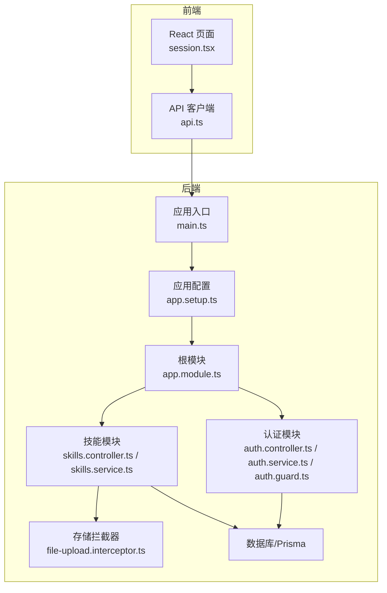
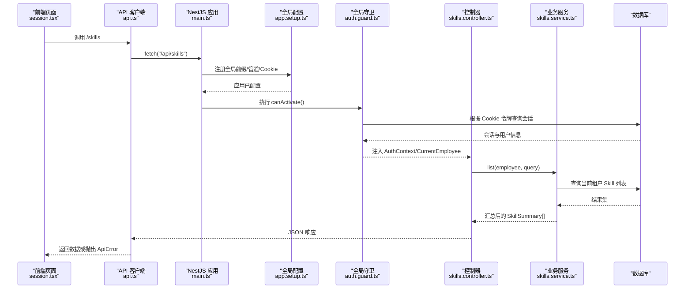
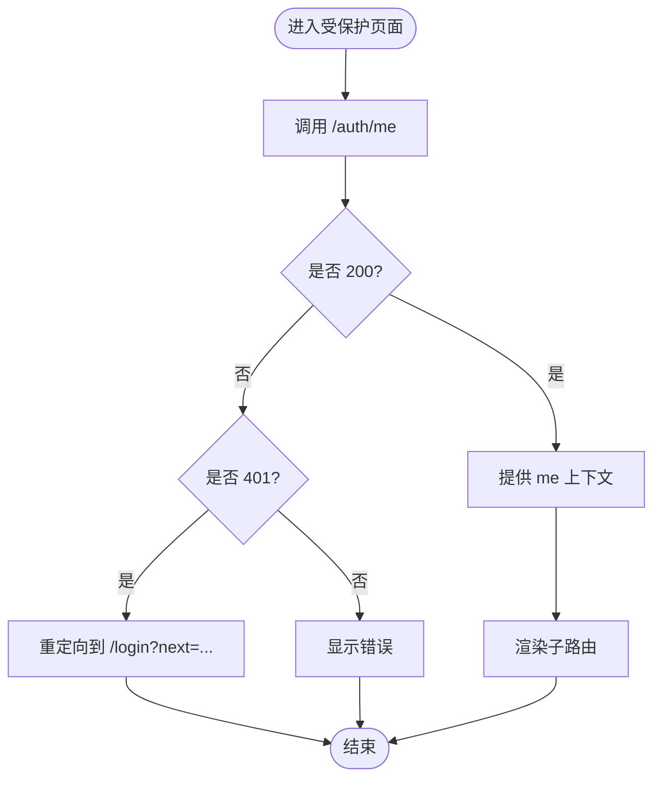
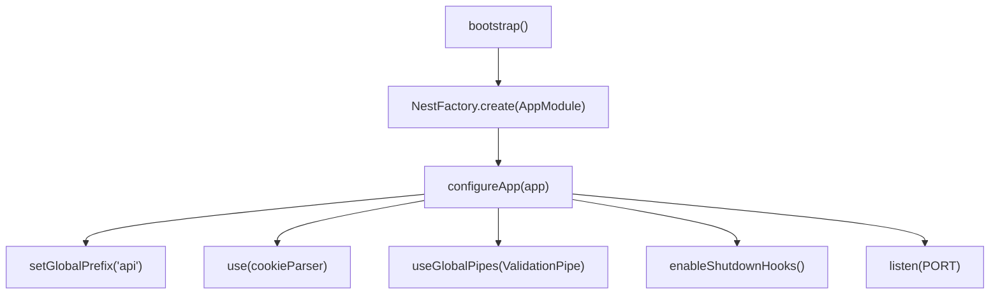
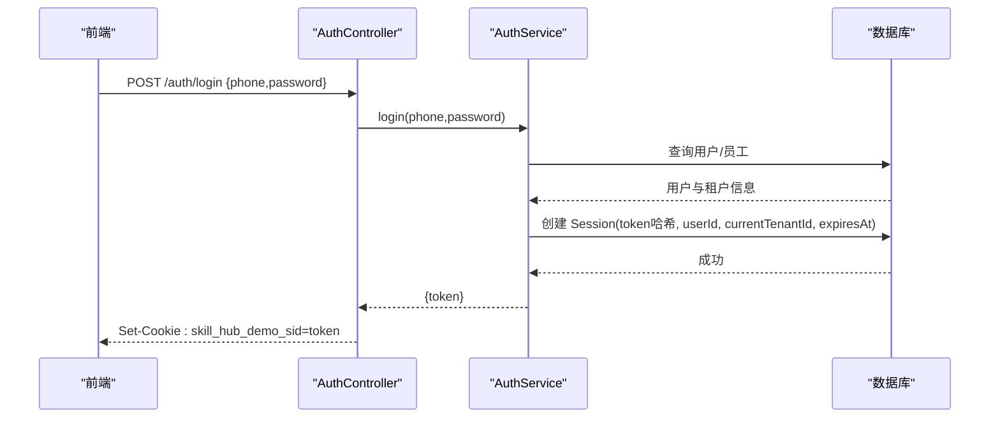
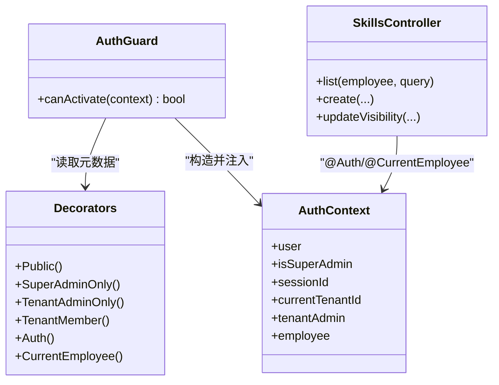
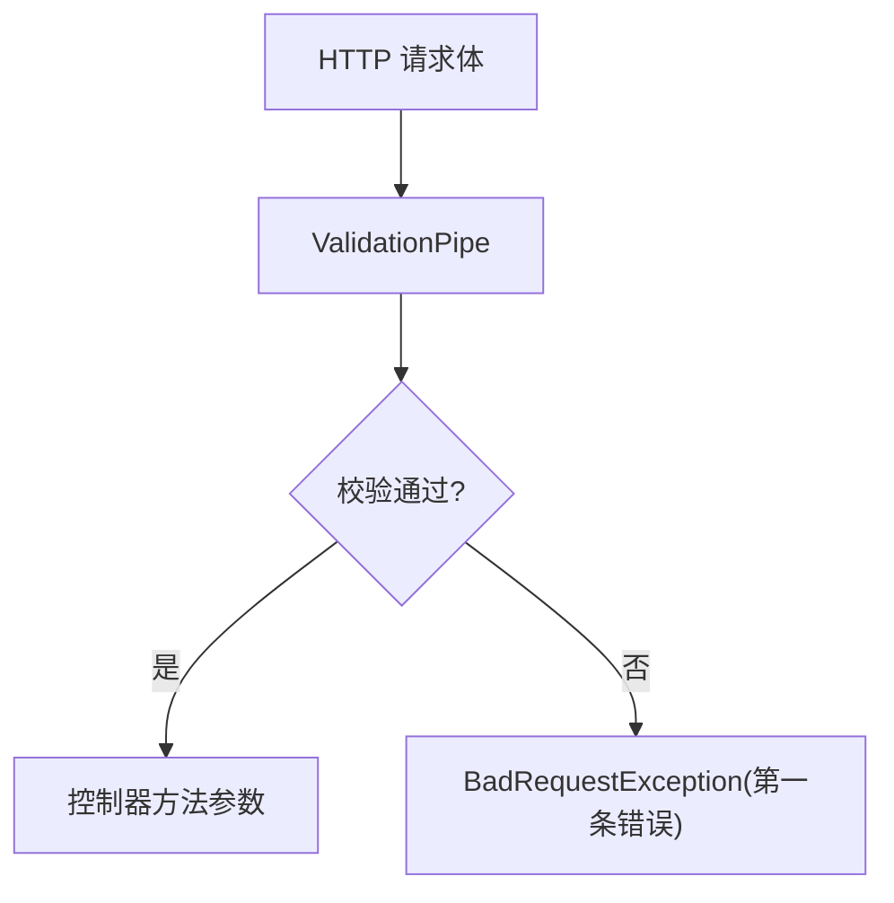
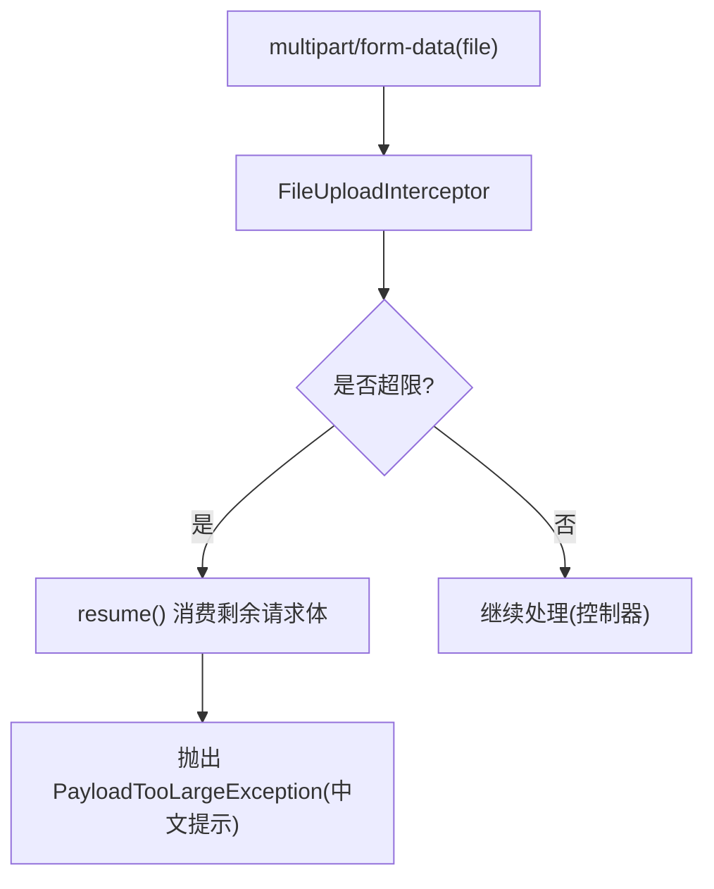
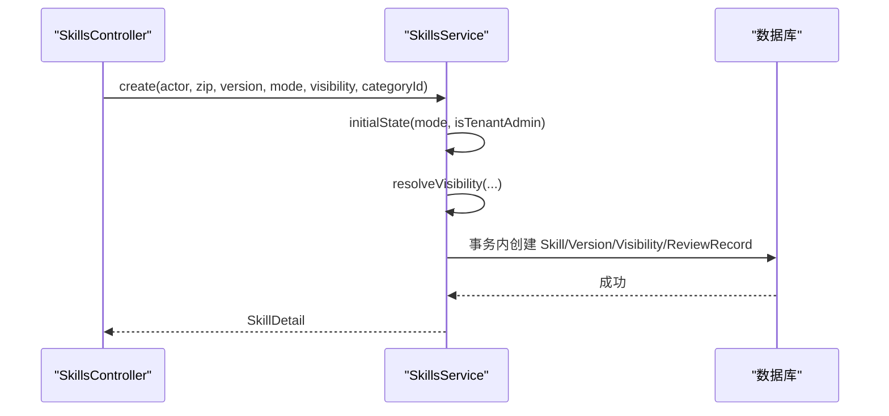
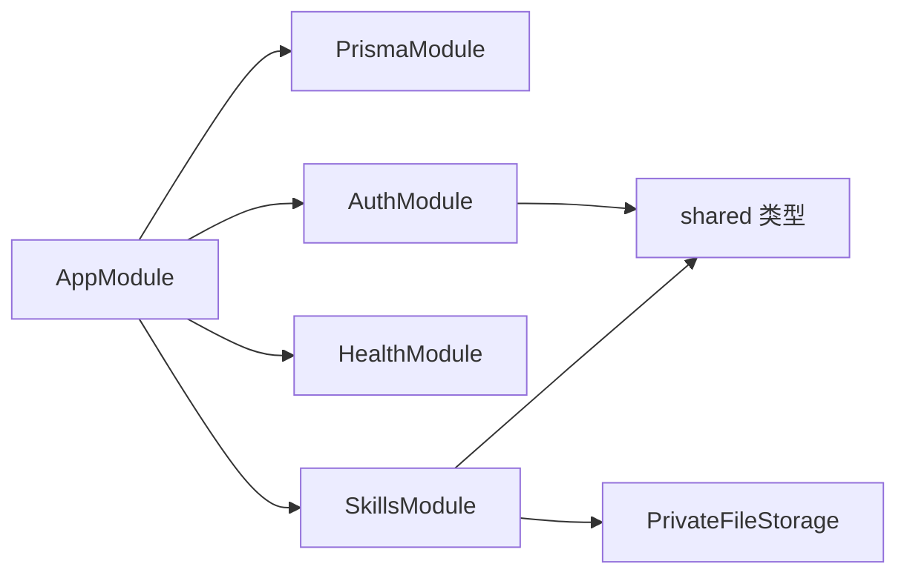

# 请求数据流

<cite>
**本文引用的文件**   
- [main.ts](file://apps/server/src/main.ts)
- [app.module.ts](file://apps/server/src/app.module.ts)
- [app.setup.ts](file://apps/server/src/app.setup.ts)
- [index.ts](file://packages/shared/src/index.ts)
- [api.ts](file://apps/web/src/api.ts)
- [session.tsx](file://apps/web/src/session.tsx)
- [auth.ts](file://packages/shared/src/auth.ts)
- [auth.controller.ts](file://apps/server/src/auth/auth.controller.ts)
- [auth.service.ts](file://apps/server/src/auth/auth.service.ts)
- [auth.guard.ts](file://apps/server/src/auth/auth.guard.ts)
- [decorators.ts](file://apps/server/src/auth/decorators.ts)
- [session.ts](file://apps/server/src/auth/session.ts)
- [skills.controller.ts](file://apps/server/src/skills/skills.controller.ts)
- [skill-upload.ts](file://apps/server/src/skills/skill-upload.ts)
- [file-upload.interceptor.ts](file://apps/server/src/storage/file-upload.interceptor.ts)
- [skills.service.ts](file://apps/server/src/skills/skills.service.ts)
</cite>

## 目录
1. [引言](#引言)
2. [项目结构](#项目结构)
3. [核心组件](#核心组件)
4. [架构总览](#架构总览)
5. [详细组件分析](#详细组件分析)
6. [依赖关系分析](#依赖关系分析)
7. [性能与可扩展性](#性能与可扩展性)
8. [故障排查指南](#故障排查指南)
9. [结论](#结论)

## 引言
本文面向“从前端到后端”的完整请求处理流程，覆盖 HTTP 生命周期、NestJS 中间件机制、守卫（Guards）、拦截器（Interceptors）和管道（Pipes）在数据流中的作用；说明前端 API 客户端如何设置请求头、处理错误与会话；解释多租户上下文如何在请求中传递与解析；并给出流程图与关键代码路径。

## 项目结构
本仓库采用前后端分离：
- 前端位于 apps/web，使用 React + Vite，通过统一 api.ts 调用后端 /api 接口，并在 session.tsx 中维护会话与路由守卫。
- 后端位于 apps/server，基于 NestJS + Express，入口 main.ts 启动应用，app.setup.ts 配置全局前缀、Cookie 解析、全局校验管道等；模块按功能拆分，如 auth、skills、storage、prisma 等。
- 共享类型与常量位于 packages/shared，包括 API 前缀、认证与会话相关类型、租户状态等。

**图示来源**
- [main.ts:8-13](file://apps/server/src/main.ts#L8-L13)
- [app.setup.ts:7-25](file://apps/server/src/app.setup.ts#L7-L25)
- [app.module.ts:7-9](file://apps/server/src/app.module.ts#L7-L9)
- [api.ts:16-30](file://apps/web/src/api.ts#L16-L30)
- [session.tsx:41-67](file://apps/web/src/session.tsx#L41-L67)

**章节来源**
- [main.ts:8-13](file://apps/server/src/main.ts#L8-L13)
- [app.setup.ts:7-25](file://apps/server/src/app.setup.ts#L7-L25)
- [app.module.ts:7-9](file://apps/server/src/app.module.ts#L7-L9)
- [index.ts:1-3](file://packages/shared/src/index.ts#L1-L3)

## 核心组件
- 前端 API 客户端：封装 fetch，统一 JSON/Multipart 发送、非 2xx 抛错、登出逻辑与安全跳转。
- 会话管理：前端通过 /auth/me 获取当前用户与租户信息，未登录时重定向到登录页；后端通过 Cookie 中的会话令牌维持登录态。
- 认证与权限：全局守卫从 Cookie 读取会话令牌，校验有效性，并按装饰器进行超管、租户管理员、租户成员权限判定。
- 参数校验：全局 ValidationPipe 对 DTO 进行白名单过滤、转换与错误聚合，统一返回第一条错误消息。
- 文件上传：拦截器限制文件大小、解析 multipart file 字段，并对超大请求体做优雅处理。
- 业务服务：以 SkillsService 为代表，实现多租户隔离、可见性控制、版本管理与审核记录等。

**章节来源**
- [api.ts:1-41](file://apps/web/src/api.ts#L1-L41)
- [session.tsx:1-67](file://apps/web/src/session.tsx#L1-L67)
- [auth.guard.ts:1-49](file://apps/server/src/auth/auth.guard.ts#L1-L49)
- [app.setup.ts:10-22](file://apps/server/src/app.setup.ts#L10-L22)
- [file-upload.interceptor.ts:1-28](file://apps/server/src/storage/file-upload.interceptor.ts#L1-L28)
- [skills.service.ts:114-144](file://apps/server/src/skills/skills.service.ts#L114-L144)

## 架构总览
下图展示一次受保护的 GET /api/skills 请求的生命周期：前端发起请求 → NestJS 应用启动与全局配置 → 全局管道校验 → 全局守卫鉴权与权限检查 → 控制器接收参数 → 业务服务处理 → 返回响应。

**图示来源**
- [main.ts:8-13](file://apps/server/src/main.ts#L8-L13)
- [app.setup.ts:7-25](file://apps/server/src/app.setup.ts#L7-L25)
- [auth.guard.ts:20-46](file://apps/server/src/auth/auth.guard.ts#L20-L46)
- [skills.controller.ts:17-21](file://apps/server/src/skills/skills.controller.ts#L17-L21)
- [skills.service.ts:126-136](file://apps/server/src/skills/skills.service.ts#L126-L136)

## 详细组件分析

### 前端 API 客户端与会话管理
- 请求封装：统一设置 Content-Type，自动序列化 JSON，支持 FormData 直传；非 2xx 响应统一抛出 ApiError，携带 status、message、code 与原始 body。
- 会话获取：RequireSession 组件在挂载时调用 /auth/me，成功则提供当前用户与租户上下文；401 时重定向到登录页，并保留 next 参数以便登录后回跳。
- 登出：调用 /auth/logout，忽略 401 异常以避免二次跳转。

**图示来源**
- [api.ts:16-30](file://apps/web/src/api.ts#L16-L30)
- [session.tsx:41-67](file://apps/web/src/session.tsx#L41-L67)

**章节来源**
- [api.ts:1-41](file://apps/web/src/api.ts#L1-L41)
- [session.tsx:1-67](file://apps/web/src/session.tsx#L1-L67)
- [auth.ts:27-32](file://packages/shared/src/auth.ts#L27-L32)

### 后端应用启动与全局配置
- 应用入口：创建 NestExpressApplication，调用 configureApp 完成全局配置后监听端口。
- 全局配置：
  - 设置 API 全局前缀为 shared 中定义的 API_PREFIX（即 api）。
  - 启用 cookie-parser，用于解析 Cookie。
  - 注册全局 ValidationPipe：开启 whitelist 与 transform，遇到校验失败时统一返回 BadRequestException，并取第一条错误消息。
  - 启用优雅关闭钩子。

**图示来源**
- [main.ts:8-13](file://apps/server/src/main.ts#L8-L13)
- [app.setup.ts:7-25](file://apps/server/src/app.setup.ts#L7-L25)
- [index.ts:1-3](file://packages/shared/src/index.ts#L1-L3)

**章节来源**
- [main.ts:8-13](file://apps/server/src/main.ts#L8-L13)
- [app.setup.ts:7-25](file://apps/server/src/app.setup.ts#L7-L25)
- [index.ts:1-3](file://packages/shared/src/index.ts#L1-L3)

### 认证与会话：Cookie、令牌与会话表
- 登录流程：
  - 前端 POST /api/auth/login，携带 phone/password。
  - 后端验证演示账号与用户存在，生成随机 token，写入 session 表（含 sessionId、userId、currentTenantId、expiresAt），并通过 Cookie 返回。
- 会话校验：
  - 全局守卫从 Cookie 读取 SESSION_COOKIE，调用 AuthService.authenticate 校验会话有效性（未过期、存在）。
  - 将解析出的 AuthContext 挂到 req.auth，供后续控制器与装饰器使用。
- 登出流程：
  - 前端 POST /api/auth/logout，后端删除对应会话并清除 Cookie。

**图示来源**
- [auth.controller.ts:12-16](file://apps/server/src/auth/auth.controller.ts#L12-L16)
- [auth.service.ts:15-24](file://apps/server/src/auth/auth.service.ts#L15-L24)

**章节来源**
- [auth.controller.ts:1-26](file://apps/server/src/auth/auth.controller.ts#L1-L26)
- [auth.service.ts:1-77](file://apps/server/src/auth/auth.service.ts#L1-L77)
- [auth.ts:1-39](file://packages/shared/src/auth.ts#L1-L39)
- [session.ts:1-30](file://apps/server/src/auth/session.ts#L1-L30)

### 权限模型：守卫、装饰器与多租户上下文
- 装饰器：
  - @Public：标记公开接口，跳过鉴权。
  - @SuperAdminOnly：仅超级管理员可访问。
  - @TenantAdminOnly：仅当前租户的管理员可访问。
  - @TenantMember：仅当前租户的启用中员工可访问。
  - @Auth/@CurrentEmployee：从 req.auth 中提取上下文。
- 全局守卫 AuthGuard：
  - 默认所有接口需登录。
  - 根据装饰器判断是否需要超管/租户管理员/租户成员权限。
  - 校验通过后填充 tenantAdmin/employee 上下文，并写入 req.auth。
- 多租户上下文：
  - 会话中保存 currentTenantId。
  - 控制器与服务层通过 CurrentEmployeeContext 获取 tenantId、employeeId、isTenantAdmin，确保所有查询都带租户隔离。

**图示来源**
- [auth.guard.ts:14-46](file://apps/server/src/auth/auth.guard.ts#L14-L46)
- [decorators.ts:1-17](file://apps/server/src/auth/decorators.ts#L1-L17)
- [session.ts:5-23](file://apps/server/src/auth/session.ts#L5-L23)
- [skills.controller.ts:1-10](file://apps/server/src/skills/skills.controller.ts#L1-L10)

**章节来源**
- [auth.guard.ts:1-49](file://apps/server/src/auth/auth.guard.ts#L1-L49)
- [decorators.ts:1-17](file://apps/server/src/auth/decorators.ts#L1-L17)
- [session.ts:1-30](file://apps/server/src/auth/session.ts#L1-L30)
- [skills.controller.ts:1-10](file://apps/server/src/skills/skills.controller.ts#L1-L10)

### 参数校验：全局管道与 DTO
- 全局 ValidationPipe：
  - whitelist=true：只允许 DTO 中声明的字段。
  - transform=true：自动将输入转换为 DTO 类型。
  - stopAtFirstError=true：遇到第一个错误即停止。
  - exceptionFactory：统一返回 BadRequestException，message 取第一条约束提示。
- DTO 示例：SkillListQueryDto、UploadSkillDto 等由控制器方法参数承载，并由管道自动校验。

**图示来源**
- [app.setup.ts:10-22](file://apps/server/src/app.setup.ts#L10-L22)
- [skills.controller.ts:1-10](file://apps/server/src/skills/skills.controller.ts#L1-L10)

**章节来源**
- [app.setup.ts:10-22](file://apps/server/src/app.setup.ts#L10-L22)
- [skills.controller.ts:1-10](file://apps/server/src/skills/skills.controller.ts#L1-L10)

### 文件上传：拦截器与大小限制
- 拦截器：
  - 使用 FileInterceptor 解析 multipart 字段 file。
  - 超过 maxBytes 时捕获 PayloadTooLargeException，先 resume 请求体避免连接重置，再抛出中文提示。
- 技能包上传：
  - SkillUploadInterceptor 基于 SKILL_MAX_BYTES 增加余量，防止明显超大请求。
  - requireFile 校验 file 是否存在，否则返回 400。

**图示来源**
- [file-upload.interceptor.ts:6-27](file://apps/server/src/storage/file-upload.interceptor.ts#L6-L27)
- [skill-upload.ts:1-12](file://apps/server/src/skills/skill-upload.ts#L1-L12)
- [skills.controller.ts:47-57](file://apps/server/src/skills/skills.controller.ts#L47-L57)

**章节来源**
- [file-upload.interceptor.ts:1-28](file://apps/server/src/storage/file-upload.interceptor.ts#L1-L28)
- [skill-upload.ts:1-12](file://apps/server/src/skills/skill-upload.ts#L1-L12)
- [skills.controller.ts:47-57](file://apps/server/src/skills/skills.controller.ts#L47-L57)

### 业务处理：Skills 模块的数据流
- 控制器职责：
  - 接收当前租户员工上下文与查询参数。
  - 组合 Actor（包含 employee 与 userId）传递给服务层。
  - 对上传接口使用 SkillUploadInterceptor 与 requireFile。
- 服务层职责：
  - 多租户隔离：所有查询均带 tenantId。
  - 可见性与权限：结合 canSeeSkill/canManage 等工具函数。
  - 版本管理：版本号比较、并发锁、草稿/审核/发布状态流转。
  - 审计记录：对关键变更写入审核记录。

**图示来源**
- [skills.controller.ts:47-57](file://apps/server/src/skills/skills.controller.ts#L47-L57)
- [skills.service.ts:224-253](file://apps/server/src/skills/skills.service.ts#L224-L253)

**章节来源**
- [skills.controller.ts:1-145](file://apps/server/src/skills/skills.controller.ts#L1-L145)
- [skills.service.ts:114-253](file://apps/server/src/skills/skills.service.ts#L114-L253)

## 依赖关系分析
- 模块装配：AppModule 导入 PrismaModule、AuthModule、HealthModule、SkillsModule。
- 跨模块依赖：
  - AuthModule 依赖 PrismaService 与共享类型。
  - SkillsModule 依赖 PrismaService、PrivateFileStorage 与共享类型。
  - 前端 api.ts 依赖共享类型 ApiErrorBody。

**图示来源**
- [app.module.ts:7-9](file://apps/server/src/app.module.ts#L7-L9)
- [auth.service.ts:1-13](file://apps/server/src/auth/auth.service.ts#L1-L13)
- [skills.service.ts:114-120](file://apps/server/src/skills/skills.service.ts#L114-L120)
- [api.ts:1-2](file://apps/web/src/api.ts#L1-L2)

**章节来源**
- [app.module.ts:7-9](file://apps/server/src/app.module.ts#L7-L9)
- [auth.service.ts:1-13](file://apps/server/src/auth/auth.service.ts#L1-L13)
- [skills.service.ts:114-120](file://apps/server/src/skills/skills.service.ts#L114-L120)
- [api.ts:1-2](file://apps/web/src/api.ts#L1-L2)

## 性能与可扩展性
- 全局管道集中校验，减少重复校验逻辑，提升一致性。
- 文件上传拦截器在内存中解析单文件，适合小体积压缩包；大文件建议引入流式处理与分片上传。
- 会话令牌哈希存储于数据库，避免明文泄露；TTL 固定 30 天，可按需调整。
- 多租户查询统一带 tenantId，索引与分页策略应围绕 tenantId 优化。
- 并发安全：版本更新与删除使用 SELECT ... FOR UPDATE 串行化，避免竞态条件。

[本节为通用指导，不直接分析具体文件]

## 故障排查指南
- 401 未登录：
  - 检查 Cookie 是否携带 skill_hub_demo_sid。
  - 确认会话未过期且存在于数据库。
  - 前端 RequireSession 会因 401 重定向到登录页。
- 400 参数非法：
  - 查看全局 ValidationPipe 抛出的第一条错误消息。
  - 检查 DTO 定义与前端提交字段是否一致。
- 413 文件过大：
  - 检查 SkillUploadInterceptor 的大小限制与中文提示。
  - 确认前端是否正确发送 multipart/form-data。
- 403 无权限：
  - 检查装饰器是否匹配角色（超管/租户管理员/租户成员）。
  - 确认 currentTenantId 与 EmployeeProfile 状态是否为 active。
- 409 冲突：
  - 名称冲突：返回已有 Skill id（若可见）。
  - 版本冲突：存在未正式版本或版本号不高于最高版本。

**章节来源**
- [auth.guard.ts:29-44](file://apps/server/src/auth/auth.guard.ts#L29-L44)
- [app.setup.ts:10-22](file://apps/server/src/app.setup.ts#L10-L22)
- [file-upload.interceptor.ts:13-23](file://apps/server/src/storage/file-upload.interceptor.ts#L13-L23)
- [skills.service.ts:259-282](file://apps/server/src/skills/skills.service.ts#L259-L282)
- [skills.service.ts:449-457](file://apps/server/src/skills/skills.service.ts#L449-L457)

## 结论
本项目的请求数据流以 NestJS 为核心，通过全局管道、守卫与拦截器形成统一的鉴权、校验与处理能力；前端通过统一的 API 客户端与会话组件保证一致的交互体验。多租户上下文贯穿认证、权限与业务层，确保数据隔离与安全性。建议在大规模场景下进一步优化文件上传与缓存策略，并结合监控与日志完善可观测性。