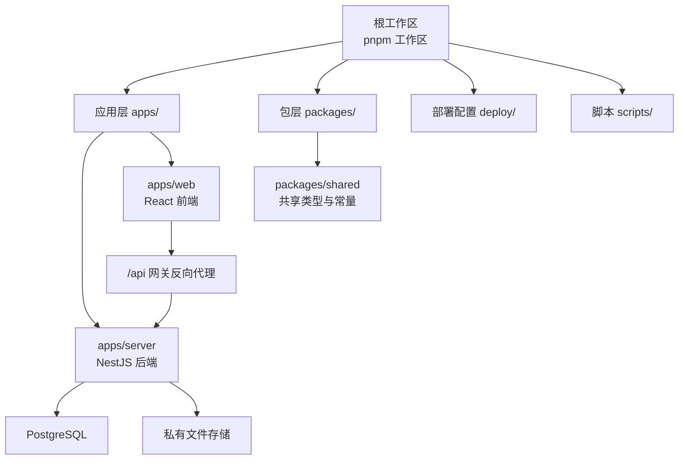
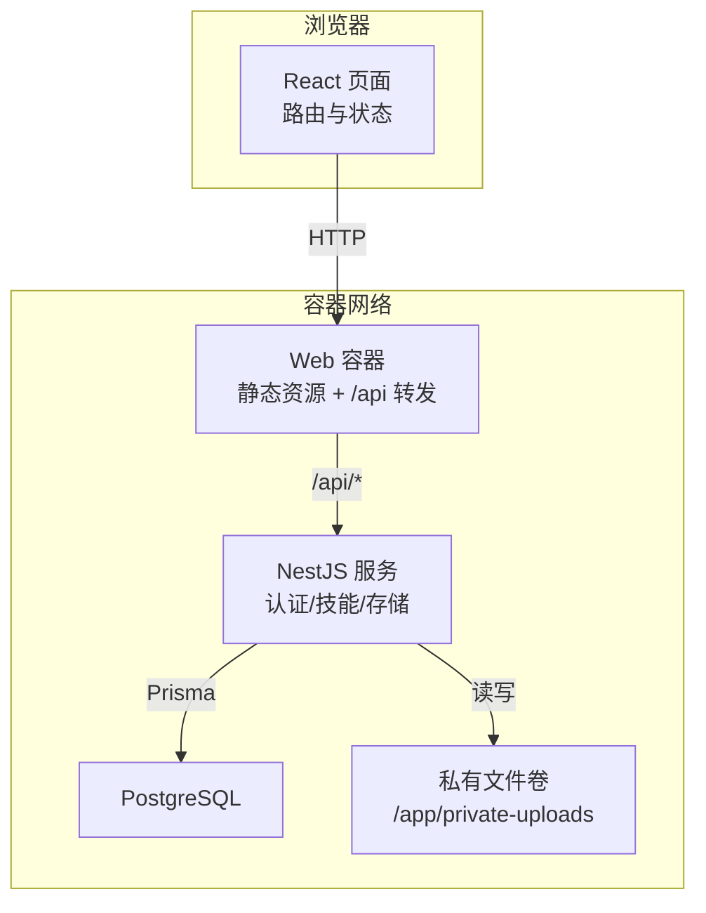
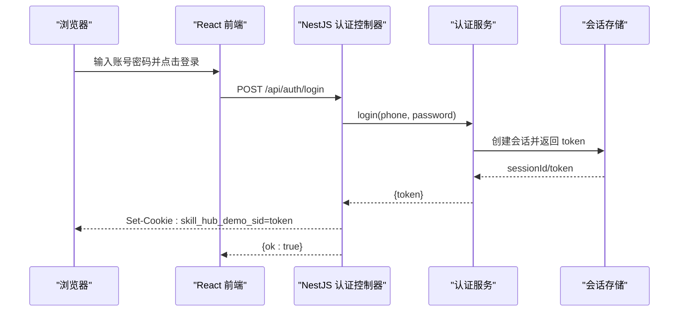
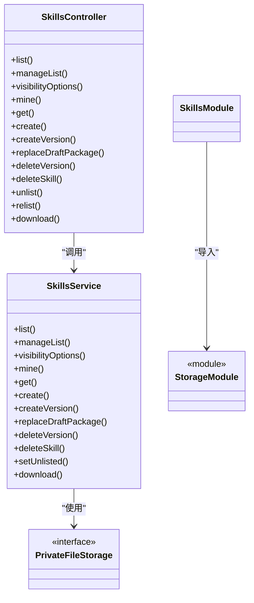
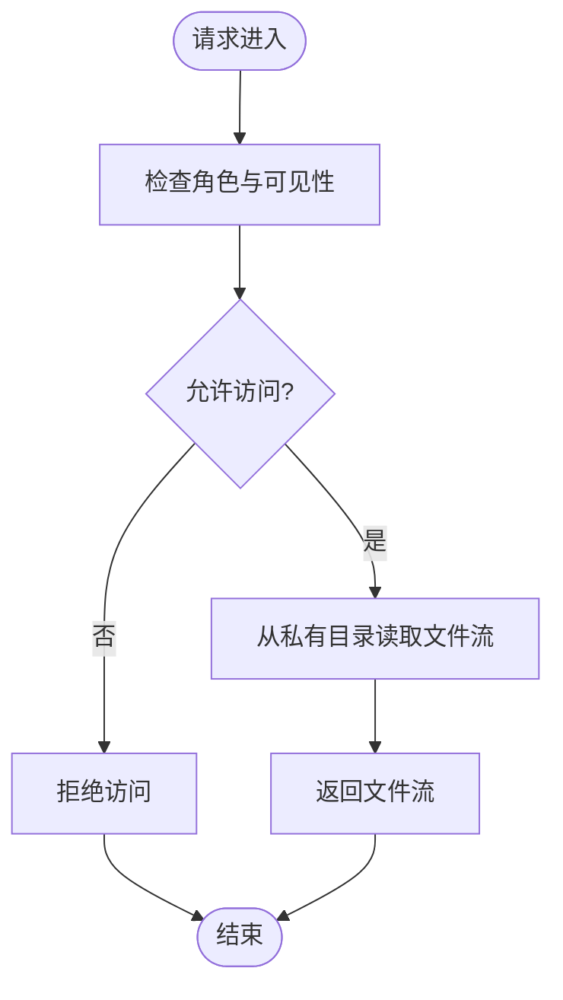
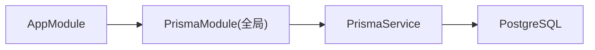
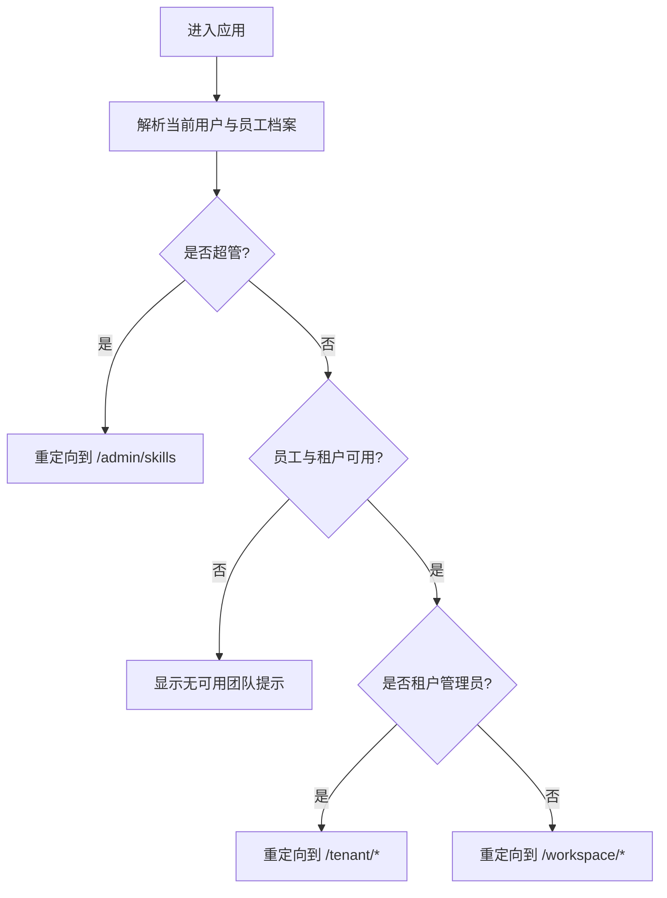
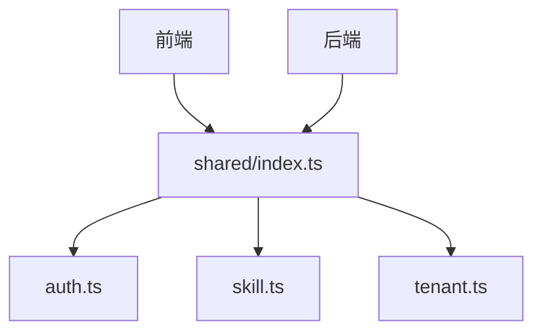
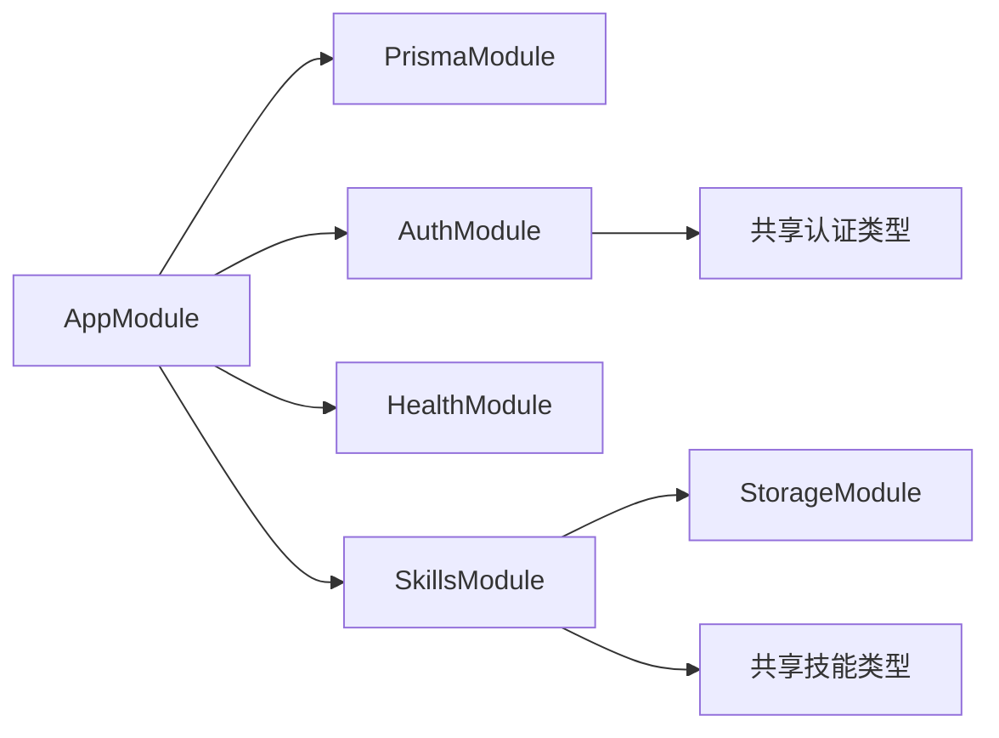
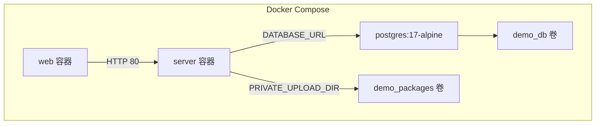

# 整体架构概览

<cite>
**本文引用的文件**   
- [README.md](file://README.md)
- [package.json](file://package.json)
- [pnpm-workspace.yaml](file://pnpm-workspace.yaml)
- [apps/server/src/main.ts](file://apps/server/src/main.ts)
- [apps/server/src/app.module.ts](file://apps/server/src/app.module.ts)
- [apps/server/src/auth/auth.module.ts](file://apps/server/src/auth/auth.module.ts)
- [apps/server/src/auth/auth.controller.ts](file://apps/server/src/auth/auth.controller.ts)
- [apps/server/src/skills/skills.module.ts](file://apps/server/src/skills/skills.module.ts)
- [apps/server/src/skills/skills.controller.ts](file://apps/server/src/skills/skills.controller.ts)
- [apps/server/src/storage/storage.module.ts](file://apps/server/src/storage/storage.module.ts)
- [apps/server/src/prisma/prisma.module.ts](file://apps/server/src/prisma/prisma.module.ts)
- [apps/web/src/App.tsx](file://apps/web/src/App.tsx)
- [apps/web/src/api.ts](file://apps/web/src/api.ts)
- [packages/shared/src/index.ts](file://packages/shared/src/index.ts)
- [packages/shared/src/auth.ts](file://packages/shared/src/auth.ts)
- [packages/shared/src/skill.ts](file://packages/shared/src/skill.ts)
- [docker-compose.yml](file://docker-compose.yml)
</cite>

## 目录
1. [引言](#引言)
2. [项目结构](#项目结构)
3. [核心组件](#核心组件)
4. [架构总览](#架构总览)
5. [详细组件分析](#详细组件分析)
6. [依赖关系分析](#依赖关系分析)
7. [性能与可扩展性](#性能与可扩展性)
8. [故障排查指南](#故障排查指南)
9. [结论](#结论)
10. [附录：技术选型与部署策略](#附录技术选型与部署策略)

## 引言
Skill Hub Teaching 是一个面向教学演示的 Skill 资产平台，采用前后端分离、Monorepo 组织方式。后端使用 NestJS + Prisma + PostgreSQL，前端使用 React + Ant Design，共享类型定义放在 packages/shared。系统支持 Skill 上传、版本管理、审核流程、分类、可见范围控制、上下架与下载，并提供超管与租户管理员角色能力。

该项目强调：
- 清晰的模块边界：认证、技能、存储、数据库访问各自独立。
- 可测试性与可移植性：通过 Docker Compose 一键运行，提供端到端测试脚本。
- 共享契约：前后端通过 packages/shared 的类型与常量保持一致。

**章节来源**
- [README.md:1-67](file://README.md#L1-L67)

## 项目结构
仓库为 pnpm Monorepo，根 package.json 提供统一脚本，apps 下包含 server 与 web，packages 下包含 shared。

**图表来源**
- [package.json:1-19](file://package.json#L1-L19)
- [apps/server/src/app.module.ts:1-10](file://apps/server/src/app.module.ts#L1-L10)
- [apps/web/src/App.tsx:1-66](file://apps/web/src/App.tsx#L1-L66)
- [packages/shared/src/index.ts:1-13](file://packages/shared/src/index.ts#L1-L13)

**章节来源**
- [package.json:1-19](file://package.json#L1-L19)
- [README.md:1-67](file://README.md#L1-L67)

## 核心组件
- 应用入口与模块装配
  - NestJS 应用由主模块导入 PrismaModule、AuthModule、HealthModule、SkillsModule，形成服务装配骨架。
- 认证模块 AuthModule
  - 暴露登录、登出、当前用户信息接口；通过全局守卫实现鉴权；会话以 Cookie 形式维护。
- 技能模块 SkillsModule
  - 聚合技能目录、版本、审核、分类、可见性等控制器与服务；依赖 StorageModule 进行文件读写。
- 存储模块 StorageModule
  - 抽象 PrivateFileStorage，默认实现本地私有目录存储，导出给业务模块使用。
- 数据库模块 PrismaModule
  - 全局模块，提供 PrismaService，供各业务模块注入使用。

**章节来源**
- [apps/server/src/app.module.ts:1-10](file://apps/server/src/app.module.ts#L1-L10)
- [apps/server/src/auth/auth.module.ts:1-13](file://apps/server/src/auth/auth.module.ts#L1-L13)
- [apps/server/src/skills/skills.module.ts:1-19](file://apps/server/src/skills/skills.module.ts#L1-L19)
- [apps/server/src/storage/storage.module.ts:1-5](file://apps/server/src/storage/storage.module.ts#L1-L5)
- [apps/server/src/prisma/prisma.module.ts:1-10](file://apps/server/src/prisma/prisma.module.ts#L1-L10)

## 架构总览
系统采用前后端分离架构：
- 前端 React 应用通过 /api 前缀调用后端 REST API。
- 后端 NestJS 应用负责认证、权限、Skill 生命周期、文件存储与数据库访问。
- 数据持久化使用 PostgreSQL，通过 Prisma 生成类型安全的客户端。
- 文件资源保存在独立的私有目录，不直接对外暴露静态路径。

**图表来源**
- [docker-compose.yml:1-48](file://docker-compose.yml#L1-L48)
- [apps/web/src/App.tsx:1-66](file://apps/web/src/App.tsx#L1-L66)
- [apps/server/src/app.module.ts:1-10](file://apps/server/src/app.module.ts#L1-L10)

## 详细组件分析

### 认证模块（AuthModule）
职责边界：
- 提供登录、登出、获取当前用户信息的 REST 接口。
- 通过全局守卫校验会话，保护受保护的资源。
- 与会话 Cookie 交互，设置安全属性与过期时间。

**图表来源**
- [apps/server/src/auth/auth.controller.ts:1-26](file://apps/server/src/auth/auth.controller.ts#L1-L26)
- [packages/shared/src/auth.ts:1-39](file://packages/shared/src/auth.ts#L1-L39)

**章节来源**
- [apps/server/src/auth/auth.module.ts:1-13](file://apps/server/src/auth/auth.module.ts#L1-L13)
- [apps/server/src/auth/auth.controller.ts:1-26](file://apps/server/src/auth/auth.controller.ts#L1-L26)
- [packages/shared/src/auth.ts:1-39](file://packages/shared/src/auth.ts#L1-L39)

### 技能模块（SkillsModule）
职责边界：
- 提供 Skill 的目录浏览、详情查看、上传、版本管理、审核、分类、可见性、上下架与下载等能力。
- 与 StorageModule 协作处理 ZIP 包的上传与下载。
- 通过装饰器与上下文对象区分普通员工、租户管理员与超管的权限。

**图表来源**
- [apps/server/src/skills/skills.controller.ts:1-145](file://apps/server/src/skills/skills.controller.ts#L1-L145)
- [apps/server/src/skills/skills.module.ts:1-19](file://apps/server/src/skills/skills.module.ts#L1-L19)
- [apps/server/src/storage/storage.module.ts:1-5](file://apps/server/src/storage/storage.module.ts#L1-L5)

**章节来源**
- [apps/server/src/skills/skills.module.ts:1-19](file://apps/server/src/skills/skills.module.ts#L1-L19)
- [apps/server/src/skills/skills.controller.ts:1-145](file://apps/server/src/skills/skills.controller.ts#L1-L145)

### 存储模块（StorageModule）
职责边界：
- 抽象文件存储服务 PrivateFileStorage，默认实现为本地私有目录存储。
- 通过依赖注入向业务模块导出存储服务，便于替换或扩展（例如云存储）。

**图表来源**
- [apps/server/src/storage/storage.module.ts:1-5](file://apps/server/src/storage/storage.module.ts#L1-L5)
- [apps/server/src/skills/skills.controller.ts:135-143](file://apps/server/src/skills/skills.controller.ts#L135-L143)

**章节来源**
- [apps/server/src/storage/storage.module.ts:1-5](file://apps/server/src/storage/storage.module.ts#L1-L5)

### 数据库模块（PrismaModule）
职责边界：
- 作为全局模块提供 PrismaService，供其他模块注入使用。
- 统一管理数据库连接与事务（由上层服务封装）。

**图表来源**
- [apps/server/src/app.module.ts:1-10](file://apps/server/src/app.module.ts#L1-L10)
- [apps/server/src/prisma/prisma.module.ts:1-10](file://apps/server/src/prisma/prisma.module.ts#L1-L10)

**章节来源**
- [apps/server/src/prisma/prisma.module.ts:1-10](file://apps/server/src/prisma/prisma.module.ts#L1-L10)

### 前端路由与页面组织（React）
职责边界：
- 基于 react-router 定义多角色路由：超管控制台、租户控制台、工作台。
- 根据当前用户与员工档案决定首页重定向与菜单项。
- 通过统一的 api.ts 发起 HTTP 请求，封装错误处理与登出逻辑。

**图表来源**
- [apps/web/src/App.tsx:1-66](file://apps/web/src/App.tsx#L1-L66)

**章节来源**
- [apps/web/src/App.tsx:1-66](file://apps/web/src/App.tsx#L1-L66)
- [apps/web/src/api.ts:1-42](file://apps/web/src/api.ts#L1-L42)

### 共享类型库（packages/shared）
职责边界：
- 定义前后端共用的常量、接口与工具函数，如健康检查路径、认证数据结构、Skill 模型与校验规则。
- 保证前后端契约一致，减少重复定义与不一致风险。

**图表来源**
- [packages/shared/src/index.ts:1-13](file://packages/shared/src/index.ts#L1-L13)
- [packages/shared/src/auth.ts:1-39](file://packages/shared/src/auth.ts#L1-L39)
- [packages/shared/src/skill.ts:1-401](file://packages/shared/src/skill.ts#L1-L401)

**章节来源**
- [packages/shared/src/index.ts:1-13](file://packages/shared/src/index.ts#L1-L13)
- [packages/shared/src/auth.ts:1-39](file://packages/shared/src/auth.ts#L1-L39)
- [packages/shared/src/skill.ts:1-401](file://packages/shared/src/skill.ts#L1-L401)

## 依赖关系分析
- 模块耦合
  - AppModule 聚合 PrismaModule、AuthModule、HealthModule、SkillsModule，松耦合装配。
  - SkillsModule 依赖 StorageModule，避免在业务模块中直接操作文件系统。
  - AuthModule 通过全局守卫影响所有控制器，集中鉴权逻辑。
- 外部依赖
  - PostgreSQL 作为唯一持久化存储。
  - 私有文件目录用于存放 Skill ZIP 包，不通过静态目录公开。
- 潜在循环依赖
  - 模块间仅单向依赖，未见循环引用。

**图表来源**
- [apps/server/src/app.module.ts:1-10](file://apps/server/src/app.module.ts#L1-L10)
- [apps/server/src/skills/skills.module.ts:1-19](file://apps/server/src/skills/skills.module.ts#L1-L19)
- [apps/server/src/auth/auth.module.ts:1-13](file://apps/server/src/auth/auth.module.ts#L1-L13)

**章节来源**
- [apps/server/src/app.module.ts:1-10](file://apps/server/src/app.module.ts#L1-L10)
- [apps/server/src/skills/skills.module.ts:1-19](file://apps/server/src/skills/skills.module.ts#L1-L19)
- [apps/server/src/auth/auth.module.ts:1-13](file://apps/server/src/auth/auth.module.ts#L1-L13)

## 性能与可扩展性
- 模块化设计提升可测试性与可替换性：存储实现可替换为云存储；认证策略可扩展。
- 文件流式下载减少内存占用；ZIP 包大小与文件数限制防止滥用。
- 数据库访问通过 Prisma 获得类型安全与查询优化空间。
- 建议：
  - 对高频查询增加索引与分页。
  - 对大文件上传引入分片与断点续传。
  - 对静态资源与下载启用 CDN 与缓存策略。

[本节为通用指导，不涉及具体文件分析]

## 故障排查指南
- 登录失败
  - 检查 Cookie 名称与安全属性是否与后端一致。
  - 确认会话有效期与跨域设置。
- 文件上传失败
  - 检查 ZIP 包大小与文件数量是否超过限制。
  - 检查私有目录挂载与权限。
- 下载失败
  - 检查可见性与上下架状态。
  - 检查文件是否存在于私有目录。
- 数据库连接问题
  - 检查 DATABASE_URL 与端口映射。
  - 检查容器健康检查与启动顺序。

**章节来源**
- [apps/server/src/auth/auth.controller.ts:1-26](file://apps/server/src/auth/auth.controller.ts#L1-L26)
- [packages/shared/src/skill.ts:1-401](file://packages/shared/src/skill.ts#L1-L401)
- [docker-compose.yml:1-48](file://docker-compose.yml#L1-L48)

## 结论
Skill Hub Teaching 通过 Monorepo 将前后端与共享类型解耦，采用 NestJS 模块化与 Prisma 类型安全访问数据库，结合私有文件存储与 Docker Compose 容器化部署，提供了稳定、可测试、易扩展的教学演示平台。认证、技能、存储与数据库模块职责清晰，前后端通过共享契约保持一致，适合教学与二次开发。

[本节为总结性内容，不涉及具体文件分析]

## 附录：技术选型与部署策略

### 技术选型理由
- NestJS
  - 提供成熟的模块化、依赖注入与装饰器生态，便于构建企业级后端。
  - 与 TypeScript 原生集成，提升类型安全与可维护性。
- React + Ant Design
  - 组件丰富、生态成熟，适合快速构建管理后台与工作台界面。
- Prisma
  - 类型安全的数据库客户端，自动生成类型，降低前后端契约漂移风险。
- PostgreSQL
  - 稳定可靠的关系型数据库，适合结构化数据与复杂查询。

[本节为通用说明，不涉及具体文件分析]

### 部署架构图与容器化策略
- 容器组成
  - postgres：PostgreSQL 数据库，数据持久化到命名卷。
  - server：NestJS 服务，环境变量配置数据库连接、端口与私有目录。
  - web：React 静态资源容器，暴露 HTTP 端口并通过反向代理转发 /api 请求。
- 数据持久化
  - demo_db 卷保存数据库数据。
  - demo_packages 卷保存私有 Skill 包。
- 健康检查
  - 数据库 pg_isready 检测。
  - 服务端 /api/health 检测。
  - Web 容器依赖服务端健康后启动。

**图表来源**
- [docker-compose.yml:1-48](file://docker-compose.yml#L1-L48)

**章节来源**
- [docker-compose.yml:1-48](file://docker-compose.yml#L1-L48)
- [README.md:37-52](file://README.md#L37-L52)