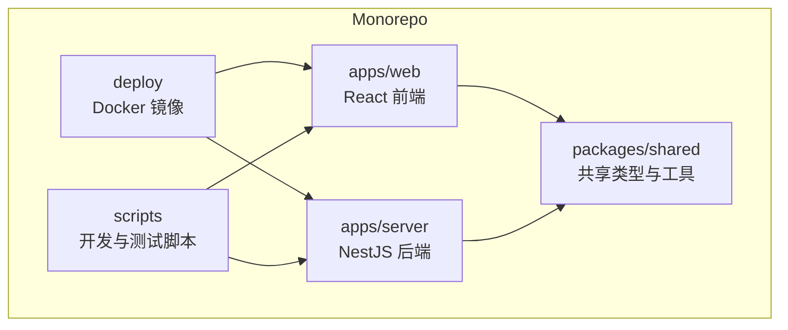
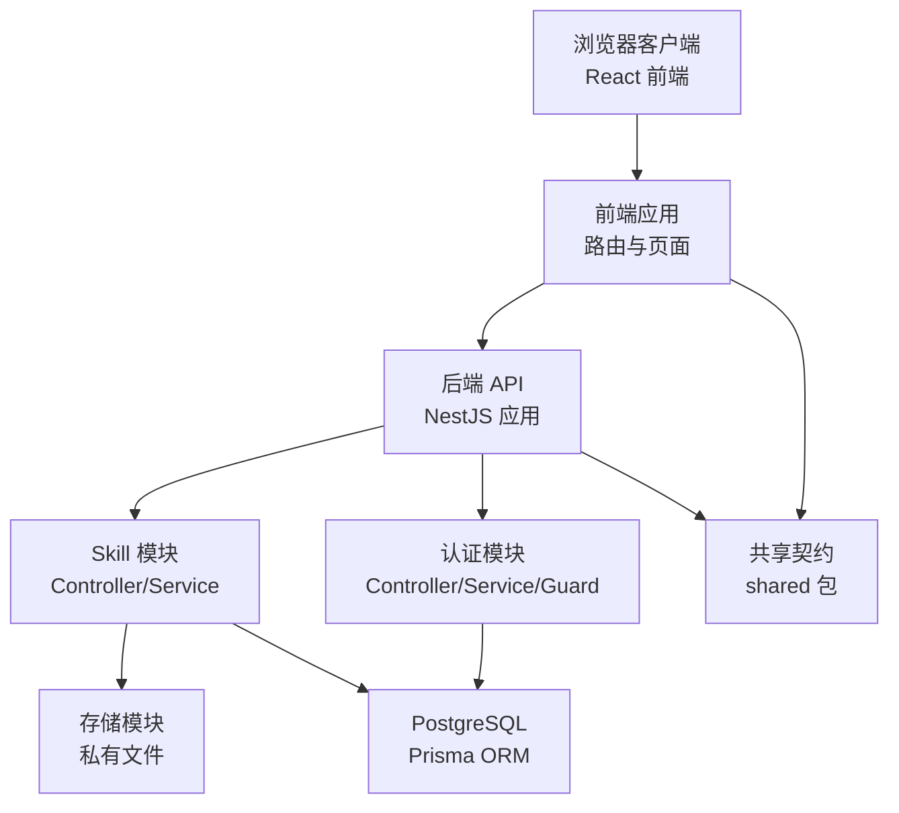
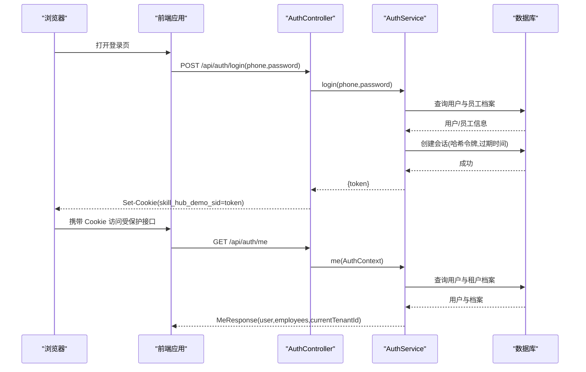
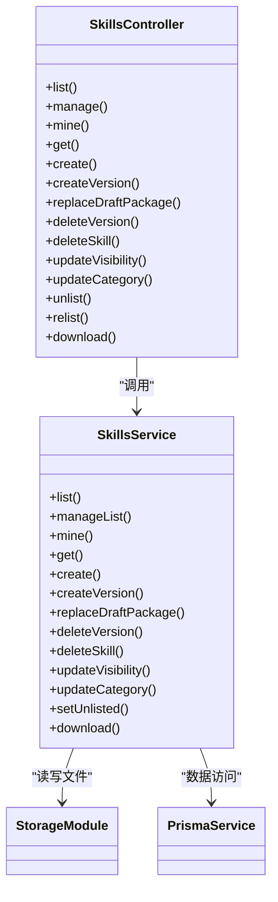
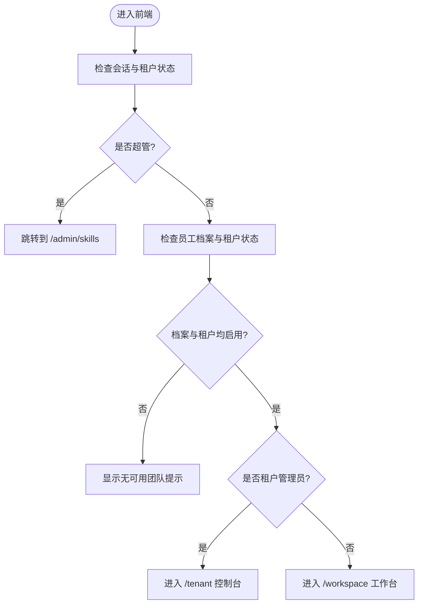
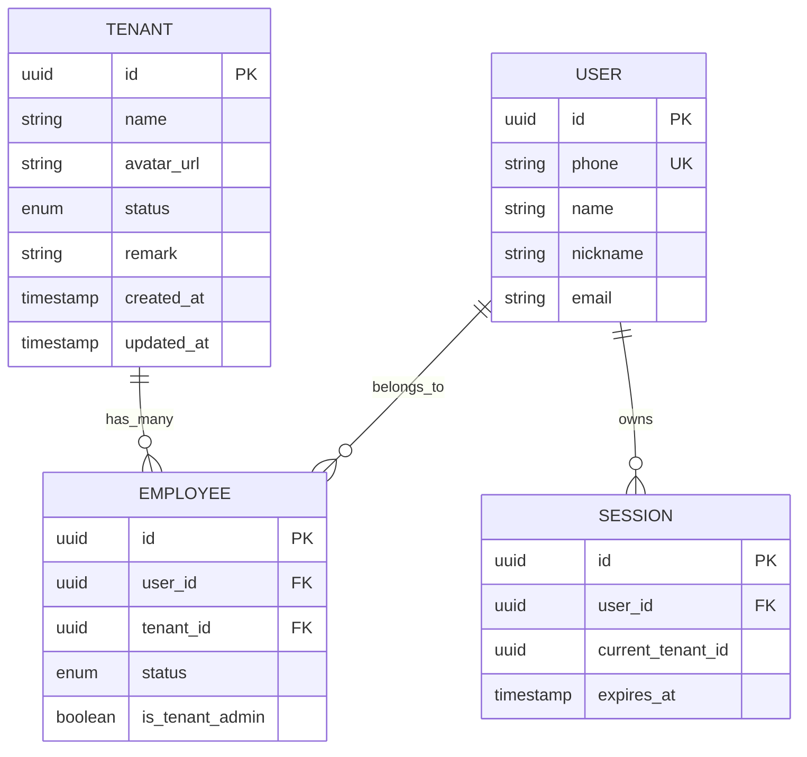
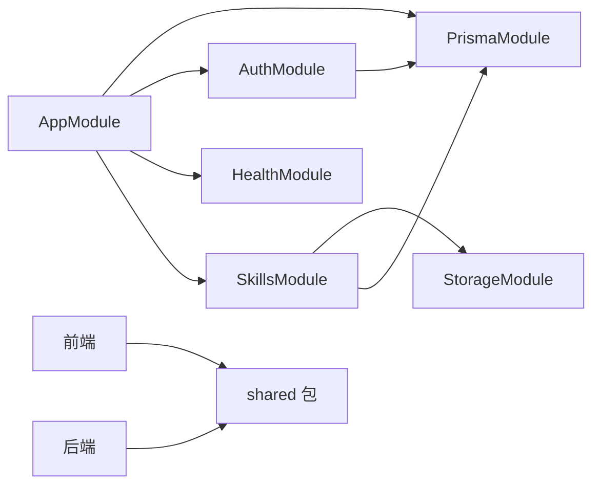

# 架构设计

<cite>
**本文引用的文件**   
- [README.md](file://README.md)
- [package.json](file://package.json)
- [pnpm-workspace.yaml](file://pnpm-workspace.yaml)
- [apps/server/src/main.ts](file://apps/server/src/main.ts)
- [apps/server/src/app.module.ts](file://apps/server/src/app.module.ts)
- [apps/server/src/app.setup.ts](file://apps/server/src/app.setup.ts)
- [apps/web/src/App.tsx](file://apps/web/src/App.tsx)
- [packages/shared/src/index.ts](file://packages/shared/src/index.ts)
- [packages/shared/src/auth.ts](file://packages/shared/src/auth.ts)
- [packages/shared/src/tenant.ts](file://packages/shared/src/tenant.ts)
- [packages/shared/src/skill.ts](file://packages/shared/src/skill.ts)
- [apps/server/src/auth/auth.module.ts](file://apps/server/src/auth/auth.module.ts)
- [apps/server/src/auth/auth.controller.ts](file://apps/server/src/auth/auth.controller.ts)
- [apps/server/src/auth/auth.service.ts](file://apps/server/src/auth/auth.service.ts)
- [apps/server/src/skills/skills.module.ts](file://apps/server/src/skills/skills.module.ts)
- [apps/server/src/skills/skills.controller.ts](file://apps/server/src/skills/skills.controller.ts)
</cite>

## 目录
1. [引言](#引言)
2. [项目结构](#项目结构)
3. [核心组件](#核心组件)
4. [架构总览](#架构总览)
5. [详细组件分析](#详细组件分析)
6. [依赖关系分析](#依赖关系分析)
7. [性能与可扩展性](#性能与可扩展性)
8. [故障排查指南](#故障排查指南)
9. [结论](#结论)

## 引言
Skill Hub Teaching 是一个面向教学演示的 Skill 管理平台，采用前后端分离、Monorepo 组织方式。后端使用 NestJS + Prisma + PostgreSQL，前端使用 React + Ant Design，共享类型与常量通过 packages/shared 暴露给两端复用。系统支持多租户、部门与员工可见性控制、Skill 版本管理与审核流程，并提供私有文件存储与下载能力。

本架构文档从系统边界、模块职责、数据流、权限模型、分层架构、依赖注入、部署形态与扩展优化等维度进行说明，帮助读者快速理解并在此基础上演进。

## 项目结构
仓库采用 pnpm workspace 管理的 Monorepo：
- apps/server：NestJS 后端，包含认证、健康检查、Skill 业务、存储、Prisma 集成等模块。
- apps/web：React 前端，提供登录、工作台、管理员控制台、Skill 目录、我的 Skill、审核中心等页面。
- packages/shared：前后端共享的类型、常量与工具函数，如 API 前缀、会话 Cookie 名、Skill 校验规则、版本号解析、可见性与分类模型等。
- deploy：Docker 镜像构建文件。
- scripts：开发脚本（数据库初始化、本地启动、环境检查等）。

**图表来源**
- [package.json:8-16](file://package.json#L8-L16)
- [pnpm-workspace.yaml](file://pnpm-workspace.yaml)

**章节来源**
- [README.md:1-15](file://README.md#L1-L15)
- [package.json:1-19](file://package.json#L1-L19)

## 核心组件
- 应用入口与全局配置
  - 后端入口 main.ts 创建 Nest 应用并通过 app.setup.ts 统一设置 API 前缀、Cookie 解析、全局校验管道与优雅关闭钩子。
  - AppModule 聚合 PrismaModule、AuthModule、HealthModule、SkillsModule。
- 认证与会话
  - AuthController 提供登录、登出、当前用户信息接口；AuthService 负责会话令牌生成、持久化与鉴权上下文构造；AuthGuard 作为全局守卫拦截未授权访问。
- Skill 业务
  - SkillsModule 聚合多个控制器与服务，包括 Skill 目录、管理视图、分类、审核、审核链接等。
  - SkillsController 暴露 Skill 的增删改查、版本上传、可见性与分类更新、下架/上架、下载等接口。
- 共享契约
  - shared 包定义 API_PREFIX、会话 Cookie 名称、MeResponse、Skill 模型、版本状态、可见性、分类、审核动作、预览与差异结构等，前后端共用。

**章节来源**
- [apps/server/src/main.ts:1-14](file://apps/server/src/main.ts#L1-L14)
- [apps/server/src/app.module.ts:1-10](file://apps/server/src/app.module.ts#L1-L10)
- [apps/server/src/app.setup.ts:1-26](file://apps/server/src/app.setup.ts#L1-L26)
- [apps/server/src/auth/auth.module.ts:1-13](file://apps/server/src/auth/auth.module.ts#L1-L13)
- [apps/server/src/auth/auth.controller.ts:1-26](file://apps/server/src/auth/auth.controller.ts#L1-L26)
- [apps/server/src/auth/auth.service.ts:1-77](file://apps/server/src/auth/auth.service.ts#L1-L77)
- [apps/server/src/skills/skills.module.ts:1-19](file://apps/server/src/skills/skills.module.ts#L1-L19)
- [apps/server/src/skills/skills.controller.ts:1-145](file://apps/server/src/skills/skills.controller.ts#L1-L145)
- [packages/shared/src/index.ts:1-13](file://packages/shared/src/index.ts#L1-L13)
- [packages/shared/src/auth.ts:1-39](file://packages/shared/src/auth.ts#L1-L39)
- [packages/shared/src/skill.ts:1-401](file://packages/shared/src/skill.ts#L1-L401)

## 架构总览
系统采用前后端分离与模块化分层：
- 前端通过浏览器路由与页面组件组织功能，调用后端 REST API。
- 后端以 NestJS 模块为边界，按领域划分 Controller → Service → Repository（Prisma）的分层。
- 共享契约位于 packages/shared，确保前后端类型一致。
- 多租户通过 Employee/Tenant 关联与会话 currentTenantId 实现，权限由 Guard 与装饰器组合控制。

**图表来源**
- [apps/server/src/app.module.ts:1-10](file://apps/server/src/app.module.ts#L1-L10)
- [apps/server/src/auth/auth.module.ts:1-13](file://apps/server/src/auth/auth.module.ts#L1-L13)
- [apps/server/src/skills/skills.module.ts:1-19](file://apps/server/src/skills/skills.module.ts#L1-L19)
- [packages/shared/src/index.ts:1-13](file://packages/shared/src/index.ts#L1-L13)

## 详细组件分析

### 认证与会话组件
认证流程基于 Cookie 会话：
- 登录时服务端校验演示账号，生成随机令牌，哈希后存入 session 表，返回 token 并由前端写入 Cookie。
- 后续请求携带 Cookie，Guard 解析会话，填充 AuthContext（用户、是否超管、当前租户 ID）。
- me 接口返回用户信息与所属租户档案列表，供前端切换租户上下文。

**图表来源**
- [apps/server/src/auth/auth.controller.ts:1-26](file://apps/server/src/auth/auth.controller.ts#L1-L26)
- [apps/server/src/auth/auth.service.ts:1-77](file://apps/server/src/auth/auth.service.ts#L1-L77)
- [packages/shared/src/auth.ts:1-39](file://packages/shared/src/auth.ts#L1-L39)

**章节来源**
- [apps/server/src/auth/auth.controller.ts:1-26](file://apps/server/src/auth/auth.controller.ts#L1-L26)
- [apps/server/src/auth/auth.service.ts:1-77](file://apps/server/src/auth/auth.service.ts#L1-L77)
- [packages/shared/src/auth.ts:1-39](file://packages/shared/src/auth.ts#L1-L39)

### Skill 业务组件
Skill 模块提供目录浏览、管理视图、分类维护、版本上传、审核流程、可见性控制与下载等功能。控制器将请求参数与身份上下文交给服务处理，服务再调用 Prisma 或存储服务完成数据与文件操作。

**图表来源**
- [apps/server/src/skills/skills.controller.ts:1-145](file://apps/server/src/skills/skills.controller.ts#L1-L145)
- [apps/server/src/skills/skills.module.ts:1-19](file://apps/server/src/skills/skills.module.ts#L1-L19)

**章节来源**
- [apps/server/src/skills/skills.controller.ts:1-145](file://apps/server/src/skills/skills.controller.ts#L1-L145)
- [apps/server/src/skills/skills.module.ts:1-19](file://apps/server/src/skills/skills.module.ts#L1-L19)

### 前端路由与页面组织
前端通过 React Router 定义路由，根据用户角色与租户状态重定向到不同控制台：
- 超管进入 /admin 控制台。
- 租户管理员进入 /tenant 控制台，含审核入口。
- 普通员工进入 /workspace 工作台。
- 登录页与审核链接页独立于控制台布局。

**图表来源**
- [apps/web/src/App.tsx:1-66](file://apps/web/src/App.tsx#L1-L66)

**章节来源**
- [apps/web/src/App.tsx:1-66](file://apps/web/src/App.tsx#L1-L66)

### 共享契约与数据模型
shared 包集中定义前后端共用的常量、类型与工具函数：
- API 前缀与健康响应。
- 会话 Cookie 名称、登录请求/响应、当前用户与员工档案、错误体。
- Skill 包大小与文件数限制、路径规范化、SKILL.md frontmatter 解析、版本号解析与比较、版本状态与审核动作、可见性与分类、审核记录、文件差异与预览、管理视图与分页结构等。

**图表来源**
- [packages/shared/src/auth.ts:1-39](file://packages/shared/src/auth.ts#L1-L39)
- [packages/shared/src/tenant.ts:1-3](file://packages/shared/src/tenant.ts#L1-L3)

**章节来源**
- [packages/shared/src/index.ts:1-13](file://packages/shared/src/index.ts#L1-L13)
- [packages/shared/src/auth.ts:1-39](file://packages/shared/src/auth.ts#L1-L39)
- [packages/shared/src/tenant.ts:1-3](file://packages/shared/src/tenant.ts#L1-L3)
- [packages/shared/src/skill.ts:1-401](file://packages/shared/src/skill.ts#L1-L401)

## 依赖关系分析
- 模块耦合
  - AppModule 聚合各业务模块，保持低耦合高内聚。
  - SkillsModule 依赖 StorageModule，用于文件上传与下载。
  - AuthModule 提供全局 Guard，被其他模块隐式依赖。
- 外部依赖
  - Prisma 作为 ORM 访问 PostgreSQL。
  - Express Cookie 解析与 Multer 文件上传。
  - 共享契约 shared 被前后端共同引用。

**图表来源**
- [apps/server/src/app.module.ts:1-10](file://apps/server/src/app.module.ts#L1-L10)
- [apps/server/src/skills/skills.module.ts:1-19](file://apps/server/src/skills/skills.module.ts#L1-L19)
- [packages/shared/src/index.ts:1-13](file://packages/shared/src/index.ts#L1-L13)

**章节来源**
- [apps/server/src/app.module.ts:1-10](file://apps/server/src/app.module.ts#L1-L10)
- [apps/server/src/skills/skills.module.ts:1-19](file://apps/server/src/skills/skills.module.ts#L1-L19)

## 性能与可扩展性
- 性能优化策略
  - 全局 ValidationPipe 统一参数校验，减少重复逻辑与错误分支。
  - StreamableFile 流式传输大文件，降低内存占用。
  - 文本预览限制字符数，避免过大内容渲染与传输。
  - 版本号与路径校验在 shared 中集中实现，避免重复计算。
- 可扩展性考虑
  - 模块按领域拆分，新增功能可新增 Module/Controller/Service，不影响现有模块。
  - 共享契约集中管理，便于扩展新字段与校验规则。
  - 多租户与可见性模型可扩展至更多维度（如项目、标签）。
  - 存储模块抽象化，可替换为对象存储（如 S3）而不影响业务逻辑。

[本节为通用指导，不直接分析具体文件]

## 故障排查指南
- 登录失败
  - 检查演示账号是否存在且密码正确；若尚未初始化，需运行 setup 脚本。
  - 确认 Cookie 已正确设置且跨域策略允许（sameSite、secure）。
- 会话失效
  - 检查会话过期时间与服务器时间同步；必要时调整 SESSION_TTL_MS。
- 文件上传失败
  - 检查 zip 包大小与文件数量是否超过 shared 定义的阈值。
  - 检查非法路径与忽略规则，确保压缩包路径安全。
- 权限不足
  - 确认当前租户与员工档案状态均为 active。
  - 检查是否为租户管理员或所有者，以及可见性设置是否允许访问。

**章节来源**
- [apps/server/src/auth/auth.service.ts:15-35](file://apps/server/src/auth/auth.service.ts#L15-L35)
- [packages/shared/src/skill.ts:1-401](file://packages/shared/src/skill.ts#L1-L401)

## 结论
Skill Hub Teaching 通过 Monorepo 组织前后端与共享库，采用 NestJS 模块化与分层架构，结合 Prisma 与 PostgreSQL 实现稳定可靠的数据访问。共享契约保证前后端一致性，多租户与可见性模型支撑复杂权限场景。系统在文件处理、版本管理与审核流程上具备良好扩展性，适合教学演示与进一步产品化演进。